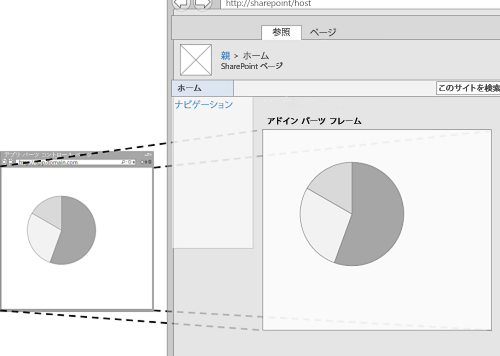
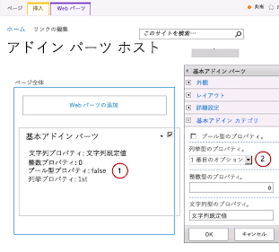
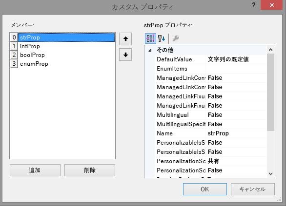
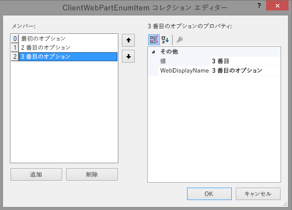
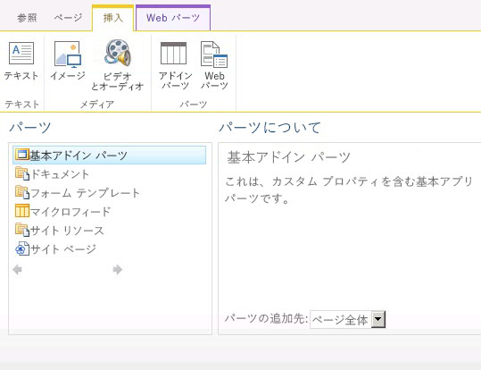
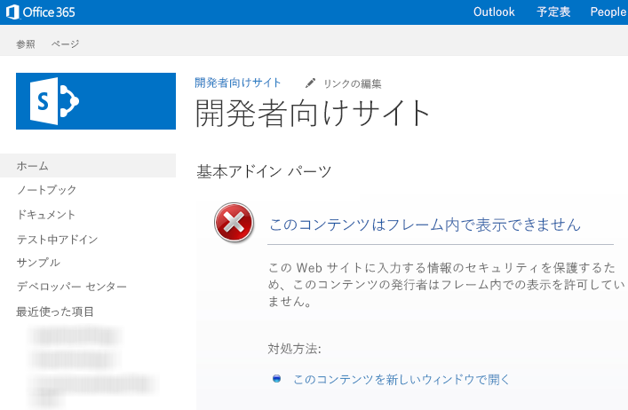

# アドイン パーツを作成して SharePoint アドインと共にインストールする
SharePoint 2013でアドイン パーツを作成する方法について説明します。作成したアドイン パーツは、SharePoint アドインをインストールしたときにホスト Web の Web パーツ ギャラリーから使用できます。
アドイン パーツを使用すれば、SharePoint Web サイト ページでアドイン ユーザー エクスペリエンスを適切に表示することができます。 [ホスト Web](http://msdn.microsoft.com/library/fp179925.aspx) ページで **IFrame** (フレーム) を使用して指定した Web ページ (多くの場合、対話形式または動的データ表示) は、アドイン パーツによって表示されます。アドイン パーツにの背景情報については、次の記事を参照してください。
  
    
    


-  [UI からのアドインへのアクセス](important-aspects-of-the-sharepoint-add-in-architecture-and-development-landscap.md#AccessingApp)
    
  
-  [SharePoint アドインの UX 設計](ux-design-for-sharepoint-add-ins.md)
    
  
-  [アドインの SharePoint UI を拡張する](sharepoint-add-ins-ux-design-guidelines.md#UXGuide_Extending)
    
  

図 1 に、SharePointページでのアドイン パーツ コンテンツの表示方法を示します。
  
    
    


**図 1. SharePoint ページに表示されるアドイン パーツのコンテンツ**

  
    
    

  
    
    

  
    
    
アドイン パーツは **ClientWebPart** クラスを使用して実装され、すべての Web パーツと同様、ユーザーがアドイン パーツを含む SharePoint アドイン をインストールした場合に、Web パーツ ギャラリーに表示されます。ユーザーは、提供されたプロパティを使用して、アドイン パーツをさらにカスタマイズできます。(アドイン パーツで構成可能なプロパティの例については、下の図 2 を参照。)この記事の例では、SharePoint ではなく、リモート サーバーにホストされている Web ページをコンテンツ ページとして使用します。後述の「 [その他の一般的なシナリオのアドイン パーツ](#SP15Createappparts_Nextsteps)」で説明するように、アドイン パーツのコンテンツをホストするには SharePoint ページも使用できることに留意してください。
## この記事の例を使用するための前提条件
<a name="SP15Createappparts_Prereq"> </a>

この例の手順を実行するには、次のものが必要です。
  
    
    

- Visual Studio
    
  
- Microsoft Office Developer Tools for Visual Studio
    
  
- SharePoint の開発環境。開発環境のセットアップで不明点がある場合は、「 [プロバイダー ホスト型 SharePoint アドインの作成を始める](get-started-creating-provider-hosted-sharepoint-add-ins.md)」を参照してください。
    
  

  
    
    

## ホスト Web にインストールするアドイン パーツを作成する
<a name="SP15Createappparts_Codeexample"> </a>

アドイン パーツを作成し、ホスト Web にインストールするには、次のタスクが必要です。
  
    
    

1. SharePoint アドインとリモート Web プロジェクトを作成します。
    
  
2. アドイン パーツ コンテンツのフォームを追加する
    
  
3. SharePoint アドイン プロジェクトにアドイン パーツを追加します。
    
  
タスクを完了した後、アドイン パーツが編集モードの場合、アドイン パーツは図 2 のようになります。この図には、(1) SharePoint ページに表示されるアドイン コンテンツ、および (2) アドイン パーツのカスタム プロパティが表示されています。
  
    
    

**図 2. 基本アドイン パーツをホストする SharePoint ぺージ**

  
    
    

  
    
    

  
    
    

### アドイン パーツ コンテンツのフォームを追加する


1. プロバイダー ホスト型 SharePoint アドイン を  [プロバイダー ホスト型 SharePoint アドインの作成を始める](get-started-creating-provider-hosted-sharepoint-add-ins.md) の説明のように作成しますが、プロジェクトの名前をTestAppPart にします。
    
  
2. Visual Studio ソリューションの作成後、(SharePoint アドイン プロジェクトではなく) Web アプリケーション プロジェクトを右クリックして、[ **追加**] > [ **新しい項目**] > [ **Web**] > [ **Web フォーム**] を選択して、新しい Web フォームを追加します。フォームに AppPartContent.aspx という名前を付けます。
    
  
3. AppPartContent.aspx ファイルで、html 要素全体と子を、以下の HTML コードで置き換えます。html 要素上にあるすべてのマークアップはそのままにします。HTML コードには、次のタスクを実行する JavaScript が含まれます。
    
  - クエリ文字列から既定のプロパティ値を抽出する
    
  
  - プロパティ値を表示する
    
  

    コードではクエリ文字列のパラメーターが想定されています。アドイン パーツは、Web ページで使用できるようにクエリ文字列によってカスタム プロパティを指定します。次のタスクは、カスタム プロパティを宣言する方法、およびそのプロパティをアドイン Web ページで利用できるようにする方法を説明します。
    


  ```HTML
  
<html>
    <body>
        <div id="content">
            <!-- Placeholders for properties -->
            String property: <span id="strProp"></span><br />
            Integer property: <span id="intProp"></span><br />
            Boolean property: <span id="boolProp"></span><br />
            Enumeration property: <span id="enumProp"></span><br />
        </div>

    <!-- Main JavaScript function, controls the rendering
         logic based on the custom property values -->
    <script lang="javascript">
        "use strict";

        var params = document.URL.split("?")[1].split("&amp;");
        var strProp;
        var intProp;
        var boolProp;
        var enumProp;

        // Extracts the property values from the query string.
        for (var i = 0; i < params.length; i = i + 1) {
            var param = params[i].split("=");
            if (param[0] == "strProp")
                strProp = decodeURIComponent(param[1]);
            else if (param[0] == "intProp")
                intProp = parseInt(param[1]);
            else if (param[0] == "boolProp")
                boolProp = (param[1] == "true");
            else if (param[0] == "enumProp")
                enumProp = decodeURIComponent(param[1]);
        }

        document.getElementById("strProp").innerText = strProp;
        document.getElementById("intProp").innerText = intProp;
        document.getElementById("boolProp").innerText = boolProp;
        document.getElementById("enumProp").innerText = enumProp;
    </script>
    </body>
</html>
  ```

4. ファイルを保存して閉じます。
    
  

### SharePoint アドイン プロジェクトにアドイン パーツを追加する


1. (Web アプリケーション プロジェクトではなく) SharePoint アドイン プロジェクトを右クリックし、[ **追加**] > [ **新しい項目**] > [ **Office/SharePoint**] > [ **クライアント Web パーツ (ホスト Web)**] を選択します。("クライアント Web パーツ" は、"アドイン パーツ" の別の呼び方です。)
    
  
2. パーツの名前を「基本アドイン パーツ」にします。
    
  
3. [ **クライアント Web パーツ ページの指定**] ダイアログ ボックスで、[ **既存の Web ページの URL を選択または入力する**] を選択します。ドロップダウン リストで [ **TestAppWebPart/AppPartContent.aspx** ] ページを選択します。(選択すると、ページの URL がボックスに表示され、"TestAppWebPart" が **~remoteAppUrl** に置き換わり、 **{StandardTokens }** がクエリ パラメーターに追加されています。)
    
  
4. [ **完了**] を選択します。
    
  
5. **ソリューション エクスプローラー**で [ **基本アドイン パーツ**] 右クリックして、[ **プロパティ**] を選択します。
    
  
6. [ **プロパティ**] ペインで、[ **カスタム プロパティ**] を選択し、吹き出し ( **...**) ボタンを選択します。
    
  
7. [ **カスタム プロパティ**] ダイアログを使用して、アドイン パーツに 4 つのカスタム プロパティを追加します。4 つのカスタム プロパティに、それぞれ 5 つの属性を設定する必要があります。属性名と値を表 1 に示します。次の手順を使用して、プロパティを作成します。
    
1. [ **追加**] を選択します。
    
  
2. 属性リストで、最初の属性 **DefaultValue** を表 1 から選択します。
    
  
3. 値を文字列の既定値などに設定します。
    
  
4. 次の属性 **Name** を選択して、値をstrProp などに設定します。
    
  
5. 属性 **Type**、 **WebCategory**、 **WebDisplayName** まで続行します。
    
  
6. [ **追加**] をもう一度選択して、表 1 の 4 つの行ですべてのプロセスを繰り返します。ダイアログを *閉じないでください*  。
    
   **表 1. アドイン パーツのカスタム プロパティの属性**


|**DefaultValue**|**名前**|**型**|**WebCategory**|**WebDisplayName**|
|:-----|:-----|:-----|:-----|:-----|
|文字列の既定値  <br/> |strProp  <br/> |文字列  <br/> |基本アドイン パーツ カテゴリ  <br/> |文字列型のプロパティ  <br/> |
|0  <br/> |intProp  <br/> |整数  <br/> |基本アドイン パーツ カテゴリ  <br/> |整数型のプロパティ  <br/> |
|false  <br/> |boolProp  <br/> |ブール型  <br/> |基本アドイン パーツ カテゴリ  <br/> |ブール型のプロパティ  <br/> |
|1st  <br/> |enumProp  <br/> |列挙  <br/> |基本アドイン パーツ カテゴリ  <br/> |列挙型のプロパティ  <br/> |
   

    この時点で、ダイアログは、次のようになります。
    

   **ClientWebPart 用のカスタム プロパティ ダイアログ**

  

     
  

  

  
8. **enumProp** プロパティを選択して、 **EnumItems** 属性を選択し、吹き出し ( **...**) ボタンを選択します。
    
  
9. **ClientWebPartEnumItem コレクション エディター**を使用して 3 つの項目を追加します。3 つのそれぞれに 2 つの属性を設定する必要があります。属性の名前と値は、表 2 にまとめています。次の手順を使用して、プロパティ作成します。
    
1. [ **追加**] を選択します。
    
  
2. 属性リストで、最初の属性 **Value** を表 2 から選択します。
    
  
3. 属性の値を 1st などに設定します。
    
  
4. 次の属性 **WebDisplayName** を選択して、値をFirst option などに設定します。
    
  
5. [ **追加**] をもう一度選択して、表 2 のすべての行でプロセスを繰り返します。
    
   **表 2. enumProp プロパティの列挙型アイテム**


|**値**|**WebDisplayName**|
|:-----|:-----|
|1st  <br/> |1 番目のオプション  <br/> |
|2nd  <br/> |2 番目のオプション  <br/> |
|3rd  <br/> |3 番目のオプション  <br/> |
   

    完了したら、ダイアログは次のようになります。
    

   **ClientWebPartEnumItem コレクション エディター**

  

     
  

  

  
6. [ **OK**] を選択してダイアログを閉じ、もう一度 [ **OK**] を選択して [ **カスタム プロパティ**] ダイアログを閉じます。
    
  
10. Visual Studio は、アドイン パーツの elements.xml ファイルに次の XML コードを生成します (わかりやすくするために改行を追加しています)。 **ClientWebPart** 要素の **Title** 属性が "Basic add-in part Title" に設定され、説明が "Basic add-in part Description" に設定されます。1 つ目から "Title" という単語を削除し、2 つ目をA basic add-in part で置き換えます。
    
  ```XML
  
<?xml version="1.0" encoding="UTF-8"?>
<Elements xmlns="http://schemas.microsoft.com/sharepoint/">
    <ClientWebPart
        Name="Basic add-in part"
        Title="Basic add-in part Title"
        Description="Basic add-in part Description" >
        
        <!--  The properties are passed through the query string 
                using the following notation: _propertyName_
                in the Src property of the Content element.  
          -->
        <Content
            Src="~remoteAppUrl/AppPartContent.aspx?strProp=_strProp_&amp;amp;intProp=_intProp_&amp;amp;boolProp=_boolProp_&amp;amp;enumProp=_enumProp_"
            Type="html"/>
        <Properties>
            <Property
                Name="strProp"
                Type="string"
                RequiresDesignerPermission="true"
                DefaultValue="String default value"
                WebCategory="Basic add-in part category"
                WebDisplayName="A property of type string.">
            </Property>
            <Property
                Name="intProp"
                Type="int"
                RequiresDesignerPermission="true"
                DefaultValue="0"
                WebCategory="Basic add-in part category"
                WebDisplayName="A property of type integer.">
            </Property>
            <Property
                Name="boolProp"
                Type="boolean"
                RequiresDesignerPermission="true"
                DefaultValue="false"
                WebCategory="Basic add-in part category"
                WebDisplayName="A property of type boolean.">
            </Property>
            <Property
                Name="enumProp"
                Type="enum"
                RequiresDesignerPermission="true"
                DefaultValue="1st"
                WebCategory="Basic add-in part category"
                WebDisplayName="A property of type enum.">
                <EnumItems>
                    <EnumItem WebDisplayName="First option" Value="1st"/>
                    <EnumItem WebDisplayName="Second option" Value="2nd"/>
                    <EnumItem WebDisplayName="Third option" Value="3rd"/>
                </EnumItems>
            </Property>
        </Properties>
    </ClientWebPart>
</Elements>               

  ```


### ホスト Web のホーム ページにアドインのスタート ページを設定します。


1. 続きのサンプル SharePoint アドイン にはアドイン Web がなく、リモート Web アプリケーションは、フォームをホストするためにのみ存在します。このアドインでは、完全なページの没入型のエクスペリエンスはありません。このため、アドインのスタート ページをホスト Web のホーム ページに設定する必要があります。
    
    初めに、 **ソリューション エクスプローラー**で (Web アプリケーション プロジェクトではなく) SharePoint アドイン プロジェクトを選択し、プロトコルを含む [ **サイト URL**] プロパティの値をクリップボードにコピーします ( **https://contoso.sharepoint.com** など)。
    
  
2. アドインのマニフェストを開き、URL を [ **スタート ページ**] ボックスに貼り付けます。
    
  
3. Default.aspx ページは SharePoint アドイン で使用されないため、必要に応じて Web アプリケーション プロジェクトから削除します。
    
  

### ソリューションの構築とテスト


1. F5 キーを押します。
    
    > **メモ**
      > F5 キーを押すと、Visual Studio がソリューションを構築して、アドインをインストールし、アドインのアクセス許可ページを開きます。 
2. [ **信頼する**] ボタンをクリックします。
    
  
3. アドイン パーツ ギャラリーから [ **基本アドイン パーツ**] を追加します。詳細については、「 [ページにアドイン パーツを追加する](https://support.office.com/article/Add-an-App-Part-to-a-page-6f06c0b7-44b8-4c69-b4ad-85197eee8d78)」を参照してください。
    
    アドインがホスト Web にインストールされている場合、アドイン パーツ ギャラリーで [ **基本アドイン パーツ**] を利用できます。図 3 のようになります。
    

   **図 3. アドイン パーツ ギャラリーのアドイン パーツ**

  

     
  

  

  
4. アドイン パーツを追加したら、タイトル [ **基本アドイン パーツ**] の右にある下矢印を選択して、[ **Web パーツの編集**] を選択します。
    
    上記の図 1 のように編集モードでアドイン パーツが表示されます。
    
  
5. [ **基本アドイン パーツ カテゴリ**] を開き、プロパティの値をいくつか変更します。
    
  
6. [ **OK**] をクリックして変更内容を保存し、アドイン パーツでプロパティが変更されていることを確認します。
    
  
7. デバッグ セッションが終了し、このプロジェクトでしばらくの間 F5 を再び使用しない場合は、最後に SharePoint アドイン を取り消し、テスト アドイン パーツをホーム ページから確実に削除することをお勧めします。SharePoint アドイン プロジェクトを右クリックして、[ **取り消し**] を選択します。
    
  

## トラブルシューティング
<a name="SP15Createappparts_Codeexample"> </a>


**表 3. ソリューションのトラブルシューティング**


|**問題**|**解決策**|
|:-----|:-----|
|アドイン パーツがコンテンツを全く表示しません。アドイン パーツに、" **Web ページへのナビゲーションは取り消されました** " というエラーが表示されます。ブラウザーがコンテンツ ページをブロックしたため、このエラーが発生しました。 <br/> | 混在コンテンツを有効にします。手順は、使用しているブラウザーによって異なります。 <br/>  Internet Explorer 9 および 10 では、ページの下部に " **セキュリティで保護されているコンテンツのみ表示されます。** " というメッセージが表示されます。[ **すべてのコンテンツを表示**] を選択して、アドイン パーツ コンテンツを表示します。  <br/>  Internet Explorer 8 では、ダイアログ ボックスで " **セキュリティで保護された Web ページ コンテンツのみを表示しますか?** " というメッセージが表示されます。[ **いいえ**] を選択して、アドイン パーツ コンテンツを表示します。  <br/>  また、使用しているインターネット ゾーンで混在コンテンツを有効にすることもできます。ほとんどの開発者の場合、インターネット ゾーンは **ローカル イントラネット** です。他のインターネット ゾーンを使用している場合、使用しているインターネット ゾーンを **ローカル イントラネット**に置き換えてください。  <br/>  Internet Explorer で [ **ツール**] > [ **インターネット オプション**] をクリックします。  <br/>  [ **インターネット オプション**] ダイアログ ボックスの [ **セキュリティ**] タブで、[ **ローカル イントラネット**] を選択し、[ **レベルのカスタマイズ**] をクリックします。  <br/>  [ **セキュリティ設定**] ダイアログ ボックスで、[ **その他**] セクションの [ **混在したコンテンツを表示する**] を有効にします。  <br/> |
   

## その他の一般的なシナリオのアドイン パーツ
<a name="SP15Createappparts_Nextsteps"> </a>

この記事では、リモート Web ページをコンテンツ ページとして使用して、カスタム プロパティで基本アドイン パーツを作成する方法について説明しました。さらに、次のシナリオや、アドイン パーツに関する詳細を調べることもできます。
  
    
    

### SharePoint ページをコンテンツ ページとして使用する

ほとんどの場合、Web ページが応答で **X-Frame-Options** HTTP ヘッダーを送信すると、フレーム内に Web ページを表示できません。既定では、SharePoint ページに **X-Frame-Options** ヘッダーが含まれています。アドイン Web でホストされている SharePoint Web ページを使用すると、エラー " **このコンテンツはフレーム内で表示できません** " が発生する場合があります (図 4 を参照)。
  
    
    

**図 4. フレーム内にコンテンツを表示できないアドイン パーツ**

  
    
    

  
    
    

  
    
    
フレーム内に Web ページを表示すると、シナリオによっては " [ClickJacking](http://blogs.msdn.com/b/ieinternals/archive/2010/03/30/combating-clickjacking-with-x-frame-options.aspx)" 攻撃の影響を受けやすいので注意してください。アドイン パーツ シナリオを慎重に評価し、 **ClickJacking** 攻撃を受ける危険性がないことを確認してください。
  
    
    
アドイン Web でホストされるページが ClickJacking 攻撃の影響を受けにくい場合は、 **AllowFraming** Web パーツを使用して、ページの応答からの **X-Frame-Options** ヘッダーを抑制できます。次のコード例では、SharePoint ページで **AllowFraming** Web パーツを使用する方法を示しています。このマークアップをアドイン Web でホストされるページにコピーします。ページの最初の **asp:content** 要素の上に置きます。他の要素の子にはしないようにしてください。
  
    
    


```XML

<WebPartPages:AllowFraming ID="AllowFraming1" runat="server" />
```

SharePoint ページをコンテンツ ページとして使用する方法を示す [アドイン パーツ コード サンプル](http://code.msdn.microsoft.com/SharePoint-2013-Display-be8dac16)をダウンロードできます。
  
    
    

### アドイン パーツのサイズ変更

アドイン パーツで動的コンテンツを使用する場合は、コンテンツの幅と高さを変更することが可能です。動的コンテンツは、その特性から、フレームに収まらない場合があります。また、余白が大きくなりすぎる可能性もあります。動的コンテンツを使用すると、アドイン パーツ宣言での固定サイズの指定が難しいことがあります。ただし、フレームのサイズは、コンテンツの幅と高さに合うように変更することができます。
  
    
    
コンテンツの Web ページから POST メッセージを使用して、フレームのサイズを指定できます。次の JavaScript の例は、POST メッセージを送信して、アドイン パーツがホストされているフレームをサイズ変更する方法を示しています。通常、これはページから呼び出す JavaScript ファイルの JavaScript メソッドで指定します。たとえば、ページには、アドイン パーツ ウィンドウのサイズをユーザーが指定するコントロールを指定できます。カスタム メソッドは、コントロールの **onchange** ハンドラーから呼び出されます。完全なサンプルについては、「 [コード サンプル: SharePoint アドインでアドイン パーツを動的にサイズ変更する](http://code.msdn.microsoft.com/officeapps/SharePoint-2013-Resize-app-594acc88)」を参照してください。
  
    
    


```
window.parent.postMessage("<message senderId={SenderId}>resize(120, 300)</message>", {hostweburl});
```

上の例で、 **senderId** の値は、ページがレンダリングされるときにアドイン パーツのコードによって自動的にページのクエリ文字列に設定されます。ページでは、クエリ文字列から **SenderId** の値を読み取って、それをサイズ変更要求のときに使用することだけが必要です。 **StandardTokens** または **HostUrl** トークンをアドイン パーツ定義の **Src** 属性に追加して、クエリ文字列からホスト Web URL を取得できます。動的にサイズを変更するアドイン パーツを表示する [アドイン パーツ コード サンプル](http://code.msdn.microsoft.com/officeapps/SharePoint-2013-Resize-app-594acc88)をダウンロードできます。
  
    
    

### アドイン パーツ コンテンツで SharePoint スタイル シートを使用する

アドイン パーツは SharePoint ページ内でホストされるので、アドイン パーツ コンテンツをページのパーツであるかのように見せることをお勧めします。同様の外観を実現するには、アドイン パーツをホストしている SharePoint ページとして同じスタイル クラスを使用します。SharePoint Web サイトのスタイル シートをアドイン パーツで利用できるようにするには、アドイン Web から **defaultcss.ashx** ファイルへの参照を追加します。
  
    
    
SharePoint アドインで **defaultcss.ashx** ファイルを参照する方法の説明については、「 [SharePoint アドインで SharePoint Web サイトのスタイル シートを使用する](use-a-sharepoint-website-s-style-sheet-in-sharepoint-add-ins.md)」を参照してください。さらに、 [coffeemaker コード サンプル](http://code.msdn.microsoft.com/office/SharePoint-2013-App-part-9d83703c)をダウンロードして、スタイル シートを参照するアドイン パーツを確認することもできます。
  
    
    

### アドイン パーツが編集モードである場合を検出する

ユーザーはアドイン パーツを編集してプロパティを変更できます。たとえば、ユーザーがアドイン パーツの **Appearance** プロパティや **Layout** プロパティのいずれかを変更するかもしれません。(下の図 2 を参照) アドイン パーツが編集モードである場合、レンダリング ロジックを変更したり不要な処理が実行されたりすることを防ぐことができます。たとえば、ホスト ページが再読み込みされるたびに、バックエンド データベースを呼び出すアドイン パーツです。編集モードでアドイン パーツのプロパティ値が変更になると、ページの再読み込みが実行されますが、そのような場合にはネットワーク呼び出しが望ましくないかもしれません。ユーザーがアドイン パーツを編集中かどうかは、 **_editMode_** トークンを使用して検出することができます。
  
    
    
 **_editMode_** トークンを使用するには、アドイン パーツ宣言で **Content** 要素の **Src** 属性にクエリ文字列パラメーターを追加します。
  
    
    


```XML
<Content Src="content_page_url&amp;amp;editmode=_editMode_">
```

 **_editMode_** トークンによって、コンテンツ ページではアドイン パーツが編集モードであるかどうかを判定できます。アドイン パーツが編集モードである場合、 **_editMode_** トークンは 1 に解決されます。それ以外の場合、トークンは 0 に解決されます。
  
    
    

## その他の技術情報
<a name="SP15Createappparts_AddResources"> </a>


-  [コード サンプル: アドイン パーツを使用してホスト Web にリモート アドイン コンテンツを表示する](http://code.msdn.microsoft.com/SharePoint-2013-Display-03c28286)
    
  
-  [コード サンプル: アドイン パーツを使用してホスト Web にアドイン Web コンテンツを表示する](http://code.msdn.microsoft.com/SharePoint-2013-Display-be8dac16)
    
  
-  [コード サンプル: SharePoint アドインでアドイン パーツのサイズを動的に変更する](http://code.msdn.microsoft.com/officeapps/SharePoint-2013-Resize-app-594acc88)
    
  
-  [コード サンプル: coffeemaker アドイン パーツを使用してリモート Web ページ コンテンツを表示する](http://code.msdn.microsoft.com/SharePoint-2013-App-part-9d83703c)
    
  
-  [SharePoint アドインのオンプレミスの開発環境をセットアップする](set-up-an-on-premises-development-environment-for-sharepoint-add-ins.md)
    
  
-  [SharePoint アドインの UX 設計](ux-design-for-sharepoint-add-ins.md)
    
  
-  [SharePoint アドインの UX 設計ガイドライン](sharepoint-add-ins-ux-design-guidelines.md)
    
  
-  [SharePoint 2013 での UX コンポーネントの作成](create-ux-components-in-sharepoint-2013.md)
    
  
-  [SharePoint アドインの設計オプションを考慮するときの 3 つの方法](three-ways-to-think-about-design-options-for-sharepoint-add-ins.md)
    
  
-  [SharePoint アドインのアーキテクチャおよび開発環境に関する重要な要素](important-aspects-of-the-sharepoint-add-in-architecture-and-development-landscap.md)
    
  

