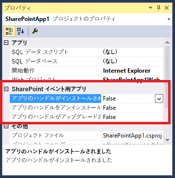

# SharePoint アドインでアドイン イベント レシーバーを作成する
SharePoint アドイン の SharePoint アドイン のインストール イベントとアンインストール イベント用ハンドラーを作成します。
## 前提条件
<a name="SP15appevent_prereq"> </a>

この記事では、プロバイダー向けのホスト型 SharePoint アドインについて理解していること、少なくとも「Hello World」レベル以上のものを開発した経験があることを前提としています。また、 [SharePoint アドインのイベントの処理](handle-events-in-sharepoint-add-ins.md)について精通している必要もあります。 


## 詳細なコード サンプルを取得する
<a name="SP15appevent_prereq"> </a>

この記事で継続的に用いられている例には、完成したコード サンプルが含まれています。以下にその他のサンプルをいくつか示します。これらのサンプルはこの記事で説明されているアーキテクチャには従っていません。アドイン イベント レシーバーを構築するための優れた方法は 1 つとは限らず、Microsoft のガイダンスも時間の経過とともに改良される可能性があることを銘記してください。 


-  [OfficeDev/PnP/Samples/Core.AppEvents.HandlerDelegation](https://github.com/OfficeDev/PnP/tree/master/Samples/Core.AppEvents.HandlerDelegation) は、この記事で継続して用いている例に近いものです。


-  [OfficeDev/PnP/Samples/Core.AppEvents](https://github.com/OfficeDev/PnP/tree/master/Samples/Core.AppEvents) は、ハンドラー委任ストラテジを使用できないシナリオで、前述の例と同じタスクを行う方法を示しています。


-  [OfficeDev/PnP/Samples/Core.EventReceivers](https://github.com/OfficeDev/PnP/tree/master/Samples/Core.EventReceivers)


-  [アドイン インストールをカスタマイズするプロバイダー向けのホスト型アドインの作成](https://code.msdn.microsoft.com/SharePoint-2013-Create-a-f27752e0)


## アドイン インストール イベント レシーバーを追加する
<a name="SP15appevent_prereq"> </a>


1. Visual Studio で、プロバイダー向けのホスト型 SharePoint アドイン用のプロジェクトを開きます (SharePoint ホスト型アドインにアドイン イベント ハンドラーを追加すると、Office Developer Tools for Visual Studio がプロバイダー向けのホスト型アプリに変換します)。


2. **ソリューション エクスプローラー**で、SharePoint アドインのノードを選択します。


3. [ **プロパティ**] ウィンドウで、[ **アドインのハンドルがインストールされました**] の値を [ **True**] に設定します。 

   **図 1. プロパティ ウィンドウのアドイン イベント**





Office Developer Tools for Visual Studio によって以下の事柄が実行されます。

  - スケルトン C# (または VB.NET) コードが含まれる AppEventReceiver.svc. という名前のファイルが追加されます。これは、アドイン イベントを処理するサービスです。


  -  `<InstalledEventEndpoint>~remoteAppUrl/AppEventReceiver.svc</InstalledEventEndpoint>` というエントリが AppManifest.xml ファイルの[ **プロパティ**] セクションに追加されます。このエントリにより、アドイン イベント レシーバーが SharePoint に登録されます ( **~remoteAppUrl** トークンは、プロバイダー向けのホスト型 SharePoint アドインのリモート Web アプリケーションに使用するのと同じトークンであることに注意してください。Office Developer Tools for Visual Studio では、Web アプリケーションとイベント ハンドラーのドメインは同じであると想定されます。稀なこととして、同じではない場合、 **~remoteAppUrl** トークンをサービスの実際のドメインに手動で置き換える必要があります)。


  - SharePoint アドイン プロジェクトにまだ Web プロジェクトがない場合、Office Developer Tools for Visual Studio によって作成されます。またツールにより、プロバイダー向けのホスト型アドイン用にアドイン マニフェストが構成されます。さらに、ページ、スクリプト、CSS ファイル、および他のアーティファクトも追加されます (これらについては、アドインで必要とするリモート コンポーネントがイベント処理 Web サービスのみの場合、プロジェクトから削除できます。アドイン マニフェスト内の **StartPage** 要素が、削除済みページを指さないようにしてください)。


4. Visual Studio を実行しているコンピューター上に SharePoint テストファームがない場合、Microsoft Azure サービス バスを使用してデバッグするようにプロジェクトを構成します。詳しくは、「 [SharePoint アドインでのリモート イベント レシーバーのデバッグとトラブルシューティング](debug-and-troubleshoot-a-remote-event-receiver-in-a-sharepoint-add-in.md)」をご覧ください。 


5. AppEventReceiver.svc ファイルに  `ProcessOneWayEvent` メソッドがある場合、このメソッドの実装には `throw new NotImplementedException();` 行だけを含める必要があります。このメソッドはアドイン イベント ハンドラーでは使用できないからです。 *アドイン イベント ハンドラーが、イベントが終了したかそれともロールバックされたかを SharePoint に通知するオブジェクトを戻す必要があり、 `ProcessOneWayEvent` メソッドは何も戻しません。* 


6. このファイルには、以下のような  `ProcessEvent` メソッドが含まれます (クライアント コンテキストの取得方法を示すコード ブロックもあることがあります。削除するか、コメントアウトしてください)。

    このコードの以下の点に注目してください。

  -  [SPRemoteEventProperties](https://msdn.microsoft.com/library/Microsoft.SharePoint.Client.EventReceivers.SPRemoteEventProperties.aspx) オブジェクトは、SOAP メッセージとしてハンドラー Web サービスに送信されます。それには、イベントを識別する [EventType](https://msdn.microsoft.com/library/Microsoft.SharePoint.Client.EventReceivers.SPRemoteEventProperties.EventType.aspx) プロパティなど、SharePoint からのコンテキスト情報が含まれます。


  - ハンドラーが戻す  [SPRemoteEventResult](https://msdn.microsoft.com/library/Microsoft.SharePoint.Client.EventReceivers.SPRemoteEventResult.aspx) オブジェクトには、 [Status](https://msdn.microsoft.com/library/Microsoft.SharePoint.Client.EventReceivers.SPRemoteEventResult.Status.aspx) プロパティが含まれます。このプロパティで可能な値は、 [SPRemoteEventServiceStatus](https://msdn.microsoft.com/library/Microsoft.SharePoint.Client.EventReceivers.SPRemoteEventServiceStatus.aspx) . **Continue**、 **SPRemoteEventServiceStatus.CancelNoError**、 **SPRemoteEventServiceStatus.CancelWithError** です。 **Status** プロパティの既定値は **Continue** で、この場合には SharePoint にイベントの終了が通知されます。他の 2 つの値は SharePoint に以下の内容を通知します。

  - さらに最大 3 回までハンドラーを実行します。


  - 引き続きキャンセル ステータスを取得する場合には、イベントをキャンセルし、そのイベントの一部として実行されたすべての操作をロールバックします。 


 ```cs

public SPRemoteEventResult ProcessEvent(SPRemoteEventProperties properties)
{
    SPRemoteEventResult result = new SPRemoteEventResult();

    return result;
}
 ```

7.  `result` 変数を宣言する行のすぐ下に、処理するイベントを特定する以下のスイッチ構造を追加します。

 ```cs

switch (properties.EventType)
{
    case SPRemoteEventType.AppInstalled:
        break;
    case SPRemoteEventType.AppUpgraded:
        break;
    case SPRemoteEventType.AppUninstalling:
        break;
}
 ```


> **メモ**
> **AppInstalled**、 **AppUpdated**、 **AppInstalling** の各イベント用のハンドラーがある場合、それらのイベントによりアドイン マニフェストに登録されている専用の URL が取得されます。そのため、それぞれでエンドポイントが異なる *可能性*  がありますが、この記事 (および Office Developer Tools for Visual Studio) ではエンドポイントはまったく同じであると想定しています。したがって、呼び出したイベントをコードによって判別する必要があります。
8. 「 [アドイン イベント ハンドラーにロールバック ロジックと「既に実行」ロジックを含める](handle-events-in-sharepoint-add-ins.md#Rollback)」で説明されているように、インストール ロジックにエラーがあるときには、ほとんどの場合、アドイン インストールをキャンセルし、SharePoint がインストールで行った操作内容を SharePoint にロールバックさせ、ハンドラーが実行したことをロールバックする必要があります。それを行う 1 つの方法として、AppInstalled イベント用の **case** 内に以下のコードを追加します。

 ```cs

case SPRemoteEventType.AppInstalled:
  try
  {
      // Add-in installed event logic goes here.
  }
  catch (Exception e)
  {
      result.ErrorMessage = e.ErrorMessage;
      result.Status = SPRemoteEventServiceStatus.CancelWithError;

      // Rollback logic goes here.
  }
  break;
 ```


> **メモ**
> 実行にかかる時間が 30 秒を超えるインストール コードは、アドイン自体の中に入れます。アドインの初回実行時に実行される「初回実行」ロジックにそれを追加することができます。「準備が整いました」というようなメッセージをアドインで表示できます。あるいは、初期化コードを実行するかどうかユーザーに尋ねるプロンプトをアドインで表示することもできます。 > 「初回実行」ロジックが適さないアドインの場合、別のオプションとして、イベント ハンドラーでリモートの非同期プロセスを開始し、その直後に **Status** が **Continue** に設定された [SPRemoteEventResult](https://msdn.microsoft.com/library/Microsoft.SharePoint.Client.EventReceivers.SPRemoteEventResult.aspx) オブジェクトを返すようにする方法があります。この方法の欠点は、そのリモート プロセスが失敗した場合に、SharePoint に対してアドインのインストールをロールバックするように通知する手段がないということです。
9.  [アドイン イベント ハンドラーのアーキテクチャ ストラテジ](handle-events-in-sharepoint-add-ins.md#Strategies)で説明したように、すべてのシナリオで必ずしも使用できるわけではありませんが、ハンドラー委任ストラテジはとても役立ちます。継続して用いている例では、ホスト Web にリストを追加するときにハンドラー委任ストラテジを実装する方法が示されています (ハンドラー委任ストラテジを使用しない、同様の AppInstalled イベント ハンドラーを作成する方法については、「 [OfficeDev/PnP/Samples/Core.AppEvents](https://github.com/OfficeDev/PnP/tree/master/Samples/Core.AppEvents)」のサンプルをご覧ください)。

    以下に、新しいバージョンの AppInstalled **case** ブロックを示します。すべてのイベントに適用される初期化ロジックは、 **switch** ブロックの上に配置されています。インストールされる同じリストは AppUninstalling ハンドラーで削除されることになるため、このリストはその場所で識別されます。


 ```cs

SPRemoteEventResult result = new SPRemoteEventResult();
String listTitle = "MyList";

switch (properties.EventType)
{           
    case SPRemoteEventType.AppInstalled:
                
   try
   {
        string error = TryCreateList(listTitle, properties);
        if (error != String.Empty)
        {
            throw new Exception(error);        
        }
   }
    catch (Exception e)
   {
        // Tell SharePoint to cancel the event.
        result.ErrorMessage = e.Message;
        result.Status = SPRemoteEventServiceStatus.CancelWithError;           
    }
        break;
    case SPRemoteEventType.AppUpgraded:
       break;
    case SPRemoteEventType.AppUninstalling:
       break;
}                  
 ```

10. リスト作成メソッドを、以下のコードを使用して **AppEventReceiver** クラスに **private** メソッドとして追加します。 `TokenHelper` クラスには、アドイン イベントのクライアント コンテキストを取得するために最適化されている特別なメソッドが含まれていることに注目してください。最後のパラメーターに **false** を渡すことにより、コンテキストがホスト Web 用であることが示されます。

 ```cs

private string TryCreateList(String listTitle, SPRemoteEventProperties properties)
 {
    string errorMessage = String.Empty;      

    using (ClientContext clientContext =
        TokenHelper.CreateAppEventClientContext(properties, useAppWeb: false))
    {
        if (clientContext != null)
        {
        }
    }
    return errorMessage;
}

 ```

11. ロールバック ロジックは基本的には例外処理ロジックで、SharePoint CSOM (クライアント側オブジェクト モデル) に含まれている  [ExceptionHandlingScope](https://msdn.microsoft.com/library/Microsoft.SharePoint.Client.ExceptionHandlingScope.aspx) により、Web サービスは例外処理を SharePoint サーバーに委任できます (「 [[方法] 例外処理範囲を使用する](http://msdn.microsoft.com/library/103619ef-1ba3-44e3-93e1-5e0685bc616e%28Office.15%29.aspx)」もご覧ください)。以下のコードを、前述のスニペットの **if** ブロックに追加します。

 ```cs

ExceptionHandlingScope scope = new ExceptionHandlingScope(clientContext);

using (scope.StartScope()) 
{ 
    using (scope.StartTry()) 
    { 
    }     
    using (scope.StartCatch()) 
    {                             
    } 
    using (scope.StartFinally()) 
    { 
    } 
} 
 clientContext.ExecuteQuery();

if (scope.HasException)
{
    errorMessage = String.Format("{0}: {1}; {2}; {3}; {4}; {5}", 
        scope.ServerErrorTypeName, scope.ErrorMessage, 
        scope.ServerErrorDetails, scope.ServerErrorValue, 
        scope.ServerStackTrace, scope.ServerErrorCode);
}
 ```

12. 前述のスニペットでは SharePoint に対する呼び出し ( **ExecuteQuery**) は 1 度だけですが、残念なことに 1 度にすべてを処理できません。例外スコープで参照するすべてのオブジェクトが最初にクライアントにロードされなければなりません。それで、以下のコードを **ExceptionHandlingScope** のコンストラクターの *上*  に追加します。

 ```cs

ListCollection allLists = clientContext.Web.Lists;
IEnumerable<List> matchingLists =
    clientContext.LoadQuery(allLists.Where(list => list.Title == listTitle));
clientContext.ExecuteQuery();

var foundList = matchingLists.FirstOrDefault();
 List createdList = null;
 ```

13. ホスト Web リストを作成するためのコードは  [StartTry](https://msdn.microsoft.com/library/Microsoft.SharePoint.Client.ExceptionHandlingScope.StartTry.aspx) ブロックに置きますが、このコードではまずリストがすでに追加されているかどうかをチェックする必要があります (「 [アドイン イベント ハンドラーにロールバック ロジックと「既に実行」ロジックを含める](handle-events-in-sharepoint-add-ins.md#Rollback)」をご覧ください)。 [ConditionalScope](https://msdn.microsoft.com/library/Microsoft.SharePoint.Client.ConditionalScope.aspx) クラスを使用すると、If-then-else ロジックを SharePoint サーバーに委任できます (「 [[方法] 条件範囲を使用する](http://msdn.microsoft.com/library/560112e9-c3ed-4b8f-9cd4-c8bc5d60d63c%28Office.15%29.aspx)」もご覧ください)。以下のコードを、 **StartTry** ブロック内に追加します。

 ```cs

ConditionalScope condScope = new ConditionalScope(clientContext,
        () => foundList.ServerObjectIsNull.Value == true, true);
using (condScope.StartScope())
{
    ListCreationInformation listInfo = new ListCreationInformation();
    listInfo.Title = listTitle;
    listInfo.TemplateType = (int)ListTemplateType.GenericList;
    listInfo.Url = listTitle;
    createdList = clientContext.Web.Lists.Add(listInfo);                            
}
 ```

14.  [StartCatch](https://msdn.microsoft.com/library/Microsoft.SharePoint.Client.ExceptionHandlingScope.StartCatch.aspx) ブロックはリストの作成を元に戻しますが、リストが作成されたかどうかを最初にチェックする必要があります。リストの作成が終了する前に **StartTry** ブロックで例外がスローされる可能性があるためです。以下のコードを、 **StartCatch** ブロックに追加します。

 ```cs

ConditionalScope condScope = new ConditionalScope(clientContext,
        () => createdList.ServerObjectIsNull.Value != true, true);
using (condScope.StartScope())
{
    createdList.DeleteObject();
} 
 ```


> **ヒント**
> **トラブルシューティング:** 必要なときに **StartCatch** ブロックに入るかどうかをテストするには、SharePoint サーバー上でランタイム例外をスローする仕組みが必要です。 **throw** を使用したりゼロで除算したりするという方法は機能しません。そうした方法は、クライアント ランタイムが ( **ExecuteQuery** メソッドを使用して) コードをバンドルしサーバーに送ることができるようになる前に、 *クライアント側*  例外を生じさせるからです。代わりに、以下の行を **StartTry** ブロックに追加します。これはクライアント側ランタイムでは受け入れられますが、サーバー側例外を生じさせる原因となり、上記の目的を果たせます。>  `List fakeList = clientContext.Web.Lists.GetByTitle("NoSuchList");`


 `clientContext.Load(fakeList);`

TryCreateList メソッド全体は、次のようになります ( [StartFinally](https://msdn.microsoft.com/library/Microsoft.SharePoint.Client.ExceptionHandlingScope.StartFinally.aspx) ブロックは、使用されていない場合であっても必要です)。


 ```cs

private string TryCreateList(String listTitle, SPRemoteEventProperties properties)
{
    string errorMessage = String.Empty;

    using (ClientContext clientContext = 
        TokenHelper.CreateAppEventClientContext(properties, useAppWeb: false))
    {
        if (clientContext != null)
        {
            ListCollection allLists = clientContext.Web.Lists;
            IEnumerable<List> matchingLists = 
                clientContext.LoadQuery(allLists.Where(list => list.Title == listTitle));
            clientContext.ExecuteQuery();
            var foundList = matchingLists.FirstOrDefault();
            List createdList = null;

            ExceptionHandlingScope scope = new ExceptionHandlingScope(clientContext); 
            using (scope.StartScope()) 
            { 
                using (scope.StartTry()) 
                { 
                    ConditionalScope condScope = new ConditionalScope(clientContext, 
                            () => foundList.ServerObjectIsNull.Value == true, true);
                    using (condScope.StartScope())
                    {
                        ListCreationInformation listInfo = new ListCreationInformation();
                        listInfo.Title = listTitle;
                        listInfo.TemplateType = (int)ListTemplateType.GenericList;
                        listInfo.Url = listTitle;
                        createdList = clientContext.Web.Lists.Add(listInfo);
                    }
                } 
            
                using (scope.StartCatch()) 
                { 
                    ConditionalScope condScope = new ConditionalScope(clientContext, 
                            () => createdList.ServerObjectIsNull.Value != true, true);
                    using (condScope.StartScope())
                    {
                        createdList.DeleteObject();
                    }
                } 

                using (scope.StartFinally()) 
                { 
                } 
            } 
            clientContext.ExecuteQuery();

            if (scope.HasException)
            {
                    errorMessage = String.Format("{0}: {1}; {2}; {3}; {4}; {5}", 
                    scope.ServerErrorTypeName, scope.ErrorMessage, 
                    scope.ServerErrorDetails, scope.ServerErrorValue, 
                    scope.ServerStackTrace, scope.ServerErrorCode);
            }
        }
    }
    return errorMessage;
}
 ```


> **ヒント**
> **デバッグ:** ハンドラー委任ストラテジを使用しているかどうかに関係なく、デバッガーでコードをステップ実行するときには、ハンドラーがキャンセル ステータスを返すすべてのシナリオにおいて、SharePoint は 3 回までを限度としてハンドラーを再度呼び出すことに注意してください。そのため、デバッガーは最大で 4 回、コード全体を繰り返します。

> **ヒント**
> **コード アーキテクチャ:** ハンドラー外で宣言型マークアップを使用して、アドイン Web にコンポーネントをインストールできるので、通常はハンドラーがアドイン Web と対話するために 30 秒以上必要とするということはありません。ただし、それが必要な場合には、アドイン Web 用に別の [ClientContext](https://msdn.microsoft.com/library/Microsoft.SharePoint.Client.ClientContext.aspx) オブジェクトがコードで必要となります。つまり、SQL Server データベースがアドイン Web とホスト Web とは異なるのと同じように、アドイン Web とホスト Web も別のコンポーネントです。そのため、アドイン Web を呼び出すメソッドは AppInstalled **case** ブロックの **try** ブロックに置きます。これは、継続的に用いている例の TryCreateList メソッドと同様です。ただし、ハンドラーがアドイン Web 上で行ったアクションをロールバックする必要は *ありません*  。エラーが発生する場合に必要となるのは、イベントのキャンセルだけです。イベントがキャンセルされると、SharePoint によってアドイン Web 全体が削除されるためです。

## アドイン アンインストール イベント レシーバーを作成する
<a name="SP15appevent_prereq"> </a>


1. プロジェクトの [ **アドインのハンドルをアンインストール中**] プロパティを [ **True**] に設定します。Web サービス ファイルがすでに存在する場合、ツールによって別のファイルが作成されるということは *ありません*  が、 **UninstallingEventEndpoint** 要素がアドイン マニフェストに追加されます。


2. AppUninstalling **case** ブロック内のコードにより、削除済みデータ バックアップからアドインが削除された後 (これによりイベントがトリガーされます) に、不要なアドインのアーティファクトを削除します。ただし、可能な場合には、完全に削除するのではなく、「使用中止」にする必要があります。アンインストール イベントをロールバックする必要が生じる場合にそれらを復元しなければならないためです。その場合、アドインはまだ削除済みデータ バックアップにあり、ユーザーがそれを復元して再び使用できます。稀なことですが、削除したコンポーネントをロールバック ロジックで再作成するだけでアドインが再び作動するようになることもありますが、コンポーネント内のデータや構成設定は失われます。

    このストラテジは SharePoint コンポーネントに関しては比較的簡単です。SharePoint には対象を復元可能なごみ箱があり、ごみ箱にアクセスするための CSOM API もあるからです。この手順の後の方で、その方法を示します。他のプラットフォームの場合、別の技法が必要にあることがあります。たとえば、アドイン アンインストール ハンドラーで SQL Server テーブルの行を使用中止にする場合、ハンドラーの T-SQL ストアド プロシージャにより IsDeleted 列をそのテーブルに追加し、それを対象行で **True** に設定します。プロシージャでエラーが発生すると、ロールバック ロジックにより値が **False** にリセットされます。エラーが発生することなくプロシージャが終了した場合、成功フラグを戻す直前に、タイマー ジョブを設定して後ほどその行を削除できます。

    アドインを削除した後にも、リストなどのデータを保持したい場合もあります。ただし、この記事の例として、以下に、インストールされたイベント ハンドラーによって作成されたリストを削除するアンインストール イベント ハンドラーを示します。


 ```cs

case SPRemoteEventType.AppUninstalling:

try
{
    string error = TryRecycleList(listTitle, properties);
    if (error != String.Empty)
    {
        throw new Exception(error);
    }
}
catch (Exception e)
{
    // Tell SharePoint to cancel the event.
    result.ErrorMessage = e.Message;
    result.Status = SPRemoteEventServiceStatus.CancelWithError;
}
break;
 ```

3. リストをリサイクルするためのヘルパー メソッドを追加します。このコードの以下の点に注目してください。

  - このコードは、リストを完全に削除するのではなく、リサイクルします。こうしておけば、イベントが失敗した場合、 **StartCatch** ブロックの実行内容 (データも含む) を復元できます。メソッドが正常に実行されてイベントが完了すると、アドインは削除済みデータ バックアップから完全に削除されますが、リストはごみ箱内に引き続き存在します。


  - このコードは、リストの存在をテストしてからそれをリサイクルします。ユーザーによって、SharePoint UI でリストが既にリサイクルされている場合があるためです。同様に、ロールバック コードはごみ箱にリストが存在するかどうかをチェックしてから、リストを復元します。ユーザーによって、既に復元されていたり、削除済みデータ バックアップに移動されていたりする場合があるからです。 


  - リストに対する参照が **null** かどうかをチェックしてリストの存在をテストする条件範囲が 2 つあります。どちらも、まったく同じオブジェクトに関して NULL かどうかを 2 度テストする内部 **if** ブロックがあります。条件範囲ブロックが含まれる外部テストはサーバー上で実行されますが、NULL かどうかの内部テストも必要です。クライアント ランタイムが、 **ExecuteQuery** メソッドがサーバーに送信する XML メッセージを作成するためのコードを行単位で移動するためです。 **foundList** オブジェクトと **recycledList** オブジェクトへの参照が見つかると、NULL かどうかの内部チェック内にそれらの行が含まれていない場合には、それらのいずれかの行により NULL 参照例外がスローされます。


 ```cs

private string TryRecycleList(String listTitle, SPRemoteEventProperties properties)
{
    string errorMessage = String.Empty;

    using (ClientContext clientContext = 
        TokenHelper.CreateAppEventClientContext(properties, useAppWeb: false))
    {
        if (clientContext != null)
        {
            ListCollection allLists = clientContext.Web.Lists;
            IEnumerable<List> matchingLists = 
                clientContext.LoadQuery(allLists.Where(list => list.Title == listTitle));
            RecycleBinItemCollection bin = clientContext.Web.RecycleBin;
            IEnumerable<RecycleBinItem> matchingRecycleBinItems = 
                clientContext.LoadQuery(bin.Where(item => item.Title == listTitle));    
            clientContext.ExecuteQuery();

            List foundList = matchingLists.FirstOrDefault();
            RecycleBinItem recycledList = matchingRecycleBinItems.FirstOrDefault();

            ExceptionHandlingScope scope = new ExceptionHandlingScope(clientContext);
            using (scope.StartScope())
            {
                using (scope.StartTry())
                {
                    ConditionalScope condScope = new ConditionalScope(clientContext, 
                        () => foundList.ServerObjectIsNull.Value == false, true);
                    using (condScope.StartScope())
                    {
                        if (foundList != null)
                        {
                            foundList.Recycle();
                        }
                    }
                }
                using (scope.StartCatch())
                {
                    ConditionalScope condScope = new ConditionalScope(clientContext, 
                         () => recycledList.ServerObjectIsNull.Value == false, true);
                    using (condScope.StartScope())
                    {
                        if (recycledList != null)
                        {
                            recycledList.Restore(); 
                        }
                    }
                }
                using (scope.StartFinally())
                {
                }
            }
            clientContext.ExecuteQuery();

            if (scope.HasException)
            {
                errorMessage = String.Format("{0}: {1}; {2}; {3}; {4}; {5}", 
                    scope.ServerErrorTypeName, scope.ErrorMessage, 
                    scope.ServerErrorDetails, scope.ServerErrorValue, 
                    scope.ServerStackTrace, scope.ServerErrorCode);
            }
        }
    }
    return errorMessage;
}
 ```


### アドイン アンインストール レシーバーをデバッグしてテストするには


1. 以下のページをそれぞれ別個のウィンドウまたはタブですべて開きます。

  - **サイト コンテンツ**


  - **サイトの設定 - ごみ箱** (_layouts/15/AdminRecycleBin.aspx?ql=1)


  - **ごみ箱 - 削除済みデータ バックアップ** (_layouts/15/AdminRecycleBin.aspxView=2&amp;?ql=1)


2. F5 キーを押して、プロンプトが表示されたらアドインを信頼します。アドインのスタート ページが開きます。アンインストール ハンドラーのテストのみを行う予定の場合、このブラウザー ウィンドウを閉じます。 *ただしハンドラーをデバッグする場合には、このウィンドウを開いたままにします。閉じると、デバッグ セッションが終了します。* 


3. [ **サイト コンテンツ**] ページを更新し、アドインが表示されたら削除します。


4. [ **サイトの設定 - ごみ箱**] ページを更新します。アドインが最上位項目として表示されます。横にあるチェックボックスを選択し、[ **選択項目の削除**] をクリックします。


5. [ **ごみ箱 - 削除済みデータ バックアップ**] ページを更新します。アドインが最上位項目として表示されます。横にあるチェックボックスを選択し、[ **選択項目の削除**] をクリックします。SharePoint によって、アドイン アンインストール ハンドラーがすぐに呼び出されます。


## アドイン更新イベント ハンドラーを作成する
<a name="SP15appevent_prereq"> </a>

アドイン更新ハンドラーの作成の詳細については、「 [SharePoint アドインで更新イベント用のハンドラーを作成する](create-a-handler-for-the-update-event-in-sharepoint-add-ins.md)」を参照してください。


## 運用環境でのアドイン イベント レシーバーの URL とホストの制限
<a name="SP15appevent_prereq"> </a>

アドイン イベント レシーバーは、クラウドか、オンプレミス サーバー (SharePoint サーバーとしても使用されているものは除く) でホストできます。運用環境のレシーバーの URL に特定のポートを指定することはできません。つまり、HTTPS のポート 443 (推奨) と HTTP のポート 80 のいずれかを使用する必要があります。HTTPS を使用し、レシーバー サービスをオンプレミスでホストしているが、アドインが Microsoft SharePoint Online 上にあるという場合には、ホスト サーバーに、公的に信頼される証明機関からの証明書が必要となります (自己署名証明書が有効になるのは、アドインがオンプレミスの SharePoint ファームにある場合のみです)。


## その他の技術情報
<a name="SP15appevent_addlresources"> </a>


-  [SharePoint アドインのイベントの処理](handle-events-in-sharepoint-add-ins.md)


