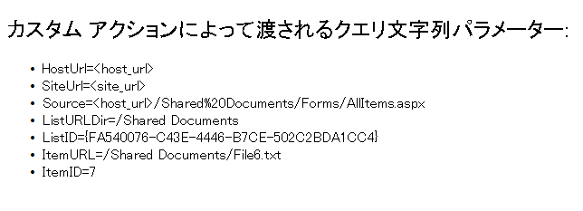

# カスタム アクションを作成して SharePoint アドインで展開する
SharePoint アドイン を展開するときにホスト Web に展開される、SharePoint のカスタム アクションを作成する方法を説明します。
SharePoint アドイン を作成する場合、カスタム アクションを利用することでホスト Web のリストおよびリボンを操作することが可能になります。カスタム アクションは、エンド ユーザーがアドインをインストールするときにホスト Web に展開されます。カスタム アクションはリモート Web ページを開くことができ、クエリ文字列を使って情報を渡すことも可能です。アドインでは、"リボン" と"メニュー アイテム" という 2 種類のカスタム アクションを使用できます。


## この記事の手順を行う上での前提条件
<a name="SP15Createcustomactionsapps_Prereq"> </a>

 [プロバイダー ホスト型 SharePoint アドインの作成を始める](get-started-creating-provider-hosted-sharepoint-add-ins.md) で説明してあるとおり、開発環境が必要です。


### カスタム アクションの理解に役立つ基本概念

カスタム アクション シナリオに含まれる概念および手順の理解に役立つ記事の一覧を次の表に示します。


**表 1. カスタム アクションの基本概念**


|**記事**|**説明**|
|:-----|:-----|
| [SharePoint アドイン](sharepoint-add-ins.md) <br/> |エンドユーザー向けの小型で使いやすいソリューションであるアドインを作成できる、SharePoint の新しいアドイン モデルについて説明します。  <br/> |
| [SharePoint アドインの UX 設計](ux-design-for-sharepoint-add-ins.md) <br/> |SharePoint アドインを作成するときのユーザー エクスペリエンス (UX) のオプションについて説明します。  <br/> |
| [SharePoint 2013 のホスト Web、アドイン Web、および SharePoint コンポーネント](host-webs-add-in-webs-and-sharepoint-components-in-sharepoint-2013.md) <br/> |ホスト Web と アドイン Web の違いについて説明します。SharePoint に含めることのできる SharePoint アドイン コンポーネント、ホスト Web に展開するコンポーネント、アドイン Web に展開するコンポーネント、およびアドイン Web を分離ドメインに展開する方法について説明します。  <br/> |
 

## コード例: ホスト Web ドキュメント ライブラリにカスタム アクションを作成する
<a name="SP15Createcustomactionsapps_Codeexample"> </a>

ホスト Web ドキュメント ライブラリにカスタム アクションを作成するには次の手順を行います。


1. SharePoint アドイン プロジェクトとリモート Web プロジェクトを作成します。


2. カスタム アクション フィーチャーを SharePoint アドイン プロジェクトに追加します。


3. アドイン Web ページを Web プロジェクトに追加します。


### SharePoint アドイン プロジェクトとリモート Web プロジェクトを作成する


1. 管理者として Visual Studio を開きます (そのためには、[ **スタート**] メニューの Visual Studio アイコンを右クリックし、[ **管理者として実行**] を選択します)。


2.  [プロバイダー ホスト型 SharePoint アドインの作成を始める](get-started-creating-provider-hosted-sharepoint-add-ins.md) で説明するように、プロバイダー向けのホスト型 SharePoint アドイン を作成して、CustomActionsApp という名前を付けます。


### カスタム アクションのアドイン Web ページを追加する


1. Visual Studio ソリューションの作成後、(SharePoint アドイン プロジェクトではなく) Web アプリケーション プロジェクトを右クリックして、[ **追加**] > [ **新しい項目**] > [ **Web**] > [ **Web フォーム**] を選択して、新しい Web フォームを追加します。フォームに CustomActionTarget.aspx という名前を付けます。


2. CustomActionTarget.aspx ファイルで、 **html** 要素全体と子を、以下の HTML コードで置き換えます。 **html** 要素上にあるすべてのマークアップはそのままにします。HTML コードには、次のタスクを実行する JavaScript が含まれます。

  - クエリ文字列パラメーターのプレースホルダーを提供します。


  - クエリ文字列からパラメーターを抽出します。


  - パラメーターをプレースホルダーの場所に書き出します。


    > **重要**
      > 選択されたアイテムがあるときには、ItemURL トークンと ItemID トークンのみ受け渡しされます。運用環境用の SharePoint アドイン では、アイテムが選択されていない状況については、コードで適切に処理する必要があります。この例では、アイテムが選択されていないことをユーザーに通知します。 

 ```HTML

<html xmlns="http://www.w3.org/1999/xhtml">
<head>
    <title>Custom action target</title>
</head>
<body>
    <h2>Query string parameters passed by the custom action:</h2>

    <!-- Placeholder for query string parameters -->
    <ul id="qsparams"/>

    <!-- Main JavaScript function, renders
         the query string parameters -->
    <script lang="javascript">
        var params = document.URL.split("?")[1].split("&amp;");
        var paramsHTML = "";
  
        // Extracts the parameters from the query string.
        // Parameters are URLencoded, decode for rendering
        // in page.
        for (var i = 0; i < params.length; i = i + 1) {
            params[i] = decodeURIComponent(params[i]);
            paramsHTML += "<li>" + params[i] + "</li>";
        }

         // Alert the user when no item has been selected.
         // (The SPListItemId is the 5th parameter.)
         if (params[5] === undefined) {
            paramsHTML += "<div> <h3> No item has been selected from the list.  Please select an item. </h3> </div> ";
         }

        // Render parameters in the placeholder.
        document.getElementById("qsparams").innerHTML =
            paramsHTML;
    </script>
</body>
</html>
 ```


### SharePoint アドイン プロジェクトにカスタム アクションのメニュー アイテムを追加する


1. SharePoint アドイン プロジェクトを右クリックして、[ **追加**] > [ **新しいアイテム**] > [ **Office/SharePoint**] > [ **メニュー項目カスタム動作**] を選択します。 


2. 既定の名前のままにして [ **追加**] を選択します。


3. [ **メニュー項目のカスタム動作の作成**] ウィザードがいくつか質問します。次の表の中から回答してください。

   **表 2. メニュー アイテムのカスタム アクションのプロパティ**


|**プロパティに関する質問**|**回答**|
|:-----|:-----|
|カスタム アクションをどこに公開しますか?  <br/> |[ **ホスト Web**] を選択します。  <br/> |
|カスタム アクションのスコープをどの範囲に設定しますか?  <br/> |[ **リスト テンプレート**] を選択します。  <br/> |
|カスタム アクションのスコープを特定のどのアイテムに設定しますか?  <br/> |[ **ドキュメント ライブラリ**] を選択します。  <br/> |
|メニュー アイテムのテキストはどのようにしますか?  <br/> |**My Custom Action** と入力します。 <br/> |
|カスタム アクションによる移動先はどこですか?  <br/> |[ **CustomActionAppWeb\\CustomActionTarget.aspx**] ページを選択します。  <br/> |
 
4. [ **完了**] を選択します。

    Visual Studio によって、メニュー アイテムのカスタム アクション フィーチャーの elements.xml ファイルに次のマークアップが生成されます。


 ```XML

<?xml version="1.0" encoding="utf-8"?>
<Elements 
    xmlns="http://schemas.microsoft.com/sharepoint/">
    <!-- RegistrationId attribute is the list type id,
        in this case, a document library (id=101). -->
  <CustomAction 
      Id="65695319-4784-478e-8dcd-4e541cb1d682.CustomAction"
      RegistrationType="List"
      RegistrationId="101"
      Location="EditControlBlock"
      Sequence="10001"
      Title="Invoke custom action">
    <!-- 
    Update the Url below to the page you want the custom action to use.
    Start the URL with the token ~remoteAppUrl if the page is in the
    associated web project, use ~appWebUrl if page is in the add-in project.
    -->
    <UrlAction Url=
"~remoteAppUrl/CustomActionTarget.aspx?{StandardTokens}&amp;amp;SPListItemId={ItemId}&amp;amp;SPListId={ListId}" />
  </CustomAction>
</Elements>

 ```

5. 次のクエリ パラメーターを **UrlAction** 要素の **Url** 属性の最後に追加します。

     `&amp;amp;SPSource={Source}&amp;amp;SPListURLDir={ListUrlDir}&amp;amp;SPItemURL={ItemUrl}`

    **UrlAction** 要素は次のようになります。

     ` <UrlAction Url= "~remoteAppUrl/CustomActionTarget.aspx?{StandardTokens}&amp;amp;SPListItemId={ItemId}&amp;amp;SPListId={ListId}&amp;amp;SPSource={Source}&amp;amp;SPListURLDir={ListUrlDir}&amp;amp;SPItemURL={ItemUrl}" />`


> **メモ**
> この例では、ユーザーがメニューからカスタム アクションを選択すると、リモート Web ページが全画面表示されます。カスタム メニュー アクションが **HostWebDialog** 属性を使用することにより、リモート Web ページをダイアログ ボックスで開くこともできます。詳細については、「 [SharePoint-Add-in-Localization](https://github.com/OfficeDev/SharePoint-Add-in-Localization)」を参照してください。 


### SharePoint アドイン プロジェクトにリボン カスタム アクションを追加する


1. SharePoint アドイン プロジェクトを右クリックして、[ **追加**] > [ **新しいアイテム**] > [ **Office/SharePoint**] > [ **リボンのカスタム アクション**] を選択します。 


2. 既定の名前のままにして [ **追加**] を選択します。


3. [ **ニュー項目のカスタム動作の作成**] ウィザードがいくつか質問します。次の表の中から回答してください。

   **表 3. リボンのカスタム アクションのプロパティ**


|**プロパティに関する質問**|**回答**|
|:-----|:-----|
|カスタム アクションをどこに公開しますか?  <br/> |[ **ホスト Web**] を選択します。  <br/> |
|カスタム アクションのスコープをどの範囲に設定しますか?  <br/> |[ **リスト テンプレート**] を選択します。  <br/> |
|カスタム アクションのスコープを特定のどのアイテムに設定しますか?  <br/> |[ **ドキュメント ライブラリ**] を選択します。  <br/> |
|コントロールをどこに配置しますか?  <br/> |[ **Ribbon.Documents.Manage**] を選択します。  <br/> |
|メニュー アイテムのテキストはどのようにしますか?  <br/> |**My Custom Ribbon Button** と入力します。 <br/> |
|カスタム アクションによる移動先はどこですか?  <br/> |[ **CustomActionAppWeb\\CustomActionTarget.aspx**] ページを選択します。  <br/> |
 
4. Visual Studio によって、リボンのカスタム アクション フィーチャーの elements.xml ファイルに次のマークアップが生成されます。

 ```XML

<?xml version="1.0" encoding="utf-8"?>
<Elements xmlns="http://schemas.microsoft.com/sharepoint/">
  <CustomAction Id="85691508-c076-4f43-93d4-96b4d5253a09.RibbonCustomAction1"
                RegistrationType="List"
                RegistrationId="101"
                Location="CommandUI.Ribbon"
                Sequence="10001"
                Title="Invoke &amp;apos;RibbonCustomAction1&amp;apos; action">
    <CommandUIExtension>
      <!-- 
      Update the UI definitions below with the controls and the command actions
      that you want to enable for the custom action.
      -->
      <CommandUIDefinitions>
        <CommandUIDefinition Location="Ribbon.Documents.Manage.Controls._children">
          <Button Id="Ribbon.Documents.Manage.RibbonCustomAction1Button"
                  Alt="My Custom Ribbon Button"
                  Sequence="100"
                  Command="Invoke_RibbonCustomAction1ButtonRequest"
                  LabelText="My Custom Ribbon Button"
                  TemplateAlias="o1"
                  Image32by32="_layouts/15/images/placeholder32x32.png"
                  Image16by16="_layouts/15/images/placeholder16x16.png" />
        </CommandUIDefinition>
      </CommandUIDefinitions>
      <CommandUIHandlers>
        <CommandUIHandler Command="Invoke_RibbonCustomAction1ButtonRequest"
                          CommandAction="~remoteAppUrl/CustomActionTarget.aspx?{StandardTokens}&amp;amp;SPListItemId={SelectedItemId}&amp;amp;SPListId={SelectedListId}"/>
      </CommandUIHandlers>
    </CommandUIExtension >
  </CustomAction>
</Elements> 

 ```

5. 次のクエリ パラメーターを **CommandAction** 要素の **CommandUIHandler** 属性の最後に追加します。

     `&amp;amp;SPSource={Source}&amp;amp;SPListURLDir={ListUrlDir}`

    **CommandUIHandler** 要素は次のようになります。

     ` <CommandUIHandler Command="Invoke_RibbonCustomAction1ButtonRequest" CommandAction="~remoteAppUrl/CustomActionTarget.aspx?{StandardTokens}&amp;amp;SPListItemId={SelectedItemId}&amp;amp;SPListId={SelectedListId}&amp;amp;SPSource={Source}&amp;amp;SPListURLDir={ListUrlDir}" />`

    > **メモ**
      > リボンのカスタム アクションは **SelectedListId** と **SelectedItemId** を使用します。 **ListId** と **ItemId** は、メニュー アイテムのカスタム アクションでのみ機能します。

### ホスト Web のホーム ページにアドインのスタート ページを設定する


1. 続きのサンプルでは、SharePoint アドイン にアドイン Web がなく、リモート Web アプリケーションは、フォームをホストするためにのみ存在します。このため、アドインの開始ページは、ホスト Web のホームページに設定する必要があります。 

    初めに、 **ソリューション エクスプローラー**で (Web アプリケーション プロジェクトではなく) SharePoint アドイン プロジェクトを選択し、プロトコルを含む [ **サイト URL**] プロパティの値をクリップボードにコピーします ( **https://contoso.sharepoint.com** など)。


2. アドインのマニフェストを開き、URL を [ **スタート ページ**] ボックスに貼り付けます。


3. Default.aspx ページは SharePoint アドイン で使用されないため、必要に応じて Web アプリケーション プロジェクトから削除します。


### ソリューションを構築して実行するには


1. F5 キーを押します。

    > **メモ**
      > F5 キーを押すと、Visual Studio によってソリューションが構築され、アドインが展開され、アドインのアクセス許可ページが表示されます。 
2. [ **信頼する**] ボタンを選択します。開発者サイトの既定のページが開きます。


3. ホスト Web でドキュメント ライブラリのいずれかに移動します。

   **カスタム メニュー アクションを起動する**


![ドキュメント ライブラリでドキュメントを開くコールアウトが表示され、コールアウト上のコールアウト ボタンをクリックした時に開くメニュー、および [詳細設定] メニューが開いています。](images/477cecf5-03ff-46ff-9c25-a5f9a86d43f4.png)


4. ドキュメントの吹き出しボタン ( **...**) を選択します。吹き出しが開きます。


5. 吹き出しの吹き出しボタン ( **...**) を選択します。 


6. [ **詳細**] を選択します。


7. コンテキスト メニューの [ **My Custom Menu Action**] を選択します。開いたリモート Web ページが、次のように表示されます。

   **カスタム アクションからのパラメーターを含むリモート Web ページ**





8. ブラウザーの [ **戻る**] ボタンをクリックして、ライブラリに戻ります。

   **カスタム リボン アクションを起動する**


![ドキュメント ライブラリで、ドキュメントが選択され、リボンの [FILES] (ファイル) タブが開き、リボンにカスタム ボタンが表示されています。](images/b315cb68-ff6a-4770-a1dc-738696ab71d2.png)


9. ドキュメントを選択します。


10. リボンの [ **ファイル**] タブを開きます。


11. [ **My Custom Ribbon Button**] を選択します。同じリモート Web ページが表示されます。


**表 4. ソリューションのトラブルシューティング**


|**問題**|**解決策**|
|:-----|:-----|
|F5 キーを押しても、Visual Studio からブラウザーが表示されません。  <br/> |SharePoint アドイン プロジェクトをスタートアップ プロジェクトに設定します。  <br/> |
|Visual Studio で F5 キーを押した後、URL 内のトークンが解決されない。  <br/> |ホスト Web の [ **サイト コンテンツ**] ページに移動し、アドインのアイコンをクリックします。  <br/> |
 

## 次の手順
<a name="SP15Createcustomactionsapps_Nextsteps"> </a>

この記事では、SharePoint アドイン でカスタム アクションを作成する方法を説明しました。次の手順としては、SharePoint アドイン で使用可能な他の UX コンポーネントを学習します。さらに詳細に学習するには、以下を参照してください。


-  [コード サンプル: ECB カスタム アクションを使用してリモート アドインの Web ページを開く](http://code.msdn.microsoft.com/SharePoint-2013-Open-e0ca1826)


-  [SharePoint-Add-in-Localization](https://github.com/OfficeDev/SharePoint-Add-in-Localization)


-  [コード サンプル: カスタム アクションとクロスドメイン ライブラリを使用して書籍をオーダーする](http://code.msdn.microsoft.com/SharePoint-2013-Open-a-36d1598d)


-  [SharePoint アドインで SharePoint Web サイトのスタイル シートを使用する](use-a-sharepoint-website-s-style-sheet-in-sharepoint-add-ins.md)


-  [SharePoint アドインのクライアント クロム コントロールを使用する](use-the-client-chrome-control-in-sharepoint-add-ins.md)


-  [アドイン パーツを作成して SharePoint アドインと共にインストールする](create-add-in-parts-to-install-with-your-sharepoint-add-in.md)


## その他の技術情報
<a name="SP15Createcustomactionsapps_AddResources"> </a>


-  [SharePoint アドインのオンプレミスの開発環境をセットアップする](set-up-an-on-premises-development-environment-for-sharepoint-add-ins.md)


-  [SharePoint アドインの UX 設計](ux-design-for-sharepoint-add-ins.md)


-  [SharePoint アドインの UX 設計ガイドライン](sharepoint-add-ins-ux-design-guidelines.md)


-  [SharePoint 2013 での UX コンポーネントの作成](create-ux-components-in-sharepoint-2013.md)


-  [SharePoint アドインの設計オプションを考慮するときの 3 つの方法](three-ways-to-think-about-design-options-for-sharepoint-add-ins.md)


-  [SharePoint アドインのアーキテクチャおよび開発環境に関する重要な要素](important-aspects-of-the-sharepoint-add-in-architecture-and-development-landscap.md)


