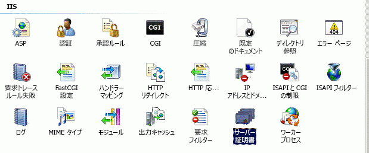
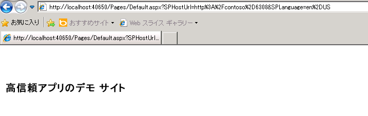

# SharePoint の高信頼性アドインを作成する
高信頼の SharePoint アドイン を作成する方法について説明します。高信頼アドインは、リモート Web アプリケーションと SharePoint 2013 の間で信頼関係を確立するためにデジタル証明書を使用します。高信頼アドインはオンプレミスの SharePoint のみにインストールでき、Microsoft SharePoint Online にインストールすることはできません。また、クラウド ベースの Web アプリケーションではなく、主にオンプレミスで使用することを目的としています。
## 高信頼アドインを作成するための前提条件
<a name="Prereqs"> </a>

この記事の手順を実行するには、以下の前提条件を満たす必要があります。


- オンプレミスの SharePoint 2013 開発環境。セットアップの手順については、「 [SharePoint アドインのオンプレミスの開発環境をセットアップする](set-up-an-on-premises-development-environment-for-sharepoint-add-ins.md)」を参照してください。特に、「 [SharePoint のサービスをサーバー間アドインで使用するために構成する](set-up-an-on-premises-development-environment-for-sharepoint-add-ins.md#Servertoserver)」の手順を必ず完了します。


- プロバイダー ホスト型 SharePoint アドインの作成経験。「 [プロバイダー ホスト型 SharePoint アドインの作成を始める](get-started-creating-provider-hosted-sharepoint-add-ins.md)」を参照してください。


- リモートでインストールされているか、SharePoint 2013 のインストール先コンピューターにインストールされている Visual Studio。


- バリアント型 (Microsoft Office Developer Tools for Visual Studio) の値を使用します。


- デジタル証明書とその使用方法に関する知識。


SharePoint アドインとデジタル署名に関する理解を深めるには、以下の記事を参照してください。


**表 1. 高信頼アドインを実行する SharePoint 2013 をセットアップするための基本概念**


|**記事のタイトル**|**説明**|
|:-----|:-----|
| [プロバイダー ホスト型 SharePoint アドインの作成を始める](get-started-creating-provider-hosted-sharepoint-add-ins.md) <br/> |プロバイダー ホスト型の基本的な SharePoint アドインを Office Developer Tools for Visual Studio を使用して作成する方法、SharePoint CSOM を使用して SharePoint 2013 サイトと対話する方法について説明します。  <br/> |
|「 [Digital Certificates](http://msdn.microsoft.com/library/e523b335-0156-4f47-b55c-b80495587c4f.aspx)」および「 [Working with Certificates](http://msdn.microsoft.com/library/6ffb8682-8f07-4a45-afbb-8d2487e9dbc3.aspx)」  <br/> |デジタル証明書の基本的な概念について説明します。  <br/> |
 

## 高信頼アドインの実行の概要
<a name="Intro"> </a>

高信頼アドインは、プロバイダー ホスト型の SharePoint アドインであり、リモート Web アプリケーションと SharePoint 間の信頼関係を確立するためにデジタル証明書を使用します。"高信頼" は "完全信頼" と同義ではなく、高信頼アドインであっても、アドインのアクセス許可を要求する必要があります。アドインが "高信頼" と見なされるのは、そのアドインに必要な任意のユーザー ID を使用する信任を得ているためで、これは SharePoint に渡すアクセス トークンのユーザー部分の作成をアドインが担当するからです。


高信頼の SharePoint アドイン は、主にオンプレミス環境での使用を目的としています。高信頼アドインを Microsoft SharePoint Online にインストールすることはできず、通常、リモート コンポーネントもオンプレミスで企業ファイアウォール内にインストールされます。したがって、SharePoint アドイン のインスタンスは個々の企業に固有です。


高信頼アドインでは、コンテキスト トークンの代わりに証明書を使用して信頼関係を確立します (信頼ブローカーとして Microsoft Azure アクセス制御サービス (ACS) を使用するように作成されたプロバイダー ホスト型のアドインは、高信頼アドインとして動作するように変更する必要があります)。高信頼アドインは、SharePoint ファームと、リモート Web アプリケーションをホストしているサーバー上でいくつかの構成を必要とします。このトピックでは、Visual Studio のデバッグ ( **F5**) が機能するために必要な構成手順について説明します。テスト、ステージング、および運用環境の構成はいくらか異なり、これについては「 [高信頼 SharePoint アドインをパッケージ化して発行する](package-and-publish-high-trust-sharepoint-add-ins.md)」で説明しています。 


SharePoint 2013 では、サーバー間 Security Token Service (STS) によってサーバー間認証のためのアクセス トークンが提供されます。サーバー間 STS は、Exchange 2013、Lync 2013、SharePoint 2013 アドインなど、他のアプリケーション サービスにアクセスするための一時的なアクセス トークンを有効にします。アプリケーション サービス間の信頼関係を確立するには (たとえば、SharePoint とリモート アドインの間の信頼関係を確立するなど)、Windows PowerShell コマンドレットと証明書を使用します。


> **メモ**
> サーバー間 STS は、ユーザー認証用のサービスではありません。このため、サーバーの全体管理の [ **認証プロバイダー**] セクションや SharePoint 2013 のユーザー選択ウィンドウのユーザー サインイン ページには、サーバー間 STA は表示されません。 


この記事では、高信頼アドインの作成方法を示し、 **F5** キーを押して Visual Studio 内でそのアドインを実行するためのセットアップ手順を説明します。内容は以下のとおりです。


- アドインを高信頼アドインとして使用するために構成する。


- 高信頼アドインを使用するように SharePoint 2013 を構成する。


- 基本的な高信頼アドインを作成する。


## 証明書を取得する、またはパブリックおよびプライベート テスト証明書を作成する
<a name="Cert2"> </a>

高信頼アドインのリモート Web アプリケーションには、X.509 デジタル証明書が必要です。SharePoint アドインを完全にテストするには、ドメインで発行された証明書、または証明機関によって発行された商用証明書が必要です。ただし、デバッグの初期段階では、自己署名入り証明書を使用できます。次の手順は、IIS を使用してテスト証明書を作成し、エクスポートする方法を示しています。自己署名入り証明書をドメインで発行された証明書または商用証明書で置き換える手順については、後の「 [ドメインが発行した証明書または商用証明書を使用してデバッグを完了する](#NewCertificate)」で説明します。


または、MakeCert テスト プログラムを使用して、X.509 証明書を生成することもできます。MakeCert の使用方法の詳細については、「 [Authenticode を使用したコードの署名およびチェック](http://msdn.microsoft.com/ja-jp/library/ms537364%28vs.85%29.aspx)」を参照してください。


最初にテスト用の .pfx 証明書ファイルを作成し、その後で対応するテスト用の .cer ファイルを作成します。.pfx 証明書には、SharePoint への通信に署名するためにリモート Web アプリケーションによって使用されるプライベート キーが含まれます。.cer には、メッセージの暗号化を解除し、それがリモート Web アプリケーションからのものであることを確認し、SharePoint が信頼するトークン発行者からのアクセス トークンがリモート Web アプリケーションにあることを確認するために SharePoint が使用するパブリック キーが含まれます。.pfx ファイルと .cer ファイルの詳細については、「 [ソフトウェア発行者証明書](http://msdn.microsoft.com/ja-jp/library/windows/hardware/ff552299%28v=vs.85%29.aspx)」を参照してください。


### テスト用の自己署名入り .pfx 証明書ファイルを作成するには


1. 高信頼の SharePoint アドインを Visual Studio でデバッグするときは、リモート Web アプリケーションは Visual Studio がインストールされているコンピューター上の IIS Express でホストされます。したがって、リモート Web アプリケーション コンピューターには、証明書を作成できる IIS マネージャーがありません。このため、 *SharePoint*  テスト サーバーで IIS を使用して証明書を作成します。IIS マネージャーの左側のツリー ビューで、<サーバー名> ノードを選択します。


2. 図 1 に示すように、[ **サーバー証明書**] アイコンを選択します。

   **図 1. IIS の [サーバー証明書] オプション**





3. 図 2 に示すように、右側のリンク セットから、[ **自己署名入り証明書の作成**] リンクを選択します。

   **図 2. [自己署名入り証明書の作成] リンク**


![[自己署名入り証明書の作成] リンク](images/3f0aae5a-e58b-4ec8-b67f-0024abfa2dab.gif)


4. 証明書に「HighTrustSampleCert」という名前を付け、[ **OK**] を選択します。


5. 図 3 に示すように、証明書を右クリックし、[ **エクスポート**] を選択します。

   **図 3. テスト証明書のエクスポート**


6. Windows またはコマンド ラインで、C:\\Certs というフォルダーを作成します。


7. IIS マネージャーに戻り、ファイルを C:\\Certs にエクスポートして、パスワードを設定します。この例では、パスワードは **password** です。


8. テスト用の SharePoint インストールが、Visual Studio が実行されているのと同じコンピューター上にない場合は、Visual Studio コンピューター上でフォルダー C:\\Certs を作成し、このフォルダーに HighTrustSampleCert.pfx ファイルを移動します。これは、Visual Studio でデバッグを行うときにリモート Web アプリケーションが実行されるコンピューターです。


### 対応する .cer ファイルを作成するには


1. SharePoint サーバーで、次の IIS アドイン プールのアドイン プール ID に、C:\\Certs フォルダーへの読み取り権限があることを確認します。

  - **SecurityTokenServiceApplicationPool**


  - テスト用 SharePoint Web サイトの親 SharePoint Web アプリケーションをホストする IIS Web サイトに対応するアドイン プール。 **SharePoint - 80** IIS Web サイトに対応するプールは **OServerPortalAppPool** という名前になります。


2. IIS マネージャーの左側のツリー ビューで、<サーバー名> ノードを選択します。


3. [ **サーバー証明書**] をダブルクリックします。


4. [ **サーバー証明書**] ビューで、[ **HighTrustSampleCert** ] をダブルクリックして、証明書の詳細を表示します。


5. [ **詳細**] タブで [ **ファイルにコピー**] を選択して、 **証明書エクスポート ウィザード**を起動します。[ **次へ**] を選択します。


6. 既定値の [ **いいえ、秘密キーをエクスポートしません**] を使用し、[ **次へ**] を選択します。


7. 既定値を使用します。[ **次へ**] を選択します。


8. [ **参照**] を選択して C:\\Certs を参照し、証明書に **HighTrustSampleCert** という名前を付けて [ **保存**] をクリックします。証明書は .cer ファイルとして保存されます。


9. [ **次へ**] を選択します。


10. [ **完了**] を選択します。


## SharePoint 2013 で証明書を使用するための構成を行い、アドインの信頼性を構成する
<a name="Configure2"> </a>

このセクションで作成する Windows PowerShell スクリプトは、Visual Studio で **F5** キーの使用をサポートすることが目的であり、ステージングまたは運用 SharePoint インストールを正しく構成 *しません*  。証明書を使用するように運用 SharePoint を構成する手順については、「 [高信頼 SharePoint アドインをパッケージ化して発行する](package-and-publish-high-trust-sharepoint-add-ins.md)」を参照してください。


> **メモ**
> 「 [SharePoint のサービスをサーバー間アドインで使用するために構成する](set-up-an-on-premises-development-environment-for-sharepoint-add-ins.md#Servertoserver)」(この記事で前提条件として示されている) の手順を完了したことを再度確認します。この構成を行っていない場合は、先に進む前に、この時点で構成を行う必要があります。 


### SharePoint を構成するには


1. テキスト エディターまたは Windows PowerShell エディターで、新しいファイルを作成し、次の行を追加して証明書オブジェクトを作成します。

 ```

$publicCertPath = "C:\\Certs\\HighTrustSampleCert.cer"
$certificate = New-Object System.Security.Cryptography.X509Certificates.X509Certificate2($publicCertPath)

 ```

2. 次の行を追加して、SharePoint が証明書をルート証明機関として扱うようにします。

 ```

New-SPTrustedRootAuthority -Name "HighTrustSampleCert" -Certificate $certificate

 ```

3. 次の行を追加して、認証領域の ID を取得します。

 ```

$realm = Get-SPAuthenticationRealm

 ```

4. リモート Web アプリケーションは、アクセス トークンを使用して SharePoint データへアクセスします。アクセス トークンは SharePoint が信頼しているトークン発行者によって発行される必要があります。高信頼の SharePoint アドインでは、証明書がトークン発行者です。次の行を追加して、SharePoint が必要とする形式で発行者 ID を作成します。 ** _specific_issuer_GUID_@ _realm_GUID_**

 ```

$specificIssuerId = "11111111-1111-1111-1111-111111111111"
$fullIssuerIdentifier = $specificIssuerId + '@' + $realm 

 ```


    > **メモ**
      >  `$specificIssuerId` の値は GUID である必要があります。これは、運用環境では、各証明書に一意の発行者が必要なためです。ただし、同じ証明書を使用してすべての高信頼アドインをデバッグするというこのコンテキストでは、値をハードコードできます。何らかの理由で、ここで使用するのとは異なる GUID を使用する場合、 * **GUID のすべての文字を小文字にします*** 。現在、SharePoint インフラストラクチャでは、証明書発行者の GUID は小文字である必要があります。
5. 次の行を追加して、証明書を信頼されたトークン発行者として登録します。 `-Name` パラメーターは一意である必要があるため、運用構成では名前の一部 (またはすべて) として GUID を使用するのが一般的ですが、このコンテキストではわかりやすい名前を使用できます。 `-IsTrustBroker` スイッチは、開発するすべての高信頼アドインに同じ証明書を使用できるようにするために必要です。トークン発行者をすぐに登録するには、 `iisreset` コマンドが必要です。このコマンドがないと、新しい発行者が登録されるまでに最大 24 時間待たなければならない場合があります。

 ```

New-SPTrustedSecurityTokenIssuer -Name "High Trust Sample Cert" -Certificate $certificate -RegisteredIssuerName $fullIssuerIdentifier -IsTrustBroker
iisreset 

 ```

6. 通常、SharePoint 2013 では自己署名入り証明書を使用できません。したがって、デバッグ用に自己署名入り証明書を使用するときは、次の行を追加して、リモート Web アプリケーションが SharePoint を呼び出すときに HTTPS を使用するという、SharePoint の通常の要件を無効にします。無効にしない場合、リモート Web アプリケーションが自己署名入り証明書を使用して SharePoint を呼び出すときに **403 (forbidden)** メッセージが表示されます。この手順は後で元に戻します。HTTPS 要件を無効にすることで、リモート Web アプリケーションから SharePoint への要求は暗号化されませんが、証明書はアクセス トークンの信頼できる発行者として引き続き使用されます (これは高信頼の SharePoint アドインの主要な目的です)。

 ```

$serviceConfig = Get-SPSecurityTokenServiceConfig
$serviceConfig.AllowOAuthOverHttp = $true
$serviceConfig.Update()

 ```

7. HighTrustConfig-ForDebugOnly.ps1 という名前でファイルを保存します。


8. 管理者として **SharePoint 管理シェル**を開き、次の行を使用してファイルを実行します。

 ```

./HighTrustConfig-ForDebugOnly.ps1
 ```


## 高信頼の SharePoint アドインを作成する
<a name="Createapp2"> </a>

このセクションでは、Visual Studio を使用して高信頼の SharePoint アドインを作成する方法を説明します。


> **メモ**
> 「 [高信頼アドインを作成するための前提条件](#Prereq)」セクションで述べたように、この記事の内容はプロバイダー向けのホスト型 SharePoint アドインの作成方法に関する知識があることを前提としています。詳細については、「 [プロバイダー ホスト型 SharePoint アドインの作成を始める](get-started-creating-provider-hosted-sharepoint-add-ins.md)」を参照してください。 


### 高信頼の SharePoint アドインを作成するには


1. Visual Studio で、[ **ファイル**]、[ **新規作成**]、[ **プロジェクト**] の順に選択します。


2. **新しいプロジェクト** ウィザードで、[ **Visual C#**] または [ **Visual Basic**] ノードを展開し、次に [ **Office/SharePoint**] ノードを展開します。


3. [ **アドイン**] を選択し、次に [ **SharePoint アドイン**] プロジェクトの作成を選択します。


4. プロジェクトに「HighTrustSampleApp」という名前を付けます。


5. 任意の場所にプロジェクトを保存し、[ **OK**] を選択します。


6. SharePoint 開発者向けサイトの完全な URL を指定します。たとえば、「http://TestServer/sites/devsite/」と入力します。


7. [ **プロバイダー向けのホスト型**] オプションを選択し、[ **次へ**] を選択します。


8. Web プロジェクトの種類を指定するように求めらたら、このトピックの例では [ **ASP.NET Web Forms アプリケーション**] を選択し、[ **次へ**] をクリックします。


9. ウィザードの [ **認証設定を構成します**] ページが開きます。このフォームに追加する値は、自動的に web.config ファイルに追加されます。[ **アドインの認証方法**] で、[ **証明書を使用する**] を選択します。


10. [ **証明書の場所**] ボックスの横の [ **参照**] をクリックし、作成した自己署名入り証明書 (.pfx ファイル) の場所 (C:\\Certs) に移動します。このフィールドの値は完全なパス C:\\Certs\\HighTrustSampleCert.pfx である必要があります。


11. [ **パスワード**] ボックスに、この証明書のパスワードを入力します。この場合、「password」と入力します。


12. [ **発行者 ID**] ボックスに、発行者 ID ( `11111111-1111-1111-1111-111111111111`) を入力します。


13. [ **完了**] を選択します。構成の大半は、ソリューションが開くときに実行されます。2 つのプロジェクトが Visual Studio ソリューション内に作成されます。1 つは SharePoint アドインのプロジェクトで、もう 1 つは ASP.NET Web アプリケーションのプロジェクトです。


### アドインを実行してデバッグするには


1. Office Developer Tools for Visual Studio は、ASP.NET プロジェクトが作成されたときに、自動的に default.aspx ファイルと default.aspx.cs ファイルを生成します。生成されたコードは SharePoint ホスト Web のタイトルを取得し、リモート Web アプリケーションの既定のページにそのタイトルを表示します。これらのファイルの実際のマークアップとコードは、ツールのバージョンによって異なります。このトピックでは、生成された default.aspx ファイルと default.aspx.cs ファイルを変更することなく使用します。


2. SharePoint アドインとそのリモート Web アプリケーションをテストするには、Visual Studio で **F5** キーを押します。Web アプリケーションは *localhost*  で IIS Express に展開されます。SharePoint アドインはターゲット SharePoint Web サイトにインストールされます。SharePoint からは、SharePoint アドインが要求するアクセス許可を付与するように求めるメッセージが表示されます。Office Developer Tools for Visual Studio のバージョンによって、アドインをすぐに起動するものと、ターゲットの SharePoint Web サイトの [ **サイト コンテンツ**] ページを開き、新しいアドインを表示するものがあります。

    自動的に起動されない場合はアドインを起動します。リモート Web アプリケーションが起動し、AppManifest.xml ファイルで **Start Page** に指定されたページ (Default.aspx) が開きます。アドインは図 4 のようになります。


   **図 4. SharePoint Server を呼び出して SharePoint ホスト Web のタイトルを取得するサンプル アドイン**





## ドメインが発行した証明書または商用証明書を使用してデバッグを完了する
<a name="NewCertificate"> </a>

以前に作成した Windows PowerShell スクリプトにより、リモート Web アプリケーションは HTTPS プロトコルを使用して SharePoint にアクセスするという SharePoint の通常の要件が無効になりました。HTTPS をオフにして作業を行うと、HTTPS が要求される運用展開の際に発生する可能性のある特定の問題を、アドインのビルド時点で見逃すことになりかねません。したがって、テスト証明書をドメインで発行された証明書または商用証明書で置き換え、HTTPS 要件を有効にしてアドインを再起動するまでは、開発とデバッグ フェーズが完了したと見なすことはできません。


新しい証明書を入手したら、まだ追加していない場合は証明書にパスワードを追加する必要があります。運用環境では強力なパスワードを使用しますが、SharePoint アドインのデバッグには任意のパスワードを使用できます。pfx および cer の 2 つの形式の証明書が必要です。取得したときに pfx 形式でない場合は、ユーティリティを使用して pfx への変換が必要になることがあります。pfx ファイルがある場合は、次の手順に従って IIS にインポートし、cer ファイルをエクスポートできます。


### 新しい証明書をインポートするには


1. .pfx ファイルを SharePoint サーバー上の C:\\Certs に配置します。この記事では、このファイルの名前は  _MyCert_.pfx となっています。すべての手順の "MyCert" を、証明書の実際の名前に置き換えてください。


2. IIS マネージャーの左側のツリー ビューで、<サーバー名> ノードを選択します。


3. [ **サーバー証明書**] アイコンをダブルクリックします。


4. 右側の [ **アクション**] ウィンドウの [ **インポート**] を選択します。


5. [ **証明書のインポート**] ダイアログで、[参照] ボタンを使用して C:\\Certs\\ _MyCert_.pfx を参照し、証明書のパスワードを入力します。


6. [ **この証明書のエクスポートを許可する**] がオンになっていることを確認し、[ **OK**] をクリックします。


7. 上の図 3 に示すように [ **サーバー証明書**] の一覧で証明書を右クリックし、[ **エクスポート**] を選択します。


8. ファイルを C:\\Certs にエクスポートし、パスワードを指定します。


9. SharePoint のテスト インストールが、Visual Studio が実行されているのと同じコンピューター上にない場合は、 _MyCert_.pfx ファイルを Visual Studio コンピューター上の C:\\Certs フォルダーに移動します。 


10. [ **サーバー証明書**] ビューで、[ _MyCert_] をダブルクリックして、証明書の詳細を表示します。


11. [ **詳細**] タブで [ **ファイルにコピー**] を選択して、 **証明書エクスポート ウィザード**を起動します。[ **次へ**] を選択します。


12. 既定値の [ **いいえ、秘密キーをエクスポートしません**] を使用し、[ **次へ**] を選択します。


13. 既定値を使用します。[ **次へ**] を選択します。


14. [ **参照**] を選択し、C:\\Certs を参照します。証明書に「 _MyCert_」という名前を付けて、[ **保存**] をクリックします。証明書は .cer ファイルとして保存されます。


15. [ **次へ**] を選択します。


16. [ **完了**] を選択します。


### 新しい証明書を使用するように SharePoint 2013 を構成するには


1. 編集のために HighTrustConfig-ForDebugOnly.ps1file を開き、次の変更を行います。

1.  `HighTrustSampleCert` が出現する両方の場所で、これを _MyCert_ に置き換えます。


2. 特定の発行者 ID  `11111111-1111-1111-1111-111111111111` を、 `22222222-2222-2222-2222-222222222222` で置き換えます。


3. "High Trust Sample Cert" を "My Cert" またはその他の適切なわかりやすい名前で置き換えます。


4. 行  `$serviceConfig.AllowOAuthOverHttp = $true` で、 `true` を `false` に置き換えます。これにより、HTTPS を使用する要件がもう一度有効になります。


2. ファイルを保存します。


3. 管理者として [ **SharePoint 管理シェル**] を開き、次の行を使用してファイルを実行します。

 ```

./HighTrustConfig-ForDebugOnly.ps1
 ```


### リモート Web アプリケーションを再構成するには


1. Visual Studio で、Web アプリケーション プロジェクトの web.config ファイルを開き、次の変更を行います。

1.  `ClientSigningCertificatePath` キーで、 `C:\\Certs\\HighTrustSampleCert.pfx` を `C:\\Certs\\` _MyCert_ `.pfx` で置き換えます。


2.  `ClientSigningCertificatePassword` キーの値を、証明書の実際のパスワードで置き換えます。


3.  `IssuerId` キーの値を、 `22222222-2222-2222-2222-222222222222` で置き換えます。


2. **F5** キーを押してアドインをデバッグします。


高信頼アドインの開発が終了したら、「 [高信頼 SharePoint アドインをパッケージ化して発行する](package-and-publish-high-trust-sharepoint-add-ins.md)」を参照し、この種の SharePoint アドイン をパッケージ化および発行する方法を確認してください。


## TokenHelper.cs ファイルと SharePointContext ファイルで行われること
<a name="TokenHelper"> </a>

Office Developer Tools for Visual Studio では、リモート Web アプリケーションに TokenHelper.cs (または .vb) ファイルが含まれています。また、一部のバージョンのツールに SharePointContext.cs (または .vb) ファイルが含まれています。これらのファイルのコードは、次の操作を実行します。


- ネットワークの呼び出し時に証明書を信頼するように .NET を構成します。 


- 指定された **WindowsIdentity** オブジェクトの代わりにリモート Web アプリケーションのプライベート証明書によって署名され、SharePoint 2013 が信頼関係を確立するために使用する、サーバー間アクセス トークンを取得します。


- SharePoint セキュリティ トークン サービス (STS) 証明書を取得します。


- 高信頼の承認システムではなく低信頼の承認システムを使用するアドインでは、これらのファイルには「 [SharePoint のアドインのコンテキスト トークン OAuth フロー](context-token-oauth-flow-for-sharepoint-add-ins.md)」に記載されたシナリオ用の OAuth トークンの処理などの追加のタスクがあります。そのシナリオは、この記事の対象範囲外です。 


TokenHelper と SharePointContext の詳細については、ファイル内のコメントを参照してください。


高信頼アドインには、コンテキスト トークンがありません。コンテキスト トークンは、低信頼の承認を使用する構成に固有のものです。ただし、それでもアクセス トークンは必要です。高信頼の構成を使用している場合、Web アプリケーションは SharePoint と同じ方法でユーザーを認証する必要があります (つまり、ユーザーおよび ID プロバイダーの ID を含むアクセス トークンをアドインの責任で作成する必要があります)。 


Visual Studio で **F5** キーによるデバッグを行う場合、Microsoft Office Developer Tools for Visual Studio は Windows 認証を使用し、生成される 2 つのコード ファイルではアドインを実行しているユーザーの Windows ID を使用してアクセス トークンを作成します。アドインを発行するとき、この 2 つのファイルを修正せずに使用するには、Windows 認証を使用するようにリモート Web アプリケーションを IIS マネージャーで構成する必要があります。アドインが運用環境で Windows 認証を使用しない場合は、別の承認システムを使用するように、生成されたコード ファイル TokenHelper または SharePointContext (あるいはその両方) をカスタマイズする必要があります。リモート Web アプリケーションが、SharePoint アドインを実行しているユーザーとは別の ID で SharePoint にアクセスする場合も、これらのファイルをカスタマイズします。最後の点として、リモート Web アプリケーションが PHP、node.js、Java、またはその他の非 ASP.NET プラットフォームである場合は、使用している承認システムからコードでユーザー ID を取得し、作成するアクセス トークンにその ID を追加する必要があります。詳細については、「 [高信頼 SharePoint アドインをパッケージ化して発行する](package-and-publish-high-trust-sharepoint-add-ins.md)」、「 [SharePoint のプロバイダー向けのホスト型高信頼アドインでアクセス トークンを作成して使用する](create-and-use-access-tokens-in-provider-hosted-high-trust-sharepoint-add-ins.md)」、および「 [SharePoint 2013 の SAML および FBA サイトで SharePoint アドインを使用する](http://blogs.technet.com/b/speschka/archive/2012/12/07/using-sharepoint-apps-with-saml-and-fba-sites-in-sharepoint-2013.aspx)」を参照してください。


## その他の技術情報
<a name="bk_addresources"> </a>


-  [高信頼 SharePoint アドインをパッケージ化して発行する](package-and-publish-high-trust-sharepoint-add-ins.md)


-  [SharePoint 2013 の高信頼アドインに関するトラブルシューティングのヒント](http://blogs.technet.com/b/speschka/archive/2012/11/01/more-troubleshooting-tips-for-high-trust-apps-on-sharepoint-2013.aspx)


-  [SharePoint アドイン 2013 を登録する](register-sharepoint-add-ins-2013.md)


-  [SharePoint アドインの承認と認証](authorization-and-authentication-of-sharepoint-add-ins.md)


-  [SharePoint 2013 アドインでの新しい SharePointContext ヘルパーについて](http://blogs.msdn.com/b/officeapps/archive/2013/11/07/announcing-the-new-sharepointcontext-helper-in-apps-for-sharepoint-2013.aspx)


-  [SharePoint 2013 でのアドインのアクセス許可](add-in-permissions-in-sharepoint-2013.md)


-  [プロバイダー ホスト型 SharePoint アドインの作成を始める](get-started-creating-provider-hosted-sharepoint-add-ins.md)


