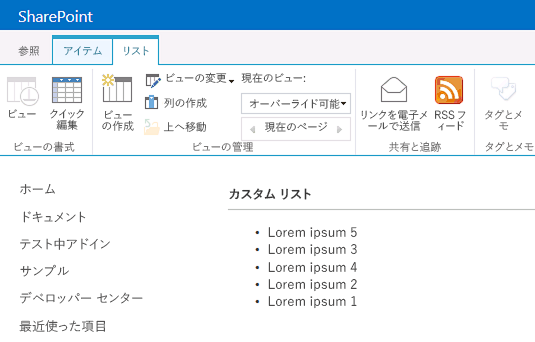

# クライアント側レンダリングを使用して SharePoint アドインのリスト ビューをカスタマイズする
SharePoint 2013 でクライアント側レンダリング テクノロジを使用して、SharePoint ホスト型アドインのリスト ビューをカスタマイズする方法について説明します。
SharePoint 2013 では、クライアント側レンダリングによって、SharePoint ページでホストされる一連のコントロールに対して独自の出力を生成する方法が提供されます。これにより、HTML や JavaScript のような一般的な技術を使用して SharePoint リスト ビューのレンダリング ロジックを定義できます。クライアント側レンダリングを使用すると、独自の JavaScript リソースを指定し、アドインで使用可能なデータ ストレージ オプション (ドキュメント ライブラリなど) でリソースをホストできます。SharePoint ホスト型アドインに含まれるのは、SharePoint コンポーネントだけです。SharePoint ホスト型アドインは、アドイン Web と呼ばれるホスト Web の分離サブサイトにリソースがあります。
  
    
    


## この記事の例を使用するための前提条件
<a name="SP15CSRlistview_Prereq"> </a>

この例の手順を実行するには、次のものが必要です。
  
    
    

-  [Visual Studio 2015 と最新の Microsoft Office Developer Tools ](https://www.visualstudio.com/features/office-tools-vs)
    
  
- SharePoint 2013 開発環境 (オンプレミスのシナリオでは、アドインの分離が必要)
    
  
ニーズに合った開発環境をセットアップする方法については、「 [Office 用アプリおよび SharePoint 用アプリの作成を開始する](http://msdn.microsoft.com/library/187f8c8c-1b15-471c-80b5-69a40e67deea%28Office.15%29.aspx)」を参照してください。
  
    
    

### クライアント側レンダリングによるリスト ビューのカスタマイズについて理解するために役立つ中心概念

次の表に、リスト ビューのカスタマイズのシナリオに関係する概念を理解するために役立つ記事を示します。
  
    
    

**表 1. アドインでのリスト ビューのカスタマイズに関する中心概念**


|**記事のタイトル**|**説明**|
|:-----|:-----|
| [SharePoint アドイン](sharepoint-add-ins.md) <br/> |エンドユーザー向けの小型で使いやすいソリューションであるアドインを作成できる、Microsoft SharePoint 2013 の新しいアドイン モデルについて説明します。  <br/> |
| [SharePoint アドインの UX 設計](ux-design-for-sharepoint-add-ins.md) <br/> |SharePoint アドインをビルドするときに使用できる UX オプションについて説明しています。  <br/> |
| [SharePoint 2013 のホスト Web、アドイン Web、および SharePoint コンポーネント](host-webs-add-in-webs-and-sharepoint-components-in-sharepoint-2013.md) <br/> |ホスト Web と アドイン Web の違いについて説明します。SharePoint アドイン に含めることのできる SharePoint 2013 コンポーネント、ホスト Web に展開するコンポーネント、アドイン Web に展開するコンポーネント、およびアドイン Web を分離ドメインに展開する方法について説明します。  <br/> |
   

## コード例: クライアント側レンダリングを使用してリスト ビューをカスタマイズする
<a name="SP15CSRlistview_Codeexample"> </a>

アドイン Web に展開されるリスト ビューを、クライアント側レンダリングを使用してカスタマイズするには、次の手順に従ってください。
  
    
    

1. SharePoint アドイン プロジェクトを作成します。
    
  
2. カスタム ビューを使用する新しいリスト定義を作成します。
    
  
3. JavaScript ファイルにカスタム レンダリング ロジックを指定します。
    
  
図 1 に、クライアント側レンダリングで表示したお知らせリスト ビューを示します。
  
    
    

**図 1. お知らせリストのカスタム ビュー**

  
    
    

  
    
    

  
    
    

### SharePoint アドイン プロジェクトを作成するには


1. 管理者として Visual Studio 2015 を開きます。(これを行うには、 **[スタート]** メニューの **[Visual Studio]** アイコンを右クリックし、 **[管理者として実行]** を選択します。)
    
  
2. **SharePoint アドイン** テンプレートを使用して、新しいプロジェクトを作成します。
    
    図 2 は、 **[Office アドイン]**、 **[Office/SharePoint]**、 **[Visual C#]**、 **[テンプレート]** の下の Visual Studio 2015 の **SharePoint アドイン** テンプレートの場所を示しています。
    

   **図 2. Visual Studio の [SharePoint 2013 アドイン] テンプレート**

  

!\[SharePoint 2013 用アプリの Visual Studio テンプレート](images/AppForSharePointVSTemplate.PNG)
  

  

  
3. デバッグに使用する SharePoint Web サイトの URL を入力します。
    
  
4. アドインのホスティング オプションとして、[ **SharePoint ホスト型**] を選択します。
    
  

### 新しいリスト定義を作成するには


1. SharePoint アドイン プロジェクトを右クリックし、新しい **リスト**項目を追加します。お知らせを基にしたカスタマイズ可能なリストを作成してください。
    
  
2. 次のマークアップをコピーし、リスト フィーチャーの Schema.xml ファイル内の **Views** 要素に貼り付けます。マークアップは以下のタスクを実行します。
    
  - BaseViewID=2 の Overridable という名前の新しいビューを宣言します。
    
  
  - **JSLink** 要素の値を指定します。この値はアドインでプロビジョニングされた JavaScript ファイルを参照します。
    
    > **メモ**
      > JSLink プロパティは、アンケート リストやイベント リストではサポートされません。SharePoint の予定表は、イベント リストです。 

 ```XML
  
<View BaseViewID="2"
      Name="8d2719f3-c3c3-415b-989d-33840d8e2ddb" 
      DisplayName="Overridable" 
      Type="HTML" 
      WebPartZoneID="Main" 
      SetupPath="pages\\viewpage.aspx" 
      Url="Overridable.aspx"
      DefaultView="TRUE">
  <ViewFields>
    <FieldRef Name="Title" />
  </ViewFields>
  <Query />
  <Toolbar Type="Standard" />
  <XslLink>main.xsl</XslLink>
  <JSLink Default="TRUE">~site/Scripts/CSRListView.js</JSLink>
</View>
 ```


### JavaScript ファイルでカスタム レンダリング ロジックを定義するには


1. [ **Scripts**] フォルダーを右クリックし、新しい JavaScript ファイルを追加します。ファイルに CSRListView.js という名前を付けます。
    
  
2. 次のコードをコピーし、CSRListView.js ファイルに貼り付けます。コードは以下のタスクを実行します。
    
  - **PreRender** イベントと **PostRender** イベントのイベント ハンドラーを用意します。
    
  
  - ヘッダー、フッター、およびアイテム テンプレート セットのテンプレートを用意します。
    
  
  - テンプレートを登録します。
    
  

 ```
  
(function () {
    // Initialize the variable that stores the objects.
    var overrideCtx = {};
    overrideCtx.Templates = {};

    // Assign functions or plain html strings to the templateset objects:
    // header, footer and item.
    overrideCtx.Templates.Header = "<B><#=ctx.ListTitle#></B>" +
        "<hr><ul id='unorderedlist'>";

    // This template is assigned to the CustomItem function.
    overrideCtx.Templates.Item = customItem;
    overrideCtx.Templates.Footer = "</ul>";

    // Set the template to the:
    //  Custom list definition ID
    //  Base view ID
    overrideCtx.BaseViewID = 2;
    overrideCtx.ListTemplateType = 10057;

    // Assign a function to handle the
    // PreRender and PostRender events
    overrideCtx.OnPreRender = preRenderHandler;
    overrideCtx.OnPostRender = postRenderHandler;

    // Register the template overrides.
    SPClientTemplates.TemplateManager.RegisterTemplateOverrides(overrideCtx);
})();

// This function builds the output for the item template.
// It uses the context object to access announcement data.
function customItem(ctx) {

    // Build a listitem entry for every announcement in the list.
    var ret = "<li>" + ctx.CurrentItem.Title + "</li>";
    return ret;
}

// The preRenderHandler attends the OnPreRender event
function preRenderHandler(ctx) {

    // Override the default title with user input.
    ctx.ListTitle = prompt("Type a title", ctx.ListTitle);
}

// The postRenderHandler attends the OnPostRender event
function postRenderHandler(ctx) {

    // You can manipulate the DOM in the postRender event
    var ulObj;
    var i, j;

    ulObj = document.getElementById("unorderedlist");
    
    // Reverse order the list.
    for (i = 1; i < ulObj.children.length; i++) {
        var x = ulObj.children[i];
        for (j = 1; j < ulObj.children.length; j++) {
            var y = ulObj.children[j];
            if(x.innerText<y.innerText){                  
                ulObj.insertBefore(y, x);
            }
        }
    }
}
 ```


### ソリューションを構築して実行するには


1. F5 キーを押します。
    
    > **メモ**
      > F5 キーを押すと、Visual Studio によってソリューションが構築され、アドインが展開され、アドインのアクセス許可ページが表示されます。 
2. [ **信頼する**] ボタンをクリックします。
    
  
3. (ホスト Web ドメインではなく) アドイン Web ドメインのアドイン ディレクトリに対する相対アドレスで「 _/Lists/<your_list_instance>_」を入力してカスタム リストに移動します。1 つか 2 つのお知らせを追加します。リボンの **上書き可**ビューを選択します。
    
  

## 次の手順
<a name="SP15CSRlistview_Nextsteps"> </a>

この記事では、SharePoint アドイン でクライアント側レンダリングを使用してリスト ビューをカスタマイズする方法を説明しました。次の手順として、SharePoint アドイン で使用できる他の UX コンポーネントについて学習できます。詳細については、以下を参照してください。
  
    
    

-  [コード サンプル: クライアント側レンダリングを使用してアドインのリスト ビューをカスタマイズする](http://code.msdn.microsoft.com/SharePoint-2013-Customize-61761017)
    
  
-  [SharePoint アドインで SharePoint Web サイトのスタイル シートを使用する](use-a-sharepoint-website-s-style-sheet-in-sharepoint-add-ins.md)
    
  
-  [SharePoint アドインのクライアント クロム コントロールを使用する](use-the-client-chrome-control-in-sharepoint-add-ins.md)
    
  
-  [カスタム アクションを作成して SharePoint アドインで展開する](create-custom-actions-to-deploy-with-sharepoint-add-ins.md)
    
  
-  [アドイン パーツを作成して SharePoint アドインと共にインストールする](create-add-in-parts-to-install-with-your-sharepoint-add-in.md)
    
  

## その他の技術情報
<a name="SP15CSRlistview_AddResources"> </a>


-  [SharePoint アドインのオンプレミスの開発環境をセットアップする](set-up-an-on-premises-development-environment-for-sharepoint-add-ins.md)
    
  
-  [SharePoint アドインの UX 設計](ux-design-for-sharepoint-add-ins.md)
    
  
-  [SharePoint 2013 での UX コンポーネントの作成](create-ux-components-in-sharepoint-2013.md)
    
  
-  [SharePoint アドインの設計オプションを考慮するときの 3 つの方法](three-ways-to-think-about-design-options-for-sharepoint-add-ins.md)
    
  
-  [SharePoint アドインのアーキテクチャおよび開発環境に関する重要な要素](important-aspects-of-the-sharepoint-add-in-architecture-and-development-landscap.md)
    
  

