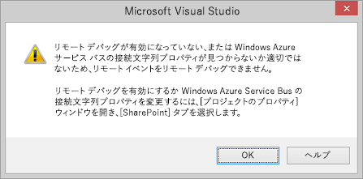
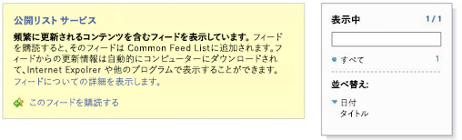

# SharePoint アドインでのリモート イベント レシーバーのデバッグとトラブルシューティング
Visual Studio を使用して でリモート イベントをデバッグできるよう開発環境をセットアップします。
## リモート SharePoint テスト サイトのデバッグの構成

> [!メモ]
> このセクションに記されている手順は、SharePoint テスト サイトが Visual Studio とは別のコンピューター上にある場合か、テスト サイトとして SharePoint Online 開発者向けサイトを使用している場合にのみ該当します。SharePoint と Visual Studio が同じコンピューター上にある場合には、このセクションはスキップしてください。 
  
    
    

Visual Studio の SharePoint アドイン プロジェクトにリモート イベント レシーバー (RER) またはアドイン イベント レシーバーが含まれる場合、(F5) を使ってアドインをデバッグする前に、プロジェクトのプロパティで追加の簡単な構成を行う必要があります。さらに、Azure の構成も行う必要があります。RER またはアドイン イベントのあるすべてのプロジェクトで Azure 構成を繰り返す必要はありません。(アドインに AppInstalled イベント ハンドラーが含まれている場合は、このセクションの構成を実行しない限り、F5 または Ctrl-F5 [デバッグなしで実行する] キーを押してもアドインは実行されません。)
  
    
    

### Azure を構成するには

1. まだお持ちでない場合は、Microsoft Azure サブスクリプションを取得します。1 つは  [MSDN サブスクリプション](http://azure.microsoft.com/ja-jp/pricing/member-offers/msdn-benefits/)の特典として含まれています。
    
  
2. 「 [方法:Service Bus Service 名前空間を作成または変更する](http://msdn.microsoft.com/library/fa561f70-007c-45aa-b34d-56317dbbfc87.aspx)」の手順を実行します。
    
  

### Visual Studio で SharePoint アドイン プロジェクトを構成するには

1. 最新バージョンの Office Developer Tools for Visual Studio 2013 が必要です。そのため、 [ここで WebPI インストーラーを実行する](http://aka.ms/OfficeDevToolsForVS2013)か、 [Office Developer Tools for Visual Studio 2015 用のインストーラーを実行します](http://aka.ms/OfficeDevToolsForVS2015)。
    
  
2. Visual Studio の SharePoint アドイン プロジェクトに RER またはアドイン イベント ハンドラーを追加したら、 **[ソリューション エクスプローラー]** でそのプロジェクトを右クリックし、 **[プロパティ]** を選択します。
    
  
3. プロパティのウィンドウで **[SharePoint]** タブを開き、一番下までスクロールします。
    
  
4. **[Microsoft Azure サービス バスによるデバッグを有効にする]** のチェック ボックスをオンにします。
    
  
5. 提供されるテキスト ボックスに完全な接続文字列を入力します。次の手順で文字列を取得します。
    
1. Azure ポータルにログインして、 **[サービス バス]** タブを開きます。
    
  
2. RER のデバッグ用に作成した名前空間を開き、接続文字列に移動します。Azure ポータル UI は頻繁に変更されます。接続文字列が見つからない場合は、 [Azure ポータルのヘルプ](https://msdn.microsoft.com/ja-jp/library/azure/dn578292.aspx)を参照してください。
    
  
3. **[SAS]** 接続文字列をコピーします。この文字列を Visual Studio プロジェクトのプロパティに入力します。
    
  
Azure ポータルを毎回開く必要をなくすため、Visual Studio で SharePoint アドイン を作成するときにはこの情報が事前に取り込まれるようになる予定です。
## 構成のテスト

このセクションの手順を使って、RER をデバッグできることを確認します。
  
    
    

### リモート イベント レシーバー プロジェクトを作成するには

1. Visual Studio で、プロバイダー ホスト型の SharePoint アドインを作成します。
    
    「 [プロバイダー ホスト型 SharePoint アドインの作成を始める](get-started-creating-provider-hosted-sharepoint-add-ins.md)」を参照してください。
    
  
2. [ **ソリューション エクスプローラー**] で、アドイン プロジェクトのノードを選択します。
    
  
3. メニュー バーで、[ **プロジェクト**]、[ **新しい項目の追加**] の順にクリックします。
    
  
4. [ **テンプレート**] ウィンドウで、[ **リスト**] テンプレートを選択し、[ **追加**] ボタンをクリックします。
    
  
5. [ **完了**] ボタンをクリックして既定のカスタム リストをアドイン プロジェクトに追加します。
    
  
6. [ **テンプレート**] ウィンドウの [ **リモート イベント レシーバー**] テンプレートを選択して、アドイン プロジェクトに別の項目を追加します。
    
  
7. [ **名前**] ボックスは既定の名前 (RemoteEventReceiver1) のままにし、[ **追加**] をクリックします。
    
  
8. [ **使用するイベント レシーバーの種類**] ボックスの一覧で、[ **リスト項目イベント**] をクリックします。 
    
    イベント ソースは、前の手順で追加したリストである [ **リスト 1**] のままとします。
    
  
9. [ **次のイベントを処理**] リストで、[ **項目が追加されています**] を選択し、[ **完了**] をクリックします。
    
    指定したリモート イベントを処理する Web サービスが Web アプリケーションに追加されます。SharePoint アドインにリモート イベント レシーバーが追加されます。レシーバーは、Web サービスと、イベント レシーバーの Elements.xml ファイルのリスト項目イベントを参照します。
    
  
10. アドイン プロジェクトで AppManifest.xml を開きます。
    
  
11. スタート ページをリストのページ ( _AddInProjectName_/Lists/List1) に変更します。
    
     _AddInProjectName_ を、アドイン プロジェクトの名前 (SharePointAddIn4/Lists/List1 など) に置き換えます。この例では、スタート ページをリストのページに設定します。ただし、標準的なアドインでは、Web プロジェクト ページの独自の UI を指定します。
    
  

### イベント ハンドラーのデバッグを実行してテストするには

1. まだ行っていない場合は、前述の「 **Visual Studio で SharePoint アドイン プロジェクトを構成するには** 」の手順を実行します。
    
  
2. Web プロジェクトで、リモート イベント レシーバー サービス (RemoteEventReceiver1.svc) を開き、 `ProcessEvent()` メソッド内の任意のコード行にブレークポイントを追加します。
    
  
3. **F5** キーを押してプロジェクトを実行します。
    
  
4. [ **+ 新しい項目**] をクリックして項目をリストに追加します。
    
  
5. 項目のタイトルを指定し、[ **保存**] ボタンをクリックします。
    
    リモート イベント レシーバーに追加したブレークポイントがヒットし、リモート イベント レシーバーをデバッグしていることを確認できます。
    
  
6. **F5** キーを押してプロジェクトの実行を継続し、終了したらデバッグを中止します。
    
  

## イベント デバッグの構成が必要であるという Visual Studio からの通知の有効/無効の切り替え

プロジェクトにリモート イベントがあり、リモート イベント デバッグを設定していない場合は、Visual Studio からリモート イベント デバッグの設定を求めるメッセージが表示されます (図 1 を参照)。この動作は、 [ **SharePoint** ] タブで [ **リモート イベント デバッグが構成されていない場合は通知する** ] チェック ボックスをオフにすることで変更できます。
  
    
    

**図 1. リモート イベント デバッグの通知**

  
    
    

  
    
    

  
    
    

  
    
    

  
    
    

## サービスがサービス バスでホストされていることの検証

F5 キーを押してアドインを信頼した後、ブラウザーでサービス バス名前空間 (http://mynamespace.servicebus.windows.net など) に移動すると、ご使用のエンドポイントが数字として一覧表示されるはずです。図 2 は、名前空間が一覧表示 *されていない*  場合、つまり F5 を押す前のページの状態を示しています。
  
    
    

**図 2. サービス バスの名前空間の参照**

  
    
    

  
    
    

  
    
    

  
    
    

  
    
    

## RER がブレークポイントにヒットしない

イベントによっては、リモート イベントが同期または非同期の可能性があります。非同期の場合、ブレークポイントにヒットするまで数秒以上かかることがあります。
  
    
    

## エラー:「リッスンしているエンドポイントがありませんでした」

ハンドラーの稼働中に次のエラーが表示されることがあります。
  
    
    
「リモート イベント レシーバーの呼び出しに失敗しました。詳細: メッセージを受信できる https:// _{domain}_: _nnnnn_/ _{path}_/AppEventReceiver.svc でリッスンしているエンドポイントがありませんでした。これは一般に、アドレスまたは SOAP アクションが正しくない場合に発生します。」ここで、 _nnnnn_ はポートです。
  
    
    
SharePoint では、稼働中のハンドラーの URL にポートが明示的に指定されていないことが必要です。つまり、HTTPS の場合はポート 443 (推奨)、HTTP の場合は ポート 80 を使用する必要があります。 
  
    
    

## エラー:「機関との SSL/TLS セキュリティ保護チャネルに対する信頼関係を確立できませんでした」

ハンドラーの稼働中に次のエラーが表示されることがあります。
  
    
    
「リモート イベント レシーバーの呼び出しに失敗しました。詳細: 機関との SSL/TLS セキュリティ保護チャネルに対する信頼関係を確立できませんでした」
  
    
    
アドインが Microsoft SharePoint Online 内にあるものの、リモート イベント レシーバー サービスが社内にあり、推奨されているとおりに HTTPS を使用している場合、レシーバーをホストするサーバーは、運用環境では自己署名証明書を使用できません。サーバーには、証明機関からの一般に承認されている証明書が必要です。アドインが社内 SharePoint ファーム内にある場合、自己署名証明書を使用できます。
  
    
    

## その他の技術情報

-  [SharePoint アドインのイベントの処理](handle-events-in-sharepoint-add-ins.md)
    
  
-  [Visual Studio 2012 を使用した SharePoint 2013 リモート イベント デバッグ](http://blogs.msdn.com/b/officeapps/archive/2013/03/21/update-to-debugging-sharepoint-2013-remote-events-using-visual-studio-2012.aspx)
    
  

