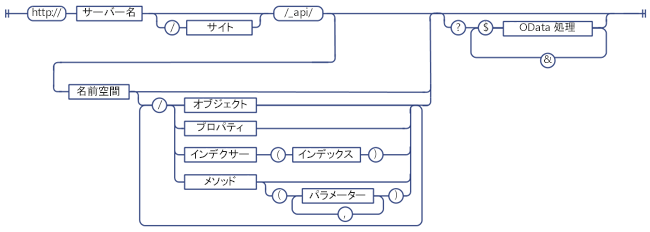
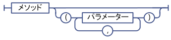
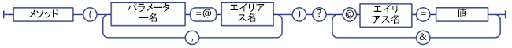
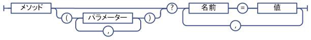
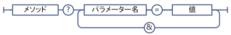

# SharePoint REST サービス エンドポイント URI を決定する
対応するクライアント オブジェクト モデル API のシグネチャから、SharePoint REST エンドポイント URI を決定するための一般的なガイドラインを説明します。
 **はじめに**


-  [SharePoint 2013 REST サービスの概要](get-to-know-the-sharepoint-2013-rest-service.md)


-  [REST サービスで表される SharePoint データ構造内を移動する](navigate-the-sharepoint-data-structure-represented-in-the-rest-service.md)


 **次の手順**


-  [SharePoint REST 要求で OData クエリ操作を使用する](use-odata-query-operations-in-sharepoint-rest-requests.md)


## SharePoint REST エンドポイント URI の構造

REST サービスを使用して SharePoint リソースにアクセスできるようにする前に、そのリソースを指す URI エンドポイントを理解する必要があります。これらの REST エンドポイント URI は、できる限り SharePoint クライアント オブジェクト モデルのリソースの API シグネチャ構造に近いものにされています。次にその例を示します。


 *クライアント オブジェクト モデルのメソッド* 


List.GetByTitle(listname).GetItems()


 *REST エンドポイント* 


 `http://server/site/_api/lists/getbytitle('listname')/items`


ただし、場合によっては、エンドポイント URI は対応するクライアント オブジェクト モデルのシグネチャとは異なることがあります。これは REST または OData の規則に準拠するためです。


次の図に、SharePoint REST URI の一般的な構文の構造を示します。


**SharePoint REST の URI 構文の構造**





SharePoint リソースの一部のエンドポイントには、この構文の構造は適用されません。


- 複合型のパラメーターを必要とするメソッド。

    対応するクライアント オブジェクト モデルのメソッドが、渡されるパラメーターの値として複合型を要求する場合、REST の制限により、その REST エンドポイントにはこの構文の構造が適用されません。


- 静的なメソッドとプロパティ。

    静的なメソッドとプロパティを表す URI の場合、REST エンドポイントにはこの構文の構造は適用されません。


## SharePoint 2013 REST サービス エンドポイントを決定する

SharePoint リソース用の REST エンドポイントを作成するには、次の手順に従います。


1. REST サービスの参照から始めます。

     `http://server/site/_api`


2. 適切なエントリ ポイントを指定します。次にその例を示します。

     `http://server/site/_api/web`


3. エントリ ポイントから、アクセスする特定のリソースに移動します。これには、クライアント オブジェクト モデルのメソッドに対応するエンドポイントのパラメーターの指定が含まれます。次にその例を示します。

     `http://server/site/_api/web/lists/getbytitle('listname')`


### エンドポイント URI で SharePoint 2013 REST サービスを参照する

エンドポイント URI で SharePoint 2013 の REST サービスであることを示すには、 `_api` を使用します。REST サービスは client.svc Web サービスの一部です。ただし、REST URI を簡単に作成し、基になる REST URI パスを短くするために、REST サービスでは抽象化した `_api` を使用して、client.svc Web サービスの参照を明示的に指定する手間を省いています。このようにしても、REST サービスは、client.svc Web サービスを参照する URI を識別し受け入れます。たとえば、 `http://server/site/_api/web/lists` とせずに、 `http://server/site/_vti_bin/client.svc/web/lists` と指定することもできますが、 `_api` を使用することをお勧めします。URL には 256 文字の制限があるため、 `_api` を使用してベース URI の長さを短くすることで、URL の他の部分に使う文字の数を増やすことができます。


### SharePoint 2013 REST サービスのエントリ ポイントを指定する

REST サービスの主なエントリ ポイントは、指定されたコンテキストのサイト コレクションとサイトを表します。この方法で、これらのエントリ ポイントはクライアント オブジェクト モデルの  [ClientContext.Site](https://msdn.microsoft.com/library/Microsoft.SharePoint.Client.ClientContext.Site.aspx) プロパティおよび [ClientContext.Web](https://msdn.microsoft.com/library/Microsoft.SharePoint.Client.ClientContext.Web.aspx) プロパティに対応します。


特定のサイト コレクションにアクセスするには、次の構造を使用します。


 `http://server/site/_api/site`


特定のサイトにアクセスするには、次の構造を使用します。


 `http://server/site/_api/web`


ここで、 *server*  はサーバーの名前、 *site*  は特定のサイトの名前 (パス名) を表します。


 `/site` と `/web` に加え、REST サービスには、他のアクセス ポイントがいくつか用意されており、開発者はそれらを使って特定の機能にアクセスすることができます。次の表は、これらのアクセス ポイントの一部を示しています。


|**機能領域**|**アクセス ポイント**|
|:-----|:-----|
|サイト  <br/> |http:// _server/site_/_api/site  <br/> |
|Web  <br/> |http:// _server/site_/_api/web  <br/> |
|ユーザー プロファイル  <br/> |http:// _server/site_/_api/SP.UserProfiles.PeopleManager  <br/> |
|検索  <br/> |http:// _server/site_/_api/search  <br/> |
 

### アクセスする特定のリソースに移動する

ここから、ダッシュで区切ったクライアント オブジェクト モデルの API 名を使用して、オブジェクト モデルを「階層化」することで、さらに具体的な REST エンドポイントを作成することができます。次の表は、クライアント オブジェクト モデルの呼び出しと、相当する REST エンドポイントの例を示しています。


|**クライアント オブジェクト モデル API**|**REST エンドポイント**|
|:-----|:-----|
|ClientContext.Web.Lists  <br/> |http:// _server_/ _site_/_api/web/lists  <br/> |
|ClientContext.Web.Lists[guid]  <br/> |http:// _server_/ _site_/_api/web/lists(' _guid_')  <br/> |
|ClientContext.Web.Lists.GetByTitle("Title")  <br/> |http:// _server_/ _site_/_api/web/lists/getbytitle(' _Title_')  <br/> |
 
エンドポイント URL では大文字と小文字が区別されます。たとえば前述の表で、 `/getbytitle` を使用して **GetByTitle()** メソッドに相当する REST を指定します。


## REST エンドポイント URI でのパラメーターを指定する

SharePoint 2013 では OData 仕様が拡張されており、かっこ () を使用してメソッドのパラメーターとインデックスの値を指定することができます。これにより、同名の複数のパラメーターを含む URI における曖昧性の問題を回避できます。たとえば、次の 2 つの URI には、同じ名前のパラメーターが含まれています。


 `http://server/site/_api/web/lists/getByTitle('Announcements')/fields/getByTitle('Description')`


 `http://server/site/_api/web/lists('<guid>')/fields/getById('<guid>')`


複数のパラメーターを指定するには、次のように、名前と値をペアにしたパラメーターを指定し、各パラメーターをコンマで区切ります。


 `http://server/site/_api/web/getAvailableWebTemplates(lcid=1033, includeCrossLanguage=true)`


次の図は、SharePoint の REST パラメーターの構文を示しています。


**SharePoint の REST パラメーターの構文**





### REST サービスの複合型のパラメーター

クライアント オブジェクト モデルの一部のメソッドでは、大きな負荷のかかるパラメーターを必要とするものがあります。REST エンドポイントでは、相当するクライアント オブジェクト モデル API との機能の同等性を維持するために、複合型のパラメーターを受け入れる必要があります。このような場合、REST サービスは既存の OData プロトコルを拡張し、これらの REST エンドポイントが複合型のパラメーターを 1 つ受け入れるようにします。これは **POST** 操作のみに適用され、複合型は OData 標準に従って、 [Atom](http://www.odata.org/developers/protocols/atom-format#RepresentingComplexTypesProperties) 形式または [JSON](http://www.odata.org/developers/protocols/json-format#RepresentingComplexTypeProperties) 形式で渡す必要があります。


たとえば、 [ListCollection.Add](https://msdn.microsoft.com/library/Microsoft.SharePoint.Client.ListCollection.Add.aspx) メソッドはパラメーターに [Microsoft.SharePoint.Client.ListCreationInformation](https://msdn.microsoft.com/library/Microsoft.SharePoint.Client.ListCreationInformation.aspx) オブジェクトをとります。特定のサイトにリストを追加するには、まず次のような適切な REST エンドポイントを作成します。


 `http://server/site/_api/web/lists/add`


次に、要求の本文で、複合型を渡します (ここでは JSON 形式)。



```

{ "d" : {
   "results": {
     "__metadata": {
       "type": "SP.ListCreationInformation"
     }, 
     "CustomSchemaXml": "…large payload…/", 
     "Description": "desc", 
     "DocumentTemplateType": "1", 
     "TemplateType": "101", 
     "Title": "Announcements"
   }
} 
}

```


### REST サービスの呼び出しにパラメーター エイリアスを使用する

OData の "パラメーター エイリアシング" セマンテックを使用して SharePoint REST エンドポイントにパラメーターを渡すことができます。パラメーター エイリアシングでは、パラメーター値は、パラメーター呼び出し内のエイリアスで識別され、実際の値は、URI のクエリ文字列で指定します。これにより、使用できる文字の種類を増やすことができ、クエリ文字列を使用して、一貫性のある形式を維持できます。


たとえば、次の 2 つの REST URI が同等です。


 *パラメーターの値を直接指定します。* 


 `http://server/site/_api/web/applyWebTemplate("STS#0")`


 *パラメーター エイリアスを使用し、URI のクエリ文字列に実際のパラメーター値を指定します。* 


 `http://server/site/_api/web/applyWebTemplate(title=@template)?@template="STS#0"`


ただし、SharePoint REST サービスでは、パラメーター エイリアシングで複合型を渡すことはできません。たとえば、パラメーター エイリアスに複合型を含んだ次の URI はサポートされません。


 `http://server/site/_api/userProfiles/People(7)/GetWorkplace(@address)?@address={"__metadata":{"type: "ODataDemo.Address"},"Street":"NE 228th", "City":"Sammamish","State":"WA","ZipCode":"98074","Country": "USA"}`


**SharePoint REST サービスのパラメーター エイリアシングの構文**





### パラメーター値にディクショナリを指定する

 `Dictionary<String, String>` ディクショナリをパラメーターにとるメソッドに対応する REST エンドポイントの場合、クエリ文字列内に、名前と値のペアをコンマで区切ったパラメーターとしてディクショナリを渡します。


**REST サービスのディクショナリ パラメーターの構文**





 `Dictionary<String, object>` は、以下の文字列プロパティを含む、KeyedPropertyValue という名前の複数値オブジェクトとして表されます。


- **Key** 複数値オブジェクトのキー


- **Value** オブジェクトの値


- **ValueType** オブジェクトの値の型。既存のエンティティ データ モデル (EDM) 型に対応する単純な値型の場合、REST サービスは EDM 型の適切な文字列 ("Edm.String." など) を返します。それ以外の場合は、 **Type.ToString** 関数が返す値型を返します。


### クエリ文字列にパラメーター値を指定する

REST URI の最後でメソッド呼び出しを行う場合は、次のように、クエリ構文を使用してメソッドのパラメーター値を指定できます。


 `http://<server>/<site>/_api/web/applyWebTemplate?template="STS#0"`


次の図は、クエリ文字列の REST サービスのパラメーターの構文を示しています。


**クエリ文字列の REST サービスのパラメーターの構文**





## 静的メソッドとプロパティを REST サービス URI として指定する

静的メソッドとプロパティに対応する URI を作成するには、ECMAScript オブジェクト モデルの対応する API 名 (名前空間の宣言から開始し、ドット表記を使用) を使用します。たとえば、ECMAScript クライアント オブジェクト モデルの  [SP.Utilities.Utility.getImageUrl(imageName)](http://msdn.microsoft.com/ja-jp/library/ee658947.aspx) は、次の REST に相当します。


 `http://server/site/_api/SP.Utilities.Utility.getImageUrl('imageName')`


ただし、静的プロパティは直接にしかアクセスできず、長い URI 構造の一部にすることはできません。たとえば、次のように、REST の **SP.Utility.AssetsLibrary** メソッドに直接アクセスすることができます。


 `http://server/site/_api/SP.Utility.assetsLibrary/id`


一方、次の例のように複雑な URI の場合、このリソース ロケーションをパラメーターとして使用することはできません。


 `http://server/site/_api/getList(~SP.Utility/assetsLibrary/id)`


次の図は、SharePoint REST サービスの静的メンバーの構文を示しています。


**SharePoint REST サービスの静的メンバーの構文**


## 次の手順

エンドポイントから要求したデータを選択、フィルター処理、または並べ替える場合、SharePoint REST サービスは 広範な OData クエリ文字列操作をサポートします。


## その他の技術情報
<a name="bk_addresources"> </a>


-  [SharePoint 2013 REST サービスの概要](get-to-know-the-sharepoint-2013-rest-service.md)


-  [SharePoint 2013 REST エンドポイントを使用して基本的な操作を完了する](complete-basic-operations-using-sharepoint-2013-rest-endpoints.md)


-  [REST を使用したリスト アイテムの操作](working-with-lists-and-list-items-with-rest.md)


-  [REST を使用してフォルダーとファイルを操作する](working-with-folders-and-files-with-rest.md)


-  [REST サービスで表される SharePoint データ構造内を移動する](navigate-the-sharepoint-data-structure-represented-in-the-rest-service.md)


-  [SharePoint REST 要求で OData クエリ操作を使用する](use-odata-query-operations-in-sharepoint-rest-requests.md)


-  [SharePoint 2013 REST API、エンドポイント、およびサンプル](02128c70-9d27-4388-9374-a11bce68fdb8.md)


-  [REST サービスを使用して SharePoint アイテムを同期させる](synchronize-sharepoint-items-using-the-rest-service.md)


-  [REST サービスで ETag を使用してドキュメント リスト アイテムのバージョンを取得する](5f7e0579-46b7-44ab-b3b4-cdbc622dcd98.md)


