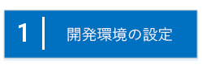
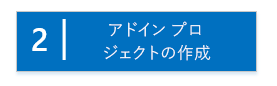
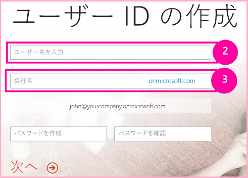
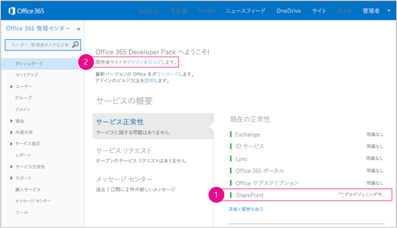
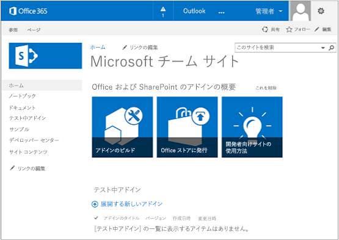
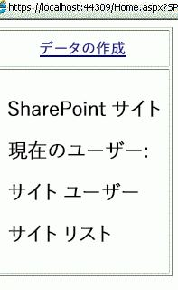

# プロバイダー ホスト型 SharePoint アドインの作成を始める
開発環境をセットアップし、初めてプロバイダー ホスト型 SharePoint アドイン を作成する
プロバイダー向けのホスト型アドインは、SharePoint アドイン の 2 つの主要な種類のうちの 1 つです。SharePoint アドイン の概要と、2 つの種類については、「 [SharePoint アドイン](sharepoint-add-ins.md)」を参照してください。次に、プロバイダー向けのホスト型アドインの概要を示します。


- それには、SharePoint ファームまたは SharePoint Online サブスクリプションから外部的にホストされている Web アプリケーション、サービス、またはデータベースが含まれます。SharePoint コンポーネントが含まれる場合もあります。外部コンポーネントは、LAMP (Linux、Apache、MySQL、PHP) スタックなどの Web ホスティング スタックでホストできます。


- アドイン内のカスタム ビジネス ロジックは、外部コンポーネントかカスタム SharePoint ページ上の JavaScript で実行する必要があります。


 [


](get-started-creating-provider-hosted-sharepoint-add-ins.md#Setup) [


](get-started-creating-provider-hosted-sharepoint-add-ins.md#Create) [


](get-started-creating-provider-hosted-sharepoint-add-ins.md#Code)


## 開発環境のセットアップ
<a name="Setup"> </a>

SharePoint アドイン 用に開発環境をセットアップする方法は多数あります。このセクションでは、最も簡単な方法について説明します。代わりの方法については、「 [その他の技術情報](#bk_addresources)」を参照してください。


### ツールを取得する


- **Visual Studio** 2013 以降をまだインストールしていない場合は、「 [Install Visual Studio](http://msdn.microsoft.com/library/da049020-cfda-40d7-8ff4-7492772b620f.aspx)」の指示に従ってインストールします。 [Microsoft ダウンロード センターの最新バージョン](https://www.visualstudio.com/downloads/download-visual-studio-vs)を使用することをお勧めします。


- Visual Studio には **Microsoft Office Developer Tools for Visual Studio** が含まれています。このツールのバージョンが Visual Studio の最新アップデートの前のリリースである場合もあります。最新バージョンのツールを確実に使用するため、 [Office Developer Tools for Visual Studio 2013 用インストーラー](http://aka.ms/OfficeDevToolsForVS2013)または  [Office Developer Tools for Visual Studio 2015 用インストーラー](http://aka.ms/OfficeDevToolsForVS2015)を実行してください。


### Office 365 開発者向けサイト へのサインアップ
<a name="o365_signup"> </a>


> **メモ**
>  既に Office 365 開発者向けサイト にアクセスできる可能性があります。> **MSDN サブスクライバーになっておられますか?** MSDN のサブスクライバーが所有する Visual Studio Ultimate および Visual Studio Premium には、特典として Office 365 Developer サブスクリプションが付いています。 [すぐに特典を利用できます。](https://msdn.microsoft.com/subscriptions/manage/default.aspx)> **以下のいずれかの Office 365 サブスクリプション プランをお持ちですか。**> **お持ちの場合には、Office 365 サブスクリプションの管理者は  [Office 365 管理センター](https://portal.microsoftonline.com/admin/default.aspx)を利用して 開発者向けサイト** を作成できます。詳細については、「 [既存の Office 365 サブスクリプション内で開発者向けサイトを作成する](create-a-developer-site-on-an-existing-office-365-subscription.md)」を参照してください。 


Office 365 プランを取得する方法は 3 つあります。


- Office 365 開発者向けプログラムを通じて、1 年間の無料 Office 365 開発者アカウントにサインアップします。 [詳細を確認する](http://dev.office.com/devprogram)か、そのまま [サインアップ フォーム](https://profile.microsoft.com/RegSysProfileCenter/wizardnp.aspx?wizid=14b845d0-938c-45af-b061-f798fbb4d170)に進みます。開発者向けプログラムにサインアップすると、開発者アカウントにサインアップするためのリンクが記載された電子メールが送信されます。次の手順に従ってください。


-  [無料の 30 日間の試用版](https://portal.microsoftonline.com/Signup/MainSignUp.aspx?OfferId=6881A1CB-F4EB-4db3-9F18-388898DAF510&amp;DL=DEVELOPERPACK) を使用します。1 つのユーザー ライセンスが付属しています。


-  [Office 365 Developer のサブスクリプション](https://portal.microsoftonline.com/Signup/MainSignUp.aspx?OfferId=C69E7747-2566-4897-8CBA-B998ED3BAB88&amp;DL=DEVELOPERPACK)を購入します。


> **ヒント**
> これらのリンクを別のウィンドウかタブで開いて、以下の手順をすぐに実行できるようにします。 


**図 1. Office 365 開発者向けサイトのドメイン名**





1. サインアップ フォームの最初のページ (図にはありません) は説明不要です。要求された情報を入力して、[ **次へ**] を選択します。


2. 図 1 の 2 番目のページで、サブスクリプションの管理者のユーザー ID を指定します。


3. **onmicrosoft.com** のサブドメイン (例: contoso.onmicrosoft.com) を作成します。

    サインアップの後で、生成された資格情報 ( _UserID_@ _yourdomain_.onmicrosoft.com の形式) を使用して、アカウントを管理する Office 365 ポータル サイトにサインインします。SharePoint Online 開発者向けサイトは、新しいドメイン **http:// _yourdomain_.sharepoint.com** でセットアップされます。


4. [ **次へ**] を選択し、フォームの最後のページに入力します。電話番号を入力して確認コードを取得することを選んだ場合は、携帯電話か固定電話回線の電話番号を入力できますが、VoIP (ボイス オーバー IP) 番号は入力 *できません*  。


> **メモ**
> 開発者アカウントにサインアップしようとするときに別の Microsoft アカウントでログオンしている場合は、「入力されたユーザー ID は機能しませんでした。有効なユーザー ID ではない可能性があります。組織で割り当てられたユーザー ID を入力していることを確認してください。ユーザー ID は通常、 *someone@example.com*  または *someone@example.onmicrosoft.com*  の形式です」のようなメッセージが表示されることがあります。> そのようなメッセージが表示された場合、使用していた Microsoft アカウントからログアウトし、もう一度やり直してください。引き続きこのメッセージが表示される場合は、ブラウザー キャッシュを消去するか、[ **InPrivate ブラウズ**] に切り替え、フォームにデータを入力します。 


サインアップ プロセスが終了したら、ブラウザーで Office 365 インストール ページが開きます。[管理] アイコンを選択して管理センターのページを開きます。


**図 2. Office 365 管理センターのページ**





1. 開発者向けサイト のセットアップが終了するまで待ちます。プロビジョニングが完了した後、ブラウザーで 管理センターのページを最新の情報に更新します。


2. その後、ページの左上の [ **アドインをビルド**] リンクをクリックして、開発者向けサイト を開きます。表示されるサイトは、図 3 のようなサイトのはずです。ページの [ **テスト中アドイン**] の一覧で、SharePoint の開発者向けサイトのテンプレートを使用して Web サイトが作成されたことを確認できます。このようなサイトではなく、通常のチーム サイトが表示される場合は、数分待ってから、もう一度サイトを起動してください。


3. サイトの URL を書き留めておきます。これは、Visual Studio で SharePoint アドイン プロジェクトを作成するときに使われます。


**図 3. 開発者向けサイトのホーム ページと [テスト中アドイン] の一覧**





## アドイン プロジェクトの作成
<a name="Create"> </a>


1. [ **管理者として実行**] オプションを使用して Visual Studio を開始します。


2. Visual Studio で [ **ファイル**] > [ **新規作成**] > [ **プロジェクト**] と選択します。


3. [ **新しいプロジェクト**] ダイアログ ボックスで、[ **Visual C#**] ノードを展開し、[ **Office/SharePoint**] ノードを展開して、[ **アドイン**] > [ **SharePoint アドイン**] を選択します。


4. プロジェクトに「SampleAddIn」という名前を付けて、[ **OK**] を選択します。


5. 最初に、[ **SharePoint アドインの設定を指定する**] ダイアログ ボックスで、以下のことを実行します。

  - アドインのデバッグに使用する SharePoint サイトの完全な URL を指定します。これは、開発者向けサイト の URL です。URL には HTTP ではなく HTTPS を使用します。この手順の途中、またはこの手順の終了後すぐに、このサイトにログインするよう求めるプロンプトが表示されます。プロンプトのタイミングはさまざまです。管理者の資格情報を使用してください (開発者向けサイトにサインアップしたときに作成した *.onmicrosoft.com ドメイン内の資格情報を使用します。例: MyName@contoso.onmicrosoft.com)。


  - [ **SharePoint アドインをホストする方法**] で [ **プロバイダー向けのホスト型**] を選択します。


  - [ **次へ**] を選択します。


6. [ **ターゲット SharePoint バージョンの指定**] ページで、[ **SharePoint Online**] 、[ **次へ**] と選択します。


7. [ **作成する Web アプリケーション プロジェクトのタイプはどれですか?**] で、[ **ASP.NET Web フォーム アプリケーション**] を選択します。[ **次へ**] を選択します。


8. [ **アドインの認証方法**] で、[ **Windows Azure アクセス制御サービスを使用する**] を選択します。


9. ウィザードで、[ **完了**] を選択します。

    構成の大半は、ソリューションが開くときに実行されます。2 つのプロジェクトが Visual Studio ソリューション内に作成されます。1 つは SharePoint アドイン のプロジェクトで、もう 1 つは ASP.NET Web アプリケーションのプロジェクトです。


## アドインのコーディング
<a name="Code"> </a>


1. AppManifest.xml ファイルを開きます。[ **権限**] タブで [ **サイト コレクション**] スコープを指定し、[ **読み取り**] 権限レベルを指定します。


2. Web アプリケーションの Pages/Default.aspx ファイルの **<body>** タグ内にあるすべてのマークアップを削除してから、以下の HTML と ASP.NET コントロールを **<body>** に追加します。このサンプルでは、 [UpdatePanel](https://msdn.microsoft.com/library/System.Web.UI.UpdatePanel.aspx) コントロールを使用して、部分ページ レンダリングを可能にしています。

 ```HTML

<form id="form1" runat="server">
  <div>
    <asp:ScriptManager ID="ScriptManager1" runat="server"
            EnablePartialRendering="true" />
    <asp:UpdatePanel ID="PopulateData" runat="server" UpdateMode="Conditional">
      <ContentTemplate>  
        <table border="1" cellpadding="10">
         <tr><th><asp:LinkButton ID="CSOM" runat="server" Text="Populate Data" 
                               OnClick="CSOM_Click" /></th></tr>
         <tr><td>

        <h2>SharePoint Site</h2>
        <asp:Label runat="server" ID="WebTitleLabel"/>

        <h2>Current User:</h2>
        <asp:Label runat="server" ID="CurrentUserLabel" />

        <h2>Site Users</h2>
        <asp:ListView ID="UserList" runat="server"> 
            <ItemTemplate >
              <asp:Label ID="UserItem" runat="server" 
                                Text="<%# Container.DataItem.ToString()  %>">
              </asp:Label><br />
           </ItemTemplate>
        </asp:ListView>

        <h2>Site Lists</h2>
               <asp:ListView ID="ListList" runat="server">
                   <ItemTemplate >
                     <asp:Label ID="ListItem" runat="server" 
                                Text="<%# Container.DataItem.ToString()  %>">
                    </asp:Label><br />
                  </ItemTemplate>
              </asp:ListView>
            </td>          
          </tr>
         </table>
       </ContentTemplate>
     </asp:UpdatePanel>
  </div>
</form>
 ```

3. 以下の宣言を Web アプリの Default.aspx.cs ファイルに追加します。

 ```cs

using Microsoft.SharePoint.Client;
using Microsoft.IdentityModel.S2S.Tokens;
using System.Net;
using System.IO;
using System.Xml;
 ```

4. Web アプリケーションの Default.aspx.cs ファイルで、次の変数を  [Page](https://msdn.microsoft.com/library/System.Web.UI.Page.aspx) クラス内に追加します。

 ```cs

SharePointContextToken contextToken;
string accessToken;
Uri sharepointUrl;
string siteName;
string currentUser;
List<string> listOfUsers = new List<string>();
List<string> listOfLists = new List<string>();
 ```

5.  `RetrieveWithCSOM` メソッドを [Page](https://msdn.microsoft.com/library/System.Web.UI.Page.aspx) クラス内に追加します。このメソッドは、SharePoint CSOM を使用してサイトに関する情報を取得し、ページ上に表示します。

 ```cs

// This method retrieves information about the host web by using the CSOM.
private void RetrieveWithCSOM(string accessToken)
{

    if (IsPostBack)
    {
        sharepointUrl = new Uri(Request.QueryString["SPHostUrl"]);
    }        

    ClientContext clientContext =
                    TokenHelper.GetClientContextWithAccessToken(
                        sharepointUrl.ToString(), accessToken);

    // Load the properties for the web object.
    Web web = clientContext.Web;
    clientContext.Load(web);
    clientContext.ExecuteQuery();

    // Get the site name.
    siteName = web.Title;

    // Get the current user.
    clientContext.Load(web.CurrentUser);
    clientContext.ExecuteQuery();
    currentUser = clientContext.Web.CurrentUser.LoginName;

    // Load the lists from the Web object.
    ListCollection lists = web.Lists;
    clientContext.Load<ListCollection>(lists);
    clientContext.ExecuteQuery();

    // Load the current users from the Web object.
    UserCollection users = web.SiteUsers;
    clientContext.Load<UserCollection>(users);
    clientContext.ExecuteQuery();

    foreach (User siteUser in users)
    {
        listOfUsers.Add(siteUser.LoginName);
    }


    foreach (List list in lists)
    {
        listOfLists.Add(list.Title);
    }
}
 ```

6.  `CSOM_Click` メソッドを [Page](https://msdn.microsoft.com/library/System.Web.UI.Page.aspx) クラス内に追加します。このメソッドは、ユーザーが [ **データの入力**] リンクをクリックしたときに発生するイベントをトリガーします。

 ```cs

protected void CSOM_Click(object sender, EventArgs e)
{
    string commandAccessToken = ((LinkButton)sender).CommandArgument;
    RetrieveWithCSOM(commandAccessToken);
    WebTitleLabel.Text = siteName;
    CurrentUserLabel.Text = currentUser;
    UserList.DataSource = listOfUsers;
    UserList.DataBind();
    ListList.DataSource = listOfLists;
    ListList.DataBind();
 }
 ```

7. 既存の  `Page_Load` メソッドを以下のコードに置き換えます。 `Page_Load` メソッドは TokenHelper.cs ファイルのメソッドを使用して、 `Request` オブジェクトからコンテキストを取得し、Microsoft Azure アクセス制御サービス (ACS) からアクセス トークンを取得します。

 ```cs

// The Page_load method fetches the context token and the access token.
// The access token is used by all of the data retrieval methods.
protected void Page_Load(object sender, EventArgs e)
{
     string contextTokenString = TokenHelper.GetContextTokenFromRequest(Request);

    if (contextTokenString != null)
    {
        contextToken =
            TokenHelper.ReadAndValidateContextToken(contextTokenString, Request.Url.Authority);

        sharepointUrl = new Uri(Request.QueryString["SPHostUrl"]);
        accessToken =
                    TokenHelper.GetAccessToken(contextToken, sharepointUrl.Authority)
                    .AccessToken;

         // For simplicity, this sample assigns the access token to the button's CommandArgument property. 
         // In a production add-in, this would not be secure. The access token should be cached on the server-side.
        CSOM.CommandArgument = accessToken;
    }
    else if (!IsPostBack)
    {
        Response.Write("Could not find a context token.");
        return;
    }
}
 ```

8. 終了すると、Default.aspx.cs ファイルは次のようになります。

 ```cs

using System;
using System.Collections.Generic;
using System.Linq;
using System.Web;
using System.Web.UI;
using System.Web.UI.WebControls;

using Microsoft.SharePoint.Client;
using Microsoft.IdentityModel.S2S.Tokens;
using System.Net;
using System.IO;
using System.Xml;

namespace SampleAddInWeb
{
    public partial class Default : System.Web.UI.Page
    {
        SharePointContextToken contextToken;
        string accessToken;
        Uri sharepointUrl;
        string siteName;
        string currentUser;
        List<string> listOfUsers = new List<string>();
        List<string> listOfLists = new List<string>();

        protected void Page_PreInit(object sender, EventArgs e)
        {
            Uri redirectUrl;
            switch (SharePointContextProvider.CheckRedirectionStatus(Context, out redirectUrl))
            {
                case RedirectionStatus.Ok:
                    return;
                case RedirectionStatus.ShouldRedirect:
                    Response.Redirect(redirectUrl.AbsoluteUri, endResponse: true);
                    break;
                case RedirectionStatus.CanNotRedirect:
                    Response.Write("An error occurred while processing your request.");
                    Response.End();
                    break;
            }
        }

        protected void CSOM_Click(object sender, EventArgs e)
        {
            string commandAccessToken = ((LinkButton)sender).CommandArgument;
            RetrieveWithCSOM(commandAccessToken);
            WebTitleLabel.Text = siteName;
            CurrentUserLabel.Text = currentUser;
            UserList.DataSource = listOfUsers;
            UserList.DataBind();
            ListList.DataSource = listOfLists;
            ListList.DataBind();
        }

        // This method retrieves information about the host web by using the CSOM.
        private void RetrieveWithCSOM(string accessToken)
        {

            if (IsPostBack)
            {
                sharepointUrl = new Uri(Request.QueryString["SPHostUrl"]);
            }


            ClientContext clientContext =
                    TokenHelper.GetClientContextWithAccessToken(
                        sharepointUrl.ToString(), accessToken);


            // Load the properties for the web object.
            Web web = clientContext.Web;
            clientContext.Load(web);
            clientContext.ExecuteQuery();

            // Get the site name.
            siteName = web.Title;

            // Get the current user.
            clientContext.Load(web.CurrentUser);
            clientContext.ExecuteQuery();
            currentUser = clientContext.Web.CurrentUser.LoginName;

            // Load the lists from the Web object.
            ListCollection lists = web.Lists;
            clientContext.Load<ListCollection>(lists);
            clientContext.ExecuteQuery();

            // Load the current users from the Web object.
            UserCollection users = web.SiteUsers;
            clientContext.Load<UserCollection>(users);
            clientContext.ExecuteQuery();

            foreach (User siteUser in users)
            {
                listOfUsers.Add(siteUser.LoginName);
            }

            foreach (List list in lists)
            {
                listOfLists.Add(list.Title);
            }
        }

        protected void Page_Load(object sender, EventArgs e)
        {
            string contextTokenString = 
                 TokenHelper.GetContextTokenFromRequest(Request);

            if (contextTokenString != null)
            {
                contextToken =
                    TokenHelper.ReadAndValidateContextToken(contextTokenString, Request.Url.Authority);

                sharepointUrl = new Uri(Request.QueryString["SPHostUrl"]);
                accessToken =
                    TokenHelper.GetAccessToken(contextToken, sharepointUrl.Authority)
                               .AccessToken;
                CSOM.CommandArgument = accessToken;
            }
            else if (!IsPostBack)
            {
                Response.Write("Could not find a context token.");
                return;
            }
        }
    }
}
 ```

9. F5 キーを使用して、アドインを展開して実行します。自己署名 Localhost 証明書を信頼するか尋ねる [ **セキュリティの警告**] ウィンドウが表示されたら、[ **はい**] を選択します。

    同意確認ページで [ **信頼する**] を選択してアドインにアクセス許可を付与します。Visual Studio が IIS Express に Web アプリケーションをインストールし、その後、アドインを SharePoint テスト サイトにインストールして起動します。次のスクリーン ショットのような表が含まれたページが表示されます。[ **Populate Data**] を選択すると、SharePoint サイトの概要情報が表示されます。


   **基本的なプロバイダー向けのホスト型アドインのサンプルの起動ページ**





## 次の手順
<a name="SP15createprovider_nextsteps"> </a>

アドインを SharePoint の UI スキームに統合する方法については、「 [プロバイダー向けのホスト型アドインに SharePoint の外観を付与する](give-your-provider-hosted-add-in-the-sharepoint-look-and-feel.md)」を参照してください。


## その他の技術情報
<a name="bk_addresources"> </a>


- 「すべてオンプレミス」の環境など、開発環境を設定する他の方法については、SharePoint アドイン の目次の「 [ツール](tools-and-environments-for-developing-sharepoint-add-ins.md)」セクションを参照してください。


