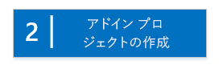

# SharePoint ホスト型の SharePoint アドインの作成を始める
開発環境をセットアップし、初めて SharePoint ホスト型 SharePoint アドイン を作成する
SharePoint ホスト型アドインは、SharePoint アドイン の 2 つの主要な種類のうちの 1 つです。SharePoint アドインの概要と、2 つの種類については、「 [SharePoint アドイン](sharepoint-add-ins.md)」を参照してください。次に、SharePoint ホスト型アドインの概要を示します。
  
    
    


- SharePoint リスト、Web パーツ、ワークフロー、カスタム ページなどのコンポーネントが含まれます。これらはすべて、アドインがインストールされている SharePoint Web サイトの、アドイン Webと呼ばれるサブ Web にインストールされます。
    
  
- 含まれているコードは、カスタム SharePoint ページ上の JavaScript のみです。
    
  

 [
  
    
    
](get-started-creating-sharepoint-hosted-sharepoint-add-ins.md#Setup) [
  
    
    
](get-started-creating-sharepoint-hosted-sharepoint-add-ins.md#Create) [
  
    
    
](get-started-creating-sharepoint-hosted-sharepoint-add-ins.md#Code)
  
    
    


## 開発環境のセットアップ
<a name="Setup"> </a>

SharePoint アドイン 用に開発環境をセットアップする方法は多数あります。このセクションでは、最も簡単な方法について説明します。代わりの方法については、「 [その他の技術情報](#bk_addresources)」を参照してください。
  
    
    

### ツールを取得する


- **Visual Studio** 2013 以降をまだインストールしていない場合は、「 [Install Visual Studio](http://msdn.microsoft.com/library/da049020-cfda-40d7-8ff4-7492772b620f.aspx)」の指示に従ってインストールします。 [Microsoft ダウンロード センターの最新バージョン](https://www.visualstudio.com/downloads/download-visual-studio-vs)を使用することをお勧めします。
    
  
- Visual Studio には、 **Microsoft Office Developer Tools for Visual Studio** が含まれます。Visual Studio の更新の間でこのツールのバージョンがリリースされることがあります。最新バージョンのツールを確実に使用するため、 [Office Developer Tools for Visual Studio 2013 用インストーラー ](http://aka.ms/OfficeDevToolsForVS2013)、または  [Office Developer Tools for Visual Studio 2015 用インストーラー](http://aka.ms/OfficeDevToolsForVS2015)を実行してください。
    
  

### Office 365 開発者向けサイト へのサインアップ
<a name="o365_signup"> </a>


> [!メモ]
>  既に Office 365 開発者向けサイト にアクセスできる可能性があります。> **MSDN サブスクライバーになっておられますか?** MSDN のサブスクライバーが所有する Visual Studio Ultimate および Visual Studio Premium には、特典として Office 365 Developer サブスクリプションが付いています。 [すぐに特典を利用できます。](https://msdn.microsoft.com/subscriptions/manage/default.aspx)> **以下のいずれかの Office 365 サブスクリプション プランをお持ちですか。**> **お持ちの場合には、Office 365 サブスクリプションの管理者は  [Office 365 管理センター](https://portal.microsoftonline.com/admin/default.aspx)を利用して 開発者向けサイト** を作成できます。詳細については、「 [既存の Office 365 サブスクリプション内で開発者向けサイトを作成する](create-a-developer-site-on-an-existing-office-365-subscription.md)」を参照してください。 
  
    
    

Office 365 プランを取得する方法は 3 つあります。
  
    
    

- Office 365 開発者向けプログラムを通じて、1 年間の無料 Office 365 開発者アカウントにサインアップします。 [詳細を確認する](http://dev.office.com/devprogram)か、そのまま [サインアップ フォーム](https://profile.microsoft.com/RegSysProfileCenter/wizardnp.aspx?wizid=14b845d0-938c-45af-b061-f798fbb4d170)に進みます。開発者向けプログラムにサインアップすると、開発者アカウントにサインアップするためのリンクが記載された電子メールが送信されます。次の手順に従ってください。
    
  
-  [無料の 30 日間の試用版](https://portal.microsoftonline.com/Signup/MainSignUp.aspx?OfferId=6881A1CB-F4EB-4db3-9F18-388898DAF510&amp;DL=DEVELOPERPACK) を使用します。1 つのユーザー ライセンスが付属しています。
    
  
-  [Office 365 Developer のサブスクリプション](https://portal.microsoftonline.com/Signup/MainSignUp.aspx?OfferId=C69E7747-2566-4897-8CBA-B998ED3BAB88&amp;DL=DEVELOPERPACK)を購入します。
    
  

> [!ヒント]
> これらのリンクを別のウィンドウかタブで開いて、以下の手順をすぐに実行できるようにします。 
  
    
    


**図 1. Office 365 開発者向けサイトのドメイン名**

  
    
    

  
    
    

  
    
    

  
    
    

  
    
    

1. サインアップ フォームの最初のページ (図にはありません) は説明不要です。要求された情報を入力して、[ **次へ**] を選択します。
    
  
2. 図 1 の 2 番目のページで、サブスクリプションの管理者のユーザー ID を指定します。
    
  
3. **onmicrosoft.com** のサブドメイン (例: contoso.onmicrosoft.com) を作成します。
    
    サインアップの後で、生成された資格情報 ( _UserID_@ _yourdomain_.onmicrosoft.com の形式) を使用して、アカウントを管理する Office 365 ポータル サイトにサインインします。SharePoint Online 開発者向けサイトは、新しいドメイン **http:// _yourdomain_.sharepoint.com** でセットアップされます。
    
  
4. [ **次へ**] を選択し、フォームの最後のページに入力します。電話番号を入力して確認コードを取得することを選んだ場合は、携帯電話か固定電話回線の電話番号を入力できますが、VoIP (ボイス オーバー IP) 番号は入力 *できません*  。
    
  

    
> [!メモ]
> 開発者アカウントにサインアップしようとするときに別の Microsoft アカウントでログオンしている場合は、「入力されたユーザー ID は機能しませんでした。有効なユーザー ID ではない可能性があります。組織で割り当てられたユーザー ID を入力していることを確認してください。ユーザー ID は通常、 *someone@example.com*  または *someone@example.onmicrosoft.com*  の形式です」のようなメッセージが表示されることがあります。> そのようなメッセージが表示された場合、使用していた Microsoft アカウントからログアウトし、もう一度やり直してください。引き続きこのメッセージが表示される場合は、ブラウザー キャッシュを消去するか、[ **InPrivate ブラウズ**] に切り替え、フォームにデータを入力します。 
  
    
    

サインアップ プロセスが終了したら、ブラウザーで Office 365 インストール ページが開きます。[管理] アイコンを選択して管理センターのページを開きます。
  
    
    

**図 2. Office 365 管理センターのページ**

  
    
    

  
    
    

  
    
    

  
    
    

1. 開発者向けサイト のセットアップが終了するまで待ちます。プロビジョニングが完了した後、ブラウザーで 管理センターのページを最新の情報に更新します。
    
  
2. その後、ページの左上の [ **アドインをビルド**] リンクをクリックして、開発者向けサイト を開きます。表示されるサイトは、図 3 のようなサイトのはずです。ページに表示される [ **テスト中アドイン**] の一覧で、SharePoint の開発者向けサイトのテンプレートを使用して Web サイトが作成されたことを確認できます。このようなサイトではなく、通常のチーム サイトが表示される場合は、数分待ってから、サイトを再起動してください。
    
  
3. サイトの URL を書き留めておきます。これは、Visual Studio で SharePoint アドイン プロジェクトを作成するときに使われます。
    
  

**図 3. 開発者向けサイトのホーム ページと [テスト中アドイン] の一覧**

  
    
    

  
    
    

  
    
    

  
    
    

  
    
    

## アドイン プロジェクトの作成
<a name="Create"> </a>


1. [ **管理者として実行**] オプションを使用して Visual Studio を開始します。
    
  
2. [ **ファイル**] > [ **新規作成**] > [ **新しいプロジェクト**] を選択します。
    
  
3. [ **新しいプロジェクト**] ダイアログ ボックスで、[ **Visual C#**] ノードを展開し、[ **Office/SharePoint**] ノードを展開して、[ **アドイン**] > [ **SharePoint 用アドイン**] を選択します。
    
  
4. プロジェクトに EmployeeOrientation という名前を付けて [ **OK**] を選択します。
    
  
5. 最初の [ **SharePoint 用アドインの設定を指定する**] ダイアログ ボックスで、アドインのデバッグに使用する SharePoint サイトの完全な URL を指定します。これは、開発者向けサイト の URL です (URL には HTTP ではなく HTTPS を使います)。[ **SharePoint アドインをホストする方法**] で、[ **SharePoint ホスト型**] を選択します。[ **完了**] を選択します。
    
  
6. 開発者向けサイト へのログインを求めるメッセージが表示されることがあります。その場合には、サブスクリプション管理者の資格情報を使用します。
    
  
7. プロジェクトを作成したら、プロジェクトのルートからファイル **/Pages/Default.aspx** を開きます。特に、この生成されたファイルは、SharePoint でホストされている 2 つのスクリプトである、sp.runtime.js と sp.js のいずれか、または両方を読み込みます。これらのファイルを読み込むマークアップは、ファイルの先頭付近に位置する、 **PlaceHolderAdditionalPageHead** という ID の **Content** コントロールにあります。マークアップは、使用している **Microsoft Office Developer Tools for Visual Studio** のバージョンによって異なります。この一連のチュートリアルでは、両方のファイルを読み込むことが必要であり、それらのファイルを **<SharePoint:ScriptLink>** タグではなく、通常の HTML **<script>** タグで読み込むことが必要です。 **PlaceHolderAdditionalPageHead** コントロールの中の行 `<meta name="WebPartPageExpansion" content="full" />` の *すぐ上*  に、次の行があることをご確認ください。
    
  ```
  
<script type="text/javascript" src="/_layouts/15/sp.runtime.js"></script>
<script type="text/javascript" src="/_layouts/15/sp.js"></script> 

  ```


    次いで、2 ファイルのどちらかを読み込むマークアップが他にもないかファイルを検索し、重複するマークアップを削除します。ファイルを保存して閉じます。
    
  

## アドインのコーディング
<a name="Code"> </a>

初めての SharePoint ホスト型 SharePoint アドインの場合、従来の SharePoint 拡張 (ユーザー設定リストとリスト インスタンス) を含めます。
  
    
    

1. **ソリューション エクスプローラー**で、AppManifest.xml ファイルを開きます。
    
  
2. マニフェスト デザイナーが開くので、 **Title** フィールドの単語間にスペースを入れてEmployee Orientation とします ( **Name** フィールドは変更 *しない*  でください)。
    
  
3. ファイルを保存して閉じます。
    
  
4. **ソリューション エクスプローラー**でプロジェクトを右クリックして、[ **追加**] > [ **新しいフォルダー**] と選択します。フォルダーの名前を Lists とします。
    
  
5. 新しいフォルダーを右クリックして、[ **追加**] > [ **新しいアイテム**] と選択します。[ **新しいアイテムの追加**] ダイアログが **Office/SharePoint** ノードに対して開きます。
    
  
6. [ **リスト**] を選択します。名前を NewEmployeeOrientation として、[ **追加**] を選択します。
    
  
7. [ **SharePoint カスタマイズ ウィザード**] の [ **リストの設定を選択**] ページで、リストの表示名を既定の **NewEmployeeOrientation** のままにして、[ **カスタマイズ可能なリスト テンプレートおよびそのリスト インスタンスを作成**] オプション ボタンを選択します。続いて、ドロップダウン リストで [ **既定 (カスタム リスト)**] 、さらに [ **完了**] と選択します。
    
  
8. ウィザードによって **NewEmployeeOrientation** リスト テンプレートが作成され、 **NewEmployeeOrientationInstance** という名前の子リスト インスタンスが入ります。リスト デザイナーが開く場合があります。後ほど使用します。
    
  
9. **ソリューション エクスプローラー**で **NewEmployeeOrientationInstance** ノードがまだ展開されていない場合にはこの時点で展開し、リスト *インスタンス*  の子である elements.xml ファイルと、リスト *テンプレート*  の子である elements.xml ファイルをはっきりと区別できるようにします。
    
   **ソリューション エクスプローラー内の Lists ノード**

  

     
  

    
    
  
10. **NewEmployeeOrientation** リスト テンプレートの子である elements.xml を開きます。
    
  
11. **DisplayName** 属性 ( **Name** 属性ではありません) にスペースを追加し、"New Employee Orientation" と分かりやすくします。
    
  
12. **Description** 属性を"Orientation information about new employees" と設定します。
    
  
13. 他のすべての属性は既定のままにして、ファイルを保存して閉じます。
    
  
14. リスト デザイナーが開かない場合、 **ソリューション エクスプローラー**で **NewEmployeeOrientation** ノードを選択します。
    
  
15. デザイナーで [ **リスト**] タブを開きます。このタブを使用して、リスト  *インスタンス*  (リスト *テンプレート*  ではありません) の特定の値を設定します。ただし、一部の既定値はテンプレートから継承されます。
    
  
16. このタブの値を次のように変更します。
    
  - **タイトル**: New Employees in Seattle
    
  
  - **リストの URL**: Lists/NewEmployeesInSeattle
    
  
  - **説明**: The new employees in Seattle.
    
  

    チェックボックスは既定の状態のままにして、ファイルを保存してデザイナーを閉じます。
    
  
17. リスト インスタンスの名前が **ソリューション エクスプローラー**で古いままの場合があります。その場合、 **NewEmployeeOrientationInstance** のショートカット メニューを開いて [ **名前変更**] を選択し、NewEmployeesInSeattle という名前に変更します。
    
  
18. schema.xml ファイルを開きます。
    
  
19. **BaseViewID** 値が "0" の **View** 要素で、既存の **ViewFields** 要素を次のマークアップで置換します ( `Title` という名前の **FieldRef** にこの GUID を正確にそのまま使用してください)。
    
     *自動生成されたこの schema.xml ファイルでは想定外の場所に改行が示される場合があります。 **ViewFields** 要素の開始タグと終了タグの数が一致していることを確認してください。読みやすくするために改行を追加します。* 
    


  ```
  
<ViewFields>
  <FieldRef Name="Title" ID="{fa564e0f-0c70-4ab9-b863-0177e6ddd247}" DisplayName="Employee" />
 </ViewFields>
  ```

20. 引き続き schema.xml ファイルで、 **BaseViewID** 値が "1" の **View** 要素で、既存の **ViewFields** 要素を次のマークアップで置換します ( `LinkTitle` という名前の **FieldRef** にこの GUID を正確にそのまま使用してください)。
    
  ```
  
<ViewFields>
  <FieldRef Name="LinkTitle" ID="{82642ec8-ef9b-478f-acf9-31f7d45fbc31}" DisplayName="Employee" />
</ViewFields>
  ```

21. schema.xml ファイルを保存して閉じます。
    
  
22. リスト  *インスタンス* **NewEmployeesInSeattle** の子である elements.xml ファイル (リスト *テンプレート* **NewEmployeeOrientation** の子である elements.xml ではありません) を開きます。
    
  
23. このファイルでは、いくらかの初期データをリストに取り込みます。これを行うには、以下の **Data** 要素マークアップを **ListInstance** 要素の子要素として追加します。.
    
  ```
  
<Data>
  <Rows>
    <Row>
      <Field Name="Title">Tom Higginbotham</Field>
    </Row>
    <Row>
      <Field Name="Title">Satomi Hayakawa</Field>
    </Row>
    <Row>
      <Field Name="Title">Cassi Hicks</Field>
    </Row>
    <Row>
      <Field Name="Title">Lertchai Treetawatchaiwong</Field>
    </Row>
  </Rows>
</Data>
  ```

24. ファイルを保存して閉じます。
    
  
25. **ソリューション エクスプローラー**で **Feature1** をダブルクリックしてフィーチャー デザイナーを開きます。デザイナーで [ **タイトル**] を New Employee Orientation Components に、[ **説明**] を Lists and other components for getting employees oriented to the company に設定します。ファイルを保存して、デザイナーを閉じます。
    
  
26. **ソリューション エクスプローラー**の **Feature1** が自動的に名前変更されない場合、ショートカット メニューを開いて [ **名前変更**] を選択し、NewEmployeeOrientationComponents に変更します。
    
  
27. Default.aspx ファイルを開きます。
    
  
28. ID が **PlaceHolderPageTitleInTitleArea** の ASP.NET **Content** 要素を検索します。既定の文字列 "Page Title" を "New Employees by Location" に置き換えます。
    
  
29. ID が **PlaceHolderMain** の ASP.NET **Content** 要素を検索します。そのコンテンツを次のマークアップに *置き換えます*  。 ` _spPageContextInfo` は、SharePoint が自動的にページに組み込む JavaScript オブジェクトです。その `webAbsoluteUrl` プロパティによって、アドイン Web の URL が返されます。
    
  ```XML
  
<p><asp:HyperLink runat="server"
    NavigateUrl="JavaScript:window.location = _spPageContextInfo.webAbsoluteUrl + '/Lists/NewEmployeesInSeattle/AllItems.aspx';" 
    Text="New Employees in Seattle" /></p>

  ```


## アドインの実行とリストのテスト
<a name="Code"> </a>


  
    
    

1. F5 キーを使用して、アドインを展開して実行します。Visual Studio によって、アドインの一時的なインストール環境が SharePoint テスト サイトに作成され、アドインがすぐに実行されます (インストール済みの SharePoint アドイン をエンド ユーザーが実行する方法については、 [次の手順](#Nextsteps)をご覧ください)。
    
  
2. アドインの既定のページが開いたら、[ **New Employees in Seattle**] リンクを選択してユーザー設定リストのインスタンスを開きます。
    
   **既定のページとリスト ビュー ページ**

  

     
  

    
    
  
3. リストでアイテムの追加および削除を行います。
    
  
4. デバッグ セッションを終了するには、ブラウザー ウィンドウを閉じるか、Visual Studio でデバッグを停止します。F5 を押すたびに、Visual Studio によって、旧バージョンのアドインが取り消され、最新バージョンのアドインがインストールされます。
    
  
5. このアドインおよび他の記事の Visual Studio ソリューションを操作し、それが終了したら前回のアドインを取り消すとよいでしょう。 **ソリューション エクスプローラー**のプロジェクトを右クリックして、[ **取り消し**] を選択します。
    
  

## 
<a name="Nextsteps"> </a>

現時点では、リスト内にそれほど多くのオリエンテーション情報は含まれていません。このシリーズの後ほどの記事で情報を追加します。ただし、こコーディングはしばらく中断し、れから SharePoint アドイン の展開方法について「 [SharePoint 用の SharePoint ホスト型アドインを展開してインストールする](deploy-and-install-a-sharepoint-hosted-sharepoint-add-in.md)」で取り上げます。
  
    
    

