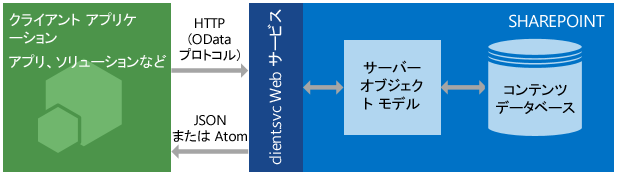

# SharePoint 2013 REST サービスの概要
SharePoint 2013 REST サービスを使用して SharePoint データに対してアクセスおよび更新する方法と、REST および OData Web プロトコル規格の使用についての基本事項を説明します。
SharePoint 2013 では、既存の SharePoint  [クライアント オブジェクト モデル](http://msdn.microsoft.com/library/88e5e1b9-eab2-4f3b-a3f2-75c96b86f1f4%28Office.15%29.aspx)と比較できる REST (Representational State Transfer) サービスを導入しています。開発者は、REST Web 要求をサポートするテクノロジを使用して SharePoint データとリモートで対話できるようになりました。つまり、開発者は自身の SharePoint アドイン、ソリューション、およびクライアント アプリケーションから REST Web テクノロジと標準の Open Data Protocol (OData) 構文を使用して、 **Create**、 **Read**、 **Update**、および **Delete** (CRUD) 操作を実行できるようになりました。
  
    
    


## 前提条件

このトピックでは、REST と REST 要求の作成方法に基本的に精通しているものとします。
  
    
    

## SharePoint 2013 REST サービスのしくみ
<a name="bk_how"> </a>

SharePoint 2013 では、REST を使用して、SharePoint サイトをリモートから操作できるようにする機能が追加されました。これにより、ユーザーのコードは、標準の REST 機能をサポートする技術を使用することで SharePoint オブジェクトと直接やり取りできます。
  
    
    
REST を使用して SharePoint リソースにアクセスするには、目的のクライアント オブジェクト モデル API に対応する Open Data Protocol (OData) 標準を使用して REST 対応の HTTP 要求を作成します。次にその例を示します。
  
    
    
 *クライアント オブジェクト モデルのメソッド:* 
  
    
    
List.GetByTitle(listname) 
  
    
    
 *REST エンドポイント:* 
  
    
    
 `http://server/site/_api/lists/getbytitle('listname')`
  
    
    
SharePoint の client.svc Web サービスが HTTP 要求を処理し、Atom または JSON (JavaScript Object Notation) のいずれかの形式で適切な応答を返します。クライアント アプリケーションは、その応答を解析する必要があります。次の図に SharePoint REST サービスのアーキテクチャの概要を示します。
  
    
    

**SharePoint REST サービスのアーキテクチャ**

  
    
    

  
    
    

  
    
    
クライアント オブジェクト モデルは、その機能と使いやすさのため, .NET Framework 管理コード、Silverlight、または JavaScript を使用した SharePoint との通信の開発において、依然として主要な選択肢となっています。
  
    
    

### SharePoint 2013 REST サービスでの HTTP コマンドの使用
<a name="bk_usingHTTP"> </a>

SharePoint 2013 に組み込まれた REST 機能を使用するには、使用するクライアント オブジェクト モデル API に対応する OData 規格を使用して REST に対応した HTTP 要求を構築します。client.svc Web サービスは HTTP 要求を処理し、Atom または JavaScript Object Notation (JSON) 形式で適切な応答をします。その後クライアント アプリケーションは、その応答を解析する必要があります。
  
    
    
SharePoint 2013 REST サービスのエンドポイントは、SharePoint クライアント オブジェクト モデルの型およびメンバーに対応します。HTTP 要求を使用して、これらの REST エンドポイントを使って、リストやサイトなどの SharePoint エンティティに対して典型的な CRUD 操作を行うことができます。 
  
    
    
一般に、以下のことが行われます。
  
    
    


|**エンドポイントで実行する操作**|**この HTTP 要求を使用する**|**注意点**|
|:-----|:-----|:-----|
|リソースを読み取る  <br/> |**GET** <br/> ||
|リソースを作成または更新する  <br/> |**POST** <br/> |**POST** を使用してリストやサイトなどのエンティティを作成します。SharePoint 2013 REST サービスは、コレクションを表すエンドポイントにオブジェクト定義を含める **POST** コマンドの送信をサポートしています。 <br/> **POST** 操作では、必須ではないプロパティはすべて既定値に設定されます。 **POST** 操作の一部として読み取り専用プロパティを設定すると、サービスによって例外が返されます。 <br/> |
|リソースを更新または挿入する  <br/> |**PUT** <br/> |**PUT** および **MERGE** 操作を使用して既存の SharePoint オブジェクトを更新します。 <br/>  オブジェクト プロパティの **set** 操作を表すサービス エンドポイントは、 **PUT** 要求と **MERGE** 要求の両方をサポートします。 <br/> **MERGE** 要求については、プロパティの設定は省略可能です。プロパティを明示的に設定しなくても、現在のプロパティが保持されます。 <br/> **PUT** 要求については、オブジェクトの更新ですべての必須のプロパティを指定しない場合、REST サービスは例外を返します。さらに、明示的に設定しない省略可能なプロパティは既定のプロパティに設定されます。 <br/> |
|リソースを削除する  <br/> |**DELETE** <br/> |特定のエンドポイント URL に対して HTTP の **DELETE** コマンドを実行すると、そのエンドポイントが表していた SharePoint オブジェクトが削除されます。 <br/> リスト、ファイル、リスト アイテムなど、再利用可能なオブジェクトの場合は、結果的に **Recycle** 操作になります。 <br/> |
   

### SharePoint リソースにアクセスするための REST URL の構築
<a name="bk_constructURLs"> </a>

これらの REST エンドポイントの URI は、できる限り API シグネチャの構造に近いものとします。REST サービスの主なエントリ ポイントは、指定されたコンテキストのサイト コレクションとサイトを表します。 
  
    
    
特定のサイト コレクションにアクセスするには、次の構造を使用します。
  
    
    
 `http://server/site/_api/site`
  
    
    
特定のサイトにアクセスするには、次の構造を使用します。
  
    
    
 `http://server/site/_api/web`
  
    
    
どちらの場合も、 *server*  はサーバーの名前、 *site*  は特定のサイトの名前 (パス名) を表します。
  
    
    
これを基本形として、ダッシュで区切ったクライアント オブジェクト モデルの API 名を使用して、オブジェクト モデルを「階層化」することで、さらに具体的な REST URI を作成することができます。
  
    
    
この構文は、SocialFeedManager または SocialFollowingManager の REST API には適用されません。詳細については、「 [SharePoint 2013 ソーシャル フィード REST API リファレンス](http://msdn.microsoft.com/library/f1cb914f-1e91-4e23-bf53-d2ab323eac13%28Office.15%29.aspx)メール アプリのアクティブ化のトラブルシューティング [SharePoint 2013 でのユーザーやコンテンツのフォローに関する REST API リファレンス](http://msdn.microsoft.com/library/c05755df-846d-4a39-941d-950d066cc6d4%28Office.15%29.aspx)」を参照してください。
  
    
    
対応するクライアント オブジェクト モデル API のシグネチャから SharePoint REST エンドポイント URI を決定する詳細なガイドラインについては、「 [SharePoint REST サービス エンドポイント URI を決定する](determine-sharepoint-rest-service-endpoint-uris.md)」を参照してください。
  
    
    

## SharePoint REST エンドポイントの例
<a name="bk_URLexamples"> </a>

以下の表に、SharePoint データでの作業を開始するための典型的な REST エンドポイント URL 例を示します。完全修飾の REST URL を構築するには、表に示される URL フラグメントの先頭に  `http://server/site/_api/` を付けます。 **POST** コマンドの場合に必要であれば、表には、指定した SharePoint アイテムを作成するために HTTP 要求の本文で渡す必要のあるサンプル データを示しています。斜体の項目は実際の値に置き換える必要のある変数です。
  
    
    


|**説明**|**URL エンドポイント**|**HTTP メソッド**|**本文のコンテンツ**|
|:-----|:-----|:-----|:-----|
|リストのタイトルを取得  <br/> | `web/title` <br/> |GET  <br/> |適用できません  <br/> |
|サイト上のすべてのリストを取得  <br/> | `lists` <br/> |GET  <br/> |適用できません  <br/> |
|単一の 'リスト' メタデータを取得  <br/> | `lists/getbytitle('listname')` <br/> |GET  <br/> |適用できません  <br/> |
|リスト内のアイテムを取得  <br/> | `lists/getbytitle('listname')/items` <br/> |GET  <br/> |適用できません  <br/> |
|ドキュメントの特定のプロパティを取得 (この場合はドキュメント タイトル)  <br/> | `lists/getbytitle('listname')?select=Title` <br/> |GET  <br/> |適用できません  <br/> |
|リストの作成  <br/> | `lists` <br/> |POST  <br/> |
```

{
  '_metadata':{'type':SP.List},
  'AllowContentTypes': true,
  'BaseTemplate': 104 ,
  'ContentTypesEnabled': true,
  'Description': 'My list description ',
  'Title': 'RestTest '
}
```

|
|リストへのアイテムの追加  <br/> | `lists/getbytitle('listname')/items` <br/> |POST  <br/> |
```

{
  '_metadata':{'type':SP.listname ListItem},
  'Title': 'MyItem'
}

```

|
   

## バッチ ジョブのサポート
<a name="batch"> </a>

SharePoint Online (およびオンプレミスの SharePoint 2016 以降の) REST サービスは、OData  `$batch` クエリ オプションを使用して複数の要求を組み合わせてサービスへの 1 つの呼び出しにすることをサポートしています。詳細およびコード サンプルへのリンクについては、「 [REST API によりバッチ要求を発行する](make-batch-requests-with-the-rest-apis.md)」を参照してください。
  
    
    

## その他の技術情報
<a name="bk_learnmore"> </a>

SharePoint REST サービスの使用の詳細については、次のリソースを使用してください。
  
    
    

|||
|:-----|:-----|
| [SharePoint 2013 REST エンドポイントを使用して基本的な操作を完了する](complete-basic-operations-using-sharepoint-2013-rest-endpoints.md) <br/> |SharePoint 2013 REST インターフェイスで基本的な作成、読み取り、更新、および削除 (CRUD) の操作を実行する方法について説明します。  <br/> |
| [REST を使用したリスト アイテムの操作](working-with-lists-and-list-items-with-rest.md) <br/> |SharePoint 2013 REST インターフェイスを使用して、リストとリスト アイテムで基本的な作成、読み取り、更新、および削除 (CRUD) の操作を実行する方法について説明します。  <br/> |
| [REST を使用してフォルダーとファイルを操作する](working-with-folders-and-files-with-rest.md) <br/> |SharePoint 2013 REST インターフェイスを使用して、フォルダーとファイルで基本的な作成、読み取り、更新、および削除 (CRUD) の操作を実行する方法について説明します。  <br/> |
| [REST サービスで表される SharePoint データ構造内を移動する](navigate-the-sharepoint-data-structure-represented-in-the-rest-service.md) <br/> |特定の SharePoint アイテムに対して REST エンドポイントから開始し、アイテムがある親サイトやライブラリ構造など、関連アイテムに移動してアクセスする方法について説明します。  <br/> |
| [SharePoint REST サービス エンドポイント URI を決定する](determine-sharepoint-rest-service-endpoint-uris.md) <br/> |対応するクライアント オブジェクト モデル API のシグネチャから SharePoint REST エンドポイント URI を決定するための一般的なガイドラインについて説明します。  <br/> |
| [SharePoint REST 要求で OData クエリ操作を使用する](use-odata-query-operations-in-sharepoint-rest-requests.md) <br/> |広範な OData クエリ文字列演算子を使用して、SharePoint REST サービスから要求するデータの選択、フィルター抽出、および並べ替えを行う方法について説明します。  <br/> |
| [SharePoint 2013 REST API、エンドポイント、およびサンプル](02128c70-9d27-4388-9374-a11bce68fdb8.md) <br/> |このページには、MSDN で SharePoint 2013 の開発者向けに用意されている REST のすべてのリソースへのリンクが掲載されています。  <br/> |
| [SharePoint 検索 REST API の概要](http://msdn.microsoft.com/library/8a4f7863-e4c1-4099-9189-a1894db36930%28Office.15%29.aspx) <br/> |SharePoint Server 2013 の検索 REST サービスおよび REST Web 要求をサポートするテクノロジを使用して、クライアント アプリケーションおよびモバイル アプリケーションに検索機能を追加します。  <br/> |
| [SharePoint 2013 ソーシャル フィード REST API リファレンス](http://msdn.microsoft.com/library/f1cb914f-1e91-4e23-bf53-d2ab323eac13%28Office.15%29.aspx) <br/> |フィード関連タスクの SharePoint 2013 REST エンドポイントについて説明します。  <br/> |
| [SharePoint 2013 でのユーザーやコンテンツのフォローに関する REST API リファレンス](http://msdn.microsoft.com/library/c05755df-846d-4a39-941d-950d066cc6d4%28Office.15%29.aspx) <br/> |次の人物とコンテンツの SharePoint 2013 REST エンドポイントについて説明します。  <br/> |
| [REST API によりバッチ要求を発行する](make-batch-requests-with-the-rest-apis.md) <br/> |複数の要求を、REST サービスへの 1 つの呼び出しに結合する方法について説明します。  <br/> |
| [REST サービスを使用して SharePoint アイテムを同期させる](synchronize-sharepoint-items-using-the-rest-service.md) <br/> |SharePoint REST サービスの一部である **GetListItemChangesSinceToken** リソースを使用して、SharePoint とアドインまたはサービス間でアイテムを同期させる方法を説明します。 <br/> |
| [REST サービスで ETag を使用してドキュメント リスト アイテムのバージョンを取得する](5f7e0579-46b7-44ab-b3b4-cdbc622dcd98.md) <br/> |SharePoint リストとリスト項目の同時実行制御のため SharePoint REST サービスで HTML ETag を使用する方法を説明します。  <br/> |
   

## OData の技術情報
<a name="SP15startREST_bk_addlresources"> </a>


  
    
    

-  [OData について](http://msdn.microsoft.com/ja-jp/data/hh237663)
    
  
-  [Open Data Protocol の例](http://msdn.microsoft.com/ja-jp/library/ff478141.aspx)
    
  
-  [Open Data Protocol](http://www.odata.org/)
    
  
-  [OData Protocol URI の規則](http://www.odata.org/documentation/odata-version-2-0/uri-conventions/)
    
  
-  [サービス操作への対応](http://www.odata.org/documentation/odata-version-2-0/uri-conventions#AddressingServiceOperations)
    
  
-  [OData Protocol の操作](http://www.odata.org/documentation/odata-version-2-0/operations/)
    
  
-  [エラー条件](http://www.odata.org/documentation/odata-version-2-0/operations#ErrorConditions)
    
  

