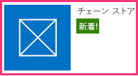

# プロバイダー向けのホスト型アドインに SharePoint の外観を付与する
プロバイダー向けのホスト型 SharePoint アドインを SharePoint の外観にする方法について説明します。
これは、プロバイダー向けのホスト型 SharePoint アドインの開発の基本に関する記事のシリーズの 2 番目です。「 [SharePoint アドイン](sharepoint-add-ins.md)」とこのシリーズの前の記事を十分に理解している必要があります。
  
    
    


-  [プロバイダー ホスト型 SharePoint アドインの作成を始める](get-started-creating-provider-hosted-sharepoint-add-ins.md)
    
  

このシリーズの前の記事では、開発環境をセットアップする方法と、Visual Studio を使用して、アドインのリモート Web アプリケーション内の SharePoint データを公開する 1 つ目の "Hello World" レベルのアドインを作成する方法を学習しました。この記事では、既に作成済みの SharePoint アドイン ソリューションで作業を始めます。このソリューションには、ASP.NET Web フォーム アプリケーションと SQL Azure データベースが組み込まれています。このソリューションが既に作成済みの理由は、このシリーズの記事の目的が SharePoint アドインだけに焦点を当てることだからです。このシリーズの各記事で、さらに SharePoint の機能を追加してアドインに統合することになります。
  
    
    


## 基本アドインの概要

このシリーズでは、ASP.NET や T-SQL のプログラミングについては説明していませんが、アドインを SharePoint に統合する前に、アドインのリモート コンポーネントについて多少理解している必要があります。アドインのシナリオでは、小売店のチェーンを想定しており、親会社の SharePoint Online サブスクリプション内に各ストアのチーム Web サイトがあると仮定しています。ストアでそのチーム サイト上にアドインをインストールすると、そのアドインにより SharePoint のデータやエクスペリエンスを、親会社のデータベース内のデータと統合できます。アドインの各インスタンスは企業データベース内に独自のテナンシーがあり、ユーザーは自分のストアに関連付けられている企業データのみを操作できます。
  
    
    

### 最初に 2 つのチェーン店のチーム サイトを作成する


1. SharePoint Online のホーム ページを開き、クイック起動で **[サイト コンテンツ]** リンクをクリックします。 **[サイト コンテンツ]** ページで下にスクロールして、 **[新しいサブサイト]** リンクが表示されたらリンクをクリックします。
    
  
2. **[新しい SharePoint サイト]** ページで、次のスクリーン ショットの値を使用して新しいチーム サイトのフォームに記入します。
    
     
  

  

  
3. その他の設定はすべて既定のままにして、 **[作成]** を押します。
    
  

### アドインを調べる


1.  [SharePoint_Provider-hosted_Add-Ins_Tutorials](https://github.com/OfficeDev/SharePoint_Provider-hosted_Add-ins_Tutorials) に移動し、 **[Download ZIP]** ボタンをクリックして、リポジトリをデスクトップにダウンロードします。このファイルを解凍します。
    
  
2.  *管理者として*  Visual Studio を起動し、BeforeSharePointUI.sln を開きます。このソリューションには次の 3 つのプロジェクトがあります。
    
  - **ChainStore** - SharePoint アドイン プロジェクト。
    
  
  - **ChainStoreWeb** - リモート Web アプリケーション。
    
  
  - **ChainCorporateDB** - SQL Azure データベース。
    
  
3. **ChainStore** プロジェクトを選択し、 **[プロパティ]** ウインドウで、 **[サイト URL]** プロパティを香港のチーム サイトの完全な URLhttps://{YOUR_SHAREPOINT_DOMAIN}/hongkong/ に設定します。末尾に "/" 文字が含まれていることを確認してください。 **[保存]** ボタンを押します。 *このプロセスの特定の時点で、SharePoint Online サブスクリプションへのログインを求めるメッセージが表示されます。* 
    
  
4. **ソリューション エクスプローラー**の上部にあるソリューション ノードを右クリックして、 **[スタートアップ プロジェクトの設定]** を選択します。
    
  
5. **[操作]** 列でこれらの 3 つのプロジェクトがすべて **[開始]** に設定されていることを確認します。
    
  
6. F5 キーを使用し、アドインをデプロイして実行します。Visual Studio は、IIS Express ではリモート Web アプリケーションをホストし、SQL Express では SQL データベースをホストします。また、テスト用の SharePoint サイト上でアドインの一時インストールを行い、そのアドインを直ちに実行します。スタート ページが表示される前に、アドインへのアクセス許可を付与するように求めるメッセージが表示されます。
    
  
7. アドインのスタート ページは、以下のスクリーン ショットのようになります。最上部は、アドインがインストールされている SharePoint Web サイトの名前になります。これは、Office Developer Tools for Visual Studio が生成するサンプル コードの副作用です。後のステップで変更することになります。ページには、会社の **[在庫]**、 **[注文]**、 **[従業員]** SQL データベース テーブルのデータを参照できる領域があります。これらのテーブルは最初は空です。
    
     
  

  

  
8. ページの下部にある **[注文フォーム]** リンクを開いて、注文フォームを開きます。フォームに値を入力して **[注文]** を押します。次のスクリーン ショットには例が示されています。表面的には何も起きていないように見えますが、ボタンの背後でコードは値を SQL データベース内のパラメーター化されたストアド プロシージャに渡します。パラメーター化されたストアド プロシージャを使用すると、データベースが SQL インジェクション攻撃から保護されます。
    
     
  

  

  
9. ブラウザーの [戻る] ボタンを使用してスタート ページに戻り、 **[注文の表示]** ボタンを押します。ページが最新の状態に更新され、次のスクリーン ショットのようなページに注文が表示されます。
    
    テーブルには **[テナント]** フィールドがあり、値としてテスト用の SharePoint Web サイトの URL があります。この値は、テナンシーと呼ばれることもある SharePoint Online サブスクリプションを参照しません。代わりに、アドインの各インスタンスが企業データベース内の別個のテナントになります。特定の SharePoint ホスト Web にはアドインのインスタンスを 1 つしかインストールできないので、ホスト Web の URL をデータベース内のテナントの識別子として使用できます (ホスト Web とアドイン Web の違いを復習するには、「 [SharePoint アドイン](sharepoint-add-ins.md)」をご覧ください)。アドイン内のすべてのストアド プロシージャは、データベースからの読み書きの際に、識別子の値を組み込みます。そのため、ユーザーが **[注文の表示]** (または **[従業員の表示]** か **[在庫の表示]**) ボタンを押したときに、そのユーザーのストアに関連付けられているデータだけがデータベースから取得されるようになります。またこの設計により、ユーザーが自分のストアだけで注文したり従業員を追加したりできるようになります。
    
    リモート Web アプリケーションは、SharePoint がアドインの起動時にスタート ページの URL に追加するクエリ文字列パラメーターから、ホスト Web の URL を取得します。SSL が使用されるので、このクエリ文字列は暗号化されてインターネット経由でリモート Web アプリケーションに送られます。 
    
     
  

  

  
10. デバッグ セッションを終了するには、ブラウザー ウィンドウを閉じるか、Visual Studio でデバッグを停止します。F5 を押すたびに、Visual Studio は前のバージョンのアドインを取り消し、最新のアドインをインストールします。
    
  
11. 既定では、Visual Studio でのデバッグ セッションの間、アドインは SharePoint ホスト Web にインストールされたままになります。アドインをインストールした後にエンド ユーザーが起動する方法については、ブラウザーで Fabrikam の香港の SharePoint Web サイトを開き、 **[サイト コンテンツ]** ページに移動します。次のスクリーン ショットのような、アドインのタイルが表示されます。
    
     
  

    
    > **メモ**
      > デバッグを停止すると Visual Studio により IIS Express セッションが閉じられるので、タイルをクリックしてもスタート ページは開かれません。 

## デバッグ セッションごとに企業データベースを再構築するように Visual Studio を構成する
<a name="Rebuild"> </a>

 既定では、Visual Studio は SQL Express データベースを再構築 *しません*  。したがって、1 つのデバッグ セッションでデータベースに追加する注文などのアイテムは、後のセッション内でも引き続きデータベース内に残ります。F5 キーを押すたびに空のデータベースを使用して作業を始める方が簡単なので、次のステップを実行します。
  
    
    

1. **ChainCorporateDB** プロジェクトを右クリックして、 **[プロパティ]** を選択します。
    
  
2. **[デバッグ]** タブを開いて、 **[データベースを常に再作成する]** オプションを有効にします。
    
  

## リモート Web アプリケーションを SharePoint の外観にする
<a name="Rebuild"> </a>

シナリオによってはリモート ページ独自のブランド化を行いますが、ほとんどの場合は、ユーザーが依然として SharePoint を使用しているかのように感じるように、SharePoint の UI を模倣する必要があります。
  
    
    

### スタート ページに SharePoint のクロムとトップ バーを追加する


1. **ソリューション エクスプローラー**で、 **[ChainStoreWeb] | [ページ]** に移動し、CorporateDataViewer.aspx ファイルを開きます。これは、アドインのスタート ページです。
    
  
2. **head** セクションに、いくつかの JavaScript ライブラリを読み込むスクリプトがあります。その下に次のような別のスクリプトを追加します。このスクリプトは、各 SharePoint Web サイトの /_layouts/15/ フォルダーにある SP.UI.Controls.js ファイルを読み込みます。このファイルは特に SharePoint CSS ライブラリを読み込みます。
    
  ```
  
<script type="text/javascript">
    var hostweburl;

    // Load the SharePoint resources.
    $(document).ready(function () {

        // Get the URI decoded add-in web URL.
        hostweburl =
            decodeURIComponent(
                getQueryStringParameter("SPHostUrl")
        );

        // The SharePoint js files URL are in the form:
        // web_url/_layouts/15/resource.js
        var scriptbase = hostweburl + "/_layouts/15/";

        // Load the js file and continue to the 
        // success handler.
        $.getScript(scriptbase + "SP.UI.Controls.js")
    });

    // Function to retrieve a query string value.
    function getQueryStringParameter(paramToRetrieve) {
        var params =
            document.URL.split("?")[1].split("&amp;");
        var strParams = "";
        for (var i = 0; i < params.length; i = i + 1) {
            var singleParam = params[i].split("=");
            if (singleParam[0] == paramToRetrieve)
                return singleParam[1];
        }
    }
</script>
  ```

3. ページの本文セクションの上部に、次のマークアップを追加します。クロム コントロールと呼ばれる SharePoint トップ バーがページ上に挿入されます。この記事の後半で、改訂したアドインをテストするときに、このマークアップの詳細が分かります (使用するアドインは "アプリ" と呼ばれるので、一部のプロパティ名には "アプリ" という文字列が表示されます)。
    
  ```
  
<!-- Chrome control placeholder. Options are declared inline.  -->
<div 
    id="chrome_ctrl_container"
    data-ms-control="SP.UI.Controls.Navigation"  
    data-ms-options=
        '{  
            "appHelpPageUrl" : "Help.aspx",
            "appIconUrl" : "/Images/AppIcon.png",
            "appTitle" : "Chain Store",
            "settingsLinks" : [
                {
                    "linkUrl" : "Account.aspx",
                    "displayName" : "Account settings"
                },
                {
                    "linkUrl" : "Contact.aspx",
                    "displayName" : "Contact us"
                }
            ]
         }'>
</div>
  ```

4. **H1** ヘッダーとページの本文のハイパーリンクには、SharePoint の CSS ライブラリで定義されているスタイルが自動的に使用されるので、変更は不要です。SharePoint スタイルの使用方法を図示するには、3 つの **GridView** コントロールの列見出しを SharePoint の "すべて大文字" スタイルに設定します。この設定を行うには、 **HeaderStyle-CssClass** 属性を各コントロールに追加して、値を " `ms-uppercase`" に設定します。以下に例を示します。同様の変更を 3 つの **GridView** コントロールすべてに行います。
    
  ```XML
  
<asp:GridView ID="ordersGridView" runat="server" CellPadding="5" GridLines="None"
HeaderStyle-CssClass="ms-uppercase" />
  ```

5. クロム コントロールではアドインのアイコンが使用されるので、リモート Web サーバー上にアイコン ファイルの 2 つ目のコピーが必要です。 **ソリューション エクスプローラー**で、 **ChainStore** プロジェクト内の AppIcon.png ファイルを右クリックし、 **[コピー]** を選択します。
    
  
6. **ChainStoreWeb** プロジェクト内の **[画像]** フォルダーを右クリックして、 **[貼り付け]** を選択します。
    
  
7. CorporateDataViewer.aspx.cs ファイルを開きます。
    
  
8.  `CorporateDataViewer` クラスは **SharePointContext** 型のプライベート メンバーを宣言します。このクラスは、プロジェクトの作成時に Office Developer Tools for Visual Studio により生成された SharePointContext.cs ファイル内で定義されています。ASP.NET の **HttpContextBase** クラスにホスト Web の URL などの SharePoint のコンテキスト情報が追加されたようなものと見なすことができます。
    
    **Page_Load** メソッドには、リモートのスタート ページに SharePoint ホスト Web の名前を書き込む **using** ステートメントがあります。これはサンプル コードなので、 **using** ステートメント全体を削除してください (ただし、 `spContext` 変数を初期化する行を残します)。メソッドは次のようになります。
    


  ```cs
  
protected void Page_Load(object sender, EventArgs e)
{
    spContext = SharePointContextProvider.Current.GetSharePointContext(Context);
}
  ```

9. 次の 4 つの ASP.NET ファイルにも SharePoint UI が必要です。 
    
  - Account.aspx
    
  
  - Contact.aspx
    
  
  - Help.aspx
    
  
  - OrderForm.aspx
    
  

    > **メモ**
      > プロジェクトに残っている aspx ファイル EmployeeAdder.aspx は実際にレンダリングされることはないので、この UI は変更しません。詳しくは、このシリーズの以降の記事で学習します。 

    しかし、これらのページにはクロム コントロールは不要です。必要なのは SharePoint CSS ライブラリへのアクセスだけです。これらの 4 つのファイルごとに、次のマークアップを **head** 要素に追加します。
    


  ```XML
  
<link type="text/css" rel="stylesheet"
href="<%= spContext.SPHostUrl.ToString() + "_layouts/15/defaultcss.ashx" %>" />
  ```

10. このステップと次のステップは、[注文フォーム] ページと [アカウント] ページでは既に完了しているので、[連絡先] ページと [ヘルプ] ページだけに適用されます。各ページ上に  `spContext` オブジェクトを取得するには、3 つの aspx ページの *. aspx.cs 分離コード ファイルを開きます。それぞれのファイルで、次のメンバーを **Page** クラスに追加します。
    
  ```cs
  
protected SharePointContext spContext;
  ```

11. **Page_Load** メソッドを次のバージョンに置き換えます。オブジェクトはセッション キャッシュから取得されます。これは、初めて作成されたときにアドインのスタート ページの **Page_Load** メソッドによりキャッシュされたものです。
    
  ```cs
  protected void Page_Load(object sender, EventArgs e)
{
    spContext = Session["SPContext"] as SharePointContext;
}
  ```

12. OrderForm.aspx ページを開きます。上部の **Label** 要素で、 **[注文]** 句の **<b>** 要素を、 `ms-accentText` CSS クラスを参照する span タグに置き換えます。作業が完了したら、 **Label** コントロール全体は次のようになるはずです。
    
  ```XML
  
<asp:Label ID="lblOrderPrompt" runat="server"
         Text="Enter a supplier, product, and quantity; and then press <span class='ms-accentText'>Place Order</span>.">
</asp:Label>
  ```


## アドインを実行して新しい SharePoint UI をテストする
<a name="Rebuild"> </a>


  
    
    

1. F5 キーを使用し、アドインをデプロイして実行します。Visual Studio は、IIS Express ではリモート Web アプリケーションをホストし、SQL Express では SQL データベースをホストします。また、テスト用の SharePoint サイト上でアドインの一時インストールを行い、そのアドインを直ちに実行します。スタート ページが表示される前に、アドインへのアクセス許可を付与するように求めるメッセージが表示されます。
    
  
2. アドインのスタート ページが開くと、SharePoint ページのようになっています。 **[注文フォーム]** リンクをクリックします。同じく SharePoint フォームのようになっています。
    
     
  

  

  
3. 注文を作成して **[注文]** を押します。
    
  
4.  ブラウザーの [戻る] ボタンを使用してアドインのスタート ページに戻ってから、 **[注文の表示]** を押します。ページは次のようになります。列見出しがすべて大文字になっていることに注目してください。
    
     
  

  

  
5. クロム コントロールの末尾の **[?]** アイコンを押します。単純なヘルプ ページが開きます。ブラウザーの [戻る] ボタンをクリックします。
    
  
6. クロム コントロールの歯車アイコンを押します。[アカウント] ページと [連絡先] ページのリンクがあるメニューが開きます。[アカウント] ページを開き、ブラウザーの [戻る] ボタンを使用してスタート ページに戻ります。[連絡先] ページでも同じ作業を行います。
    
  
7. クロム コントロール上の **[サイトに戻る]** ボタンをクリックします。ホスト Web の、香港店のチーム サイトのホーム ページが開きます。
    
  
8. トップ バーの歯車アイコンをクリックしてから、 **[外観の変更]** を選択します。
    
  
9. サイトをいずれかの代替の "概観 " に変更するよう求めるメッセージに従います。
    
  
10. **[サイト コンテンツ]** ページに移動し、そのタイルからチェーン店アプリを起動します。カスタム ページは選択した外観になります。次のスクリーン ショットは、 **[ナチュラル]** で構成された外観を表しています。
    
     
  

  

  
11. サイトの外観を既定値の **[オフィス]** に変更します。
    
  
12. デバッグ セッションを終了するには、ブラウザー ウィンドウを閉じるか、Visual Studio でデバッグを停止します。F5 を押すたびに、Visual Studio は前のバージョンのアドインを取り消し、最新のアドインをインストールします。
    
  
13. 他の記事でもこのアドインと Visual Studio ソリューションを処理するので、前回の処理が終了してからしばらく経過したらアドインを取り消すことをお勧めします。 **ソリューション エクスプローラー**でプロジェクトを右クリックして、 **[取り消し]** を選択します。
    
  

## 
<a name="Nextsteps"> </a>

 この時点でアドインは SharePoint に似ていますが、依然として単なる Web アプリケーションで、SharePoint と実際に統合しておらず、SharePoint 内のタイルから起動できません。次の記事「 [プロバイダー向けのホスト型アドインにカスタム ボタンを含める](include-a-custom-button-in-the-provider-hosted-add-in.md)」で、カスタム リボン ボタンから起動するカスタム コマンドを追加します。
  
    
    

