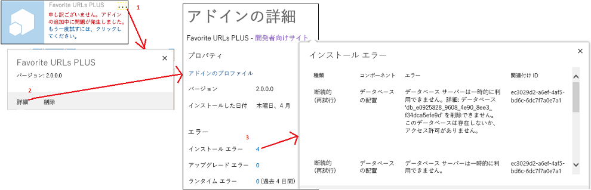
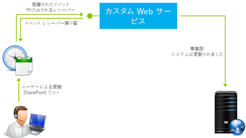

# SharePoint アドインのイベントの処理

カスタム コードによって、プロバイダー ホスト型アドインにおける次の 3 つのカテゴリのイベントを処理できます。
  
    
    


- **リスト イベント**。Web サイト上におけるリストの追加、削除など。
    
  
- **リスト項目イベント**。リスト内の項目の編集など。
    
  
- **アドイン イベント**。アドインのインストールなど。
    
  

SharePoint ホスト型 SharePoint アドインはイベント処理をサポートしていませんが、ワークフローをトリガーするようにイベントを設定することによってワークフローをリストやリスト項目イベント ハンドラーに近いものに変換できます。「 [SharePoint 2013 のワークフロー](http://msdn.microsoft.com/library/e0602371-ae22-44be-8a7e-9e47e9f046d6%28Office.15%29.aspx)」をご覧ください。ワークフローをアドイン イベントによってトリガーすることはできないため、アドイン イベントは SharePoint ホスト型アドインを使用して処理できません。
  
    
    


> **メモ**
> Web サイト イベントとサイト コレクション イベントは SharePoint アドイン ではサポートされていません。 
  
    
    

以下の 2 種類のイベントがあります。
- ** *before*  イベント** は、SharePoint インフラストラクチャが自身の何らかのイベントの処理 (コンテンツ データベースへの変更のコミットを含む) を行う前にトリガーされます。SharePoint において、 **カスタム before イベント ハンドラーは常に同期的に実行されます** 。これは特に、イベントのキャンセルに使用できます。たとえばアドインに、リストを削除する機能がある場合、リスト削除イベント用のハンドラーは、特定の条件が満たされない場合に削除をキャンセルできます。イベントが一連のイベントの一部である場合には、それをキャンセルすると、後続のイベントがどれも全く行われないことになります。たとえば、 **ItemAdding** イベント用のハンドラーがイベントをキャンセルした場合、通常ならその後に行われる **ItemAdded** イベントはトリガーされません。
    
  
- ** *after*  イベント** は、SharePoint インフラストラクチャが自身の何らかのイベントの処理を行った後にトリガーされます。SharePoint において、 **リスト イベントおよびリスト項目イベントに対するリモート after イベント ハンドラーは、常に非同期的に実行されます** 。(アプリのイベントは例外です。) これは特に、イベントをログに記録するために使用できます。
    
  

## リスト イベントおよびリスト項目イベントを処理する
<a name="RER"> </a>

リスト イベントとリスト項目イベントを処理するには、リモート イベント レシーバー (RER) を作成します。RER は、SharePoint ファームまたは SharePoint Online に対して外部的に実行する Web サービスです。RER サービスの URL は、それを処理するイベントに登録されます。ハンドラーを登録するには、次の 2 つの方法があります。
  
    
    

- ホスト Web のイベントは、CSOM (クライアント側オブジェクト モデル) または SharePoint REST API によってプログラムを使用して登録されます。通常このタスクは、アドインまたはハンドラーでアドイン イベントの「初回実行」ロジックで実行されます (アドイン イベントの概要に関しては、この記事の後半の「 [アドイン イベントを処理する](#HandlingAppEvents)」をご覧ください)。プログラムを使用してリスト イベントを登録するコード サンプルについては、「 [OfficeDev/PnP/Samples/Core.EventReceivers](https://github.com/OfficeDev/PnP/tree/master/Samples/Core.EventReceivers)」をご覧ください。
    
  
- アドイン Web のイベントは、通常、簡単な XML マークアップをいくつか使用してアドイン Web の機能に登録されます。マークアップとサービスの作成方法について詳しくは、「 [SharePoint アドインでリモート イベント レシーバーを作成する](create-a-remote-event-receiver-in-sharepoint-add-ins.md)」に記されています。また、プログラムを使用してアドイン Web イベントを登録することもできます。
    
  

> **メモ**
> RER には ファーム ソリューション のイベント レシーバーと同じ目的がありますが、イベント レシーバーの場合、SharePoint サーバーで実行するカスタム コードがあるので SharePoint アドインでは使用できません。 
  
    
    

アドインは、以下のリスト イベントとドキュメント ライブラリ イベントを処理できます。「ing」で終わるイベントは before (同期) イベントで、「ed」で終わるイベントは after (非同期) イベントです。
  
    
    

|||
|:-----|:-----|
|ListAdding  <br/> |ListAdded  <br/> |
|ListDeleting  <br/> |ListDeleted  <br/> |
|FieldAdding  <br/> |FieldAdded  <br/> |
|FieldDeleting  <br/> |FieldDeleted  <br/> |
|FieldUpdating  <br/> |FieldUpdated  <br/> |
   
フィールド更新イベントは、リスト上のフィールド (列) のプロパティ (並べ替えが可能かどうかなど) の変更を対象とし、フィールド内のデータの変更は対象としていません。
  
    
    
アドインは、以下のリスト項目イベントを処理できます。
  
    
    

|||
|:-----|:-----|
|ItemAdding  <br/> |ItemAdded  <br/> |
|ItemUpdating  <br/> |ItemUpdated  <br/> |
|ItemDeleting  <br/> |ItemDeleted  <br/> |
|ItemCheckingOut  <br/> |ItemCheckedOut  <br/> |
|ItemCheckingIn  <br/> |ItemCheckedIn  <br/> |
|ItemUncheckingOut  <br/> |ItemUncheckedOut  <br/> |
|ItemAttachmentAdding  <br/> |ItemAttachmentAdded  <br/> |
|ItemAttachmentDeleting  <br/> |ItemAtttachmentDeleted  <br/> |
|ItemFileMoving  <br/> |ItemFileMoved  <br/> |
|ItemVersionDeleting*  <br/> |ItemVersonDeleted*  <br/> |
||ItemFileConverted  <br/> |
   

> **メモ**
> * これら 2 つの新しいイベントは、Visual Studio UI では利用できない可能性があります。その場合には、ItemDeleting または ItemDeleted を選択し、手動で名前を変更します。 
  
    
    

Visual Studio で作業して、RER を SharePoint アドイン プロジェクトに追加すると、Office Developer Tools for Visual Studio によって以下のことが実行されます。
  
    
    

- Web サービス ファイル (RemoteEventReceiver1.svc など) が Web アプリケーションに追加され、リモート イベント レシーバーを SharePoint アドイン に追加したときに指定したイベントを処理します。この Web サービスにはリモート イベントを処理するためのコード ファイルが含まれています。
    
    リモート イベント レシーバーを作成したら、イベントを処理するコードを Web アプリケーション サービスのコード ファイルに追加します。既定で、処理コードを追加するコード ファイルには次の 2 つのメソッドが含まれています。
    
  -  `ProcessEvent()` は「before」イベント (前述の表の左側のイベントなど) を処理して、イベントをキャンセルするか、続行するかを報告するオブジェクトを SharePoint に返します。
    
  
  -  `ProcessOneWayEvent()` は「after」イベントを処理します。非同期的に実行され、SharePoint に何も返しません。
    
  

    登録したイベントが発生すると、SharePoint によってサービス内の該当するメソッドが呼び出され、コードにコンテキスト情報を提供するオブジェクトが渡されます。たとえば、(前述の 2 つの表のいずれかの) イベントの種類が特定され、コードがそのイベントに適切なロジックに枝分かれできるようになります。
    
  
- リモート イベント レシーバー用のプロジェクト アイテムが SharePoint アドイン プロジェクトに追加されます。リモート イベント レシーバー用の Elements.xml ファイルは、Web アプリケーション内の Web サービスと、指定されたリモート イベントを参照します。次の例は、リスト項目の追加および削除に対応する Elements.xml ファイルです。
    
 ```XML
  
<?xml version="1.0" encoding="utf-8"?>
<Elements xmlns="http://schemas.microsoft.com/sharepoint/">
  <Receivers ListTemplateId="104">
      <Receiver>
        <Name>RemoteEventReceiver1ItemAdding</Name>
        <Type>ItemAdding</Type>
        <SequenceNumber>10000</SequenceNumber>
        <Url>~remoteAppUrl/RemoteEventReceiver1.svc</Url>
      </Receiver>
      <Receiver>
        <Name>RemoteEventReceiver1ItemDeleting</Name>
        <Type>ItemDeleting</Type>
        <SequenceNumber>10000</SequenceNumber>
        <Url>~remoteAppUrl/RemoteEventReceiver1.svc</Url>
      </Receiver>
  </Receivers>
</Elements>
 ```

リモート イベント レシーバーが処理するイベントを変更するには、 **ソリューション エクスプローラー**を開いてリモート イベント レシーバーの [ **プロパティ**] ウィンドウを開きます。[ **SharePoint イベント**] ノードを展開して、処理するイベントのみ **True** に設定します。
  
    
    

> **メモ**
> トラブルシューティングなど RER についての追加情報に関しては、「 [リモート イベント レシーバーに関してよく寄せられる質問](handle-events-in-sharepoint-add-ins.md#RERFAQ)」をご覧ください。 
  
    
    


## アドイン イベントを処理する
<a name="HandlingAppEvents"> </a>

アドイン イベントはリモート Web サービスでも処理されますが、アドイン パッケージでリスト RER およびリスト項目 RER とは別に構成されるので、別のカテゴリのコンポーネントとして処理されます。アドイン イベントの場合、リモート Web サービスは、アドイン Web 機能ではなくアドイン マニフェストに登録されます。アドインにアドイン Web を含める必要もありません。次のセクションに取り上げられているように 3 つのアドイン イベントがあります。
  
    
    

### AppInstalled イベント

 **AppInstalled** イベントは、アドインがインストールされるときに実行する必要がある事柄すべてを SharePoint が完了した直後、なおかつインストールの完了がユーザーに通知される前に実行されます。このイベントは *after*  イベントですが、SharePoint はハンドラーを *同期的に*  実行します。アドインは、ハンドラーが完了するまで使用できませんし、ハンドラーはインストールをキャンセルできるからです (キャンセルすると、SharePoint によってインストールの一部として実行された操作内容すべてがロールバックされます)。実際に、これはハンドラーにおけるエラーをキャッチして SharePoint にインストール内容をロールバックするようにさせるベスト プラクティスです。詳細については、「 [アドイン イベント ハンドラーにロールバック ロジックと「既に実行」ロジックを含める](#Rollback)」をご覧ください。
  
    
    

> **メモ**
> アドインを [テナント スコープ](tenancies-and-deployment-scopes-for-sharepoint-add-ins.md)を使用してインストールすると、アドイン カタログ サイト コレクションにインストールされた後に、AppInstalled イベントが 1 度だけ実行されます。アドインは対象テナンシーの複数の Web サイトで感知されますが、イベントはそれぞれのサイトで個別に実行されるわけではありません。 
  
    
    

このイベントは、アドイン インストールのキャンセル以外に、次のような多くの目的に使用できます。
  
    
    

- リストやサブ Web などのホスト Web 機能を使用して宣言的にインストールできない SharePoint コンポーネントをホスト Web にインストールします。
    
  
- ホスト Web またはアドイン Web にリスト イベント ハンドラーとリスト項目イベント ハンドラーをプログラムを使用して登録します。
    
  
- アプリ - インスタンス関連初期設定を設定します。たとえば、アドインのあるインスタンスと別のインスタンスで異なる設定を保持するためにアドインにアドイン Web プロパティ バッグを含めることができます。AppInstalled ハンドラーは、ホスト Web のサイトの種類 (チーム サイトやブログ サイトなど) に基づいてプロパティ バックに異なる値を書き込むことができます。
    
    > **メモ**
      > アドインがテナント スコープを使用してインストールされたかどうかを調べる優れた方法は、ホスト Web が AppCatalog サイトかどうかを確認することです。「 [SharePoint アドインのテナントと展開スコープ](tenancies-and-deployment-scopes-for-sharepoint-add-ins.md)」をご覧ください。 
- アドインのリモート Web アプリケーションでアプリ - インスタンス関連構成 (データベースに対するテーブルの追加など) を実行します。
    
  

> **重要**
> AppInstalled イベントの実装は 30 秒以内に完了する必要があり、30 秒を超えると SharePoint インストール インフラストラクチャによって失敗したと見なされます。インフラストラクチャによりイベントが再実行され、さらに 3 回を限度として *コードが最初から反復されます*  。タイムアウトが 4 回発生すると、SharePoint によりアドイン インストール全体がロールバックされます。こうした動作の影響については、「 [アドイン イベント ハンドラーにロールバック ロジックと「既に実行」ロジックを含める](#Rollback)」で説明されています。 
  
    
    


### AppUninstalling イベント

 ** AppUninstalling** イベントは、アドインがホスト Web から削除される時点では実行 *されません*  。アドインを削除しても、ユーザーのごみ箱にアドインが移動するだけです。AppUninstalling イベントがトリガーされるには、その前にさらに 2 つのステップが必要です。1 つ目の点として、ユーザーがごみ箱からアドインを削除しなければなりません。それにより、アドインは削除済みデータ バックアップに移動します。2 つ目の点として、 **ユーザーが削除済みデータ バックアップからアドインを削除しなければなりません。この最後の作業により、AppUninstalling イベントがトリガーされます。** AppUninstalling イベントは同期で、アンインストールのキャンセルに使用できます。キャンセルすると、削除済みデータ バックアップにアドインは残ります。
  
    
    
このイベントのハンドラーの主な目的は、AppInstalled (または AppUpdated) ハンドラーによって配置された対象を削除またはリサイクルすることです。SharePoint はこうした対象を感知しないか、少なくともアドインのコンポーネントとして認識できないので、それらを削除したり、ごみ箱に移動したりすることはできません。通常、そうした対象はなくすのがベスト プラクティスです。ただし、アドインがなくなってもまだ有用な対象を削除したくない場合、たとえば、AppInstalled ハンドラーによって作成されたリストや Web サイトをまだ使用する予定の場合、AppUninstalling ハンドラーで削除しないでください。
  
    
    

### AppUpgraded イベント

 **AppUpgraded** イベントは、アドインを新しいバージョンに更新するときに実行する必要がある事柄すべてを SharePoint が完了した直後、なおかつ更新の完了がユーザーに通知される前に実行されます。AppInstalled イベントと同様、これは after イベントですが、本質的には同期で、エラーをキャッチし、SharePoint に更新のロールバックを通知するためのベスト プラクティスです。
  
    
    
このイベントのハンドラーが実行可能な事柄の例をいくつか以下に記します。
  
    
    

- ホスト Web のアドイン コンポーネントの追加、変更、削除
    
  
- アドイン Web で、アドイン Web 機能の宣言型更新セマンティクスを使用して行うことができない操作を実行します。たとえば、宣言型更新マークアップを使用して削除は行えませんが、AppUpgraded ハンドラーでプログラムを使用して行うことができます。
    
  
- アドインの Web アプリケーションまたはリモート データベースでアプリ - インスタンス関連コンポーネントに変更を加えます。
    
  
 *アドイン イベント ハンドラーの作成に関する詳細については、「 [SharePoint アドインでアドイン イベント レシーバーを作成する](create-an-add-in-event-receiver-in-sharepoint-add-ins.md)*  」で取り上げられています。
  
    
    

### アドイン イベント ハンドラーにロールバック ロジックと「既に実行」ロジックを含める
<a name="Rollback"> </a>

SharePoint が 3 つのアドイン イベントのいずれかを処理するときにエラーが生じると、イベントをキャンセルし、そのイベントに関連した行われた変更すべてをロールバックします。アドイン イベント ハンドラーはこのシステムに統合されなければなりません。実装しているイベントの一部が失敗する場合、続行して対象を破損した状態のままにするのではなく、イベント全体をロールバックする必要があるからです。以下に、通常、ハンドラーが実行する必要がある事柄を記します。
  
    
    

- SharePoint にエラーが発生したことを通知します。アドイン イベント処理 Web サービスが SharePoint に戻す SOAP メッセージには、値 **Continue**、 **CancelWithError**、 **CancelWithoutError** のいずれかを指定できる **Status** プロパティが入ります。 **Cancel*** ステータスはどちらも、SharePoint にイベントをロールバックするよう指示します。
    
  
- ハンドラーでエラーが生じる前にハンドラーが行った事柄をロールバックします。通常 SharePoint は、ハンドラーの実行内容を把握しないためこのようなロールバックを実行できません。ただし、必ずしもロールバックできないわけではありません。たとえば、アドインのインストールがキャンセルされると、SharePoint はアドイン Web 全体を削除します。それで、AppInstalled イベント ハンドラーがアドイン Web に対して実行した内容を元に戻すためのポイントは存在しません。ただし、通常は、ホスト Web、またはアドインのリモート コンポーネントに対して実行した内容をロールバックします。
    
  

> **メモ**
> **AppUninstalling イベントに関する特別な注記:** 前述の点は他の 2 つのアドイン イベント同様に AppUninstalling イベントにも当てはまります。たとえば、アンインストール イベントのハンドラーによってリモート データベース内の行が削除され、エラーが発生すると、その行を復元する必要があります。サービスにより SharePoint にキャンセル メッセージが送信されることになるため、アドインはごみ箱から削除されません。ごみ箱から復元して再び使用すると、対象のデータベース エントリがなく作業が失敗することがあります。> ただし、SharePoint がごみ箱からアドインを削除する *前*  に AppUninstalling ハンドラーは完了します。そのため、SharePoint 自体でエラーが発生し、削除のキャンセルを行う必要がある場合、ハンドラーの実行内容を元に戻すことはできません。
  
    
    

SharePoint がハンドラーから 30 秒以内に結果メッセージを受け取らないと、ハンドラーを再び呼び出します。3 回の再試行の後 (全部で4 回) に試行を終え、イベントをロールバックします。ハンドラーを呼び出すたびにコードの最初から開始されます。ただし、通常は、既に実行した内容をハンドラーに再実行させる必要はありません。たとえば、ホスト Web 上にリストを作成し、ハンドラーがタイムアウトになる前にロールバック ロジックが完了したかどうかまたはトリガーされたかさえ把握できない場合などです。このため、ハンドラー ロジックでは、あるアクションが既に実行されたかどうかをチェックせずにそのアクションを実行すべきではありません。ただし、そうしたチェックを再び行うことが悪影響を及ぼしかねない場合はその限りではありません。
  
    
    
次の図に示すように、SharePoint UI にインストールと更新のエラーが表示される場合があります。
  
    
    

**図 1。インストール エラーの詳細を取得しています。**

  
    
    

  
    
    

  
    
    

#### アドイン イベント ハンドラーのアーキテクチャ ストラテジ
<a name="Strategies"> </a>

疑似コードに示されているように、通常ハンドラーは以下のように構築されます。Try セクションでエラーが発生すると、Catch と Rollback セクションが呼び出されます (言語とフレームワークによっては自動的に行われる場合があります)。
  
    
    

```

Try
    If X not already done,
        Do X.
Catch
    Send cancel message to SharePoint.
    If X not already undone,
        Undo X.

```

ただし、Web サービスでロールバックと「既に実行」ロジックを実装するとハンドラーの速度が低下する恐れがあります。通常、インストールとロールバックのロジックによって、SharePoint ホスト Web やバックエンド データベースなどの Web サービスからリモートに何らかの変更が加えられます。インストールとロールバックのコードが Try セクションと Catch セクションに分散していると、サービスは複数のリモート コンポーネントに対して別々に呼び出しを行います。多くの場合、セクションごとにそうした呼び出しが数回行われます。リモート コンポーネント自体で、Try セクションでハンドラーから呼び出すことができるプロシージャによってインストールとロールバックのロジックを実装するのがベスト プラクティスです。そのプロシージャでは成功メッセージまたは失敗メッセージを返すようにし、失敗を報告する場合にはTry セクションのコードで Catch セクションを (例外をスローして) 呼び出します。Catch セクションが行うのは、SharePoint に通知するだけです。これを、ハンドラー委任ストラテジと言います。以下の疑似コードは、このストラテジを示しています。
  
    
    



```

Try
    Call the "Do X" procedure on remote platform.
    If remote platform reports failure, call Catch.
Catch
    Send cancel message to SharePoint.

```

リモート システムで実行される "Do X" プロシージャには、以下のようなロールバックと「既に実行」ロジックを入れます。
  
    
    



```

Try
    If X not already done,
        Do X.
        Set success flag to true.
Catch
    If X was done before error,
        Undo X.
    Set success flag to false.
Send
    Return success flag to the event handler.

```

たとえば、ハンドラーが SQL Server データベースでアクションを実行する必要がある場合、ストアド プロシージャを SQL Server にインストールして、 [TRY-CATCH](http://msdn.microsoft.com/library/248df62a-7334-4bca-8262-235a28f4b07f%28Office.15%29.aspx) ブロックを使用してインストール - ロールバック ロジックを実装し 、 [IF-ELSE](http://msdn.microsoft.com/library/676c881f-dee1-417a-bc51-55da62398e81%28Office.15%29.aspx) ブロックを使用して「既に実行」ロジックを実装します。
  
    
    
SharePoint アドイン モデルでは、SharePoint 上にカスタムのサーバー側コードを格納し、それを CSOM (クライアント側オブジェクト モデル) から呼び出すことはできません。ただし、CSOM ではTry-Catch ロジックと if-then-else ロジックをバンドルし、それをサーバーに送信して実行することができます。ハンドラー委任ストラテジを使用してホスト Web にリストを追加するアドイン イベント ハンドラーの詳細な例については、「 [SharePoint アドインでアドイン イベント レシーバーを作成する](create-an-add-in-event-receiver-in-sharepoint-add-ins.md)」をご覧ください。コード サンプルについては、 [OfficeDev/PnP/Samples/Core.AppEvents.HandlerDelegation](https://github.com/OfficeDev/PnP/tree/master/Samples/Core.AppEvents.HandlerDelegation) を参照してください。
  
    
    
常時、ハンドラー委任ストラテジを使用できるわけではありません。たとえば、ハンドラーが複数のコンポーネント (データベースと SharePoint ホスト Web など) を呼び出すと、1 つは正常に完了するもののその他は失敗する可能性があります。このシナリオの場合、最初のコンポーネントのロールバック ロジックは、ハンドラー委任ストラテジを使用して設計すると実行されません。そのため、複数のコンポーネントを同時に呼び出す場合、最後に呼び出したコンポーネントだけがハンドラー委任ストラテジを使用できます。非同期的に呼び出す場合には、いずれのコンポーネントでもこのストラテジを使用できません。ハンドラー委任ストラテジを使用しないアドイン イベント ハンドラーのサンプルについては、 [OfficeDev/PnP/Samples/Core.AppEvents](https://github.com/OfficeDev/PnP/tree/master/Samples/Core.AppEvents) を参照してください。
  
    
    

> **ヒント**
> AppInstalled イベントが失敗すると、SharePoint によってアドイン Web が削除されます。アドイン Web が存在し AppUpated イベントが失敗すると、SharePoint はアドイン Web を更新前の状態に復元します。このため、ハンドラーが、アドイン Web で実行したアクションをロールバックする必要はありません。ハンドラーがホスト Web とアドイン Web の両方でアクションを実行する場合、アドイン Web を最初に処理します。そうすれば、ホスト Web でハンドラー委任ストラテジを安全に使用できるようになります。アドイン Web がアクションを正常に実行し、ホスト Web のアクションが失敗する場合であっても、未実行のままになるロールバック ロジックはありません。 
  
    
    


## 複数のセキュリティ ゾーンをサポートするアドインにあるリモート イベント レシーバー
<a name="HandlingAppEvents"> </a>

複数のセキュリティ ゾーンをサポートしていてリモート イベント レシーバーを持つアドインを設計する方法には、いくつかの制限があります。詳細については、サポート技術情報の記事 kb3135876「 [プロバイダー ホスト型のアドインを SharePoint 2013 の既定以外のゾーンで使用する場合は、SharePoint の既定のストアからアプリケーションを追加できない](https://support.microsoft.com/ja-jp/kb/3135876)」を参照してください。
  
    
    

## リモート イベント レシーバーに関してよく寄せられる質問
<a name="RERFAQ"> </a>

リモート イベント レシーバーの使用に関してよく寄せられる質問を以下に示します。
  
    
    

### リモート イベント レシーバーと SharePoint 2010 のイベント レシーバーにはどのような違いがありますか?
<a name="RER_HowRERDifferentfrom2010"> </a>

SharePoint 2010 では、イベント レシーバーは、SharePoint サーバーでコードを実行することにより、SharePoint のリスト、サイトやその他の SharePoint オブジェクトで発生するイベントを処理します (完全信頼、またはサンドボックス内のいずれか)。この種のイベント レシーバーは依然として SharePoint 2013 に存在します。ただし、SharePoint 2013 は *リモート*  のイベント ハンドラーもサポートしており、その場合にはイベントがトリガーされるときに実行されるコードは Web サービスにより提供されます。つまり、リモート イベント レシーバーを登録する場合、起動する Web サービスを SharePoint に通知する必要もあります。表 1 では、左側のコードの例 (SharePoint ソリューション) はイベント ハンドラーを使用する機能を実装します。右側の例 (SharePoint アドイン) は、リモート イベント レシーバーを使用する同じ機能を実装します。
  
    
    

**表 1. SharePoint 2010 のイベント レシーバーとアドインのリモート イベント レシーバーのコード例**


|**SharePoint ソリューション**|**SharePoint アドイン**|
|:-----|:-----|
|
```cs

// Trigger an event when an item is added to the SharePoint list.
Public class OnPlantUpdated : SPItemEventReceiver
{
Public override void ItemAdding (SPItemEventProperties properties)
{
Properties.After.Properties.ChangedProperties.Add("Image",CreateLink(properties));
Properties.status =SPEventReceiverStatus.Continue;
}

/// When an item updates, run the following.
Public override void ItemUpdating(SPItemEventProperties properties)
{
Properties.AfterProperties.ChangedProperties.Add("Image",CreateLink9properties));
Properties.Status= SPEventReceiverStatus.Continue;
}

```

|
```cs

/* Trigger an event when an item is added to the SharePoint list*/
Public class OnPlantUpdated : IRemoteEventService
{
public SPRemoteEventResult ProcessEvent (SPRemoteEventProperties properties)
{
SPRemoteEventResult result =new SPRemoteEventResult();
If (properties.EventType == SPRemoteEventType.ItemAdding ||  
properties.EventType == SPRemoteEventType.ItemUpdating)
{

// Add code that runs when an item is added or updated.
}

```

|
   
完全なコード サンプルについては、「 [リモート イベント レシーバーを使用してリスト アイテム プロパティを追加する](http://code.msdn.microsoft.com/SharePoint-2013-Add-list-2c6e71e0)」を参照してください。コード サンプルの詳細なデモは、「 [SharePoint イベント レシーバーをリモート イベント レシーバーに移行する](http://channel9.msdn.com/Series/Reimagine-SharePoint-Development/Migrating-a-SharePoint-Event-Receiver-to-a-Remote-Event-Receiver)」を参照してください。
  
    
    

### 
<a name="RER_HowRERDifferentfrom2010"> </a>

詳細に関しては、 [SPRemoteEventType 列挙型](https://msdn.microsoft.com/ja-jp/library/microsoft.sharepoint.client.eventreceivers.spremoteeventtype.aspx)
  
    
    

### リモート イベント レシーバーは、どのように動作しますか?
<a name="RER_HowDoRERWork"> </a>

図 1 は、リモート イベント レシーバーの動作を示しています。
  
    
    

- ユーザーが SharePoint で操作を実行します (例: リスト項目の編集)。
    
  
- SharePoint は、登録された Web サービスと通信します。リスト項目のプロパティの更新やバックエンド システムの更新など、いくつかの操作を実行できます。
    
  
- また、Web サービスはアクセス制御サービス (ACS) との通信も行い、SharePoint へのコールバックを行うために、独自に署名したトークンを要求します。このトークンを使用して Web サービス内から、リスト項目またはバックエンド システムに対する以前の操作に応じたリモート操作を実行できます。
    
  

**図 2. SharePoint でのリモート イベント レシーバーの動作方法**

  
    
    

  
    
    

  
    
    

  
    
    

  
    
    

### リモート イベント レシーバーをデバッグするにはどうすればよいですか?
<a name="RER_DebugRER"> </a>

「 [SharePoint アドインでのリモート イベント レシーバーのデバッグとトラブルシューティング](debug-and-troubleshoot-a-remote-event-receiver-in-a-sharepoint-add-in.md)」を参照してください。
  
    
    

### リモート イベント レシーバーからクライアント側 (JavaScript) のコードを実行できますか?
<a name="RER_ClientsideCodeFromRER"> </a>

いいえ。
  
    
    

### リモート イベント レシーバーをホストできる場所またはその URL に制限はありますか?
<a name="RER_ClientsideCodeFromRER"> </a>

リモート イベント レシーバーが SharePoint サーバーとしても使用されていないクラウドまたはオンプレミス サーバーでホストされる可能性があります。運用環境のレシーバー URL で特定のポートを指定することはできません。つまり、HTTPS のポート 443 (推奨) と HTTP のポート 80 のいずれかを使用する必要があります。HTTPS を使用し、レシーバー サービスがオンプレミスでホストされ、アドインは Microsoft SharePoint Online 上にある場合には、ホスト サーバーには、証明機関で公的に信頼されている証明書が必要です (自己署名証明書が有効になるのは、アドインがオンプレミスの SharePoint ファームにある場合のみです)。
  
    
    

### SharePoint 2010 イベント ハンドラーは、アップグレード後に SharePoint 2013 で動作しますか?
<a name="RER_Will2020EventHandlerWillWorkOn2013"> </a>

イベント ハンドラーを含む SharePoint 2010 ソリューション パッケージを SharePoint 2013 にアップグレードする場合、カスタマイズによっては、変更を加えることなくソリューション パッケージを機能させることができます。これには、イベント ハンドラーも含まれます。SharePoint 2010 ソリューションを SharePoint 2013 の SharePoint アドインに再モデル化する場合、イベント ハンドラーをリモート イベント ハンドラーとして書き直す必要があります (「 [SharePoint イベント レシーバーをリモート イベント レシーバーに移行する](http://channel9.msdn.com/Series/Reimagine-SharePoint-Development/Migrating-a-SharePoint-Event-Receiver-to-a-Remote-Event-Receiver)」を参照してください)。
  
    
    

## その他の技術情報
<a name="SP15handleevents_addlresources"> </a>


-  [SharePoint アドインでリモート イベント レシーバーを作成する](create-a-remote-event-receiver-in-sharepoint-add-ins.md)
    
  
-  [SharePoint アドインでアドイン イベント レシーバーを作成する](create-an-add-in-event-receiver-in-sharepoint-add-ins.md)
    
  
-  [SharePoint 2013 のリモート イベント レシーバーの紹介](http://www.microsoft.com/resources/msdn/en-us/office/media/video/video.mdl?cid=sdc&amp;from=mscomsdc&amp;VideoID=3ef8f7ae-85a7-44c3-967d-d1620e2a019f)
    
  
-  [SharePoint イベント レシーバーをリモート イベント レシーバーに移行する](http://channel9.msdn.com/Series/Reimagine-SharePoint-Development/Migrating-a-SharePoint-Event-Receiver-to-a-Remote-Event-Receiver)
    
  

