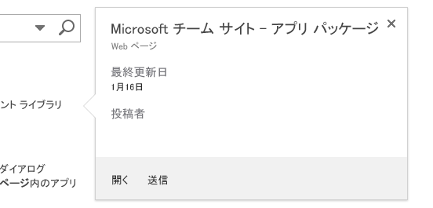
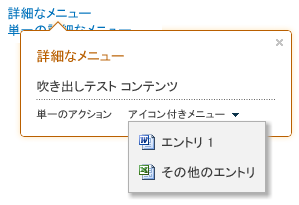

# 吹き出しコントロールを使用してコンテンツを強調表示し SharePoint ホスト型の SharePoint アドインの機能を強化する
SharePoint の吹き出しコントロールを使用すると、柔軟な方法でユーザーに操作を促したり、SharePoint でホストされるアプリの機能を紹介したりできます。このコントロールはアプリの UI に応じてさまざまな方法で構成できます。この記事では、このコントロールを作成し、ページに追加し、その外観と動作をカスタマイズする方法について説明します。SharePoint 2013 サイトで検索を実行すると、吹き出しコントロールの動作の例を見ることができます。これは、検索結果をポイントすると表示されます。図 1 は 1 つの検索結果に対する吹き出しであり、タイトル、ページのアイテムに関する情報、アイテムに対して実行できるアクション ([ **開く**] と [ **送信**]) など、コンテンツ コントロールのいくつかの典型的な要素が含まれています。この例に示した情報とアクションは比較的単純ですが、吹き出しコントロールを使用する 2 つの利点、つまり、必要に応じてページ内の要素についての追加情報を表示でき、洗練された方法でページに機能を追加できることがわかります。 
**図 1. SharePoint 2013 の検索結果ページに表示された吹き出しコントロールの例**

  
    
    

  
    
    

  
    
    

  
    
    

  
    
    

## callout.js ファイルを指定して HTML ページでコントロールを使用できるようにする
<a name="GettingStarted"> </a>

次の例では、 `SP.SOD.executeFunc` メソッドを使用して、スクリプト ファイルに依存するコードを実行する前にスクリプト ファイルが確実に読み込まれるようにします。
  
    
    

```

SP.SOD.executeFunc("callout.js", "Callout", function () {
    });
```

 `SP.SOD.executeFunc` 関数に渡す関数には、callout.js ファイルの読み込み後に実行するコードを含めます。ファイルの読み込み後、 `CalloutManager` オブジェクトを使用して、吹き出しコントロールを関連付ける必要があるページ要素ごとに `Callout` オブジェクトを作成します。 `CalloutManager` は、ページ上の各 `Callout` オブジェクトへの参照を連想配列に格納するシングルトンです。 `Callout` オブジェクトの必須メンバーは `ID` と `launchPoint` の 2 つのみです。 `ID` メンバーは、 `CalloutManager`:  `CalloutManager["value of the callout's ID member"]` 内の `Callout` オブジェクトにマップされるキーです。 `launchPoint` メンバーは HTML ページの要素の 1 つです。たとえば、ページ上の `div` 要素を作成または取得し、 `Callout` オブジェクトのメンバーとして渡すことができます。既定では、吹き出しコントロールはユーザーが `launchPoint` 要素をクリックすると表示されます。次の例に、2 つの必須メンバーとタイトル文字列のみを使用して最も単純な吹き出しコントロールを作成する方法を示します。
  
    
    



```

var calloutPageElement = document.createElement("div");
var callout = CalloutManager.createNew({
   ID: "unique identifier",
   launchPoint: calloutPageElement,
   title: "callout title"
});

```

この吹き出しはユーザーがページ要素をクリックすると表示され、コントロールの上部にはタイトルが表示されます。オプションのメンバーを使用すると、コントロールの外観、動作、配置、およびアクションをさまざまな方法でカスタマイズできます。また、吹き出しコントロールには、コントロールのインスタンスの作成後にパラメーター値を設定するための set メソッドもあります。
  
    
    



```

callout.set({openOptions:{event: "hover"}});
```

 `CalloutOptions` オブジェクトのすべての Callout メンバーの値を設定した後で、そのオブジェクトを `createNew` メソッドに渡すこともできます。
  
    
    



```
var calloutPageElement = document.createElement("div");
var calloutOptions = new CalloutOptions();
calloutOptions.ID = unique identifier;
calloutOptions.launchPoint = calloutPageElement;
calloutOptions.title = callout title;
var callout = CalloutManager.createNew(calloutOptions);
```


## 吹き出しコントロールの外観をカスタマイズする方法
<a name="Appearance"> </a>

次のメンバーを使用して、吹き出しの表示を制御できます。
  
    
    


|**メンバー**|**用途**|**有効な値 (既定値は太字)**|
|:-----|:-----|:-----|
|title  <br/> |コントロールの上部にタイトルを表示します。  <br/> |文字列、 **null** 、HTML を含む文字列 <br/> |
|content  <br/> | `contentElement` メンバーの値がない場合に、コントロールの内部に HTML を表示します。 <br/> |HTML を含む文字列、 **null** 。 `contentElement` の値が存在する場合は null である必要があります。 <br/> |
|contentElement  <br/> | `content` メンバーの値がない場合に、コントロールの内部に HTML 要素を表示します。 <br/> |すべての HTML 要素、 **null** 。 `content` の値が存在する場合は null である必要があります。 <br/> |
|contentWidth  <br/> |吹き出し本体のコンテナーの幅をピクセル単位で指定します。このコンテナーの両側には 1 ピクセルの枠線と 15 ピクセルの余白があるため、コントロールの幅は指定した本体の幅よりも 32 ピクセル大きくなります。コントロールの CSS  `overflow` プロパティは `hidden` に設定されているため、コンテンツが指定した幅に収まらない場合はクリップされます。開いている吹き出しにこのメンバーを設定すると、変更は直ちに反映されます。これは、他のメンバーには当てはまりません。 <br/> |240 ～ 610 の任意の数値、 **350** (既定では、コントロールの幅は 382 ピクセルになります)。 <br/> |
|beakOrientation  <br/> |吹き出しコントロールの突起またはポインターの方向を指定します。  <br/> |下の図 (図 2) のようにする場合は **topBottom** 。 **図 2. 吹き出しコントロールの突起を topBottom 方向に表示した場合**!\[吹き出しコントロールの突起が上下方向に表示される場合](images/SP15_CalloutTopBottom.png)下の図 (図 3) のようにする場合は **leftRight** 。 **図 3. 吹き出しコントロールの突起を leftRight 方向に表示した場合**!\[吹き出しコントロールの突起が左右方向に表示される場合](images/SP15_CalloutLeftRight.png)|
   

## 吹き出しコントロールの動作をカスタマイズする方法
<a name="Behavior"> </a>

次のメンバーを使用して、吹き出しの動作を制御できます。まず、 `openOptions` メンバーについて説明します。これは、ユーザーがページ上でコントロールを操作したときにコントロールをどのように開いたり閉じたりするかを指定する重要なメンバーです。
  
    
    


|**`openOptions` メンバーに使用する値**|**用途**|
|:-----|:-----|
|**{event: "click", closeCalloutOnBlur: true}** <br/> |ユーザーが  `launchPoint` 要素をマウスでクリックしたときに吹き出しコントロールを表示し、 `launchPoint` 要素からマウスを離したときに閉じます。 `event` の値が `click` であるため、 `showCloseButton` オプションの値は既定で **true** となり、変更できません。これは既定の値の組み合わせです。 <br/> |
| `{event: "hover", showCloseButton: true}` <br/> |ユーザーが  `launchPoint` 要素をマウスでポイントしたときに吹き出しコントロールを表示し、コントロールの右上隅の **X** ボタンをクリックしたときに閉じます。 `event` の値が `hover` であるため、 `closeCalloutOnBlur` の値は適用されず、設定できません。 <br/> |
| `{event: "click", closeCalloutOnBlur: false}` <br/> |ユーザーが  `launchPoint` 要素をマウスでポイントしたときに吹き出しコントロールを表示し、コントロールの右上隅の **X** ボタンをクリックした場合にのみ閉じます。 `event` の値が `click` であるため、 `showClosebutton` オプションの値は既定で **true** となり、変更できません。 <br/> |
   
他にも、次のメンバーの設定によって吹き出しの動作を制御できます。
  
    
    


|**使用するメンバー**|**用途**|**有効な値 (既定値は太字)**|
|:-----|:-----|:-----|
|onOpeningCallback  <br/> |吹き出しコントロールがページ上でレンダリングされる前に発生する必要があるアクションを実行します。指定した関数に  `Callout` オブジェクトをパラメーターとして渡す必要があるため、このメンバーを使用して、コントロールがレンダリングされる前にコントロールのプロパティの値を設定できます。また、コントロールのコンテンツを追加または変更する非同期アクションを開始することもできます。このメンバーの値は 1 回だけ設定できます。 <br/> | `function(callout /*=Callout*/) {...}`、 **null** <br/> |
|onOpenedCallback  <br/> |吹き出しコントロールがページ上でレンダリングされて完全にアニメーション化される前に発生する必要があるアクションを実行します。このメンバーは、コントロールのドキュメント オブジェクト モデル (DOM) を操作する場合などに使用します。このメンバーの値は 1 回だけ設定できます。  <br/> | `function(callout /*=Callout*/) {...}`、 **null** <br/> |
|onClosingCallback  <br/> |吹き出しコントロールを閉じる際、コントロールが完全にページから削除される前に発生する必要があるアクションを実行します。このメンバーの値は 1 回だけ設定できます。  <br/> | `function(callout /*=Callout*/) {...}`、 **null** <br/> |
|onClosedCallback  <br/> |吹き出しコントロールが閉じてページから削除された後に発生する必要があるアクションを実行します。このメンバーの値は 1 回だけ設定できます。  <br/> | `function(callout /*=Callout*/) {...}`、 **null** <br/> |
   

## 吹き出しコントロールのメソッドを使用する方法
<a name="CalloutMethods"> </a>

次のメソッドを使用して、吹き出しコントロールの動作をカスタマイズできます。
  
    
    


|**使用するメソッド**|**用途**|**有効なパラメーター値**|
|:-----|:-----|:-----|
|set({member:value})  <br/> |コントロールのインスタンスの作成後にメンバーの値を設定します。  <br/> |吹き出しコントロールのメンバーの値を定義する名前/値のペア。  <br/>```var callout = new Callout({openOptions:{event: "click"}});callout.set({openOptions:{event: "hover"}});```|
|getOrientation()  <br/> |吹き出しコントロールが指す方向を示す  `CalloutOrientation` オブジェクトを返します。このオブジェクトには、 `up`、 `down`、 `left`、および  `right` の 4 つのブール値メンバーがあります。コントロールが開いている場合、そのうちの 2 つ (たとえば `up` と `right`) が **true** になり、2 つが **false** になります。 <br/> |パラメーターなし  <br/> |
|addEventCallback(string eventName, CalloutCallback callback  <br/> |吹き出しコントロールが  `eventName` パラメーターで指定された状態に変わったときに呼び出されるコールバック関数を登録します。 <br/> | `eventName` パラメーターには `opening`、 `open`、 `closing`、 `closed` のいずれかを指定する必要があります。 `callback` パラメーターには、吹き出しコントロールのインスタンスを 1 番目のパラメーターとして受け取る関数を指定する必要があります。 <br/> |
|open()  <br/> |コントロールを表示します。コントロールが既に開いているか、開いている途中である場合、このメソッドは **false** を返し、何も処理を行いません。 <br/> |パラメーターなし  <br/> |
|close(bool useAnimation)  <br/> |コントロールを非表示にします。コントロールが既に閉じているか、閉じている途中である場合、このメソッドは **false** を返し、何も処理を行いません。 <br/> |アニメーションを使用してコントロールを閉じるかどうかを指定するブール値。既定ではアニメーションを使用しません。  <br/> |
|toggle()  <br/> |コントロールのオープン/クローズ状態を切り替えます。  <br/> |パラメーターなし  <br/> |
|addAction(CallOutAction calloutAction)  <br/> |吹き出しコントロールの  `CalloutAction` オブジェクトの配列に新しい `CalloutAction` を追加します。これらのオブジェクトにより、コントロールのフッターに表示されるアクションが定義されます。これらのオブジェクトの作成方法については、「 [吹き出しコントロールにアクションを追加する方法](#AddActions)」セクションで説明します。アクションは、コントロールのインスタンスの作成後にのみ追加できます。コントロールには最大 4 つのアクションを設定でき、それ以上追加しようとすると例外が発生します。  <br/> | `CalloutAction` オブジェクト。 <br/> |
|refreshActions()  <br/> |コントロールに追加されたすべてのアクションを再読み込みします。このメソッドを使用すると、コントロールが開いている間にアクションを変更、有効化、または無効化できます。  <br/> |パラメーターなし  <br/> |
   

## 吹き出しコントロールにアクションを追加する方法
<a name="AddActions"> </a>

アクションの追加は、吹き出しコントロールのインスタンスを作成した後に行います。吹き出しのアクションは、単一のアクションまたはアクションのメニューで構成されます。1 つの吹き出しコントロールに最大 3 つのアクションを追加できます。吹き出しのアクションを作成したら、 `addAction` メソッドを使用して `CalloutControl` オブジェクトに追加します。次のサンプル アクションは、ユーザーがテキストをクリックするとブラウザー内で新しいウィンドウを開きます。
  
    
    

```

//Create CalloutAction
var calloutAction = new CalloutAction({
            text: "Open window"
            onClickCallback: function() {                
                window.open(url);
            }
        });

//Add Action to an instance of the CalloutControl        
        myCalloutControl.addAction(calloutAction);
```

 `CalloutActionOptions` オブジェクトのすべての `CalloutAction` メンバーの値を設定した後で、そのオブジェクトを `CalloutAction` コンストラクターに渡すこともできます。
  
    
    



```

//Create CalloutAction
var calloutActionOptions = new CalloutActionOptions();
calloutActionOptions.text = "Open window";
actionOptions.onClickCallback = function() {
    window.open(url);
};
var calloutAction = new CalloutAction(calloutActionOptions);

//Add Action to an instance of the CalloutControl        
        myCalloutControl.addAction(calloutAction);
```

次のメンバーを使用して、吹き出しアクションの動作を定義できます。
  
    
    


|**使用するメンバー**|**用途**|**有効な値 (既定値は太字)**|
|:-----|:-----|:-----|
|text (必須)  <br/> |アクションのテキスト ラベルを表示します。  <br/> |文字列、 **null** <br/> |
|onClickCallback  <br/> |ユーザーが吹き出しアクションのラベルをクリックしたときに発生するアクションを定義します。  <br/> | `function(calloutAction /*=CalloutAction*/) {...}`、 **null** <br/> |
|isEnabledCallback  <br/> |吹き出しが表示される前に実行され、アクションが有効化されるかどうかを判定するコールバック関数を定義します。この関数で **true** が返される場合、吹き出しには有効化されたアクションが表示されます。 **false** が返される場合、吹き出しにはアクションのテキストが表示されますが、アクションは無効化されます。 <br/>  `function(calloutAction /*=CalloutAction*/) {...}`、 **null** <br/> |
|isVisibleCallback  <br/> |吹き出しが表示される前に実行され、アクションのテキストが表示されるかどうかを判定するコールバック関数を定義します。この関数で **true** が返される場合、吹き出しにはアクションのテキストが表示されます。 **false** が返される場合、吹き出しにはアクションのテキストが表示されません。表示されないアクションの代わりに、残りのアクションが左に移動します。 <br/> | `function(calloutAction /*=CalloutAction*/) {...}`、 **null** <br/> |
|tooltip  <br/> |ユーザーが吹き出しアクションのテキストをポイントしたときに表示されます。  <br/> |文字列、 **null** <br/> |
|disabledTooltip  <br/> |ユーザーが吹き出しアクションのテキストをポイントし、その吹き出しアクションが無効化されている ( `isEnabledCallback` 関数で **false** が返される) 場合にテキストを表示します。 <br/> |文字列、 **null** <br/> |
|menuEntries  <br/> |単一のアクションの代わりにアクションのメニューを定義します。 `CalloutActionMenuEntry` を作成して `CalloutAction` オブジェクトに追加する方法については、次のセクションで説明します。 <br/> |[ `CalloutActionMenuEntry`, ...]、null  <br/> |
   

### 吹き出しコントロールにアクション メニューを追加する方法

吹き出しアクションに単一のアクションではなくメニューが含まれる場合は、図 4 のように、吹き出しアクションのテキストの横に下向き矢印が表示されます。
  
    
    

**図 4. ユーザーがアクション ラベルの横の矢印をクリックすると表示される吹き出しアクション**

  
    
    

  
    
    

  
    
    
メニュー エントリはいくつでも作成でき、 `CalloutAction` オブジェクトの `menuEntries` メンバーの値として配列に指定することで吹き出しアクションに追加できます。
  
    
    



```

//Create two menu entries.
var menuEntry1 = new CalloutActionMenuEntry("Entry One", calloutActionCallbackFunction, "/_layouts/images/DOC16.GIF");
var menuEntry2 = new CalloutActionMenuEntry("Some Other Entry", calloutActionCallbackFunction, "/_layouts/images/XLS16.GIF");

//Add the menu entries to the callout action.
var calloutAction = new CalloutAction({
   text: "MENU W/ ICONS",
   menuEntries: [menuEntry1, menuEntry2]
})

//Add the callout action to the callout control.
callout.addAction(calloutAction);

```

 `CalloutActionMenuEntry` コンストラクターには 3 つのパラメーターを渡します。最初の 2 つのパラメーターは必須です。3 番目のパラメーターはオプションですが、テキストと共にアイコンを表示できるため、役立つ場合があります。
  
    
    

- 1 番目のパラメーターとして、各メニュー エントリのテキスト ラベルを表示するための文字列を渡します。
    
  
- 2 番目のパラメーターとして、ユーザーがメニュー エントリのテキストをクリックしたときに発生するアクションを定義するための関数を渡します。
    
  
- テキスト ラベルの左側に表示するアイコンの URL を含んだ文字列を渡します。
    
  

## CalloutManager を使用して吹き出しコントロールのインスタンスを作成および管理する方法
<a name="UseCalloutManager"> </a>

 `CalloutManager` シングルトン オブジェクトは、ページ上の各 `Callout` オブジェクトへの参照を格納します。このオブジェクトは、吹き出しコントロールの各インスタンスを連想配列に格納し、各コントロールの `ID` 値が連想配列のキーとなります。 `CalloutManager` には、格納する `Callout` オブジェクトの作成および管理に役立つさまざまなメソッドがあります。
  
    
    


|**使用するメソッド**|**用途**|**有効なパラメーター値**|
|:-----|:-----|:-----|
|createNew(members)  <br/> |新しい  `Callout` オブジェクトを作成します。その際、 `CalloutManager` によってコントロールのエントリが連想配列に追加され、必須のメンバー `ID` の値が連想配列のキーとなります。 <br/> |使用する各メンバーに値を割り当てる連想配列。 `ID` および `launchPoint` メンバーは必須です。 <br/> |
|createNewIfNecessary (members)  <br/> |パラメーターとして渡す  `launchPoint` に既に吹き出しコントロールが割り当てられていない場合にのみ、 `Callout` オブジェクトを作成します。 <br/> |使用する各メンバーに値を割り当てる連想配列。 `ID` および `launchPoint` メンバーは必須です。 <br/> |
|getFromLaunchPoint: function (/*@type(HTMLElement)*/launchPoint)  <br/> |関数で指定された  `launchPoint` に関連付けられた `Callout` オブジェクトを取得します。 `launchPoint` に `Callout` オブジェクトが関連付けられていない場合、このメソッドは例外をスローします。 <br/> |パラメーターなし  <br/> |
|getFromLaunchPointIfExists: function (/*@type(HTMLElement)*/launchPoint)  <br/> |関数で指定された  `launchPoint` に関連付けられた `Callout` オブジェクトを取得します。 `launchPoint` に `Callout` オブジェクトが関連付けられていない場合、このメソッドは null を返します。 <br/> |パラメーターなし  <br/> |
|getFromCalloutDescendant: function (/*@type(HTMLElement)*/descendant)  <br/> |関数で指定された要素内の HTML 要素に関連付けられた  `Callout` オブジェクトを取得します。この要素には吹き出し要素の任意の子孫を指定できます。たとえば、 `Callout` オブジェクトの作成時に割り当てた `contentElement` メンバーの値を渡すことができます。子孫に `Callout` オブジェクトが関連付けられていない場合、このメソッドは例外をスローします。 <br/> |パラメーターなし  <br/> |
|closeAll()  <br/> |開いている  `Callout` オブジェクトをすべて閉じます。このメソッドは、1 つ以上の吹き出しを閉じる場合に true を返します。 <br/> |パラメーターなし  <br/> |
|isAtLeastOneCalloutOpen()  <br/> |1 つ以上の吹き出しが開いているかどうかを調べます。  <br/> |パラメーターなし  <br/> |
   

## ページ上の吹き出しコントロールの位置を設定する方法
<a name="Positioning"> </a>


|**使用するメンバー**|**用途**|**有効な値 (既定値は太字)**|
|:-----|:-----|:-----|
|boundingBox  <br/> |吹き出しコントロールの  `offsetParent` と同じように機能する HTML 要素を指定します。既定では、このメンバーの既定値が吹き出しコントロールの `offsetParent` になりますが、このメンバーを使用してコントロールの位置が正しく設定されていることを確認できます。吹き出しコントロールの位置は、このボックス内に表示されるように自動的に調整されます。ボックス内に表示されるよう、(突起の向きに応じて上から下または左から右に) 向きが変更されます。 <br/> |すべての HTML 要素、 **吹き出しコントロールを含んだ HTML 要素の offsetParent** <br/> |
|positionAlgorithm  <br/> |吹き出しコントロールの既定の位置設定アルゴリズムを上書きします。 `calloutPositioningProxy` オブジェクトを使用して吹き出しコントロールの位置設定アルゴリズムを作成する方法については、次のセクションで説明します。 <br/> |**CalloutOptions.prototype.defaultPositionAlgorithm** 、 `function(calloutPositioningProxy) { ... }` <br/> |
   

### calloutPositioningProxy を使用して位置設定アルゴリズムを作成する方法

 `calloutPositioningProxy` オブジェクトには、吹き出しコントロールに既定で使用される位置設定ロジックを上書きするためのメソッドとプロパティがあります。たとえば、コントロールが常に `launchPoint` 要素の右下に表示されるようにするには、次のような位置設定アルゴリズムを作成します。
  
    
    

```

function alwaysGoDownAndRight(calloutPositioningProxy)  {
    calloutPositioningProxy.moveDownAndRight();
} 

```

次に、この関数を  `Callout` オブジェクトの `positionAlgorithm` メンバーの値として渡します。これは `Callout` の作成時に行うことも、後から値を設定して行うこともできます。
  
    
    



```

callout.set({positionAlgorithm: alwaysGoDownAndRight});

```

既定の位置設定ロジックは、ブラウザーの JavaScript コンソール (たとえば Internet Explorer の F12 開発者ツール) を起動することでいつでも確認できます。
  
    
    



```

CalloutOptions.prototype.positionAlgorithm.toString()
```

 `CalloutPositioningProxy` オブジェクトの次のメソッドを使用して、独自の位置設定ロジックを記述できます。
  
    
    


|**メソッド**|**説明**|
|:-----|:-----|
|isCalloutTooFarTop()  <br/> |ブール値を返します。  <br/> |
|isCalloutTooFarRight()  <br/> |ブール値を返します。  <br/> |
|isCalloutTooFarBottom()  <br/> |ブール値を返します。  <br/> |
|isCalloutTooFarLeft()  <br/> |ブール値を返します。  <br/> |
|isCalloutLeftOfHardBoundingBox()  <br/> |ブール値を返します。 **true** の場合、コントロールの左側がコンテナー要素の外側にあります。その部分は表示されず、スクロールできません。 <br/> |
|isCalloutRightOfHardBoundingBox()  <br/> |ブール値を返します。 **true** の場合、コントロールの右側がコンテナー要素の外側にあります。その部分は表示されず、スクロールできません。 <br/> |
|isCalloutAboveHardBoundingBox()  <br/> |ブール値を返します。 **true** の場合、コントロールの上部がコンテナー要素の外側に位置します。その部分は表示されず、スクロールできません。 <br/> |
|isCalloutBelowHardBoundingBox()  <br/> |ブール値を返します。 **true** の場合、コントロールの下部がコンテナー要素の外側に位置します。その部分は表示されず、スクロールできません。 <br/> |
|isOrientedUp()  <br/> |ブール値を返します。  <br/> |
|isOrientedDown()  <br/> |ブール値を返します。  <br/> |
|isOrientedLeft()  <br/> |ブール値を返します。  <br/> |
|isOrientedRight()  <br/> |ブール値を返します。  <br/> |
|moveUpAndRight()  <br/> |何も返しません。コントロールの方向を変更します。  <br/> |
|moveUpAndLeft()  <br/> |何も返しません。コントロールの方向を変更します。  <br/> |
|moveDownAndRight()  <br/> |何も返しません。コントロールの方向を変更します。  <br/> |
|moveDownAndLeft()  <br/> |何も返しません。コントロールの方向を変更します。  <br/> |
|moveTowardsOppositeQuadrant()  <br/> |何も返しません。コントロールの方向を変更します。  <br/> |
|flipHorizontal()  <br/> |何も返しません。コントロールの方向を変更します。  <br/> |
|flipVertical()  <br/> |何も返しません。コントロールの方向を変更します。  <br/> |
|numberOfEdgesCollidingWithBoundingBox()  <br/> |表示される境界ボックスと競合する吹き出しの境界線の数を表す、0 ～ 4 の整数を返します。たとえば、 `moveUpAndRight()` メソッドを呼び出した後でドキュメント本体の上部によってコントロールの上部がクリップされた場合、 `numberOfEdgesCollidingWithBoundingBox()` メソッドは 1 よりも大きい値を返します。 <br/> |
   
次の位置設定アルゴリズムは、コントロールをテキストの上または下に移動します。 `CalloutPositioningProxy` の `isRTL` プロパティは、テキストが右から左の言語を表示しているかどうかを示します。コントロールの位置がページ上のテキストに対して常に正しく設定されていることを確認するために、このプロパティをチェックします。
  
    
    



```
function examplePositionAlgorithm(calloutPositioningProxy) {
    if (!calloutPositioningProxy.isRTL) {
        calloutPositioningProxy.moveDownAndRight();
        if (calloutPositioningProxy.isCalloutTooFarBottom()) {
            calloutPositioningProxy.moveUpAndRight();
        }
    }
    else {
        calloutPositioningProxy.moveDownAndLeft();
        if (calloutPositioningProxy.isCalloutTooFarBottom()) {
            calloutPositioningProxy.moveUpAndLeft();
        }
    }
}
callout.set({positionAlgorithm: examplePositionAlgorithm});

```

次の位置設定アルゴリズムは、コントロールの既定の方向を  `upAndRight` から `downAndRight` に変更しますが、競合がない場合は既定のアルゴリズムを使用します。
  
    
    



```

function tryDownAndRightThenGoDefault(calloutPositioningProxy) {
    if (!calloutPositioningProxy.isRTL)
        calloutPositioningProxy.moveDownAndRight();
    else
        calloutPositioningProxy.moveDownAndLeft();
    
    if (calloutPositioningProxy.numberOfEdgesCollidingWithBoundingBox() > 0)
        return CalloutOptions.prototype.positionAlgorithm.apply(this, arguments);
};
callout.set({positionAlgorithm: tryDownAndRightThenGoDefault});

```


## その他の技術情報
<a name="bk_addresources"> </a>


-  [SharePoint 2013: SharePoint ホスト型アドインでリスト ビュー、吹き出し、およびダイアログを使用する](http://code.msdn.microsoft.com/officeapps/SharePoint-2013-Use-list-cb3e4e14)
    
  
-  [SharePoint ホスト型の SharePoint アドインの作成を始める](get-started-creating-sharepoint-hosted-sharepoint-add-ins.md)
    
  
-  [Napa Office 365 開発ツールを使用して基本的な SharePoint ホスト型アドインを作成する](create-a-basic-sharepoint-hosted-add-in-by-using-napa-office-365-development-too.md)
    
  
-  [SharePoint アドインの UX 設計](ux-design-for-sharepoint-add-ins.md)
    
  

  
    
    
