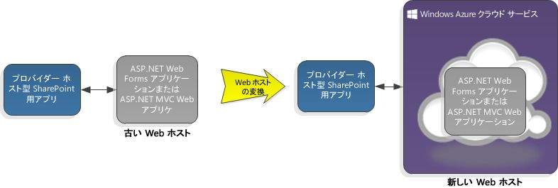

# Microsoft Azure クラウド サービスで SharePoint アドインをホストする
Web アプリの代わりに Microsoft Azure クラウド サービス上にプロバイダー ホスト型の SharePoint アドインをホストする方法、Azure Web ロールに SharePoint アドインを追加する方法、および Web アプリ上よりも Azure 上でホストするほうが良い理由について説明します。
 * **適用対象:*** 
  
    
    

|||
|:-----|:-----|
|**この記事の内容**          [前提条件](#SP15createselfhostapp_bk_prereq)           [Azure クラウド サービス上で SharePoint アドインをホストする方法](#SP15HostAzure_bk_HowTo)           [Azure を使用する理由](#SP15HostAzure_bk_Why)           [その他のリソース](#SP15Devapps_AddtionalResources)||
   

## 前提条件

-  [プロバイダー ホスト型 SharePoint アドインの作成を始める](get-started-creating-provider-hosted-sharepoint-add-ins.md) の前提条件。
    
  
- Microsoft Azure SDK for .NET (VS 2012) 1.8.1。 [Web Platform Installer](http://www.microsoft.com/web/downloads/platform.aspx) を使用してインストールできます。
    
  

## Azure クラウド サービス上で SharePoint アドインをホストする方法

### クラウド サービスを既存のアドインに追加する

プロバイダー ホスト型の SharePoint アドインが既にあり、そのアドインを Azure でホストする場合、SharePoint アドインのソリューションで Web アプリ プロジェクトを選択します。メニュー バーで、[ **プロジェクト**]、[ **Microsoft Azure クラウド サービス プロジェクトの追加**] の順にクリックします。Azure プロジェクト  _NameOfTheWebAppProject_.Azure が SharePoint アドインのソリューションに追加されます。Web プロジェクトの Web ロールも Azure クラウド サービスのプロジェクトに追加されます。Office Developer Tools for Visual Studio 2012 は、Web ロールが SharePoint アドインで機能するために必要なプロジェクト プロパティを設定します。
  
    
    
図 1 は、Azure クラウド サービスを使用するように SharePoint アドインを変換する方法を示しています。
  
    
    

**図 1. Azure クラウド サービスを使用するように SharePoint アドインを変換する**

  
    
    

  
    
    

  
    
    

  
    
    

  
    
    

### アドインを既存の Web ロールに追加する

プロバイダー ホスト型の SharePoint アドインのホストとして使用する Web ロールが既に Azure クラウド サービスにある場合、Visual Studio で Azure クラウド プロジェクトを開き、[ **ソリューション エクスプローラー**] で Web ロール プロジェクトを開きます。メニュー バーで [ **プロジェクト**]、[ **SharePoint 用アドイン プロジェクトの追加**] の順に選択します。プロバイダー ホスト型の SharePoint アドインのプロジェクト  _NameOfTheWebAppProject_.Azure が作成され、ソリューションに追加されます。Visual Studio では Azure Web ロールを SharePoint アドインの Web プロジェクト ホストとして参照します。
  
    
    
図 2 は SharePoint アドイン がどのように既存の Web ロールに追加されるかを示しています。
  
    
    

**図 2. SharePoint アドインを既存の Web ロールに追加する**

  
    
    

  
    
    

  
    
    

  
    
    

  
    
    

## Azure を使用する理由

プロバイダー ホスト型の SharePoint アドインの Web アプリケーションを Azure クラウド サービスに移行することで Azure のホスティング サービスと拡張性を利用できます。特に SharePoint アドインの使用頻度が高い場合、またはアドインの需要が時間と共に変化する場合は、アドインのパフォーマンスとユーザビリティを拡張できます。既存の SharePoint アドインを少し変更するだけで Azure で Web アプリケーションを実行できるようになります。Azure Web ロールとは、基本的にインターネット インフォメーション サービス (IIS) をベースにして、Azure 上でホストされる Web サイトです。 
  
    
    
Azure がどのように役立つかを理解するには、多少の背景情報が必要です。クラウド ベースの (つまりプロバイダー ホスト型の) SharePoint アドイン のプロジェクトは、通常 Web アプリケーション プロジェクトつまり Web アプリと関連付けられます。 Web アプリは SharePoint ファームの外で展開されホストされます。プロバイダー ホスト型の SharePoint アドインは Web アプリのサービスを介して SharePoint サイトと対話します。また、リモート サイトにあるリソースとサービスを使用することもできます。
  
    
    
詳細については、以下のリンクを参照してください。
  
    
    

-  [SharePoint アドインのアーキテクチャおよび開発環境に関する重要な要素](important-aspects-of-the-sharepoint-add-in-architecture-and-development-landscap.md)
    
  
-  [クラウド サービスとは](http://www.windowsazure.com/ja-jp/manage/services/cloud-services/what-is-a-cloud-service/)
    
  
-  [SharePoint アドインを開発およびホスティングするためのパターンを選択する](choose-patterns-for-developing-and-hosting-your-sharepoint-add-in.md)
    
  
-  [Microsoft Azure の紹介](http://azure.microsoft.com/ja-jp/documentation/articles/fundamentals-introduction-to-azure/)
    
  
SharePoint アドイン の Web アプリはハードウェア、設備、および従業員の保守を必要とする社内サーバー ファームに置かれることがあります。Azureではこうした作業がすべて自動で処理され、サーバー ファームを拡大し保守する費用と手間を省くことができます。SharePoint アドインにさらにサーバー リソースが必要になった場合、Azureは動的にアドインに割り当てることができます。SharePoint アドイン が Azure クラウド サービスを使用するよう切り替えることで、アドインの拡張性は増大します。「 [自動スケーリングと Microsoft Azure](http://msdn.microsoft.com/ja-jp/library/hh680945%28v=pandp.50%29.aspx)」を参照してください。
  
    
    
Azure に既に Web ロールがある場合、新しい Web ロールを作成するのではなく、既存の Web ロールを SharePoint アドインのホストとして活用することができます。また、Web サイトを SharePoint アドインとしてパッケージ化し、Office ストア に発行して、Web サイトを多くの顧客に公開することもできます。
  
    
    

## その他のリソース

-  [Microsoft Azure とは](http://www.windowsazure.com/ja-jp/documentation/)
    
  
-  [クラウド サービスを作成してデプロイする方法](http://www.windowsazure.com/ja-jp/manage/services/cloud-services/how-to-create-and-deploy-a-cloud-service/)
    
  
-  [ASP.NET Web アプリケーションを Microsoft Azure Web サイトにデプロイする](http://www.windowsazure.com/ja-jp/develop/net/tutorials/get-started/)
    
  
-  [Microsoft Azure Web サイト、Web ロール、VM 間で選択する](http://dotnetthread.com/articles/30-Choosing-between-Windows-Azure-Web-Sites-Web-Roles-and-VMs.aspx)
    
  