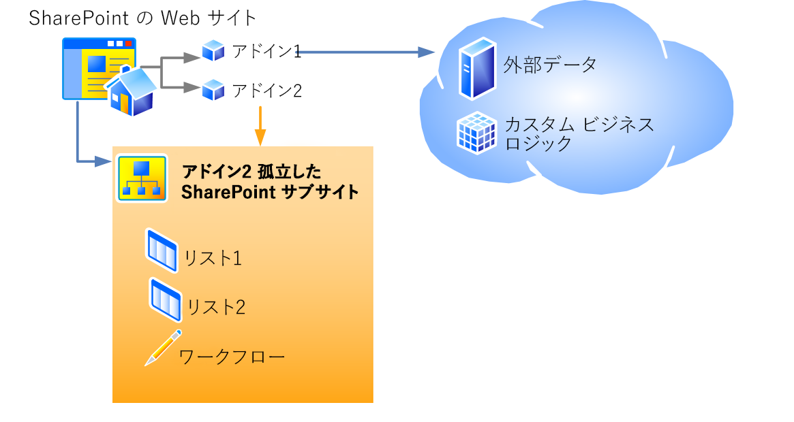

# SharePoint 2013 のホスト Web、アドイン Web、および SharePoint コンポーネント
ホスト Web とアドイン Web の違いを説明します。また、どのような SharePoint 2013 コンポーネントを SharePoint アドインに含めることができるのか、何がホスト Web に展開され、何がアドイン Web に展開されるのか、アドイン Web がどのように分離ドメインに展開されるのかも説明します。
## ホスト Web、アドイン Web、および分離ドメイン
<a name="IsolatedDomain"> </a>

SharePoint コンポーネントを含むアドインが Web サイトにインストールされると、そのアドインは [ **サイト コンテンツ**] ページに一覧表示され、そこから起動できるようになります。Web サイトへの追加が必須となるのは、アドインの起動元であるこの一覧だけです。この他、カスタム アクションやアドイン パーツなどはオプションで追加できます。これらのオプションについては、「 [UI からのアドインへのアクセス](important-aspects-of-the-sharepoint-add-in-architecture-and-development-landscap.md#AccessingApp)」を参照してください。これらの UI 要素以外の SharePoint アドイン コンポーネントとコンテンツ (リスト、コンテンツ タイプ、ワークフロー、ページなど) は特別な分離ドメイン内の別の Web サイトに展開されます。この事実はユーザーにはほとんどわかりません。アドインが「展開」されるこの特別な Web サイトが「アドイン Web」と呼ばれます。アドインが「インストール」される Web サイトは「ホスト Web」と呼ばれます。アドイン Web は、独自の分離ドメインを持ちますが、ホスト Web と同じサイト コレクションに存在します (このルールの例外として、アドインがテナント スコープでインストールされる場合があります。このようなシナリオでは、アドイン Web は会社のアドイン カタログのサイト コレクションに存在します)。 
  
    
    
図 1 は 1 つのホスト Web に 2 つの SharePoint アドインがインストールされている状態を示しています。アドイン 1 はリモート コンポーネントを含んでいますが SharePoint コンポーネントは含んでいません。アドイン 2 はリモート コンポーネントは含んでいませんが、2 つの SharePoint リストと、ワークフローを含んでいます。これらは分離されたサブサイトに展開されています。(1 つの SharePoint アドインが、リモート コンポーネントと、SharePoint がホストするコンポーネントの両方を含むこともあります。ただし、この図では両方を含むアドインは記載していません。)
  
    
    

**図 1: プロバイダー向けのホスト型アドインと、SharePoint ホスト型アドインを持つホスト Web**

  
    
    

  
    
    

  
    
    
1 つのアドインを例に考えましょう。このアドインはホスト Web に展開できる単純な UI 要素の他に、SharePoint コンポーネントを含んでいるとします。アドインは、以下の URL でホスト Web サイトにインストールされます。
  
    
    
 `https://www.fabrikam.com/sites/Marketing`
  
    
    
この SharePoint アドインは、新しく作成される以下のような URL の Web サイトに展開されます。
  
    
    
 `http://add-in-bdf2016ea7dacb.fabrikamadd-ins.com/sites/Marketing/Scheduler`
  
    
    
この URL は以下のような構造になっています。
  
    
    
 `https://` _Add-in_Prefix_ `-` _Add-in_ID_ `.` _Add-in_Base_Domain_ `/` _Domain_Relative_URL_of_Host_Web_ `/` _Add-in_Name_
  
    
    
各プレースホルダーは次のように定義されます。
  
    
    

-  _Add-in_Prefix_ は、サーバーの全体管理でファーム管理者が設定する任意の文字列です。既定値は「default」です。この例では管理者が「add-in」に変更しています。
    
  
-  _Add-in_ID_ は、アドインがインストールされるときに内部的に生成される 16 進数値です。
    
  
-  _Add-in_Base_Domain_ は、サーバーの全体管理または SharePoint 管理シェル でファーム管理者が設定する任意の文字列です。これを SharePoint Web アプリケーションのサブドメインに設定 *しないで*  ください。アドインを分離するという目的が大きく損なわれることになります。この例では管理者が「www.」を取り除き、会社名に「add-ins」を追加しています。そのため、 `fabrikamadd-ins.com` がアドインのベース ドメインになっています。
    
  
-  _Domain_Relative_URL_of_Host_Web_ は、親ホスト Web の相対 URL です。この例では `sites/Marketing` です。
    
  
-  _Add-in_Name_ は、appmanifest.xml ファイルの **App** 要素の **Name** 属性の値です。
    
  
SharePoint コンポーネントを、ホスト Web ではなくアドイン Web に展開する大きな理由として以下の 2 つがあります。どちらもセキュリティに関係します。
  
    
    

- **アドインのアクセス許可の強制:**SharePoint アドイン用のモデル では、アドインは固有の ID とアクセス許可を持ち、このアクセス許可はアドインを実行するユーザーのアクセス許可とは必ずしも一致しません。このようなアドインのアクセス許可はアドインがインストールされるときに要求され、アドインをインストールする人が、アドインが要求するすべてのアクセス許可を持っている場合、その人によって付与されます (アドインをインストールするユーザーが、アドインが要求するアクセス許可すべてを持っていない場合、そのユーザーはアドインをインストールできません)。各アドインに固有のドメインを提供することにより、SharePoint 2013 はアドインが行う要求を確実に識別し、そのアドインのアクセス許可を検証することができます。アドインのアクセス許可の詳細については、「 [アドインのアクセス許可](important-aspects-of-the-sharepoint-add-in-architecture-and-development-landscap.md#AppPermissions)」を参照してください。
    
  
- **クロスドメイン スクリプティングのセキュリティ:** 最新のブラウザーは JavaScript メソッド呼び出しについて "同一生成元ポリシー" をサポートしています。各 SharePoint アドインを個別のドメインに展開することにより、SharePoint はブラウザーの同一生成元ポリシーを活用して、SharePoint アドイン内の JavaScript が他のドメインの JavaScript を実行できないようにすることができます。エンドユーザーから見てアドインがインストールされたドメインも、他のドメインということになります。
    
    SharePoint には、このポリシーの制限を安全に迂回する手段もあります。いくつかありますが、たとえば、SharePoint アドインのリモート コンポーネントは、ホスト Web およびアドイン Web 共通の親テナント内のいずれの Web サイトからもデータを照会することができます。詳細については、「 [クロスドメイン ライブラリを使用してアドインから SharePoint 2013 のデータにアクセスする](access-sharepoint-2013-data-from-add-ins-using-the-cross-domain-library.md)」を参照してください。
    
  

## SharePoint アドインに含めることができる SharePoint コンポーネントの種類
<a name="TypesOfSPComponentsInApps"> </a>

通常、SharePoint アドインには以下に挙げる 1 つ以上のコンポーネントを含めることができます。一部例外もありますが、これらのコンポーネントは、SharePoint ソリューション パッケージ (.wsp) ファイルで **Web** スコープ フィーチャーの中に展開する必要があります。
  
    
    

> **メモ**
> ***** アスタリスク (*) の付いているコンポーネントについては、この記事で後述する「 [SharePoint コンポーネントの展開に関する注意事項](#SpecialCases)」でさらに詳しく説明しています。 
  
    
    


- フィーチャー ( **Web** スコープのみ)
    
  
- カスタム アクション (ショートカット メニュー項目およびリボンのカスタマイズなど)*
    
  
- リモート イベント レシーバー*
    
  
- SharePoint に含まれる (つまり、カスタム Web パーツでない) Web パーツ (およびアドイン パーツ) を参照するマークアップ*
    
  
- SharePoint ページが使用するカスタム カスケード スタイル シート (CSS)
    
  
- SharePoint ページが使用するカスタム JavaScript ファイル
    
  
- モジュール (ファイルのセット)
    
  
- ページ
    
  
- リスト テンプレート
    
  
- リストおよびライブラリ インスタンス
    
  
- カスタム リスト フォーム
    
  
- カスタム リスト ビュー
    
  
- カスタム コンテンツ タイプ
    
  
- フィールド (SharePoint に組み込まれたフィールドの種類)
    
  
- Microsoft Business Connectivity Services (BCS) モデル ( **Web** スコープのみ)、このモデルに基づく外部コンテンツ タイプ、およびコンテンツ タイプが使用する外部リスト*
    
  
- ワークフロー*
    
  
- プロパティ バッグ
    
  
- Web テンプレート (サイト定義ではない)*
    
  
この他の種類の SharePoint コンポーネントは SharePoint アドインでは展開できません。SharePoint アドインに何を含めることができるのかについて、その制限の詳細は「 [SharePoint アドインと SharePoint ソリューションの比較](http://msdn.microsoft.com/library/0e9efadb-aaf2-4c0d-afd5-d6cf25c4e7a8%28Office.15%29.aspx)」を参照してください。
  
    
    

## SharePoint コンポーネントの展開に関する注意事項
<a name="SpecialCases"> </a>

以下に、アドインに含めることができる SharePoint コンポーネントの種類の一部について、展開に関する考慮事項を詳しく説明します。 
  
    
    

- **カスタム アクション:** カスタム アクションは、アドイン Web に追加するだけでなく、ホスト Web にも追加できます。カスタム アクションをアドイン Web に追加するには、他のコンポーネントをアドイン Web に追加するときと同じように, .wsp ファイルの中の **Web** スコープ フィーチャーの中にそれを含めます。カスタム アクションをホスト Web に追加するには、(外部ベースのアドインの場合でも) **CustomAction** マークアップを、アドイン パッケージ内にありながらいずれの .wsp ファイルにも含まれないフィーチャーの中に含めることができます。このような "厳密でない" フィーチャーのコンポーネントは、アドイン Web ではなく、ホスト Web に適用されます。このためこのような種類のフィーチャーはホスト Web フィーチャーと呼ばれます。 
    
  
- **Web パーツ:** Web パーツの一種であるアドイン パーツは、アドインとして展開することができます。アドイン パーツは、アドイン Web またはホスト Web のいずれかに配置できます。他の種類の Web パーツはいずれも、アドイン内で参照することができますが、アドインで展開することはできません。アドイン パーツがホスト Web に展開される場合、それはホスト Web フィーチャーに含まれることになります。
    
  
- **リモート イベント レシーバー:** これは SharePoint 2013 の新機能です。従来の SharePoint イベント レシーバーに似ていますが、コードがクラウドで実行される点が異なります。これは SharePoint ホスト型アドインでは使用できません。
    
  
- **ワークフロー:**SharePoint 2013 のワークフローは、SharePoint 2013 の新機能である、Microsoft Azure がホストするワークフロー ランタイムを使用するようになりました。SharePoint がホストするワークフロー ランタイムを使用するようにコーディングされているワークフローは SharePoint アドインに含めることができません。宣言型ワークフロー、または新しいランタイムを使用するワークフローのみ許可されます。
    
  
- **Microsoft Business Connectivity Services (BCS) モデル、外部コンテンツ タイプ、および外部リスト:**Business Data Connectivity (BDC) Service は一般的に、サイト コレクションよりも広いスコープを持っています。しかし、Business Data Connectivity (BDC) Service モデルがアドインとして展開されると、そのスコープはそのアドイン Web に限定されます。Business Data Connectivity (BDC) Service モデルがアドインに含まれる場合、それは Business Data Connectivity (BDC) Service 共有サービス ストアに格納されるのではなく、アドイン Web 内にファイルとして格納されます。
    
  
- **Web テンプレート:** ほとんどの場合、アドイン Web では、新しい組み込みのサイト定義構成 **APP#0** をインスタンス化します。これはアドイン Web に最適化されています。(この詳細については、「 [UI からのアドインへのアクセス](important-aspects-of-the-sharepoint-add-in-architecture-and-development-landscap.md#AccessingApp)」を参照してください。) SharePoint 2013 は、アドイン パッケージに  [WebTemplate](http://msdn.microsoft.com/library/ff4ba91a-cc5f-47ff-9101-a7651f452185%28Office.15%29.aspx) 要素が含まれていない場合、 **APP#0** を自動的に使用します。
    
    アドイン Web 用にカスタムのサイトの種類を定義することもできます。これは、大まかに次の 2 つの手順で行います。
    
  - カスタムの  [WebTemplate 要素 (Web テンプレート)](http://msdn.microsoft.com/library/ff4ba91a-cc5f-47ff-9101-a7651f452185%28Office.15%29.aspx)、onet.xml ファイル、およびもしあれば他の関連ファイルを、アドインのアドイン Web フィーチャーに含めます。Web テンプレートを、通常と同じように、アドイン パッケージ内の .wsp ファイルの Web スコープ フィーチャーに展開します。
    
  
  -  [Web テンプレート要素 (PropertiesDefinition コントロール (SharePoint アドイン マニフェスト)](http://msdn.microsoft.com/library/62302903-e97a-a9a3-a64e-13176a7c4e1e%28Office.15%29.aspx) をアドイン マニフェストに追加します。 **Properties** 要素の子として追加し、その **Id** 属性にアドイン Web フィーチャーの GUID と [WebTemplate 要素 (Web テンプレート)](http://msdn.microsoft.com/library/ff4ba91a-cc5f-47ff-9101-a7651f452185%28Office.15%29.aspx) の **Name** 属性の値を設定します。GUID はハイフンで区切り、中かっこ {} で囲む必要があります。また GUID とテンプレート名は「#」文字で区切ります。以下の例を参照してください。
    
 ```XML
  
<WebTemplate Id="{81dd4ae5-873b-4759-9838-4ad9c3dd2952}#NewSiteType" />
 ```


    > **メモ**
      > アドイン マニフェスト用の新しい  [WebTemplate](http://msdn.microsoft.com/library/62302903-e97a-a9a3-a64e-13176a7c4e1e%28Office.15%29.aspx) 要素は、フィーチャーに含めることができる [WebTemplate](http://msdn.microsoft.com/library/ff4ba91a-cc5f-47ff-9101-a7651f452185%28Office.15%29.aspx) 要素と同じマークアップではありません。フィーチャーに含めることができる **WebTemplate** 要素はサイトの種類を定義しますが、アドイン マニフェスト用の **WebTemplate** 要素は単に使用するサイトの種類を識別するだけです。SharePoint アドインのアドイン マニフェストの詳細については、「 [アドインのパッケージ構成](important-aspects-of-the-sharepoint-add-in-architecture-and-development-landscap.md#SPAppModelArch_Package)」を参照してください。 

    > **注意**
      > アドイン マニフェスト内の **WebTemplate** 要素を使用して、任意の組み込みの SharePoint サイト定義構成をアドイン Web のサイトの種類として指定しないでください。アドイン Web に対しては、 **APP#0** 以外の組み込みの SharePoint サイト定義構成の使用はサポートされていません。

    サイト定義の構成および Web テンプレートの詳細については、「 [テンプレートおよび定義を使用する](http://msdn.microsoft.com/library/1edf6d4d-eddb-4cb5-9034-ed394e8a3e01%28Office.15%29.aspx)」を参照してください。
    
  

## その他の技術情報
<a name="SP15hostedwebs_bk_addlresources"> </a>


-  [SharePoint アドインのアーキテクチャおよび開発環境に関する重要な要素](important-aspects-of-the-sharepoint-add-in-architecture-and-development-landscap.md)
    
  
-  [SharePoint アドインと SharePoint ソリューションの比較](http://msdn.microsoft.com/library/0e9efadb-aaf2-4c0d-afd5-d6cf25c4e7a8%28Office.15%29.aspx)
    
  

  
    
    

