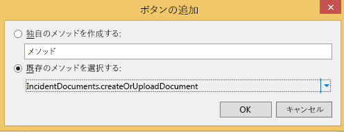

# インシデント マネージャー: クラウド ビジネス アドインのチュートリアル
Visual Studio の [ **クラウド ビジネス アドイン**] テンプレートを使用すると、スマート フォンやタブレットなど、最新のタッチ式のデバイスを使用してモバイル ユーザーが離れた場所からデータの表示、追加、および更新を行うことのできる、SharePoint ホスト型アドインを作成できます。このチュートリアルでは、架空の Contoso 消防署向けに、現場でインシデント管理を行うアドインを作成します。クラウド ビジネス アドインを作成するための中核となる概念を紹介するほか、SharePoint のリストやドキュメント ライブラリの統合など、高度な概念についても説明します。インシデント管理のサンプル アプリケーションおよび関連ファイルは、次の MSDN サンプル ギャラリーからダウンロードできます:  [インシデント マネージャー: クラウド ビジネス アドインのチュートリアル](http://code.msdn.microsoft.com/Incident-Manager-A-Cloud-c32d9b04)。
## 前提条件

このチュートリアルを行うには、Visual Studio 2013 Update 1、および Microsoft Developer Tools for Visual Studio 2013 (2014 年 3 月更新) が必要です。


また、アドインをホストするために、Office 365 の SharePoint 開発者向けサイトも必要になります。これは、 [Office 365 開発者向けサイトにサインアップする](http://go.microsoft.com/fwlink/?LinkId=263490)から取得できます。


> **メモ**
> あるいは、SharePoint 2013 サイト上でクラウド ビジネス アドインをホストすることもできます。 


## インシデント管理アプリケーションの作成
<a name="add-in"> </a>

Contoso 消防署は、火災、医療救急、自動車事故、その他の緊急事態の際に出動します。緊急インシデントごとに報告書を作成するため、かなりの量の事務作業が必要です。現状では、現場で書類に記入した情報を、消防署に戻ってからコンピューター システムに入力しています。この消防署では、最近、記録管理のために SharePoint for Office 365 を採用し、司令官が現場でデータを入力できるようにタブレット型端末を購入しました。


このチュートリアルでは、インシデントに関する基本的な情報を入力するために使用するモバイル アドインを作成します。それぞれのインシデントには医療援助が含まれることが多いため、作成するアドインでは 1 つのインシデントに対して複数の患者のデータを入力できるようにする必要があります。このセクションでは、基本的なアプリケーションの作成を進めながら、クラウド ビジネス アドインの基礎を学習します。


### プロジェクトを作成するには


1. メニュー バーで、[ **ファイル**]、[ **新規作成**]、[ **プロジェクト**] の順に選択します。

    [ **新しいプロジェクト**] ダイアログ ボックスが表示されます。


2. テンプレートの一覧から、[ **Visual Basic**] または [ **Visual C#**] ノードを展開し、[ **Office/SharePoint**] ノードを展開し、[ **アドイン**] ノードを選択した後、[ **クラウド ビジネス アドイン**] テンプレートを選択します (図 1 を参照)。

   **図 1. [クラウド ビジネス アドイン] テンプレート**


3. [ **名前**] ボックスに「IncidentManager」と入力してから、[ **OK**] をクリックします。

    [ **新しいクラウド ビジネス アドイン**] ウィザードが開きます。


4. [ **新しいクラウド ビジネス アドイン**] ウィザードで、使用する Office 365 Developer サイトの URL を入力した後、[ **完了**] をクリックします。

    URL の形式は、https://  _MySite_.sharepoint.com/sites/Developer/ となります。

    [ **IncidentManager**] ソリューションのソリューション エクスプローラーに、最上位の [ **IncidentManager**] プロジェクトのほか、[ **IncidentManager.HTMLClient**] プロジェクト、[ **IncidentManager.Server**] プロジェクト、[ **IncidentManager.SharePoint**] プロジェクトという、合わせて 4 つのプロジェクトが追加されます。


    次のステップでは、インシデントのコレクションを表すエンティティを追加します。エンティティは、アドインに組み込まれる SQL サーバー データベース テーブルを作成します。このデータベースには、各インシデントに関する情報が格納されます。


### Incident エンティティを追加するには


1. [ **スタート**] 画面で、[ **新しいテーブルの作成**] ハイパーリンクをクリックします。

    エンティティ デザイナーが表示されます。


2. [ **プロパティ**] ウィンドウで、[ **名前**] プロパティのテキスト ボックスに「Incident」と入力します。


3. エンティティ デザイナーで、[ **<プロパティの追加>**] リンクをクリックして、「IncidentNumber」と入力します。


4. 既定値の [ **型**] である **String** を受け入れ、[ **必要**] チェック ボックスをオンのままにして、Enter キーを押します。


5. [ **プロパティ**] ウィンドウで、[ **一意のインデックス**] チェック ボックスをオンにします。

    インシデント番号は、インシデントごとに一意にする必要があります。


6. [ **<プロパティの追加>**] リンクをクリックし、「IncidentDate」と入力した後、 **Tab** キーを押します。


7. [ **型**] 列で、[ **Date**] を選択してから、Tab キーを 2 回押します。


8. [ **名前**] 列に「DispatchTime」と入力し、[ **型**] 列で [ **DateTime**] データ型を選択します。


9. 次の行に「IncidentType」と入力し、データ型として [ **Integer**] を選択します。


10. 次の行に「IncidentAddress」と入力し、データ型として [ **String**] を選択します。


11. 次の行に「ReportingPartyName」と入力し、データ型として [ **String**] を選択し、さらに [ **必要**] チェック ボックスをオフにします。

    時おり、匿名でインシデントが報告されることがあるため、このフィールドの値は必須にしないことにします。


12. 次の行に「ReportingPhone」と入力し、[ **PhoneNumber**] データ型を選択します。

    [ **Phone Number**] はカスタム ビジネス タイプと呼ばれるデータ型で、電話番号として自動的に書式設定され、検証されます。


13. [ **プロパティ**] ウィンドウで、[ **電話番号の形式**] ハイパーリンクをクリックします。

    [ **電話番号の形式**] ダイアログ ボックスが開きます。


14. [ **電話番号の形式**] ダイアログ ボックスで、ロケールに応じた適切な形式を選択した後、[ **上へ移動**] をクリックしてその形式を一覧の先頭まで移動します。


15. [ **テスト電話番号の検証**] ボックスに電話番号を入力して正しく書式設定されることを確認した後、[ **保存**] をクリックします。

    [ **Phone Number**] ビジネス型は、画面に表示されると、電話番号の書式設定と検証を自動的に実行します。


16. 次の行に「IncidentCommander」と入力し、[ **Person**] データ型を選択します。

    [ **Person**] ビジネス型は、SharePoint User Profile Service への接続機能を提供し、Active Directory からユーザー情報を引き出します。

    入力を完了したエンティティを図 2 に示します。


   **図 2. インシデント エンティティ**


    次のステップでは、あらかじめ設定されたいくつかの値の中からユーザーが選択できる選択肢リストを追加します。このチュートリアルの場合、消防署には共通して使用されるインシデントの種類があります。


### 選択肢リストを追加するには


1. エンティティ デザイナーで、[ **IncidentType**] フィールドを選択してから、[ **プロパティ**] ウィンドウで [ **選択肢リスト**] ハイパーリンクをクリックします。

    [ **選択肢リスト**] ダイアログボックスが開きます。


2. [ **選択肢リスト**] ダイアログ ボックスで、[ **値の追加**] リンクをクリックして、「1」と入力します。


3. [ **表示名**] 列に、「 **Fire - Commercial**」と入力します。


4. 次のような値と表示名を入力した後、[ **OK**] をクリックします。


|**値**|**表示名**|
|:-----|:-----|
|2  <br/> |Fire - Residential  <br/> |
|3  <br/> |Fire - Single Engine Response  <br/> |
|4  <br/> | Aid - Advanced Life Support <br/> |
|5  <br/> | Aid - Basic Life Support <br/> |
|6  <br/> |Motor Vehicle Collision  <br/> |
|7  <br/> |Service Call  <br/> |
|||
 

    実行時には、表示名の一覧がユーザーに表示されます。ユーザーが値を選択すると、それに対応する **Integer** 値がデータベースに格納されます。


    次のステップでは、Patient (患者) エンティティを追加します。消防署のインシデントの多くには医療援助が含まれており、1 つのインシデントに複数の患者が関係することもよくあります。


### Patient エンティティを追加するには


1. [ **ソリューション エクスプローラー**] で、[ **データ ソース**] ノードのショートカット メニューを開き、[ **テーブルの追加**] を選択します。


2. [ **プロパティ**] ウィンドウの [ **名前**] プロパティのテキストボックスに「Patient」と入力します。


3. エンティティ デザイナーで、図 3 に示されているフィールドを追加します。

   **図 3. 完成した Patient エンティティ**


    次のステップでは、Incident エンティティと Patient エンティティの間のリレーションシップを定義します。1 つのインシデントには複数の患者を関連付けることができます。


### リレーションシップを定義するには


1. [ **ソリューション エクスプローラー**] で、[ **Incidents.lsml**] ノードのショートカット メニューを開き、[ **開く**] を選択します。


2. ツールバーで、[ **リレーションシップ**] をクリックします。

    [ **新しいリレーションシップの追加**] ダイアログ ボックスが表示されます。


3. [ **新しいリレーションシップの追加**] ダイアログ ボックスで、[ **名前**] 行の [ **終端側**] 列から [ **Patient**] を選択します。


4. [ **多重度**] 行の [ **開始側**] 列から [ **0 または 1**] を選択します。


5. [ **終端側**] 列で [ **多数**] を選択した後、[ **OK**] をクリックします。

    図 4 にリレーションシップを示します。


   **図 4. インシデントと患者のリレーションシップ**


    これにより、インシデントと患者の間に 0 または 1 対多のリレーションシップが作成されます。インシデント レコードには患者が含まれていなくてもかまいませんが、患者には必ずインシデント レコードを関連付ける必要があります。


    次のステップでは、患者およびインシデントのレコードを表示、追加、編集するための画面を追加します。


### 画面を追加するには


1. [ **ソリューション エクスプローラー**] で、[ **Incidents.lsml**] ノードのショートカット メニューを開き、[ **開く**] を選択します。


2. 画面デザイナーの [ **パースペクティブ**] バーで [ **HTMLClient**] タブを選択してから、ツールバーの [ **画面**] をクリックします。

    [ **新しい画面の追加**] ダイアログ ボックスが開きます。


3. [ **新しい画面の追加**] ダイアログ ボックスの [ **画面テンプレートの選択**] の一覧から、[ **共通の画面セット**] を選択します。


4. [ **画面セット名**] ボックスに「Incidents」と入力します。


5. [ **画面データ**] の一覧から [ **Incidents**] を選択します。


6. [ **Incident の詳細**] および [ **Incident Patients**] の両方のチェック ボックスを選択してから、[ **OK**] をクリックします。

    図 5 に、[新しい画面の追加] ダイアログを示します。


   **図 5. [新しい画面の追加] ダイアログ**


    データの参照画面、詳細の表示画面、および詳細の追加/編集画面が、HTMLClient プロジェクトに追加されます。データの参照画面が自動的にアプリケーションのホーム画面に設定され、詳細の表示画面および詳細の追加/編集画面を起動するために必要なコマンドが自動的に提供されます。


7. メニュー バーで [ **デバッグ**]、[ **デバッグ開始**] の順に選択して、アプリケーションを実行します。[ **SharePoint に接続**] ダイアログ ボックスが表示された場合は、ユーザー名とパスワードを入力します。


8. プロンプトが表示された場合は、[ **信頼する**] をクリックします。アドインが起動してブランクの画面が表示されます。画面のタイトルが [ **IncidentsSet**] となっていることに注目してください。


9. [ **追加**] をクリックします。

    [ **Incidents**] ダイアログ ボックスが開きます。この時点で、インシデントのデータは入力できますが、患者を追加する機能は提供されないことに注目してください。この点を修復するには、画面をカスタマイズして他の設計要素を追加します。


    次のステップでは、データの参照画面をカスタマイズします。


10. [ **Incident**] ダイアログ ボックスを閉じてから、ブラウザー ウィンドウを閉じて、デザイン モードに戻ります。


### データの参照画面をカスタマイズするには


1. [ **ソリューション エクスプローラー**] 画面で、[ **BrowseIncidentsSet.lsml**] ノードのショートカット メニューを開き、[ **開く**] を選択します。


2. [ **プロパティ**] ウィンドウで、[ **表示名**] プロパティを選択し、「Incidents」と入力します。


3. 画面デザイナーで、[ **行のレイアウト | rows**] ノードを選択し、[ **追加**] の一覧を展開し、[ **Incident Address**] を選択します。


4. [ **Dispatch Time**] ノードを選択してから、ツールバーの [ **削除**] をクリックします。

    図 6 に、完成した画面レイアウトを示します。


   **図 6. データの参照画面のレイアウト**


    実行時には、各インシデントについて 1 つのタイルが表示され、各タイルにはインシデント番号、日付、および住所が表示されます。


    次のステップでは、詳細の追加/編集画面をカスタマイズします。


### 詳細の追加/編集画面をカスタマイズするには


1. [ **Solution Explorer**] 画面で、[ **AddEditIncidents.lsml**] ノードのショートカット メニューを開き、[ **開く**] を選択します。


2. [ **Incident Address**]、[ **Reporting Party Name**]、および [ **Reporting Phone**] ノードを選択して、[ **Incident Type**] ノードの下にある [ **行のレイアウト | left**] セクションまでドラッグします。


3. [ **Dispatch Time**] ノードを選択し、[ **プロパティ**] ウィンドウで [ **日付の選択が有効**] チェック ボックスをオフにします。

    日付は常にインシデントの時刻と同じであるため、日付は必要ありません。


4. 画面デザイナーの左ウィンドウで、[ **Patients の追加**] リンク (図 7 を参照) をクリックします。

   **図 7. [Patients の追加] リンク**


![[Add Patients] リンク](images/CBA_IM_5.PNG)


5. 左ウィンドウで [ **Patients**] ノードをクリックし、中央のウィンドウの [ **Incident Commander**] ノードの下までドラッグします。

    図 8 に、完成した画面レイアウトを示します。


   **図 8. 詳細の追加/編集画面のレイアウト**


![[Add/Edit] 画面レイアウト](images/CBA_IM_5a.PNG)


    次のステップでは、患者のレコードを追加する画面を作成します。


### Patients 画面を追加するには


1. [ **ソリューション エクスプローラー**] 画面で [ **AddEditIncidents.lsml**] ノードのショートカット メニューを開き、[ **開く**] を選択します。


2. 画面デザイナーの [ **行のレイアウト Details (タブ)**] ノードを開き、[ **コマンド バー**] ノードのショートカット メニューを開いて [ **ボタンの追加**] をクリックします。


3. [ **ボタンの追加**] ダイアログ ボックスで、[ **showTab**] の一覧を展開し、[ **Patients**] グループの中から [ **addAndEditNew**] を選択した後、[ **OK**] をクリックします。

    [ **新しい画面の追加**] ダイアログ ボックスが開きます。


4. [ **新しい画面の追加**] ダイアログ ボックスで、既定値をそのまま使用し、[ **OK**] をクリックします。

    画面デザイナーで [ **AddEditPatient**] 画面が開きます。


5. [プロパティ] ウィンドウで [ **表示名**] プロパティを選択し、「Add Patient」と入力します。


6. 画面デザイナーで [ **Incident**] ノードを選択し、それを削除します。

    患者は既にインシデントに関連付けられているため、[ **Incidents**] フィールドは必要ありません。

    図 9 に、完成した画面レイアウトを示します。


   **図 9. 詳細の追加/編集画面のレイアウト**


![[Add/Edit] 画面レイアウト](images/CBA_IM_6.PNG)


    次のステップでは、アドインを実行していくつかのデータを追加します。


### アドインをテストするには


1. メニューバーで、[ **デバッグ**]、[ **デバッグ開始**] の順に選択します。


2. 実行中のアドインから [ **追加**] をクリックします。

    図 10 に示したような [ **Incidents**] ポップアップが表示されます。


   **図 10. [Incidents] ポップアップ**


![[Add Incident] ポップアップ](images/CBA_IM_7.PNG)


3. [ **Incident Number**] ボックスに、「2014-1」と入力します。


4. [ **Incident Date**] および [ **Dispatch Time**] フィールドで、[ **日付の選択**] および [ **時刻の選択**] コントロールを使用して、日付と時刻を選択します。


5. [ **Incident Type**] の一覧から [ **Aid - Basic Life Support**] を選択します。


6. [ **Incident Address**] ボックスに、町名と番地を入力します。

     消防署は 1 つの市のみを管轄することを想定するため、[city]、[state]、[postal code] は入力しません。


7. [ **Incident Commander**] の [ **個人ピッキング**] コントロールに、SharePoint サイトのユーザー名を入力します。

    入力を始めると、一致するすべての名前の一覧が表示されることに注目してください。


8. [ **Patient の追加**] をクリックします。

    図 11 に示したような [ **Patient の追加**] ポップアップが表示されます。


   **図 11. [Patient の追加] ポップアップ**


![[Add Patient] ポップアップ](images/CBA_IM_8.PNG)


9. 患者の情報を入力した後、[ **保存**] をクリックします。

    追加した患者の名前が [ **Incidents**] ポップアップに表示されます。必要なら、さらに患者を追加できます。


10. [ **Incidents**] ポップアップで、[ **保存**] をクリックします。

    これまでの指示どおりに手順を実行してきた場合は、検証エラー メッセージが表示されます。[ **Reporting Phone**] フィールドは必須フィールドです。クラウド ビジネス アドインには、必須フィールドを検証する機能が組み込まれています。


11. 電話番号を入力してから、もう一度 [ **保存**] をクリックします。

    ホーム [ **Incidents**] 画面に、インシデント番号、日付、および住所の含まれたタイルが表示されます。


12. そのタイルを選択して、インシデントの表示画面を開きます。

    [ **Reporting Phone**] フィールドはハイパーリンクとして表示されるため、これをクリックすると既定の Phone アプリケーションに直接アクセスできます。


13. [ **編集**] をクリックして [ **AddEditIncidents**] 画面を開き、[ **破棄**] をクリックして [ **表示**] 画面に戻ります。


14. [ **Patients**] タブを選択して患者の一覧を表示し、患者タイルを選択します。

    このとき、患者の表示画面が開かないことに注意してください。まだ患者レコードを作成していないからです。


15. [ **閉じる**] をクリックしてブラウザーを閉じ、デザイン モードに戻ります。


    次のステップでは、患者を表示する画面を追加します。


### 表示画面を追加するには


1. [ **ソリューション エクスプローラー**] 画面で、[ **Patients.lsml**] ノードのショートカット メニューを開き、[ **開く**] を選択します。


2. エンティティ デザイナーの [ **パースペクティブ**] バーで [ **HTMLClient**] をクリックしてから、ツールバーの [ **画面**] をクリックします。 

    [ **新しい画面の追加**] ダイアログ ボックスが開きます。


3. [ **新しい画面の追加**] ダイアログ ボックスの [ **画面テンプレートの選択**] の一覧から、[ **詳細の表示画面**] を選択します。


4. [ **画面名**] ボックスに「 **ViewPatient**」と入力し、[ **画面データ**] の一覧から [ **Patient**] を選択して、[ **OK**] をクリックします。

    画面デザイナーで [ **ViewPatient**] 画面が開きます。


5. 画面デザイナーの [ **行のレイアウト Details (タブ)**] ノードを開き、[ **コマンド バー**] ノードのショートカット メニューを開いて [ **ボタンの追加**] をクリックします。


6. [ **ボタンの追加**] ダイアログ ボックスで、[ **showTab**] の一覧を展開し、[ **Patient**] グループの中から [ **edit**] を選択した後、[ **OK**] をクリックします。


7. アプリケーションを実行し、今度は患者レコードを表示して編集できることを確認します。


    これで、完全に機能するインシデント管理アドインの作成が完了しました。しかし、クラウド ビジネス アドインに関しては実行するべき操作がまだ多く残っています。次のセクションでは、インシデント管理アドインから SharePoint サイトのリソースを利用する方法について学習します。


## SharePoint リソースの統合
<a name="integrate"> </a>

Contoso 消防署でインシデント管理アドインの使用が開始されました。ソフトウェアの開発プロジェクトでよくあるケースとして、新しい機能の要求が出されました。インシデントと患者の情報のほかに、消火装備や人員などのリソースも管理する必要が生じました。装備や人員のリストは既に SharePoint サイト上に存在するため、このアドインの別のデータ ソースとしてこれらのリストを利用することにします。


最初のステップでは、事前にデータを読み込んだリスト テンプレートを開発者サイトにいくつか追加します。


### リスト テンプレートを追加するには


1. メニュー バーで [ **デバッグ**]、[ **デバッグ開始**] の順に選択して、アドインを実行します。


2. 実行中のアドインのクロム バーで [ **サイトに戻る**] リンクをクリックして SharePoint 開発者向けサイトに移動します (図 12 を参照)。

   **図 12. [サイトに戻る] リンク**


3. [ **開発者向け**] ページで [ **サイト コンテンツ**] リンクをクリックします。


4. [ **サイト コンテンツ** ページで [ **設定値**] リンクをクリックします (図 13 を参照)。

   **図 13. [設定値] リンク**


5. [ **サイトの設定**] ページの [ **Web デザイナー ギャラリー**] の一覧から [ **リスト テンプレート**] リンクをクリックします。

   **図 14. [リスト テンプレート] リンク**


6. [ **リスト テンプレート ギャラリー**] ページで [ **ファイル**] タブを選択してから、リボン上の [ **ドキュメントのアップロード**] をクリックします。


7. [ **テンプレートの追加**] ダイアログ ボックスで [ **参照**] をクリックして、ダウンロードしたインシデント管理サンプルの [ **リソース**] フォルダーに移動します。


8. [ **ContosoApparatus.stp**] ファイルを選択して [ **開く**] をクリックした後、[ **OK**] をクリックします。


9. [ **リスト テンプレート ギャラリー**] ダイアログ ボックスで [ **保存**] をクリックします。


10. 同じ操作を繰り返して、[ **ContosoPersonnel.stp**] ファイルをアップロードします。

   **図 15. アップロードされたファイル**


11. [ **サイト コンテンツ**] リンクをクリックし、[ **サイト コンテンツ**] ページで [ **アドインの追加**] タイルを選択します。


12. [ **サイト コンテンツ] > [自分のアドイン**] ページで、[ **Contoso Apparatus**] タイルを選択します。

    > **メモ**
      > [ **Contoso Apparatus**] タイルが見つからない場合は、アドインの 2 ページ目に進んでください。 
13. [ **'カスタム リスト' の追加中**] ダイアログ ボックスで、[ **名前**] ボックスを選択して「Contoso Apparatus」と入力して、[ **作成**] をクリックします。


14. 同じ操作を繰り返して [ **Contoso Personnel**] リストを追加し、名前として「Contoso Personnel」を入力します。


15. [ **サイト コンテンツ**] ページに [ **Contoso Apparatus**] リストと [ **Contoso Personnel**] リストが表示されることを確認します。


    次のステップでは、SharePoint サイトをデータ ソースとして追加します。


### SharePoint のデータ ソースを追加するには


1. [ **ソリューション エクスプローラー**] で、[ **データ ソース**] ノードのショートカット メニューを開き、[ **データ ソースの追加**] を選択します。

    [ **データ ソースのアタッチ ウィザード**] が開きます。


2. [ **データ ソースのアタッチ ウィザード**] で、 **SharePoint** アイコン (図 16 を参照) を選択してから、[ **次へ**] を選択します。

   **図 16. SharePoint データ ソース**


3. [ **接続情報の入力**] ページで、SharePoint 開発者向けサイトの URL が正しいことを確認してから、[ **次へ**] をクリックします。


4. [ **SharePoint アイテムの選択**] ページで、[ **ContosoApparatus**] および **ContosoPersonnel** リスト (図 17 を参照) のチェック ボックスをオンにした後、[ **完了**] をクリックします。

   **図 17. 選択するリスト**


    [ **Solution Explorer**] で、[ **Data Sources**] ノードの下の新しい [ **開発者向けサイトData**] ノードにエンティティが追加され、[ **ContosoApparatus**] エンティティがエンティティ デザイナーで開きます。


    > **メモ**
      > このとき、[ **ユーザー情報リスト**] エンティティも追加されたことに注目してください。このリストは、リストの [ **CreatedBy**] および [ **ModifiedBy**] フィールドを管理するために SharePoint によって使用されます。 
5. [ **プロパティ**] ウィンドウで [ **表示名**] プロパティを選択し、名前を「Apparatus」に変更します。


    次のステップでは、[ **ApparatusSet**] エンティティから返されるデータを制限するためのクエリを定義します。このチュートリアルでは、稼働可能な装備のみを表示することにします。


### AvailableApparatus クエリを定義するには


1. [ **ソリューション エクスプローラー**] で、[ **ApparatusSet.lsml**] ノードのショートカット メニューを開き、[ **クエリの追加**] を選択します。

    クエリ デザイナーが開きます。


2. [ **プロパティ**] ウィンドウで、[ **名前**] プロパティを選択して「AvailableApparatus」と入力します。


3. クエリ デザイナーで [ **フィルターの追加**] リンクをクリックし、2 番目のドロップダウン リストで [ **Available**] を選択します。


4. 最後のボックスで、[ **False**] を [ **True**] に変更します。

    図 18 に、このクエリを示します。


   **図 18. AvailableApparatus クエリ**


    次のステップでは、 **ContosoPersonnel** エンティティに対して別のクエリを定義します。このチュートリアルでは、シフト "A" に配属された人員のみを表示することにします。


### AvailablePersonnel クエリを定義するには


1. [ **ソリューション エクスプローラー**] で、[ **ContosoPersonnels.lsml**] ノードのショートカット メニューを開き、[ **クエリの追加**] を選択します。

    クエリ デザイナーが開きます。


2. [ **プロパティ**] ウィンドウで、[ **名前**] プロパティを選択して「AvailablePersonnel」と入力します。


3. クエリ デザイナーで [ **フィルターの追加**] リンクをクリックし、2 番目のドロップダウン リストで [ **Shift**] を選択します。


4. 最後のテキスト ボックスに「 **A**」と入力します。

    図 19 に、このクエリを示します。


   **図 19. AvailablePersonnel クエリ**


    次のステップでは、稼働可能な装備および人員のリストを [ **ViewIncidents**] 画面に追加します。


### クエリを画面に追加するには


1. [ **ソリューション エクスプローラー**] で、[ **ViewIncidents.lsml**] ノードのショートカット メニューを開き、[ **開く**] を選択します。


2. 画面デザイナーで、[ **タブ**] ノードのショートカット メニューを開き、[ **タブの追加**] を選択します。


3. [ **プロパティ**] ウィンドウで、[ **名前**] プロパティを「Resources」に変更します。


4. 画面デザイナーのツールバーから [ **データ項目の追加**] をクリックします。

    [ **データ項目の追加**] ダイアログ ボックスが開きます。


5. [ **データ項目の追加**] ダイアログ ボックスで、[ **クエリ**] を選択します。


6. 一覧の中から [ **DeveloperData.AvailableApparatus**] を選択して、[ **OK**] をクリックします (図 20 を参照)。

   **図 20. AvailableApparatus クエリ**


    [ **AvailableApparatus**] コレクションが画面デザイナーの左ウィンドウに追加されます。


7. 同じ操作を繰り返して、[ **AvailablePersonnel**] クエリを画面に追加します。


8. [ **行のレイアウト | Resources**] ノードの下で [ **追加**] リストを開き、[ **Available Apparatus**] を選択します。


9. [ **リスト | Available Apparatus**] ノードを選択し、[ **リスト**] の一覧から [ **タイル リスト**] を選択します。


10. [ **行のレイアウト | Contoso Apparatus**] ノードの下にあるアイテムのうち、[ **Apparatus Number**] および [ **Apparatus Type**] を残し、他のすべてのアイテムを削除します。


11. [ **行のレイアウト | リソース**] ノードの下で [ **追加**] リストを開き、[ **Available Personnel**] を選択します。


12. [ **リスト | Available Personnel**] ノードを選択し、[ **リスト**] の一覧から [ **テーブル**] を選択します。


13. [ **テーブル行 | Contoso Personnel**] ノードのアイテムのうち [ **Name**]、[ **Rank**]、および [ **Assignment**] を残し、他のすべてのアイテムを削除します。

    図 21 に、画面レイアウトを表示します。


   **図 21. 画面レイアウト**


![[リソース] タブのレイアウト](images/CBA_IM_11a.PNG)


14. アドインを実行して変更内容を確認します。インシデントを選択してから [ **リソース**] タブを選択すると、使用可能なリソースの一覧が表示されます。


    これで、必要な変更は完了しました。次のセクションでは、SharePoint ドキュメント ライブラリをアドインに追加して関連付ける方法について学習します。


## ドキュメント ライブラリを関連付ける
<a name="associate"> </a>

インシデントの現場で、司令官は多くの内容をドキュメントにする必要があり、既存のフォームを使用する場合と、随時作成する場合があります。現場で作成したドキュメントは後でアクセス可能でなければならず、検索しやすくするために、インシデントごとに編成しておく必要があります。インシデント管理アドインでは、SharePoint のカスタム ドキュメント ライブラリ機能を利用してドキュメントを各インシデントに関連付けます。


### ドキュメント ライブラリを SharePoint サイトに追加するには


1. メニュー バーで [ **デバッグ**]、[ **デバッグ開始**] の順に選択して、アドインを実行します。


2. 実行中のアドインのクロム バーで [ **サイトに戻る**] リンクをクリックして SharePoint 開発者向けサイトに移動します (図 22 を参照)。

   **図 22. [サイトに戻る] リンク**


3. [ **開発者向け**] ページで [ **サイト コンテンツ**] リンクをクリックします。


4. [ **サイト コンテンツ**] ページで [ **アドインの追加**] タイルを選択します。


5. [ **サイト コンテンツ] > [自分のアドイン**] ページで、[ **ドキュメント ライブラリ**] タイルを選択します。


6. [ **'ドキュメント ライブラリ' の追加中**] ダイアログ ボックスの [ **名前**] ボックスに「Incident Documents」と入力して、[ **作成**] をクリックします。


7. [ **サイト コンテンツ**] ページで [ **Incident Documents**] タイルを選択してライブラリを開いた後、[ **ライブラリ**] タブを選択します。


8. **リボン**にある [ **列の作成**] をクリックします。


9. [ **列の作成**] ダイアログ ボックスの [ **列名**] ボックスに「IncidentNumber」と入力した後、[ **OK**] をクリックします。

    図 23 に、新しく追加した列を示します。


   **図 23. Incident Documents のドキュメント ライブラリ**


    ドキュメント ライブラリを自分のアドインに関連付けるには、自分のエンティティ内の一意のフィールドにマップされるカスタム列を、ドキュメント ライブラリに含める必要があります。このチュートリアルでは、[ **IncidentNumber**] 列を [ **Incidents**] エンティティの [ **IncidentNumber**] フィールドにマップします。


    次のステップでは、ドキュメント ライブラリを自分のアドインに追加します。


### ドキュメント ライブラリをプロジェクトに追加するには


1. [ **ソリューション エクスプローラー**] で、[ **開発者向けサイトData**] ノードのショートカット メニューを開き、[ **データ ソースの更新**] を選択します。


2. [ **SharePoint アイテムの選択**] ページの左ウィンドウの一覧から [ **ドキュメント ライブラリ**] アイテムを選択し、右ウィンドウで [ **IncidentDocuments**] チェック ボックスをオンにしてから (図 24 を参照)、[ **完了**] をクリックします。

   **@**


    [ **IncidentDocuments.lsml**] ノードがソリューション エクスプローラーに追加されます。


    次のステップでは、ドキュメント ライブラリと Incidents エンティティの間にリレーションシップを作成します。


### データソース間でリレーションシップを作成するには


1. [ **ソリューション エクスプローラー**] で [ **IncidentDocuments.lsml**] ノードのショートカット メニューを開き、[ **開く**] を選択します。


2. エンティティ デザイナーの [ **Perspective**] バーで [ **Server**] を選択した後、ツールバーの [ **リレーションシップ**] をクリックします。


3. [ **新しいリレーションシップの追加**] ダイアログ ボックスで、[ **終端側**] のドロップダウンの一覧から [ **Incident**] を選択します (図 25 を参照)。

   **図 25. [新しいリレーションシップの追加] ダイアログ ボックス**


4. [ **外部**] キー ドロップダウンの一覧で、[ **IncidentDocuments**] エンティティからの [ **IncidentNumber (String)**] フィールドを選択します。


5. [ **主**] キー ドロップダウンの一覧で、[ **Incidents**] エンティティからの [ **IncidentNumber (String)**] フィールドを選択した後、[ **OK**] をクリックします。

    図 26 に、外部キーと主キーを示します。


   **図 26. 外部キーと主キー**


    次のステップでは、ドキュメント ライブラリを [ **ViewIncidents**] 画面に追加します。


### ドキュメント ライブラリを画面に追加するには


1. [ **ソリューション エクスプローラー**] で、[ **ViewIncidents.lsml**] ノードのショートカット メニューを開き、[ **開く**] を選択します。


2. 画面デザイナーで、[ **タブ**] ノードのショートカット メニューを開き、[ **タブの追加**] を選択します。


3. [ **プロパティ**] ウィンドウで、[ **名前**] プロパティを「Documents」に変更します。


4. 画面デザイナーの左ウィンドウで、[ **IncidentDocuments の追加**] リンクをクリックします。


5. 中央のウィンドウで、[ **行のレイアウト | Documents**] ノードの下にある [ **追加**] の一覧を開き、[ **Incident Documents**] を選択します。


6. [ **行のレイアウト | Documents**] ノードの下にある [ **コマンド バー**] ノードのショートカット メニューを開き、[ **ボタンの追加**] を選択します。


7. [ **ボタンの追加**] ダイアログ ボックスで、[ **showTab**] の一覧を展開し、[ **IncidentDocuments**] グループの中から [ **createOrUploadDocument**] を選択した後 (図 27 を参照)、[ **OK**] をクリックします。

   **図 27. [ボタンの追加] ダイアログ ボックス**





8. [ **プロパティ**] ウィンドウで、[ **表示名**] プロパティを選択し、「Add Document」と入力します。


9. [ **アイコン**] プロパティの一覧を展開し、 [ **添付ファイル**] を選択します。


10. メニュー バーで [ **デバッグ**]、[ **デバッグ開始**] の順に選択して、アドインを実行します。


11. インシデントを選択し、[ **Documents**] タブを選択し、[ **ドキュメントの追加**] をクリックします。

    SharePoint の [ **新しいファイルの作成**] ダイアログ ボックスが開きます (図 28 を参照)。


   **図 28. [新しいファイルの作成] ダイアログ ボックス**


![SharePoint の [ファイルの新規作成] ダイアログ](images/CBA_IM_15.PNG)


12. [ **既存のファイルのアップロード**] リンクをクリックし、アップロードする任意のファイルを選択してから、[ **開く**] をクリックします。

    ファイルは [ **ドキュメント**] タブに追加されます。

    > **ヒント**
      > Office ドキュメントを選択した場合は、アドイン内で表示できます。 
13. [ドキュメントの追加] をクリックし、[ **新しいファイルの作成**] ダイアログ ボックスで [ **Word 文書**] を選択します。

    新しい Word 文書が [ **Word Online**] で開きます。


14. タイトル バーで、[ **Document**] 名フィールドを選択し (図 29 を参照)、「Incident Report」と入力します。

   **図 29. Document 名フィールド**


    これは、ドキュメントのファイル名として使用されます。


    > **メモ**
      > ファイル名を入力しない場合は、既定の名前「 **Document.docx**」を付けて保存されます。保存された後にファイル名を変更するには、SharePoint 内のドキュメント ライブラリにあるファイルにアクセスする必要があります。 
15. ブラウザーの [戻る] をクリックしてアドインに戻ります。[ **Incident Report**] ドキュメントが [ **ドキュメント**] タブに表示されているはずです。


16. [ **閉じる**] をクリックしてブラウザーを閉じ、デザイン モードに戻ります。


    次のセクションでは、アドインをカスタマイズし、少しの JavaScript コードを追加します。


## アドインのカスタマイズ
<a name="custom"> </a>

Contoso 消防署では、インシデント管理アドインの追加機能に満足してもらえました。ただし、いくつかの "仕上げ" に関する要望が出ました。まず、既定のアイコンではなく、独自のロゴを画面に表示します。次に、[ **AddEditPatient**] 画面の [ **Insured**] フィールドを **FlipSwitch** コントロールではなくチェック ボックスに置き換えます。最後に、すべてのインシデントに患者が関連付けられるわけではないので、患者がいない場合には [ **ViewIncidents**] 画面に [ **Patients**] タブを表示しないようにします。


### カスタム ロゴを表示するには


1. [ **ソリューション エクスプローラー**] の [ **IncidentManager.HtmlClient**] プロジェクトで、[ **Content**] ノードを展開し、[ **Images**] ノードを展開します。


2. 図 30 に示されているように、[ **user-logo.png**] および [ **user-splash-screen.png**] ファイルを選択し、これらを削除します。

   **図 30. 削除するファイル**


3. [ **Images**] ノードのショートカット メニューを開き、[ **追加**]、[ **既存の項目**] の順にクリックします。


4. [ **既存項目の追加**] ダイアログ ボックスで [ **参照**] をクリックして、ダウンロードしたインシデント管理サンプルの [ **リソース**] フォルダーに移動します。


5. [ **user-logo.png**] ファイルと [ **user-splash-screen.png**] ファイルを選択した後、[ **追加**] をクリックします。

    アドインのタイトル バーと、アドインのロード中に表示されるスプラッシュ画面上に、新しい画像が表示されます。


    次のステップでは、[ **FlipSwitch**] コントロールをチェック ボックスに置き換えます。


### FlipSwitch コントロールを置き換えるには


1. [ **ソリューション エクスプローラー**] で [ **AddEditPatient.lsml**] 画面ノードのショートカット メニューを開き、[ **開く**] を選択します。


2. 画面デザイナーで、[ **Insured**] ノードのリストを展開し、[ **カスタム コントロール**] を選択します。


3. [ **プロパティ**] ウィンドウで、[ **Render コードの編集**] リンクをクリックします。


4. コード エディターで、次のコードを **Insured_render** メソッドに追加します。

 ```

// Create the checkbox and add it to the DOM.
    var checkbox = $("<input type='checkbox'/>")
            .css({
                height: 20,
                width: 20,
                margin: "10px"
            })
            .appendTo($(element));

    // Determine if the change was initiated by the user.
    var changingValue = false;

    checkbox.change(function () {
        changingValue = true;
        contentItem.value = checkbox[0].checked;
        changingValue = false;
    });
    contentItem.dataBind("value", function (newValue) {
        if (!changingValue) {
            checkbox[0].checked = newValue;
        }
    });
 ```


    このコードは、画面がレンダリングされるときに [ **CheckBox**] コントロールを作成します。このほかに、初期値を設定するコードを追加する必要もあります。


5. [ **ソリューション エクスプローラー**] で、[ **Patients.lsml**] エンティティ ノードのショートカット メニューを開き、[ **開く**] を選択します。


6. エンティティ デザイナーの [ **パースペクティブ**] バーで、[ **HTMLClient**] タブを選択します。


7. ツールバーで [ **コードの記述**] の一覧を展開し、[ **created**] を選択します。


8. コード エディターで、 **created** メソッドに次のコードを追加します。

 ```

entity.Insured = new Boolean();
    entity.Insured = 'true';
 ```


    このコードでは、画面の作成時にコントロールの初期値をオン (true) に設定します。


    次のステップでは、患者が存在しない場合に [ **Patients**] タブを非表示にするコードを追加します。


### タブを条件付きで非表示にするには


1. [ **ソリューション エクスプローラー**] で、[ **ViewIncidents.lsml**] 画面ノードのショートカット メニューを開き、[ **開く**] を選択します。


2. ツールバーで [ **コードの記述**] の一覧を開き、[ **created**] を選択します。


3. コード エディターで、 **ViewIncidents_created** メソッドに次のコードを追加します。

 ```

screen.getPatients().then(function (results) {
        var queryCount = results.count;
        if (queryCount == 0 ) {
            screen.findContentItem("Patients").isVisible = false;
        }
    });
 ```


    このコードでは、 **GetPatients** クエリを実行して **Patients** の数を取得します。その結果がゼロの場合、 **findContentItem** メソッドで [ **Patients**] タブの **isVisible** プロパティを false に設定し、そのタブを非表示にします。


4. メニュー バーで [ **デバッグ**]、[ **デバッグ開始**] の順にクリックしてアドインを実行します。新しいロゴが画面に表示されることに注目してください。以前に最初に作成したインシデントを開き、患者を編集します。[Insured] フィールドがチェック ボックスになっていることを確認してください。患者を指定せずに新しいインシデントを追加し、表示画面で [ **Patients**] タブが非表示になることを確認してください。


    最後のセクションでは、完成したアドインを SharePoint に発行します。


## SharePoint に発行する
<a name="pub"> </a>

これまではアドインをデバッグ モードでのみ実行していたため、SharePoint は、認証とローカル コンピューターの IIS Express インスタンスへのリダイレクトのために使用していました。次に、アドインを、自動ホストされる SharePoint アドインとして発行します。これを行うと、アドインと組み込みデータベースの両方に対して Office 365 内のスペースが自動的にプロビジョニングされます。具体的には、アドインは Microsoft Azure でホストされ、データベースは SQL Azure でホストされます。アドインを発行した後は、他のユーザーが自分のコンピューターやモバイル デバイス上の SharePoint からそのアドインを開始できます。


### アドインを発行するには


1. Visual Studio のツールバーで、[ **Debug**] の一覧を開いて [ **Release**] を選択します。


2. [ **ソリューション エクスプローラー**] で [ **IncidentManager**] ノード (図 31 を参照) のショートカット メニューを開き、[ **発行**] を選択します。

   **図 31. [IncidentManager] ノード**


    [ **LightSwitch アプリケーション発行ウィザード**] が表示されます。


3. [ **SharePoint オプション**] ページで [ **自動ホスト型**] を選択し (図 32 を参照)、[ **発行**] をクリックします。

   **図 32. [自動ホスト型] オプション**


![[発行] ウィザード](images/CBA_IM_19.PNG)


    アドインの発行が完了すると、[ **エクスプローラー**] が表示され、自分のプロジェクトの [ **publish**] フォルダーが表示されます。


4. ブラウザーで、SharePoint 開発者向けサイトに移動します。


5. [ **テスト中アドイン**] の一覧から [ **IncidentManager**] の隣にある省略記号 (…) リンクをクリックし、次に [ **削除**] リンクをクリックします (図 33 を参照)。

   **図 33. [削除] リンク**


6. [ **展開する新しいアドイン**] リンクをクリックします。


7. [ **アドインの展開**] ダイアログ ボックスで [ **アップロード**] リンクをクリックします (図 34 を参照)。

   **図 34. [アップロード] リンク**


![[アプリの展開] ダイアログ](images/CBA_IM_20a.PNG)


    [ **アドインのアップロード**] ダイアログ ボックスが開きます。


8. [ **アドインのアップロード**] ダイアログ ボックスで、[ **参照**] をクリックして自分のアドインの [ **publish**] フォルダーまで移動して [ **IncidentManager.SharePoint.app**] ファイルを選択し、[ **開く**] をクリックし、次に [ **OK**] をクリックします。

    ファイルがアップロードされると、[ **アドインの展開**] ダイアログ ボックスが開きます。


9. [ **アドインの展開**] ダイアログ ボックスで、[ **展開**] をクリックします。


10. [ **アドインのアップロード**] ダイアログ ボックスで、[ **信頼する**] をクリックします。

    アドインが自分の SharePoint サイトにインストールされます。このプロセスには数分かかることがあります。

    図 35 は、アドインのインストール中の [テスト中アドイン] の一覧を示しています。


   **図 35. [テスト中アドイン] の一覧**


11. [ **サイト コンテンツ**] リンクをクリックします。

    図 37 は、アドインのインストール中の [サイト コンテンツ] の一覧を示しています。


   **図 37. アドインのインストール中**


12. アドインのインストールが完了したら、 **Incident Manager** タイルを選択してアドインを実行します。

    図 38 は、アドインのインストール後の [サイト コンテンツ] の一覧を示しています。


   **図 38. アドインのインストールが完了**


    アドインがブラウザーで開き、アドインをデバッグ モードで実行していた時とまったく同じ外観で表示されます。開発中に入力したデータが無くなっていることに注目してください。アドインの展開時には、データベースは展開されますが、データは展開されません。


13. いくつかデータを入力して、すべてが想定どおりに動くことを確認してください。

    図 39 は、デスクトップ ブラウザーに表示されたアドインを示しています。


   **図 39. タイル ビュー**


    アドインをモバイル デバイスで検証することもできます。使用しているデバイスの Web ブラウザーで SharePoint サイトにサインインし、アドインを開始してください。

    図 40 は、モバイル ブラウザーに表示されたアドインを示しています。


   **図 40. リスト ビュー**


おめでとうございます! チュートリアルを完了し、クラウド ビジネス アドイン作成の基礎を学ぶことができました。今度は、独自のアドインを自分で作成してみましょう。その他の技術情報については、次のリソースを参照してください。
## その他の技術情報
<a name="bk_addresources"> </a>


-  [クラウド ビジネス アドインの開発を開始する](get-started-developing-cloud-business-add-ins.md)


-  [クラウド ビジネス アドインを開発する](develop-cloud-business-add-ins.md)


-  [クラウド ビジネス アドインの発行](publish-cloud-business-add-ins.md)


