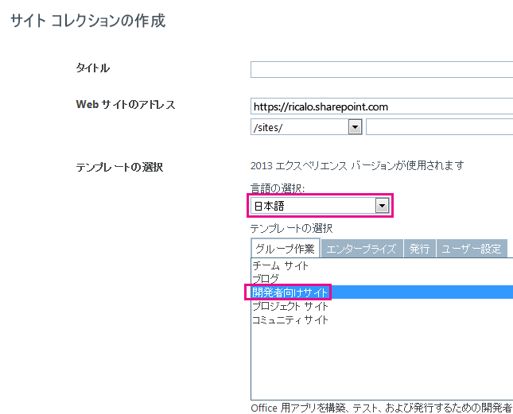

# SharePoint アドインをローカライズする
SharePoint アドインを、リソース ファイル、JavaScript リソース ファイル、およびその他のテクニックを使用してローカライズします。
> **メモ**
> このトピックは、SharePoint アドインの基本的な作成、SharePoint の機能、アドイン Web とホスト Web の区別、 [アドイン内に存在する可能性がある SharePoint コンポーネントの種類](host-webs-add-in-webs-and-sharepoint-components-in-sharepoint-2013.md#TypesOfSPComponentsInApps)、および .resx ファイルのローカライズの基本の知識があることを前提としています。 
  
    
    


## SharePoint アドインのローカライズを準備する
<a name="Prerequisites"> </a>

始める前に以下を特定します。
  
    
    

- アドインがサポートする必要があるロケール。SharePoint Online、および言語パックがインストールされた SharePoint オンプレミスで、ユーザーが特定の言語とカルチャで Web サイトを作成できるようにします。顧客が使用するのがどのローカライズされた Web サイトであるのか確認し、ローカライズされたバージョンのアドインのコンポーネントで、これらのうちどれをサポートするのか判断します。
    
  
- アドインでローカライズする必要のあるコンポーネント。
    
  
また、以下を確認します。
  
    
    

- この記事の手順では、最新バージョンの  [Office Developer Tools for Visual Studio 2013](http://aka.ms/OfficeDevToolsForVS2013) または [Office Developer Tools for Visual Studio 2015](http://aka.ms/OfficeDevToolsForVS2015) を使用していることが前提となっています。
    
    > **メモ**
      > テスト用の SharePoint Web サイトが Microsoft SharePoint Online 開発者向けサイトではなく社内 SharePoint ファームである場合、SharePoint アドインを翻訳する言語の言語パックをインストールしなければならないことがあります。詳しくは、「 [SharePoint 2013 用の言語パックをインストールまたはアンインストールする](http://technet.microsoft.com/ja-jp/library/cc262108%28v=office.15%29.aspx)」と「 [SharePoint Server 2013 の言語パック](http://technet.microsoft.com/ja-jp/library/ff463597%28v=office.15%29.aspx)」(およびそのダウンロード リンク) とを参照してください。 
- この記事のスクリーン ショットとコード例は、サンプル「 [SharePoint-Add-in-Localization](https://github.com/OfficeDev/SharePoint-Add-in-Localization)」を反映しています。サンプルをダウンロードして、この記事で説明されている手順の結果を確認できます。
    
  

## アドイン Web コンポーネントをローカライズする
<a name="LocalizingAppWeb"> </a>

アドイン Web には、特定の種類の SP コンポーネントを含めることができます。SharePoint アドインに含めることができる SharePoint コンポーネントの種類については、「 [SharePoint アドインに含めることができる SharePoint コンポーネントの種類](host-webs-add-in-webs-and-sharepoint-components-in-sharepoint-2013.md#TypesOfSPComponentsInApps)」を参照してください。アドイン Web に展開されるコンポーネントをローカライズするには、アドイン Web コンポーネントを含むのと同じ機能のモジュールに .resx ファイルを追加します。そのリソースをコンポーネントのマークアップで参照します。その方法については、この記事で後述します。ただし、SharePoint アドインのカスタム サイト ページでは、このセクションで後述するように, .resx ファイルの代わりに JavaScript の文字列変数ファイルを使用します。
  
    
    

> **メモ**
> リソース ファイルは、アドイン Web の複数のフィーチャーで共有することはできません。.wsp ファイル内のフィーチャーごとに、別個のリソース ファイル セットを作成する必要があります。 
  
    
    


### アドイン Web のリソース ファイルを作成するには


1. Visual Studio で SharePoint アドイン プロジェクトを開きます。(このトピックのスクリーンショットが取られたサンプルは、ASP.NET Web Form をプロジェクトのリモート Web アプリケーション部分とするプロバイダー ホスト型のアドインです。)
    
  
2. **ソリューション エクスプローラー**で、フィーチャー名のショートカット メニューを開き、[ **フィーチャー リソースの追加**] を選択します。
    
  
3. [ **リソースの追加**] ダイアログ ボックスで [ **ロケールに依存しない言語 (ロケールに依存しない国)**] を選択し、[ **OK**] をクリックします。 **ソリューション エクスプローラー**で Resource.resx ファイルがフィーチャーのフォルダーに追加され、そのファイルが Visual Studio **リソース エディター**で開きます。
    
    編集時、この "ロケールに依存しない言語" ファイルには、文字列のローカライズされたバージョンが用意されない言語で表示されるすべてのサイトで使用される **フィーチャー** ギャラリー内の文字列が含まれます。したがって、このファイル内の文字列で使用する言語は、SharePoint を使用するユーザーにとって第二言語である可能性が高い言語にする必要があります。伝統的に、この目的のために英語が使用されていますが、一部のシナリオでは、別の言語の方が適している場合があります。たとえば、一部の地域では、フランス語の方が英語よりも一般的な第二言語になります。このトピックに示す例では、ロケールに依存しない言語として英語を使用します。
    
    > **メモ**
      > SharePoint アドインは、アドイン マニフェストの [ **サポートされるロケール**] セクションに言語がリストされていない Web サイトにはインストールできません。この記事で、ローカライズされたアドインを作成 *しない*  言語について説明される場合でも、その言語をアドイン マニフェストに追加する必要があります。アドイン マニフェストでサポートされるロケールについて詳しくは、この記事にある「 **ホスト Web のリソース ファイルを作成するには** 」の手順を参照してください。
4. **リソース エディター**の 1 行目の [ **名前**] 列に、文字列 (またはその他のリソース) の説明的な名前を入力します (例: OrdersListInstance_Title、OrdersListInstance_Description)。ローカライズ可能リソースのこれらの名前自体はローカライズされません。各リソースはそれぞれ固有の名前を持つ必要があります。
    
  
5. [ **値**] 列に、適切な文字列 (または URL またはその他のリソース) を、ロケールに依存しない言語で入力します (例: 注文、注文を格納するリスト)。
    
  
6. 機能のコンポーネントで使用するためにローカライズする必要があるすべての文字列とリソースで名前と値のペアを追加します。
    
  
7. ファイルを保存します。
    
  
8. 前と同じフィーチャーに対して別のリソース ファイルを追加しますが、 **ロケールに依存しない言語 (ロケールに依存しない国)** の代わりに、特定の言語を選択します。たとえば、[ **スペイン語 (スペイン)**] を選択できます。Resources.LL-CC.resx ファイル ( `LL` と `CC` は、 [Internet Engineering Task Force (IETF) 互換](http://tools.ietf.org/html/rfc1766)言語とカルチャ コード) が、 **ソリューション エクスプローラー**でフィーチャーのフォルダーに追加され、そのファイルが Visual Studio **リソース エディター**で開きます。
    
  
9. **リソース エディター**を使用して、Resource.resx 内のすべての行をコピーし、新しい Resource.LL-CC.resx ファイルに貼り付けます。(リソース エディターのコンテキスト メニューで [ ** コピー**] が使用可能になっていない場合には、Ctrl+Cを使用して行をクリップボードにコピーします。)
    
  
10. Resource.LL-CC.resx ファイルで、[ **値**] セルを、翻訳された文字列値に置き換えます。URL などの文字列以外のリソースの値を、言語とカルチャに適した新しい値に置き換えます。
    
  
11. 新しいファイルを保存します。
    
  
12. 各言語で、前の 4 つの手順を繰り返します。
    
    > **メモ**
      > ロケールに依存しない言語と同じ言語用の言語固有ファイルを追加することを考慮してください。これを行うと、文字列の値を変更せずに行をコピーできます。多くの場合、ロケールに依存しない言語のリソース ファイルで使用されている言語と同じ言語用の言語固有ファイルは必要ありません。これは、ファイル内のリソースが文字列のみである場合は特に当てはまります。ただし、リソース ファイルには、画像、アイコン、ファイルなどのさまざまな種類のリソースが含まれる可能性があります。場合によっては、すべての言語固有ファイルの対応するリソースとは異なる画像などのリソースを使用するために、ロケールに依存しない言語のリソース ファイルが必要です。 
13. 各ファイルで、[ **ビルド アクション**] が [ **コンテンツ**] に設定されていることを確認します。
    
  

### カスタム リスト内のローカライズされたリソースを呼び出すには


1. カスタム リストのタイトルおよび説明プロパティをローカライズするには、リストのインスタンスの **Elements.xml** ファイルを開きます。たとえば、このトピックのサンプルの場合、 **ソリューション エクスプローラー**で、[ **BookstoreApp**] > [ **Order Status**] > [ **OrderStatusInstance**] > [ **Elements.xml**] に移動します。
    
  
2. [ **タイトル**] 属性に、「$Resources: _StringName_,」と入力します。 _StringName_ は、前の手順でカスタム リストに名前を付けるために文字列に与えた名前です (値ではありません)。たとえば、「$Resources: OrdersListInstance_Title」と入力します。.resx ファイルが使用される一部のコンテキストは異なり、リソース ファイルの名前は入力データの一部ではありません。
    
  
3. [ **説明**] 属性を使用して、リストの説明の文字列リソースを、同じ方法で呼び出します。たとえば、「$Resources:OrdersListInstance_Description」と入力します。次に示すのは、リストのインスタンスの Elements.xml ファイル内でローカライズされた文字列を使用するマークアップです。
    
 ```XML
  
<?xml version="1.0" encoding="utf-8"?>
<Elements xmlns="http://schemas.microsoft.com/sharepoint/">
  <ListInstance 
      Title="$Resources:OrdersListInstance_Title" 
      OnQuickLaunch="TRUE" 
      TemplateType="10000" 
      Url="Lists/Orders" 
      Description="$Resources:OrdersListInstance_Description">
  </ListInstance>
</Elements>
 ```


    次に示すのは、英語でローカライズされたカスタム リストの画像です。
    

   **ローカライズされたカスタム リスト**

  

!\[ローカライズされたユーザー設定リスト](images/LocSPApp_AppwebList.png)
  

  

  

### カスタム リストの列名をローカライズするには


1. カスタム リストの列名は、タイトルや説明と同じ方法ではローカライズできません。列名をローカライズするには、 **Elements.xml** ファイルでリストのフィールドを宣言し、 **DisplayName** 属性の値をアドイン Web リソース ファイルの参照に設定する必要があります。開始するには、カスタム リストの **Schema.xml** ファイルを開きます。 **Fields** ノードを探し、そのすべての **Field** ノードをコピーします。
    
  
2. カスタム リストの **Elements.xml** ファイルを開きます。リストのインスタンスではなく、リスト定義の Elements.xml ファイルを開いてください。前の手順でコピーしたノードを、 **Elements** ノードの子として貼り付けます。
    
  
3. すべての **Field** ノードについて、$Resources: _StringName_ の値を **DisplayName** 属性に入力します。 _StringName_ はアドイン Web リソース ファイルのエントリの名前です。
    
  
4. カスタム リストの **Schema.xml** ファイルで、前にコピーしたすべての **Field** ノードの **DisplayName** 属性を削除します。次に示すのは、リスト定義の **Elements.xml** ファイルのローカライズされた文字列を使用するマークアップの例です。
    
 ```
  
<?xml version="1.0" encoding="utf-8"?>
<Elements xmlns="http://schemas.microsoft.com/sharepoint/">
    <ListTemplate
        Name="Orders"
        Type="10000"
        BaseType="0"
        OnQuickLaunch="TRUE"
        SecurityBits="11"
        Sequence="410"
        DisplayName="Orders"
        Description="My List Definition"
        Image="/_layouts/15/images/itgen.png"/>
    <Field
        Name="Bookname"
        ID="{2ef60a05-29b6-41db-9611-c0cf7d8e73c5}"
        DisplayName="$Resources:OrdersListColumn_Bookname"
        Type="Text"
        Required="TRUE" />
    <Field
        Name="Price"
        ID="{7af42815-d69e-426a-a1c8-9da5610e362c}"
        DisplayName="$Resources:OrdersListColumn_Price"
        Type="Currency"
        Required="FALSE" />
    <Field
        Name="Orderstatus"
        ID="{687ee751-2e0a-4099-966e-d2c225d48234}"
        DisplayName="$Resources:OrdersListColumn_Orderstatus"
        Type="Lookup"
        Required="FALSE"
        List="Lists/Order status"
        ShowField="Title" />
</Elements>
 ```


### カスタム ページ用の JavaScript リソース ファイルを作成するには


1. SharePoint アドインのカスタム サイト ページでは、JavaScript 文字列変数ファイルが .resx ファイルの代わりに使用されます。
    
    最初に、 **ソリューション エクスプローラー**で、Web アプリケーションのプロジェクトではなく SharePoint アドインのプロジェクトに Scripts というフォルダー名がない場合は追加します。[ **Scripts**] フォルダーを右クリックして、[ **追加**] > [ **新しい項目**] > [ **Web**] > [ **JavaScript ファイル**] を選択します。ファイルに Resources. _LL_- _CC_.js という名前を付けます。 _LL_ は言語コードで、 _CC_ は国/地域コードまたはカルチャ コードです (例:Resources.en-US.js)。
    
  
2. 前の手順を、各言語で繰り返します。これで、すべての言語用の空白の JavaScript ファイルが用意されます。"Resources.js"という名前の、ロケールに依存しない言語ファイルは作成しないでください。理由については、後の手順の中で説明します。
    
  
3. 新しく作成した最初の JavaScript ファイルを開きます。
    
  
4. 各カスタム ページの各ローカライズ可能文字列に対して、文字列を識別する目的の名前となる変数をファイル内に宣言し、言語に適した値を割り当てます。次に示すのは Resources.en-US.js ファイルの内容です。
    
 ```
  
var instructionstitle = "Instructions:";
var step01 = "Go to any document library in the host web.";
var step02 = "Go to the Library tab.";
var step03 = "Click \\"Request a book\\" in the Settings group.";
var step04 = "Click the contextual menu in any document.";
var step05 = "Click \\"Buy this book\\" in the contextual menu.";
var step06 = "Go to any SharePoint page in the host web and add the" +
    " Bookstore orders add-in part.";
var step07 = "Review the localized <a href=\\"../Lists/Orders\\">Orders</a>" +
    " and <a href=\\"../Lists/Order status\\">Order status</a> custom lists.";

 ```

5. このファイルの内容を、残りの JavaScript ファイルにコピーし、すべてのファイルを保存します。
    
  
6. 各ファイルで、各変数の値を、各ファイルの言語に適した新しい値に置き換えます。 *変数名は変更しないでください。* 
    
  

### カスタム ASPX ページ内のローカル可能変数を呼び出すには


1. **ソリューション エクスプローラー**で、カスタム ASPX ページ ファイルを開きます。
    
  
2. ページの読み込み時に、ローカライズされた JavaScript ファイルが 1 つだけ読み込まれ、そのファイルが SharePoint アドイン Web に適していることを確認してください。これを行うには、値が  `PlaceholderAdditionalPageHead` の `ContentPlaceholderId` がある、ページの **asp:content** 要素に次のマークアップを追加する必要があります。 *次のマークアップにはプレースホルダーはありません。ここに示したマークアップとまったく同じように入力してください。* 
    
 ```HTML
  
<script type="text/javascript" src="../scripts/Resources.<SharePoint:EncodedLiteral runat='server' text='<%$Resources:wss,language_value%>' EncodeMethod='HtmlEncode' />.js"></script>
 ```


    このマークアップは、いずれかの JavaScript ファイルを読み込みます。読み込まれるファイルは、"language_value" という名前の SharePoint リソースを読み取ることで決定されます。このリソースは、前の手順で説明した  _LL_- _CC_ というパターンの言語カルチャ名に解決されます。つまり、アドイン Web の言語に解決されます。
    
    > **メモ**
      > SharePoint リソースである "language_value" は null になることはないため、このスクリプトによって "Resources.js" というファイルが呼び出されることはありません。これが前の手順でこの名前のファイルを作成しなかった理由です。"language_value" の値が .js ファイルが存在しない言語の場合、このスクリプトは何も読み込みません。このような状況のときに、文字列がロケールに依存しない言語を取得する方法については、次の手順で説明します。 
3. ページ上のローカライズ可能な要素と属性値に対して、それぞれ、ロケールに依存しない言語で既定値を指定しますが、そのときに、JavaScript を使用して、Resources. _LL_- _CC_.js ファイルの適切な変数を割り当てます。たとえば、ページの **h2** 要素にタイトルがある場合は、その要素に **id** 属性を指定した後、ローカライズされる要素の下に **script** 要素を挿入して、その **innerText** プロパティにローカライズされた文字列を割り当てます。このローカライズ コードが実行されるのは、Resources. _LL_- _CC_.js ファイルが読み込まれ、変数が宣言される場合だけです。そのため、いずれかの変数が定義されているかどうかを最初にテストする条件ブロック内にそれを含めます。定義されていない場合、リソース スクリプトが読み込まれないため、既定の (ロケールに依存しない) 値は変更されません。以下に例を示します。
    
    > **ヒント**
      > ロケールに依存しない文字列の先頭に「INVARIANT」という語が追加されています。これを製品アドインで行うことはありませんが、テストの際にロケールに依存しない言語文字列が使用されているか、またはロケールに依存しない言語になる言語の Resources. _LL_- _CC_.js ファイルが読み込まれたかを一目で知るための役立つ方法となります。 

 ```HTML
  <h2 id="instructionsheading">INVARIANT Instructions</h2>
<ol>
    <li id="step01">Go to any document library in the host web.</li>
    <li id="step02">Go to the Library tab.</li>
    <li id="step03">Click "Request a book" in the Settings group.</li>
    <li id="step04">Click the contextual menu in any document.</li>
    <li id="step05">Click "Buy this book" in the contextual menu.</li>
    <li id="step06">Go to any SharePoint page in the host web and add the Bookstore orders add-in part.</li>
    <li id="step07">Review the localized <a href="../Lists/Orders">Orders</a> and <a href="../Lists/Order status">Order status</a> custom lists.</li>
</ol>

<!-- Use the localized strings in the resource JavaScript file -->
<script type="text/javascript">
    window.onload = function () {
        <!-- Test whether a Resources.LL-CC.js loaded.
             If none was, the invariant values remain unchanged. -->
        if (typeof instructionstitle != 'undefined')  
        {
            document.getElementById("instructionsheading").innerText = instructionstitle;
            document.getElementById("step01").innerText = step01;
            document.getElementById("step02").innerText = step02;
            document.getElementById("step03").innerText = step03;
            document.getElementById("step04").innerText = step04;
            document.getElementById("step05").innerText = step05;
            document.getElementById("step06").innerText = step06;
            document.getElementById("step07").innerHTML = step07;
        }
    }
</script>

 ```


    次の図は、アドインが完了したときの、英語バージョンのページのプレビューを示しています。
    

   **JavaScript リソース ファイルのローカライズされた文字列を使用する Web ページ**

  

!\[ローカライズされた文字列を使用した SharePoint ページ](images/LocSPApp_AppwebPage.png)
  

  

  

## ホスト Web コンポーネントをローカライズする
<a name="LocalizingHostWeb"> </a>

AppManifest.xml ファイルで指定されているアドイン タイトルをローカライズできます。これは、 **Your Add-ins** ページでユーザーに対して表示されるデータです。SharePoint アドインのホスト Web には、カスタム アクション、アドイン パーツ、または両方を含めることができます。これらは、ホスト Web フィーチャーに展開されます。これらのコンポーネントの両方に、ローカライズ可能文字列を指定できます。
  
    
    
ホスト Web コンポーネントをローカライズする方法は、アドイン Web コンポーネントをローカライズする方法と本質的には同じです。ローカライズされたリソースは .resx ファイル内にアイテム化され、マークアップ ファイルから呼び出されます。ただし、Visual Studio では、ホスト Web フィーチャーに適用される場合ほど、プロセスに対するツール サポートは提供されていません。後で説明するように、手動プロセスがあります。
  
    
    

### ホスト Web のリソース ファイルを作成するには


1. **ソリューション エクスプローラー**で、AppManifest.xml ファイルを選択してアドイン マニフェスト デザイナー ツールを開きます。
    
  
2. [ **サポートされるロケール**] タブを開きます。
    
  
3. [ **ロケール**] 列の先頭の空のセルで、ドロップダウン リストを開き、サポートする最初のロケールを選択します。2 つのファイルが作成されて、SharePoint アドイン プロジェクトに追加されます。Resources.resx は、ロケールに依存しない言語のリソース ファイルです。Resources. _LL_- _CC_.resx には、ローカライズされたリソースが格納されます。これらのファイルの名前は変更しないでください。
    
  
4. アドインのローカライズ バージョンによってサポートする各ロケールについて、前の手順を繰り返します。ロケールごとに、Resources. _LL_- _CC_.resx ファイルが追加作成されます。
    
    > **メモ**
      > これらの各ファイルの [ **ビルド アクション**] プロパティは、[ **リソース**] ではなく [ **コンテンツ**] に設定されます。この設定は変更しないでください。 
5. また、アドインをインストール可能にする、しかしロケールに依存しない言語を使用する必要のある (つまりアドインのローカライズ バージョンを提供 *しない*  ) すべてのロケール用に、ロケール エントリを追加します。 *それらのロケール用に作成される .resx ファイルを削除してください。* 
    
  
6. Resources.resx ファイルを開き、アドイン Web のリソース ファイルと同じように、リソースの名前と値をファイルに追加します。少なくとも、アドイン タイトル用のリソースを用意する必要があります。ホスト Web フィーチャーは SharePoint UI のどこにも表示されないので、ホスト Web フィーチャーのタイトルや説明の文字列をローカライズする必要はありません。フィーチャーにカスタム アクションがある場合は、 **CustomAction** 要素の **Title** 属性用のリソースが必要であり、おそらくカスタム アクション マークアップ内に他の文字列も必要です。アドイン パーツがある場合は、 **ClientWebPart** 要素の **Title** 属性と **Description** 属性用のリソースが必要です。アドイン パーツにカスタム プロパティがある場合は、ローカライズする必要がある属性を各 **Property** に指定する必要があります。これらのすべてについて、リソース ファイル内に該当する行が必要です。
    
  
7. Resources.resx ファイルの内容を、各 Resources. _LL_- _CC_.resx ファイルにコピーします。
    
  
8. 各 Resources. _LL_- _CC_.resx ファイルの各リソースを、アドイン Web リソース ファイルと同じようにローカライズします。
    
  

### アドイン マニフェスト ファイルおよびその他の XML ファイル内のローカライズされたリソースを呼び出すには


1. AppManifest.xml ファイルを開き、 **Title** 要素の値を、適切なリソース文字列の呼び出しに置き換えます。たとえば、文字列にAddin_Title という名前を付けた場合、 **Title** 要素は次のようになります。
    
 ```XML
  
<Title>$Resources:Addin_Title;</Title>
 ```


    > **注意**
      > **Title** の値には、リソースの呼び出しのみを含めることができます。それ以外のテキスト、記号、またはホワイト スペースは指定できません。
2. アドイン パーツやカスタム アクションの Elements.xml など、他の XML ファイルのローカライズされたリソースを呼び出すには、アドイン マニフェスト ファイルで使用したものと同じ形式を使用します。
    
  

## SharePoint アドイン内のリモート コンポーネントをローカライズする
<a name="LocalizingAutohosted"> </a>

リモート コンポーネントが PHP などの Microsoft 以外のフォーマットの場合は、適切なプラットフォームのローカライズに関する説明を参照してください。リモート コンポーネントが ASP.NET の場合は、他のすべての ASP.NET アプリケーションと同様にローカライズします。詳しくは、「 [ASP.NET Globalization and Localization](http://msdn.microsoft.com/library/8ef3838e-9d05-4236-9dd0-ceecff9df80d.aspx)」を参照してください。
  
    
    
ホスト Web の言語に合うようにページの言語とスレッドの言語をオーバーライドしてください。これは ASP.NET ページの分離コードにある継承された **InitializeCulture** メソッドをオーバーライドすることによって行います。ホスト Web の言語を識別するには、SharePoint がリモート ページに渡す **SPLanguage** クエリ パラメーターを使用します。次のコードは、ASP.NET でこれを行う方法を示しています。PHP Web アプリケーションや他のプラットフォームでも、類似の方法で行うことができます。
  
    
    



```cs
protected override void InitializeCulture()
{
    if (Request.QueryString["SPLanguage"] != null)
    {
        string selectedLanguage = Request.QueryString["SPLanguage"];
        
        // Override the page language.
        UICulture = selectedLanguage;
        Culture = selectedLanguage;

        // Reset the thread language.
        Thread.CurrentThread.CurrentCulture =
            CultureInfo.CreateSpecificCulture(selectedLanguage);
        Thread.CurrentThread.CurrentUICulture = new
            CultureInfo(selectedLanguage);
    }
    base.InitializeCulture();
}
```


## リモート JavaScript と SharePoint クロム コントロールのローカライズ
<a name="JSandChrome"> </a>

Web アプリケーションの JavaScript にローカライズ可能な文字列値がある場合、それらを JavaScript リソース ファイルを使用してローカライズできます。ローカライズ可能な JavaScript の特に重要な例は  [SharePoint クロム コントロール](use-the-client-chrome-control-in-sharepoint-add-ins.md)で、これを使用するとリモート ページを SharePoint ページのように見せることができます。このセクションでは、クロム コントロールのローカライズを例として使用します。
  
    
    

> **メモ**
> このセクションでは、文字列のローカライズについてのみ説明します。 日付や通貨形式など必要性のより大きなローカライズについては、「 [jQuery 用のグローバライズ アドオン](https://github.com/jquery/globalize)」などのローカライズまたはグローバリゼーション ライブラリの使用を検討してください。 
  
    
    


### クロム コントロールをローカライズするには


1. クロム コントロールの機能が開始した後に、クロム オプションを設定した  `renderChrome` メソッドに戻ります。
    
 ```
  
function renderChrome() {
    var options = {
        "appIconUrl": "siteicon.png",
        "appTitle": "My SharePoint add-in", // Localizable string
        "appHelpPageUrl": "Help.html?"
            + document.URL.split("?")[1],
        "onCssLoaded": "chromeLoaded()",
        "settingsLinks": [
            {
                "linkUrl": "Account.html?"
                    + document.URL.split("?")[1],
                "displayName": "Account settings" // Localizable string
            },
            {
                "linkUrl": "Contact.html?"
                    + document.URL.split("?")[1],
                "displayName": "Contact us" // Localizable string
            }
        ]
    };

 ```

2. コメントに記されているように、少なくとも 3 つのローカライズ可能な文字列があります。それぞれを、後の手順で宣言する変数名に置き換えます。
    
 ```
  
function renderChrome() {
    var options = {
        "appIconUrl": "siteicon.png",
        "appTitle": chromeAppTitle, // Localized value
        "appHelpPageUrl": "Help.html?"
            + document.URL.split("?")[1],
        "onCssLoaded": "chromeLoaded()",
        "settingsLinks": [
            {
                "linkUrl": "Account.html?"
                    + document.URL.split("?")[1],
                "displayName": chromeAccountLinkName // Localized value
            },
            {
                "linkUrl": "Contact.html?"
                    + document.URL.split("?")[1],
                "displayName": chromeContactUsLinkName // Localized value
            }
        ]
    };

 ```

3. ChromeStrings という名前の JavaScript ファイルを Web アプリケーション プロジェクトに追加します。そこでは直前の手順で使用された変数を宣言して、ロケールに依存しない言語でそれぞれに値を割り当てる必要があります。
    
 ```
  
var chromeAppTitle = "My SharePoint add-in";
var chromeAccountLinkName = "Account settings";
var chromeContactUsLinkName = "Contact us";

 ```

4. アドインをローカライズする言語ごとに、ChromeStrings. _LL-CC_.js という名前の別の JavaScript ファイルを追加します。ここで、 _LL-CC_ は言語 ID です。 *ファイル名のベース (このケースでは "ChromeStrings") は、ロケールに依存しない言語のファイルに使用したものと完全に同じでなければなりません。*  ロケールに依存しない言語のファイルの内容をローカライズされる各ファイルにコピーして、それらの値を翻訳されたバージョンに置き換えます。
    
 ```
  
var chromeAppTitle = "Mi aplicación SharePoint";
var chromeAccountLinkName = "Preferencias";
var chromeContactUsLinkName = "Contacto";

 ```

5. スクリプト SP.UI.controls.js が呼び出されるすべてのページ ファイルで、その上の ChromeStrings.js に対する呼び出しを追加します。たとえば、SP.UI.controls.js への呼び出しが ChromeLoader.js という名前の中間ファイルに読み込まれる場合、この時点でのページのマークアップは次のようになるはずです。
    
 ```
  
<Scripts>
  <asp:ScriptReference Path="Scripts/ChromeStrings.js" />
  <asp:ScriptReference Path="Scripts/ChromeLoader.js" />
</Scripts>
 ```

6. 文字列を呼び出す **ScriptReference** 要素に **ResourceUICultures** 属性を追加します。これはサポートする言語のコンマ区切りリストです。
    
 ```
  
<Scripts>
  <asp:ScriptReference Path="Scripts/ChromeStrings.js" ResourceUICultures="en-US,es-ES" />
  <asp:ScriptReference Path="Scripts/ChromeLoader.js" />
</Scripts>
 ```


    **ResourceUICultures** 属性の効果として、ASP.NET は ChromeStrings. _LL-CC_.js という名前のファイルを検索して読み込むようになります。ここで、 _LL-CC_ はページの言語です。そのようなファイルが見つからない場合、ChromeStrings.js ファイルを読み込みます。
    
  

## ローカライズされた SharePoint アドインをテストする
<a name="TestingLocalizedApps"> </a>

アドインでサポートされるいずれかの言語で準備された SharePoint Web サイトに展開することによって、アドインをテストします。SharePoint Online Web サイトまたは社内 Web サイトでアドインをテストできます。
  
    
    

### SharePoint Online Web サイトでアドインをテストするには


1. Office 365 管理センターに移動します。
    
  
2. ナビゲーション メニューで [ **サービス設定**]、[ **サイト**] の順に選択します。
    
  
3. サイト コレクションで [ **サイト コレクションの作成**] を選択します。
    
  
4. [ **言語の選択**] で、アドインをテストする言語を選択します。
    
  
5. [ **テンプレートの選択**] で、[ **開発者向けサイト**] を選択します。
    
  
6. SharePoint アドイン プロジェクトで **SiteUrl** プロパティを、新しいサイト コレクションの URL で更新します。
    
  
7. F5 キーを押してアドインを実行します。
    
  

**サイト コレクション作成ページ**

  
    
    

  
    
    

  
    
    

### 社内 Web サイトでアドインをテストするには


1. アドインをテストする言語パックをインストールします。詳しくは、「 [SharePoint 2013 用の言語パックをインストールまたはアンインストールする](http://technet.microsoft.com/library/cc262108.aspx)」と「 [SharePoint Server 2013 の言語パック](http://technet.microsoft.com/ja-jp/library/ff463597%28v=office.15%29.aspx)」を参照してください。
    
  
2. ファームの全体管理を開きます。
    
  
3. [ **アプリケーション構成の管理**] で、[ **サイト コレクションの作成**] を選択します。
    
  
4. [ **言語の選択**] で、アドインをテストする言語を選択します。
    
  
5. [ **テンプレートの選択**] で、[ **開発者向けサイト**] を選択します。
    
  
6. SharePoint アドイン プロジェクトで **SiteUrl** プロパティを、新しく作成したサイト コレクションの URL に更新します。
    
  
7. F5 キーを押してアドインを実行します。
    
  

## その他の技術情報
<a name="SP15Localizeapp_addlresources"> </a>


-  [SharePoint アドインの開発](develop-sharepoint-add-ins.md)
    
  
-  [Office 2013 プレビュー用のアプリを特定のロケール用にデザインする](http://msdn.microsoft.com/library/5a1a1cd7-b716-4597-b51f-fa70357d0833%28Office.15%29.aspx)
    
  
-  [ASP.NET グローバリゼーションとローカライズ](http://msdn.microsoft.com/library/8ef3838e-9d05-4236-9dd0-ceecff9df80d.aspx)
    
  
-  [SharePoint-Add-in-Localization](https://github.com/OfficeDev/SharePoint-Add-in-Localization)
    
  

