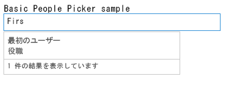

# Office Web Widgets - Experimental の概要
Office アドイン、SharePoint アドイン、および Web サイトで使用できる Office Web Widgets - Experimental について説明します。
> **注意**
> Office Web Widgets - Experimental は、研究およびフィードバックを得る目的でのみ提供されています。運用シナリオでは使用しないでください。Office Web ウィジェットは、今後のリリースでその動作が大幅に変更される可能性があります。「 [Office Web Widgets - Experimental のライセンス条項](office-web-widgetsexperimental-license-terms.md)」を参照し、把握してください。 

Office Web Widgets - Experimental などのクライアント コントロールを使うと、アドインの作成時間が大幅に短縮され、アドインの品質が向上します。これを実現するには、ウィジェットが一定の条件を満たしている必要があります。
- ウィジェットは、すべての Web ページで使用され、SharePoint でホストされるページ以外でも使用できるように設計する必要があります。

- ウィジェットは、Office コントロール ランタイムの内部で実行されます。したがって、ウィジェットには、共通の要件セットおよび一貫した構文を使用できます。

- SharePoint と通信するウィジェットは、クロスドメイン ライブラリを使用します。ウィジェットは、特定のサーバー側プラットフォームやテクノロジに依存しません。どのサーバー テクノロジを選択した場合でも、ウィジェットを使用できます。

- ウィジェットは、ページ内の他の要素と共存する必要があります。 ウィジェットをページに含めることで、ページ内の他の要素が変化するようであってはなりません。

- 既存のフレームワークと相性よく動作すること。使い慣れたツールやテクノロジを使い続けることができるようである必要があります。

**図 1. Office Web Widgets - Experimental を使用したアドイン**

ウィジェットを使用するには、Visual Studio から **Office Web Widgets - Experimental** NuGet パッケージをインストールします。詳細については、「 [ダイアログを使用して NuGet パッケージを管理する](http://docs.nuget.org/docs/start-here/managing-nuget-packages-using-the-dialog)」を参照してください。また、 [NuGet ギャラリー ページ](http://www.nuget.org/packages/Microsoft.Office.WebWidgets.Experimental/)も参照してください。寄せられたフィードバックおよびコメントによって、提供するウィジェットを決定することができました。図 1 に示すように、(1) ユーザー選択ウィンドウのウィジェットと (2) デスクトップ リスト ビュー ウィジェットの準備ができましたので、実験的なウィジェットをお試しください。 [Office デベロッパー プラットフォーム UserVoice サイト](http://officespdev.uservoice.com/)にフィードバックをぜひお寄せください。「 [Office Web Widgets - Experimental のデモ](http://code.msdn.microsoft.com/SharePoint-2013-Office-Web-6d44aa9e)」 のコード サンプルで、実行中のウィジェットも確認してください。
## ユーザー選択ウィンドウのウィジェット

アドインで実験的なユーザー選択ウィンドウのウィジェットを使用して、テナント内のユーザーやグループを検索し、選択できます。テキスト ボックスに入力を開始すると、入力した文字に一致する名前またはメール アドレスを持つユーザーが検索されます。

**図 2. クエリを解決しているユーザー選択ウィンドウのウィジェット**

ウィジェットは、HTML マークアップで宣言することも、JavaScript を使ってプログラムで宣言することもできます。どちらの場合でも、 **div** 要素をウィジェットのプレースホルダーとして使用します。また、ユーザー選択ウィンドウのウィジェットのプロパティやイベント ハンドラーも設定できます。次の表に、ユーザー選択ウィンドウのウィジェットで設定できるプロパティおよびイベントを示します。

|**プロパティ/イベント**|**型**|**説明**|
|:-----|:-----|:-----|
|**objectType**   |JSON オブジェクト (文字列のリスト)    | ウィジェットが解決するアイテムの種類。オプション:    ユーザー    グループ    ユーザーのみを既定として設定。   |
|**allowMultipleSelections**   |ブール型 (Boolean)    |True または False。False の場合、一度に 1 つの項目のみ選択できます。          Default=False    |
|**rootGroupName**   |文字列型 (String)    |指定した場合、このグループ内の項目に選択範囲が制限されます。           指定しない場合、テナント全体からオブジェクトを照会します。    |
|**selectedItems**   |JSON 配列    |選択された項目の一覧。各項目は、ユーザーまたはグループを表すオブジェクトを返します。    |
|**onAdded**   |関数    |選択範囲に新しいオブジェクトを追加したときに発生するイベント。追加されたオブジェクトをハンドラー関数が受け取ります。    |
|**onRemoved**   |関数    |選択範囲から新しいオブジェクトを削除したときに発生するイベント。削除されたオブジェクトをハンドラー関数が受け取ります。    |
|**onChange**   |関数    |オブジェクトの追加または削除のいずれかを行うと、このイベントが発生します。ハンドラー関数に渡すパラメータはありません。    |
|**validationErrors**   |配列    | 起こり得る検証エラーの配列:    empty    unresolvedItem    tooManyItems   |
|**autoShowValidationMessage**   |ブール型 (Boolean)    |True = 表示する          False = 表示しない    |
|**hasErrors**   |ブール型 (Boolean)    |True = 1 つ以上の検証エラーがある          False = 検証エラーがない    |
|**errors**   |配列    | 起こり得る検証エラーの配列:    empty    unresolvedItem    tooManyItems   |
|**displayErrors**   |ブール型 (Boolean)    |True = エラーを表示する          False = エラーを表示しない    |
 
ユーザー選択ウィンドウのウィジェットの CSS クラスは、 **Office.Controls.css** スタイル シートに定義されています。クラスを上書きして、ウィジェットのスタイルをアドイン向けに変更できます。

詳細については、「 [ユーザー選択ウィンドウの実験用ウィジェットを SharePoint アドインで使用する](use-the-experimental-people-picker-widget-in-sharepoint-add-ins.md)」および「 [アドインで実験的なユーザー選択ウィンドウのウィジェットを使用する](http://code.msdn.microsoft.com/SharePoint-2013-Use-the-57859f85)」のコード サンプルを参照してください。 

## デスクトップ リスト ビュー ウィジェット

このリスト ビュー ウィジェットは、通常のリスト ビュー ウィジェットと同様にデータの一覧を表示できる以外に、SharePoint でホストされていないアドインでも使用できます。

**図 3. デスクトップ リスト ビュー ウィジェットに表示されたデータの一覧**

![ページ上の [Desktop List View] 実験用コントロール](images/DesktopListView_basic.png)

一覧から既存のビューを指定すると、ビューと同じ順序で各フィールドが表示されます。

> **メモ**
> 現在、デスクトップ リスト ビュー ウィジェットはデータの表示のみを行います。編集機能はありません。 

ウィジェットのプレースホルダーには **div** 要素を使用できます。ウィジェットを使用するには、プログラムを使うか、宣言型で宣言します。

デスクトップ リスト ビュー ウィジェットのプロパティやイベント ハンドラーを設定することもできます。次の表に、デスクトップ リスト ビュー ウィジェットで設定できるプロパティおよびイベントを示します。

|**プロパティ/イベント**|**型**|**説明**|
|:-----|:-----|:-----|
|**listUrl**   |URL    |リスト ビューの項目を取得するための URL。相対 URL (アドイン Web 上にある場合) または絶対 URL を指定できます。    |
|**viewName**   |文字列型 (String)    |表示するビューの名前。表示名ではなく、プログラム上の定義名です。    |
|**onItemSelected**   |関数    |リストで項目を選択したときに発生するイベントです。    |
|**onItemAdded**   |関数    |新しい項目をリストに追加したときに発生するイベントです。    |
|**onItemRemoved**   |関数    |項目をリストから削除したときに発生するイベントです。    |
|**selectedItems**   |配列    |選択された項目の一覧 (JSON 形式)。    |
 
ウィジェットでは、SharePoint Web サイトのスタイル シートが必要です。SharePoint スタイル シートを直接参照するか、クロム ウィジェットを使用することができます。スタイル シートの詳細については、「 [SharePoint アドインで SharePoint Web サイトのスタイル シートを使用する](use-a-sharepoint-website-s-style-sheet-in-sharepoint-add-ins.md)」および「 [SharePoint アドインのクライアント クロム コントロールを使用する](use-the-client-chrome-control-in-sharepoint-add-ins.md)」を参照してください。 

実行中のリスト ビュー ウィジェットについては、「 [アドインで実験的なデスクトップ リスト ビュー ウィジェットを使用する](http://code.msdn.microsoft.com/SharePoint-2013-Use-the-c3edb076)」のコード サンプルをご覧ください。また、「 [SharePoint アドインでデスクトップ リスト ビューの実験用ウィジェットを使用する](use-the-experimental-desktop-list-view-widget-in-sharepoint-add-ins.md)」も参照してください。

## まとめ

ウィジェットはアドインの開発プロセスを促進し、コストを削減し、市場投入までの時間を短縮します。Office Web Widgets - Experimental は、運用シナリオ以外のアドインで使用できるウィジェットを提供します。「 [Office デベロッパー プラットフォーム UserVoice サイト](http://officespdev.uservoice.com/) にフィードバックおよびコメントをぜひお寄せください。

## その他の技術情報

-  [Office Web Widgets - Experimental のライセンス条項](office-web-widgetsexperimental-license-terms.md)

-  [Office Web Widgets - Experimental の NuGet ギャラリー ページ](http://www.nuget.org/packages/Microsoft.Office.WebWidgets.Experimental/)

-  [ユーザー選択ウィンドウの実験用ウィジェットを SharePoint アドインで使用する](use-the-experimental-people-picker-widget-in-sharepoint-add-ins.md)

-  [コード サンプル: Office Web Widgets - Experimental のデモ](http://code.msdn.microsoft.com/SharePoint-2013-Office-Web-6d44aa9e)

-  [SharePoint アドインでデスクトップ リスト ビューの実験用ウィジェットを使用する](use-the-experimental-desktop-list-view-widget-in-sharepoint-add-ins.md)

-  [コード サンプル: アドインで実験的なユーザー選択ウィンドウのウィジェットを使用する](http://code.msdn.microsoft.com/SharePoint-2013-Use-the-57859f85)

-  [コード サンプル: アドインで実験的なデスクトップ リスト ビュー ウィジェットを使用する](http://code.msdn.microsoft.com/SharePoint-2013-Use-the-c3edb076)

