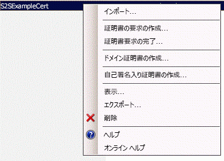

# 高信頼 SharePoint アドインをパッケージ化して発行する
社内で使用する高信頼 SharePoint アドインをパッケージ化して発行する方法を説明します。
## 高信頼アドインをパッケージ化して発行するための前提条件
<a name="Prereqs"> </a>

以下のことが必要です。
  
    
    

- 社内の SharePoint 2013 開発環境。セットアップ手順については、「 [SharePoint アドインのオンプレミスの開発環境をセットアップする](set-up-an-on-premises-development-environment-for-sharepoint-add-ins.md)」を参照してください。
    
  
- リモート Web アプリケーションのホストとなる IIS Web サーバー。IIS マネージャーがインストールされている必要があります。
    
  
- Visual Studio がリモートに、または SharePoint 2013 のインストール先コンピューターにインストールされていること
    
  
- Microsoft Office Developer Tools for Visual Studio
    
  
-  [Web 配置](http://www.iis.net/downloads/microsoft/web-deploy) が Visual Studio コンピューター上にインストールされていて、リモート Web アプリケーションサーバー上にインストールされている **Web 配置** と同じバージョンであること。
    
  
表 1 に、SharePoint アドインの作成に関する概念を理解するうえで役に立つ記事の一覧を示します。
  
    
    

**表 1. 高信頼アドインの発行に関する基本概念**


|**記事のタイトル**|**説明**|
|:-----|:-----|
| [プロバイダー ホスト型 SharePoint アドインの作成を始める](get-started-creating-provider-hosted-sharepoint-add-ins.md) <br/> |プロバイダーでホストされる基本的な SharePoint アドインを Office Developer Tools for Visual Studioを使用して作成する方法について説明します。  <br/> |
| [SharePoint の高信頼性アドインを作成する](create-high-trust-sharepoint-add-ins.md) <br/> |自己署名入り証明書と、関連付けられた発行者 ID を使用して、SharePoint アドインで基本的な高信頼 Office Developer Tools for Visual Studioを作成する方法について説明します。  <br/> |
| [Web 配置](http://www.iis.net/downloads/microsoft/web-deploy) <br/> |Web 配置を使用すると、Web アプリケーションや Web サイトを IIS に配置する作業が簡素化されます。  <br/> |
| [Digital Certificates](http://msdn.microsoft.com/library/e523b335-0156-4f47-b55c-b80495587c4f.aspx) および [Working with Certificates](http://msdn.microsoft.com/library/6ffb8682-8f07-4a45-afbb-8d2487e9dbc3.aspx) <br/> |デジタル証明書の基本的な概念について説明します。  <br/> |
   

> **メモ**
> 高信頼 SharePoint アドイン は、オンプレミスの SharePoint にのみインストール可能であり、Microsoft SharePoint Online にはインストールできません。それらは、クラウド ベースではなくオンプレミスの Web アプリケーションを主として意図したものです。この記事では、このような状況でアドインを発行する方法について説明します。また、この記事で言及する「顧客」は、SharePoint アドイン をインストールしてアドインのリモート コンポーネントのホストとなる事業所のことを指します。 
  
    
    


## 高信頼アドインの登録
<a name="Register"> </a>

アドインを発行するには、その前にそれを SharePoint ファームのアドイン管理サービスに登録しておく必要があります。高信頼 SharePoint アドイン は、常にアドイン インストール先の SharePoint ファーム上で登録されます。(Office ストア での販売はできません。) 以下の手順で説明されているように、登録は http:// _SharePoint_website_/_layouts/15/appregnew.aspx のページで実行します。
  
    
    

### アドインを登録するには


1. http:// _SharePoint_website_/_layouts/15/appregnew.aspx ページを表示します。[ **生成**] ボタンを選択して、アドインの ID とシークレットの値を生成します。(シークレットは、高信頼 SharePoint アドイン では実際には使用されませんが、フォームで必要になります。) アドインのリモート Web アプリケーションが実行されるドメインの基本 URL を指定します。ドメインにはプロトコル (HTTPS) を含めませんが、リモート コンポーネントが HTTPS 要求用に使用するポートが 443 でない場合は、それを含める必要があります (例: www.contoso.com:5555 またはMyAppServer:4444)。
    
    リダイレクト URI が必要な場合は、その値も入力します。リダイレクト URI の使用方法については、「 [SharePoint アドインの認証コード OAuth フロー](authorization-code-oauth-flow-for-sharepoint-add-ins.md)」を参照してください。
    
    ページ上のフォームは図 1 のようになります。この例の場合、リモート Web アプリケーション サーバーが HTTPS 要求をリッスンするポートは既定の 443 であるため、アドイン ドメインにポートを指定する必要はありません。
    

   **図 1. appregnew.aspx の登録アドイン**

  

     
  

  

  
2. **[作成]** を選択します。入力したアドインの情報が次のページに表示されます。この情報をすぐに参照できるようにしておいてください。Visual Studio 発行ツールを使用する際に、この情報が必要になります。ページのスクリーンショットを取っておくとよいかもしれません。
    
  

## 高信頼 SharePoint アドイン 用の証明書を取得、管理、および展開するための方針を選択する
<a name="Certificate"> </a>

SharePoint アドイン の開発とデバッグにおいて開発者が Visual Studio で **F5** を使用している場合、「 [SharePoint の高信頼性アドインを作成する](create-high-trust-sharepoint-add-ins.md)」で説明されているように、開発者は自己署名証明書を使用できます。しかし、アドインの *発行*  時に自己署名証明書を使用すると、リモート Web アプリケーションの開始ページが表示される前に、警告ページがブラウザーに表示されます。ユーザーは、続行するかどうかを選択する必要があります。そのような警告の例を図 3 に示します。
  
    
    

**図 3. 自己署名証明書の警告**

  
    
    

  
    
    

  
    
    
開発者はそれでも構わないと思うかもしれませんが、顧客は受け入れられないと感じるかもしれません。そのため、運用環境での最終発行処理の前に、信頼できるサードパーティの署名が付された証明書を顧客に配布することが必要になります。サードパーティとしては、商用証明機関 (CA) かオンプレミスの CA が可能です。商用 CA に関して言えば、業界では Web サーバー用の｢イントラネット専用」証明書を廃止する方向にあります。まだ購入は可能ですが、そのような証明書は、2016 年 11 月かそれよりも前に期限切れになります。高信頼 SharePoint アドイン の場合、この種の証明書は不要です。その場合、インターネット接続による Web サーバーで使用可能な証明書はイントラネット Web サーバーでも使用可能だからです。しかし、一般に後者のほうが多くのコストがかかります。
  
    
    
証明書は、Personal Information Exchange (pfx) とセキュリティ証明書 (cer) の 2 種類の形式でなければなりません。最初に取得する時点でそのどちらの形式でもない場合、顧客はユーティリティにより変換することができます。また、pfx 形式のバージョンを取得した場合、pfx ファイルを IIS にインポートし、後で cer バージョンをエクスポートすることができます。これについては後で説明します。
  
    
    
最初に取得する証明書が cer 形式の場合、それには秘密鍵と公開鍵の両方が含まれています。一般に、SharePoint で使用する .cer ファイルに秘密鍵が含まれていてはなりません。オリジナルの証明書を IIS にインポートした後、秘密鍵を含まない新しい cer バージョンをエクスポートすることを考慮してください。それについては、後で説明します。.pfx ファイルと .cer ファイルの詳細については、「 [ソフトウェア発行者証明書](http://msdn.microsoft.com/ja-jp/library/windows/hardware/ff552299%28v=vs.85%29.aspx)」を参照してください。
  
    
    
さらに、顧客はすべての高信頼 SharePoint アドイン に対して単一の証明書を使用するのか、それとも 1 つずつ別の証明書を使用するのかを考慮する必要があります。その決定については、「 [高信頼 SharePoint アドインに 1 つの証明書を使用するかまたは多数の証明書を使用するかを決定する](creating-sharepoint-add-ins-that-use-high-trust-authorization.md#Deciding)」を参照してください。
  
    
    

## 証明書によるリモート Web サーバーの構成
<a name="ConfigureRemote"> </a>

以下の手順は、リモート Web アプリケーションをホストするリモート Web サーバー上で実行します。
  
    
    

### リモート Web サーバーおよび pfx 証明書を構成するには


1. .pfx 証明書に強力なパスワードを指定します。詳細については、「 [強力なパスワードを作成するためのガイドライン](http://msdn.microsoft.com/ja-jp/library/bb416446.aspx)」および「 [強力なパスワード](http://msdn.microsoft.com/ja-jp/library/ms161962.aspx)」を参照してください。
    
  
2. 証明書を、リモート Web サーバー上の IIS にインポートします。そのための手順は、次のとおりです。
    
1. IIS マネージャーの左側のツリー ビューで、 _サーバー名_ ノードを選択します。
    
  
2. [ **サーバー証明書**] アイコンをダブルクリックします。
    
  
3. 右側の [ **アクション**] ウィンドウの [ **インポート**] を選択します。
    
  
4. [ **証明書のインポート**] ダイアログで、[参照] ボタンを使用して .pfx ファイルを参照し、証明書のパスワードを入力します。
    
  
5. IIS マネージャー 8 を使用している場合は、[ **証明書ストアの選択**] ドロップダウンがあります。[ **個人**] を選択します (ユーザーではなくコンピューターの「個人用」証明書保管場所ということです)。
    
  
6. cer バージョンがまだない場合、あるいは、それはあるが秘密鍵が含まれている場合、[ **この証明書のエクスポートを許可する**] にチェックマークを付けます。
    
  
7. [ **OK**] をクリックします。
    
  

### Windows 証明書ストアを開くには


1. 「 [MMC 3.0 を開く](http://technet.microsoft.com/ja-jp/library/cc766121.aspx)」の説明に従って、同じサーバーで、[ **Microsoft 管理コンソール**] を開きます。
    
  
2. 「 [証明書スナップインを MMC に追加する](http://technet.microsoft.com/ja-jp/library/cc754431.aspx)」の説明に従って、コンピューター アカウントのための **証明書**スナップインを追加します。ユーザーやサービスではなく、 *コンピューター*  の場合の手順を使用してください。「別の」コンピューターではなく、 *ローカル*  コンピューターを選択してください。
    
  
ISS マネージャー 8 を使用している場合、次の手順はスキップしてください。
  
    
    

### ISS Manager 7 の場合の追加のステップ: 証明書を Windows 証明書ストアに入れる


1. サーバーファイルシステム上に、証明書のためのごく一時的な保管場所として使用するフォルダーを作成します。
    
  
2. IIS マネージャーの左側のツリー ビューで、 _サーバー名_ ノードを選択します。
    
  
3. [ **サーバー証明書**] アイコンをダブルクリックします。
    
  
4. 図 4 に示すように [ **サーバー証明書**] の一覧で証明書を右クリックし、[ **エクスポート**] を選択します。
    
   **図 4. 証明書のエクスポート**

  

     
  

  

  
5. 作成したフォルダーにファイルをエクスポートし、そのパスワードを入力します。
    
  
6. 「 [証明書をインポートする](http://technet.microsoft.com/ja-jp/library/cc754489.aspx)」の説明に従って、[ **Microsoft 管理コンソール**] で証明書をインポートします。[ **個人**] ストアを指定してください。
    
  
7. 次の手順のため、コンソールは開いたままにしておいてください。
    
  
8.  *最初のステップで作成したフォルダーと、その中にある証明書ファイルを削除します。*  証明書がファイル システムにも存在していると、それを証明書ストアに保管する利点がなくなってしまいます。
    
  
次の手順は、IIS マネージャーの 7 と 8 の両方に当てはまります。
  
    
    

### 証明書のシリアル番号を取得するには、


1. [ **Microsoft 管理コンソール**] で、[ **証明書 (ローカル コンピューター)** ] スナップインの [ **個人**] フォルダーの下にある [ **証明書**] フォルダーに移動します (まだ開かれていない場合)。
    
  
2. SharePoint アドイン の証明書をダブルクリックして開いた後、[ **詳細**] タブを開きます。
    
  
3. [ **シリアル番号**] フィールドを選択して、シリアル番号の全体がボックス内に表示されるようにします。
    
  
4. シリアル番号 ( *スペースを含めない*  ) をテキスト ファイルにコピーし、それを SharePoint アドイン の開発者に渡します。
    
    > **ヒント**
      > 一部の開発者ブログ投稿やフォーラムの質問では、シリアル番号をクリップボードに直接コピーすると、非表示の文字を含む文字列が作成され、SharePoint アドイン のコードでシリアル番号が認識されなくなるという現象が報告されています。コピーする代わりに、手動で入力することを考慮してください。 
次に、証明書の cer バージョンを作成します。それには、リモート Web サーバーの公開鍵が含まれており、SharePoint がリモート Web アプリケーションからの要求を暗号化解除したり、それらの要求でトークンへのアクセスを検証したりするのに使用されます。それは、リモート Web サーバー上で作成された後、SharePoint ファームに移されます。
  
    
    

### cer 証明書を作成するには


1. IIS マネージャーの左側のツリー ビューで、 _サーバー名_ ノードを選択します。
    
  
2. [ **サーバー証明書**] をダブルクリックします。
    
  
3. [ **サーバー証明書**] ビューで、証明書をダブルクリックして、証明書の詳細を表示します。
    
  
4. [ **詳細**] タブで [ **ファイルにコピー**] を選択して、 **証明書エクスポート ウィザード**を起動します。[ **次へ**] を選択します。
    
  
5. 既定値の [ **いいえ、秘密キーをエクスポートしません**] を使用し、[ **次へ**] を選択します。
    
  
6. 次のページで既定値を使用します。[ **次へ**] を選択します。
    
  
7. [ **参照**] を選択し、フォルダーを指定します。(いずれにしても、cer ファイルはこのコンピューター上からは削除されることになります。) ファイルに pfx ファイルと同じ名前を指定し、[ **保存**] を選択します。証明書は .cer ファイルとして保存されます。
    
  
8. [ **次へ**] を選択します。
    
  
9. [ **完了**] を選択します。
    
  

## 証明書を使用するように SharePoint を構成する
<a name="ConfigureSP"> </a>

このセクションで説明されている手順は、 **SharePoint 管理シェル**がインストールされている任意の SharePoint サーバー上で実行できます。
  
    
    

### cer ファイルを SharePoint に配布するには


1. フォルダーを作成し、以下の IIS アドイン プールのアドイン プール ID にそのフォルダーについての読み取り権限が付与されていることを確認します。
    
  - **SecurityTokenServiceApplicationPool**
    
  
  - テスト用 SharePoint Web サイトの親 SharePoint Web アプリケーションをホストする IIS Web サイトに対応するアドイン プール。 **SharePoint - 80** IIS Web サイトに対応するプールは **OServerPortalAppPool** という名前になります。
    
  
2. cer ファイルをリモート Web サーバーから、SharePoint サーバー上で今作成したフォルダーに *移動*  します (コピーはしないでください)。このフォルダーは、一時的にファイルを保管する目的でのみ使用されます。
    
  
以下の手順により、証明書を、SharePoint における信頼できるトークン発行元として構成します。これは、各高信頼 SharePoint アドイン についてそれぞれ 1 回だけ実行されます。
  
    
    

### 証明書を構成するには


1. 高信頼構成 Windows PowerShell スクリプト、または必要とするスクリプトをまだ作成していないなら、それらを作成します。それについては、「 [SharePoint 2013 の高信頼設定スクリプト](high-trust-configuration-scripts-for-sharepoint-2013.md)」で説明されています。
    
  
2. スクリプトを SharePoint サーバーにコピーします。
    
  
3. **SharePoint 管理シェル** を管理者として開き、該当するスクリプトを実行します。
    
  
4. スクリプトの 1 つは、顧客が単一の証明書を複数の SharePoint アドイン で共有している場合に使用することを意図したものです。そのスクリプトを使用する場合、それによって出力されるファイルを、高信頼 SharePoint アドイン の開発者に渡してください。
    
  
5.  *cer ファイルを SharePoint サーバーのファイル システムから削除します。* 
    
  

> **メモ**
> 証明書をトークン発行元として登録しても、それはすぐには有効になりません。それが有効になるまで、アドインは動作しません。すべての SharePoint サーバーが新しいトークン発行元を認識するまでに 24 時間かかることもあります。SharePoint ユーザーの作業を妨げることなく iisreset をすべての SharePoint サーバー上で実行することが可能なら、それによって発行元が直ちに認識されるようになります。 
  
    
    


## web.config ファイルの修正
<a name="WebConfig"> </a>


> **ヒント**
> 修正済み web.config を含むコード サンプルについては、「 [PnP / サンプル / Core.OnPrem.S2S.WindowsCertStore](https://github.com/OfficeDev/PnP/tree/dev/Samples/Core.OnPrem.S2S.WindowsCertStore)」を参照してください。 
  
    
    

web.config ファイルを編集し、 `appSettings` ノードの以下のキーについて新しい値が含まれるようにします。
  
    
    

- **ClientID:** これは、appregnew.aspx で生成された Web アプリケーションのクライアント ID (GUID) です。
    
  
- **ClientSigningCertificateSerialNumber:** *(Microsoft Office Developer Tools for Visual Studio によって追加されていない場合、自分でこのキーを追加する必要があります)*  これは、証明書のシリアル番号です。値には、スペースもハイフンも含まれていてはなりません。
    
  
- **IssuerId:** これは、トークン発行元の GUID です ( *英小文字でなければなりません*  )。その値は、証明書に関する顧客の方針によって異なります。
    
  - 高信頼 SharePoint アドイン に、他の SharePoint アドイン と共有していない独自の証明書があるなら、 `IssuerId` は `ClientId` と同じです。
    
  
  - SharePoint アドイン が他の SharePoint アドイン で使用されているのと同じ証明書を共有するなら、 `IssuerId` は任意の GUID です。この場合のスクリプトは [SharePoint 2013 の高信頼設定スクリプト](high-trust-configuration-scripts-for-sharepoint-2013.md) で示されているものですが、それにより、この GUID のテキスト ファイルが生成されます。IT 担当者は、この出力ファイルをアドインの開発者に渡して、web.config ファイルの中に `IssuerId` として挿入するように依頼することができます。
    
  

> **メモ**
> Office Developer Tools for Visual Studio により、 **ClientSigningCertificatePath** および **ClientSigningCertificatePassword** のアドイン設定キーが追加されている可能性があります。それらは、実際に運用するアドインでは使用されないものなので、削除してください。
  
    
    

以下に例を示します。高信頼 SharePoint アドイン には **ClientSecret** キーがないことに注意してください。
  
    
    


```XML

<appSettings>
  <add key="ClientID" value="c1c12d4c-4900-43c2-8b89-c05725e0ba30" />
  <add key="ClientSigningCertificateSerialNumber" value="556a1c9c5a5415994941abd0ef2f947b" />
  <add key="IssuerId" value="f94591d5-89e3-47cd-972d-f1895cc158c6" />
</appSettings>

```


## TokenHelper ファイルの修正
<a name="WebConfig"> </a>

Office Developer Tools for Visual Studio によって生成される TokenHelper.cs (または .vb) ファイルは、Windows 証明書ストアに保管されている証明書で動作するように、また、シリアル番号でそれを取り出すように修正する必要があります。以下にその一例を示します。この例では C# が使用されています。
  
    
    

> **ヒント**
> 修正済み tokenhelper.cs を含むコード サンプルについては、「 [PnP / サンプル / Core.OnPrem.S2S.WindowsCertStore](https://github.com/OfficeDev/PnP/tree/dev/Samples/Core.OnPrem.S2S.WindowsCertStore)」を参照してください。 
  
    
    


### TokenHelper を修正するには


1. ファイルの  `#region private fields` の部分の末尾近くに、 `ClientSigningCertificatePath`、 `ClientSigningCertificatePassword`、および  `ClientCertificate` の宣言があります。それら 3 つをすべて削除します。
    
  
2. それらがあった場所に、以下の行を追加します。
    
  ```
  
private static readonly string ClientSigningCertificateSerialNumber
    = WebConfigurationManager.AppSettings.Get("ClientSigningCertificateSerialNumber");
  ```

3.  `SigningCredentials` フィールドを宣言している行を見つけます。それを、以下の行に置き換えます。
    
  ```
  
private static readonly X509SigningCredentials SigningCredentials
    = GetSigningCredentials(GetCertificateFromStore());
  ```

4. ファイルの  `#region private methods` の部分に移動し、以下の 2 つのメソッドを追加します。
    
  ```
  
private static X509SigningCredentials GetSigningCredentials(X509Certificate2 cert)
{
    return (cert == null) ? null 
                          : new X509SigningCredentials(cert, 
                                                       SecurityAlgorithms.RsaSha256Signature, 
                                                       SecurityAlgorithms.Sha256Digest);
}

private static X509Certificate2 GetCertificateFromStore()
{
    if (string.IsNullOrEmpty(ClientSigningCertificateSerialNumber))
    {
        return null;
    }  

    // Get the machine's personal store
    X509Certificate2 storedCert;
    X509Store store = new X509Store(StoreName.My, StoreLocation.LocalMachine); 

    try
    {
        // Open for read-only access                 
        store.Open(OpenFlags.ReadOnly);

        // Find the cert
        storedCert = store.Certificates.Find(X509FindType.FindBySerialNumber, 
                                             ClientSigningCertificateSerialNumber, 
                                             true)
                       .OfType<X509Certificate2>().SingleOrDefault();
    }
    finally
    {
        store.Close();
    }

    return storedCert;
}
  ```


## Visual Studio のウィザードを使用して、リモート Web アプリケーションと SharePoint アドイン の発行用パッケージを作成する
<a name="Package"> </a>


> **ヒント**
> Microsoft では、Visual Studio と Office Developer Tools for Visual Studio の更新スケジュールの頻度が以前よりも高くなっており、ドキュメンテーションに記されている変更内容がいつでも最新のものとは限りません。このセクションは、2013 年 10 月にリリースされたバージョンの Visual Studio、およびそこに含まれていたバージョンの Office Developer Tools for Visual Studio を使用して執筆されたものです。Visual Studio またはツールについて、それよりも前あるいは後のバージョンを使用している場合は、Visual Studio のヘルプやブログ投稿を調べて、ここに示されている手順に相当する処理の実行方法を確認してください。 
  
    
    


### リモート Web アプリケーションのパッケージを作成するには


1. **ソリューション　エクスプローラー**で、Web アプリケーション プロジェクト (SharePoint アドイン プロジェクトではない) を右クリックし、[ **公開**] を選択します。
    
  
2. [ **プロファイル**] タブにあるドロップダウン リストから [ **新しいプロファイル**] を選択します。
    
  
3. 入力を求められたら、プロファイルに適切な名前を指定します。例: Payroll SP add-in - Remote Web Application。
    
  
4. [ **接続**] タブの [ **発行**] メソッド ドロップダウン リストで、[ **Web 配置パッケージ**] を選択します。
    
  
5. [ **パッケージの場所**] で任意のフォルダーを使用します。後の手順を簡素化するため、空のフォルダーにしてください。プロジェクトの bin フォルダーのサブフォルダーを使用するのが一般的です。
    
  
6. サイト名については、Web アプリケーションのホストとなる IIS Web サイトの名前を入力します。名前には、プロトコルもポートもスラッシュも含めないようにしてください (例: PayrollSite)。Web アプリケーションを既定の Web サイトの子にする場合は、Default Web Site _/<Web サイト名>_ を使用します (例: Default Web Site/PayrollSite)。(IIS Web サイトがまだ存在していない場合、後の手順で Web 配置パッケージを実行する際に作成されます。)
    
  
7. [ **次へ**] をクリックします。
    
  
8. [ **設定**] タブの [ **構成**] ドロップダウンで、[ **リリース**] または [ **デバッグ**] を選択します。
    
  
9. [ **次へ**]、[ **発行**] の順にクリックします。後の手順で Web アプリケーションのインストールに使用される zip ファイルおよびその他のさまざまな作成が、パッケージの場所に作成されます。
    
  

### SharePoint アドイン パッケージを作成するには


1. ソリューションの SharePoint アドイン プロジェクトを右クリックし、[ **発行**] を選択します。
    
  
2. [ **現在のプロファイル**] ドロップダウンで、この前の手順で作成したプロファイルを選択します。
    
  
3. [ **編集**] ボタンの横に黄色の小さな警告記号が表示されている場合は、[ **編集**] ボタンをクリックします。web.config ファイルに含めたのと同じ情報を入力するためのフォームが表示されます。 **Web 配置パッケージ**発行方式を使用しているならこの情報を不要ですが、このフォームをブランクのままにしておくことはできません。4 つのテキスト ボックスに任意の文字を入力して、[ **完了**] をクリックします。
    
  
4. [ **アドインのパッケージ化**] ボタンをクリックします。([ **Web プロジェクトの配置**] はクリックしないでください。このボタンをクリックしても、この前の手順の最後のステップで実行したことを繰り返すだけです。) [ **アドインのパッケージ化**] フォームが表示されます。
    
  
5. [ **Web サイトがホストされている場所**] テキスト ボックスに、リモート Web アプリケーションのドメインの URL を入力します。プロトコル と HTTPS を含める必要があります。さらに、Web アプリケーションで 443 以外の HTTPS 要求を監視する場合は、ポートも含める必要があります (例: https://MyServer:4444)。(これは、Office Developer Tools for Visual Studio が SharePoint アドイン のアドイン マニフェストで ~remoteAppUrl トークンを置き換えるために使用される値です。)
    
  
6. [ **アドインのクライアント ID**] テキスト ボックスに、appregnew.aspx ページで生成され、web.config ファイルでも入力したクライアント ID を入力します。
    
  
7. [ **完了**] をクリックします。アドイン パッケージが作成されます。
    
  

## リモート Web アプリケーションを発行し、SharePoint アドイン をインストールする
<a name="PublishRemote"> </a>


  
    
    

### Web アプリケーションを発行するには


1. リモート Web アプリケーションをパッケージ化した際に [ **パッケージの場所**] として使用したフォルダーに移動し、その中のすべてのファイルを、リモート サーバーの 1 つのフォルダーにコピーします。
    
  
2. このフォルダーにある  _project_name_.deploy-readme.txt ファイル ( _project_name_ は Visual Studio Web アプリケーション プロジェクトの名前) を開き、ファイル内に記されている指示に従って、 _project_name_.deploy.cmd ファイルを使用して Web アプリケーションをインストールします。
    
  

### Web アプリケーションのプロトコル バインディングを構成するには


1. IIS マネージャーの [ **接続**] ウィンドウで、新しい Web サイトを強調表示します。(新しい Web アプリケーションが **Default Web Site** の子なら、 **Default Web Site** を強調表示し、 **Default Web Site** についてこの手順を実行します。)
    
  
2. [ **アクション**] ウィンドウで [ **バインディング**] をクリックします。
    
  
3. [ **サイト バインディング**] ダイアログの [ **追加**] をクリックします。表示される [ **サイト バインディングの追加**] ダイアログで、以下のステップを実行します。
    
1. [ **種類**] ドロップダウン リストで [ **HTTPS**] を選択します。
    
  
2. [ **IP アドレス**] ドロップダウン リストで [ **すべて割り当てられていない**] を選択します。
    
  
3. [ **ポート**] テキスト ボックスにポートを入力します。appregnew.aspx で SharePoint アドイン を登録した時点で (「 [高信頼アドインの登録](#Register)」を参照) アドイン ドメインのポートを指定した場合、それと同じ番号をここでも使用する必要があります。appregnew でポートを指定しなかった場合、ここでは 443 を使用してください。
    
  
4. [ **SSL 証明書**] ドロップダウン リストで、前述の「 [証明書によるリモート Web サーバーの構成](#ConfigureRemote)」でサーバーの構成に使用した証明書を選択します。
    
  
5. [ **OK**] をクリックします。
    
  
4. [ **閉じる**] をクリックします。
    
  

### Web アプリケーションの認証を構成するには


1. 新しい Web アプリケーションが IIS にインストールされた当初は、匿名アクセス対応として構成されていますが、ほとんどすべての高信頼 SharePoint アドイン はユーザーの認証を必要とするように設計されているため、それを変更する必要があります。IIS マネージャーの [ **接続**] ウィンドウで、Web アプリケーションを強調表示してください。それが、既定の Web サイトのピア Web サイト、または既定の Web サイトの子のいずれかになります。
    
  
2. 中央のウィンドウにある [ **認証**] アイコンをダブルクリックします。[ **認証**] ウィンドウが表示されます。
    
  
3. [ **匿名認証**] を強調表示してから、[ **アクション**] ウィンドウの [ **無効にする**] をクリックします。
    
  
4. Web アプリケーションで設計上使用することになっている認証システムを強調表示して、[ **アクション**] ウィンドウの [ **有効にする**] をクリックします。
    
    TokenHelper ファイルと SharePointContext ファイルのために生成されたコードが、その中の認証の部分に変更を加えることなく Web アプリケーションのコードによって使用される場合、Web アプリケーションは [ **Windows 認証**] を使用しているということなので、そのオプションを有効にする必要があります。
    
  
5. 生成されたコード ファイルを、それらのファイルのユーザー認証の部分に修正を加えることなく使用している場合、認証プロバイダーを構成することも必要です。そのためには、以下の手順を実行します。
    
1. [ **認証**] ウィンドウで [ **Windows 認証**] を強調表示します。
    
  
2. [ **プロバイダー**] をクリックします。
    
  
3. [ **プロバイダー**] ダイアログで、[ **ネゴシエート**] の *上に*  [ **NTLM**] があることを確認します。
    
  
4. [ **OK**] をクリックします。
    
  

### SharePoint アドイン をアップロードおよびインストールするには


1. SharePoint アドイン の *.app パッケージ ファイルを、組織のアドイン カタログにアップロードします。(高信頼 SharePoint アドイン を Office ストア により配布することはできません。) 詳細については、「 [アドイン カタログにアドインを追加する](http://technet.microsoft.com/ja-jp/library/fp161234.aspx#AddApps)」を参照してください。
    
  
2. アドイン カタログを含む同じ親 SharePoint Web アプリケーション内にある Web サイトのすべてにアドインをインストールします。SharePoint アドイン のアップロードとインストールに関する詳細については、「 [SharePoint 2013 サイトに SharePoint アドインを追加する](http://technet.microsoft.com/ja-jp/library/fp161231)」を参照してください。
    
  

## その他の技術情報
<a name="bk_addresources"> </a>


-  [SharePoint の高信頼性アドインを作成する](create-high-trust-sharepoint-add-ins.md)
    
  
-  [Visual Studio を使用して SharePoint アドインを公開する](publish-sharepoint-add-ins-by-using-visual-studio.md)
    
  
-  [SharePoint アドイン 2013 を登録する](register-sharepoint-add-ins-2013.md)
    
  
-  [プロバイダー ホスト型 SharePoint アドインの作成を始める](get-started-creating-provider-hosted-sharepoint-add-ins.md)
    
  

