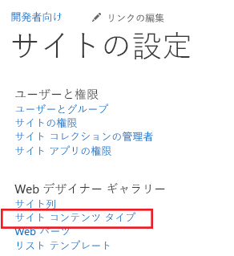
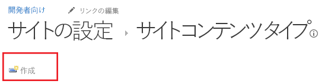
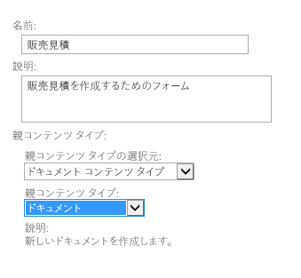
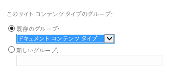
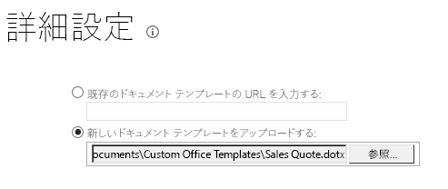
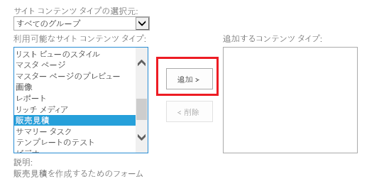

# クラウド ビジネス アドインのドキュメント ライブラリのテンプレートを提供する
SharePoint ドキュメント ライブラリにドキュメントを追加するときに使用できる Office テンプレートに加えて、独自のテンプレートを準備できます。例えば、新しい受注があったときに使用する、独自の販売見積もりテンプレートを作成できます。
## 

まだドキュメント ライブラリをクラウド ビジネス アドインに関連付けていない場合、関連付けてください。「 [ドキュメント ライブラリをエンティティに関連付ける](associate-a-document-library-with-an-entity.md)」を参照してください。

### テンプレートを追加するには

1. SharePoint 開発者向けサイトにアクセスして、[ **開発者**] ページで、[ **サイト コンテンツ**] を選択します。

2. 図 1 に示されているように、[ **サイト コンテンツ**] ページで、[ **設定**] をクリックします。

   **図 1. [設定] リンク**

3. 図 2 に示されているように、[ **サイトの設定**] ページの [ **Web デザイナー ギャラリー**] 一覧で、[ **サイト コンテンツ タイプ**] をクリックします。

   **図 2. [サイト コンテンツ タイプ] リンク**

4. 図 3 に示されているように、、[ **サイト コンテンツ タイプ**] ページで、[ **作成**] をクリックします。

   **図 3. [作成] リンク**

5. [ **新しいサイト コンテンツ タイプ**] ページで、テンプレートの名前と説明を入力します。図 4 に示されているように、[ **親コンテンツ タイプ**] には、[ **ドキュメント コンテンツ タイプ**] および [ **ドキュメント**] を選択します。

   **図 4. [親コンテンツ タイプ] の選択肢**

6. 図 5 に示されているように、[ **グループ**] セクションの [ **既存のグループ**] リストで、[ **ドキュメント コンテンツ タイプ**] を選択して、[ **OK**] をクリックします。

   **図 5. [グループ] の設定**

7. [ **サイト コンテンツ タイプ**] ページで、[ **詳細設定**] を選択します。

8. 図 6 に示されているように、[ **詳細設定**] ページで既存のドキュメント テンプレートの URL を入力するか、新しいドキュメント テンプレートをアップロードして、[ **OK**] をクリックします。

   **図 6. ドキュメント テンプレートの指定**

9. [ **サイト コンテンツ**] ページを開いてドキュメント ライブラリを選択して、[ **設定**] ページを開きます。

10. [ **設定**] ページで、[ **既存のサイト コンテンツ タイプから追加**] を選択します。

11. 図 7 に示されているように、[ **コンテンツ タイプの追加**] ページでテンプレートを追加して、[ **OK**] をクリックします。

   **図 7. テンプレートの追加**

12. アドインを実行してドキュメントを追加します。図 8 に示されているように、テンプレートが [ **新しいファイルの作成**] ダイアログ ボックスに表示されるはずです。

   **図 8. 新しいテンプレートが表示された [新しいファイルの作成] ダイアログ ボックス**

![[新しいファイルの作成] ダイアログと新しいテンプレート](images/CBA_IM_30.PNG)

## その他の技術情報

-  [クラウド ビジネス アドインを開発する](develop-cloud-business-add-ins.md)

-  [ドキュメント ライブラリをエンティティに関連付ける](associate-a-document-library-with-an-entity.md)

