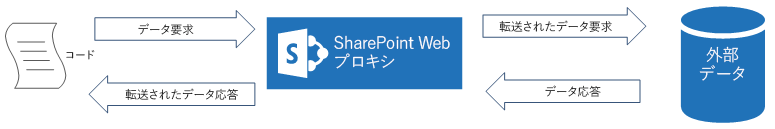
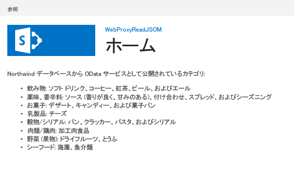

# SharePoint 2013 で Web プロキシを使用してリモート サービスのクエリを実行する
Web プロキシを使用して SharePoint 2013でホストされているページからリモート ドメイン上のデータにアクセスする方法について説明します。
SharePoint アドインを作成する場合、通常は、さまざまなソースのデータを組み込む必要があります。セキュリティ上の理由から、クロスドメイン通信を防止するブロック メカニズムが存在します。Web プロキシを使用すると、アドインに含まれる Web ページから、リモート ドメインおよび SharePoint ドメインのデータにアクセスできます。
  
    
    

開発者は、JavaScript や .NET クライアント オブジェクト モデルなど、クライアント API で公開されている Web プロキシを使用できます。Web プロキシを使用する場合は、SharePoint に最初の要求を発行します。そうすると、指定されたエンドポイントに対して SharePoint がデータを要求し、応答をページに転送します。サーバー レベルで通信を行う場合は、Web プロキシを使用します。詳細については、「 [SharePoint アドインのセキュリティで保護されたデータ アクセスとクライアント オブジェクト モデル](secure-data-access-and-client-object-models-for-sharepoint-add-ins.md)」を参照してください。
**SharePoint Web プロキシは、コードと外部データ ソース間の中間である**

  
    
    

  
    
    

  
    
    

  
    
    

  
    
    

## この記事で示されている例を使用するための前提条件
<a name="SP15Queryremoteservice_Prereq"> </a>

この例の手順を実行するには、以下が必要です。
  
    
    

-  [Visual Studio 2015 と最新の Microsoft Office Developer Tools](https://www.visualstudio.com/features/office-tools-vs.aspx)
    
  
- SharePoint 2013 開発環境 (オンプレミスのシナリオでは、アドインの分離が必要)
    
  

### Web プロキシを使用する前に理解しておくべき主要概念

以下の表では、SharePoint アドインにおけるクロスドメイン シナリオに関連する概念を理解するのに役立つ記事をいくつか示しています。
  
    
    

**表 1. Web プロキシの主要概念**


|**記事のタイトル**|**説明**|
|:-----|:-----|
| [SharePoint アドイン](sharepoint-add-ins.md) <br/> |エンド ユーザー向けの小さくて使いやすいソリューションであるアドインを作成できる、SharePoint 2013 の新しいアドイン モデルについて説明しています。  <br/> |
| [SharePoint アドインのセキュリティで保護されたデータ アクセスとクライアント オブジェクト モデル](secure-data-access-and-client-object-models-for-sharepoint-add-ins.md) <br/> |SharePoint アドインにおけるデータ アクセス オプションについて説明しています。この記事では、アドインでデータを操作する際に選択する必要がある代替手段の概要についてのガイダンスを示しています。  <br/> |
| [SharePoint 2013 のホスト Web、アドイン Web、および SharePoint コンポーネント](host-webs-add-in-webs-and-sharepoint-components-in-sharepoint-2013.md) <br/> |ホスト Web とアドイン Web の違いについて説明しています。SharePoint アドイン に含めることができる SharePoint 2013 コンポーネント、ホスト Web に展開されるコンポーネント、アドイン Web に展開されるコンポーネント、および分離ドメインでのアドイン Web の展開方法を示しています。  <br/> |
| [Client-side Cross-domain Security](http://msdn.microsoft.com/ja-jp/library/cc709423%28VS.85%29.aspx) <br/> |クロスドメインにおける脅威とユース ケース、クロスオリジン要求でのセキュリティ原則を示し、開発者がブラウザーで動作する Web アプリケーションからのクロスドメイン アクセスを拡張する場合のリスクについて詳しく説明しています。  <br/> |
   

## コード例: Web プロキシを使用したリモート サービス上のデータへのアクセス
<a name="SP15Queryremoteservice_Codeexample"> </a>

リモート サービスからデータを読み取るには、以下を実行する必要があります。
  
    
    

1. SharePoint アドイン プロジェクトを作成します。
    
  
2. Web プロキシを使用してリモート サービスにクエリを実行するように **Default.aspx** ページを変更します。
    
  
3. リモート ドメインとの通信を許可するようにアドイン マニフェストを変更します。
    
  
図 1 は、SharePoint Web ページにリモート サービスからのデータが表示されたブラウザー ウィンドウを示しています。
  
    
    

**図 1. リモート サービスからのデータが表示された SharePoint Web ページ**

  
    
    

  
    
    

  
    
    

### SharePoint アドイン プロジェクトを作成するには


1. 管理者として 2015 を開きます。(これを行うには、 **[スタート]** メニューの [2015] アイコンを右クリックし、 **[管理者として実行]** を選択します)。
    
  
2. **SharePoint アドイン** テンプレートを使用して、新しいプロジェクトを作成する
    
    図 2 は、 **[Office アドイン]**、 **[Office/SharePoint]**、 **[Visual C#]**、 **[テンプレート]** の下の 2015 の **SharePoint アドイン** テンプレートの場所を示しています。
    

   **図 2. SharePoint アドイン Visual Studio テンプレート**

  

!\[SharePoint 2013 用アプリの Visual Studio テンプレート](images/AppForSharePointVSTemplate.PNG)
  

  

  
3. デバッグに使用する SharePoint Web サイトの URL を入力します。
    
  
4. アドインのホスティング オプションとして、[ **SharePoint ホスト型**] を選択します。
    
  

### JavaScript オブジェクト モデルを使用して、Web プロキシを使用するように Default.aspx ページを変更するには


1. [ **ページ**] フォルダー内の [ **Default.aspx**] ページをダブルクリックします。
    
  
2. 以下のマークアップをコピーし、ページの **PlaceHolderMain** コンテンツ タグに貼り付けます。このマークアップは、次のタスクを実行します。
    
  - リモート データのプレースホルダーを提供する。
    
  
  - SharePoint JavaScript ファイルを参照する。
    
  
  - **WebRequestInfo** オブジェクトを使用した要求を準備する。
    
  
  - JavaScript Object Notation (JSON) 形式の応答を指定する **Accept** 要求ヘッダーを準備する。
    
  
  - リモート エンドポイントに対する呼び出しを発行する。
    
  
  - 成功した実行を処理し、SharePoint Web ページにリモート データを表示する。
    
  
  - エラーを処理し、SharePoint Web ページにエラー メッセージを表示する。
    
  

 ```
  
Categories from the Northwind database exposed as an OData service:
    
<!-- Placeholder for the remote content -->
<span id="categories"></span>

<!-- Add references to the JavaScript libraries. -->
<script 
    type="text/javascript" 
    src="../_layouts/15/SP.Runtime.js">
</script>
<script 
    type="text/javascript" 
    src="../_layouts/15/SP.js">
</script>
<script type="text/javascript">
(function () {
    "use strict";

    // Prepare the request to an OData source
    // using the GET verb.
    var context = SP.ClientContext.get_current();
    var request = new SP.WebRequestInfo();
    request.set_url(
        "http://services.odata.org/Northwind/Northwind.svc/Categories"
        );
    request.set_method("GET");

    // We need the response formatted as JSON.
    request.set_headers({ "Accept": "application/json;odata=verbose" });
    var response = SP.WebProxy.invoke(context, request);

    // Let users know that there is some
    // processing going on.
    document.getElementById("categories").innerHTML =
                "<P>Loading categories...</P>";

    // Set the event handlers and invoke the request.
    context.executeQueryAsync(successHandler, errorHandler);

    // Event handler for the success event.
    // Get the totalResults node in the response.
    // Render the value in the placeholder.
    function successHandler() {

        // Check for status code == 200
        // Some other status codes, such as 302 redirect
        // do not trigger the errorHandler. 
        if (response.get_statusCode() == 200) {
            var categories;
            var output;

            // Load the OData source from the response.
            categories = JSON.parse(response.get_body());

            // Extract the CategoryName and Description
            // from each result in the response.
            // Build the output as a list.
            output = "<UL>";
            for (var i = 0; i < categories.d.results.length; i++) {
                var categoryName;
                var description;
                categoryName = categories.d.results[i].CategoryName;
                description = categories.d.results[i].Description;
                output += "<LI>" + categoryName + ":&amp;nbsp;" +
                    description + "</LI>";
            }
            output += "</UL>";

            document.getElementById("categories").innerHTML = output;
        }
        else {
            var errordesc;

            errordesc = "<P>Status code: " +
                response.get_statusCode() + "<br/>";
            errordesc += response.get_body();
            document.getElementById("categories").innerHTML = errordesc;
        }
    }

    // Event handler for the error event.
    // Render the response body in the placeholder.
    // The body includes the error message.
    function errorHandler() {
        document.getElementById("categories").innerHTML =
            response.get_body();
    }
})();
</script>
 ```


### (オプション) REST エンドポイントを使用して、Web プロキシを使用するように Default.aspx ページを変更するには


1. [ **ページ**] フォルダー内の [ **Default.aspx**] ページをダブルクリックします。
    
  
2. 以下のマークアップをコピーし、ページの **PlaceHolderMain** コンテンツ タグに貼り付けます。このマークアップは、次のタスクを実行します。
    
  - リモート データのプレースホルダーを提供する。
    
  
  - jQuery ライブラリを参照する。
    
  
  - **SP.WebRequest.Invoke** エンドポイントに対する要求を準備する。
    
  
  - **SP.WebrequestInfo** オブジェクトを使用した要求の本文を準備する。オブジェクトには、JavaScript Object Notation (JSON) 形式の応答を指定する **Accept** ヘッダーが含まれます。
    
  
  - リモート エンドポイントに対する呼び出しを発行する。
    
  
  - 成功した実行を処理し、SharePoint Web ページにリモート データを表示する。
    
  
  - エラーを処理し、SharePoint Web ページにエラー メッセージを表示する。
    
  

 ```
  
Categories from the Northwind database exposed as an OData service:
    
<!-- Placeholder for the remote content -->
<span id="categories"></span>

<script 
    type="text/javascript" 
    src="//ajax.aspnetcdn.com/ajax/jQuery/jquery-1.8.0.min.js">
</script>

<script type="text/javascript">
(function () {
    "use strict";

    // The Northwind categories endpoint.
    var url =
        "http://services.odata.org/Northwind/Northwind.svc/Categories";

    // Let users know that there is some
    // processing going on.
    document.getElementById("categories").innerHTML =
                "<P>Loading categories...</P>";

    // Issue a POST request to the SP.WebProxy.Invoke endpoint.
    // The body has the information to issue a GET request
    // to the Northwind service.
    $.ajax({
        url: "../_api/SP.WebProxy.invoke",
        type: "POST",
        data: JSON.stringify(
            {
                "requestInfo": {
                    "__metadata": { "type": "SP.WebRequestInfo" },
                    "Url": url,
                    "Method": "GET",
                    "Headers": {
                        "results": [{
                            "__metadata": { "type": "SP.KeyValue" },
                            "Key": "Accept",
                            "Value": "application/json;odata=verbose",
                            "ValueType": "Edm.String"
                        }]
                    }
                }
            }),
        headers: {
            "Accept": "application/json;odata=verbose",
            "Content-Type": "application/json;odata=verbose",
            "X-RequestDigest": $("#__REQUESTDIGEST").val()
        },
        success: successHandler,
        error: errorHandler
    });

    // Event handler for the success event.
    // Get the totalResults node in the response.
    // Render the value in the placeholder.
    function successHandler(data) {
        // Check for status code == 200
        // Some other status codes, such as 302 redirect,
        // do not trigger the errorHandler. 
        if (data.d.Invoke.StatusCode == 200) {
            var categories;
            var output;

            // Load the OData source from the response.
            categories = JSON.parse(data.d.Invoke.Body);

            // Extract the CategoryName and Description
            // from each result in the response.
            // Build the output as a list
            output = "<UL>";
            for (var i = 0; i < categories.d.results.length; i++) {
                var categoryName;
                var description;
                categoryName = categories.d.results[i].CategoryName;
                description = categories.d.results[i].Description;
                output += "<LI>" + categoryName + ":&amp;nbsp;" +
                    description + "</LI>";
            }
            output += "</UL>";

            document.getElementById("categories").innerHTML = output;
        }
        else {
            var errordesc;

            errordesc = "<P>Status code: " +
                data.d.Invoke.StatusCode + "<br/>";
            errordesc += response.get_body();
            document.getElementById("categories").innerHTML = errordesc;
        }
    }

    // Event handler for the error event.
    // Render the response body in the placeholder.
    // The 2nd argument includes the error message.
    function errorHandler() {
        document.getElementById("categories").innerHTML =
            arguments[2];
    }
})();
</script>

 ```


### アドイン マニフェスト ファイルを編集するには


1. **ソリューション エクスプローラー**で、 **AppManifest.xml** ファイルのショートカット メニューを開き、[ **コードの表示**] を選択します。
    
  
2. 以下の **RemoteEndPoints** 定義を **App** ノードの子としてコピーします。
    
 ```XML
  
<RemoteEndpoints>
    <RemoteEndpoint Url=" http://services.odata.org" />
</RemoteEndpoints>
 ```


    **RemoteEndpoint** 要素は、リモート ドメインを指定するために使用されます。Web プロキシによって、リモート ドメインに対して発行された要求がアドイン マニフェストで宣言されていることが検証されます。 **RemoteEndpoints** 要素では、最大 20 のエントリを作成できます。権限に関する部分のみが考慮されます。 `http://domain:port` と `http://domain:port/website` は同じエンドポイントと見なされます。1 つの **RemoteEndpoint** 定義だけで、同じドメイン内のさまざまなエンドポイントに対し呼び出しを発行できます。
    
  

### ソリューションをビルドして実行するには


1. F5 キーを押します。
    
    > **メモ**
      > F5 キーを押すと、Visual Studio によってソリューションが構築され、アドインが展開され、アドインのアクセス許可ページが表示されます。 
2. [ **信頼する**] ボタンを選択します。
    
  
3. [サイト コンテンツ] ページでアドインのアイコンをクリックします。
    
    図 3 は、SharePoint Web ページで表示されたリモート データを示しています。
    

   **図 3. SharePoint Web ページで表示されたリモート データ**

  

!\[リモート サービスからのデータを含む SharePoint ページ](images/WebProxy_result.png)
  

  

  

**表 2. ソリューションのトラブルシューティング**


|**問題**|**解決策**|
|:-----|:-----|
|Visual Studio で F5 キーを押してもブラウザーが開かない。  <br/> |SharePoint アドイン プロジェクトをスタートアップ プロジェクトとして設定してください。  <br/> |
|スキーマとポートの組み合わせがサポートされない。  <br/> |呼び出しのスキーマとポートの組み合わせは、以下の条件に当てはまっている必要があります。  <br/> |**スキーマ**|**ポート**|
|:-----|:-----|
|http  <br/> | 80 <br/> |
|https  <br/> |443  <br/> |
|http または https  <br/> |7000 ～ 10000  <br/> |
   

> **重要**
> 送信ポートは、ホスト ファイアウォールの可用性に依存しています。具体的には、SharePoint Onlineでは http-80 および https-443 だけが使用可能です。 
  
    
    

|
|未処理の例外 " **SP は未定義です。** " <br/> |ブラウザー ウィンドウで SP.RequestExecutor.js ファイルにアクセスできることを確認してください。  <br/> ローカル サーバーを開発環境として使用している場合は、IIS のループバック チェックを無効にする必要があります。Windows PowerShell コマンド プロンプトから以下のコマンドを実行してください。  <br/>```New-ItemProperty HKLM:\\System\\CurrentControlSet\\Control\\Lsa -Name "DisableLoopbackCheck" -value "1" -PropertyType dword```> **注意**> 運用環境では、IIS のループバック チェックを無効にすることはお勧めしません。           |
|リモート エンドポイントからの応答のサイズが、構成された制限を超えています。  <br/> |Web プロキシ要求の応答のサイズは 200 KB 未満でなければなりません。  <br/> |
   

## 次の手順
<a name="SP15Queryremoteservice_Next"> </a>

この記事では、SharePoint Web ページからリモート サービスのデータを読み取る方法について説明しました。次の手順では、SharePoint アドインで利用可能なその他のデータ アクセス オプションについて学ぶことができます。詳細については、以下を参照してください。
  
    
    

-  [Code sample: Get data from a remote service using the web proxy](http://code.msdn.microsoft.com/SharePoint-2013-Get-data-705bdcd5)
    
  
-  [SharePoint 2013 のクロスドメイン ライブラリのカスタム プロキシ ページを作成する](create-a-custom-proxy-page-for-the-cross-domain-library-in-sharepoint-2013.md)
    
  
-  [クロスドメイン ライブラリを使用してアドインから SharePoint 2013 のデータにアクセスする](access-sharepoint-2013-data-from-add-ins-using-the-cross-domain-library.md)
    
  
-  [方法: SharePoint 2013 で REST を使用して外部データにアクセスする](http://msdn.microsoft.com/library/0663cc8c-a736-434d-9858-6ce12ce7f748%28Office.15%29.aspx)
    
  

## その他の技術情報
<a name="SP15Queryremoteservice_Addresources"> </a>


-  [SharePoint アドインのオンプレミスの開発環境をセットアップする](set-up-an-on-premises-development-environment-for-sharepoint-add-ins.md)
    
  
-  [SharePoint 2013 の外部データの操作](work-with-external-data-in-sharepoint-2013.md)
    
  
-  [SharePoint アドインのセキュリティで保護されたデータ アクセスとクライアント オブジェクト モデル](secure-data-access-and-client-object-models-for-sharepoint-add-ins.md)
    
  
-  [SharePoint アドインの承認と認証](authorization-and-authentication-of-sharepoint-add-ins.md)
    
  
-  [SharePoint REST 要求で OData クエリ操作を使用する](use-odata-query-operations-in-sharepoint-rest-requests.md)
    
  
-  [SharePoint アドインの設計オプションを考慮するときの 3 つの方法](three-ways-to-think-about-design-options-for-sharepoint-add-ins.md)
    
  
-  [SharePoint アドインのアーキテクチャおよび開発環境に関する重要な要素](important-aspects-of-the-sharepoint-add-in-architecture-and-development-landscap.md)
    
  
-  [SharePoint アドインのデータ ストレージ](important-aspects-of-the-sharepoint-add-in-architecture-and-development-landscap.md#Data)
    
  
