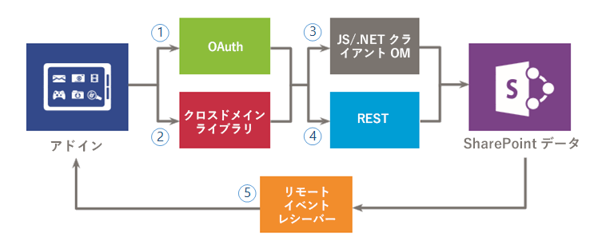
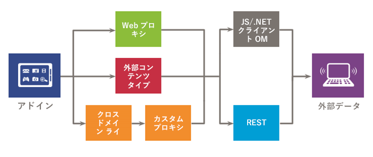

# SharePoint アドインのセキュリティで保護されたデータ アクセスとクライアント オブジェクト モデル
SharePoint アドインを作成する場合のデータ アクセス オプション (SharePoint および外部システムにあるデータにアクセスするための接続オプションなど) と、アドインからデータにアクセスする場合に使用できる API について説明します。
SharePoint アドインのデータ アクセス オプションを評価する際は、アドインの環境を評価し、クライアントとサーバー間の通信、必要なタスクをアドインが実行するために必要なアクセス許可レベルなどのいくつかの要素を考慮する必要があります。また、SharePoint アドイン用のモデルで使用可能な API についても評価する必要があります。

## SharePoint アドイン におけるデータの概要

データをクエリ、格納、または操作する必要がない SharePoint アドイン (その点では任意のアドイン) を想像するのは困難です。アドインでは、ドキュメント ライブラリ内およびリスト内のアイテム、メタデータ、ユーザー プロファイルなどの SharePoint データを取得して操作する必要が生じることがよくあります。同様に、アドイン内の外部データにアクセスする必要があるシナリオが発生する場合もあります。SharePoint アドイン用のモデルでは、SharePoint と外部システムに存在するデータとサービスにアクセスするための、複数の接続オプションと豊富な API セットが用意されています。

アドインを設計し、データ アクセスの計画を立てる際には、次の 2 つの重要な決定をする必要があります。

1. どの接続オプションを使用すべきか。

2. 必要なデータへのアクセスにどの API を使用すべきか。

以下の図では、SharePoint アドイン用のモデル で提供されているさまざまなオプションをまとめています。以降のセクションで、各オプションの詳細と、どのような場合にそれらを使用するかを示します。

図 1 は、アドインから SharePoint データにアクセスする場合のオプションを示しています。これらのシナリオに取り組んでいる場合は、SharePoint に対する認証と通信に、(1) OAuth、(2) クロスドメイン ライブラリのどちらを使用するかを決定する必要があります。次に、データ アクセス API について、(3) クライアント オブジェクト モデル (JavaScript/.NET クライアント オブジェクト モデル)か (4) Representational State Transfer (REST) かを決定する必要があります。

(5)  *リモート イベント レシーバー*  を使用して特定のデータにアクセスすることもできますが、リモート イベント レシーバーの主なシナリオはリモートのコードの実行であることにご注意ください。

**図 1. アドインで SharePoint データを使用するオプション**

図 2 は、アドイン上の外部データにアクセスする場合のオプションを示しています。これらのシナリオに取り組んでいる場合、外部サービスまたはシステムを認証して通信するには、(1) Web プロキシ、(2) 外部コンテンツ タイプ、または (3) クロスドメイン ライブラリとカスタム プロキシ ページのうち使用するものを決定する必要があります。(4) クライアント オブジェクト モデル (JavaScript/.NET クライアント オブジェクト モデル) または (5)Representational State Transfer (REST) も使用できます。

**図 2. アドインで外部データを使用する場合のオプション**

## SharePoint アドインのデータ接続オプション

アドインでデータを操作する際は、いくつかの側面を考慮する必要があります。たとえば、データでどのルートが使用されるか、サーバーを経由するか、クライアントを経由するか、ログオン ユーザーとして認証しても問題ないのか、アドインには昇格された権限が必要か、を考慮する必要があります。以降のセクションでは、生じる可能性のあるこのような疑問点について説明します。

### SharePoint データの場合の接続

SharePoint データにアクセスする場合、以下の接続オプションを使用できます (図 1 をご覧ください)。

- **OAuth:** 単純かつ標準的な方法で安全な承認を可能にするオープン プロトコルです。ユーザーは OAuth を使用することで、ユーザー名とパスワードを共有することなく、アプリケーションがユーザーの代わりに機能することを承認できます。OAuth はサーバー側コードと組み合わせて使用できます。これは、インタラクティブではないプロセスを実行する必要がある場合、またはログオン ユーザーの権限よりも上のレベルに権限を昇格する必要がある場合に適したオプションです。OAuth の詳細については、「 [SharePoint アドインの承認と認証](authorization-and-authentication-of-sharepoint-add-ins.md)」を参照してください。

- **クロスドメイン ライブラリ:** リモート アドイン内で参照できる、SharePoint Web サイトでホストされている JavaScript ファイル ( **SP.RequestExecutor.js** ) 形式のクライアント側代替手段です。クロスドメイン ライブラリを使用することで、プロキシを介してリモート アドイン ページ内の複数のドメインとやり取りできます。これは、サーバーではなくクライアントでアドイン コードを実行する場合、または SharePoint とリモート インフラストラクチャの間にファイアウォールなどの接続の障害物がある場合に適したオプションです。詳細については、「 [クロスドメイン ライブラリを使用してアドインから SharePoint 2013 のデータにアクセスする](access-sharepoint-2013-data-from-add-ins-using-the-cross-domain-library.md)」をご覧ください。

- **リモート イベント レシーバー:** リモート イベント レシーバーを使用すると、アドイン内のアイテム (リスト、リスト アイテム、Web など) に対して発生するイベントを処理できます。これらのイベントは、従来の SharePoint ソリューションで発生するイベントに似ていますが、SharePoint アドイン のリモート コンポーネントで処理できる点が異なります。リモート イベント レシーバーはアイテムの一部のプロパティを利用できます。詳細については、「 [SharePoint アドインでリモート イベント レシーバーを作成する](create-a-remote-event-receiver-in-sharepoint-add-ins.md).」をご覧ください。同様に、アドインのイベント レシーバーを使用して、アドインのインストール、更新、およびアンインストールの方法をカスタマイズできます。詳細については、「 [SharePoint アドインでアドイン イベント レシーバーを作成する](create-an-add-in-event-receiver-in-sharepoint-add-ins.md)」をご覧ください。

### SharePoint データの場合、どの接続オプションを使用するべきか

以下の表は、アドインの作成中に発生する可能性のある一般的な要件とシナリオを示しています。列内の **○** は、各ケースで使用できるオプションを示しています。

**表 1. SharePoint データの場合の接続オプション**

|**要件/シナリオ**|**OAuth**|**クロスドメイン ライブラリ**|
|:-----|:-----|:-----|
|クライアント側テクノロジー (HTML + JavaScript) を使用する。    ||x    |
|REST インターフェイスを使用する。    |x    |x    |
|SharePoint とリモート アドインの間にファイアウォールがあり、ブラウザーを介して呼び出しを発行する必要がある。    ||x    |
|アドインでログオン ユーザーとしてリソースにアクセスする必要がある。    |x    |x    |
|アドインで現在のログオン ユーザーの権限レベルとは異なるレベルに権限を昇格する必要がある。    |x    ||
|ログオン ユーザーとは異なるユーザーの代わりにアドインが機能する必要がある。    |x    ||
|ユーザーがログオンしている間だけアドインが処理を実行する必要がある。    |x    |x    |
|ユーザーがログオンしていなくてもアドインが処理を実行する必要がある。    |x    ||
|リモート コードを SharePoint のイベントに対する応答としてアドインが実行する必要がある。    |||
 
リモート イベント レシーバーは OAuth の上に構築されているため、この表での比較によって使用するか否かを決定するのは最適な方法ではありません。リモート イベント レシーバーは、データ変換のほかにリモート コードを実行する必要がある場合に使用します。

### 外部データの場合の接続

外部データにアクセスする場合は、以下の接続オプションを使用できます (図 2 をご覧ください)。

- **Web プロキシ:** 開発者は、JSOM などのクライアント API で公開されている Web プロキシを使用できます。Web プロキシを使用する場合は、SharePoint に最初の要求を発行します。そうすると、指定されたエンドポイントに対して SharePoint がデータを要求し、応答をページに転送します。サーバー レベルで通信を行う場合は、Web プロキシを使用します。Web プロキシは認証を必要としない非構造化データへのアクセスを目的として設計されています。詳しくは、「 [SharePoint 2013 で Web プロキシを使用してリモート サービスのクエリを実行する](query-a-remote-service-using-the-web-proxy-in-sharepoint-2013.md)」をご覧ください。

- **外部コンテンツ タイプ:** テナント管理者の手をわずらわせることなく、SAP、Netflix からの外部データ、および独自仕様のその他の種類のデータにアクセスするアドインを作成できます。外部アプリケーションへのアクセスは、他の SharePoint アプリケーションで使用可能である、一貫性があり統一されたインターフェイスを提供する Business Connectivity Services (BCS) を介して管理されます。アプリを対象範囲とする ECT は、BCS モデルを使用していて、データへのアクセスに認証が必要な際の適切なオプションです。詳しくは、「 [アドイン スコープの外部コンテンツ タイプ (SharePoint 2013)](http://msdn.microsoft.com/library/a34cbbba-dc38-4d3d-b796-d54b5848bdfb%28Office.15%29.aspx)」をご覧ください。

- **クロスドメイン ライブラリ用のカスタム プロキシ ページ:** リモート アドイン インフラストラクチャでホストされるカスタム プロキシ ページを提供すると、クロスドメイン ライブラリを使用してリモート アドイン上のデータにアクセスできます。開発者は、カスタム プロキシ ページを実装する責任を負い、リモート アドインに対する認証メカニズムなどのカスタム ロジックを提供する必要があります。クライアント レベルで通信を行う場合は、クロスドメイン ライブラリとカスタム プロキシ ページを使用します。詳細については、「 [SharePoint 2013 のクロスドメイン ライブラリのカスタム プロキシ ページを作成する](create-a-custom-proxy-page-for-the-cross-domain-library-in-sharepoint-2013.md)」をご覧ください。

### 外部データの場合、どの接続オプションを使用するべきか

以下の表は、アドインの作成中に発生する可能性のある一般的な要件とシナリオを示しています。列内の **○** は、各ケースで使用できるオプションを示しています。

**表 2. 外部データの場合の接続オプション**

|**要件/シナリオ**|**Web プロキシ**|**外部コンテンツ タイプ**|**クロスドメイン ライブラリとカスタム プロキシ ページ**|
|:-----|:-----|:-----|:-----|
|クライアント側テクノロジー (HTML + JavaScript) を使用する。    |x    |x    |x    |
|リモート アドインまたはサービスにページまたはコンポーネントを追加できない。    |x    |x    ||
|REST インターフェイスを使用する。    |x    |x    |x    |
|JavaScript CSOM を使用する。    |x    |x    |x    |
|.NET CSOM を使用する。    |x    |x    ||
|SharePoint インフラストラクチャとアドインとの間に直接接続がない。ブラウザーを介して呼び出しを発行する必要がある。    ||x    |x    |
|アドインでログオン ユーザーとしてリソースにアクセスする必要がある。    |x    |x    |x    |
 

## SharePoint アドインで使用可能なデータ アクセス API

アドインから SharePoint データにアクセスする場合、以下の API を使用できます。

- **Representational State Transfer (REST):** JavaScript を使用せず, .NET Framework プラットフォーム上に構築されていないクライアント環境から SharePoint エンティティにアクセスする必要があるシナリオでは、SharePoint は、 [Open Data (OData) protocol](http://www.odata.org/)を使用して SharePoint データに対して CRUDQ (作成、読み取り、更新、削除、クエリ) 操作を実行する REST Web サービスの実装を提供します。さらに、クライアント オブジェクト モデルのほとんどすべての API には、対応する REST エンドポイントがあります。これにより、ユーザーのコードは、標準の REST 機能をサポートする技術を使用することで SharePoint と直接やり取りできます。SharePoint に組み込まれている REST 機能を使用するには、目的の SharePoint オブジェクトに対応するエンドポイントに対しての REST 対応の HTTP 要求をコードに記述して作成します。REST サービスは HTTP 要求を処理し、Atom 形式か JavaScript Object Notation (JSON) 形式で応答をします。SharePoint における REST の詳細については、「 [SharePoint REST 要求で OData クエリ操作を使用する](use-odata-query-operations-in-sharepoint-rest-requests.md)」をご覧ください。

- **.NET Framework クライアント オブジェクト モデル (.NET クライアント OM):** サーバー側オブジェクト モデルの主要なサイトやリストのほとんどすべてのクラスには, .NET Framework クライアント オブジェクト モデルに該当するクラスがあります。さらに, .NET Framework クライアント オブジェクト モデルでは、ECM、分類、ユーザー プロファイル、詳細検索、分析、BCS などの SharePoint レベルの機能を拡張するための API のフル セットも公開されています。クライアント側オブジェクト モデルの詳細については、「 [SharePoint 2013 での適切な API セットの選択](http://msdn.microsoft.com/library/f36645da-77c5-47f1-a2ca-13d4b62b320d%28Office.15%29.aspx)」をご覧ください。

- **JavaScript クライアント オブジェクト モデル (JSOM):** SharePoint は、インライン スクリプトや別途作成した .js ファイルで使用するための JavaScript オブジェクト モデルを提供します。このモデルには, .NET Framework クライアント オブジェクト モデルと同じ機能がすべて含まれます。カスタム サーバー側コードを使用できない SharePoint ホスト型アドイン では特に、JSOM は、アドインにカスタム SharePoint コードを追加するための有用な方法になります。また、Web 開発者は、既存の JavaScript のスキルを使用し、あまり学習に時間をかけずに SharePoint アドイン を作成できます。クライアント側オブジェクト モデルの詳細については、「 [SharePoint 2013 での適切な API セットの選択](http://msdn.microsoft.com/library/f36645da-77c5-47f1-a2ca-13d4b62b320d%28Office.15%29.aspx)」をご覧ください。

外部データへのアクセス時に SharePoint アドインで使用できる API は他にも存在し、それは外部サービスおよびシステムで提供するインターフェイスに依存します。設計時には、これらのインターフェイスについても考慮する必要があります。

## その他の技術情報

-  [SharePoint アドインの承認と認証](authorization-and-authentication-of-sharepoint-add-ins.md)

-  [クロスドメイン ライブラリを使用してアドインから SharePoint 2013 のデータにアクセスする](access-sharepoint-2013-data-from-add-ins-using-the-cross-domain-library.md)

-  [SharePoint 2013 のクロスドメイン ライブラリのカスタム プロキシ ページを作成する](create-a-custom-proxy-page-for-the-cross-domain-library-in-sharepoint-2013.md)

-  [SharePoint 2013 で Web プロキシを使用してリモート サービスのクエリを実行する](query-a-remote-service-using-the-web-proxy-in-sharepoint-2013.md)

-  [SharePoint アドインでリモート イベント レシーバーを作成する](create-a-remote-event-receiver-in-sharepoint-add-ins.md)

-  [SharePoint 2013 での適切な API セットの選択](http://msdn.microsoft.com/library/f36645da-77c5-47f1-a2ca-13d4b62b320d%28Office.15%29.aspx)

-  [SharePoint REST 要求で OData クエリ操作を使用する](use-odata-query-operations-in-sharepoint-rest-requests.md)

