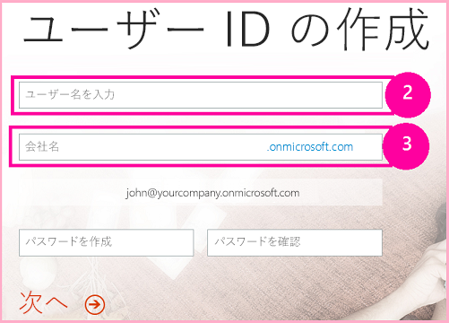

# Office 365 で SharePoint アドインの開発環境をセットアップする
Office 365 開発者向けサイトで SharePoint アドインの開発環境をセットアップします。
この記事に記されている手順を実行する前に、「 [SharePoint アドインを開発するためのツールと環境](tools-and-environments-for-developing-sharepoint-add-ins.md)」をご覧になり、選択肢を理解してください。作成する SharePoint アドインの種類が不確かな場合には、「 [SharePoint アドイン](sharepoint-add-ins.md)」を参照してください。
  
    
    

## コンピューターへの Visual Studio とツールのインストール

- **Visual Studio** 2013 以降がまだインストールされていない場合、「 [Install Visual Studio](http://msdn.microsoft.com/library/da049020-cfda-40d7-8ff4-7492772b620f.aspx)」に記載されている説明に従ってインストールしてください。 [ Microsoft ダウンロード センターの最新バージョン](https://www.visualstudio.com/downloads/download-visual-studio-vs)を使用することをお勧めします。
    
  
- Visual Studio には **Microsoft Office Developer Tools for Visual Studio** が含まれていますが、そのツールの最新バージョンが Visual Studio 更新プログラムより後にリリースされている場合があります。このツールの最新バージョンを確実に使用するため、 [Office Developer Tools for Visual Studio 2013 用インストーラー](http://aka.ms/OfficeDevToolsForVS2013)または  [Office Developer Tools for Visual Studio 2015 用インストーラー](http://aka.ms/OfficeDevToolsForVS2015)を実行してください。 
    
  

### Visual Studio の詳細ログ

詳細ログを有効にする場合、次の手順を実行してください。
  
    
    

1. レジストリを開き、 **HKEY_CURRENT_USER\\Software\\Microsoft\\VisualStudio\\ _nn.n_\\SharePointTools** に移動します。 _nn.n_ は Visual Studio のバージョン (12.0、14.0 など) です。
    
  
2. **EnableDiagnostics** という DWORD キーを追加します。
    
  
3. キーの値を **1** にします。
    
  
レジストリ パスは、今後のバージョンの Visual Studio では変更される予定です。
  
    
    

## Office 365 開発者向けサイト へのサインアップ

> **メモ**
>  Office 365 開発者向けサイトに対するアクセス権が既にある場合もあります。> **MSDN サブスクライバーですか?** Visual Studio Enterprise の MSDN サブクスライバーはその特典として Office 365 Developer のサブスクリプションを受けられます。 [すぐに特典をお受け取りください。](https://msdn.microsoft.com/subscriptions/manage/default.aspx)> **次のいずれかの Office 365 サブスクリプション プランをお持ちですか?**> **お持ちの場合、Office 365 サブスクリプションの管理者は  [Office 365 管理センター](https://portal.microsoftonline.com/admin/default.aspx)を使用して 開発者向けサイト** を作成できます。詳しくは、「 [既存の Office 365 サブスクリプション内で開発者向けサイトを作成する](create-a-developer-site-on-an-existing-office-365-subscription.md)」をご覧ください。 
  
    
    

Office 365 プランを取得するには、次の 3 つの方法があります。 
  
    
    

- Office 365 開発者向けプログラムを通じて、1 年間の無料 Office 365 開発者アカウントにサインアップします。 [詳細を確認する](http://dev.office.com/devprogram)か、そのまま [サインアップ フォーム](https://profile.microsoft.com/RegSysProfileCenter/wizardnp.aspx?wizid=14b845d0-938c-45af-b061-f798fbb4d170)に進みます。開発者向けプログラムにサインアップすると、開発者アカウントにサインアップするためのリンクが記載された電子メールが送信されます。次の手順に従ってください。
    
  
-  [無料の 30 日間の試用版](https://portal.microsoftonline.com/Signup/MainSignUp.aspx?OfferId=6881A1CB-F4EB-4db3-9F18-388898DAF510&amp;DL=DEVELOPERPACK) を使用します。1 つのユーザー ライセンスが付属しています。
    
  
-  [Office 365 Developer のサブスクリプション](https://portal.microsoftonline.com/Signup/MainSignUp.aspx?OfferId=C69E7747-2566-4897-8CBA-B998ED3BAB88&amp;DL=DEVELOPERPACK)を購入します。 
    
  

> **ヒント**
> これらのリンクを別のウィンドウかタブで開いて、以下の手順をすぐに実行できるようにします。 
  
    
    

**図 1. Office 365 開発者向けサイトのドメイン名**

  
    
    

  
    
    

  
    
    

  
    
    

  
    
    

1. サインアップ フォームの最初のページ (図にはありません) は説明不要です。ただ、要求された個人情報を入力して、[ **次へ**] をクリックします。
    
  
2. 図 1 に示されている 2 ページ目では、サブスクリプション管理者のユーザー ID を指定します。
    
  
3. **.onmicrosoft.com** のサブドメインを作成します。
    
    サインアップ後にアカウントを管理するには、生成された資格情報 ( _UserID_@ _ドメイン_.onmicrosoft.com という形式) を使用して Office 365 ポータル サイトにサインインします。使用する SharePoint Online 開発者向けサイトは、 **http:// _ドメイン_.sharepoint.com** という新しいドメインでプロビジョニングされます。
    
  
4. [ **次へ**] を選択し、フォームの最終ページに記入します。確認コードを取得するために電話番号を提供することを選択した場合、携帯電話または固定回線の番号を指定できますが、VoIP (ボイス オーバー IP) 番号を指定することは *できません*  。
    
  

    
> **メモ**
> 開発者アカウントにサインアップする際に別の Microsoft アカウントでログオンすると、「入力したユーザー ID が正常に機能しませんでした。無効である可能性があります。組織によって割り当てられた ユーザー ID を入力していることを確認してください。通常、 *someone@example.com*  や *someone@example.onmicrosoft.com*  のような形式をしています」というメッセージが表示されることがあります。> このメッセージが表示される場合、使用した Microsoft アカウントをログアウトし、もう一度やり直してください。引き続きこのメッセージが表示される場合には、ブラウザーのキャッシュをクリアするか、[ **InPrivate ブラウズ**] に切り替えてから、フォームに記入してください。 
  
    
    

サインアップ プロセスが終了すると、ブラウザーで Office 365 インストール ページが開きます。[管理] アイコンを選択し、管理センター ページを開きます。
  
    
    

**図 2. Office 365 管理センター ページ**

  
    
    

  
    
    

  
    
    

  
    
    

1. 開発者向けサイトのプロビジョニングが完了するのを待機しなければなりません。プロビジョニングの完了後、ブラウザーで 管理センター ページを最新表示してください。
    
  
2. その後、ページの左上隅にある [ **アドインをビルド**] リンクをクリックし、開発者向けサイトを開きます。図 3 のようなサイトが表示されます。ページ上に、[ **テスト中アドイン**] という一覧が示されます。この一覧では、SharePoint の開発者用サイトのテンプレートを使用して作成された Web サイトが表示されます。通常のチーム サイトが表示される場合は、数分待ってからサイトを再び立ち上げます。
    
  
3. サイトの URL をメモに取ります。SharePoint アドイン プロジェクトを Visual Studio で作成する際にその URL を使用します。
    
  

**図 3. 開発者向けサイトのホーム ページと [テスト中アドイン] の一覧**

  
    
    

  
    
    

  
    
    

  
    
    

  
    
    

## その他の技術情報

-  [SharePoint アドイン](sharepoint-add-ins.md)
    
  
-  [プロバイダー ホスト型 SharePoint アドインの作成を始める](get-started-creating-provider-hosted-sharepoint-add-ins.md)
    
  
-  [SharePoint ホスト型の SharePoint アドインの作成を始める](get-started-creating-sharepoint-hosted-sharepoint-add-ins.md)
    
  

  
    
    

