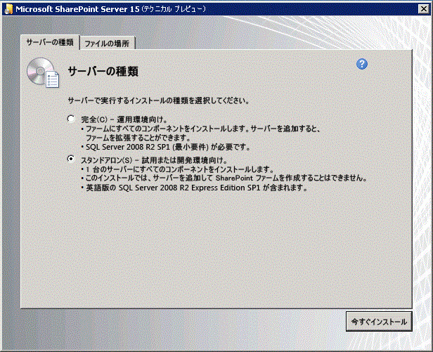

# SharePoint アドインのオンプレミスの開発環境をセットアップする
SharePoint アドイン開発に特化した開発環境を SharePoint のオンプレミス インストール環境を使用して構築する方法を説明します。
## SharePoint アドインの開発環境用にオペレーティング システムをインストールする
<a name="bk_installOS"> </a>

開発環境の要件は、条件的にもコスト的にも本番稼働環境より緩和された要件となっています。ここに記載するガイドラインは本番稼働環境のインストールには該当しません。SharePoint を本番稼働用にインストールして環境を構築する際の手順については、「 [SharePoint 2013 のインストールと構成の概要](http://technet.microsoft.com/ja-jp/library/ee667264%28v=office.15%29)」、「 [SharePoint 2013 のハードウェア要件およびソフトウェア要件](http://technet.microsoft.com/ja-jp/library/cc262485%28v=office.15%29)」、「 [SharePoint アドインの環境を構成する (SharePoint 2013)](http://technet.microsoft.com/ja-jp/library/fp161236%28office.15%29.aspx)」を参照してください。


どんな開発環境でも、SharePointをインストールして実行するには、x64 対応の CPU と少なくとも 16 GB の RAM が搭載されているコンピューターを使用する必要があります (24 GB の RAM を推奨)。


それぞれの要件および予算に応じて、以下の選択肢から選択できます。


- SharePointを Windows Server 2008 R2 Service Pack 1 x64 または Windows Server 2012 にインストールします。


- Microsoft Hyper-V を使用して、Windows Server 2008 R2 Service Pack 1 x64 または Windows Server 2012 ゲスト オペレーティング システムが実行されている仮想マシンに SharePoint をインストールします。SharePoint 用に Microsoft Hyper-V 仮想マシンをセットアップする場合のガイダンスについては、「 [SharePoint 2013 仮想マシンと Hyper-V 環境にベスト プラクティスの構成を使用する](http://technet.microsoft.com/ja-jp/library/ff621103%28v=office.15%29.aspx)」を参照してください。


> **メモ**
> SharePoint のインストールは、Windows Server 2008 R2 Service Pack 1 x64 または Windows Server 2012 でのみサポートされます。SharePoint 向けに SharePoint アドイン を Windows 7 または Windows 8 上で開発する場合は、Office 365 開発者向けサイトにサインインしてリモートでアドインを開発することができます。 


## オペレーティング システムの必須コンポーネントと SharePoint をインストールする
<a name="bk_prereqsOS"> </a>


1. インストール ファイルに含まれている PrerequisiteInstaller.exe ツールを実行します。


2. インストール ファイルに含まれている Setup.exe ツールを実行します。


3. マイクロソフト ソフトウェア ライセンス条項に同意します。


4. [ **インストールの種類を選択してください**] ページで [ **スタンドアロン**] を選択します。

   **図 1. インストールの種類の選択**





5. インストール中にエラーが発生した場合は、ログ ファイルを確認します。ログ ファイルを見つけるには、コマンド プロンプト ウィンドウを開いて次のコマンドを入力します。インストールの完了時にはログ ファイルへのリンクも表示されます。

 ```

cd %temp%
dir /od *.log
 ```

6. インストールが完了すると、SharePoint 製品とテクノロジ構成ウィザードを開始するかどうかを確認するメッセージが表示されます。

    > **メモ**
      > SharePoint 製品とテクノロジ構成ウィザードは、ドメインには参加しているが、ドメイン コントローラーに接続されていないコンピューターでは失敗することがあります。このエラーが発生した場合は、直接または仮想プライベート ネットワーク (VPN) を介してドメイン コントローラーに接続するか、そのコンピューターの管理権限が付与されているローカル アカウントでサインインします。 
7. 構成ウィザードを完了すると、新しい SharePoint サイトの [ **テンプレートの選択**] ページが表示されます。このページで、[ **開発者向けサイト**] テンプレートを選択します。SharePoint アドインは Visual Studio から開発者向けサイトにのみ展開できます。

   **図 2. サイトのテンプレート選択ページ**


## SharePoint のサービスをサーバー間アドインで使用するために構成する
<a name="Servertoserver"> </a>

この手順では、SharePoint のサービスをサーバー間アドインで使用するために構成します。これらの手順を実行すると、プロバイダー向けのホスト型の信頼性の高いアドインを作成できるようになります。このようなアドインの作成の詳細については、「 [SharePoint の高信頼性アドインを作成する](create-high-trust-sharepoint-add-ins.md)」を参照してください。


1. App Management Service とユーザー プロファイル アプリケーションが構成されていることを確認します (SharePoint アドイン の元々の名前は「SharePoint 用アプリ」でしたので、App Management Service と呼ばれています)。手順は次のとおりです。

1. [ **サーバーの全体管理**] で、[ **アプリケーション構成の管理**] の [ **サービス アプリケーションの管理**] を選択します。


2. [ **サービス アプリケーション**] ページで、次のサービスが開始されていることを確認します。

  - User Profile Service アプリケーション


  - アプリ管理サービス


3. [ **アプリケーション管理**] の [ **サーバーのサービスの管理**] をクリックします。 


4. [ **サーバーのサービス**] ページで、次のサービスが開始されていることを確認します。

  - ユーザー プロファイル サービス 


2. 少なくとも 1 つのプロファイルが [ **User Profile Service アプリケーション**] に作成されていることを確認します。手順は次のとおりです。

1. [ **サーバーの全体管理**] で、[ **アプリケーション構成の管理**] の [ **サービス アプリケーションの管理**] を選択します。


2. 次に、[ **User Profile Service アプリケーション**] をクリックします。


3. [ **プロファイル サービスの管理: User Profile Service アプリケーション**] ページで、[ **人**] の [ **ユーザー プロファイルの管理**] をクリックします。


4. [ **ユーザー プロファイルの管理**] ページで、[ **新しいプロファイル**] をクリックします。


5. [ **ユーザー プロファイルの追加**] ページで、アカウント名と電子メール アドレスを入力します。


6. [ **保存して閉じる**] をクリックします。

    > **メモ**
      > 作成しようとしているプロファイルが既に存在することを通知するメッセージが表示された場合は、[ **キャンセルして戻る**] をクリックします。 
7. [ **ユーザー プロファイルの管理**] ページに戻り、[ **プロファイルの合計: 1**] が表示されていることを確認します。


## Visual Studio と Office Developer Tools for Visual Studio をインストールする
<a name="SP15Appdevonprem_bk_installVS"> </a>


- **Visual Studio** 2013 以降をまだインストールしていない場合、「 [Install Visual Studio](http://msdn.microsoft.com/library/da049020-cfda-40d7-8ff4-7492772b620f.aspx)」の指示に従ってインストールします。 [Microsoft ダウンロード センターの最新バージョン](https://www.visualstudio.com/downloads/download-visual-studio-vs)を使用することをお勧めします。


- Visual Studio には **Microsoft Office Developer Tools for Visual Studio** が含まれていますが、このツールの最新バージョンが Visual Studio の更新プログラムの後にリリースされることがあります。このツールの最新バージョンを確実に使用するため、 [Office Developer Tools for Visual Studio 2013 用インストーラー](http://aka.ms/OfficeDevToolsForVS2013)または  [Office Developer Tools for Visual Studio 2015 用インストーラー](http://aka.ms/OfficeDevToolsForVS2015)を実行してください。


### Visual Studio での詳細ログ

詳細ログを有効にする場合は、次の手順を実行します。


1. レジストリを開き、 **HKEY_CURRENT_USER\\Software\\Microsoft\\VisualStudio\\ _nn.n_\\SharePointTools** に移動します。 _nn.n_ は Visual Studio のバージョン (12.0、14.0 など) です。


2. **EnableDiagnostics** という DWORD キーを追加します。


3. このキーの値に **1** を指定します。


レジストリ パスは Visual Studio の将来のバージョンで変更されます。


## SharePoint の分離アドイン ドメインを構成する
<a name="SP15appdevonprem_bk_configure"> </a>

このセクションの手順を実行する前に、「 [ホスト Web、アドイン Web、および分離ドメイン](host-webs-add-in-webs-and-sharepoint-components-in-sharepoint-2013.md#IsolatedDomain)」をご覧ください。


テスト SharePoint ファームに分離ドメインを作成する必要があります。また、SharePoint インストール環境では、SharePoint がホストするアドインをプロビジョニングできる場所となる、汎用ワイルドカード ホスト ヘッダー ドメインが必要になります。


開発目的の場合は、必要に応じて、開発用コンピューターが SharePoint アドイン のテスト用インスタンスにルーティングされるようにホスト ファイルを変更することができます。Visual Studio は、アドインの構築時および展開時には自動でホスト ファイルを変更します。 


> **メモ**
> 運用フォームの場合、イントラネット内で DNS ルーティング方針を策定しオプションでファイアウォールを構成することが必要な場合もあります。SharePoint アドイン の運用環境の作成と構成についての詳細は、「 [SharePoint アドインをインストールおよび管理する](http://technet.microsoft.com/ja-JP/library/fp161232%28v=office.15%29)」を参照してください。 


次の手順を行って分離アドイン ドメインを作成します。


> **メモ**
> 以下に説明するすべての手順は、ファーム管理者としてログインして実施する必要があります。また、コマンド プロンプトおよび SharePoint 管理シェルは管理者として実行する必要があります。 


### 開発用コンピューターに分離アドイン ドメインを作成する


1. コマンド プロンプトを開いて以下のコマンドを入力し、spadmin および sptimer サービスが実行されるようにします。

 ```

net start spadminv4
net start sptimerv4
 ```

2. SharePoint 管理シェルを管理者として実行し、以下のコマンドを入力して分離アドイン ドメインを作成します。 _contosoaddins.com_ はご使用のアドイン ドメインに置き換えてください。ホスト SharePoint ドメインのサブドメインには *しない*  でください。サブドメインにすると、分離アドイン ドメインを使用するセキュリティ上の利点が大いに損なわれることになります。たとえば、ホスト ドメインが contoso.com の場合には、addins.contoso.com をアドイン ドメインとして使用しないでください。

 ```

Set-SPAppDomain "contosoaddins.com"
 ```

3. SharePoint 管理シェルで以下のコマンドを入力して、SPSubscriptionSettingsService および AppManagementServiceInstance サービスが実行されるようにします。

 ```
  Get-SPServiceInstance | where{$_.GetType().Name -eq "AppManagementServiceInstance" -or $_.GetType().Name -eq "SPSubscriptionSettingsServiceInstance"} | Start-SPServiceInstance
 ```

4. SharePoint 管理シェルで以下のコマンドを入力して、SPSubscriptionSettingsService および AppManagementServiceInstance サービスが実行されていることを確認します。出力に、各サービスがオンラインであるかどうかが表示されます。

 ```
  Get-SPServiceInstance | where{$_.GetType().Name -eq "AppManagementServiceInstance" -or $_.GetType().Name -eq "SPSubscriptionSettingsServiceInstance"}
 ```

5. SPSubscriptionService および AppManagementServiceInstance のサービス インスタンスが実行されるアカウントを指定する必要があります。このアカウントは SPManagedAccount である必要があります。SharePoint 管理シェルで以下のコマンドを入力し、SPManagedAccount を作成します (アカウント (domain\\user) とパスワードを入力する必要があります)。

 ```
  $account = New-SPManagedAccount
 ```

6. SharePoint 管理シェルで以下のコードを入力し、SPSubscriptionService および AppManagementServiceInstance サービスについてアカウント、アプリケーション プール、およびデータベースの設定を指定します。SPManagedAccount を前の手順で作成している場合は、そのアカウント名をここで使用します。

 ```
  $account = Get-SPManagedAccount "domain\\user"
$appPoolSubSvc = New-SPServiceApplicationPool -Name SettingsServiceAppPool -Account $account
$appPoolAppSvc = New-SPServiceApplicationPool -Name AppServiceAppPool -Account $account
$appSubSvc = New-SPSubscriptionSettingsServiceApplication -ApplicationPool $appPoolSubSvc -Name SettingsServiceApp -DatabaseName SettingsServiceDB 
$proxySubSvc = New-SPSubscriptionSettingsServiceApplicationProxy -ServiceApplication $appSubSvc
$appAppSvc = New-SPAppManagementServiceApplication -ApplicationPool $appPoolAppSvc -Name AppServiceApp -DatabaseName AppServiceDB
$proxyAppSvc = New-SPAppManagementServiceApplicationProxy -ServiceApplication $appAppSvc

 ```

7. SharePoint 管理シェルで以下のコードを入力し、アドインのプリフィックスを指定します (「 [ホスト Web、アドイン Web、および分離ドメイン](host-webs-add-in-webs-and-sharepoint-components-in-sharepoint-2013.md#IsolatedDomain)」をご覧ください)。

 ```

Set-SPAppSiteSubscriptionName -Name "add-in" -Confirm:$false
 ```

 **プロキシ サーバーを使用している環境の場合のみ、以下の手順を実行してください。** 分離アドイン ドメインを作成したら、次の手順で Internet Explorer のバイパス一覧にそのドメインを追加します。この設定により、SharePoint ホスト型アドインの展開後、またはアドイン Web が含まれるプロバイダーでホストされるアドインの展開後、このドメインに移動することができるようになります。


### 分離アドイン ドメインを Internet Explorer のバイパス一覧に追加する


1. Internet Explorer で、[ **ツール**] を開きます。


2. [ **インターネット オプション**] をクリックします。


3. [ **接続**] タブで [ **LAN の設定**] ボタンをクリックします。


4. [ **設定を自動的に検出する**] チェック ボックスをオフにします。


5. [ **LAN にプロキシ サーバーを使用する**] チェック ボックスをオンにします。


6. [ **詳細設定**] ボタンをクリックして、[ **例外**] リストに「*.YourAddinsDomain.com」を追加します。


7. [ **OK**] をクリックします。


8. [ **OK**] ボタンをクリックして [ **ローカル エリア ネットワーク (LAN) の設定**] ダイアログ ボックスを閉じます。


9. [ **OK**] ボタンをクリックして [ **インターネット オプション**] ダイアログ ボックスを閉じます。


アドインの展開に関するオプションについては、「 [SharePoint アドインの展開とインストール: 方法とオプション](deploying-and-installing-sharepoint-add-ins-methods-and-options.md)」を参照してください。


> **ヒント**
> SharePoint ホスト型アドインをインストールに展開した後、そのアドインを起動するときに、ログイン資格情報を入力するように指示されることがあります。この指示が表示されないようにするには、ループバック チェックを無効にする必要があります。ループバック チェックを無効にする方法については、「 [IIS 5.1 または以降のバージョンでホストされ、統合認証を使用する Web サイトを参照するとエラー 401.1 が表示される](http://support.microsoft.com/kb/896861)」を参照してください。 


## その他の技術情報
<a name="SP15SetupSPO365_bk_addlresources"> </a>


-  [SharePoint アドイン](sharepoint-add-ins.md)


-  [プロバイダー ホスト型 SharePoint アドインの作成を始める](get-started-creating-provider-hosted-sharepoint-add-ins.md)


-  [SharePoint ホスト型の SharePoint アドインの作成を始める](get-started-creating-sharepoint-hosted-sharepoint-add-ins.md)


