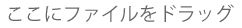
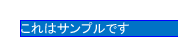
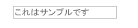

# SharePoint アドインの UX 設計ガイドライン
SharePoint 2013 でのアドインのユーザー エクスペリエンス (UX) の一般的なデザイン ガイドラインについて説明します。クロムの選択、CSS の使用、ユーザー ライセンスの管理などのデザイン タスクについて説明します。
アドインは、SharePoint サイト自体の信頼性を保ちながらエンド ユーザーがサイトに新しい機能を追加できるように強化する SharePoint 2013 の新しいコンセプトです。良いアドインを作成するには優れた機能を作成することだけではなく (もちろんこのことも重要ですが)、アドインを適切に表示し、インストールされるサイトに正しくシームレスにフィットさせることも重要です。


## アドインのクロムを選択する
<a name="UXGuide_AppChrome"> </a>

アドインを作成するときには、ページをどの程度ブランド化するか、また、ページをどこでホストするかについて最初に決める必要があります。これらの選択に応じてクロムを強化するために使用するテクノロジが比較的簡単に決まります。


- **SharePoint にホストされる ASPX ページ:** アドイン テンプレートを使用します。


- **SharePoint にホストされる HTML ページまたは SharePoint の外の任意のページ:** クロム コントロールを使用します。


- **カスタム ブランド化されたページ:** 独自のクロムを使用します。


### SharePoint にホストされるページでアドイン テンプレートを使用する
<a name="UXGuide_AppTemplate"> </a>

アドイン テンプレートは SharePoint にホストされた ASPX ページでのみ使用できます。テンプレートには、 **app.master** マスター ページ (アドインに適したクロムを含み、ホスト サイトのテーマ用にデザインされています) が含まれており、アドイン Web では動作しないまたは意味を持たないいくつかの SharePoint 機能を覆い隠します。図 1 にアドイン テンプレートを使用した SharePoint にホストされるページを示します。


**図 1. アドイン テンプレートを使用した SharePoint にホストされるページ**


アドイン テンプレートは、アドイン Web とその Web 内のページを作成するときの Visual Studio の既定値です。


### SharePoint アドインでクロム コントロールを使用する
<a name="UXGuide_ChromeControl"> </a>

SharePoint にホストされる ASPX ページは作成しないが、使用するホスト サイトに自然にフィットするアドインを作成する場合は、クロム コントロールが正しい選択です。図 2 にクロム コントロールを示します。


**図 2. Web ページ内のクロム コントロール**


**ビデオを見る: SharePoint 2013 のクロム コントロール**


### クロム コントロールの使用方法


1. コントロール ライブラリに参照を追加します。これには 2 つの方法があります。

  - 次の例に示すように、レイアウト フォルダーのルートでライブラリをポイントします。

 ```

<script
    type="text/javascript" 
    src="http://{server URL}/_layouts/15/sp.ui.controls.js">
</script>
 ```

  - ライブラリを自分の Web サイトにコピーして、そこから参照します。

    > **注意**
      > この方法を選択した場合には、アドインはコントロールの更新のメリットを受けられません。 
2. 次の例に示すように、コントロールをレンダリングする場所にプレースホルダーの DOM 要素を追加します。

 ```

<div id='chromeControlContainer'></div>
 ```

3. コントロールをインスタンス化します。

 ```
  function addchromecontrol(){
    var options = {};
    options.siteTitle ="{host site title}";
    options.siteUrl = "{host URL}";
    options.appHelpPageUrl = "{help page URL}";
    options.appIconUrl = "{app icon URL}";
    options.appTitle = "add-in Title";
    nav = new SP.UI.Controls.Navigation("chromeControlContainer", options);
    nav.setVisible(true);
}
 ```

4. (オプション) ページにタイトル領域が不要な場合は、次の JavaScript コードを実行して削除できます。

 ```

nav.setBottomHeaderVisible(false);
 ```

クロムは 2 つのオプションのアドイン アイコンを提供します。1 つはトップ ナビゲーション バーに、もう 1 つはタイトル領域に表示されます。トップ ナビゲーション バーのアドイン アイコンは 24 x 24 ピクセル (px)、タイトル領域のアイコンは SharePoint サイトのアイコンと同じ大きさで、高さが最大 64 px、幅が最大 180 px です。ユーザーと管理者がサイトのテーマを変更できるため、背景が白、黒、灰色、鮮やかな色、くすんだ色でテストした PNG 画像を使用することをお勧めします。クロム コントロールの使用方法については、「 [SharePoint アドインのクライアント クロム コントロールを使用する](use-the-client-chrome-control-in-sharepoint-add-ins.md)」を参照してください。


### SharePoint アドインでカスタム ブランド UI を作成する
<a name="UXGuide_CustomUI"> </a>

アドインをインストールするホスト サイトのテーマに合わせたり SharePoint サイトに合わせたりするのではなく、独自のブランドをアドイン内で使用する場合は、クロムを最初から作成する必要があります。ただしその場合でも、アドインがインストールされているサイトにユーザーをリダイレクトして戻すための [サイトに戻る] リンクをページの左上に表示する必要があります (右から左 (RTL) の言語では右上)。


## SharePoint アドインでホスト Web の CSS を使用する
<a name="UXGuide_CSS"> </a>

ホスト Web と同じスタイルを使用することで、アドインとホストする SharePoint サイトとの一貫性を保つことができます。実際のスタイルはサイトのデザインに基づいて変わりますが、ホスト Web の CSS ファイルを参照することで、アドインがどこにインストールされても調和させることができます。


ホスト Web の CSS スタイルを使うには、CSS ファイルを参照する必要があります。これは複数の異なる方法で行うことができます。


### ホスト Web の CSS ファイルを参照する


1. アドイン テンプレートまたはアドインのクロム コントロールを使用している場合は、自動的に行われます。


2. アドイン Web の内部では、次のコードをマスター ページまたは ASPX ページに追加することで **CssRegistration** および **CssLink** コントロールを使用して CSS ファイルを参照できます。

 ```HTML
  <SharePoint:CssRegistration runat="server" name="default" />
<SharePoint:CssLink runat="server />

 ```

3. 次の例に示すように、<link> 要素を使い、ホスト Web からの URL を作成して CSS ファイルを参照できます。

 ```HTML

<link rel="stylesheet" href="{host web URL}/_layouts/15/defaultcss.ashx" />
 ```


    この方法を使用する場合、ページ内で JavaScript を実行してホスト Web の URL をクエリ文字列から取り出す必要があります。その後で、ページの DOM に要素を追加する前に、ホスト Web の URL を **link** 要素に挿入します。


アドインにスタイルを指定する際に大切なことは、可能な限りセマンティック HTML を使用することです。つまり、各種の見出しには **H1**、 **H2**、 **H3** などを使用し、ボタンには input タグを使用します。また、可能な限り SharePoint のコア スタイルを使用して、ホスト サイトのテーマが変わったときにアドインがシームレスに、また自動的に変更に対応できるようにします。既定のテーマでスタイルがどのように使用されているかを次の表に示します。


**表 1. 本文テキストのスタイル**


|**例**|**使用目的**|**スタイル**|
|:-----|:-----|:-----|
||特大の本文テキスト  <br/> |.ms-textXLarge  <br/> |
||大きい本文テキスト  <br/> |.ms-textLarge  <br/> |
||通常の本文テキスト  <br/> |自動的に継承  <br/> |
||小さな本文テキスト  <br/> |.ms-textSmall  <br/> |
||メタデータ テキスト  <br/> |.ms-metadata  <br/> |
 

**表 2. タイトルと見出しのスタイル**


|**例**|**使用目的**|**スタイル**|
|:-----|:-----|:-----|
||ページのメイン タイトル  <br/> |.ms-core-pageTitle  <br/> |
||ダイアログ ボックス、フォーム、ブログ、ディスカッションの投稿のタイトル。通常の Wiki または Web パーツとは異なる、ページ全体を占める特殊なコンテンツ タイプまたはアドインで使用する代替の "第一の" タイトル。  <br/> |H1  <br/> |
||H1 と関係する 2 番目の見出し。たとえば、コミュニティでは記事のタイトルに H1 アクセントを使用し、記事に対するベストな "返信" に H2 アクセントを使用します。  <br/> |H2  <br/> |
||一般的には H2 の下の小見出し。  <br/> |H3  <br/> |
||H3 の下の小見出し。  <br/> |H4  <br/> |
||ページの主要な/第一の Web パーツのタイトルまたはメイン セクションの見出し。  <br/> |.ms-webpart-titleText  <br/> |
||ダイアログ ボックスまたは吹き出し内の見出しのタイトル。  <br/> |.ms-dlg-heading  <br/> |
 

**表 3. ナビゲーション スタイル**


|**例**|**使用目的**|**スタイル**|
|:-----|:-----|:-----|
||左側のナビゲーション バーの見出し。  <br/> |.ms-core-listMenu-verticalBox > .ms-core-listMenu-root > li > .ms-core-listMenu-item  <br/> |
||左側のナビゲーション バー内のリンク。  <br/> |.ms-core-listMenu-verticalBox  <br/> |
||左側のナビゲーション バー内の選択された項目。  <br/> |.ms-core-listMenu-verticalBox + .ms-accentText  <br/> |
||トップ ナビゲーション バー内の項目。  <br/> ||
||トップ ナビゲーション バー内の選択された項目。  <br/> ||
 

**表 4. コマンド スタイル**


|**例**|**使用目的**|**スタイル**|
|:-----|:-----|:-----|
||特定のコンテナーまたはページ内でユーザーが実行する主要なアクション リンク。たとえば、吹き出しの下のコマンドのスタイルに使用します。コマンドが使用されたことがある場合もない場合も、常に同じ色になります。  <br/> |.ms-commandLink  <br/> |
||同様にアクション リンクのスタイルに使用しますが、コンテンツの二次的なアクションに使用します。このスタイルは、他のコンテンツよりも注意を引かないように、二次的なアクションに対して使用します。  <br/> |.ms-secondaryCommandLink  <br/> |
||吹き出し内のリンク。  <br/> |.ms-calloutLink  <br/> |
 

**表 5. 修飾スタイル**


|**例**|**使用目的**|**スタイル**|
|:-----|:-----|:-----|
||テキストに対して現在のテーマのアクセント色を提供するヘルパー クラス。  <br/> |.ms-accentText  <br/> |
||既定のハイパーリンクのスタイルと動作を継承するコンテンツ内のリンク。ハイパーリンクのスタイルは色とポイント時の効果を適用し、通常のテキストではなくリンクであることを示します。  <br/> |<a> の使用により継承。  <br/> |
||フォームで発生したエラーのメッセージ。  <br/> |.ms-error  <br/> |
||通常の本文テキストよりも強調しないテキストのための穏やかな灰色を提供するヘルパー クラス。  <br/> |.ms-soften  <br/> |
||テキストに "無効" の色を適用するヘルパー クラス。無効の状態を表すために使用します。  <br/> |.ms-disabled  <br/> |
||テキストをすべて大文字に変換するヘルパー クラス  <br/> |.ms-uppercase  <br/> |
||テキストをフォームのようなスタイルにするヘルパー クラス。  <br/> |.ms-helper  <br/> |
||サイド リンク バーおよびメニュー内でセクションを区切るために使用される破線の区切り線。  <br/> |HR  <br/> |
 

**表 6. パーツ ユーザー インターフェイスのスタイル**


|**例**|**使用目的**|**スタイル**|
|:-----|:-----|:-----|
||パーツ上部のメイン インライン テキスト。  <br/> |.ms-textXLarge + .ms-soften  <br/> |
||パーツの一番上の行のコマンド。多くてもパーツごとに 1 つまたは 2 つ。  <br/> |.ms-heroCommandLink  <br/> |
||パーツにデータが含まれていないときにパーツを操作するようにユーザーを誘うために表示されるテキスト。  <br/> |.ms-attractMode  <br/> |
||表示するデータがないときにユーザーに表示されるテキスト。  <br/> |.ms-emptyMode  <br/> |
||ピボットなどのビュー コントロール。  <br/> |.ms-pivot-link  <br/> |
||リンクでもあるリスト項目。  <br/> |.ms-listLink  <br/> |
 

**表 7. 背景と枠線のスタイル**


|**例**|**使用目的**|**スタイル**|
|:-----|:-----|:-----|
||ページで特に強く強調する四角形のスタイル。  <br/> |.ms-emphasis  <br/> |
||強調要素の枠線。  <br/> |.ms-emphasisBorder  <br/> |
||要素の弱い強調。  <br/> |.ms-subtleEmphasis  <br/> |
||ms-subtleEmphasis のスタイルを持つ要素内のコマンド。  <br/> |.ms-subtleEmphasisCommand  <br/> |
||ms-subtleEmphasis のスタイルを持つ要素内の無効化されたコマンド。  <br/> |.ms-subtleEmphasisCommand-disabled  <br/> |
||サイド ナビゲーションの要素。  <br/> |.ms-sideNav  <br/> |
||選択されたサイド ナビゲーションのスタイル。  <br/> |.ms-sideNav-selected  <br/> |
||枠線を使用した要素の強調。  <br/> |.ms-lines  <br/> |
||薄い枠線を使用した要素の強調。  <br/> |.ms-subtleLines  <br/> |
||濃いまたは色つきの枠線を使用した要素の強調。  <br/> |.ms-strongLines  <br/> |
||枠線を使用した無効化された要素の強調。  <br/> |.ms-disabledLines  <br/> |
||アクセントの枠線を使用した要素の強調。  <br/> |.ms-accentLines  <br/> |
||ポップアップ ウィンドウの囲み。  <br/> |.ms-popupBorder  <br/> |
||バックグラウンド要素上のオーバーレイに適用。  <br/> |.ms-bgOverlay  <br/> |
||要素の背景の表示を無効化。  <br/> |.ms-bgDisabled  <br/> |
||ヘッダーの背景色の適用。  <br/> |.ms-bgHeader  <br/> |
||フッターの背景色の適用。  <br/> |.ms-bgFooter  <br/> |
||ポイント時に強調色にする要素。この例はマウスでポイントしていないときの要素を示しています。  <br/> |.ms-bgHoverable  <br/> |
||ポイント時に強調色にする要素。この例はマウスでポイントしたときの要素を示しています。  <br/> |.ms-bgHoverable  <br/> |
||要素の選択を示す。  <br/> |.ms-bgSelected  <br/> |
||ページのトップ バー内の要素。  <br/> |.ms-topBar  <br/> |
 
詳細については、「 [SharePoint アドインで SharePoint Web サイトのスタイル シートを使用する](use-a-sharepoint-website-s-style-sheet-in-sharepoint-add-ins.md)」を参照してください。


## SharePoint アドインの共通項目を一貫したスタイルにする
<a name="UXGuide_Styling"> </a>

ユーザーが SharePoint とアドインの間の変換のスキルを習得しやすいように、いくつかの共通要素を一貫したスタイルにします。


### 内部ナビゲーション

アドイン内のナビゲーションを提供する場合、左側のナビゲーションと上部のナビゲーションの 2 つの主なパターンがあります。どちらのオプションを使用するかは、アドイン内の他のコンテンツの内容にある程度依存します。一般的には左側のナビゲーションが正しい選択です。これは異なるリストの切り替えや、アドインが主にマスター/詳細ビューである場合に特に当てはまります。一方、主にナビゲーションが同じリストの異なる表示の切り替えである場合には、上部のナビゲーションを採用することもできます。


左側のナビゲーションと上部のナビゲーションの両方に対して、SharePoint に設定された場合に正しいスタイルになるオブジェクト モデル表現があります。SharePoint ページ以外では、上部または左側のナビゲーション用のマークアップを作成し、正しいスタイルになるように適切な CSS クラスを追加する追加作業が多少必要になります。


### ツール バー

多くの場合、ユーザーに手早く表示したい少数のコマンドがあります。ページで既にリボンを使用している場合は、これらのコマンドを既存のリボン内の論理的な場所に追加するのが最善の選択です。しかし、ページにまだリボンがない場合は、少数のコマンドのためにリボンを追加するのは通常適切ではありません。この場合は、ツール バー コンテキストを要素に追加して、そこにコマンドを適用することをお勧めします。グリフ、ms-commandLink スタイルのテキスト、またはその両方を使用してツール バー上にコマンドを表示し、ページの他の部分と同じ背景色を持たせるようにします。


### リスト

リストはデータをユーザーに表示する一般的な方法です。アドインが SarePoint ページを使用している場合は、List View Web パーツを使用してデータをユーザーに表示したり、スタイルや操作を指定したりできます。しかし、ページが他の場所にある場合や、ユーザーのリストの操作についてもっと制御する必要がある場合は、SharePoint のリストのスタイルをまねした上で独自のレンダリングや操作を提供する必要があります。アドインでリストを使用する場合に心がける必要があるスタイル上の問題について次にいくつか説明します。


- **ビュー:** 1 つのリストに対して複数のビューを表示するときは、SharePoint の通常のリストが行うように、リストの上部にピボットを使用します。マスター/詳細表示を表示する手段にはピボットを使用しません。


- **フィルター:** 既存のリストまたはマスター/詳細配置にフィルターを提供する場合は、コンテンツ領域の左側に表示されるサイド バーを使用し、300 ピクセル以上の幅にします。また、SharePoint の選択時のスタイルをコピーして、どのフィルターまたは項目が選択されているのかをユーザーに示すようにします。


- **フォーム:** ユーザーが 1 つの項目を表示または編集しているときは、一貫したエクスペリエンスを提供するために、組み込みの SharePoint フォームを使用するか、またはそのスタイルを模倣します。


### フォーム、ダイアログ ボックス、吹き出し

オブジェクトについての多くの情報をユーザーに提供する場合や、ユーザー入力のためのユーザー インターフェイス (UI) を提供する場合は、ページ全体のフォーム、ダイアログ ボックス、吹き出しの 3 つの異なるパターンがあります。どのパターンを使用するかは、ユーザーの意向やどのくらいの情報が表示されるか、または入力されるかに依存します。


- **ページ全体のフォーム:** この方法は、多くの異なる情報の入力をユーザーに求める場合や、構造化されたたくさんの情報を一度に表示する場合に最適です。ページ全体のフォームは、リボンなどのより複雑な対話操作モデルが必要なシナリオにも適しています。この場合、必要に応じてユーザーにフォーム ページを指示します。ボタンまたはリボンを使用して変更を保存または消去するための明らかな方法を用意する必要があります。スクロールが必要な非常に長いフォームでは、フォームの上と下に [ **保存**] と [ **キャンセル**] のオプションを配置するのが良い方法です。


- **ダイアログ ボックス:** コンテキストに沿った方法で多くの情報またはアクションを表示するためによく使用されるモーダル UI コンテナーです。これらは短いフォームやユーザー入力にも使用されます。一般にダイアログ ボックス内でホストされる UI は、単純で、小さい表示面によく適合するものにします。長いフォームやリボンのようなより複雑な対話操作モデルは、ページ全体のフォームで提供する方がより適しています。


- **吹き出し:** 特定の項目について関連するコンテキスト情報やアクションを提供します。吹き出しは、軽量 UI 内で項目に関するより多くの情報やアクションをユーザーに表示するために通常用いられます。スクロール バーやユーザー入力が必要な場合は、一般に吹き出しは適切な選択ではありません。


### アニメーション

アニメーションはより活発で魅力的なエクスペリエンスにつながりますが、UI で使いすぎないように注意する必要があります。よくできたアニメーションは、ユーザーに気付かれずに、より速くよく機能する UI の印象を与えます。アニメーションを使用するときは、物理や慣性などの概念を尊重し、自然で優雅に見える UI を提供します。極端な跳ね返りや弾性、ユーザーのわずかな操作に対してオブジェクトが画面中を飛び回るような過度なアニメーションは使用しないことを強くお勧めします。オブジェクトは通常、目的の場所への直線的な経路を取り、ユーザーに移動したという感覚を与えるために、実際の変更の最初または最後の 10% のアニメーションのみを必要とします。


### タブとピボット

SharePoint では、タブの使用が適切な場所はリボンだけです。SharePoint 内の他の場所でコンテンツ領域の変更の概念を表現するにはピボットを使用します。


## SharePoint アドインを使用した Office UI Fabric に関する FAQ
<a name="Fabric"> </a>

この FAQ は、Office UI Fabric の使用方法と SharePoint アドインの外観を残りの Office 365 に似せる方法の理解に役立ちます。


 **1. Office UI Fabric とは何ですか?**


Office UI Fabric は、応答性の高いモバイルファースト フロントエンド フレームワークで、Office Design Language を使用して Web エクスペリエンスを構築できます。これは、フォントのセットと、UI コンポーネント、アイコン、アニメーション、および公式の Office カラー パレットを提供する CSS クラスとともに実装されます。詳細については、「 [Office UI Fabric](https://github.com/OfficeDev/Office-UI-Fabric)」を参照してください。


 **2. Office UI Fabric を自分の SharePoint アドイン内で使用できますか?**


はい。bootstrap などの他の CSS フレームワークを参照するのと同様に、アドイン ページから Office UI Fabric ファイルを参照できます。


 **3. SharePoint アドインで Office UI Fabric を使用するのはいつですか?**


アドインを Office 365 の外観にする場合に使用します。これは、SharePoint ホスト Web の CSS ファイルの代わりに使用できます。


 **4. SharePoint で Office UI Fabric を使用するにはどうしたらいいですか?**


Office UI Fabric ファイルを開発プロジェクトに追加して、fabric.css ライブラリへの参照を HTML または ASPX ページに含めるだけです。詳細については、「 [はじめに](https://github.com/OfficeDev/Office-UI-Fabric#get-started)」を参照してください。


 **5. SharePoint アドインで Office UI Fabric コンポーネントを使用するにはどうしたらいいですか?**


fabric.components.css ライブラリへの参照を HTML または ASPX ページに含めるだけです。詳細については、「 [はじめに](https://github.com/OfficeDev/Office-UI-Fabric/blob/master/ghdocs/GETTINGSTARTED.md)」を参照してください。


 **6. SharePoint アドインのホスト Web CSS と一緒に Office UI Fabric を使用できますか**


現時点では、ホスト Web CSS と一緒に Office UI Fabric を使用することはお勧めしていません。クラス名の競合やスタイルの不一致が生じるのを防止するためです。


 **7. Office UI Fabric は SharePoint テーマをサポートしますか?**


いいえ。Office UI Fabric は SharePoint テーマをサポートしません。ただし、Office UI Fabric テーマを適用しても SharePoint テーマと競合しません。


## アドインの SharePoint UI を拡張する
<a name="UXGuide_Extending"> </a>

SharePoint では、アドインによって既存の UI のいくつかを拡張することで、ユーザーが必要とする場所でアドインを利用できるようになります。次の方法でホスト Web の UI を拡張できます。


- **アドイン パーツ:** **iframe** 要素の表面にアドインのコンテンツを含めることができます。


- **カスタム アクション:** カスタム アクションにより、リボンまたはコンテキスト メニューを拡張できます。カスタム アクションは、リスト項目、ドキュメント、またはリボンが表示される任意の場所でアドインを利用できるようにします。


### アドイン パーツをホスト Web に追加する

パーツは、アドインがインストールされるホスト Web 内に、アドインが少しの情報または小さな操作ポイントを表示する方法です。エンド ユーザーは、SharePoint の Web パーツ フレームワークを使用してこのようなパーツをページに埋め込むことができます。図 3 に、パーツの例としてタグ クラウド パーツを示します。


**図 3. タグ クラウド パーツ**


図 3 で [ **Tag Cloud from UX Design add-in**] はパーツのタイトルです。このタグ クラウド自体がアドイン コンテンツから提供されており、 **iframe** 要素にホストされて、ホスティング ページからは完全に分離されています。アドイン コンテンツはホスト Web の CSS ファイルを使用しているため、ホスト ページにシームレスにフィットします。


ある種の UI はそれ自体を貸し与えることができ、パーツ UI を介して表示されます。たとえば、複数のショートカットをアドインの異なるエクスペリエンスに提供したり、ユーザーが他のページに埋め込むことができる単一の起動場所を提供したりすることもできます。他の使用方法としては、アドイン内のデータの一部のみを表示したり、何かの最新の変更を表示したりできます。小さな操作ゾーンを提供してアドインを開かずにアドインのクイック アクションを実行できます。どのタイプのパーツを提供するかは、アドインがサポートするシナリオによって決まります。すべてのアドインにパーツを持たせるのではなく、ユーザー エクスペリエンスに有益な場合にのみ提供する必要があることに注意してください。


パーツ内で表示するページは **iframe** にホストされるため、記述するすべての JavaScript はそのことを認識して、ウィンドウ オブジェクトなどへのアクセスをスマートに行う必要があります。アドインのその他の部分が強くブランド化されている場合でも、パーツはホスト Web のスタイルを採用することを検討してください。パーツはホスト Web に埋め込まれるのでホスト Web にフィットしないと不揃いで魅力に欠けたものになります。ホスト Web のスタイルを使用するには、手動で既定の CSS ファイルへのリンクを作成する必要があります。詳細については、この記事の「 [[方法] ホスト Web の CCS ファイルを参照する](sharepoint-add-ins-ux-design-guidelines.md#UXGuide_CSSHowto)」を参照してください。また、パーツは既にクロムを持つページに埋め込まれるため、ページにはクロムを含めないようにします。


ページは異なるドメインの間でも **iframe** 内でうまく動作する必要があるため、ページの X-Framing-Options に "起源が同じもののみ" を指定しないようにします。既定では、SharePoint ページは同じドメイン内の **iframe** のみで動作するよう指定されています。このため、SharePoint でホストするページについては、次の例に示すようにページのどこかに **AllowFraming** Web パーツを追加して、パーツ内で表示するページの動作を変更する必要があります。



```

<WebPartPages:AllowFraming ID="AllowFraming1" runat="server" />
```

ページがどのドメインの iframe に表示されるかは制限できないため、アドイン パーツにホストされるページはクリックジャッキング セキュリティ攻撃を受ける危険性があります。クリックジャッキング攻撃では、作成したページが悪意のあるページの iframe に表示され、ユーザーは気付かないうちにボタンをクリックしてアクションを行う可能性があります。ページをデザインするときはこのことに注意して、悪意のあるページに表示されると危険な機能をパーツ内のページで公開しないようにします。


ユーザーは手動でパーツに別のサイズを設定できますが、パーツ定義でパーツに特定のサイズを設定できます。また、 **postmessages** を通じてパーツの動的なサイズ変更を要求する機能もあります。同じページ上に異なるアドインのパーツが混在する場合でも、同じ場所で動作するように各パーツが作られているという感覚をユーザーに与えるために、既定ではパーツに 30px 刻みのサイズを選択することをお勧めします (150px や 210px など)。パーツがスタート画面のタイルの模倣を意図したものの場合は、高さと幅を 150px にします。パーツが詳細を表示するためにサイドの列に表示することを意図したものの場合は、幅を 300px にします。


パーツが動的コンテンツを表示する場合は、ページ内にスクロール バーが埋め込まれにくくするために、サイズ変更を要求します。次の例は、 **postmessages** を使用してパーツのサイズ変更を行う方法を示しています。



```
window.parent.postMessage('<message senderId={your ID}>resize(120, 300)</message>', {hostweburl});
```

上の例で、 **senderId** の値は、ページがレンダリングされるときにアドイン パーツのコードによって自動的にページのクエリ文字列に設定されます。ページでは、クエリ文字列から **SenderId** の値を読み取って、それをサイズ変更要求のときに使用することだけが必要です。アドインのパーツ定義の **Src** 属性に **StandardTokens** トークンまたは **HostUrl** トークンを付加することによって、クエリ文字列からホスト Web URL を取得することができます。


ホスト Web のパーツを指定するには、アドイン パッケージ内のフィーチャー ファイルで、クライアント Web パーツを指定する必要があります (パッケージの WSP 内のフィーチャー ファイルではありません)。郵便番号の指定など、エンド ユーザーによる構成が可能なパーツを作成できます。次のマークアップはアドイン パーツを指定します ( **Properties** 要素はオプションです)。



```XML
<ClientWebPart
    Name="Sample Add-in Part" 
    DefaultWidth="600" 
    DefaultHeight="300" 
    Title="Sample Add-in Part" 
    Description="This is a sample part with properties.">
    <Content Type="html" Src="~appWebUrl/Pages/Part.aspx?Property1=_prop1_&amp;amp;Property2=_prop2_&amp;amp;Property3=_prop3_&amp;amp;Property4=_prop4_" />
    <Properties>
        <Property 
            Name="prop1" 
            Type="string" 
            WebBrowsable="true" 
            WebDisplayName="First Property" 
            WebDescription="Description 1" 
            WebCategory="Custom Properties" 
            DefaultValue="String Property" 
            RequiresDesignerPermission="true" />
        <Property 
            Name="prop2" 
            Type="boolean" 
            WebBrowsable="true" 
            WebDisplayName="Second Property" 
            WebDescription="Description 2" 
            WebCategory="Custom Properties" 
            DefaultValue="TRUE" 
            RequiresDesignerPermission="true" />
        <Property 
            Name="prop3" 
            Type="int" 
            WebBrowsable="true" 
            WebDisplayName="Third Property" 
            WebDescription="Description 3" 
            WebCategory="Custom Properties" 
            DefaultValue="1" 
            RequiresDesignerPermission="true" />
        <Property 
            Name="prop4" 
            Type="enum" 
            WebBrowsable="true" 
            WebDisplayName="Fourth Property" 
            WebDescription="Description 4" 
            WebCategory="Custom Properties" 
            DefaultValue="one" 
            RequiresDesignerPermission="true" >
            <EnumItems>
                <EnumItem Value="one" WebDisplayName="One" />
                <EnumItem Value="two" WebDisplayName="Two" />
                <EnumItem Value="three" WebDisplayName="Three" />
            </EnumItems>
        </Property>
    </Properties>
</ClientWebPart>
```

 **ClientWebPart** 要素では次を指定できます。


- **Name:** アドインを識別するために使用される内部名。一意である必要があります。


- **DefaultWidth/DefaultHeight:** Web パーツの既定のサイズ。必要によりパーツ内のページのサイズ変更ができます。


- **Title:** Web パーツ追加機構を介してパーツをページに追加するときに、エンド ユーザーに表示される名前。


- **Description:** Web パーツ追加機構を介してパーツをページに追加するときに、エンド ユーザーに表示される説明。


 **string**、 **enum**、 **int**、および **Boolean** 型のパーツ プロパティを指定できます。 **WebCategory** 属性を使用してプロパティが表示される **toolpart** カテゴリを指定できます。 **Property** 要素の属性には、次を指定できます。


- **Name:** 置換を行うためにこのプロパティとクエリ文字列のトークンとの比較に使用される名前。


- **WebDisplayName:** ツール パーツ内で使用される名前。


- **WebCategory:** このプロパティを追加するツール ウィンドウ内のツール パーツ。


- **Type:** ユーザーから受け取ることを想定する入力データ型。 **string**、 **enum**、 **int**、または **Boolean**。


- **DefaultValue:** プロパティの既定値。


パーツがページに追加されるときに、"_プロパティ名_" のパターンと一致するクエリ文字列内の任意の文字は、自動的に Web パーツ インスタンスの対応する名前を持つプロパティの値で置換されます (ユーザーが値を設定しなかった場合は既定値)。その後、ページ内でクエリ文字列全体を解析するコードを実行してプロパティを取り出し、ページのレンダリングややり取りにそれを使用できます。


また、クエリ文字列上の置換したい場所に _wpid_ 文字列を使用することで、Web パーツ ID を送信することもできます。これはユーザーの選択や操作に関する情報をインスタンスごとに格納する場合に、異なるパーツのインスタンスを区別するのに役立ちます。詳細については、「 [アドイン パーツを作成して SharePoint アドインと共にインストールする](create-add-in-parts-to-install-with-your-sharepoint-add-in.md)」をご覧ください。


### カスタム アクションをホスト Web に追加する

ホスト Web のリスト項目やドキュメントのコンテキスト、または特定のリボン タブに表示することが適切な機能がある場合は、カスタム アクションを使用してコンテキスト メニューまたはリボンに機能を追加できます。カスタム アクションをホスト Web に表示するには、アドイン パッケージ内の **ClientWebPart** 定義を含むファイルと同様の疎結合のフィーチャー ファイルでそれらを定義する必要があります。


**図 4. コンテキスト メニューのカスタム アクション**


ホスト Web に表示されるカスタム アクションのコードは、以前のバージョンの SharePoint に表示する場合と同じですが、次の制限があります。


- **Location** 属性は **CommandUI.Ribbon** または **EditControlBlock** である必要があります。


- **CustomAction** には JavaScript を含めることはできません。

  - すべての **UrlActions** または **CommandActions** は移動先の URL である必要があります。この URL は、通常のカスタム アクション トークンに加えてアプリ固有のトークンでパラメーター化できます。


  - リボンのカスタマイズでは **EnabledScript** は使用できません。


通常ユーザーがカスタム アクションを選択すると、ユーザーの選択を基に解決される任意のトークンで指定された URL にユーザーを移動します。しかし、特定のドキュメントでのクイック アクションのように、ページのコンテキストにユーザーを留めておきたい場合もあります。カスタム アクションによって移動ではなく、ダイアログ ボックスを開く場合は、次の属性を **CustomAction** 要素に追加する必要があります。



```

HostWebDialog="TRUE"
HostWebDialogHeight="500" 
HostWebDialogWidth="500"
```

 **HostWebDialogHeight** 属性と **HostWebDialogWidth** 属性はオプションです。これらの属性が指定されなかった場合は、SharePoint のダイアログ ボックスの既定のサイズが使われます。しかし、一般的にはユーザーに表示されるときにスクロール バーを使わずに適切に表示されるように、ダイアログ ボックスのサイズを指定する必要があります。


ダイアログ ボックスのクロムには常に [ **閉じる**] ボタンが含まれています。また、ダイアログ ボックスを閉じて元のページに更新が必要かどうかを伝えるボタンをページに含めることもできます。ユーザーに表示されている画面に反映される可能性がある動作を行った場合には (例: ドキュメントのプロパティの更新)、ページを更新する必要があります。一方、何も更新しなかった場合 (例: "キャンセル" アクションやプロパティを何も更新せずにファイルをアーカイブに送信する場合)、更新が不要であることをページに伝えることができます。ダイアログ ボックスを閉じるために POST メッセージを送信する方法を次の例に示します。



```

window.parent.postMessage('CloseCustomActionDialogRefresh', '*');
window.parent.postMessage('CloseCustomActionDialogNoRefresh', '*');
```

 **CloseCustomActionDialogRefresh** と **CloseCustomActionDialogNoRefresh** のどちらを使用するかに応じて、ダイアログ ボックスが閉じた後でその背後のページが更新されるかどうかが決まります。


アドインからホスト Werb のリボンにカスタム タブを追加することはできません。カスタム グループまたは個々のコントロールを追加することだけができます。既定の SharePoint リボン コントロールはいずれも上書きしないようにします。作成するコントロールが SharePoint コントロールと共存できるようにします。


お互いに関連するコントロールまたはユーザーがアドインの使用時に関連付けると思われるコントロールは、独自のカスタム グループにグループ化してユーザーがそれらを見つけやすくします。一方、追加する機能がユーザー サイトのコア エクスペリエンスの一部であるとユーザーが判断する可能性が高いものである場合は、既存のリボンの中の論理的な場所にそのコントロールを収めるようにします。詳細については、「 [カスタム アクションを作成して SharePoint アドインで展開する](create-custom-actions-to-deploy-with-sharepoint-add-ins.md)」を参照してください。


## アドインを構成するための設定ページを提供する
<a name="UXGuide_Settings"> </a>

多くの場合、アドインにユーザーが変更可能な構成情報をいくつか持たせて、その情報を設定ページを通じて公開するのが良い方法です。理想的には、これらの設定の適切な既定値を選択しておいて、既定値の変更が必要な場合にのみユーザーが設定 UI の使用を選択できるようにします。場合によっては、アドインを機能させる前に特定の情報の提供または選択が必要なこともあります。このような場合は、構成の更新のためにユーザーを設定ページに誘導するユーザー エクスペリエンスを提供する必要があります。


設定ページの URL は、可能な場合はアドインの右上のメニューに追加して、ユーザーが簡単に見つけられるようにします。アドインに概要説明のページやその他の設定がある場合は、それらも追加できます。詳細については、「 [SharePoint アドインのクライアント クロム コントロールを使用する](use-the-client-chrome-control-in-sharepoint-add-ins.md)」を参照してください。


現在利用しているユーザーがアドインを構成できない場合があることも認識しておく必要があります。UI では、現在のユーザーが構成を完了できると想定しないようにします。アドインは、ユーザーが構成できない場合に適切な人を見つけられるように案内する必要があります。


## アドインのユーザー ライセンスを管理する
<a name="UXGuide_License"> </a>

アドインが無料ではない場合には、試用または非ライセンス モードと完全有料バージョンで利用可能な機能と制限される機能の良いバランスを見つける必要があります。


時間制限のある試用版を提供する場合、試用期間中は有料バージョンとまったく同じ動作をするようにします。アドインの支払いをした場合に入手できる機能について、ユーザーが正しい理解を得られるようにします。試用期間中に何か制限を加えることを選択した場合は、支払いをしたときにユーザーが入手できる追加機能を明確にします。試用が無制限の場合は、アドインの価値についてユーザーが正しく認識するために必要な分の機能を公開する必要があります。支払いをした場合にどのような追加のメリットが得られるかを明確にします。


ユーザーが初めてアドインを見たときには、ライセンスを所有していない可能性があります。たとえば、あるユーザーがアドインをチーム サイトに追加したが、他のユーザーのライセンスを忘れている場合があります。ランセンス マネージャーが状況を修正するまで、チーム サイトの他のユーザーはライセンスなしでアドインを使用する可能性があります。このようなユーザーには確実に良い印象を与えて、ライセンスを要求または購入する可能性を増やすようにします。ユーザーに常にアドインのデータを表示したり操作させたりするのが良い方法です。ライセンスを取得するとどれだけ多くの機能が有効になるかを明示しますが、1 つのセッションの間に 2 回以上ラインセンス取得について表示しないようにします。


アプリの真の価値がデータの表示である場合 (かつそれを無料で提供するつもりはない場合)、データの一部のみを表示するか、または操作できない形でデータを表示します。ライセンスを取得していないユーザーがアドインを表示するのをブロックしないようにします。アドインが何の役に立つかをライセンスをまだ取得していないユーザーが実感できるようにして、購入の可能性を増やします。


### ユーザーにライセンスの取得を促す

非ライセンスまたは試用ライセンスのユーザーがアドインを使用している場合は、フル ライセンスの取得を促します。これには 2 つの方法があります。


- ライセンスの状態を表示するページ上部のステータス バー。


- ユーザーがライセンスを必要とするコンテンツまたは機能にアクセスしたとき。


2 番目のライセンス警告は使いすぎないように十分注意する必要があります。トップ レベルのステータス メッセージを使用し、ラインセンスされていない機能を無効にする方が、機能を使用できないことでユーザーを不愉快に驚かすよりもユーザーにとってより優れたエクスペリエンスになります。どちらの場合でもメッセージは好意的で購入したくなる表現にし、厳しい表現は避けます。ライセンス購入が可能な店舗のアドイン詳細ページへのリンクを提供するようにします。


### ライセンス ステータス バー

SharePoint には、SharePoint ページ上で JavaScript API を呼び出すことで使用できる組み込みのステータス バーがあります。組み込みのステータス バーのスタイルをコピーすることもできます。黄色の "警戒色" を使い、ユーザーの状況に合わせて次の例のようなメッセージを表示します。


- **無制限の試用版** のユーザー: これは _<アプリ名>_ の試用版です。このサイトでフル バーションをご購入いただくと _<有料の機能>_ がご利用いただけます。


- **期限が切れていない時間制限のある試用版** のユーザー: あと _<残り時間 ("73:42:12" ではなく "3 日" のように人間が読みやすい数値で表現)>_ で _<アプリ名>_ の試用期間が終了します。すべての機能を使用できる機会を逃さないように、このサイトでフル バージョンをご購入ください。


- **期限が切れている時間制限のある試用版** のユーザー: 申し訳ありませんが、 _<アプリ名>_ の試用期間が過ぎています。このサイトでフル バージョンをご購入いただくとすべての機能を再びご利用いただけます。


- **何もライセンスを所有していない** ユーザー: 申し訳ありませんが、 _<アプリ名>_ のライセンスがありません。このサイトでフル バーションをご購入いただくと _<有料の機能>_ がご利用いただけます。


## SharePoint アドインのその他のデザイン上の考慮事項
<a name="UXGuide_Other"> </a>

既に説明した内容のほかに、SharePoint アドインを作成するときには次の内容に注意する必要があります。


### 必要な情報の Cookie への保存

ホスト サイトの URL や SharePoint の資格情報が含まれた POST メッセージなど、アドインが SharePoint とやり取りする必要がある多くの情報があります。情報をクライアントの Cookie に保存すると、アドインが SharePoint に情報を繰り返し要求する必要がなくなるため、スムーズでパフォーマンスの良いエクスペリエンスをエンド ユーザーに提供できます。


### 新しい OAuth トークンの要求

アドインが資格情報を保持していない場合は、アドイン ID とユーザーの移動先の URL とともにユーザーをリダイレクト ページにリダイレクトして新しい資格情報を要求できます。URL は、アドインが使用している OAuth アドイン ID 用に登録されているリダイレクト URL のドメインに属している必要があります。次にアドインのユーザーをリダイレクトする URL の例を示します。(実際には他の値に置換されるプレースホルダーは大括弧 {} で囲んで示されています)。


 `{hostWebURL}/_layouts/15/appredirect.aspx?client_id={OAuth_app_ID}&amp;redirect_uri={redirectUrl}`


### SharePoint サイトの読み取り専用モードの確認

ユーザーがアドインにアクセスしたときに、アップグレードまたはサイトのメンテナンスのために SharePoint が読み取り専用モードになっている場合があります。ユーザーが SharePoint データを操作できるようにする場合は、サーバーに保存できない変更をユーザーがしないようにする必要があります。読み取り専用モードのときは編集用の UI を無効にします。サイトが読み取り専用モードであるかどうかを確認するには、次の API を呼び出します。


 `{hostWebUrl}/_api/site/ReadOnly`


## その他の技術情報
<a name="bk_addresources"> </a>


-  [SharePoint アドインの UX 設計](ux-design-for-sharepoint-add-ins.md)


-  [SharePoint 2013 での UX コンポーネントの作成](create-ux-components-in-sharepoint-2013.md)


-  [SharePoint アドインで SharePoint Web サイトのスタイル シートを使用する](use-a-sharepoint-website-s-style-sheet-in-sharepoint-add-ins.md)


-  [SharePoint アドインのクライアント クロム コントロールを使用する](use-the-client-chrome-control-in-sharepoint-add-ins.md)


-  [アドイン パーツを作成して SharePoint アドインと共にインストールする](create-add-in-parts-to-install-with-your-sharepoint-add-in.md)


-  [カスタム アクションを作成して SharePoint アドインで展開する](create-custom-actions-to-deploy-with-sharepoint-add-ins.md)


-  [クライアント側レンダリングを使用して SharePoint アドインのリスト ビューをカスタマイズする](customize-a-list-view-in-sharepoint-add-ins-using-client-side-rendering.md)


