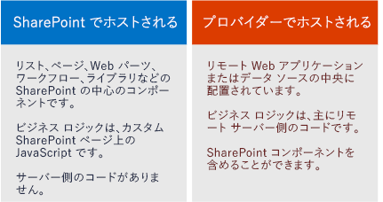

# SharePoint アドイン
SharePoint アドイン は、ユーザーが作成する SharePoint の Web サイトの自己完結型の拡張機能であり、この拡張機能は SharePoint サーバー上でカスタム コードを使用せずに動作します。
## SharePoint アドイン の概要

SharePoint アドイン には 2 つの基本的な種類、SharePoint ホスト型とプロバイダー ホスト型があります。シナリオの開発に適した種類について最適な決定をするには、SharePoint アドイン の両方の種類の共通点を学ぶことから始めます。

> **メモ**
> モバイル アプリなどのデバイスのアプリは、SharePoint にアクセスしていても実際には「SharePoint アドイン」ではありません。SharePoint 外から起動する Web アプリケーションも同じです。これらの種類のアプリを開発する場合は、「 [モバイルおよびネイティブ デバイス アプリからの SharePoint へのアクセス](http://msdn.microsoft.com/library/42014171-5ee5-421d-9cde-413efc3aecef%28Office.15%29.aspx)」を参照してください。 

- **すべての SharePoint アドイン は、** 適切に定義されたビジネス上の問題を解決する目的で SharePoint Web サイトの機能を拡張するために作成する機能の自己完結型の部分です。

- **アドインには、SharePoint サーバー上で実行するカスタム コードはありません** 。すべてのカスタム ロジックは、クラウドに「アップ」されたり、クライアント コンピューターに「ダウン」されたり、SharePoint ファームや SharePoint Online サブスクリプションを「越えて」外部のオンプレミス サーバーに提供されたりします。カスタム コードを SharePoint サーバーから切り離すことで、SharePoint 管理者は、アドインがサーバーに害を及ぼしたり、SharePoint Online Web サイトのパフォーマンスを低下させないことを確信できます。

- **SharePoint アドインのビジネス ロジックは、SharePoint に含まれるいくつかのクライアント API のうちのいずれかを使用して SharePoint データにアクセスできます** 。アドインに使用する API は、他の特定の設計上の決定に応じて異なります。

- **ページ、リスト、ワークフロー、カスタム コンテンツ タイプ、リスト テンプレート、Web パーツなどを含む主な種類の SharePoint コンポーネントは、ほぼすべて SharePoint アドインの一部にすることができます** 。

- **SharePoint アドインがインストールされ、ユーザーがアドインを起動する SharePoint Web サイトは、ホスト Web と呼ばれます。** しかし、SharePoint コンポーネントは一般に、アドイン Web と呼ばれるホスト Web の特別な子 Web の中にあります。

- **以下に挙げるいくつかの方法で、SharePoint アドインを SharePoint Web サイトに収めることができます** 。

|||
|:-----|:-----|
||**完全に没入型でページ全体に表示される形式** として (SharePoint ページと同じ外観にできます)。   |
||**Web ページの一部として (アドイン パーツと呼ばれる特別な種類のコントロールを使用して、** アドインを格納する iframe 要素を表示する)。   |
||**UI コマンドとして (リスト項目やドキュメントなどでリボンとメニューを拡張する)** 。   |
 
- **SharePoint Web サイトの [ **サイト コンテンツ**] ページに、ユーザーがインストールしたすべての SharePoint アドインのタイルがあります。** タイルをクリックすると、アドインを実行します。

- **SharePoint アドインは *アドイン マニフェスト*** を使用して構成されています。これは、アドインの基本的なプロパティ、アドインの実行場所、アドインの開始時に SharePoint が実行する内容を宣言している XML ファイルです。とりわけ、アドインでサポートされる言語、アドインが依存する SharePoint のサービスと機能、アドインが必要とするホスト Web へのアクセス権を指定できます (SharePoint アドインには独自のアドイン Web のフル コントロールがあります)。

- **SharePoint アドインはアドイン パッケージとして配布されます** 。このパッケージには、1 つ以上のアドイン マニフェストが必ず含まれています。(SharePoint コンポーネントがない場合、アドイン パッケージ内にアドイン マニフェストしかない場合もあります。) アドイン Web 内にアドインの SharePoint コンポーネントがある場合は、XML ファイルのセットとしてパッケージに組み込まれます。リモート Web アプリケーションやデータベースなど、SharePoint 外でホストされるリモート コンポーネントは、パッケージに組み込まれておらず、アドイン パッケージとは別に展開されます (しかし、アドイン マニフェストはリモート コンポーネントの URL を指定します)。

- **Office アドインがアドイン パッケージに組み込まれる場合もあります。** SharePoint アドインのインストール時に、Office アドインは SharePoint 内の Office アドイン カタログに追加されます。ユーザーは、このカタログから、Word や Excel のような Office アプリケーションにインストールできます。

> **ヒント**
> 開発可能な機能について理解するには、 [Office ストア](https://store.office.com/appshome.aspx?productgroup=SharePoint)で **いくつかの SharePoint アドインを参照してください** 。SharePoint 2013 Web サイトを開いて無料の SharePoint アドインをいくつかインストールするのもよい方法です。 **[サイト コンテンツ] | [アドインの追加] | [SharePoint ストア]** に移動するだけです。

### 熟練した SharePoint 開発者向けの注意点がいくつかあります。

カスタム サーバー側コードを含むセキュリティで保護されたソリューション の使用を廃止しました。JavaScript のみを含む「コードのない」セキュリティで保護されたソリューション や セキュリティで保護されたソリューション は引き続きサポートされています。

SharePoint アドインはサーバー側 SharePoint オブジェクト モデルを使用しません。SharePoint 2013 ではクライウント側オブジェクト モデルが大幅に拡張されています。SharePoint サーバー オブジェクト モデルの一部の API は、クライアント オブジェクト モデルでは使用できませんが、これらはほとんどすべて管理関連とセキュリティ関連のクラスです。Windows PowerShell スクリプトや従来の SharePoint ファーム ソリューション には、これらの領域に対処するカスタム SharePoint ロジックの方が適しています。SharePoint アドイン、従来の SharePoint ファーム ソリューション、セキュリティで保護されたソリューション の中からの選択については、「 [SharePoint アドインと SharePoint ソリューションの比較](http://msdn.microsoft.com/library/0e9efadb-aaf2-4c0d-afd5-d6cf25c4e7a8%28Office.15%29.aspx)」を参照してください。

## アドイン パッケージの配布または販売に関する 2 つの方法

次の 2 つの方法で、アドイン パッケージを配布できます。

- **組織のアドイン カタログに** 。これは、SharePoint Online サブスクリプションまたはオンプレミス ファーム内の専用の SharePoint サイト コレクションです。この方法は、アドインが特定の組織向けにオーダーメイドされている場合に使用します。

- **[Office ストア](https://store.office.com/appshome.aspx?productgroup=SharePoint)に** 。このストアは、検索から購入、更新まで、マーケティング プロセスを処理します。マイクロソフトは、Office ストア を通じてアドインを販売するのに役立つ **販売者ダッシュボード** を提供しています。

どちらかの方法でアドインを展開した後、SharePoint Web サイトの [ **アドインの追加**] ページでインストールできるようになります。ホスト Web かその親のサブスクリプションへのアクセス許可が必要なアドインの場合、SharePoint からそのアドインをインストールするユーザーに対してそれらのアクセス許可を付与するように求められます。

バグの修正や機能の追加のためにアドインを更新する必要がある場合は、アドイン マニフェスト内で変更を加えてアドインのバージョン番号を上げます。それから、アドイン パッケージをストアかアドイン カタログに再展開します。SharePoint の UI で、ユーザーは更新版が利用可能になったことを示す通知を 24 時間以内に受け取ります。1 回クリックするだけで更新版をインストールできます。

## 2 種類のSharePoint アドイン: SharePoint ホスト型とプロバイダー ホスト型

### SharePoint ホスト型 SharePoint アドイン

SharePoint ホスト型アドインは、アドイン Web 内の SharePoint コンポーネントでほぼすべて構成されます。中心が Sharepoint 内にあると表現されることもあります。

すべての SharePoint アドインと同様に、ユーザーは SharePoint ホスト型アドインを、そのインストール先の SharePoint Web サイトの [ **サイト コンテンツ**] ページ上のタイルから実行できます。オプションで、他にアドイン パーツとカスタム アクション (つまり、カスタムのリボン ボタンやメニュー項目) の 2 種類の UI コンポーネントをホスト Web 内に持つことができます。 **SharePoint ホスト型アドイン内の他のコンポーネントはすべてアドイン Web に展開されます。** これらのコンポーネントは、XML ファイルを使用して宣言的に定義され、とりわけ、次のものが含まれます。

||||
|:-----|:-----|:-----|
|カスタム ページ    |ワークフロー    |モジュール (ファイルのセット)    |
|リスト テンプレート    |リストとライブラリのインスタンス    |カスタム リスト フォームとビュー    |
|カスタム コンテンツ タイプ    |Web テンプレート    |組み込み列 (カスタム列ではない)    |
|組み込み Web パーツ (カスタム Web パーツではない)    |JavaScript ファイル    |アドイン Web 内のカスタムのボタンとメニュー項目    |
 

SharePoint ホスト型アドイン内のすべてのビジネス ロジックは JavaScript を、直接カスタム ページで使用するか、またはカスタム ページから参照される JavaScript ファイル内で使用します。JavaScript バージョンの SharePoint オブジェクト モデル (JSOM) を使用すると、アドインが SharePoint データに対して作成、読み取り、更新、削除 (CRUD) 操作を実行する方法を簡素化できます。

SharePoint ホスト型アドイン内のカスタム ページは、通常は ASP.NET ページ (ASPX) で、ASP.NET コントロールやインザボックス SharePoint コントロールを宣言的に参照できますが、背後にコードがない場合もあります。しかし、クライアント側レンダリング オプションやカスタム JavaScript を使用して SharePoint コントロールをカスタマイズできます。

SharePoint ホスト型アドイン内の JavaScript は、特別な JavaScript クロスドメイン ライブラリか特定の JavaScript WebProxy クラスのいずれかの、ブラウザーの同一生成元ポリシーを安全に回避する手法を使用して、アドイン Web 外のデータやリソースにアクセスできます。これらの手法を使用して、SharePoint ホスト型アドインはホスト Web、その親のサブスクリプション、またはインターネット上の任意の場所のデータを操作できます。

### プロバイダー ホスト型 SharePoint アドイン

SharePoint ホスト型アドイン内に組み込める SharePoint コンポーネントを、プロバイダー ホスト型アドインにも組み込めます。しかし、プロバイダー ホスト型アドインは、1 つ以上のリモート コンポーネント (SharePoint ファームや SharePoint Online サブスクリプションの外部でホストされる Web アプリケーション、サービス、データベースなど) が含まれている点が SharePoint ホスト型アドインと異なります。これは、SharePoint ファームと同じ企業ネットワーク内のサーバーや、クラウド サービスなどです。外部コンポーネントは、Linux、Apache、MySQL、PHP (LAMP) スタックなど、任意の Web ホスト型スタックでホストできます。

> **メモ**
> **「プロバイダー」は、サーバーやクラウド アカウントを所有する人です。** アドインのインストール場所の SharePoint ファームか SharePoint Online テナンシーを所有している会社や組織の場合もあります。しかし、アドインの開発者もプロバイダーになれます。通常、組織に対するアドインを作成する際には、その組織がホスティングを提供します。しかし、複数の組織に対するアドインを作成する際には、開発者がリモート コンポーネントをホストする場合が多くなります。SharePoint アドインが Office ストア を通じて販売される場合は、開発者はアドインの購入者の連絡先情報がわからないので、開発者によるホスティングが必要です。このシナリオでは、アドイン マニフェスト内で指定されているため、アドインのさまざまなインスタンスがリモート コンポーネントの URI を認識できます。

リモート コンポーネントに使用するホスティング フレームワークには高い柔軟性があります。Microsoft スタックを使用する必要はありません。LAMP (Linux、Apache サーバー、MySQL、PHP)、MEAN (MongoDB、ExpressJS、AngularJS、Nodejs)、Java、Python などの任意の Web ホスティング フレームワークを使用できます。Microsoft 以外の開発ツールを使用しても問題ありません。さらに、Microsoft 以外のクラウド サービスでリモート コンポーネントをホストできます。

特別な Chrome コントロールを使用して、 **アドイン内のリモート ページに SharePoint ページの外観を付与できます** 。

 **BLOB、キャッシュ、メッセージ キュー、コンテンツ配信ネットワーク (CDN)、データベースなどのリモート データを使用できます** 。リレーショナルやオブジェクト指向など、どの種類のデータベースでも使用できます。リモート データにはさまざまな方法でアクセスできます。たとえば、Business Connectivity Services (BCS) を使用して SharePoint リストのデータを表示できます。また別の選択肢としては、リモート Web アプリケーションのページ上のグリッドでデータを公開する方法があります。

 **SharePoint アドインは SharePoint API を使用して、SharePoint 機能に接続して統合します** 。そのような機能としては、検索、ワークフロー、ソーシャル ネットワーキング、分類、ユーザー プロファイル、BCS などがあります。これによってアプリはドキュメントの読み取り、検索の実行、人のつながりの構築、CRUD 操作などを行います。この API には以下の複数のセットがあります。

- .NET を使用してリモート コンポーネントが実装されている場合、マネージ コード **SharePoint クライアント側オブジェクト モデル (CSOM)** ライブラリを使用できます。

- .NET に基づいていないリモート コンポーネントの場合、SharePoint データにアクセスするために使用できる **REST/OData API** のセットがあります。OData インターフェイスの操作を選んだ場合, .NET クライアントから使用することもできます。

- 前述の **JSOM ライブラリ** はリモート ページでは使用できませんが、プロバイダー ホスト型アドインはアドイン Web 内にカスタム SharePoint ページを持つことができ、これらのページ上の JavaScript は JSOM ライブラリを使用できます。

 **SharePoint にアクセスするプロバイダー ホスト型アドインは、ユーザーやグループと同じくセキュリティ プリンシパルです** 。ユーザーの場合と同様に、アドインのプリンシパルが認証されて承認される必要があります。アドインには、ホスト Web 内の SharePoint データに対して操作を実行するアクセス許可が必要です。ほとんどのシナリオでは、SharePoint アドインを通じて SharePoint を操作するユーザーのアクセス許可として有効なのは、ユーザーのアクセス許可とアドインのアクセス許可の共通部分ですが、ユーザーがアクセス許可を持っていない操作をアドインを使用して実行できるシナリオもあります。

プロバイダー ホスト型アドインは、 **内部や公共の Web サービスに接続** できます。また SharePoint ホスト型アドインとは違って、ドキュメント ライブラリへのアイテムの追加など、 **SharePoint のリスト イベントやリスト項目イベントを処理** できます。

## SharePoint 開発パスの選択

始める準備ができていますか。

- **SharePoint 開発の経験が豊富な場合は、最初に SharePoint ホスト型アドインを使用することをお勧めします。** 過去に経験した種類の SharePoint 拡張に最も似ています。

     [SharePoint ホスト型の SharePoint アドインの作成を始める](get-started-creating-sharepoint-hosted-sharepoint-add-ins.md)

- **ASP.NET Web アプリケーション開発の経験が豊富な場合は、最初にプロバイダー ホスト型アドインを使用することをお勧めします。** それらは Web アプリケーションを中心にして開発されます。

     [プロバイダー ホスト型 SharePoint アドインの作成を始める](get-started-creating-provider-hosted-sharepoint-add-ins.md)

- **マイクロソフト以外のスタックでプロバイダー ホスト型アドインを開発する場合は、この記事で開始する方法を示します。**

  - ご使用のスタックに該当するツールをインストールしていない場合は、インストールします。

  - テストとデバッグを実行するために、Office 365 で開発者アカウントを作成します。詳細については、「 [Office 365 で SharePoint アドインの開発環境をセットアップする](set-up-a-development-environment-for-sharepoint-add-ins-on-office-365.md)」を参照してください。既に Office 365 サブスクリプションがある場合、必要な作業は [開発者向けサイトの作成](create-a-developer-site-on-an-existing-office-365-subscription.md)だけです。

  - アドインは SharePoint の REST/OData API を使用して SharePoint データに対する CRUD 操作を実行します。

  - 記事「 [SharePoint 2013 REST サービスの概要](get-to-know-the-sharepoint-2013-rest-service.md)」と、そこでリンクが貼られている他の記事で説明ドキュメントを確認してください。

  - 「 [SharePoint 2013 REST API リファレンス](http://msdn.microsoft.com/library/3514e753-19f9-4b41-a1ae-f35c5ffc17d2%28Office.15%29.aspx)」で参照ドキュメントを確認してください。

  - Visual Studio を使用していない場合は、アドイン マニフェスト ファイルとアドイン パッケージを作成する必要があります。詳細については、「 [SharePoint アドインのアプリ マニフェスト構造とパッケージを調べる](explore-the-app-manifest-structure-and-the-package-of-a-sharepoint-add-in.md)」を参照してください。Visual Studio と Microsoft Office Developer Tools for Visual Studio を使用してマニフェストとパッケージを作成すると、長時間の節約になる利点があります。別のツールを使用してリモート Web アプリケーション自体を作成する場合でも、この点を考慮することをお勧めします。 [Visual Studio の Community エディション](https://www.visualstudio.com/news/vs2013-community-vs.aspx)は無料です。

  - Microsoft 以外の言語とプラットフォームのプロバイダー ホスト型アドインのサンプルが、 [GitHub の OfficeDev セクション](https://github.com/OfficeDev)にあります ( [PHP-App-for-SharePoint](https://github.com/OfficeDev/PHP-App-for-SharePoint) など)。

> **メモ**
> SharePoint と Web 開発の初心者の方は、最初に Microsoft Virtual Academy の無料のコースを利用するか、または SharePoint 2013 の開発に関する資料を読むと、最大の益が得られます。 

## 関連項目

#### その他の技術情報

 [Microsoft SharePoint Server 2013 コア ソリューションの開発にすぐに着手する](http://www.microsoftvirtualacademy.com/training-courses/developing-microsoft-sharepoint-server-2013-core-solutions-jump-start)
