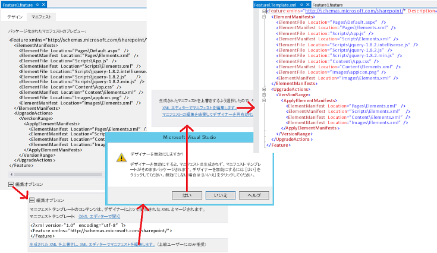

# SharePoint 2013 でアドイン Web コンポーネントを更新する
SharePoint アドインのページ、リスト、コンテンツ タイプ、および他のアドイン Web コンポーネントを更新します。
## アドイン Web コンポーネントを更新するための前提条件
<a name="Prerequisites"> </a>

「 [SharePoint アドインを更新する](update-sharepoint-add-ins.md)」およびそこに記載された前提条件と中心概念を把握しておく必要があります。


このトピックでは、「 [まったく新しいアドインであるかのように新しいバージョンを作成およびデバッグする](update-sharepoint-add-ins.md#DebugFirst)」で説明されているように、アドインの最新バージョンを開発し、テストしたと想定しています。


## アドイン Web の SharePoint コンポーネントの更新
<a name="UpdatingAppWeb"> </a>

アドイン Web に展開されるすべての SharePoint コンポーネントは、アドイン パッケージ内の **Web** スコープ フィーチャーに含まれます。そのため、これらのコンポーネントを更新することは 1 つ以上のフィーチャーを更新することになります。このプロセスは SharePoint 2010 から変わっておらず、SharePoint 2010 SDK の「 [[方法] 要素を既存の機能に追加する](http://msdn.microsoft.com/library/b007f419-e0d6-4e3a-a3ae-b8e448656d02%28Office.15%29.aspx)」で説明されています。「 [フィーチャーをアップグレードする](http://msdn.microsoft.com/library/e917f709-6491-4d50-adbe-2ab8f35da990%28Office.15%29.aspx)」ノードの他の記事も役に立つことがありますが、アドインは SharePoint サーバーにカスタム コードを含めることができないことを考慮に入れると、SharePoint 2010 のフィーチャー アップグレードの一部はアドインの更新とは関係がありません。たとえば、SharePoint アドインのフィーチャーをアップグレードする場合、 [CustomUpgradeAction](http://msdn.microsoft.com/library/16a2182e-80aa-4184-8071-8f717ee5c572%28Office.15%29.aspx) 要素を使用することはできません。


### 宣言してできることとできないこと

SharePoint ホスト型アドインの場合、アドインの更新には XML マークアップしか使用できず、更新プログラム内でアドインを宣言によって変更する方法にいくつかの制限があります。プロバイダー向けのホスト型アドインの場合、 [UpdatedEventEndpoint ハンドラー](create-a-handler-for-the-update-event-in-sharepoint-add-ins.md)を実装することにより、宣言によって実行できない処理が可能になります。


アドインへのコンポーネントの追加は簡単です。アドインに含めることのできるコンポーネントはすべて更新プログラムにも追加できます (アドインに含めることができるコンポーネントの詳細については、「 [SharePoint アドインに含めることができる SharePoint コンポーネントの種類](host-webs-add-in-webs-and-sharepoint-components-in-sharepoint-2013.md#TypesOfSPComponentsInApps)」を参照してください)。ただし、既存のコンポーネントを宣言して変更する場合は、以下の点を考慮してください。 


- どんな状況においても、初期配置の後に、リストやコンテンツ タイプ フィールド (列) のデータ タイプを変更することはできません。特に、アドイン更新の一部として、フィールドのデータ タイプを変更することはしないでください ( *プログラムを使用する場合も同様*  )。その代わり、新しいフィールドを追加することは可能です。アドインにカスタム アイテムの作成、編集、または表示のフォームが含まれている場合、それらのフォームに該当する変更を加えるようにしてください。たとえば、新しいフィールドに UI を追加し、古いフィールドから UI を削除します。(プロバイダー向けのホスト型アドインでは、プログラムを使用して古いフィールドから新しいフィールドにデータを移動し、その後古いフィールドを削除できます。)


- 更新マークアップにおいて、リスト、リスト インスタンス、コンテンツ タイプ、フィールドのどれについても、それを削除することはできません。


- 更新マークアップにおいて、アドイン Web からファイルを削除することはできません。しかし、ファイルの内容を変更することは可能です。


- Visual Studio Intellisense で利用可能として示されても、SharePoint アドインの更新中に **CustomUpgradeAction** 要素および **MapFile** 要素を使用することはできません。


### 初めてのアドイン Web の更新

このセクションの手順では、アドイン Web のコンテンツ タイプ、リスト、ファイル、および他の SharePoint コンポーネントを追加または更新する方法を説明します。わかりやすくするため、すべてのコンポーネントが Web アドインの 1 つのフィーチャーの一部であると想定しますが、Web アドインは複数のフィーチャーを持つことができ、一度の更新で 2 つ以上のフィーチャーを更新することができます。


Microsoft Office Developer Tools for Visual Studio は新しいアドインの作成に特化しており、ツールの既定の動作はアドインの更新には適していない場合があります。このプロセスをより詳細に制御するには、最初に以下の手順に従ってフィーチャー デザイナーを無効にし、生フィーチャー XML を直接編集できるようにします。 


### フィーチャー XML を編集するには


1. **[ソリューション エクスプローラー]** で _{FeatureName}_.features ファイルを開きます。それはフィーチャー デザイナーで開かれます。


2. [ **マニフェスト**] タブを開き、[ **オプションの編集**] を拡張します。


3. [ ** 生成された XML を上書きし、XML エディターでマニフェストを編集します。**] を選択にします。


4. デザイナーを無効にするプロンプトで [ **はい**] をクリックします。


5. ビューが開いたら、 **[XML エディターでマニフェストを編集します]** を選択します。 _{FeatureName}_.Template.xml ファイルが開かれます。 

   **フィーチャー XML エディターを開く**





> **注意**
> "<!-- -->" コメントを  _{FeatureName}_.features ファイルに追加しないでください。アップグレード インフラストラクチャではコメントはサポートされていません。ファイルにコメントがあると、アップグレードは失敗します。この記事のマークアップの例では、マークアップの移動先を示すためにのみコメントが使用されています。 


次の手順を使用して、アドイン Web フィーチャーを更新します。


### 初めてアドイン Web フィーチャーを更新するには


1. アドイン マニフェストでバージョン番号をインクリメントしたときに Office Developer Tools for Visual Studio によって実行されなかった場合 (ツールは、この操作をすべてのシナリオでは実行しないため、確認する必要があります) は、 [Feature](http://msdn.microsoft.com/library/265cd648-1a7e-410f-a1d7-0da8c64b4006%28Office.15%29.aspx) 要素の **Version** 属性をインクリメントしてください。アドインに使用するバージョン番号と同じ番号を使用する必要があります。アドインの他のコンポーネントが更新されるもののアドイン Web フィーチャー自体は更新されない場合も、フィーチャーのバージョンを上げることをお勧めします。 [VersionRange](http://msdn.microsoft.com/library/cd715e38-6ec3-43b2-8007-6d0ed8865d91%28Office.15%29.aspx) 要素のロジック (「 [アドイン Web の 2 回目以降の更新](#SubsequentUpgrades)」で説明) は、アドインのバージョンとフィーチャーのバージョンが常に同じであればより簡単に管理できます。 


2. ファイルの  [ElementManifests](http://msdn.microsoft.com/library/d8d4db7e-2bc2-40c6-958b-d5683bdee87a%28Office.15%29.aspx) セクションでは何も削除しないでください。このセクションからは何も削除されません。


3. 次の要素をファイルを追加します (まだ存在しない場合)。 

  - **Feature** 要素の [UpgradeActions](http://msdn.microsoft.com/library/5af24ac1-a290-454d-b32b-bc7f7a4634f0%28Office.15%29.aspx) 子要素。 **ReceiverAssembly** 属性または **ReceiverClass** 属性を要素に *追加しないでください*  。SharePoint アドインを更新するときは不要です (これらの属性はカスタム アセンブリを参照します。カスタム アセンブリは SharePoint アドインでサポートされていません。アドインにカスタム アセンブリを含めると、SharePoint でそのアドインはインストールされません)。


  - **UpgradedActions** 要素の **VersionRange** 子要素。 **BeginVersion** 属性または **EndVersion** 属性を要素に追加しないでください。アドインを初めて更新するときは不要です。その用途は「 [アドイン Web の 2 回目以降の更新](#SubsequentUpgrades)」で説明します。


  - **VersionRange** 要素の [ApplyElementManifests](http://msdn.microsoft.com/library/c087a0c3-1e27-4034-b4da-e025991454d6%28Office.15%29.aspx) 子要素。


    この時点で、ファイルは次の例のようになります。

    > **重要**
      > Office Developer Tools for Visual Studio は既に上記のマークアップを追加し、いくつかの要素を **ElementManifests** セクションから **ApplyElementManifests** セクションに例としてコピーしていることがあります。これらを削除してください。後の手順でそれらのいくつかを元に戻すことになる場合もありますが、空の **ApplyElementManifests** セクションで開始するほうが簡単で安全です。変更されていない冗長なエントリがコンポーネントにあると、更新処理に時間がかかりすぎてタイムアウトになり失敗するなど、悪い結果が生じることがあります。


 ```XML

<Feature <!-- Some attributes omitted -->
               Version="2.0.0.0">
  <ElementManifests>
    <!-- ElementManifest elements omitted -->
  </ElementManifests>
  <UpgradeActions>
   <VersionRange>
     <ApplyElementManifests>
   
     </ApplyElementManifests>
   </VersionRange>
  </UpgradeActions>
</Feature>
 ```


### コンポーネントをアドインに追加するには


1. 新しい SharePoint アドインプロジェクトを作成する場合と同じように、新しいコンポーネントをフィーチャーに追加します。


2. 以前のバージョンではリストのなかったアドインにリストを追加するなど、以前のバージョンのアドインにはなかった種類のコンポーネントを追加する場合、Office Developer Tools for Visual Studio はプロジェクトに elements.xml ファイルを追加します。これは、コンポーネントの要素マニフェストです。このファイルには、アドインの新しいバージョン番号 (elements.2.0.0.0.xml など) を追加する必要があります。これは、トラブルシューティングの際に役立ちます。 **[ソリューション エクスプローラー]** 内で変更することにより、それに応じてファイル内 (csproj ファイルなど) のリファレンスやフィーチャー XML も変更されるようにします。


3. それぞれの新しい要素マニフェストでは、 [ElementManifest](http://msdn.microsoft.com/library/5a6a2865-5d31-45a2-a402-6da6e0f5567a%28Office.15%29.aspx) 要素をフィーチャー XML の **ElementManifests** 要素と **ApplyElementManifests** 要素の両方に子として追加します。(まったく同じ **ElementManifest** 要素を両方の場所に追加します。) 要素の **Location** 属性は elements.2.0.0.0.xml ファイルの相対パスを指している必要があります。たとえば、CustomList という名前のリストを追加した場合、 **ElementManifest** 要素は次のようになります。

 ```XML

<ElementManifest Location="MyCustomList\\elements.2.0.0.0.xml" />
 ```

4. コンポーネントの種類の一部は、ファイルをプロジェクトに追加します。たとえば、リストを追加すると schema.xml ファイルが作成され、ページを追加するとページ ファイルが作成されます。それぞれのファイルで、 [ElementFile](http://msdn.microsoft.com/library/bd43638e-8f18-4a0d-b122-1c055f97aa71%28Office.15%29.aspx) 要素を **ElementManifests** 要素に子として追加します。( **ApplyElementManifests** 要素には追加しません。) **Location** 属性は、ファイルの相対パスを指している必要があります。たとえば、リストを追加した場合、schema.xml の **ElementFile** 要素は次のようになります。

 ```XML
  <ElementFile Location="MyCustomList\\Schema.xml" />
 ```

5. 以前のバージョンのアドインに既に存在した種類の別のアイテムを追加する場合、Office Developer Tools for Visual Studio は新しい要素マニフェストを作成するのではなく、既存の要素マニフェストに新しいアイテムに対するリファレンスを追加します。たとえば、標準的な方法でアドイン Web にページを追加する場合は、 **[ソリューション エクスプローラー]** の **[ページ]** ノードを右クリックし、 **[追加] | [新しいアイテム] | [ページ] | [追加]** の順に移動します。Office Developer Tools for Visual Studio は、新しい要素マニフェストを作成するのではなく、既存の要素マニフェスト ファイル (通常は elements.xml と呼ばれる) 内の **Pages** モジュールに新しい **File** 要素を追加します。

    これは最善の方法ではありません。ベスト プラクティスは、可能なら、アドインを更新するときに既存の要素マニフェスト ファイル (つまり、以前のバージョンのアドインの要素マニフェスト) を編集しないことです。通常、新しいアイテムは新しい要素マニフェスト ファイルに含めます (フィーチャー XML の **ApplyElementManifests** 要素で参照されるのが新しいアイテムです)。(この方法の例外のいくつかは後で説明します。) 例として、新しいページを追加する場合は、次の手順を実行します。

1. Pages.2.0.0.0 という名前の新しいモジュールを作成します。


2. Office Developer Tools for Visual Studio によって自動的に追加された sample.txt ファイルを削除します。


3. 新しいモジュール内の要素マニフェストの名前を elements.2.0.0.0.xml に変更します。


4. **[Pages.2.0.0.0]** モジュールを右クリックし、 **[追加] | [新しいアイテム] | [ページ] | [追加]** の順に移動します。新しいページが作成され、 **[ページ]** ではなく、 **[Pages.2.0.0.0]** の要素マニフェストで参照されます。


5. フィーチャー XML の **ElementManifests** 要素の新しいページに **ElementsFile** 要素があることを確認し、 **ElementManifests** セクションと **ApplyElementManifests** セクションの両方に elements.2.0.0.0.xml ファイルの **ElementManifest** 要素があることを確認します。


    Office Developer Tools for Visual Studio が既存の要素マニフェストを変更したあらゆる状況における別のオプションとして、手動で新しい elements.2.0.0.0.xml を作成し、古いマニフェストに追加されたマークアップを新しいマニフェストに移動します。(必要に応じて、新しいマニフェストを古いマニフェストと同じ **[ソリューション エクスプローラー]** ノードに配置できます。)


6. フィーチャーのコンテンツ タイプにフィールドを追加する場合、 [AddContentTypeField](http://msdn.microsoft.com/library/cb04a3ac-f41a-4ffe-aaa1-d4bf3fb6347d%28Office.15%29.aspx) 要素を **VersionRange** セクションに追加します。 **ContentTypeId** 属性と **FieldId** 属性に正しい値を割り当ててください。また、 **PushDown** 属性を使用して、新しいフィールドを派生コンテンツ タイプに追加するかどうか指定することもできます。次に例を示します。

 ```XML
  <VersionRange>
  <AddContentTypeField 
    ContentTypeId="0x0101000728167cd9c94899925ba69c4af6743e"
    FieldId="{CCDD361F-A3FB-40D8-A272-3A3C858F4116}"
    PushDown="TRUE" />
  <!-- Other child elements of VersionRange -->
</VersionRange>
 ```


### アドインの既存のコンポーネントを変更するには


1. Default.aspx ファイルなどの要素マニフェスト ファイルで参照されるファイルを変更した場合は、ファイルの **ElementFile** 要素を変更する必要はありません。ただし、古いバージョンのファイルを新しいファイルに置き換えるよう、更新インフラストラクチャに要求する必要はあります。これは、モジュールの **ElementManifest** 要素を **ApplyElementManifests** セクションに追加することによって行います。同様の要素が **ElementManifests** セクションに既に存在するため、1 つのオプションとして単純にその要素を **ApplyElementManifests** に (移動ではなく) コピーできますが、これは、マニフェストで参照されたファイルがすべて変更された場合にのみ推奨される方法です。通常の方法として、変更されていないファイルをそのコピーで置き換えることはしません。状況によっては悪い影響が生じる可能性があります。たとえば、ユーザーがカスタマイズできるようにページが構成されている場合、置き換えられことによってカスタマイズが削除される可能性があります。(既にページを変更したのであれば、この結果を受け入れる必要がありますが、理由なしに顧客が同じ不便を経験しないようにする必要があります。)

    モジュール内の変更されたファイルだけが置き換えられるようにするには、次の手順に従って、変更されたファイルのみを参照するモジュールの 2 つ目の要素マニフェストを作成し、2 つ目のマニフェストを **ApplyElementManifests** に適用します。

1. **[ソリューション　エクスプローラー]** でモジュールのノードを右クリックし、(ページではなく) elements.2.0.0.0.xml という名前の XML ファイルを追加します。


2. **[ソリューション　エクスプローラー]** で新しいファイルを選択して [プロパティ] ウィンドウを表示させ、 **Deployment Type** のプロパティを **[ElementManifest]** に変更します。これは、Office Developer Tools for Visual Studio がファイルのプロパティを処理するための重要な手順です。


3. 元のマニフェストのコンテンツを新しいマニフェストにコピーし、 **変更されていない** ファイルに対応するすべての [File](http://msdn.microsoft.com/library/c270e4ce-8110-4da7-b0e7-c223604bfce7%28Office.15%29.aspx) 要素を新しいマニフェストから削除します。


4. 次の例に示すように、新しいマニフェスト ファイルを参照する **ApplyElementManifests** セクションに **ElementManifest** 要素を追加します。

 ```XML

<ElementManifest Location="Pages\\elements.2.0.0.0.xml" />
 ```


    > **メモ**
      >  元のマニフェストを削除しないでください。フィーチャー XML では、古いマニフェストと新しいマニフェストの両方が使用されます。> **ElementFile** で参照されているファイルが変更された場合でも、 **ElementFile** 要素を **ElementManifests** セクションから **ApplyElementManifests** セクションにコピーしないでください。
2. **ApplyElementManifests** セクションで参照されたすべての要素マニフェスト ファイルを開いて、すべての [File](http://msdn.microsoft.com/library/c270e4ce-8110-4da7-b0e7-c223604bfce7%28Office.15%29.aspx) 要素に **ReplaceContents** 属性があり、 **TRUE** に設定されていることを確認します。以下に例を示します。これは Office Developer Tools for Visual Studio によって既に実行されているかもしれませんが、確認してください。以前のバージョンのアドインの要素マニフェストに対してもそのようにしてください。これは、既存の要素マニフェスト ファイルを編集するのが有効な数少ない方法の 1 つです。

 ```XML
  <Module Name="Pages">
  <File Path="Pages\\Default.aspx" Url="Pages/Default.aspx" ReplaceContent="TRUE" />
</Module>
 ```

3. 「 [アドイン Web の Web ページに Web パーツを含める](include-a-web-part-in-a-webpage-on-the-add-in-web.md)」で説明されているように、ページには Web パーツを埋め込むことができます。Web パーツ付きのページを変更する (または Web パーツのプロパティを変更する) 場合は、追加の手順があります。以下のマークアップをページに追加して、SharePoint が Web パーツの 2 つ目のコピーをページに追加しないようにします。マークアップは、ID  `PlaceHolderAdditionalPageHead` を使用して **asp:Content** 要素に追加する必要があります。(初めてページを作成したときに、Office Developer Tools for Visual Studio によって既に追加されているかもしれませんが、マークアップがあることを確認してください。)

 ```XML

<meta name="WebPartPageExpansion" content="full" />
 ```


    > **メモ**
      >  ユーザーがカスタマイズできるようにページが構成されている場合、このマークアップによってカスタマイズが削除されるという副作用があります。ユーザーはカスタマイズし直す必要があります。>  「 [アドイン Web の Web ページに Web パーツを含める](include-a-web-part-in-a-webpage-on-the-add-in-web.md)」のガイダンスに従って Web パーツがページに追加された場合、Web パーツ マークアップは要素マニフェストに含まれます。そのため、Web パーツのプロパティの変更は、アドインの更新の一部として要素マニフェスト ファイルを編集しないという通常のルールの例外です。 
4. ページの変更の代替オプションとして、以下の手順に従って、新しいページへのリダイレクトを使用することもできます。 

1. 上記の「 **コンポーネントをアドインに追加するには** 」の手順で説明されているように、新しいページを作成し、そのページの更新マークアップを構成します。


2. 古いページを開き、ID  `PlaceHolderAdditionalPageHead` を使用して、 **asp:Content** 要素からすべてのマークアップを削除します。


3. 以下のマークアップを **asp:Content** 要素に追加し、 _{RelativePathToNewPageFile}_ を新しいパスとファイル名に置き換えます。このスクリプトによりブラウザーが新しいページにリダイレクトされ、クエリ パラメーターが追加されます。さらに、古いページがブラウザーの履歴から排除されます。

 ```
  <script type="text/javascript">
        var queryString = window.location.search.substring(1);
        window.location.replace("{RelativePathToNewPageFile}" + "?" + queryString);
</script>
 ```

4. ページにある他のすべての **asp:Content** 要素を削除します。


5. 置き換える対象のページがアドインのスタート ページの場合、アドイン マニフェストの **StartPage** 要素を変更して、新しいページを参照するようにします。


5. アドインのアドイン Web に **CustomAction** または **ClientWebPart** が含まれており、更新の一部としてそれを変更する場合、これらのコンポーネントが定義される場所である要素マニフェストを変更する必要があります。(これは、アドインを更新するときに要素マニフェスト ファイルを以前のアドインのバージョンから編集しないという通常の方法の例外です。) さらに、 **ElementManifest** 要素を **ElementManifests** セクションから **ApplyElementManifests** セクションに (移動ではなく) コピーする必要があります。


#### 初めてアドインをアップグレードするためのフィーチャー XML の例

初めてアドインを更新するための完全な  _{FeatureName}_.Template.xml ファイルの例を次に示します。この例で更新されるアドインには、 `Pages\\Elements.xml` ファイルで参照されている変更済みの Default.aspx ファイルが入っていて、3 つの新しい jQuery ファイルを展開します。それぞれのファイルが、 `Scripts\\Elements.xml` ファイルで参照されています。すべての **ElementFile** が **ElementManifests** セクションに入ること、および `<ElementManifest Location="Pages\\Elements.xml" />` が **ElementManifests** セクションから **ApplyElementManifests** セクションに (移動ではなく) コピーされる方法に注目してください。



```XML

<Feature xmlns="http://schemas.microsoft.com/sharepoint/" Title="MyApp Feature1"
      Description="SharePoint Add-in Feature" Id="85d309a8-107e-4a7d-b3a2-51341d3b11ff" 
      Scope="Web" Version="2.0.0.0">
  <ElementManifests>
    <ElementFile Location="Pages\\Default.aspx" />
    <ElementManifest Location="Pages\\Elements.xml" />
    <ElementFile Location="Content\\App.css" />
    <ElementManifest Location="Content\\Elements.xml" />
    <ElementFile Location="Images\\AppIcon.png" />
    <ElementManifest Location="Images\\Elements.xml" />
    <ElementFile Location="Scripts\\jquery-3.0.0.intellisense.js" />
    <ElementFile Location="Scripts\\jquery-3.0.0.js" />
    <ElementFile Location="Scripts\\jquery-3.0.0.min.js" />
  </ElementManifests> 
  <UpgradeActions>
      <VersionRange>  
        <ApplyElementManifests>
          <ElementManifest Location="Pages\\Elements.xml" />
          <ElementManifest Location="Scripts\\elements.2.0.0.0.xml" />
        </ApplyElementManifests>
      </VersionRange>
  </UpgradeActions>
</Feature>

```


### アドイン Web の 2 回目以降の更新
<a name="SubsequentUpgrades"> </a>

SharePoint アドインを 2 回目 (または 3 回目以降) に更新する場合、一部の顧客は前の更新を行っていない可能性を考慮に入れる必要があります。したがって、最新の更新が組織のアドイン カタログまたは Office ストア に展開された後、更新プログラムが利用できることを示すプロンプトにユーザーが応答した場合、1 回の更新プロセスでアドインのインスタンスが複数バージョンにわたって更新されることがあります。ほとんどの場合、アドインの以前のすべてのバージョンは最新バージョンに更新する必要があります。しかし、アドインのすべてのインスタンスに対してアドイン Web フィーチャーのすべての更新アクションが常に再実行されることが望ましいわけではありません。特定のアドイン インスタンスに対しては複数回実行してはいけない更新アクションもあります。たとえば、1 つの更新でフィールドをコンテンツ タイプに追加した場合、その次の更新でそのフィールドを再び追加する必要がない場合があります。次の手順は、 **VersionRange** 要素を使用して、更新対象のフィーチャーのバージョンに基づいて実行する更新アクションを制御する方法を示します。


### 後の更新でアドイン Web フィーチャーを変更するには


1. 前述の手順「 **フィーチャー XML を編集するには** 」で説明したように編集対象の _FeatureName_.Template.xml ファイルを開き、 [Feature](http://msdn.microsoft.com/library/265cd648-1a7e-410f-a1d7-0da8c64b4006%28Office.15%29.aspx) 要素の **Version** 属性をインクリメントします。フィーチャーにはアドインに使用した番号と同じバージョン番号を使用する必要があります。

    この例では、以前にアドインをバージョン 1.0.0.0 からバージョン 2.0.0.0 に更新しており、現在はバージョン 3.0.0.0 に更新しようとしているとします。したがって、 **Version** 属性を 3.0.0.0 に設定します。


2. 既存のすべての **VersionRange** の下に新しい **VersionRange** 要素を追加します。この要素に **BeginVersion** 属性や **EndVersion** 属性は *追加しないでください*  。


3. 「 **初めてアドイン Web フィーチャーを更新するには** 」の手順で説明したように、 **VersionRange** 要素にデータを読み込んで、フィーチャーのこの更新バージョンで行った変更を反映させます。この手順で **ApplyElementManifests** セクションが参照されるときには常に、追加したばかりの **VersionRange** 要素の子である **ApplyElementManifests** 要素 (フィーチャー XML ファイル内の *最下位*  の要素) を参照しているものとして扱います。


4. 以前の **VersionRange** 要素 － アドインを最後に (この例では 1.0.0.0 から 2.0.0.0 に) 更新したときに追加したもの － に移動し、 **EndVersion** 属性を追加します。この **VersionRange** のアップグレード アクションは、まだ適用されていないアドインのバージョン (バージョン 1.0.0.0) に適用する必要がありますが、既に適用済みのバージョン (バージョン 2.0.0.0) には再適用する必要がありません。 **EndVersion** 値は *排他的*  であるため、この値はアップグレード アクションを *適用しない*  最も小さいバージョンに設定します。この例では 2.0.0.0 に設定します。ファイルは次のようになります。

 ```XML

<Feature <!-- Some attributes omitted -->
               Version="3.0.0.0">
  <ElementManifests>
    <!-- ElementManifest elements omitted -->
  </ElementManifests>
  <UpgradeActions>
    <VersionRange EndVersion="2.0.0.0">
      <!--  Child elements for upgrade from 1.0.0.0 to 2.0.0.0 go here. -->
    </VersionRange>
   <VersionRange>
      <!--  Child elements for upgrade from 2.0.0.0 to 3.0.0.0 go here. -->
   </VersionRange>
  </UpgradeActions>
</Feature>
 ```


    フィーチャーをアップグレードするごとに、同じパターンを実行します。最新更新アクションに対して新しい **VersionRange** を追加します。次に、 **EndVersion** 要素を *前の* **VersionRange** 要素に追加し、前のバージョン番号に設定します。この例で、3.0.0.0 から 4.0.0.0 への更新ではファイルは次のようになります。


 ```XML

<Feature <!-- Some attributes omitted -->
               Version="4.0.0.0">
  <ElementManifests>
    <!-- Child elements omitted -->
  </ElementManifests>
  <UpgradeActions>
    <VersionRange EndVersion="2.0.0.0">
       <!-- Child elements for upgrade from 1.0.0.0 to 2.0.0.0 go here. -->
    </VersionRange>
    <VersionRange EndVersion="3.0.0.0">
       <!-- Child elements for upgrade from 2.0.0.0 to 3.0.0.0 go here. -->
    </VersionRange>
    <VersionRange>
       <!-- Child elements for upgrade from 3.0.0.0 to 4.0.0.0 go here. -->
    </VersionRange>
  </UpgradeActions>
</Feature>
 ```


    最新の **VersionRange** 要素には **BeginVersion** 属性や **EndVersion** 属性がないことに注意してください。この **VersionRange** 要素のアップグレード アクションはフィーチャーの以前のすべてのバージョンに適用されます。これは、最新の変更内容はすべてこの **VersionRange** で参照されており、フィーチャーのインスタンスにはいずれもまだ反映していないためです。

    また、 **BeginVersion** 属性はいずれの **VersionRange** でも使用されていないことにも注意してください。これは、 **BeginVersion** 属性の既定の値が 0.0.0.0 であるためです。また、すべてのアップグレード アクションは **EndVersion** 属性で指定されるバージョンより前のアドインのすべてのインスタンスに適用するためにこの値が必要な値だからです。

    > **重要**
      > **VersionRange** 要素によって、アップグレードの適用先のフィーチャーのバージョンだけが決定されます。更新が利用できることを示す通知を取得するアドインのバージョンは決定されません。この通知は、アドインのバージョン番号によってのみトリガーされます。アドインの新しいバージョンが組織のアドイン カタログまたは Office ストア で利用可能になってから 24 時間以内に、アドインのすべてのインストール済みインスタンスでは、バージョンに関係なく、更新が利用できることを示す通知が [ **サイト コンテンツ**] ページのタイルに表示されます。 > **VersionRange** は新規にアップグレードされたフィーチャーまたは新規に更新されたアドインの新しいバージョン番号には影響を与えません。これら 2 つの番号は、アップグレード前のフィーチャーのバージョン範囲とは関係なく、常に最新のバージョン番号に変更されます。これも、 **BeginVersion** 属性の使用を避けた方がいい理由の 1 つです。 **BeginVersion** 属性を使用すると、特定のアドイン インスタンスに対する特定のアップグレード アクションの実行をブロックすることができます。しかし、フィーチャーまたはアドインのバージョンを最新バージョンにしないようブロックすることはできません。したがって、 **BeginVersion** 属性を使用すると、アドインの 2 つのインスタンスが同じアドイン バージョン番号と同じアドイン Web フィーチャー バージョン番号を持つが、アドイン Web には異なるコンポーネントを持つ可能性があります。

## アドイン Web コンポーネントの展開の確認
<a name="VerifyDeployAppWebComp"> </a>

アドイン Web フィーチャーとそのコンポーネントの展開を確認するには、次の手順に従います。


### アドイン Web のプロビジョニングを確認するには


1. ホスト Web の [ **サイトの設定**] ページを開きます。[ **サイト コレクションの管理**] セクションで [ **サイト階層**] リンクを選択します。


2. [ **サイト階層**] ページに、アドイン Web が URL で表示されます。アドイン Web を開始する代わりに、URL をコピーし、その URL を残りのステップで使用します。


3.  _URL_of_app_web_/_layouts/15/ManageFeatures.aspx に移動し、開かれた **[サイトの機能]** ページで、フィーチャーがフィーチャーのアルファベット順の一覧のメンバーであり、その状態が **[アクティブ]** であることを確認します。


4. アドイン Web フィーチャーにカスタム サイト列が含まれている場合、 _URL_of_app_web_/_layouts/15/mngfield.aspx を開き、開かれた [ **サイト列**] ページで新しいカスタム サイト列が表示されていることを確認します。


5. アドイン Web フィーチャーにカスタム コンテンツ タイプが含まれている場合、 _URL_of_app_web_/_layouts/15/mngctype.aspx を開き、開かれた [ **サイト コンテンツ タイプ**] に新しいコンテンツ タイプが表示されていることを確認します。


6. カスタム コンテンツ タイプごと、および列を追加したコンテンツ タイプごとに、コンテンツ タイプへのリンクを選択します。開かれた [ **サイト コンテンツ タイプ**] ページで、必要なサイト列がコンテンツ タイプにあることを確認します。 


7. アドイン Web フィーチャーにリスト インスタンスがある場合、 _URL_of_app_web_/_layouts/15/mcontent.aspx を開き、開かれた [ **サイトのライブラリとリスト**] ぺージで、各カスタム リスト インスタンスの [ **"name_of_list" のカスタマイズ**] リンクがあることを確認します。


8. これらのカスタム リスト インスタンスごとに、[ **"name_of_list " のカスタマイズ**] リンクを選択し、リスト設定ページで、リストに想定されるコンテンツ タイプと列があることを確認します。

    > **メモ**
      > ページに [ **コンテンツ タイプ**] セクションがない場合は、コンテンツ タイプの管理を有効にする必要があります。[ **詳細設定**] リンクを選択し、[詳細設定] ページでコンテンツ タイプの管理を有効にして、[ **OK**] を選択します。前のページに戻ると、[ **コンテンツ タイプ**] セクションの一覧が表示されます。 
9. ページの上部にはリストの **Web アドレス**があります。リスト インスタンス定義にサンプル項目を含めた場合、アドレスをコピーし、ブラウザーのアドレス バーに貼り付け、リストに移動します。リストには作成したサンプル項目があることを確認します。


## 次の手順
<a name="Next"> </a>

「 [アドイン更新の主要な手順](update-sharepoint-add-ins.md#MajorAppUpgradeSteps)」に戻るか、SharePoint アドインの次の主要コンポーネントを更新する方法を説明する次の記事の 1 つに直接移動します。


-  [SharePoint 2013 でホスト Web コンポーネントを更新する](update-host-web-components-in-sharepoint-2013.md)


-  [SharePoint アドインで更新イベント用のハンドラーを作成する](create-a-handler-for-the-update-event-in-sharepoint-add-ins.md)


-  [SharePoint アドインのリモート コンポーネントを更新する](update-remote-components-in-sharepoint-add-ins.md)


## その他の技術情報
<a name="bk_addresources"> </a>


-  [SharePoint アドインを更新する](update-sharepoint-add-ins.md)


- Microsoft SharePoint 2010 Software Development Kit (SDK) の 「 [[方法] 要素を既存の機能に追加する](http://msdn.microsoft.com/library/b007f419-e0d6-4e3a-a3ae-b8e448656d02%28Office.15%29.aspx)」


- Microsoft SharePoint 2010 Software Development Kit (SDK) の「 [フィーチャーをアップグレードする](http://msdn.microsoft.com/library/e917f709-6491-4d50-adbe-2ab8f35da990%28Office.15%29.aspx)」


