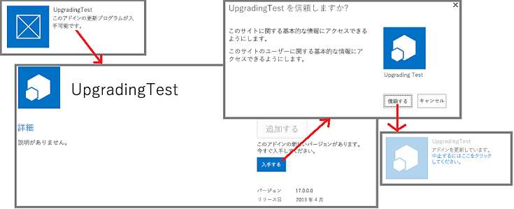
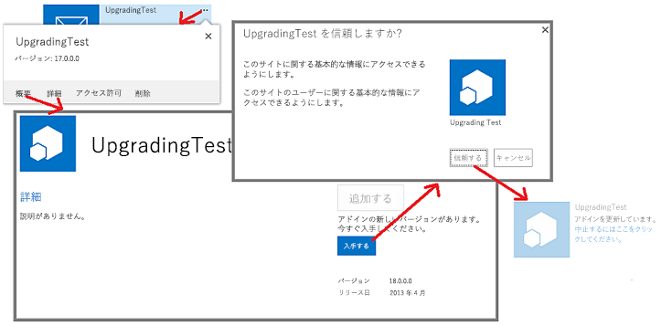

# SharePoint アドインを更新する
SharePoint アドインの更新プログラムを作成および展開する方法について説明します。
SharePoint アドインを更新するには、SharePoint 2013 に組み込まれている更新サポートを使用できます。更新されたバージョンのアドインを組織のアドイン カタログにアップロードするか、アドインが Office ストアで受け付けられてから 24 時間以内に、アドインがインストールされている各 Web サイトの [ **サイト コンテンツ**] ページの横に、更新プログラムが利用可能なことを示す通知が表示されます。図 1 でわかるように、すぐに更新プログラムをインストールするためのリンクがユーザーに表示されます。
  
    
    

**図 1. SharePoint 用アドインの更新プロセス**

  
    
    

  
    
    

  
    
    
ユーザーは、最初に以前のバージョンをアンインストールすることなく、更新プログラムをインストールできます。更新プログラムのインフラストラクチャにより、そのインストールがテストされ、エラーがある場合はロールバックされます。
    
> [!重要]
> 更新システムを使用して *アドインの種類*  を変更することはできません。 たとえば、更新プログラムによって SharePoint によってホストされるアドインからプロバイダーでホストされるアドインに変更することはできません。 種類を変更するには、 [古いアドインを新しいアドインに移行する必要があります](sharepoint-add-ins-update-process.md#Major)。特に、 [自動ホスト型アドインのプレビュー プログラムの提供は終了](http://blogs.office.com/2014/05/16/update-on-autohosted-apps-preview-program/)したので、自動ホスト型アドインをプロバイダー向けのホスト型アドインに更新できなくなったことにご注意ください。該当するアドインは、「 [自動ホスト型 SharePoint アドインをプロバイダー向けのホスト型アドインに変換する](convert-an-autohosted-sharepoint-add-in-to-a-provider-hosted-add-in.md)」で説明されているように変換する必要があります。 
  
    
    

## SharePoint アドインを更新するための前提条件

  
    
    

- アドインの分離用に構成された SharePoint 2013 のテスト インストール。Office 365 開発者向けサイト をセットアップする方法については、「 [Office 365 で SharePoint アドインの開発環境をセットアップする](set-up-a-development-environment-for-sharepoint-add-ins-on-office-365.md)」を参照してください。
    
  
- 通常、SharePoint アドインの作成に使用されるツールは、その更新にも使用されます。たとえば、ほとんどの開発者は Visual Studio および Microsoft Office Developer Tools for Visual Studio を使用して SharePoint アドインを作成します。
    
  

### SharePoint アドインの更新に関して知っておく必要がある中心概念

  
    
    

**表 1. SharePoint アドインの更新に関する中心概念**

|**記事のタイトル**|**説明**|
|:-----|:-----|
| [SharePoint アドインを開発およびホスティングするためのパターンを選択する](choose-patterns-for-developing-and-hosting-your-sharepoint-add-in.md)   |SharePoint アドインのさまざまな種類について説明します。更新プロセスは種類に応じて異なります。    |
| [SharePoint アドインの更新プロセス](sharepoint-add-ins-update-process.md)   |SharePoint アドインの更新プロセスについて説明します。    |
| [フィーチャーをアップグレードする](http://msdn.microsoft.com/library/e917f709-6491-4d50-adbe-2ab8f35da990%28Office.15%29.aspx)   |機能 (SharePoint 2010 SDK) の更新方法について説明します。    |
| [SharePoint アドインの展開とインストール: 方法とオプション](deploying-and-installing-sharepoint-add-ins-methods-and-options.md)   |SharePoint アドイン の発行、インストール、およびアンインストールの方法を説明します。    |
| [SharePoint アドインのイベントの処理](handle-events-in-sharepoint-add-ins.md)   |SharePoint 2013 のリモート イベント レシーバーについて説明します。    |
   

## アドイン更新の主要な手順

SharePoint アドイン用の更新プログラムを作成するときに必要になる可能性がある主要な手順を以下に示します。各手順については、リンク先のセクションや記事で詳細に説明しています。各更新プロジェクトですべての手順が必要になるわけではありません。実行する必要がある操作は、アドインに既にあるコンポーネントと、追加するコンポーネントによって異なります。 ***** でマークされた項目のみが必須です。
  
    
    

- アドイン マニフェストを更新します。
    
  - ***** appmanifest.xml ファイルの [App](http://msdn.microsoft.com/library/d5f30dfe-7500-5f85-0f08-f4f220c0c692%28Office.15%29.aspx) 要素で **Version** 番号を大きくします (スキーマが初めてリリースされたときは、アドインが「アプリ」と呼ばれていました)。 **ProductID** 番号は変更 *しないで*  ください。
    
  
  - appmanifest.xml ファイルの  [AppPermissionRequests](http://msdn.microsoft.com/library/4e617622-78d3-3d23-677d-9957eb1fb107%28Office.15%29.aspx) セクションを変更します。
    
  
  - appmanifest.xml ファイルの  [AppPrerequisites](http://msdn.microsoft.com/library/7622b55f-01a1-2c39-9daa-7cfb1a3c890f%28Office.15%29.aspx) セクションを変更します。
    
  

    詳細については、「 [アドインのバージョン、アクセス許可要求、および前提条件を更新する](#UpdateManifest)」を参照してください。
    
  
- アドイン Web コンポーネントのマークアップを追加または更新します。詳細については、「 [SharePoint 2013 でアドイン Web コンポーネントを更新する](update-add-in-web-components-in-sharepoint-2013.md)」を参照してください。
    
  
- ホスト Web コンポーネントのマークアップを追加または更新します。詳細については、「 [SharePoint 2013 でホスト Web コンポーネントを更新する](update-host-web-components-in-sharepoint-2013.md)」を参照してください。
    
  
-  [UpgradedEventEndpoint](http://msdn.microsoft.com/library/09a93d44-d295-47bb-f91c-d243178b0f53%28Office.15%29.aspx) にカスタム ロジックを追加し、appmanifest.xml ファイルに登録します。詳細については、「 [SharePoint アドインで更新イベント用のハンドラーを作成する](create-a-handler-for-the-update-event-in-sharepoint-add-ins.md)」を参照してください。
    
  
- リモート コンポーネントを更新します。
    
  - プロバイダーでホストされるアドインについては、ホストするプラットフォームのスタックに対して適切な技法を使用してリモート コンポーネントを更新します。
    
  

    詳細については、「 [SharePoint アドインのリモート コンポーネントを更新する](update-remote-components-in-sharepoint-add-ins.md)」を参照してください。
    
  
- ***** アドイン パッケージを Office ストアまたは組織のアドイン カタログにアップロードします。
    
  

## アドイン更新のベスト プラクティス

以下のセクションでは、従う必要がある手法と、更新プログラムを計画する際に考慮する重要な点について説明します。
  
    
    

### 本当に更新する必要があるかどうか判断する

プロバイダーでホストされた SharePoint アドインの場合、アドインの機能を強化した場合に、必ずしもアドインを更新する必要はありません。すべての変更の対象がリモート コンポーネントであり、それらの変更を SharePoint コンポーネントに反映する必要がない場合、アドインを更新しなくてもリモート コンポーネントを変更できます。SharePoint コンポーネントがリモート コンポーネントにアクセスするために使用する URL と接続文字列に変更がない場合、SharePoint アドインは引き続き動作します。たとえば、以前に Web アプリケーションが読み取らなかった SharePoint リストから列を読み取るリモート Web アプリケーションにボタンを追加する場合、リストに既に列が存在する場合は、SharePoint で何も変更する必要はありません。変更した Web ページと、背後にある変更したコードまたは JavaScript をリモート Web アプリケーションにアップロードできます。新しい機能は、ユーザーが SharePoint アドインを起動すると即座に利用可能になります。
  
    
    

### 更新はユーザーにとってオプションであることに留意する

Office ストアまたは組織のアドイン カタログで新しいバージョンの SharePoint アドインが利用可能になると、[ **サイト コンテンツ**] ページのアドインのタイトルにメッセージが表示され、更新プログラムが利用可能であることがユーザーに通知されます。このメッセージは 24 時間以内に表示されます。ただし、SharePoint インフラストラクチャ内でユーザーに更新を強制するものはありません。このため、リモート コンポーネントに対して行う変更によって、アドインの古いバージョンが壊されないようにする必要があります。あまり一般的ではありませんが、ここでの全般的な規則として、リモート コンポーネントには *追加*  のみを行い、既存のコンポーネントのスキーマ、接続文字列、または URL の削除、名前の変更、移動、または変更は避ける必要があります。
  
    
    
リモート コンポーネントが、その呼び出し元のアドイン インスタンスのバージョンを知る必要がある場合、この情報を SharePoint から渡すことができます。たとえば、アドインのバージョンをアドインの  [StartPage](http://msdn.microsoft.com/library/3092674c-a6c3-9021-3d7e-e716562a4a4f%28Office.15%29.aspx) URL のクエリ パラメーターとして追加できます。
  
    
    

### まったく新しいアドインであるかのように新しいバージョンを作成およびデバッグする

新しいバージョンのアドインの開発とデバッグは、更新のマークアップとロジックのデバッグから分離する必要があります。そのためには、開発テスト用 SharePoint サイトから以前のバージョンのアドインをアンインストールします。以前のバージョン用のアドイン パッケージ ファイルのバックアップ コピーを保存します。必要に応じてアドインのコンポーネントを追加および変更し、最初から作成するまったく新しいアドインであるかのように、テスト サイトに対してアドインをテストおよびデバッグします。
  
    
    

### 以前のバージョンの各アドインで更新プログラムをテストする

新しいバージョンのアドインが "新しい" アドインとして正しく機能している場合は、コードとマークアップを再構築し、プロジェクトが古いアドインの更新となるようにします。たとえば、「 [アドイン更新の主要な手順](#MajorAppUpgradeSteps)」に示されているようにアドインのバージョン番号を増加させます。プロジェクトの更新プログラムへの変換の詳細については、このトピックの子トピックを参照してください。
  
    
    
更新プログラムのテスト準備が整ったら、テスト サイトから新しいバージョンを除外し、以前のバージョンを再展開して、更新ロジックをテストできるようにします。以前のバージョンのアドインを複数公開した場合は、以前の各バージョンをテスト サイトの異なるサブ Web にインストールします。次に、最新バージョンのアドインをテスト サイトのアドイン カタログにアップロードし、アドインの各インスタンスを更新します。各インスタンスにアドインの最新バージョン番号とすべてのコンポーネントの最新バージョンがあることを確認します。アドインにアドイン Web がある場合は、アドイン Web コンポーネントが「 [アドイン Web コンポーネントの展開の確認](update-add-in-web-components-in-sharepoint-2013.md#VerifyDeployAppWebComp)」の手順を使用して展開されたことを確認します。
  
    
    

### 24 時間待たずにアドインを更新する

SharePoint テスト サイトでアドインの更新プログラムを開発している場合、次の更新までに 24 時間待つのは現実的ではありません。開発者 (および実働 SharePoint サイトのユーザー) は、以下の手順を使用して、Office ストアまたは組織のアドイン カタログにアップロードされた直後にアドインを更新できます。
  
    
    

### アドインをすぐに更新するには

1. 最新の更新プログラムがアドイン カタログにアップロードされたら、アドインがインストールされている Web サイトの [ **サイト コンテンツ**] ページを開き、アドインのタイルにある [ **...**] ボタンを選択します。
    
  
2. 表示される吹き出しで、[ **バージョン情報**] タブを選択します。表示される [ **バージョン情報**] ページで、新しいバージョンが利用可能であることを示す通知を確認します。
    
  
3. [ **取得**] ボタンを選択します。[ **サイトのコンテンツ**] ページが再度開き、アドインが更新中であるという通知がアドインのタイルに表示されます。
    
  
図 2 に、これらの手順を示します。
  
    
    

**図 2. SharePoint アドインをすぐに更新するプロセス**

  
    
    

  
    
    

  
    
    

    
> [!メモ]
> 24 時間ごとよりも頻繁にアドインのタイルに "更新プログラムが利用できます" という通知を表示する必要がある場合は、「 [SharePoint アドインの更新プロセス](sharepoint-add-ins-update-process.md#Minor)」で説明している方法を使用して、すぐに通知を表示することができます。 
  
    
    

## アドインのバージョン、アクセス許可要求、および前提条件を更新する

Visual Studio プロジェクト フォルダーのバックアップ コピーを作成した後に、アドイン プロジェクトを開きます。アドイン マニフェストを開き、マニフェスト デザイナーの [ **全般**] タブでバージョン番号を増加させます。
  
    
    
アドインの更新されたバージョンに必要なホスト Web のコンポーネントに対するアクセス許可が増えた (または減った) 場合は、必要に応じてアドインの  [AppPermissionRequests](http://msdn.microsoft.com/library/4e617622-78d3-3d23-677d-9957eb1fb107%28Office.15%29.aspx) セクションを変更します。Visual Studio で、マニフェスト デザイナーの [ **アクセス許可**] タブを使用します。アドインが更新されると、アクセス許可の数が以前のバージョンから変更されたかどうかに関係なく、ユーザーは必ずアクセス許可を付与するように要求されます。新しいバージョンに必要なアクセス許可が以前のバージョンよりも *少ない*  場合でも、以前のバージョンの余分なアクセス許可が *無効になることはありません*  。最新バージョンに必要なアクセス許可へのアドインを制限するには、ユーザーがアドインの更新後にページ *{SharePointDomain}*  `/_layouts/15/appinv.aspx` を開いてから、 [AppPermissionRequests](http://msdn.microsoft.com/library/4e617622-78d3-3d23-677d-9957eb1fb107%28Office.15%29.aspx) スキーマに適合するアクセス許可のマークアップを手動で入力するしかありません。
  
    
    
アドインの更新されたバージョンに、以前のバージョンになかった前提条件がある (または以前のバージョンにあった一部の前提条件がなくなった) 場合は、必要に応じてアドインの [ [AppPrerequisites](http://msdn.microsoft.com/library/7622b55f-01a1-2c39-9daa-7cfb1a3c890f%28Office.15%29.aspx)] セクションを変更します。Visual Studio で、マニフェスト デザイナーの [ **前提条件**] タブを使用します。
  
    
    

## 次の手順

「 [アドイン更新の主要な手順](#MajorAppUpgradeSteps)」の次の項目に進むか、次のいずれかの記事に直接移動します。
  
    
    

-  [SharePoint 2013 でアドイン Web コンポーネントを更新する](update-add-in-web-components-in-sharepoint-2013.md)
    
  
-  [SharePoint 2013 でホスト Web コンポーネントを更新する](update-host-web-components-in-sharepoint-2013.md)
    
  
-  [SharePoint アドインで更新イベント用のハンドラーを作成する](create-a-handler-for-the-update-event-in-sharepoint-add-ins.md)
    
  
-  [SharePoint アドインのリモート コンポーネントを更新する](update-remote-components-in-sharepoint-add-ins.md)
    
  

## その他の技術情報

-  [SharePoint アドインの開発](develop-sharepoint-add-ins.md)
    
  
-  [SharePoint アドインの更新プロセス](sharepoint-add-ins-update-process.md)
    
  

