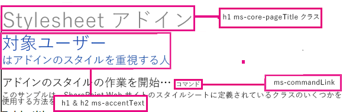

# SharePoint アドインで SharePoint Web サイトのスタイル シートを使用する
SharePoint で SharePoint アドイン Web サイトのスタイル シートを使用する方法について説明します。
SharePoint アドインでは、SharePoint で SharePoint Web サイトのスタイル シートを参照し、このスタイル シートを使用して Web ページのスタイルを設定できます。さらに、だれかが SharePoint Web サイトのスタイル シートまたはテーマを変更した場合は、アドインでのスタイル シートの参照を変更せずに、アドインで一連の新しいスタイルを採用できます。


> **重要**
> Web ページでクロム コントロールまたはアドイン マスター ページを使用している場合は、既にスタイルが利用できる状態になっているので、この記事の手順を使用してスタイル シートを手動で参照する必要はありません。 


## この記事で示されている例を使用するための前提条件
<a name="SP15Usestylesheetcontrol_Prereq"> </a>

 [プロバイダー ホスト型 SharePoint アドインの作成を始める](get-started-creating-provider-hosted-sharepoint-add-ins.md) で説明するように、開発環境が必要です。


### SharePoint アドインで SharePoint のスタイル シートを使用する前に理解しておくべき主要な概念

以下の表は、SharePoint のスタイル シートを使用するシナリオに関連する概念を理解するのに役立つ有益な記事を示しています。


**表示 1. スタイル シートを使用する前に理解しておくべき主要な概念**


|**記事のタイトル**|**説明**|
|:-----|:-----|
| [SharePoint アドイン](sharepoint-add-ins.md) <br/> |エンドユーザー向けの小型で使いやすいソリューションであるアドインを作成できる、SharePoint の新しいアドイン モデルについて説明します。  <br/> |
| [SharePoint アドインの UX 設計](ux-design-for-sharepoint-add-ins.md) <br/> |SharePoint アドインの作成時に使用できるユーザー エクスペリエンス (UX) オプションと代替方法について説明します。  <br/> |
| [SharePoint 2013 のホスト Web、アドイン Web、および SharePoint コンポーネント](host-webs-add-in-webs-and-sharepoint-components-in-sharepoint-2013.md) <br/> |ホスト Web とアドイン Web の違いについて説明します。SharePoint アドインに含めることのできる SharePoint コンポーネント、ホスト Web に展開するコンポーネント、アドイン Web に展開するコンポーネント、およびアドイン Web を分離ドメインに展開する方法について説明します。  <br/> |
 

## コード例: SharePoint アドインで SharePoint Web サイトのスタイル シートを使用する
<a name="SP15Usestylesheetcontrol_Example"> </a>

このコード例では、SharePoint Web サイトのスタイルシートを使用する方法を示します。これを利用すると、リモート Web アプリケーションのページを SharePoint ホスト Web のページと一致した外観にすることができます。


SharePoint アドインでスタイル シートを使用するには、次の手順を実行します。


1. プロバイダー ホスト型の SharePoint アドイン を作成します。


2. 空白のページを作成してアドイン Web のプロビジョニングを強制的に実行します。


3. Web ページを Web プロジェクトに追加し、スタイル シートを参照します。


4. アドイン マニフェストの要素を編集します。


図 1 は、スタイル シートを使用している SharePoint Web ページを示しています。


**図 1. スタイル シートを使用している Web ページ**





### SharePoint アドイン プロジェクトとリモート Web プロジェクトを作成するには


1. 管理者として Visual Studio を開きます (そのためには、[ **スタート**] メニューの Visual Studio アイコンを右クリックし、[ **管理者として実行**] を選択します)。


2. 「 [プロバイダー ホスト型 SharePoint アドインの作成を始める](get-started-creating-provider-hosted-sharepoint-add-ins.md)」で説明するように、プロバイダー向けのホスト型 SharePoint アドイン を作成して、StylesheetAdd-in という名前を付けます。


### 空白のページを作成してアドイン Web のプロビジョニングを強制的に実行するには


1. SharePoint アドイン プロジェクトを右クリックし、新しいモジュールを追加します。


2. 新しいモジュールを右クリックし、新しいアイテムを追加します。


3. [ **Visual C# アイテム**]、[ **Web**] の下で、[ **HTML ページ**] を選択します。ページの名前を **blank.html** に変更します。


4. blank.html の内容を削除します。


### スタイル シートを参照する Web ページを Web プロジェクトに追加するには


1. Web プロジェクトを右クリックし、新しい Web フォームを追加します。Web フォームの名前を **StyleConsumer.aspx** に変更します。


2. Web フォームの .aspx ファイルの内容を下のコードに置き換えます。このコードは次のタスクを実行します。

  - アドイン Web から blank.html ページを非表示の IFrame に読み込む。


  - アドイン Web から defaultcss.ashx ファイルを読み込む。


  - 提供されているスタイルを使用する。


 ```

<%@ Page Language="C#" AutoEventWireup="true" CodeBehind="StyleConsumer.aspx.cs" Inherits="StylesheetAppWeb.StyleConsumer" %>

<!DOCTYPE html>
<html>
<head>
    <title>Add-in using stylesheet</title>
</head>
<body>

    <!-- The main page title -->
    <h1 class="ms-core-pageTitle">Stylesheet add-in</h1>

    <!-- Some subtitle -->
    <h1 class="ms-accentText">For people</h1>

    <!-- Subtitle comments -->
    <h2 class="ms-accentText">who care about the style in their add-ins</h2>
    <p></p>
    <div>
        <h2 class="ms-webpart-titleText">Get started with style in your add-in... </h2>
        <a class="ms-commandLink" href="#">some command</a>
        <br />
        This sample shows you how to use some of the classes defined in the SharePoint website's style sheet.
    </div>

    <!-- Script to load SharePoint resources
        and load the blank.html page in
        the invisible iframe
        -->
    <script type="text/javascript">
        "use strict";
        var appweburl;

        (function () {
            var ctag;

            // Get the URI decoded add-in web URL.
            appweburl =
                decodeURIComponent(
                    getQueryStringParameter("SPAppWebUrl")
            );
            // Get the ctag from the SPClientTag token.
            ctag =
                decodeURIComponent(
                    getQueryStringParameter("SPClientTag")
            );

            // The resource files are in a URL in the form:
            // web_url/_layouts/15/Resource.ashx
            var scriptbase = appweburl + "/_layouts/15/";

            // Dynamically create the invisible iframe.
            var blankiframe;
            var blankurl;
            var body;
            blankurl = appweburl + "/Pages/blank.html";
            blankiframe = document.createElement("iframe");
            blankiframe.setAttribute("src", blankurl);
            blankiframe.setAttribute("style", "display: none");
            body = document.getElementsByTagName("body");
            body[0].appendChild(blankiframe);

            // Dynamically create the link element.
            var dclink;
            var head;
            dclink = document.createElement("link");
            dclink.setAttribute("rel", "stylesheet");
            dclink.setAttribute("href", scriptbase + "defaultcss.ashx?ctag=" + ctag);
            head = document.getElementsByTagName("head");
            head[0].appendChild(dclink);
        })();

        // Function to retrieve a query string value.
        // For production purposes you may want to use
        //  a library to handle the query string.
        function getQueryStringParameter(paramToRetrieve) {
            var params;
            var strParams;

            params = document.URL.split("?")[1].split("&amp;");
            strParams = "";
            for (var i = 0; i < params.length; i = i + 1) {
                var singleParam = params[i].split("=");
                if (singleParam[0] == paramToRetrieve)
                    return singleParam[1];
            }
        }
    </script>
</body>
</html>

 ```


場合によっては、ユーザーが SharePoint で認証されるまで、ページでスタイル指定用の CSS とイメージをダウンロードできないことがあります。リンク タグでは、まだサインインしていないユーザーは自動的に認証されません。アドイン Web からページ リソースを Web ページに読み込んで、CSS ファイルにリンクする前にユーザーの認証を強制的に行うことを検討してください。この例では、blank.html ページが非表示の IFrame に読み込まれます。


### アドイン マニフェストの StartPage 要素を編集するには


1. **ソリューション エクスプローラー**で、 **AppManifest.xml** ファイルをダブルクリックします。


2. [ **スタート ページ**] ドロップダウン メニューで、スタイル シートを使用する Web ページを選択します。


### ソリューションをビルドして実行するには


1. SharePoint アドイン プロジェクトがスタートアップ プロジェクトとして設定さていることを確認します。


2. F5 キーを押します。

    > **メモ**
      > F5 キーを押すと、Visual Studio によってソリューションが構築され、アドインが展開され、アドインのアクセス許可ページが表示されます。 
3. [ **信頼する**] ボタンを選択します。


4. [ **StylesheetBasic**] アドイン アイコンをクリックします。


5. 図 2 は、結果として表示される、SharePoint のスタイルを使用した Web ページを示しています。

   **図 2. ページでのスタイル シートの使用**


6. ホスト Web に移動してテーマを変更することもできます。そのあとで、アドインの Web ページを再読み込みすると、新しいスタイルが使用されます。


**表 2. ソリューションのトラブルシューティング**


|**問題**|**解決策**|
|:-----|:-----|
|Visual Studio で F5 キーを押してもブラウザーが開かない。  <br/> |SharePoint アドイン プロジェクトをスタートアップ プロジェクトとして設定してください。  <br/> |
|証明書エラー。  <br/> |Web プロジェクトの [ **SSL 有効** ] プロパティを false に設定します。SharePoint アドイン プロジェクトで、[ **Web プロジェクト** ] プロパティを [なし] に設定し、プロパティを Web プロジェクトの名前に戻します。  <br/> |
 

## 次の手順
<a name="SP15Usestylesheetcontrol_Nextsteps"> </a>

この記事では、SharePoint アドインでスタイル シートを使用する方法について説明しました。次の手順として、SharePoint アドインで使用可能なその他の UX コンポーネントについて学ぶことができます。詳細については、以下を参照してください。


-  [コード例: アドインでの SharePoint スタイル シートの使用](http://code.msdn.microsoft.com/SharePoint-2013-Use-the-7a8684e2)


-  [SharePoint アドインのクライアント クロム コントロールを使用する](use-the-client-chrome-control-in-sharepoint-add-ins.md)


-  [カスタム アクションを作成して SharePoint アドインで展開する](create-custom-actions-to-deploy-with-sharepoint-add-ins.md)


-  [アドイン パーツを作成して SharePoint アドインと共にインストールする](create-add-in-parts-to-install-with-your-sharepoint-add-in.md)


## その他の技術情報
<a name="SP15Usestylesheetcontrol_Addresources"> </a>


-  [SharePoint アドインの UX 設計](ux-design-for-sharepoint-add-ins.md)


-  [SharePoint アドインの UX 設計ガイドライン](sharepoint-add-ins-ux-design-guidelines.md)


-  [SharePoint 2013 での UX コンポーネントの作成](create-ux-components-in-sharepoint-2013.md)


-  [SharePoint アドインの設計オプションを考慮するときの 3 つの方法](three-ways-to-think-about-design-options-for-sharepoint-add-ins.md)


-  [SharePoint アドインのアーキテクチャおよび開発環境に関する重要な要素](important-aspects-of-the-sharepoint-add-in-architecture-and-development-landscap.md)


