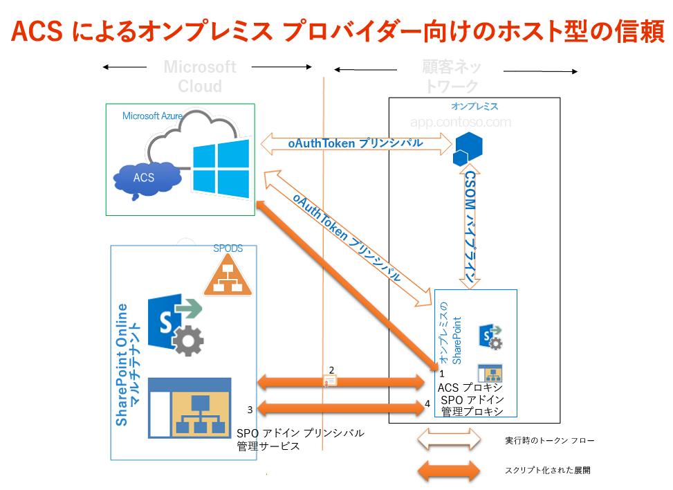

# Office 365 SharePoint サイトを使用してオンプレミスの SharePoint サイトのプロバイダー向けのホスト型アドインに権限を付与する
Office 365 SharePoint サイトを使用して、プロバイダーでホストされたアドインと社内の SharePoint 2013 ファーム間の信頼関係を ACS を使用して確立できる環境を作成します。これは Office 365SharePoint サイト用アドインを開発するのとまったく同じです。
## 社内環境においてプロバイダー ホスト型アドインと共に ACS を使用するための前提条件
<a name="Prerequisites"> </a>

次のものがあることを確認します。


- 社内の SharePoint 2013 開発環境。「 [SharePoint アドインのオンプレミスの開発環境をセットアップする](set-up-an-on-premises-development-environment-for-sharepoint-add-ins.md)」を参照してください。


- Office 365 SharePoint サイト。まだこのサイトがなく、開発環境をすばやく設定することを希望する場合は、「 [Office 365 で SharePoint アドインの開発環境をセットアップする](set-up-a-development-environment-for-sharepoint-add-ins-on-office-365.md)」の手順に従ってください。


- リモートでインストールされているか、SharePoint 2013 のインストール先コンピューターにインストールされている  [Visual Studio 2012](https://www.microsoft.com/ja-jp/download/details.aspx?id=30682)。


-  [Microsoft Office Developer Tools for Visual Studio 2012](https://msdn.microsoft.com/ja-jp/office/aa905340.aspx)。


- SharePoint 2013 をインストールしたコンピューターにインストールされた 64 ビット版の  [Microsoft Online Services サインイン アシスタント](http://www.microsoft.com/ja-jp/download/details.aspx?id=41950)。


- SharePoint 2013 をインストールしたコンピューターにインストールされた  [Windows PowerShell 用 Microsoft Online Services モジュール (64 ビット)](http://go.microsoft.com/fwlink/p/?linkid=236297)。


## 証明書を作成し、SharePoint 2013 の社内インストールのセキュリティ トークン サービス (STS) 証明書にする
<a name="Certificate"> </a>

SharePoint 2013 の社内インストールの既定のセキュリティ トークン サービス (STS) 証明書を、独自の証明書に置き換える必要があります。この記事では、IIS の [ **自己署名入り証明書の作成**] オプションを使用してテスト証明書を作成およびエクスポートする方法の例を示します。また、証明書発行機関によって発行された商用証明書を使用することもできます。


 [最初にテスト用の .pfx 証明書ファイルを作成してから、対応するテスト用 .cer ファイル](http://msdn.microsoft.com/ja-jp/library/windows/hardware/ff552299%28v=vs.85%29.aspx)を作成します。


 [MakeCert テスト プログラムを使用してテスト用 X.509 証明書を作成する](http://msdn.microsoft.com/ja-jp/library/ms537364%28VS.85%29.aspx)こともできます。


### テスト用の .pfx 証明書ファイルを作成するには


1. IIS マネージャーの左側のツリー ビューで、<サーバー名> ノードを選択します。


2. 図 1 に示すように [ **サーバー証明書**] を選択します。

   **図 1. IIS の [サーバー証明書] オプション**


!\[IIS でのサーバー証明書オプション](images/e38f9b7f-59a3-468c-bcde-a48272f1f217.gif)


3. 図 2 に示すように、右側のリンク セットの [ **自己署名入り証明書の作成**] リンクをクリックします。

   **図 2. [自己署名入り証明書の作成] リンク**


!\[[自己署名入り証明書の作成] リンク](images/3f0aae5a-e58b-4ec8-b67f-0024abfa2dab.gif)


4. 証明書に「SampleCert」という名前を付け、[ **OK**] を選択します。


5. 図 3 に示すように、証明書を右クリックし、[ **エクスポート**] を選択します。

   **図 3. テスト証明書のエクスポート**


!\[テスト証明書のエクスポート](images/997021de-c60c-46b0-961f-7e1e63c0f619.gif)


6. 任意の場所にファイルをエクスポートし、パスワードを指定します。この例では、パスワードは **password** です。運用環境では、強力なパスワードを使用してください。「 [強力なパスワード作成のガイドライン](http://msdn.microsoft.com/ja-jp/library/bb416446.aspx)」および「 [強力なパスワード](http://msdn.microsoft.com/ja-jp/library/ms161962.aspx)」を参照してください。


## 証明書を、SharePoint 2013 の社内インストールの STS 証明書にします。
<a name="STSCertificate"> </a>

これで証明書を作成したので、これを社内 SharePoint ファームの STS 証明書にします。


管理者として SharePoint 管理シェルを開き、この Windows PowerShell スクリプトを実行します。



```

$certPrKPath = "c:\\location of your .pfx file"
$certPassword = "password"
$stsCertificate = New-Object System.Security.Cryptography.X509Certificates.X509Certificate2 $certPrKPath, $certPassword, 20
Set-SPSecurityTokenServiceConfig -ImportSigningCertificate $stsCertificate -confirm:$false

```


> **メモ**
>  [SharePoint 2013 ハイブリッド環境に関する資料のページ](http://www.microsoft.com/ja-jp/download/details.aspx?id=35593)からダウンロードして利用できる「 [SharePoint Server 2013 および Office 365 で一方向のハイブリッド環境を構成する](http://download.microsoft.com/download/6/4/4/644BA525-96CB-4739-B08F-18949A9BDADC/sps-2013-config-one-way-hybrid-environment.docx)」という文書では、社内ファームの既定の STS 証明書を既知の証明書発行機関の証明書または自己署名証明書に置き換える方法をさらに詳細に説明しています。 


## ACS を使用するように SharePoint 2013 の社内インストールを構成する
<a name="ConnectAAD"> </a>

図 4 に、社内サイトで実行されるプロバイダー ホスト型アドインのアーキテクチャ全体の中で必要な接続を有効にするための 4 つの手順を示します。また、アドイン実行時の OAuth トークンのフローも示します。


**図 4. Office 365 SharePoint サイトを使用して ACS を SharePoint の社内インストールで動作させる**





1. 社内 SharePoint 2013 ファームで ACS プロキシを作成します。


2. 社内サーバーの署名証明書を Office 365 テナンシーにインストールします。


3. アドインを実行する SharePoint 2013 ファームのサイトの完全修飾ドメイン名を、Office 365 テナンシーのサービス プリンシパル名コレクションに追加します。


4. SharePoint 2013 ファームでアドイン管理プロキシを作成します。


次の関数は、ACS を使用するように社内 SharePoint 2013 サイトを構成するためのすべての操作を実行します。以前の構成を削除する必要がある場合は、この関数を使用してクリーンアップ タスクのいくつかを実行することもできます。PowerShell で関数を実行するにはさまざまな方法があります。その 1 つの方法を次に示します。


1. 社内 SharePoint サーバーで、関数のコードをテキスト ファイルにコピーし、MySharePointFunctions.psm1 という名前で次の (両方ではなく) いずれかのフォルダーに保存します。存在していないフォルダーを含む場合は、パスの一部を作成しなければならない場合があります。いずれの場合も、パスの最下位のフォルダーは、ファイルと同じ名前である必要があります。

    > **ヒント**
      > ファイルは UTF-8 ではなく ANSI 形式で保存する必要があります。PowerShell で ANSI 以外の形式のファイルを読み込むと、構文エラーが表示される場合があります。Windows メモ帳では、既定で ANSI 形式で保存されます。その他のエディターを使用してファイルを保存するときは、必ず ANSI 形式で保存します。 

  -  `C:\\users\\username\\documents\\windowspowershell\\modules\\MySharePointFunctions`。ここで、 _username_ はファイルを実行するファーム管理者です。


  -  `C:\\windows\\system32\\windowspowershell\\V1.0\\modules\\MySharePointFunctions`


2. 管理者として SharePoint 管理シェルを開き、次のコマンドレットを実行して MySharePointFunctions モジュールが表示されることを確認します。

 ```

Get-Module -listavailable
 ```

3. 次のコマンドレットを実行してモジュールをインポートします。

 ```
  Import-Module MySharePointFunctions
 ```

4. 次のコマンドレットを実行して、モジュールの一部として Connect-SPFarmToAAD 関数が表示されることを確認します。

 ```
  Get-Command -module MySharePointFunctions
 ```

5. 次のコマンドレットを実行して、Connect-SPFarmToAAD 関数が読み込まれることを確認します。

 ```
  ls function:\\ | where {$_.Name -eq "Connect-SPFarmToAAD"}
 ```

6.  `Connect-SPFarmToAAD` 関数を実行します。必ず、開発者環境に適用される必須のパラメーターと省略可能なパラメーターを指定します。詳細と例については、次のセクションを参照してください。


### Connect-SPFarmToAAD 関数のパラメーター
<a name="parameters"> </a>


|**パラメーター**|**値**|
|:-----|:-----|
| `-AADDomain` (必須) <br/> |Office 365 サイト ( _yourcustomdomain_.onmicrosoft.com) にサインアップしたときに作成した *.onmicrosoft.com ドメイン。スクリプトによって認証を求められたときは、このドメイン用に作成したユーザー名とパスワード ( _username_@ _yourcustomdomain_.onmicrosoft.com) を使用します。  <br/> |
| `-SharePointOnlineUrl` (必須) <br/> |Office 365 SharePoint サイトの URL ( _https://yourcustomdomain_.sharepoint.com)。親ドメインは onmicrosoft.com では *ありません*  。 <br/> |
| `-SharePointWeb` (必須の場合あり) <br/> |プロバイダーでホストされるアドインを実行する社内 SharePoint Web アプリケーションの完全な URL (プロトコルを含む)。この関数は、社内ファームから ACS に 1 つの SharePoint Web アプリケーションのみを追加します。この値を指定しない場合、スクリプトはファームの最初の Web アプリケーションを選択します。ワイルドカード ( _http://*.contoso.com_ など) で定義できるホスト名サイト コレクション (HNSC) を使用している場合は、その文字列をこのパラメーターの値として使用できます。Web アプリケーションにインターネット ゾーンの代替アクセス マッピング (AAM) がある場合、その AAM の URL をこのパラメーターに使用する必要があります。SharePoint Web アプリケーションが HTTPS 対応で構成されていない場合、HTTP をプロトコルとして使用し、 *-AllowOverHttp スイッチを使用する必要があります (この表の下部を参照)*  。 <br/> ACS を使用する、プロバイダーでホストされるアドインをファームのより多くの Web アプリケーションで実行する場合、それらのアドインをサービス プリンシパル名コレクションに追加する必要があります。以下の Windows PowerShell スクリプトの  `Connect-SPFarmToAAD` 関数に続く部分に、ファームのすべての Web アプリケーションをプリンシパル名コレクションに追加する方法を示します。 <br/> |
| `-AllowOverHttp` (省略可能) <br/> |開発環境で作業していて、アドインに SSL を使用しない場合は、このスイッチを使用します。SharePoint Web アプリケーションが HTTPS 対応で構成されていない場合は、このスイッチを使用する必要があります。  <br/> |
| `-O365Credentials` (省略可能) <br/> |最初の文字はゼロではなく大文字の "O" です。デバッグ目的でスクリプトを繰り返し実行している場合は、このスイッチを使用すると、O365 の名前とパスワードを毎回手動で入力しなくても済みます。このパラメーターを使用する前に、次のコマンドレットを使用して、パラメーターに渡す資格情報オブジェクトを作成する必要があります。  <br/>```$User = "username@yourcustomdomain.onmicrosoft.com"$PWord = ConvertTo-SecureString -String "the_password" -AsPlainText -Force$Credential = New-Object -TypeName System.Management.Automation.PSCredential -ArgumentList $User, $PWord``` `-O365Credentials` パラメーターの値として `$Credential` を使用します。 <br/> |
| `-Verbose` (省略可能) <br/> |このスイッチは、関数が動作せず、デバッグのために再実行する必要がある場合に役立つ、より詳細なフィードバックを生成します。  <br/> |
| `-RemoveExistingACS` (省略可能) <br/> |Microsoft Azure Active Directory への既存の接続を置き換える場合に、このスイッチを使用します。ファームで既に作成していた場合、既存の ACS プロキシは削除されます。  <br/> |
| `-RemoveExistingSTS` (省略可能) <br/> |Microsoft Azure Active Directory への既存の接続を置き換える場合は、このスイッチを使用します。ACS への以前の接続で残った、既存の信頼済みのセキュリティ トークン発行元が削除されます。  <br/> |
| `-RemoveExistingSPOProxy` (省略可能) <br/> |Microsoft Azure Active Directory への既存の接続を置き換える場合は、このスイッチを使用します。ファームで既に作成していた場合、既存のアドイン管理プロキシは削除されます。  <br/> |
| `-RemoveExistingAADCredentials` (省略可能) <br/> |Office 365 SharePoint サイトを置き換える場合は、このスイッチを使用します。  <br/> |
 
次に例を示します。



```

Connect-SPFarmToAAD -AADDomain 'MyO365Domain.onmicrosoft.com' -SharePointOnlineUrl https://MyO365Domain.sharepoint.com

Connect-SPFarmToAAD -AADDomain 'MyO365Domain.onmicrosoft.com' -SharePointOnlineUrl https://MyO365Domain.sharepoint.com -SharePointWeb https://fabrikam.com

Connect-SPFarmToAAD -AADDomain 'MyO365Domain.onmicrosoft.com' -SharePointOnlineUrl https://MyO365Domain.sharepoint.com -SharePointWeb http://northwind.com -AllowOverHttp

Connect-SPFarmToAAD -AADDomain 'MyO365Domain.onmicrosoft.com' -SharePointOnlineUrl https://MyO365Domain.sharepoint.com -SharePointWeb http://northwind.com -AllowOverHttp -RemoveExistingACS -RemoveExistingSTS -RemoveExistingSPOProxy -RemoveExistingAADCredentials

```


### Connect-SPFarmToAAD 関数スクリプト
<a name="function"> </a>


```

function Connect-SPFarmToAAD {
param(
    [Parameter(Mandatory)][String]   $AADDomain,
    [Parameter(Mandatory)][String]   $SharePointOnlineUrl,
    #Specify this parameter if you don't want to use the default SPWeb returned
    [Parameter()][String]            $SharePointWeb,
    [Parameter()][System.Management.Automation.PSCredential] $O365Credentials,
    #Use these switches if you're replacing an existing connection to AAD.
    [Parameter()][Switch]            $RemoveExistingACS,
    [Parameter()][Switch]            $RemoveExistingSTS,
    [Parameter()][Switch]            $RemoveExistingSPOProxy,
    #Use this switch if you're replacing the Office 365 SharePoint site.
    [Parameter()][Switch]            $RemoveExistingAADCredentials,
    #Use this switch if you don't want to use SSL when you launch your app.
    [Parameter()][Switch]            $AllowOverHttp
)
    #Prompt for credentials right away.
    if (-not $O365Credentials) {
        $O365Credentials = Get-Credential -Message "Admin credentials for $AADDomain"
    }
    Add-PSSnapin Microsoft.SharePoint.PowerShell
    #Import the Microsoft Online Services Sign-In Assistant.
    Import-Module -Name MSOnline
    #Import the Microsoft Online Services Module for Windows Powershell.
    Import-Module MSOnlineExtended -force -verbose 
    #Set values for Constants.
    New-Variable -Option Constant -Name SP_APPPRINCIPALID -Value '00000003-0000-0ff1-ce00-000000000000' | Out-Null
    New-Variable -Option Constant -Name ACS_APPPRINCIPALID -Value '00000001-0000-0000-c000-000000000000' | Out-Null
    New-Variable -Option Constant -Name ACS_APPPROXY_NAME -Value ACS
    New-Variable -Option Constant -Name SPO_MANAGEMENT_APPPROXY_NAME -Value 'SPO Add-in Management Proxy'
    New-Variable -Option Constant -Name ACS_STS_NAME -Value ACS-STS
    New-Variable -Option Constant -Name AAD_METADATAEP_FSTRING -Value 'https://accounts.accesscontrol.windows.net/{0}/metadata/json/1'
    New-Variable -Option Constant -Name SP_METADATAEP_FSTRING -Value '{0}/_layouts/15/metadata/json/1'
    #Get the default SPWeb from the on-premises farm if no $SharePointWeb parameter is specified.
    if ([String]::IsNullOrEmpty($SharePointWeb)) {
        $SharePointWeb = Get-SPSite | Select-Object -First 1 | Get-SPWeb | Select-Object -First 1 | % Url
    }

    #Configure the realm ID for local farm so that it matches the AAD realm.
    $ACSMetadataEndpoint = $AAD_METADATAEP_FSTRING -f $AADDomain
    $ACSMetadata = Invoke-RestMethod -Uri $ACSMetadataEndpoint
    $AADRealmId = $ACSMetadata.realm

    Set-SPAuthenticationRealm -ServiceContext $SharePointWeb -Realm $AADRealmId

    $LocalSTS = Get-SPSecurityTokenServiceConfig
    $LocalSTS.NameIdentifier = '{0}@{1}' -f $SP_APPPRINCIPALID,$AADRealmId
    $LocalSTS.Update()

    #Allow connections over HTTP if the switch is specified.
    if ($AllowOverHttp.IsPresent -and $AllowOverHttp -eq $True) {
        $serviceConfig = Get-SPSecurityTokenServiceConfig
        $serviceConfig.AllowOAuthOverHttp = $true
        $serviceConfig.AllowMetadataOverHttp = $true
        $serviceConfig.Update()
    }

    #Step 1: Set up the ACS proxy in the on-premises SharePoint farm. Remove the existing ACS proxy
    #if the switch is specified.
    if ($RemoveExistingACS.IsPresent -and $RemoveExistingACS -eq $True) {
        Get-SPServiceApplicationProxy | ? DisplayName -EQ $ACS_APPPROXY_NAME | Remove-SPServiceApplicationProxy -RemoveData -Confirm:$false
    }
    if (-not (Get-SPServiceApplicationProxy | ? DisplayName -EQ $ACS_APPPROXY_NAME)) {
        $AzureACSProxy = New-SPAzureAccessControlServiceApplicationProxy -Name $ACS_APPPROXY_NAME -MetadataServiceEndpointUri $ACSMetadataEndpoint -DefaultProxyGroup
    }

    #Remove the existing security token service if the switch is specified.
    if ($RemoveExistingSTS.IsPresent) {
        Get-SPTrustedSecurityTokenIssuer | ? Name -EQ $ACS_STS_NAME | Remove-SPTrustedSecurityTokenIssuer -Confirm:$false
    }
    if (-not (Get-SPTrustedSecurityTokenIssuer | ? DisplayName -EQ $ACS_STS_NAME)) {
        $AzureACSSTS = New-SPTrustedSecurityTokenIssuer -Name $ACS_STS_NAME -IsTrustBroker -MetadataEndPoint $ACSMetadataEndpoint
    }

    #Update the ACS Proxy for OAuth authentication.
    $ACSProxy = Get-SPServiceApplicationProxy | ? Name -EQ $ACS_APPPROXY_NAME
    $ACSProxy.DiscoveryConfiguration.SecurityTokenServiceName = $ACS_APPPRINCIPALID
    $ACSProxy.Update()

    #Retrieve the local STS signing key from JSON metadata.
    $SPMetadata = Invoke-RestMethod -Uri ($SP_METADATAEP_FSTRING -f $SharePointWeb)
    $SPSigningKey = $SPMetadata.keys | ? usage -EQ "Signing" | % keyValue
    $CertValue = $SPSigningKey.value

    #Connect to Office 365.
    Connect-MsolService -Credential $O365Credentials
    #Remove existing connection to an Office 365 SharePoint site if the switch is specified.
    if ($RemoveExistingAADCredentials.IsPresent -and $RemoveExistingAADCredentials -eq $true) {
        $msolserviceprincipal = Get-MsolServicePrincipal -AppPrincipalId $SP_APPPRINCIPALID
        [Guid[]] $ExistingKeyIds = Get-MsolServicePrincipalCredential -ObjectId $msolserviceprincipal.ObjectId -ReturnKeyValues $false | % {if ($_.Type -ne "Other") {$_.KeyId}}
        Remove-MsolServicePrincipalCredential -AppPrincipalId $SP_APPPRINCIPALID -KeyIds $ExistingKeyIds
    }
    #Step 2: Upload the local STS signing certificate
    New-MsolServicePrincipalCredential -AppPrincipalId $SP_APPPRINCIPALID -Type Asymmetric -Value $CertValue -Usage Verify

    #Step 3: Add the service principal name of the local web application, if necessary.
    $indexHostName = $SharePointWeb.IndexOf('://') + 3
    $HostName = $SharePointWeb.Substring($indexHostName)
    $NewSPN = '{0}/{1}' -f $SP_APPPRINCIPALID, $HostName
    $SPAppPrincipal = Get-MsolServicePrincipal -AppPrincipalId $SP_APPPRINCIPALID
    if ($SPAppPrincipal.ServicePrincipalNames -notcontains $NewSPN) {
        $SPAppPrincipal.ServicePrincipalNames.Add($NewSPN)
        Set-MsolServicePrincipal -AppPrincipalId $SPAppPrincipal.AppPrincipalId -ServicePrincipalNames $SPAppPrincipal.ServicePrincipalNames
    }

    #Remove the existing SharePoint Online proxy if the switch is specified.
    if ($RemoveExistingSPOProxy.IsPresent -and $RemoveExistingSPOProxy -eq $True) {
        Get-SPServiceApplicationProxy | ? DisplayName -EQ $SPO_MANAGEMENT_APPPROXY_NAME | Remove-SPServiceApplicationProxy -RemoveData -Confirm:$false
    }
    #Step 4: Add the SharePoint Online proxy
    if (-not (Get-SPServiceApplicationProxy | ? DisplayName -EQ $SPO_MANAGEMENT_APPPROXY_NAME)) {
        $spoproxy = New-SPOnlineApplicationPrincipalManagementServiceApplicationProxy -Name $SPO_MANAGEMENT_APPPROXY_NAME -OnlineTenantUri $SharePointOnlineUrl -DefaultProxyGroup
    }
}
```


### アドインおよび SharePoint Web アプリケーションを Office ストア 用に構成する
<a name="function"> </a>

ファーム管理者は、Office ストアの ACS を使用するプロバイダー向けのホスト型アドインを、ユーザーによりインストールできるようにしたい場合に、稼働環境でとるべきオプションの構成手順があります。(ストアの ACS を使用するアドインを SharePoint 開発環境でインストールしない限り、この手順は必要ありません。) 次のコマンドレットで構成することができます。このコードは前述の関数に追加できます。



```

New-SPMarketplaceWebServiceApplicationProxy -Name "ApplicationIdentityDataWebServiceProxy" -ServiceEndpointUri "https://oauth.sellerdashboard.microsoft.com/ApplicationIdentityDataWebService.svc" -DefaultProxyGroup

```

本番用の SharePoint Web アプリケーションでは、上記の構成手順の完了後に、[ **アクセスできるインターネット接続エンドポイントが必要なアドイン**] 機能をアクティブ化することも推奨されます (下記の指示を参照)。この機能では、実際には何も行われません。単に Office ストアに対し、ACS を使用するプロバイダー向けのホスト型アドインを SharePoint Web アプリケーションで Web サイトにインストールできることを知らせるフラグとしての役割を果たします。


このシステムはご使用の SharePoint アドインのアドイン マニフェストと密接な関係がある場合があります。ストアを通じたアドインの販売を計画する場合は、アドイン マニフェストの「 **AppPrerequisites**」の項に次の **AppPrerequiste**を追加することを推奨します。



```

<AppPrerequisite Type="Feature" ID="{7877bbf6-30f5-4f58-99d9-a0cc787c1300}" />
```

この前提条件により、ユーザーが社内の SharePoint ファームからストアをブラウズした際、親 SharePoint Web アプリケーションで [ **アクセスできるインターネット接続エンドポイントが必要なアドイン**] 機能が有効になっていない場合、アドインは淡色表示になり、インストールできなくなります。これにより、社内の SharePoint Web サイトにインストールしたアドインが機能しないことが判明した顧客からクレームが来なくなります。


この機能を有効にするには 2 つの方法があります。最初の方法は、次の PowerShell コマンドレット (前述の関数の末尾に追加できます) をいずれかの SharePoint サーバーで実行する方法です。



```
Enable-SPFeature -identity "7877bbf6-30f5-4f58-99d9-a0cc787c1300" -Url http://domain_of_the_SharePoint_web_application
```

この機能を有効にするもう 1 つの方法は、中央管理で次の手順を実行することです。


1. [ **SharePoint サーバーの全体管理**] で [ **アプリケーション管理 | Web アプリケーション機能の管理**] に移動します。


2. [ **Web アプリケーション機能の管理**] ページで変更する Web アプリケーションを選択します。


3. リボンで [ **機能の管理**] をクリックします。


4. [ **アクセスできるインターネット接続エンドポイントが必要なアドイン**] の隣の機能リストで、 [ **アクティブ化**] をクリックします。


5. [ **OK**] をクリックします。


### ファーム内でのその他の SharePoint Web アプリケーションの構成
<a name="function"> </a>

SharePoint ファームに追加の Web アプリケーションがあり、それらで ACS の信頼を使用するプロバイダーでホストされるアドインを実行する場合は、この Windows PowerShell スクリプトを SharePoint 管理シェルで使用して、サービス プリンシパル名コレクションに追加できます。



```
$SPAppPrincipal = Get-MsolServicePrincipal -AppPrincipalId 00000003-0000-0ff1-ce00-000000000000
$id = "00000003-0000-0ff1-ce00-000000000000/"

Get-SPWebApplication | ForEach-Object {
    $hostName = $_.Url.substring($_.Url.indexof("//") + 2)
    $hostName = $hostName.Remove($hostName.Length - 1, 1)

    $NewSPN = $id + $hostName

    Write-Host "Adding SPN for" $NewSPN

    if ($SPAppPrincipal.ServicePrincipalNames -notcontains $NewSPN) {
       $SPAppPrincipal.ServicePrincipalNames.Add($NewSPN)
       Set-MsolServicePrincipal -AppPrincipalId $SPAppPrincipal.AppPrincipalId -ServicePrincipalNames $SPAppPrincipal.ServicePrincipalNames
    }
}

```


## 次の手順
<a name="CreateApp"> </a>

「 [プロバイダー ホスト型 SharePoint アドインの作成を始める](get-started-creating-provider-hosted-sharepoint-add-ins.md)」の手順に従って、トークン発行元として ACS を使用する、プロバイダー ホスト型の単純な "hello world" アドインを作成します。


## その他の技術情報
<a name="bk_addresources"> </a>


-  [SharePoint アドインの承認と認証](authorization-and-authentication-of-sharepoint-add-ins.md)


