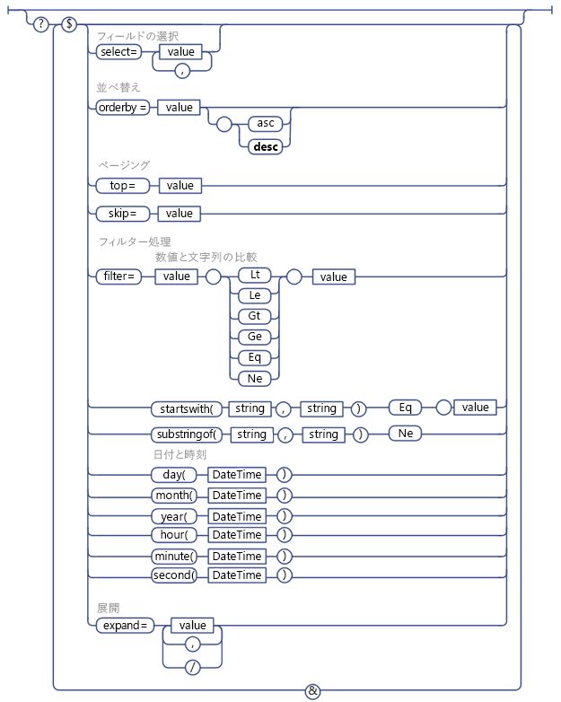

# SharePoint REST 要求で OData クエリ操作を使用する
さまざまな OData クエリ文字列演算子を使用して、SharePoint REST サービスからリクエスト データの選択、フィルタリング、並べ替えを行う方法について説明します。
 **始める前に**
  
    
    

-  [SharePoint 2013 REST サービスの概要](get-to-know-the-sharepoint-2013-rest-service.md)
    
  
-  [REST サービスで表される SharePoint データ構造内を移動する](navigate-the-sharepoint-data-structure-represented-in-the-rest-service.md)
    
  
-  [SharePoint REST サービス エンドポイント URI を決定する](determine-sharepoint-rest-service-endpoint-uris.md)
    
  

SharePoint REST サービスでは、さまざまな OData クエリ文字列演算子がサポートされており、それらの演算子を使用してリクエスト データの選択、フィルタリング、並べ替えが可能です。
  
    
    

> **ヒント**
> SharePoint Online (およびオンプレミスの SharePoint 2016 以降の) REST サービスは、OData  `$batch` クエリ オプションを使用して、複数の要求を組み合わせて 1 つのサービスへの呼び出しにすることをサポートしています。詳細およびコード サンプルへのリンクについては、「 [REST API によりバッチ要求を発行する](make-batch-requests-with-the-rest-apis.md)」を参照してください。 
  
    
    

## 返されるフィールドを選択する

エンティティ セットで表される所定のリスト、リスト アイテム、またはその他の SharePoint オブジェクトについてどのフィールドを返すかを指定するには、クエリ オプション  [$select](http://www.odata.org/documentation/odata-version-2-0/uri-conventions#SelectSystemQueryOption) を使用します。 `$select=*` を使用すると、使用可能なすべてのフィールドが返されます。
  
    
    

> **メモ**
> 通常、クエリ オプション  `$select` を使用しない場合、既定で、REST サービスは使用可能なすべてのフィールドを返します。ただし、まれなケースとして、一部の SharePoint オブジェクトには、取得に多くのリソースを費やすプロパティが含まれていることがあります。REST サービス パフォーマンスを最適化するため、これらのプロパティは既定のクエリからは除外されており、明示的にリクエストする必要があります。> たとえば、 **SPWeb.EffectiveBasePermissions** プロパティは既定では返されません。クエリ オプション `$select` を使用して明示的にリクエストする必要があります。
  
    
    

また、他のリストから目的のプロジェクトを返し、ルックアップの値を返すようにリクエストを指定することもできます。これを行うには、次のように、 `$select` と `$expand` の両方のクエリ オプションにフィールド名を指定します。
  
    
    
 `http://server/site/_api/web/lists('guid')/items?$select=Title,Products/Name&amp;$expand=Products/Name`
  
    
    
一括拡張と関連アイテムの選択はサポートされません。
  
    
    

## 返されるアイテムを選択する

返すアイテムを選択するには、クエリ オプション  [$filter](http://www.odata.org/documentation/odata-version-2-0/uri-conventions#FilterSystemQueryOption) を使用します。「 [SharePoint REST サービスでサポートされる OData クエリ演算子](#bk_supported)」に、SharePoint REST サービスで使用できるフィルター クエリの比較オプションと関数を示します。
  
    
    

## 単一値ルックアップ フィールドのクエリ

単一値ルックアップ フィールドのクエリは、SharePoint REST サービスでは、2 つの異なるフィールドで表されます。一方のフィールドで実際のフィールド値を表し、もう一方のフィールドはフィールド名を表します。ルックアップ フィールドの値をクエリする場合、そのデータ型の別のフィールドを指定することもできます。たとえば、ルックアップ フィールドの値が文字列の場合、クエリに文字列比較オプションを使用することができます。
  
    
    

## ユーザーのクエリ

SharePoint REST サービスでは、ユーザーはフレンドリーなユーザー名 (表示名) で表され、エイリアスや domain\\alias の組み合わせは使用されません。したがって、フレンドリーなユーザー名でユーザー クエリを作成する必要があります。
  
    
    

> **メモ**
> メンバーシップに基づくユーザー クエリはサポートされません。 > 現在のユーザーの ID でクエリするための **Current** 演算子はサポートされません。
  
    
    

## 複数値のルックアップ フィールドとユーザーのクエリ

複数値のルックアップ フィールドは、複数の値の文字列で返されるため、それらをクエリする方法がありません (たとえば、 **Includes** 要素や **NotIncludes** 要素に相当するものはサポートされません)。
  
    
    

## 返されたアイテムの並べ替え

返されるクエリ結果セット中のアイテムの並べ替え順序を指定するには、クエリ オプション  [$orderby](http://www.odata.org/documentation/odata-version-2-0/uri-conventions#OrderBySystemQueryOption) を使用します。複数のフィールドを並べ替えの基準にする場合は、フィールドをコンマで区切って列挙します。クエリに **asc** や **desc** のキーワードを追加して、アイテムの並べ替えを昇順にするか、それとも降順にするかを指定することもできます。
  
    
    

## 返されたアイテムのページング

本来クエリから返されるアイテムに対して、そのサブセットを選択するには、クエリ オプション  [$top](http://www.odata.org/documentation/odata-version-2-0/uri-conventions#TopSystemQueryOption) と [$skiptoken](http://msdn.microsoft.com/library/dd942121.aspx) を使用します。
  
    
    

> **メモ**
> SharePoint リスト アイテムのクエリの場合、$skip クエリ オプションは機能しません。 
  
    
    

 `$top` オプションで、返されるセットの最初の *n*  個のアイテムを指定できます。たとえば、次の URI の場合、返されることが予想されるセットのうち最初の 10 アイテムが実際に返されます。
  
    
    
 `http://server/site/_api/web/lists('<guid>')/items$top=10`
  
    
    
$skiptoken オプションを使うと、指定したアイテムに達するまでアイテムをスキップし、残りのアイテムを返すことができます。
  
    
    
 `$skiptoken=Paged=TRUE&amp;p_ID=5`
  
    
    

> **メモ**
> これらのクエリ オプションを使用する際は、OData のページングには順序があることを考慮する必要があります。たとえば、SharePoint リスト アイテムを表示するために [次のページ] ボタンを実装しているとします。REST サービスを使用して、ボタンをクリックしたときに 1 ～ 20 番目までのアイテムを表示し、もう 1 回クリックすると 21 ～ 40 番目までのアイテムを表示する、といった設定ができます。ただし、次のクリックを行う前に、他のユーザーが 4 ～ 18 番目のアイテムを削除したとします。そのような場合、後のアイテムの順番がリセットされ、21 ～ 40 番目のアイテムを表示すると、実際の動作としては 2 つのアイテムがスキップされます。 
  
    
    

## SharePoint REST サービスでサポートされる OData クエリ演算子

|**サポート済み**|**サポートされない**|
|:-----|:-----|
|**数値比較**    Lt    Le    Gt    Ge    Eq    Ne   | 算術演算子           (Add、Sub、Mul、Div、Mod)    基本数学関数          (round、floor、ceiling)    |
|**文字列比較**    startsWith    substringof    Eq    Ne   | endsWith    replace    substring    tolower    toupper    trim    concat   |
|**日付関数**    day()    month()    year()    hour()    minute()    second()   | DateTimeRangesOverlap 演算子    日付が頻出する日付パターンに属するかどうか評価する   |
   
下の図は、サポートされる OData のクエリ オプションを示しています。
  
    
    

**サポートされる OData のクエリ オプション**

  
    
    

  
    
    

  
    
    

  
    
    

  
    
    

## その他の技術情報

-  [SharePoint 2013 REST サービスの概要](get-to-know-the-sharepoint-2013-rest-service.md)
    
  
-  [SharePoint 2013 REST エンドポイントを使用して基本的な操作を完了する](complete-basic-operations-using-sharepoint-2013-rest-endpoints.md)
    
  
-  [REST を使用したリスト アイテムの操作](working-with-lists-and-list-items-with-rest.md)
    
  
-  [REST を使用してフォルダーとファイルを操作する](working-with-folders-and-files-with-rest.md)
    
  
-  [REST サービスで表される SharePoint データ構造内を移動する](navigate-the-sharepoint-data-structure-represented-in-the-rest-service.md)
    
  
-  [SharePoint REST サービス エンドポイント URI を決定する](determine-sharepoint-rest-service-endpoint-uris.md)
    
  
-  [SharePoint 2013 REST API、エンドポイント、およびサンプル](02128c70-9d27-4388-9374-a11bce68fdb8.md)
    
  

  
    
    
