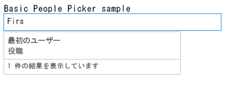
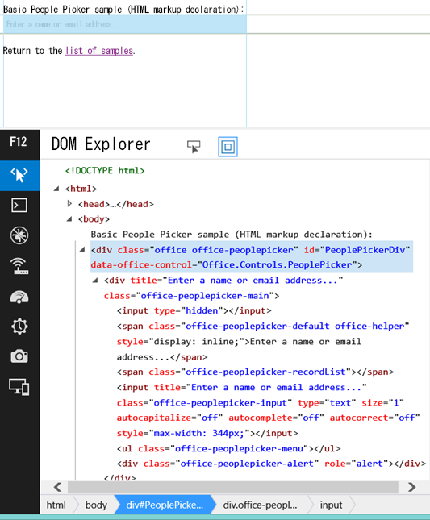

# ユーザー選択ウィンドウの実験用ウィジェットを SharePoint アドインで使用する
SharePoint でホストされていない Web ページも含め、任意の Web ページでユーザーの選択ウィンドウのウィジェットを使用する方法を説明します。ユーザーの選択ウィンドウのウィジェットをアドインに追加すると、ユーザーとグループの検索と選択を簡単に行えます。
> **注意**
> Office Web Widgets - Experimental は、研究とフィードバックの目的で提供されているに過ぎません。運用のシナリオでは使用しないでください。将来のリリースで Office Web Widgets の動作が大幅に変更される可能性があります。「 [Office Web Widgets - Experimental のライセンス条項](office-web-widgetsexperimental-license-terms.md)」を参照の上、ご確認ください。 


アドインでユーザーの選択ウィンドウの実験用ウィジェットを使用することにより、テナント内のユーザーやグループの検索と選択を簡単に行えます。テキスト ボックスに入力をすると、ウィジェットは名前か電子メールがテキストと合致するユーザーを取得します。
**図 1. ユーザーの選択ウィンドウのウィジェットによるクエリの解決**





アドインはウィジェットの **selectedItems** プロパティを読み取ることによって、選択されたユーザーにアクセスできます。selectedItems プロパティはユーザーまたはグループを表すオブジェクトの配列です。ユーザー オブジェクトで使用可能なプロパティを以下の表に示します。

|**プロパティ**|**説明**|
|:-----|:-----|
|**department** <br/> |ユーザーまたはグループの部門を表します。  <br/> |
|**displayName** <br/> |ユーザーまたはグループの表示名を表します。  <br/> |
|**email** <br/> |ユーザーまたはグループの電子メール アドレスを表します。  <br/> |
|**isResolved** <br/> |ウィジェットに入力されたテキストをテナント内のユーザーまたはグループに照らして正常に解決できたかどうかを示します。  <br/> |
|**jobTitle** <br/> |ユーザーの役職名を表します。  <br/> |
|**loginName** <br/> |ユーザーまたはグループのログイン名を表します。  <br/> |
|**mobile** <br/> |ユーザーまたはグループの携帯電話の番号を表します。  <br/> |
|**principalId** <br/> |ユーザーまたはグループのプリンシパル ID を表します。  <br/> |
|**principalType** <br/> |項目がユーザーかグループかを示します。ユーザーであれば値は 1、グループであれば値は 4 です。  <br/> |
|**sipAddress** <br/> |ユーザーまたはグループの sip アドレスを表します。  <br/> |
|**text** <br/> |ユーザーまたはグループの名前のテキスト タイトルを表します。  <br/> |
 
ユーザー選択ウィンドウのウィジェットには、最近使用した (MRU) エントリのキャッシュがあります。ウィジェットが解決した過去 5 件のエントリがキャッシュに格納されます。
## この記事の手順を行う上での前提条件

この記事に示されている例を使用するには、次のものが必要です。


- Visual Studio 2013。


- NuGet Package Manager。詳細については、「 [NuGet のインストール](http://go.microsoft.com/fwlink/?LinkId=271465)」を参照してください。


- SharePoint 2013開発環境 (オンプレミスのシナリオでは、アプリの分離が必要)


- Office Web Widgets - Experimental の NuGet パッケージ。NuGet パッケージのインストール方法の詳細については、「 [ダイアログを使用した NuGet パッケージの管理](http://docs.nuget.org/docs/start-here/managing-nuget-packages-using-the-dialog)」を参照してください。「 [NuGet ギャラリー ページ](http://www.nuget.org/packages/Microsoft.Office.WebWidgets.Experimental/)」も参照できます。


## プロバイダでホストされている SharePoint アドインにおける、ユーザーの選択ウィンドウのウィジェットの使用

この例では、SharePoint の外でホストされている単純なページを使用します。このページでは、マークアップを使用してユーザーの選択ウィンドウのウィジェットを宣言します。複雑にならないよう、この例ではオプションを宣言しませんが、オプションを指定した例を「 [NextSteps](use-the-experimental-people-picker-widget-in-sharepoint-add-ins.md#NextSteps)」のセクションで参照できます。


ユーザー選択ウィンドウのウィジェットを使用するには、次の操作を行う必要があります。


- SharePoint アドインと Web プロジェクトを作成します。


- アドイン Web でモジュールを作成します。この手順を実行すると、ユーザーがアドインを展開する時にアドイン Web が作成されるようになります。

    > **メモ**
      > アドイン Web が存在していなければクロス ドメイン ライブラリを使用できません。ユーザーの選択ウィンドウのウィジェットは、クロス ドメイン ライブラリを使用して SharePoint とやり取りします。 
- マークアップを使用してユーザー選択ウィンドウのウィジェット インスタンスを宣言するアドイン ページを作成します。


### SharePoint アドインと Web プロジェクトを作成するには


1. 管理者として Visual Studio 2013 を開きます (これを行うには、[ **スタート**] メニューの [Visual Studio 2013] アイコンを選択し、[ **管理者として実行**] をクリックします)。


2. SharePoint アドイン 2013 テンプレートを使用して、新しいプロジェクトを作成します。 **SharePoint アドイン 2013** テンプレートは、[ **テンプレート**]>[ **Visual C#**]、[ **Office/SharePoint**]>[ **アドイン**] の下にあります。


3. デバッグに使用する SharePoint Web サイトの URL を入力します。


4. アドインのホスティング オプションとして [ **プロバイダー向けのホスト型**] を選択します。

    > **メモ**
      > 他のホスト オプションを指定してユーザーの選択ウィンドウのウィジェットを使用することもできますし、Office アドインや独自の Web サイトで使用することもできます。 
5. Web アプリケーション プロジェクトの種類として、[ **ASP.NET Web フォーム アプリケーション**] を選択します。


6. 認証オプションとして [ **Windows Azure アクセス制御サービス**] を選択します。


### アドイン Web にモジュールを作成するには


1. [ **ソリューション エクスプローラー**] で SharePoint アドイン プロジェクトを選択し、[ **追加**] > [ **新しいアイテム…**] を選択します。


2. [ **Visual C# アイテム**]>[ **Office/SharePoint**]>[ **モジュール**] を選択します。モジュールに名前を付けます。

    > **メモ**
      > SharePoint ホスト型アドインを作成する場合、付加的なモジュールを作成する必要はありません。 

### ユーザーの選択ウィンドウのウィジェットを使用する新しいページを追加するには


1. [ **ソリューション エクスプローラー**] で Web プロジェクト内の [ **ページ**] フォルダーを選択します。


2. 次のコードをコピーし、プロジェクトの **ASPX** ファイルに貼り付けます。このコードは次のタスクを実行します。

  - 必要な Office ライブラリおよびリソースへの参照を追加します。


  - コントロールのランタイムを初期化します。


  - Office コントロール ランタイムの **renderAll** メソッドを実行します。


  - ユーザー選択ウィンドウのウィジェット用のプレース ホルダーを宣言します。


 ```

<!DOCTYPE html>
<html>
<head>
    <!-- IE9 or superior -->
    <meta http-equiv="X-UA-Compatible" content="IE=9" >
    <title>People Picker HTML Markup</title>

    <!-- Widgets Specific CSS File -->
    <link 
        rel="stylesheet" 
        type="text/css" 
        href="../Scripts/Office.Controls.css" 
    />

    <!-- Ajax, jQuery, and utils --> 
    <script 
        src=" https://ajax.aspnetcdn.com/ajax/4.0/1/MicrosoftAjax.js.js">
    </script>
    <script 
        src=" https://ajax.aspnetcdn.com/ajax/jQuery/jquery-1.9.1.min.js">
    </script>
    <script type="text/javascript">
        // Function to retrieve a query string value.
        // For production purposes you may want to use
        //  a library to handle the query string.
        function getQueryStringParameter(paramToRetrieve) {
            var params =
                document.URL.split("?")[1].split("&amp;");
            var strParams = "";
            for (var i = 0; i < params.length; i = i + 1) {
                var singleParam = params[i].split("=");
                if (singleParam[0] == paramToRetrieve)
                    return singleParam[1];
            }
        }
    </script>

    <!-- Cross-Domain Library and Office controls runtime -->
    <script type="text/javascript">
        //Register namespace and variables used through the sample
        Type.registerNamespace("Office.Samples.PeoplePickerBasic");
        //Retrieve context tokens from the querystring
        Office.Samples.PeoplePickerBasic.appWebUrl =
            decodeURIComponent(getQueryStringParameter("SPAppWebUrl"));
        Office.Samples.PeoplePickerBasic.hostWebUrl =
            decodeURIComponent(getQueryStringParameter("SPHostUrl"));

        //Pattern to dynamically load JSOM and and the cross-domain library
        var scriptbase =
            Office.Samples.PeoplePickerBasic.hostWebUrl + "/_layouts/15/";

        //Get the cross-domain library
        $.getScript(scriptbase + "SP.RequestExecutor.js",
            //Get the Office controls runtime and 
            //  continue to the createControl function
            function () {
                $.getScript("../Scripts/Office.Controls.js", createControl)
            }
        );
    </script>

    <!--People Picker -->
    <script 
        src="../Scripts/Office.Controls.PeoplePicker.js" 
        type="text/javascript">
    </script>
</head>
<body>
Basic People Picker sample (HTML markup declaration):
<div 
        id="PeoplePickerDiv" 
        data-office-control="Office.Controls.PeoplePicker">
</div>

<script type="text/javascript">
    function createControl() {
        //Initialize Controls Runtime
        Office.Controls.Runtime.initialize({
            sharePointHostUrl: Office.Samples.PeoplePickerBasic.hostWebUrl,
            appWebUrl: Office.Samples.PeoplePickerBasic.appWebUrl
        });

        //Render the widget, this must be executed after the
        //placeholder DOM is loaded
        Office.Controls.Runtime.renderAll();
    }
</script>
</body>
</html>

 ```


> **メモ**
> 上記のコード例では、ホスト Web とアドイン Web の URL を明示的に指定して Office コントロール ランタイムを初期化しています。しかし、アドイン Web とホスト Web の URL が **SPAppWebUrl** と **SPHostUrl** クエリ文字列パラメーターで指定されている場合、空のオブジェクトを渡して、これらのパラメータを自動的に取得できます。 **SPAppWebUrl** と **SPHostUrl** パラメータは、 **{StandardTokens}** トークンの使用時にクエリ文字列に組み込まれます。


次の例は、initialize メソッドに空のオブジェクトを渡す方法を示します。



```

// Initialize with an empty object and the code
// will attempt to get the tokens from the
// query string directly.
Office.Controls.Runtime.initialize({});
```


### ソリューションを構築して実行するには


1. F5 キーを押します。

    > **メモ**
      > F5 キーを押すと、Visual Studio がソリューションを構築して、アドインを展開し、アドインのアクセス許可ページを開きます。 
2. [ **信頼する**] ボタンをクリックします。


3. [ **サイト コンテンツ**] ページのアドイン アイコンを選択します。


コード ギャラリーからこのサンプルをダウンロードすることもできます。「 [ユーザーの選択ウィンドウの実験用ウィジェットをアドインで使用する](http://code.msdn.microsoft.com/SharePoint-2013-Use-the-57859f85)」のコード サンプルを参照してください。 


## 
<a name="NextSteps"> </a>

この記事では、HTML を使用してアドインでユーザーの選択ウィンドウのウィジェットを使用する方法を示します。以下のシナリオとウィジェットの詳細を調べることもできます。


### JavaScript を使用してユーザーの選択ウィンドウのウィジェットを宣言する

好みに応じて、HTML の代わりに JavaScript を使用してウィジェットを宣言できます。その場合、ウィジェットのプレース ホルダーとして、次のマークアップを使用することができます。



```HTML

<div id="PeoplePickerDiv"></div>
```

次の JavaScript コードを使用して、ユーザーの選択ウィンドウのウィジェットのインスタンスを作成します。



```
new Office.Controls.PeoplePicker(
    document.getElementById("PeoplePickerDiv"), {});
```

作業の実行方法を示すコード サンプルについては、「 [ユーザーの選択ウィンドウの実験用ウィジェットをアドインで使用する](http://code.msdn.microsoft.com/SharePoint-2013-Use-the-57859f85)」のコード サンプルの **JSSimple.html** ページを参照してください。


### ウィジェットのオプションを指定する

ウィジェット宣言で **data-office-options** 属性を使用して、ウィジェットのオプションを指定することができます。以下の HTML は、ユーザーの選択ウィンドウのウィジェットのオプションを指定する方法を示しています。



```HTML

<div id="PeoplePickerDiv"
        data-office-control="Office.Controls.PeoplePicker"
        data-office-options='{
        "allowMultipleSelections" : true,
        "onChange" : handleChange,
        "placeholder" : "Check the count message, it changes when you add names..."
    }'>
</div>
```

以下のコードは、JavaScript を使用してユーザーの選択ウィンドウのウィジェットを宣言する場合のオプションの指定方法を示しています。



```

new Office.Controls.PeoplePicker(
    document.getElementById("PeoplePickerDiv"), {
        allowMultipleSelections: true,
        placeholder: "Check the count message, it changes when you add names...",
        onChange: function (ctrl) {
            document.getElementById("count").textContent = 
ctrl.selectedItems.length.toString();
        }
    });
```

 **onChange** イベント、 **onAdded** イベント、 **onRemoved** イベントのイベント ハンドラーを指定することもできます。上記のコードで onChange イベントのイベント ハンドラーが単一のパラメーター **ctrl** を受け取ることに注意してください。これはウィジェットを参照しています。


オプションの指定方法の例については、「 [ユーザーの選択ウィンドウの実験用ウィジェットをアドインで使用する](http://code.msdn.microsoft.com/SharePoint-2013-Use-the-57859f85)」のコード サンプルの **MarkupOptions.html** ページと **JSOptions.html** ページを参照してください。


### ウィジェットで選択されたユーザーまたはグループを取得する

ウィジェット内でユーザーを取得するには、次のタスクを実行する必要があります。


- ウィジェットへの参照を取得します。


- ウィジェットの **selectedItems** プロパティにアクセスします。


次の構文を使用して、ウィジェットへの参照を取得できます。



```

var pplPicker = document.getElementById("PeoplePickerDiv")._officeControl;
```

ウィジェットのインスタンスを作成するときに参照を保存することもできます。



```
var pplPicker = new Office.Controls.PeoplePicker(
                        document.getElementById("PeoplePickerDiv"), {});
```

 **selectedItems** プロパティはユーザーまたはグループを表すオブジェクトの配列です。selectedItems 配列内のユーザーまたはグループは解決済みでも未解決でもかまいません。その点は **isResolved** プロパティで確認できます。次の例では、配列の要素 *i*  にアクセスして、ユーザーまたはグループの名前を使用する方法を示します。



```

var principal = pplPicker.selectedItems[i];
$("#msg").text(principal.text + " is selected in the control.");
```

選択されたユーザーまたはグループをウィジェットから取得する方法の例については、「 [Office Web Widgets - Experimental デモ](http://code.msdn.microsoft.com/SharePoint-2013-Office-Web-6d44aa9e)」のコード サンプルの **demo.html** ページを参照してください。


### ウィジェットのスタイルをカスタマイズする

開発者はウィジェットの外観をカスタマイズできます。以下の図は、描画された後のウィジェットの HTML 階層を示しています。


**図 2. ユーザーの選択ウィンドウのウィジェットの HTML 階層**





ウィジェットは **office-peoplepicker** というプレフィックスが付いたクラスを多数定義しています。これを **Office.Controls.css** スタイル シートで見つけて、カスタマイズすることができます。


## まとめ
<a name="NextSteps"> </a>

ユーザーの選択ウィンドウの実験用ウィジェットを使用して、テナント内のユーザーとグループを選択できます。次いで、アドインはユーザーが選択したプリンシパルを使用できます。アイデアとコメントを「 [Office Developer Platform UserVoice サイト](http://officespdev.uservoice.com/)」にお寄せください。


## その他の技術情報
<a name="bk_addresources"> </a>


-  [Office Web Widgets - Experimental の概要](office-web-widgetsexperimental-overview.md)


-  [Office Web Widgets - Experimental のライセンス条項](office-web-widgetsexperimental-license-terms.md)


-  [Office Web Widgets - Experimental NuGet ギャラリー ページ](http://www.nuget.org/packages/Microsoft.Office.WebWidgets.Experimental/)


-  [コード サンプル: ユーザーの選択ウィンドウの実験用ウィジェットをアドインで使用する](http://code.msdn.microsoft.com/SharePoint-2013-Use-the-57859f85)


-  [SharePoint アドインでデスクトップ リスト ビューの実験用ウィジェットを使用する](use-the-experimental-desktop-list-view-widget-in-sharepoint-add-ins.md) .


