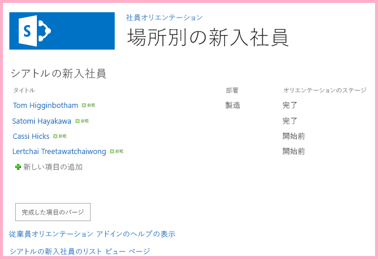
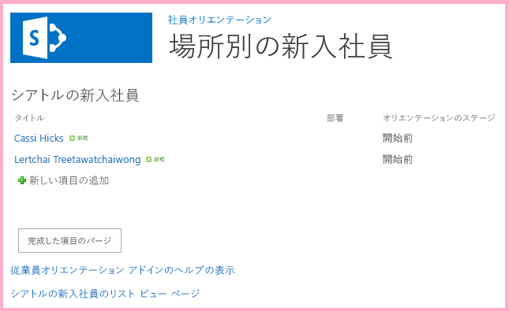

# SharePoint データで動作するように SharePoint JavaScript API を使用する
SharePoint JavaScript オブジェクト モデルを使用して、アドイン Web のページで JavaScript からの SharePoint データを処理します。
これは、SharePoint ホスト型の SharePoint アドインの開発の基本に関する記事のシリーズの 10 番目です。 [SharePoint アドイン](sharepoint-add-ins.md) とこのシリーズの前の記事をよく理解しておいてください。
  
    
    


-  [SharePoint ホスト型の SharePoint アドインの作成を始める](get-started-creating-sharepoint-hosted-sharepoint-add-ins.md)
    
  
-  [SharePoint 用の SharePoint ホスト型アドインを展開してインストールする](deploy-and-install-a-sharepoint-hosted-sharepoint-add-in.md)
    
  
-  [SharePoint 用の SharePoint ホスト型アドインにカスタム列を追加する](add-custom-columns-to-a-sharepoint-hostedsharepoint-add-in.md)
    
  
-  [SharePoint ホスト型 SharePoint アドインにカスタム コンテンツ タイプを追加する](add-a-custom-content-type-to-a-sharepoint-hostedsharepoint-add-in.md)
    
  
-  [SharePoint ホスト型 SharePoint アドイン内のページに Web パーツを追加する](add-a-web-part-to-a-page-in-a-sharepoint-hosted-sharepoint-add-in.md)
    
  
-  [SharePoint ホスト型 SharePoint アドインにワークフローを追加する](add-a-workflow-to-a-sharepoint-hosted-sharepoint-add-in.md)
    
  
-  [SharePoint ホスト型 SharePoint アドインにカスタム ページとスタイルを追加する](add-a-custom-page-and-style-to-a-sharepoint-hosted-sharepoint-add-in.md)
    
  
-  [SharePoint ホスト型 SharePoint アドインにカスタムのクライアント側レンダリングを追加する](add-custom-client-side-rendering-to-a-sharepoint-hosted-sharepoint-add-in.md)
    
  
-  [SharePoint アドインのホスト Web にカスタムのリボンのボタンを作成する](create-a-custom-ribbon-button-in-the-host-web-of-a-sharepoint-add-in.md)
    
  

> [!メモ]
> SharePoint ホスト型アドインに関するこのシリーズを学習している場合は、このトピックを続行するために利用できる Visual Studio ソリューションがあります。また、 [SharePoint_SP-hosted_Add-Ins_Tutorials](https://github.com/OfficeDev/SharePoint_SP-hosted_Add-Ins_Tutorials) でリポジトリをダウンロードして、BeforeJSOM.sln ファイルを開くこともできます。
  
    
    

SharePoint ホスト型 SharePoint アドイン は、サーバー側コードを持つことはできませんが、JavaScript と SharePoint JavaScript クライアント オブジェクト モデル ライブラリを使用して、SharePoint ホスト型 SharePoint アドイン で SharePoint コンポーネントを使用した、ビジネス ロジックとランタイムの操作を実行できます。(私たちはこれを JSOM と呼びます。最後が "M" であることに注意してください。これを JSO **N** [JavaScript Object Notation] と混同しないでください。) この記事では、JavaScript オブジェクト モデルを使用して、[ **シアトルの新入社員**] リストから古いアイテムを検索して削除します。
## JavaScript とそれを呼び出すボタンの作成


1. このシリーズの最初のチュートリアルの次の手順が完了したことを確認します。 
    
    プロジェクトのルートからファイル **/Pages/Default.aspx** を開きます。特に、この生成されたファイルは、SharePoint でホストされている 2 つのスクリプトである、sp.runtime.js と sp.js のいずれか、または両方を読み込みます。これらのファイルを読み込むマークアップは、ファイルの先頭付近に位置する、 **PlaceHolderAdditionalPageHead** という ID の **Content** コントロールにあります。マークアップは、使用している **Microsoft Office Developer Tools for Visual Studio** のバージョンによって異なります。この一連のチュートリアルでは、両方のファイルを読み込むことが必要であり、それらのファイルを **<SharePoint:ScriptLink>** タグではなく、通常の HTML **<script>** タグで読み込むことが必要です。 **PlaceHolderAdditionalPageHead** コントロールの中の行 `<meta name="WebPartPageExpansion" content="full" />` の *すぐ上*  に、次の行があることをご確認ください。
    


  ```
  
<script type="text/javascript" src="/_layouts/15/sp.runtime.js"></script>
<script type="text/javascript" src="/_layouts/15/sp.js"></script> 

  ```


    次いで、2 ファイルのどちらかを読み込むマークアップが他にもないかファイルを検索し、重複するマークアップを削除します。ファイルを保存して閉じます。
    
  
2. **ソリューション エクスプローラー**の **スクリプト** ノードでは、既に Add-in.js ファイルが存在する可能性があります。Add-in.js ファイルは存在しないものの、App.js がある場合は、App.js を右クリックして Add-in.js に名前を変更します。Add-in.js も App.js もない場合は、次の手順で作成します。
    
1. [ **スクリプト**] ノードを右クリックして、[ **追加**] > [ **新しい項目**] > **[Web]** を選択します。
    
  
2. [ **JavaScript ファイル**] を選択して、Add-in.js という名前にします。
    
  
3. Add-in.js がある場合は開いてコンテンツを削除します。
    
  
4. 次の行をファイルに追加します。このコードについて、以下の点に注意してください。
    
  -  `'use strict';` 行により、JavaScript で不適切なプラクティスを不注意で使用した場合に、ブラウザーの JavaScript ランタイムが例外をスローします。
    
  
  -  `clientContext` 変数は、SharePoint Web サイトを参照する **SP.ClientContext** オブジェクトを保持します。すべての JSOM コードは、この型のオブジェクトを作成またはこの型のオブジェクトへの参照を取得することで開始されます。
    
  
  -  `employeeList` 変数は、リスト インスタンス [ **シアトルの新入社員**] への参照を保持します。
    
  
  -  `completedItems` 変数は、スクリプトが削除するリストからのアイテムである、[ **オリエンテーション ステージ**] フィールドが [ **完了**] に設定されているアイテムを保持します。
    
  

  ```
  
'use strict';

var clientContext = SP.ClientContext.get_current(); 
var employeeList = clientContext.get_web().get_lists().getByTitle('New Employees In Seattle'); 
var completedItems; 
  ```

5. クライアント ブラウザーと SharePoint サーバーの間のメッセージを最小化するために、JSOM はバッチ処理システムを使用します。実際にサーバーにメッセージを送信 (および返信を受信) する関数は **SP.ClientContext.executeQueryAsync** の 1 つだけです。 **executeQueryAsync** の呼び出しの間に発生する JSOM API への呼び出しはまとめられ、次に **executeQueryAsync** が呼び出されたときに、バッチでサーバーに送信されます。ただし、オブジェクトが以前の **executeQueryAsync** の呼び出しでクライアントに渡されていないと、通常は JSOM オブジェクトのメソッドを呼び出すことができません。スクリプトはリスト上の完了した各アイテムの **SP.ListItem.deleteObject** メソッドを呼び出すので、 **executeQueryAsync** の呼び出しを 2 回行う必要があります。1 つ目は完了したリスト アイテムのコレクションを取得し、2 つ目は **deleteObject** の呼び出しをバッチ処理して、実行のためにサーバーに送信します。
    
    では、最初にサーバーからリスト アイテムを取得するメソッドを作成します。次のコードをファイルに追加します。
    


  ```
  
function purgeCompletedItems() {

   var camlQuery = new SP.CamlQuery(); 
   camlQuery.set_viewXml( 
         '<View><Query><Where><Eq>' + 
           '<FieldRef Name=\\'OrientationStage\\'/><Value Type=\\'Choice\\'>Completed</Value>' + 
         '</Eq></Where></Query></View>'); 
     completedItems = employeeList.getItems(camlQuery); 
}
  ```

6. これらの行がサーバーに送信され、そこで実行される場合、リスト アイテムのコレクションを作成しますが、スクリプトはそのコレクションをクライアントに渡す必要があります。これは、 **SP.ClientContext.load** 関数への呼び出しを使用して実行されるため、次の行をメソッドの終わりに追加します。
    
  ```
  
clientContext.load(completedItems);
  ```

7. **executeQueryAsync** の呼び出しを追加します。このメソッドには 2 つのパラメーターがあり、どちらもコールバック関数です。1 つ目は、サーバーがバッチですべてのコマンドを正常に実行する場合に動作します。2 つ目は、サーバーが何らかの理由で失敗した場合に動作します。これらの 2 つの関数は、後の手順で作成します。次の行をメソッドの終わりに追加します。
    
  ```
  clientContext.executeQueryAsync(deleteCompletedItems, onGetCompletedItemsFail);
  ```

8. 最後に、次の行をメソッドの終わりに追加します。関数を呼び出す ASP.NET ボタンに **false** を返すことにより、ASP.NET ボタンの既定の動作をキャンセルし、これによりページがリロードされます。ページをリロードすると、Add-in.js ファイルのリロードも実行されます。次にこれが `clientContext` オブジェクトを再初期化します。このリロードが、 **executeQueryAsync** が要求を送信するタイミングと、SharePoint サーバーが応答を返すタイミングの間で完了した場合、元の `clientContext` オブジェクトは応答を処理するために存在していません。関数は、成功または失敗のいずれのコールバックも実行されず停止します (正確な動作は、ブラウザーに応じて異なります)。
    
  ```
  return false;
  ```

9. 次の関数  `deleteCompletedItems` をファイル追加します。これは、 `purgeCompletedItems` 関数が成功している場合に動作する関数です。このコードについて、以下の点に注意してください。
    
  - **SP.ListItem.get_id** メソッドは、リスト アイテムの ID を返します。配列の各アイテムは、 **SP.ListItem** オブジェクトです。
    
  
  - **SP.List.getItemById** メソッドは、指定された ID の **SP.ListItem** オブジェクトを返します。
    
  
  - **SP.ListItem.deleteObject** メソッドは、 **executeQueryAsync** が呼び出されたときにサーバー上で削除されるリスト アイテムをマークします。
    
  
  - リスト アイテムは、サーバーから配列に送信されるコレクションからコピーしてからでなければ、削除できません。スクリプトが 各アイテムに対して **deleteObject** メソッドを **while** ループで直接呼び出した場合、JavaScript は 列挙の処理が行われている間に、コレクションの長さが変更されていることを通知するエラーをスローします。アイテムは **deleteObject** の呼び出しがまとめられてサーバーに送信されるまでどこからも削除されないため、エラー メッセージがそのまま当てはまるわけではありません。しかし、JSOM は、サーバーで発生する例外のスローを最小限にするよう設計されています (コレクションの反復処理の間、コードはコレクションのサイズを変更しません)。ただし、配列は固定サイズであるため、アイテム上で **deleteObject** を呼び出すと、アイテムがリストから削除されますが、配列のサイズを変更することはありません。
    
  

  ```
  function deleteCompletedItems() {

    var itemArray = new Array();
    var listItemEnumerator = completedItems.getEnumerator();

    while (listItemEnumerator.moveNext()) {
        var item = listItemEnumerator.get_current();
        itemArray.push(item);
    }

    var i;
    for (i = 0; i < itemArray.length; i++) {
        employeeList.getItemById(itemArray[i].get_id()).deleteObject();
    }

    clientContext.executeQueryAsync(onDeleteCompletedItemsSuccess, onDeleteCompletedItemsFail);
}
  ```

10. 次の関数  `onDeleteCompletedItemsSuccess` をファイルに追加します。これは、完了したアイテムが正常に削除された場合 (またはリストに完了したアイテムがない場合) に動作する関数です。2 行目の `location.reload(true);` は、ページをサーバーからリロードします。これは、ページのリスト ビュー Web パーツが、ページの更新まで引き続き完了したアイテムを表示するので便利です。(Add-in.js ファイルもリロードされますが、これは実行継続中の JavaScript 関数を中断する方法で動作するわけではないため、問題が発生しません。
    
  ```
  
function onDeleteCompletedItemsSuccess() {
    alert('Completed orientations have been deleted.');
    location.reload(true);
}
  ```

11. 次の 2 つの callback-on-failure 関数をファイルに追加します。
    
  ```
  
// Failure callbacks

function onGetCompletedItemsFail(sender, args) {
    alert('Unable to get completed items. Error:' + args.get_message() + '\\n' + args.get_stackTrace());
}

function onDeleteCompletedItemsFail(sender, args) {
    alert('Unable to delete completed items. Error:' + args.get_message() + '\\n' + args.get_stackTrace());
}
  ```

12. default.aspx ファイルを開き、ID **PlaceHolderMain** を持つ **asp:Content** 要素を検索します。
    
  
13. **WebPartPages:WebPartZone** 要素と最初の 2 つの **asp:Hyperlink** 要素の間に次のマークアップを追加します。 **OnClientClick** ハンドラーの値は、 `purgeCompletedItems()` ではなく `return purgeCompletedItems()` です。関数から返される `false` は、ページをリロードしないよう ASP.NET に通知します。
    
  ```HTML
  
<p><asp:Button runat="server" OnClientClick="return purgeCompletedItems()"
  ID="purgecompleteditemsbutton" Text="Purge Completed Items" /></p>
  ```

14. プロジェクトを Visual Studio で再構築します。
    
  
15. アドインをテストしながらリスト アイテムの [ **オリエンテーション ステージ**] を [完了] に手動で設定する必要を最小限にするには、(リスト テンプレート **NewEmployeeOrientation** の elements.xml ではなく) リスト インスタンス **NewEmployeesInSeattle** の elements.xml ファイルを開き、マークアップ `<Field Name="OrientationStage">Completed</Field>` を 1 つ以上の **Row** 要素の最後の子として追加します。
    
    **Rows** 要素は、次の例のようになります。
    


  ```
  
<Rows>
  <Row>
    <Field Name="Title">Tom Higginbotham</Field>
    <Field Name="Division">Manufacturing</Field>
    <Field Name="OrientationStage">Completed</Field>
  </Row>
  <Row>
    <Field Name="Title">Satomi Hayakawa</Field>
    <Field Name="OrientationStage">Completed</Field>
  </Row>
  <Row>
    <Field Name="Title">Cassi Hicks</Field>
  </Row>
  <Row>
    <Field Name="Title">Lertchai Treetawatchaiwong</Field>
  </Row>
</Rows>
  ```


## アドインを実行してテストする


  
    
    

1. デバッグするときに Visual Studio が使用するブラウザーのポップアップを有効にします。
    
  
2. F5 キーを使用して、アドインを展開して実行します。Visual Studio が、テスト用 SharePoint サイトにアドインを一時的にインストールして、すぐにアドインを実行します。
    
  
3. アドインのホームページが開き、[ **オリエンテーション ステージ**] が [ **完了**] のアイテムが 1 つ以上リストにあります。
    
   **完了したアイテムの削除前のリスト**

  

     
  

  

  
4. アドインの開始ページが完全に読み込まれたら、[ **完了したアイテムの消去**] ボタンを選択します。操作が成功した (失敗のメッセージが表示されない) 場合、すべての [ **完了**] のアイテムが削除され、 **完了したオリエンテーションが削除された**ことを示すポップアップ メッセージ ボックスが表示されます。
    
  
5. ポップアップを閉じるとページがリロードされ、[ **完了**] のアイテムはリスト ビューの Web パーツに表示されなくなります。
    
   **完了したアイテムの削除後のリスト**

  

     
  

  

  
6. デバッグ セッションを終了するには、ブラウザー ウィンドウを閉じるか、Visual Studio でデバッグを停止します。F5 を押すたびに、Visual Studio は以前のバージョンのアドインを取り消し、最新のアドインをインストールします。
    
  
7. このアドインおよび他の記事の Visual Studio ソリューションを操作し、それが終了したら前回のアドインを取り消すとよいでしょう。 **ソリューション エクスプローラー**のプロジェクトを右クリックして、[ **取り消し**] を選択します。
    
  

## 
<a name="Nextsteps"> </a>

このシリーズの次の記事では、ホスト Web の SharePoint データを操作するアドイン Web のページに JavaScript を追加します。 [アドイン Web で JavaScript からのホスト Web データを使って作業する](work-with-host-web-data-from-javascript-in-the-add-in-web.md)
  
    
    

