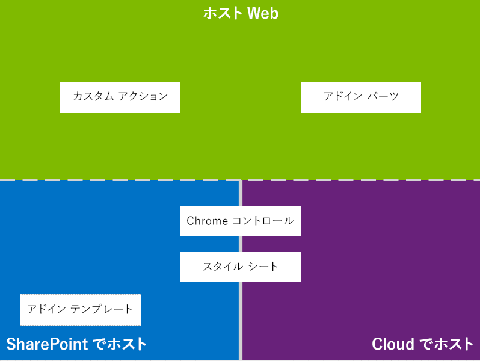
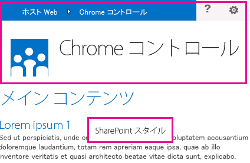
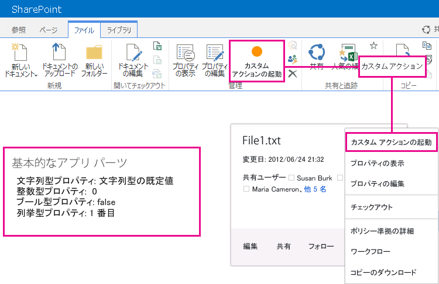

# SharePoint アドインの UX 設計
SharePoint 2013 でアドインを作成するときのユーザー エクスペリエンス (UX) のオプションについて説明します。
開発者は、アドインを作成するときには常にユーザー エクスペリエンス (UX) を重視する必要があります。SharePoint アドイン用のモデル では、優れたユーザー エクスペリエンスを作成するのに役立つ UX コンポーネントとメカニズムを多数提供しています。アドイン モデルのユーザー エクスペリエンスも十分な柔軟性を備えているため、エンド ユーザーのニーズに最適な方法とプラットフォームを使用できます。

## SharePoint 2013 でのアドイン UX の概要

アドインの開発者は、自分のアドインのアーキテクチャを理解しておく必要があります。リモート プラットフォームと SharePoint プラットフォームでどのようにアドインを配布するかを決定した後で、アドインの UX を作成するのに使用できる選択肢の中から決めることができます。その際、次のような疑問をお持ちになるかもしれません。

- クラウド ホスト アドインを作成する場合には、何を使用できるのか。

- SharePoint ホスト型アドインを作成する場合には、何を使用できるのか。詳細については、「 [SharePoint アドインを開発およびホスティングするためのパターンを選択する](choose-patterns-for-developing-and-hosting-your-sharepoint-add-in.md)」を参照してください。

- ホスト Web に UX を接続するにはどうすればいいのか。詳細については、「 [SharePoint 2013 のホスト Web、アドイン Web、および SharePoint コンポーネント](host-webs-add-in-webs-and-sharepoint-components-in-sharepoint-2013.md)」を参照してください。

次の図に、アドインの UX を設計するときに考慮すべき主なシナリオとオプションを示します。

**図 1. アドイン UX の主なシナリオとオプション**

設計を選択するときには、基本的に、アドインのどのパーツを SharePoint にホストし、どれをホストしないのかを検討する必要があります。また、アドインがホスト Web とどのようにやり取りするのかも検討する必要があります。

## クラウド ホスト アドインでのアドイン UX のシナリオ

ユーザー エクスペリエンスの一部は SharePoint にホストしないと決めたとします。このシナリオでは、エンド ユーザーが SharePoint Web サイトとクラウド ホスト アドインの間を行き来することが想定されます。プラットフォームに用意されている方法とツールを使用することはできますが、SharePoint にもスムーズなユーザー エクスペリエンスを設計するのに役立つリソースが提供されています。

SharePoint 2013 では、クラウドにホストするアドインで次の UX リソースを使用できます。

- **クロム コントロール:**クロム コントロール を使用すると、サーバー ライブラリに登録したり、ユーザー固有のテクノロジまたはツールを使用したりしなくても、アドイン内の特定の SharePoint サイトのナビゲーション ヘッダーを使用できます。この機能を使用するには、標準の <script> タグを使用して SharePoint JavaScript ライブラリを登録する必要があります。HTML の **div** 要素を使用してプレースホルダーを提供し、使用可能なオプションによってさらにコントロールをカスタマイズすることができます。このコントロールは、指定された SharePoint Web サイトの外観を継承します。詳細については、「 [SharePoint アドインのクライアント クロム コントロールを使用する](use-the-client-chrome-control-in-sharepoint-add-ins.md)」を参照してください。

   **ビデオを見る: SharePoint 2013 のクロム コントロール**

- **スタイル シート:** SharePoint アドイン内で SharePoint Web サイトのスタイル シートを参照し、使用可能なクラスによってご自身の Web ページにスタイルを指定することができます。さらに、エンド ユーザーが SharePoint Web サイトのテーマを変更した場合に、アドイン内の参照を変更することなく、新しいスタイルのセットをアドインに適用できます。詳細については、「 [SharePoint アドインで SharePoint Web サイトのスタイル シートを使用する](use-a-sharepoint-website-s-style-sheet-in-sharepoint-add-ins.md)」を参照してください。

図 2 に、クラウド ホスト アドイン向けの SharePoint アドイン用のモデル のリソースを示します。

**図 2. クラウド ホスト アドイン向けのアプリ UX のリソース**

## SharePoint ホスト型アドインでのアドイン UX のシナリオ

アドインを SharePoint にホストする場合、ユーザーがホスト Web とアドイン Web の間を行き来するときにもユーザー エクスペリエンスはあまり変化しません。アドインが展開されるときに、アドイン Web はホスト Web からスタイル シートとテーマを取得します。SharePoint ホスト型アドインでもクロム コントロールとスタイル シートを使用できますが、クラウド ホストの場合のシナリオとの最も大きな違いは、アドイン テンプレートを使用できるかどうかです。

SharePoint ホスト型アドインでは、次の UX リソースを使用できます。

- **アドイン テンプレート:** アドイン テンプレートには、 **app.master** マスターページが含まれます。これは、アドイン Web を作成するときの既定のオプションです。

SharePoint ホスト型アドインでは、リボン、Web パーツ インフラストラクチャ、クライアント側でのレンダリングなど、SharePoint の既存のリソースとテクノロジのメリットも享受できます。

## ホスト Web にアドイン UX を接続するためのシナリオ

アドインのユース ケースによっては、ホスト Web 内から開始することができます。SharePoint では、ドキュメント ライブラリまたはリストからアドインを開く方法に加えて、SharePoint にホストされたページ内にアドイン UX の一部を表示する方法を提供しています。

アドインの UX をホスト Web に接続するのに、次の UX リソースを使用できます。

- **カスタム アクション**: カスタム アクションを使用して、ホスト Web の UX とアドインを接続できます。カスタム アクションには、リボンと ECB の 2 種類があります。カスタム アクションでは、呼び出されたリストまたはアイテムなどのパラメータをリモート ページに送信することができます。詳細については、「 [カスタム アクションを作成して SharePoint アドインで展開する](create-custom-actions-to-deploy-with-sharepoint-add-ins.md)」を参照してください。

- **アドイン パーツ:** アドイン パーツを使用して、アドインのユーザー エクスペリエンスの一部をホスト Web に含めることができます。アドイン パーツは、アドインを展開するときに、ホスト Web の Web パーツ ギャラリーで提供されます。ユーザーは、 **Web パーツ追加機能** コントロールを使用して、アドイン パーツをページに追加できます。詳細については、「 [アドイン パーツを作成して SharePoint アドインと共にインストールする](create-add-in-parts-to-install-with-your-sharepoint-add-in.md)」を参照してください。

図 3 に、アドインをホスト Web に接続するための SharePoint アドイン用のモデル のリソースを示します。

**図 3. ホスト Web 向けのアドイン UX のリソース**

## その他の技術情報

SharePoint アドインでのアドイン UX のオプションの使用方法については、次のリソースを参照してください。

-  [SharePoint アドインの設計](design-sharepoint-add-ins.md)

-  [SharePoint アドイン](sharepoint-add-ins.md)

-  [SharePoint アドインの設計オプションを考慮するときの 3 つの方法](three-ways-to-think-about-design-options-for-sharepoint-add-ins.md)

-  [SharePoint アドインのアーキテクチャおよび開発環境に関する重要な要素](important-aspects-of-the-sharepoint-add-in-architecture-and-development-landscap.md)

-  [SharePoint 2013 のホスト Web、アドイン Web、および SharePoint コンポーネント](host-webs-add-in-webs-and-sharepoint-components-in-sharepoint-2013.md)

-  [SharePoint アドインの UX 設計ガイドライン](sharepoint-add-ins-ux-design-guidelines.md)

-  [SharePoint 2013 での UX コンポーネントの作成](create-ux-components-in-sharepoint-2013.md)

-  [SharePoint アドインで SharePoint Web サイトのスタイル シートを使用する](use-a-sharepoint-website-s-style-sheet-in-sharepoint-add-ins.md)

-  [SharePoint アドインのクライアント クロム コントロールを使用する](use-the-client-chrome-control-in-sharepoint-add-ins.md)

-  [アドイン パーツを作成して SharePoint アドインと共にインストールする](create-add-in-parts-to-install-with-your-sharepoint-add-in.md)

-  [カスタム アクションを作成して SharePoint アドインで展開する](create-custom-actions-to-deploy-with-sharepoint-add-ins.md)

