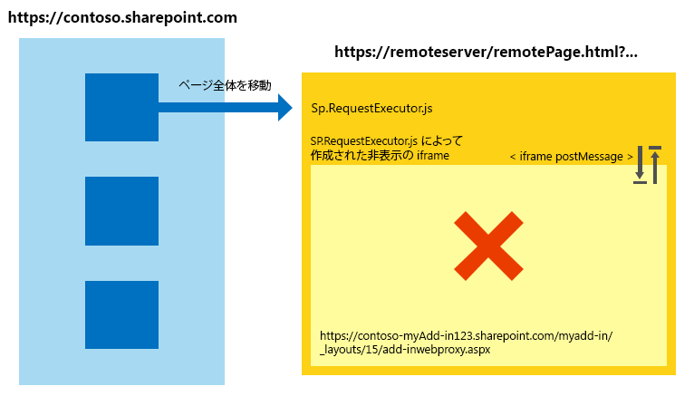
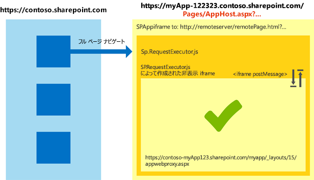

# SharePoint アドインで Internet Explorer の異なるセキュリティ ゾーンを横断してクロスドメイン ライブラリを操作する
ホスト Web ページとアドイン ページが Windows Internet Explorer の異なるセキュリティ ゾーンにある場合に、SharePoint 2013でクロスドメイン ライブラリを使用する方法について説明します。
アドインで SharePoint 2013 クロスドメイン ライブラリを使用する場合は、Internet Explorer でのセキュリティ ゾーンのしくみを知っておく必要があります。SharePoint Web サイトとアドインが異なるゾーンにある場合、アドインで通信の問題が発生する可能性があります。この記事では、Internet Explorer の別々のセキュリティ ゾーンでクロスドメイン ライブラリを使用した場合、どのように処理されるかについて説明します。
  
    
    


## SharePoint クロスドメイン ライブラリを使用した Internet Explorer でのクロスゾーン シナリオ
<a name="bk_crosszonescenarios"> </a>

セキュリティ上の理由により、Internet Explorer では、整合性レベル (セキュリティ ゾーンとも呼ばれる) が異なるページ間で Cookie を共有することができません。理由は、整合性レベルごとに Cookie 保存場所が異なるためです。ページの整合性レベルは最上位ページによって決定され、そのページ内のすべてのフレームが、同じ整合性レベルを共有します。詳細については、「 [Beware Cookie Sharing in Cross-Zone Scenarios (クロスゾーン シナリオでの Cookie の共有について)](http://blogs.msdn.com/b/ieinternals/archive/2011/03/10/internet-explorer-beware-cookie-sharing-in-cross-zone-scenarios.aspx)」を参照してください。
  
    
    
SharePoint クロスドメイン ライブラリは非表示の **IFrame** と、SharePoint でホストされているクライアント側プロキシ ページを使用して、JavaScript を使用したクライアント側通信を可能にします。クロスドメイン ライブラリは、ページで sp.requestexecutor.js ファイルを参照するときに使用可能です。詳細については、「 [クロスドメイン ライブラリを使用してアドインから SharePoint 2013 のデータにアクセスする](access-sharepoint-2013-data-from-add-ins-using-the-cross-domain-library.md)」を参照してください。
  
    
    
リモート アドイン ページと SharePoint Web サイトが異なるセキュリティ ゾーンにある場合、認証 Cookie の送信ができません。認証 Cookie がない場合、 **IFrame** がプロキシ ページを読み込もうとすると、SharePoint サインイン ページにリダイレクトされます。SharePoint サインイン ページでは、セキュリティ上の理由により **IFrame** は使用できません。これらのシナリオについては、ライブラリはプロキシ ページを読み込むことができず、SharePoint との通信はできません。
  
    
    
次の図に、プロキシ ページの読み込みができないクロスゾーン シナリオを示します。トップ ページで  `http://remoteserver/remotepage.html` と同じセキュリティ ゾーンにフレームが設定されます。プロキシ ページは読み込まれません。
  
    
    

**図 1. プロキシ ページの読み込みができないクロスゾーン シナリオ**

  
    
    

  
    
    

  
    
    
次に、クロスドメイン ライブラリでプロキシ ページの読み込みができない例を示します。
  
    
    

- 顧客が SharePoint Online を使用しており、リモート アドイン ページがイントラネット サーバーでホストされています。SharePoint Online の URL は通常ローカル イントラネット ゾーンにはないため、このシナリオではプロキシ ページの読み込みに問題が発生しやすくなります。これは、アドインの初回開発時にはよくあるシナリオです。完全修飾インターネット ドメインなしで、IIS Express またはその他のローカル サーバーを使用してページをホストしている可能性があるためです。
    
  
- 顧客は社内 SharePoint でフォームベース認証を使用しており、リモート ページはクラウド サービス (Microsoft Azure など) でホストされています。
    
  

## SharePoint アドイン でのクロスゾーン シナリオの処理
<a name="bk_handlingcrosszone"> </a>

アドイン開発時とアドイン実行時の両方で、この問題を解決する方法がいくつかあります (アプリ開発時の使用を特に推奨)。
  
    
    

### ベスト プラクティス: アプリ ホスト パターンを使用する

クロスゾーン シナリオを処理するには、SharePoint でアプリ ホスト ページを使用することをお勧めします。アプリ ホスト ページは、 **IFrame** 内にリモート ページを含む SharePoint ページです。アプリ ホスト ページで **IFrame** の内側にあるすべての要素は、アドイン Web と同じセキュリティ ゾーン内に存在します。リモート ページ内のクロスドメイン ライブラリは、認証 Cookie を受け取ってプロキシ ページを正常に読み込むことができます。
  
    
    
次の図に、アプリ ホスト ページ パターンを使用して処理されるクロスゾーン シナリオを示します。 
  
    
    

**図 2. アプリ ホスト ページを使用して処理されるクロスゾーン シナリオ**

  
    
    

  
    
    

  
    
    
アプリ ホスト ページに必要なコードは単純です。アプリ ホスト ページの主要な部分は、 **SPAppIFrame** 要素です。CSS を使用して **IFrame** を非表示にし、IFrame がアドインに干渉しないようにする必要があります。
  
    
    
次に示すマークアップは、単純なアプリ ホスト ページの例です。マークアップによって実行されるタスクは次のとおりです。
  
    
    

- SharePoint コンポーネントを使用するときに必要なディレクティブを宣言します。
    
  
- **IFrame** を非表示にするためのスタイルを宣言します。
    
  
- **SPAppIFrame** を宣言し、ターゲットをアドイン開始ページに設定します。
    
  


```HTML

<%@ Page
    Inherits="Microsoft.SharePoint.WebPartPages.WebPartPage, Microsoft.SharePoint, Version=15.0.0.0, Culture=neutral, PublicKeyToken=71e9bce111e9429c" 
    language="C#" %>
<%@ Register 
    Tagprefix="SharePoint" 
    Namespace="Microsoft.SharePoint.WebControls" 
    Assembly="Microsoft.SharePoint, Version=15.0.0.0, Culture=neutral, PublicKeyToken=71e9bce111e9429c" %>
<%@ Register 
    Tagprefix="Utilities" 
    Namespace="Microsoft.SharePoint.Utilities" 
    Assembly="Microsoft.SharePoint, Version=15.0.0.0, Culture=neutral, PublicKeyToken=71e9bce111e9429c" %>
<%@ Register 
    Tagprefix="WebPartPages" 
    Namespace="Microsoft.SharePoint.WebPartPages" 
    Assembly="Microsoft.SharePoint, Version=15.0.0.0, Culture=neutral, PublicKeyToken=71e9bce111e9429c" %>

<html>
<head>
    <title>Your add-in page title</title>
    <style type="text/css">
        html, body
        {
            overflow:hidden;
        }
        
        body
        {
            margin:0px;
            padding:0px;
        }
         
        iframe 
        {
            border:0px;
            height:100%;
            width:100%;
        }
    </style>
</head>

<body>
    <SharePoint:SPAppIFrame 
        runat="server" 
        src="~remoteAppUrl/StartPage.html?{StandardTokens}" 
        frameborder="0">
    </SharePoint:SPAppIFrame>
</body>
</html>
```

ユーザーがアドインの一部分にディープ リンクを設定できるようにする場合は、アプリ ホスト ページおよび **IFrame** のコンテンツを連携させることでディープ リンクを可能にすることができます。別の方法の 1 つとして、 **IFrame** のポスト メッセージ通信を使用し、リモート アドインのページごとに個別の URL を使用する方法があります。ページごとに個別の URL を使用するには、アドイン Web に個別のページを作成するか、1 ページで複数のクエリ文字列パラメーターを使用できます。
  
    
    

### 別の方法: Internet Explorer で同じセキュリティ ゾーンにサイトを追加する

アドインがアプリ ホスト パターンに従って設計されていない場合でも、同じセキュリティ ゾーンに次のドメインを追加することによって、そのアドインを使用できます。 
  
    
    

- SharePoint サイトのドメイン (例:  `https://contoso.sharepoint.com`)
    
  
- クラウド ホスト アドインのドメイン ( `http://remoteserver`)
    
  
- Microsoft によってホストされているサインイン ページおよびサービス ( `*.microsoftonline.com`)
    
  
管理者は Active Directory ポリシーを使用して組織内のすべてのコンピューターにチャレンジを送信できます。
  
    
    

## アプリ ホスト パターン使用のセキュリティへの影響
<a name="bk_securityimplications"> </a>

重要な点は、アプリ ホスト パターンによってリモート ページは実際上アドイン Web と同じセキュリティ ゾーンに設定されることです。サイトをセキュリティ ゾーンに追加することによって生じる影響を理解しておく必要があります。詳細については、「 [Internet Explorer でセキュリティ ゾーンを使用する方法](http://support.microsoft.com/kb/174360/ja-jp)」を参照してください。
  
    
    

## 他のブラウザーの使用: Chrome、Firefox、および Safari
<a name="bk_otherbrowsers"> </a>

Google Chrome、Mozilla Firefox、Apple Safari などの他のブラウザーは、セキュリティ ゾーンの概念を実装していません。ブラウザーが Cookie を別の格納領域に分離しない場合、この記事で説明しているような問題はおそらく発生しません。アドイン内でアプリ ホスト パターンに従うことをお勧めします。アプリ ホスト パターンを使用すると、SharePoint がどのセキュリティ ゾーンにあるかに関係なく、これらのブラウザーおよび Internet Explorer でアドインを確実に動作させることができます。
  
    
    

## その他の技術情報
<a name="bk_addresources"> </a>


-  [SharePoint アドインのセキュリティで保護されたデータ アクセスとクライアント オブジェクト モデル](secure-data-access-and-client-object-models-for-sharepoint-add-ins.md)
    
  
-  [クロスドメイン ライブラリを使用してアドインから SharePoint 2013 のデータにアクセスする](access-sharepoint-2013-data-from-add-ins-using-the-cross-domain-library.md)
    
  
-  [SharePoint アドイン](sharepoint-add-ins.md)
    
  
-  [SharePoint アドインの承認と認証](authorization-and-authentication-of-sharepoint-add-ins.md)
    
  
-  [SharePoint アドインの設計オプションを考慮するときの 3 つの方法](three-ways-to-think-about-design-options-for-sharepoint-add-ins.md)
    
  
-  [SharePoint アドインのアーキテクチャおよび開発環境に関する重要な要素](important-aspects-of-the-sharepoint-add-in-architecture-and-development-landscap.md)
    
  
-  [SharePoint 2013 のホスト Web、アドイン Web、および SharePoint コンポーネント](host-webs-add-in-webs-and-sharepoint-components-in-sharepoint-2013.md)
    
  
-  [SharePoint アドインのデータ ストレージ](important-aspects-of-the-sharepoint-add-in-architecture-and-development-landscap.md#Data)
    
  
-  [SharePoint 2013 のクロスドメイン ライブラリのカスタム プロキシ ページを作成する](create-a-custom-proxy-page-for-the-cross-domain-library-in-sharepoint-2013.md)
    
  
-  [Client-side Cross-domain Security (クライアント側のクロスドメイン セキュリティ)](http://msdn.microsoft.com/ja-jp/library/cc709423%28VS.85%29.aspx)
    
  

