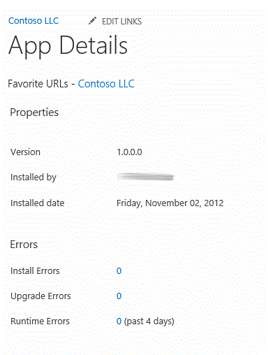

# Adicione instrumentação para solução de problemas para um aplicativo do SharePoint
Saiba como adicionar erro de tempo de execução personalizado e aprimorado de monitoramento para sua Suplementos do SharePoint.
 * **Aplica-se a:*** 
  
    
    


|||
|:-----|:-----|
|**Neste artigo**          [Interface do usuário de monitoramento de aplicativo](#AppMonitoringUI)           [Usando as APIs de erro personalizada](#LogCustomAppError)           [Rastreamento do ASP.NET do IIS](#IISTracing)           [Pacotes de criação de perfil de terceiros](#ProfilingPackages)           [Recursos adicionais](#bk_addresources) <br/> |
  
    
    

  
    
    

  
    
    
 [SharePoint 2013: Add runtime instrumentation and error logging to apps](http://code.msdn.microsoft.com/SharePoint-2013-Add-9fdb5182)
  
    
    
 <br/> |
   

Para uma experiência de cliente BOM, erros de tempo de execução no Suplementos do SharePoint devem ser identificados, analisados e facilmente fixa do ambiente do cliente. Instrumentação possibilita que. Você pode usar as APIs de monitoramento interno e a interface de usuário (IU) para cobrir os fundamentos. Especialmente para aplicativos hospedados pelo provedor, instrumentação forte no aplicativo deve ir além de mensagens de exceção de log. Este artigo descreve o suporte interno para o monitoramento de aplicativo e também descreve três pacotes de código-fonte aberto que ajudam a coletar e analisar informações de tempo de execução sobre seus aplicativos.
  
    
    


## Interface do usuário de monitoramento de aplicativo
<a name="AppMonitoringUI"> </a>

SharePoint 2013 fornece uma maneira para os proprietários de sites ver os erros de tempo de execução do seu aplicativo, o qual eles podem encaminhar para você. O usuário executa as seguintes etapas.
  
    
    

1. Na página **Conteúdo do Site**, realce o aplicativo.
    
  
2. Escolha o link de texto explicativo ( **…** ) que aparece ao lado do nome do aplicativo.
    
  
3. Escolha **DETAILS** no texto explicativo. Isso abre a página de **detalhes** para o App. Figura 1 mostra a parte da página onde as informações de erro são relatadas. O número total de erros de instalação, atualização erros e erros de tempo de execução é relatado. Cada um desses números é um link que abre um texto explicativo com detalhes sobre os erros. O usuário pode enviar essas informações para você, possivelmente como uma captura de tela.
    
   **Figura 1. Página de detalhes do aplicativo**

  

     
  

    Erros de instalação e atualização estão disponíveis em seus respectivos textos explicativos de quase imediatamente depois que eles ocorrem. Erros de tempo de execução podem levar de 5 a 10 minutos. O número de erros de cada categoria que aparece na página **detalhes** pode demorar muito mais para atualizar.
    
  
A infraestrutura de SharePoint 2013 relatórios de vários tipos de erros. Você também pode criar aplicativos para erros de relatório personalizado para a mesma interface de usuário. Para obter mais informações, consulte a próxima seção.
  
    
    

## Usando as APIs de erro personalizada
<a name="LogCustomAppError"> </a>

O modelo de objeto do cliente de SharePoint 2013 inclui uma classe de  [Utility](https://msdn.microsoft.com/library/Microsoft.SharePoint.Client.Utilities.Utility.aspx) com dois métodos estáticos para relatórios de erros personalizados para a página de **detalhes** do seu aplicativo:
  
    
    

-  [LogCustomAppError](https://msdn.microsoft.com/library/Microsoft.SharePoint.Client.Utilities.Utility.LogCustomAppError.aspx) Relata os erros de componentes hospedado no SharePoint. Este método sempre é chamado a partir de JavaScript em (ou referenciado em) uma página hospedado no SharePoint.
    
  
-  [LogCustomRemoteAppError](https://msdn.microsoft.com/library/Microsoft.SharePoint.Client.Utilities.Utility.LogCustomRemoteAppError.aspx) Relata os erros de componentes remotos de aplicativos hospedados na nuvem.
    
  
Este é um exemplo simples de chamar o método  [LogCustomAppError](https://msdn.microsoft.com/library/Microsoft.SharePoint.Client.Utilities.Utility.LogCustomAppError.aspx) :
  
    
    


```cs

var context = SP.ClientContext.get_current();
SP.Utilities.Utility.logCustomAppError(context, "My custom error message.");
context.executeQueryAsync(function(){},function(){});
```

Normalmente, você chamar um destes métodos em um bloco de **catch**. O exemplo a seguir é um exemplo de [LogCustomRemoteAppError](https://msdn.microsoft.com/library/Microsoft.SharePoint.Client.Utilities.Utility.LogCustomRemoteAppError.aspx) usado no código por trás de um botão em um aplicativo web remoto. Observe que **clientContext** é um objeto de [ClientContext](https://msdn.microsoft.com/library/Microsoft.SharePoint.Client.ClientContext.aspx) e _product_GUID_ é a ID de produto do aplicativo.
  
    
    


```cs

void OKButton_Click(Object sender, EventArgs e)
{
    try 
    {
        // Your logic is here.
    }
    catch (Exception e)
    {
        // Log a message in SharePoint.
        Utility.LogCustomRemoteAppError(clientContext, product_GUID, "My custom error message.");
        clientContext.ExecuteQuery();
    }
}

```


## Rastreamento do ASP.NET do IIS
<a name="IISTracing"> </a>

Considere a possibilidade de fornecer aos usuários uma maneira de ativar o rastreamento para o pipeline integrado do IIS do ASP.NET. Quando o rastreamento está ativado, todas as solicitações HTTP são rastreadas e mensagens de  [Trace.Write](https://msdn.microsoft.com/library/System.Diagnostics.Trace.Write.aspx) são gravadas em um arquivo de log que pode ser acessado por meio de axd. Porque o rastreamento coleta informações sobre cada solicitação, ela pode ter um impacto significativo no desempenho do aplicativo, portanto não deverá estar ligado por padrão.
  
    
    
Rastreamento funciona melhor com aplicativos de formulário ASP.NET porque ele automaticamente fazem login prazo para várias partes do ciclo de vida da página. Você também pode adicionar suas próprias mensagens personalizadas  [Trace.Write](https://msdn.microsoft.com/library/System.Diagnostics.Trace.Write.aspx) ao seu código.
  
    
    
Uma maneira para incluir uma opção de rastreamento para seu aplicativo é para adicionar uma página de diagnósticos para o aplicativo com uma função nele para ativar o rastreamento. A seguir estão as principais etapas para fazer isso.
  
    
    

1. Adicione um elemento de **trace** à seção **system.web** do arquivo Web. config do aplicativo web remoto. O exemplo a seguir é um exemplo.
    
  ```XML
  
<trace enabled="false" pageOutput="false" requestLimit="100" localOnly="false"
    traceMode="SortByTime" mostRecent="true" writeToDiagnosticsTrace="true" />
  ```

2. Adicione uma página de diagnostics.aspx ao projeto de aplicativo da web. Adicione um botão cujo manipulador de eventos **Click** altera o atributo **enabled** do elemento **trace** para **true**à página. O exemplo a seguir é um exemplo.
    
  ```cs
  
Configuration configuration = WebConfigurationManager.OpenWebConfiguration("~");
TraceSection section = (TraceSection)configuration.GetSection("system.web/trace");
section.Enabled = true;
configuration.Save();
  ```

3. Adicione um segundo botão para desativar o rastreamento (ou fazer a lógica do rastreamento de alternância do botão anterior e desativando).
    
  
4. Adicione um link para o arquivo axd, que é o log de rastreamento, para a página de diagnósticos. O exemplo a seguir é um exemplo.
    
  ```HTML
  
<h2>App Diagnostics</h2>
<p><a href="~/trace.axd">ASP.NET Trace</a></p>
  ```

5. Quando um usuário encontra um erro, conceda ao usuário o URL da página de diagnósticos. Solicite que o usuário ativar o rastreamento e execute novamente o aplicativo. E você pode fazer com que o usuário vá para a página de diagnósticos e, a partir daí, o log de rastreamento, onde o usuário pode copiar as informações de rastreamento e enviá-lo. Certifique-se de que o usuário desativar o rastreamento.
    
  
Como alternativa para que o usuário navegue para o log de axd, você pode ter lógica do seu botão Definir o atributo de **pageOutput** para **true**. Isso faz com que as informações de rastreamento a ser anexado à parte inferior de cada página que acionou o erro.
  
    
    
Para minimizar o impacto de rastreamento no desempenho do aplicativo, certifique-se de que o rastreamento está habilitado somente para as quantidades de curtas de tempo. Em geral, ele deve ser habilitado apenas tempo suficiente para que o usuário reproduzir um erro. Para evitar a necessidade dos que usuários finais retornar à página de diagnósticos e desabilita o rastreamento, convém considerar o tempo limite para a configuração do rastreamento. Por exemplo, automaticamente desativá-la depois de 30 minutos ou na próxima vez em que o aplicativo for reinicializado. O manipulador **Application_Start** pode desativar rastreamento se um certo período de tempo se passou desde que ela foi ativada.
  
    
    

## Pacotes de criação de perfil de terceiros
<a name="ProfilingPackages"> </a>

Como alternativa ao uso de rastreamento do IIS, você pode adicionar ao seu aplicativo de qualquer um dos vários log de erros de terceiros e pacotes de perfis de desempenho. Aqui estão algumas informações sobre três deles.
  
    
    

- ELMAH (módulos de log de erro e manipuladores) é um agente de log de erro conectável para formulários ASP.NET e aplicativos MVC. Para obter mais informações, consulte  [usando módulos e manipuladores HTTP para criar componentes de ASP.NET conectável](http://msdn.microsoft.com/en-us/library/aa479332.aspx) e [ELMAH](https://code.google.com/p/elmah/). ELMAH está disponível como um pacote do NUGET que podem ser adicionados ao projeto do Visual Studio. Para obter mais informações, consulte  [Pacote NuGet da semana #7 - ELMAH](http://www.hanselman.com/blog/NuGetPackageOfTheWeek7ELMAHErrorLoggingModulesAndHandlersWithSQLServerCompact.aspx).
    
  
- MiniProfiler é um profiler leve para cada tipo de aplicativos ASP.NET. Ele também oferece suporte à criação de perfil do banco de dados e foi projetado para uso com aplicativos de produção. Para obter mais informações, consulte  [MiniProfiler](http://miniprofiler.com/). MiniProfiler está disponível como um pacote do NUGET. Para obter mais informações, consulte  [Pacote NuGet da semana n º 9 - ASP.NET MiniProfiler](http://www.hanselman.com/blog/NuGetPackageOfTheWeek9ASPNETMiniProfilerFromStackExchangeRocksYourWorld.aspx)
    
  
- Noção básica é um depurador que permite a um servidor web a partir de um cliente de depuração. Para obter mais informações, consulte  [noção básica](http://getglimpse.com/About).
    
  

## Recursos adicionais
<a name="bk_addresources"> </a>


-  [Suplementos de design para o SharePoint](f7ece24a-1684-4a3c-b9ef-814cbf206ca1.md)
    
  