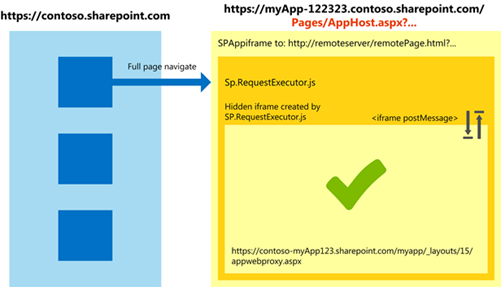

# Considerações de design avançada app experientes para desenvolvedores do SharePoint
Este artigo fornece orientação para o desenvolvedor SharePoint 2010 começar a desenvolver aplicativos em SharePoint 2013. Você pode usar estas diretrizes para identificar e avaliar as considerações para desenvolver aplicativos que atendem às necessidades do usuário.
 * **Aplica-se a:*** 
  
    
    


|||
|:-----|:-----|
|**Neste artigo**          [Quem deve ler este artigo e o que esperar](#WhoShouldRead)           [Tipos de aplicativo no SharePoint 2013](#AppTypes)           [Três abordagens para a definição de níveis de confiança](#ThreeApproaches)           [Padrões para implantar seu Suplemento do SharePoint](#DeploymentPatterns)           [Padrões para acesso a dados](#DataAccess)           [Considerações comuns](#CommonConsiderations)           [Code samples](#Samples)           [Conclusão](#Conclusion)           [Recursos adicionais](#bk_addresources)||
   

## Quem deve ler este artigo e o que esperar
<a name="WhoShouldRead"> </a>

Este artigo destina SharePoint 2010 desenvolvedores que desejam entender o desenvolvimento de aplicativos para SharePoint 2013 e como começar a desenvolver aplicativos. Ele pressupõe conhecimento de novidades do SharePoint e alguns experiência desenvolver extensões de SharePoint 2010.
  
    
    
Este artigo não é uma exploração de profundidade de desenvolvimento de aplicativos no SharePoint 2013. Destina-se para ajudá-lo a entender o que é possível com Suplementos do SharePoint, como você pode montar apps e algumas considerações para o desenvolvimento-los.
  
    
    
Após ler este artigo, você, como um desenvolvedor da solução SharePoint 2010, deve ter as informações que necessárias para decidir quais opções SharePoint 2013 fazem mais sentido para o aplicativo que você tem em mente.
  
    
    

## Tipos de aplicativo no SharePoint 2013
<a name="AppTypes"> </a>

SharePoint 2013 fornece várias opções para o desenvolvimento de aplicativos, incluindo tecnologias da web padrão como JavaScript e OAuth. SharePoint também oferece muitos hospedagem opções e funcionalidade para interagir com os recursos do SharePoint.
  
    
    
Uma das diferenças entre as extensões de SharePoint 2010 e Suplementos do SharePoint mais surpreendentes é que Suplementos do SharePoint não usar um modelo de objeto do servidor, nem usarem código personalizado que é executado no servidor do SharePoint. Todos os componentes de código personalizado residem no modelo de objeto do cliente expandida ou em servidores de aplicativos hospedados em nuvem.
  
    
    
Os vários modelos de desenvolvimento SharePoint 2013 fornecem as opções para criar aplicativos que podem ser executados na nuvem, em vez de em um farm do SharePoint. Esses modelos de desenvolvimento flexível, juntamente com a integração das tecnologias da web padrão, verifique o desenvolvimento do SharePoint funcione mais como outros tipos de desenvolvimento de web que você já pode fazê.
  
    
    
Um Suplemento do SharePoint pode ter componentes SharePoint, componentes remotos ou ambos. Os tipos de componentes e os locais onde eles sejam hospedados (não necessariamente onde são executados) determinam se eles requerem nenhuma configuração e se eles precisam de um sistema de confiança (a implementação dos níveis de confiança).
  
    
    

### Aplicativos que não necessitem de um sistema de confiança

Os dois tipos de aplicativos que não exigem um sistema de confiança são aplicativos que usam apenas os componentes de SharePoint 2013 e aplicativos que não usam nenhum SharePoint 2013 componentes ou recursos.
  
    
    

- **Somente SharePoint apps** conter únicos componentes do SharePoint em um web app, portanto, eles não exigem definição das configurações de confiança. É importante saber a diferença entre [webs de host e webs app](b791cdf5-8aa2-47fa-bc4c-aee437354759.md). Web app é um subsite isolado SharePoint 2013; o site do aplicativo web pai é conhecido como web host. Embora você não precisará definir configurações de confiança, você precisa definir permissões. (Para obter mais informações, consulte  [Permissões de aplicativo](#AppPermissions) neste artigo). A capacidade de instalar e executar aplicativos somente SharePoint depende de credenciais de logon dos usuários.
    
  
- **SharePoint-surgem aplicativos** são business web apps que SharePoint disponibiliza aos usuários a conveniência. Os usuários podem iniciar esses aplicativos de blocos de aplicativo dentro do SharePoint, mas os aplicativos não usam os recursos do SharePoint. Eles podem conter parts app e ações personalizadas, mas eles não têm componentes do SharePoint ou webs app, e eles não acessem web host. Relação de confiança e permissões não são aplicáveis porque esses aplicativos não interagem com o SharePoint.
    
  

### Aplicativos que precisam de um sistema de confiança

Aplicativos que usam uma mistura de SharePoint e componentes remotos exigem que um sistema de confiança no lugar.
  
    
    

- **Somente remote aplicativos** que têm apenas os componentes que não são do SharePoint não são realmente aplicativos do SharePoint. Eles são mencionados aqui porque eles possam acessar os dados do SharePoint por meio do Representational State Transfer (REST) API e, portanto, exigem o uso de um sistema de confiança. No entanto, somente remote apps não são abordadas neste artigo adicional.
    
  
- **Misto de aplicativos** para SharePoint contêm componentes do SharePoint e componentes remotos e eles podem ser categorizados pelos seguintes critérios:
    
  - Onde os componentes remotos são hospedados.
    
  
  - Onde componentes estão instalados, em SharePoint Online ou em um farm do SharePoint local. Componentes do SharePoint sempre são hospedados no mesmo conjunto de sites como onde o aplicativo está instalado, portanto você pode pensar a esse critério como "onde os componentes do SharePoint estão hospedados."
    
  
  - O sistema de confiança usado para componentes remotos para autorizar no SharePoint.
    
  
Para aplicativos mistos, há três maneiras possíveis, que você pode configurar como e onde os componentes são implantados:
  
    
    

- **Todos os locais:** O aplicativo está instalado somente em instâncias de locais do SharePoint. SharePoint e componentes remotos são todos os locais. O sistema de confiança pode ser chamado de alta confiança, que significa que o agente de confiança também está no local. Em outras palavras, o farm do SharePoint server poderia ser desconectado da Internet sem afetar a maneira como as funções de aplicativo.
    
  
- **Tudo nuvem:** O aplicativo (e web app) são instalados somente em SharePoint Online. Componentes remotos também estão na nuvem. O sistema de confiança é OAuth e o agente de confiança está Microsoft Azure controle de acesso do Active Directory. Nada é local.
    
    Alguns aplicativos nesta categoria estão qualificados para o provisionamento automático no Office 365. Um aplicativo pode ser provisionado automaticamente somente se o banco de dados do aplicativo em for um Banco de Dados SQL do Microsoft Azure e os aplicativos web ou serviços podem ser hospedados em Azure Web Sites.
    
  
- **Entre hospedado:** O aplicativo é parcialmente na nuvem e parcialmente no local. Pelo menos um dos seguintes elementos está no local e pelo menos um está na nuvem:
    
  - Componentes do SharePoint
    
  
  - Componentes remotos
    
  
  - Confiar broker, se houver
    
  

## Três abordagens para a definição de níveis de confiança
<a name="ThreeApproaches"> </a>

 *Nível de confiança*  refere-se ao permissões que controlam quais ações em um aplicativo pode ou não puder executar. Porque nem todos os aplicativos requerem um ambiente totalmente confiável para operar, a Microsoft oferece a capacidade de estabelecer diferentes níveis de confiança para os aplicativos que você desenvolva para SharePoint 2013.
  
    
    

### Usando OAuth

Aplicativos podem usar um provedor de autenticação para agir como um corretor de autenticação comum entre o SharePoint e o aplicativo. Esses aplicativos usam Microsoft Azure serviço de controle de acesso do Active Directory e eles exigem que os usuários tenham acesso a um site Office 365 (geralmente por meio de uma assinatura para Office 365 ).
  
    
    
Quando os usuários iniciam um desses aplicativos, SharePoint solicita um token de contexto do controle de acesso e a envia para o aplicativo. O aplicativo usa este token de contexto para solicitar um token de acesso de controle de acesso. Depois que o aplicativo recebe o token de acesso, o aplicativo usa esse token para  [se comunicar com o SharePoint](http://blogs.technet.com/b/mspfe/archive/2013/01/31/configuring-sharepoint-on-premise-deployments-for-apps.aspx).
  
    
    
Para delegar direitos limitados para aplicativos para agir em nome de usuários, o SharePoint usa o fluxo do código de autorização OAuth ( *conceder tipo*  ). *Direitos granting*  significa oferecendo um usuário ou grupo o direito de acessar todos os objetos protegidos no aplicativo web, independentemente das permissões de locais para o objeto. Definindo um tipo de grant, você pode atribuir usuários níveis de acesso, como [leitura, gravação, gerenciar e controle total](http://msdn.microsoft.com/library/aacf3398-f0b5-48cb-9071-440b4c3a9dd1%28Office.15%29.aspx). Para essa abordagem funcione, SharePoint e o aplicativo cliente (o Suplemento do SharePoint ) devem confiar e se comunicar com um provedor de autenticação. SharePoint depende Microsoft Azure Active Directory, que por sua vez deve estar ciente do SharePoint e o aplicativo de cliente  [para conceder-lhes o código necessário e tokens para que trabalhem juntos](http://blogs.msdn.com/b/besidethepoint/archive/2012/12/10/sharepoint-low-trust-apps-for-on-premises-deployments.aspx).
  
    
    

### Usando o protocolo de servidor-para-servidor (aplicativos de alta confiança)

Alta confiança Suplementos do SharePoint são criados para ser usado no local e não em um ambiente hospedado em nuvem.  *Alta confiança*  não é o mesmo que a *confiança total*  — um aplicativo altamente confiável ainda deverá solicitar permissões do aplicativo. O aplicativo é considerado alta confiança porque ele é confiável para usar qualquer identidade de usuário que ele precisa. O aplicativo é responsável por criar a parte de usuário do token de acesso.
  
    
    
Em SharePoint 2013, o serviço de token de segurança do servidor-para-servidor (STS) estende OAuth e fornece tokens de acesso para  [autenticação de servidor-para-servidor](http://technet.microsoft.com/en-us/library/jj219758.aspx). Esta disposição permite tokens temporários para obter acesso a outros serviços de aplicativo como Exchange 2013, Lync 2013 e outros Suplementos do SharePoint. Uma relação de confiança é estabelecida, em seguida, entre esses aplicativos e serviços  [por meio de um certificado](33294041-48ae-4ee3-846c-acb57b5409cb.md). Aplicativos de alta confiança são exclusivos, porque eles têm o corretor de confiança e o aplicativo local e usam um certificado em vez de um token para estabelecer a relação de confiança. O farm do SharePoint server poderia ser desconectado da Internet sem afetar a maneira como as funções de aplicativo.
  
    
    

### Usando a biblioteca do SharePoint entre domínios

A biblioteca entre domínios é uma alternativa de cliente fornecida por um arquivo JavaScript (SP. RequestExecutor.js) que os desenvolvedores podem consultar a partir de um aplicativo remoto. Ele está hospedado em um site do SharePoint, e ele pode interagir com mais de um domínio na página aplicativo remoto através de um proxy. Usando a biblioteca de domínio cruzado é uma boa opção nos seguintes cenários:
  
    
    

- You prefer to run app code on the client instead of on the server. (See  [Seguro cliente e o acesso a dados modelos de objeto para o SharePoint Add-ins](2148980b-c2b6-4294-b8f7-cfc07f925091.md) and [Acessar dados do SharePoint 2013 de suplementos usando a biblioteca de domínio cruzado](bc37ff5c-1285-40af-98ae-01286696242d.md) for more information.)
    
  
- Há problemas de conectividade entre o SharePoint e a infraestrutura remota por causa de firewalls ou outra conectividade de problemas relacionados a não ser confiável.
    
  
A biblioteca do SharePoint entre domínios usa um quadro embutida oculto (IFrame) e uma página de proxy do lado do cliente que está hospedada no SharePoint para habilitar a comunicação do cliente por meio de JavaScript. Ele recebe os cookies de autorização na página de remota e  [carrega a página de proxy com êxito](3d24f916-60b2-4ea9-b182-82e33cad06e8.md).
  
    
    

**Figura 1. Funcionalidade da biblioteca entre domínios**

  
    
    

  
    
    

  
    
    

  
    
    

  
    
    

### Resumo das abordagens para definir o nível de confiança

A abordagem é recomendável para configuração de relação de confiança nível é baseado no local dos componentes do aplicativo, conforme mostrado na tabela 1.
  
    
    

**Tabela 1. Confiar em sistemas para mistos aplicativos para SharePoint**


|**Local do componente do SharePoint**|**Local do componente remoto**|**Confiabilidade do sistema**|
|:-----|:-----|:-----|
|Local <br/> |Local <br/> |Servidor-para-servidor do SharePoint STS (OAuth) e certificado          - ou -          OAuth + Microsoft Azure de controle de acesso do AD <br/> |
|Local <br/> |Na nuvem <br/> |Servidor-para-servidor do SharePoint STS (OAuth) e certificado          - ou -          OAuth + Microsoft Azure de controle de acesso do AD <br/> |
|Na nuvem (SharePoint Online ) <br/> |Na nuvem <br/> |Controlar o acesso da AD OAuth + Microsoft Azure <br/> |
|Na nuvem (SharePoint Online ) <br/> |No local e o firewall externo <br/> |Controlar o acesso da AD OAuth + Microsoft Azure          - ou -          biblioteca entre domínios <br/> |
|Na nuvem (SharePoint Online) <br/> |Locais e dentro do firewall <br/> |Biblioteca de entre domínios <br/> |
   

## Padrões para implantar seu Suplemento do SharePoint
<a name="DeploymentPatterns"> </a>

Suplementos do SharePoint geralmente são classificados com base em um esforço de configuração necessário para implantar o aplicativo. O modelo de desenvolvimento SharePoint 2013 permite os seguintes padrões de implantação:
  
    
    

- SharePoint-hosted
    
  
- Hospedado pelo provedor
    
  
For more information, see  [Escolha os padrões para desenvolver e hospedar o Add-in do SharePoint](05ce5435-0a03-4ddc-976b-c33b08d03457.md) on MSDN.
  
    
    

### Padrão de implantação do aplicativo hospedado no SharePoint

Aplicativos hospedados no SharePoint são iguais a  *somente SharePoint*  apps discutidos anteriormente neste artigo. [Aplicativos hospedados pelo SharePoint](1b992485-6efe-4ea4-a18c-221689b0b66f.md) incluem apenas declarativos componentes, como arquivos HTML e JavaScript e estiverem instalados no locatário do cliente SharePoint Online ou no farm do SharePoint do cliente no local.
  
    
    
Hospedagem de aplicativos no SharePoint permite a reutilização de artefatos comuns do SharePoint, como listas e Web Parts. Quando você segue este padrão de implantação, você está limitado a usar os scripts do lado do cliente apenas e não é possível usar qualquer código do lado do servidor.
  
    
    
Hospedado no SharePoint Suplementos do SharePoint são instalados em um subsite isolado SharePoint 2013 chamado  *web app*  ; o site do aplicativo web pai é conhecido como *web do host*  .
  
    
    

### Padrão de implantação do aplicativo hospedado em provedor

Aplicativos hospedados pelo provedor exigem configuração pela pessoa implantação do app (provedor do aplicativo). Essa configuração inclui o sistema de confiança descrito anteriormente. Esses aplicativos também incluem os aplicativos de surgem para SharePoint e os aplicativos somente remote discutidos anteriormente neste artigo, além da maioria dos aplicativos mistos (incluindo todos os aplicativos no local, a maioria dos aplicativos nuvem tudo e todos os entre aplicativos hospedados, também são abordados anteriormente). Você pode usar a  [aplicativos hospedados pelo provedor](3038dd73-41ee-436f-8c78-ef8e6869bf7b.md) em ambos os ambientes locais e ambientes em nuvem.
  
    
    
Aplicativos hospedados pelo provedor para o SharePoint podem incluir os componentes que são implantados e hospedados fora do ambiente, geralmente pelo desenvolvedor, mas, em alguns cenários de hospedagem de aplicativos web pelo usuário final. Esse tipo de provedor hospedado Suplemento do SharePoint interage com um site SharePoint 2013, mas também usa  [recursos e serviços que residem no local remoto](05ce5435-0a03-4ddc-976b-c33b08d03457.md).
  
    
    
Quando você usa a aplicativos hospedados pelo provedor que contêm componentes remotos e serviços, você deve fornecer um empacotamento, a instalação e o sistema de configuração para os componentes remotos.
  
    
    
Dentro da categoria de hospedado em provedor Suplementos do SharePoint, há diferenças arquiteturais importantes entre Suplementos do SharePoint que têm componentes remotos instalados fora do firewall local do farm do SharePoint onde o aplicativo está instalado e Suplementos do SharePoint que têm componentes remotos instalados dentro do firewall. Os sistemas de confiança diferentes usados são abordados neste artigo.
  
    
    
Além disso, os componentes remota dentro do firewall podem usar o modelo de objeto de cliente do SharePoint (CSOM) ou pontos de extremidade do REST do SharePoint para interagir com o seu ambiente do SharePoint e o conteúdo. Para componentes de remotos que estão fora do aplicativo de firewall, você pode usar os pontos de extremidade do REST do SharePoint porque eles podem ser suportados de qualquer idioma de desenvolvimento.
  
    
    

### Considerações de idioma e API

O modelo de desenvolvimento SharePoint 2013 oferece suporte a dois padrões de implantação e duas APIs de cliente por meio de duas linguagens — o que significa que não existem oito permutas das opções de idioma, API e implantação. Algumas dessas combinações devem ser usadas quando o suporte de domínio cruzado for necessário, outras pessoas são boas opções se suporte entre domínios não é necessária e dois não podem ser usado. Tabela 2 mostra essas combinações.
  
    
    

**Tabela 2. Combinações possíveis de implantação e APIs para Suplementos do SharePoint**


|**Idioma**|**API**|**Hospedado pelo provedor**|**SharePoint-hosted**|
|:-----|:-----|:-----|:-----|
|Java Script <br/> |CSOM <br/> |Uso quando é necessário suporte entre domínios <br/> |Escolha excelente <br/> |
|Java Script <br/> |REST <br/> |Uso quando é necessário suporte entre domínios <br/> |Escolha excelente <br/> |
|C# <br/> |CSOM <br/> |Escolha excelente <br/> |Não é possível <br/> |
|C# <br/> |REST <br/> |Boa opção <br/> |Não é possível <br/> |
   

### Padrões para acesso a dados
<a name="DataAccess"> </a>

Quando você desenvolve Suplementos do SharePoint você tem três opções para armazenar e recuperar dados.
  
    
    

- Dados do SharePoint na web app.
    
  
- Dados do SharePoint na web host.
    
  
- Dados externos
    
  
A consideração de design de alto nível mais significativa é se os dados que você precisa usar são armazenados no SharePoint (na web host ou web app) ou externamente. A tabela 4 mostra que as principais diferenças entre os dados armazenados externamente e dados armazenados no SharePoint se relacionam com os recursos que você precisa usar para obter acesso.
  
    
    

**Tabela 3. Comparação de acesso a dados armazenados externamente e no SharePoint**


|**Fonte de dados**|**Acesso a dados**|**Local do componente de aplicativo**|**Componentes de aplicativo**|**Opções de hospedagem**|**Principais recursos**|**Exemplos**|**Informações de segurança**|**Casos de uso**|
|:-----|:-----|:-----|:-----|:-----|:-----|:-----|:-----|:-----|
|Externo <br/> |CRUD <br/> |Web app <br/> Web de host <br/> |Partes do aplicativo <br/> Aplicativos imersivos <br/> |SharePoint-hosted <br/> Hospedado pelo provedor <br/> |Proxy da Web <br/> BCS (o modelo BCS é associado ao próprio aplicativo e não é reutilizável.) <br/> Remote event receivers <br/> Serviço WCF <br/> REST <br/> | [SharePoint 2013: acessar uma lista externa com restante](http://code.msdn.microsoft.com/officeapps/SharePoint-2013-Accessing-a90295d2) <br/>  [SharePoint 2013: criar um tipo de conteúdo externo que dá suporte a notificações](http://code.msdn.microsoft.com/officeapps/SharePoint-2013-Create-an-f23e0c1b) <br/>  [SharePoint 2013: criar múltiplas listas externas com associações](http://code.msdn.microsoft.com/officeapps/SharePoint-2013-Create-2d2ec458) <br/>  [SharePoint 2013: criar listas externas com base no tipo de conteúdo externo com escopo de aplicativo](http://code.msdn.microsoft.com/officeapps/SharePoint-2013-Create-ffc9af9f) <br/>  [Adicionar no escopo tipos de conteúdo externo no SharePoint 2013](http://msdn.microsoft.com/library/a34cbbba-dc38-4d3d-b796-d54b5848bdfb%28Office.15%29.aspx) <br/> |Dados podem ser armazenados atrás de um firewall. <br/> Fonte de dados externa pode exigir a autenticação adicional. <br/> Requisitos de autenticação de dados externos podem determinar suas opções. <br/> |Verificador de estoque <br/> Leitor de RSS <br/> Integração de aplicativos LOB <br/> Dados nos farms do SharePoint <br/> Painel relatórios de dados de soluções de business intelligence <br/> |
|SharePoint <br/> |CRUD <br/> |Web app <br/> Web de host <br/> |Partes do aplicativo <br/> Aplicativos imersivos <br/> |SharePoint-hosted <br/> Hospedado pelo provedor <br/> |Controlar o acesso da AD OAuth + Microsoft Azure          - ou -          biblioteca entre domínios <br/> CSOM ou JSOM <br/> REST <br/> | [SharePoint 2013: executar operações de acesso de dados básicos usando CSOM nos aplicativos](http://code.msdn.microsoft.com/office/SharePoint-2013-Perform-eba8df54) <br/>  [SharePoint 2013: executar operações de acesso de dados básica usando o REST nos aplicativos](http://code.msdn.microsoft.com/office/SharePoint-2013-Perform-335d925b) <br/>  [Acessar dados do SharePoint 2013 de suplementos usando a biblioteca de domínio cruzado](bc37ff5c-1285-40af-98ae-01286696242d.md) <br/> |Aplicativos e dados compartilham o mesmo modelo de segurança. <br/> |Integre os dados de lista do SharePoint aos processos de negócios: <br/> Agendar reunião <br/> Acompanhamento de contrato <br/> Processo de entrevista de RH <br/> Aplicativo do modo de exibição de lista personalizada <br/> Aplicativo de negócios com base na biblioteca de documentos existente: <br/> Gerenciamento de treinamento <br/> Gerenciamento de projeto <br/> Painel de inventário de site <br/> Mapa do site <br/> Interagir com resultados de pesquisa do SharePoint <br/> Interagir com informações de perfil de usuário do SharePoint (diretório pessoas) <br/> |
   
Você pode usar os dados do SharePoint armazenados em web app e o web host. Se seu aplicativo tem permissão para usar os dados no nível de locatário, você pode acessar dados do host web armazenados nos conjuntos de sites. A tabela 4 mostra que as principais diferenças entre o uso de dados na web app e web host se relacionam com o gerenciamento de projeto e o ciclo de vida do seu aplicativo.
  
    
    

**Tabela 4. Comparação de acesso a dados armazenados na web app e web host**


|**Fonte de dados**|**Componentes de aplicativo**|**Opções de hospedagem**|**Limitações conhecidas**|**Considerações de design**|**Implementação**|
|:-----|:-----|:-----|:-----|:-----|:-----|
|Web app <br/> |Partes do aplicativo <br/> Aplicativos imersivos <br/> |SharePoint-hosted <br/> Hospedado pelo provedor <br/> |O aplicativo e os dados são ligados juntos na web app. Também remover o aplicativo remove os dados associados com o aplicativo. <br/> |O aplicativo é o usuário exclusivo dos dados. <br/> O aplicativo e os dados compartilham o mesmo ciclo de vida. <br/> Comunicação acontece no nível do navegador porque você está sempre usando o código que é executado no cliente (JSOM ou entre domínios biblioteca). <br/> |Crie dados de maneira declarativa ou imperativa. <br/> |
|Web de host <br/> |Partes do aplicativo <br/> Aplicativos imersivos <br/> Remote event receivers <br/> |SharePoint-hosted <br/> Hospedado pelo provedor <br/> |Você deve usar o app desinstalar o evento para remover todos os dados, se necessário. <br/> |Provisione listas e outros objetos do SharePoint com código usando o evento de instalação do aplicativo. <br/> Você precisa de permissões de web host apropriado para criar os dados na web host. <br/> |Use a URL da web do host para obter o contexto de cliente. <br/> |
|Web host entre conjuntos de sites <br/> |Partes do aplicativo <br/> Aplicativos imersivos <br/> Remote event receivers <br/> |SharePoint-hosted <br/> Hospedado pelo provedor <br/> |Biblioteca do domínio cruzado tem permissão para fazer chamadas entre conjuntos de sites se e somente se o aplicativo está instalado como um aplicativo do escopo de locatário do catálogo de aplicativos. <br/> |Opção 1: Implante um aplicativo de Suplemento do SharePoint que tem permissões de nível de locatário. <br/> Opção 2: Implante um aplicativo hospedado em provedor que tenha permissões de nível de locatário e que obtém o contexto de cliente correto do host a URL da web. <br/> Um administrador proprietário deve instalar o aplicativo. <br/> |Use a URL da web do host para obter o contexto de cliente. <br/> |
   

### Considerações de design
<a name="DataAccess"> </a>

 [Você deve escolher o modelo de hospedagem](http://www.slideshare.net/spcadriatics/the-sharepoint-2013-app-model-15414485) para um aplicativo com base nas diferenças mostradas na tabela 5.
  
    
    

**Tabela 5. Comparação das opções para Suplementos do SharePoint de hospedagem**


||**SharePoint-hosted**|**Nuvem (hospedado em provedor)**|
|:-----|:-----|:-----|
|Escopo de aplicativo <br/> |`Site do SharePoint <br/> |Site ou locação <br/> |
|Arquitetura <br/> |. <br/> |App multilocatário <br/> |
|Conjunto de habilidades de desenvolvedor <br/> |SharePoint + HTML ou JavaScript <br/> |Pilha completa <br/> |
|Tecnologias de interface do usuário <br/> |SharePoint + HTML ou JavaScript <br/> |Pilha de qualquer web <br/> |
|Código de servidor <br/> |Nenhum <br/> |Nenhum (nenhum no SharePoint) <br/> |
|Armazenamento <br/> |Listas e bibliotecas de documentos <br/> |qualquer um <br/> |
|Limitações de chave <br/> |Nenhum código de servidor <br/> |Necessidade de especialização de hospedagem <br/> |
   
Fatores que afetam a opção de hospedagem:
  
    
    

- **Aplicativos hospedados na nuvem:** Essa abordagem oferece flexibilidade para escolher as opções de hospedagem e tecnologia. O uso de aplicativos hospedados na nuvem pode exigir gerenciamento de hospedagem, permissões de aplicativo e de multilocação.
    
  
- **Aplicativos hospedados pelo SharePoint:** Recomendamos essa abordagem para armazenamento de recursos e aplicativos de menores. Pois completamente todos os componentes em aplicativos são hospedados no SharePoint, o local ou online, nenhum código do lado do servidor é necessário. [Você tem o benefício de multilocação e isolamento imediato](http://www.slideshare.net/spcadriatics/the-sharepoint-2013-app-model-15414485).
    
  

## Considerações comuns
<a name="CommonConsiderations"> </a>

Esta seção discute considerações adicionais e informações sobre os aplicativos para SharePoint que você pode aplicar a seu planejamento para o desenvolvimento de aplicativos.
  
    
    

### Identidade do aplicativo

Identidades autenticadas no SharePoint 2013 determinam qual  [política de autorização](124879c7-a746-4c10-96a7-da76ad5327f0.md) é usado. As identidades autenticadas podem ser apenas a identidade do usuário, usuário plus identidades de aplicativo ou apenas a identidade do aplicativo.
  
    
    

- **Política de usuário:** A diretiva de autorização aplicada em SharePoint 2010.
    
  
- **Usuário + política app:** Verificações de autorização levam em consideração a identidade do usuário e a identidade do aplicativo.
    
  
- **Política somente app:** Verificações de autorização do banco de dados de conteúdo levam em consideração apenas a identidade do aplicativo. O *banco de dados de conteúdo*  é o repositório de informações exigidas pelo aplicativo.
    
  

### Permissões de aplicativo
<a name="AppPermissions"> </a>

Um Suplemento do SharePoint usa solicitações de permissão para especificar as permissões que ele precisa para funcionar corretamente. As solicitações de permissão especificam os direitos que precisa de um aplicativo e o escopo no qual ele precisa os direitos.  [Você solicita essas permissões como parte da definição de aplicativo](http://technet.microsoft.com/en-us/library/fp161230.aspx).
  
    
    

### Direitos de aplicativo
<a name="AppPermissions"> </a>

Você pode usar os direitos de aplicativo para SharePoint 2013 para especificar o nível de direitos que permite que usuários executem ações contra o App. SharePoint 2013 oferece suporte a  [quatro níveis de direitos do banco de dados de conteúdo](5f7a8440-3c09-4cf8-83ec-c236bfa2d6c4.md):
  
    
    

- Somente leitura
    
  
- Gravação
    
  
- Gerenciar
    
  
- Controle total
    
  

### Escopos de aplicativo
<a name="AppPermissions"> </a>

Solicitação de uma permissão de app usa Suplemento do SharePoint escopos e solicitações de permissão para especificar o nível no qual o aplicativo se destina a executar e o nível de permissão atribuído ao aplicativo. O  *escopo de solicitação de permissão*  indica a localização dentro da hierarquia de SharePoint 2013 onde uma solicitação de permissão se aplicará. (Consulte o [plano para gerenciamento de permissões de aplicativos no SharePoint 2013](http://technet.microsoft.com/en-us/library/jj219576.aspx) e [Gerenciar permissões para um aplicativo Web](http://technet.microsoft.com/en-us/library/cc262737%28v=office.12%29.aspx) para obter mais informações.) SharePoint 2013 suporta os seguintes escopos de solicitação de permissão:
  
    
    

- **SPSite:** Define o escopo como um conjunto de sites do SharePoint.
    
  
- **SPWeb:** Define o escopo como um site do SharePoint.
    
  
- **SPList:** Define o escopo como uma lista do SharePoint.
    
  
- **Locação:** Define o escopo como um locatário do SharePoint.
    
  
Além disso, existem escopos para ações como executar consultas de pesquisa, como acessar dados de taxonomia e editar perfis de usuário.
  
    
    

### Outros tipos de solução
<a name="AppPermissions"> </a>

Com a flexibilidade que SharePoint 2013 oferece para o desenvolvimento de aplicativos e a implantação, você pode incorporar muitos outros tipos de soluções usando aplicativos baseados em nuvem para SharePoint. Mesclagens que usam combinações de elementos do SharePoint também são possíveis. Tabela 6 mostra algumas dessas tecnologias mapeadas para os padrões para implantar sua Suplemento do SharePoint. Esta tabela não deve ser uma lista exaustiva, mas na verdade é uma introdução a um mundo de possibilidades.
  
    
    

**Tabela 6. Compatibilidade de opções de implantação de Suplementos do SharePoint e outros tipos de solução**


||**SharePoint-hosted**|**Hospedado pelo provedor**||
|:-----|:-----|:-----|:-----|
|Aplicativo do SharePoint <br/> |SIM <br/> |SIM <br/> ||
|Web Part <br/> |NÃO <br/> |SIM <br/> ||
|Aplicativo web do ASP.NET <br/> |NÃO <br/> |SIM <br/> ||
|App HTML ou JavaScript <br/> |SIM <br/> |NÃO <br/> ||
|LÂMPADA web app <br/> |NÃO <br/> |SIM <br/> ||
|Script do Windows PowerShell <br/> |NÃO <br/> |SIM <br/> ||
|Receptor de evento <br/> |NÃO <br/> |SIM <br/> ||
|Aplicativo do Office <br/> |NÃO <br/> |SIM <br/> ||
   

## Code samples
<a name="Samples"> </a>

Esta seção fornece exemplos de código para cada um dos métodos de implantação para Suplementos do SharePoint. Você pode reutilizar esses exemplos no desenvolvimento de seus aplicativos.
  
    
    

### SharePoint-hosted app

Um  [aplicativo hospedado no SharePoint](1b992485-6efe-4ea4-a18c-221689b0b66f.md) é o tipo mais fácil de aplicativo para SharePoint 2013 que você pode criar e implantar. Seu conteúdo é implantado em um único site do SharePoint, e ela contém apenas os componentes do SharePoint — para que ele não requer configurações de confiança ou permissões.
  
    
    
No exemplo de código a seguir, o aplicativo recupera uma contagem do número de listas no objeto **SPWeb** atual e o usuário atual. Ele também ocupa elementos no arquivo default. aspx com as informações que ele recupera.
  
    
    


```

var ctx;
var web;
var user;

function sharePointReady() {
    ctx = new SP.ClientContext.get_current();

    $("#getListCount").click(function (event) {
        getWebProperties();
        event.preventDefault();
    });
    welcome();
}


function welcome() {
    web = ctx.get_web();
    user = web.get_currentUser();
    ctx.load(user);

    ctx.executeQueryAsync(onUserReqSuccess, onUserReqFail);
}

function onUserReqSuccess() {
    var welcomeText = document.getElementById("starter");
    var userWelcome = document.createElement("p");
    userWelcome.style.fontSize = "14pt";
    userWelcome.innerText = "Welcome " + user.get_loginName() + ".";
    welcomeText.appendChild(userWelcome);
}

function onUserReqFail(sender, args) {
    alert('Failed to find current user. ' + args.get_message());
}


function getWebProperties() {
    web = ctx.get_web();
    lists = this.web.get_lists();
    ctx.load(this.lists);
    ctx.executeQueryAsync(Function.createDelegate(this, this.onSuccess), Function.createDelegate(this, this.onFail));
}

function onSuccess(sender, args) {
    alert('Number of lists in web:' + this.lists.get_count());
}

function onFail(sender, args) {
    alert('failed to get list. Error:' + args.get_message());

```


### Aplicativo hospedado em provedor

Um  [provedor hospedado](3038dd73-41ee-436f-8c78-ef8e6869bf7b.md)Suplemento do SharePoint consiste em ambos os um Suplemento do SharePoint o que é implantado diretamente para um site SharePoint 2013 e aplicativos da web implantados separadamente. Porque o aplicativo contém os componentes do SharePoint e outros tipos de componentes, ele requer configurações de confiança adicional como Microsoft Azure o controle de acesso do Active Directory para aplicativos de baixa confiança e certificados para aplicativos de alta confiança.
  
    
    
O exemplo de código a seguir usa os métodos no arquivo TokenHelper.cs para recuperar o contexto do objeto **Solicitar** e obter um token de acesso do Microsoft Azure controle de acesso do Active Directory. O método **RetrieveWithCSOM** usa CSOM do SharePoint para recuperar informações sobre o seu site e exibi-la na página.
  
    
    


```cs

public partial class Default : System.Web.UI.Page
    {
        SharePointContextToken contextToken;
        string accessToken;
        Uri sharepointUrl;
        string siteName;
        string currentUser;
        List<string> listOfUsers = new List<string>();
        List<string> listOfLists = new List<string>();

        // The Page_load method fetches the context token and the access token. 
        // The access token is used by all of the data retrieval methods.
        protected void Page_Load(object sender, EventArgs e)
        {

     
            TokenHelper.TrustAllCertificates();
            string contextTokenString = TokenHelper.GetContextTokenFromRequest(Request);

            if (contextTokenString != null)
            {
                contextToken =
                    TokenHelper.ReadAndValidateContextToken(contextTokenString, Request.Url.Authority);

                sharepointUrl = new Uri(Request.QueryString["SPHostUrl"]);
                accessToken =
                    TokenHelper.GetAccessToken(contextToken, sharepointUrl.Authority).AccessToken;
                CSOM.CommandArgument = accessToken;

            }
            else if (!IsPostBack)
            {
                Response.Write("Could not find a context token.");
                return;
            }
        }

        // This method retrieves information about the host web by using the CSOM.
        private void RetrieveWithCSOM(string accessToken)
        {

            if (IsPostBack)
            {
                sharepointUrl = new Uri(Request.QueryString["SPHostUrl"]);
            }
            

            ClientContext clientContext =
                    TokenHelper.GetClientContextWithAccessToken(
                        sharepointUrl.ToString(), accessToken);


            // Load the properties for the web object.
            Web web = clientContext.Web;
            clientContext.Load(web);
            clientContext.ExecuteQuery();

            // Get the site name.
            siteName = web.Title;

            // Get the current user.
            clientContext.Load(web.CurrentUser);
            clientContext.ExecuteQuery();
            currentUser = clientContext.Web.CurrentUser.LoginName;

            // Load the lists from the Web object.
            ListCollection lists = web.Lists;
            clientContext.Load<ListCollection>(lists);
            clientContext.ExecuteQuery();

            // Load the current users from the Web object.
            UserCollection users = web.SiteUsers;
            clientContext.Load<UserCollection>(users);
            clientContext.ExecuteQuery();

            foreach (User siteUser in users)
            {
                listOfUsers.Add(siteUser.LoginName);
            }


            foreach (List list in lists)
            {
                listOfLists.Add(list.Title);
            }
        }


        protected void CSOM_Click(object sender, EventArgs e)
        {
            string commandAccessToken = ((LinkButton)sender).CommandArgument;
            RetrieveWithCSOM(commandAccessToken);
            WebTitleLabel.Text = siteName;
            CurrentUserLabel.Text = currentUser;
            UserList.DataSource = listOfUsers;
            UserList.DataBind();
            ListList.DataSource = listOfLists;
            ListList.DataBind();
    
        }

    }
```


## Conclusão
<a name="Conclusion"> </a>

SharePoint 2013 fornece uma plataforma de desenvolvimento forte para construir soluções e aplicativos. Com o desenvolvimento abordagem e app framework em SharePoint 2013, você pode criar aplicativos que mostre componentes do SharePoint e remotos. Por suportadas tecnologias baseadas em padrões como HTML5, JavaScript e OAuth, SharePoint 2013 oferece uma experiência unificada de desenvolvimento.
  
    
    
Como um desenvolvedor, você pode fazer arquitetura inteligente e opções de codificação que diferentes requisitos de endereço e necessidades, quando estiver as diversas opções que a plataforma SharePoint 2013 fornece para modelos, app padrões e as abordagens de design de aplicativo de hospedagem de aplicativos.
  
    
    

## Recursos adicionais
<a name="bk_addresources"> </a>


-  [Suplementos do SharePoint](cd1eda9e-8e54-4223-93a9-a6ea0d18df70.md)
    
  
-  [Escolha os padrões para desenvolver e hospedar o Add-in do SharePoint](05ce5435-0a03-4ddc-976b-c33b08d03457.md)
    
  
-  [Construir aplicativos para Office e SharePoint 2013](http://video.ch9.ms/sessions/build/2012/3-020.pptx)
    
  
-  [Criar o SharePoint de alta confiança Add-ins](33294041-48ae-4ee3-846c-acb57b5409cb.md)
    
  
-  [Suplemento permissões no SharePoint 2013](5f7a8440-3c09-4cf8-83ec-c236bfa2d6c4.md)
    
  

  
    
    