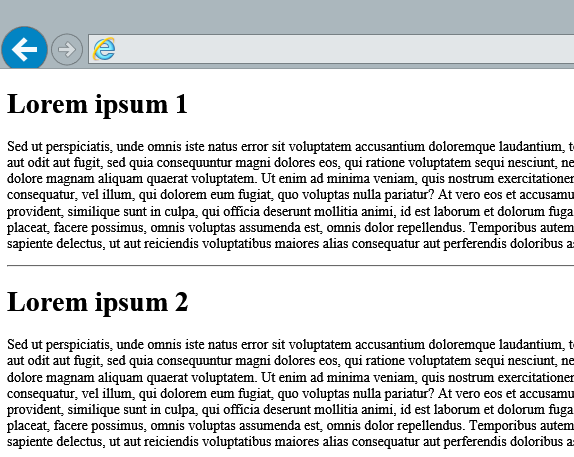

# Acessar dados do SharePoint 2013 de suplementos usando a biblioteca de domínio cruzado
Saiba como acessar dados em um site de SharePoint do seu suplemento usando a biblioteca de domínio cruzado no SharePoint 2013.
Quando você cria Suplementos do SharePoint, você geralmente têm incorporar dados de várias origens. Mas para  [razões de segurança](http://msdn.microsoft.com/library/cc709423.aspx), estão bloqueando mecanismos que impedem a comunicação com mais de um domínio por vez. Esses mecanismos de segurança são implementados na maioria dos navegadores, tornando difícil ou impossível para realizar chamadas do lado do cliente em domínios.
  
    
    

Figura 1 mostra uma solicitação bloqueada em domínios.
**Figura 1. Solicitação de bloqueados entre domínios**

  
    
    
Quando um usuário solicita uma página do seu domínio suplemento (1), a comunicação do lado do cliente é vinculada somente para esse domínio. O suplemento pode emitir chamadas de cliente na página apenas para outros recursos no mesmo domínio. No entanto, suplementos geralmente exigem recursos de outros domínios, como o domínio de SharePoint, para atender os cenários. No código da sua página, você pode tentar emitir uma solicitação para o domínio de SharePoint (2), que é bloqueado pelo navegador. Geralmente, você vê um erro de **acesso negado**. O erro não sugerem que você não tem permissões para os recursos solicitados mas, provavelmente, você ainda não consegue emitir uma solicitação para os recursos mencionados.Quando você usa a biblioteca de domínio cruzado, as páginas da Web no seu suplemento podem acessar dados em seu domínio suplemento e o domínio SharePoint. A biblioteca de domínio cruzado é uma alternativa do lado do cliente no formulário de um arquivo de JavaScript (SP RequestExecutor.js) que está hospedado no site SharePoint que você pode fazer referência no seu suplemento remoto. A biblioteca de domínio cruzado permite interagir com mais de um domínio em sua página de suplemento remoto através de um proxy. É uma boa opção se você gosta suplemento código executado no cliente, em vez de no servidor, e se houver obstáculos de conectividade, como firewalls, entre SharePoint e sua infraestrutura remota. Você pode acessar dados na web host — por exemplo, você pode acessar listas que usuários finais interagem com, independentemente de seu suplemento. Ou você pode acessar dados na web suplemento, como listas de especificamente provisionadas para seu suplemento suplementos também podem acessar outros conjuntos de sites e sites desde o suplemento tem permissões de escopo do locatário e ele foi implantado como uma instalação de lote usando o catálogo de suplemento.
> [!OBSERVAçãO]
> Neste tópico, **domínio suplemento** refere-se para o domínio que hospeda as páginas de suplemento. Isso pode ser o domínio de uma web remota aplicativo em um provedor hospedado, mas suplemento páginas também pode estar em SharePoint na web suplemento e fazer chamadas para o domínio de web de host. No último cenário, o domínio suplemento é o domínio da web suplemento.
  
    
    

O exemplo principal neste artigo mostra como criar um suplemento que lê os dados na web suplemento e o exibe em uma página da Web. A seção  [Páginas seguintes](access-sharepoint-2013-data-from-add-ins-using-the-cross-domain-library.md#SP15Accessdatafromremoteapp_Next) mostra mais cenários que criam sobre o exemplo principal.
## Pré-requisitos para usar os exemplos deste artigo
<a name="SP15Accessdatafromremoteapp_Prereq"> </a>

Para acompanhar os exemplos deste artigo, você precisa do seguinte:
  
    
    

-  [O Visual Studio 2012](https://www.microsoft.com/en-us/download/details.aspx?id=30682)
    
  
-  [Ferramentas de desenvolvedor do Microsoft Office para Visual Studio 2012](https://msdn.microsoft.com/en-us/office/aa905340.aspx)
    
  
- Um ambiente de desenvolvimento SharePoint 2013 (isolamento de aplicativo necessário para cenários de local)
    
  

## Leia os dados no suplemento web usando a biblioteca de domínio cruzado
<a name="SP15Accessdatafromremoteapp_Codeexample"> </a>

Neste exemplo, há uma página simples hospedada fora do SharePoint que usa um ponto de extremidade de estado transferir REST (REPRESENTATIONAL) para ler dados em um site de SharePoint (suplemento web). Como a biblioteca de domínio cruzado requer um suplemento web, faz sentido iniciar com esse cenário.
  
    
    
Para ler dados da web suplemento, você deve fazer o seguinte:
  
    
    

1. Crie um projetos Suplemento do SharePoint e da web.
    
  
2. Crie itens de lista na web suplemento. Essa etapa também garante que um suplemento web é criada quando os usuários implantar o suplemento.
    
  
3. Crie uma página de suplemento que usa a biblioteca de domínio cruzado para ler os itens de lista.
    
  
Figura 2 mostra uma página da Web que exibe os dados na web suplemento.
  
    
    

**Figura 2. Página da Web que exibe os dados na web suplemento**

  
    
    

  
    
    

  
    
    

### Criar um projetos Suplemento do SharePoint e da web


1. Abra Visual Studio 2012 como administrador. (Para fazer isso, clique com botão direito no ícone de Visual Studio 2012 no menu **Iniciar** e escolha **Executar como administrador**.)
    
  
2. Crie um novo projeto usando o modelo de **suplemento para o SharePoint 2013**.
    
    O modelo de **suplemento para o SharePoint 2013** no Visual Studio 2012 está localizado em **modelos** **>** **Visual c#**, **Office SharePoint** **>** **suplementos**.
    
  
3. Fornece a URL de site do SharePoint que você deseja usar para depuração.
    
  
4. Selecione o **provedor hospedado** como a opção de hospedagem para seu suplemento.
    
    > [!OBSERVAçãO]
      > Você também pode usar a biblioteca de domínio cruzado em um suplemento hospedado no SharePoint. No entanto, em um suplemento hospedado no SharePoint a página add-in já está no suplemento web, no qual caso para que ele não será necessário biblioteca entre domínios ler os itens de lista. Para uma amostra de suplemento hospedado no SharePoint que lê dados na web host, consulte  [usar a biblioteca de domínio cruzado em um hospedado no SharePoint suplemento (REST)](http://code.msdn.microsoft.com/SharePoint-2013-Use-the-00c37814) ou [Acessar dados da web host](access-sharepoint-2013-data-from-add-ins-using-the-cross-domain-library.md#SP15Accessdatafromremoteapp_Hostweb) neste artigo.

### Criar itens de lista na web suplemento


1. Clique com botão direito do projeto Suplemento do SharePoint no **Solution Explorer**. Escolha **Adicionar** **>** **Novo Item...**
    
  
2. Escolha **os itens do Visual c#** **>** **Office/SharePoint** **>** **lista**. Defina o nome da sua lista de **anúncios**.
    
  
3. Clique duas vezes **anúncios** **>** **elements**. Cole os seguintes nós XML como filhos do elemento **ListInstance**.
    
  ```
  
<Data>
    <Rows>
        <Row>
            <Field Name="Title">Lorem ipsum 1</Field>
            <Field Name="Body">Sed ut perspiciatis, unde omnis iste...</Field>
        </Row>
        <Row>
            <Field Name="Title">Lorem ipsum 2</Field>
            <Field Name="Body">Sed ut perspiciatis, unde omnis iste...</Field>
        </Row>
    </Rows>
</Data>
  ```


### Para adicionar uma nova página que usa a biblioteca de domínio cruzado


1. Clique duas vezes em **Default. aspx** no projeto da web no **Solution Explorer**.
    
  
2. Copie o seguinte código e cole-o no arquivo default. aspx. O código executa as seguintes tarefas:
    
  - Carrega a biblioteca jQuery da Microsoft CDN.
    
  
  - Fornece um espaço reservado para o resultado.
    
  
  - Extrai a URL da web suplemento da cadeia de consulta.
    
  
  - Carrega a biblioteca de domínio cruzado JavaScript usando a função **getScript** em jQuery.
    
    A função carrega os recursos necessários e então continua a função especificada, garantindo que a biblioteca de domínio cruzado foi carregado e está disponível para uso pelo código subsequente.
    
  
  - Cria uma instância do objeto **RequestExecutor**. Por padrão, RequestExecutor usa web suplemento como o site de contexto.
    
    > [!OBSERVAçãO]
      > Você pode alterar o site de contexto para outros sites diferentes web suplemento usando o ponto de extremidade do **AppContextSite** (REST) ou o objeto (JSOM). Para saber mais sobre AppContextSite, consulte [Acessar dados da web host](access-sharepoint-2013-data-from-add-ins-using-the-cross-domain-library.md#SP15Accessdatafromremoteapp_Hostweb) posteriormente neste artigo.
  - Problemas de uma chamada REST para o ponto de extremidade de itens de lista.
    
  
  - Alças de conclusão bem-sucedida, exibindo os itens de lista na página da Web.
    
  
  - Trata de erros, exibindo a mensagem de erro na página da Web.
    
  

  ```
  
<html>
    <head>
        <title>Cross-domain sample</title>
    </head>
    <body>
        <!-- This is the placeholder for the announcements -->
        <div id="renderAnnouncements"></div>
        <script 
            type="text/javascript" 
            src="//ajax.aspnetcdn.com/ajax/jQuery/jquery-1.7.2.min.js">
        </script>
        <script type="text/javascript">
          var hostweburl;
          var appweburl;

          // Load the required SharePoint libraries
          $(document).ready(function () {
            //Get the URI decoded URLs.
            hostweburl =
                decodeURIComponent(
                    getQueryStringParameter("SPHostUrl")
            );
            appweburl =
                decodeURIComponent(
                    getQueryStringParameter("SPAppWebUrl")
            );

            // resources are in URLs in the form:
            // web_url/_layouts/15/resource
            var scriptbase = hostweburl + "/_layouts/15/";

            // Load the js files and continue to the successHandler
            $.getScript(scriptbase + "SP.RequestExecutor.js", execCrossDomainRequest);
          });

          // Function to prepare and issue the request to get
          //  SharePoint data
          function execCrossDomainRequest() {
            // executor: The RequestExecutor object
            // Initialize the RequestExecutor with the add-in web URL.
            var executor = new SP.RequestExecutor(appweburl);

            // Issue the call against the add-in web.
            // To get the title using REST we can hit the endpoint:
            //      appweburl/_api/web/lists/getbytitle('listname')/items
            // The response formats the data in the JSON format.
            // The functions successHandler and errorHandler attend the
            //      sucess and error events respectively.
            executor.executeAsync(
                {
                  url:
                      appweburl +
                      "/_api/web/lists/getbytitle('Announcements')/items",
                  method: "GET",
                  headers: { "Accept": "application/json; odata=verbose" },
                  success: successHandler,
                  error: errorHandler
                }
            );
          }

          // Function to handle the success event.
          // Prints the data to the page.
          function successHandler(data) {
            var jsonObject = JSON.parse(data.body);
            var announcementsHTML = "";

            var results = jsonObject.d.results;
            for (var i = 0; i < results.length; i++) {
              announcementsHTML = announcementsHTML +
                  "<p><h1>" + results[i].Title +
                  "</h1>" + results[i].Body +
                  "</p><hr>";
            }

            document.getElementById("renderAnnouncements").innerHTML =
                announcementsHTML;
          }

          // Function to handle the error event.
          // Prints the error message to the page.
          function errorHandler(data, errorCode, errorMessage) {
            document.getElementById("renderAnnouncements").innerText =
                "Could not complete cross-domain call: " + errorMessage;
          }

          // Function to retrieve a query string value.
          // For production purposes you may want to use
          //  a library to handle the query string.
          function getQueryStringParameter(paramToRetrieve) {
            var params =
                document.URL.split("?")[1].split("&amp;");
            var strParams = "";
            for (var i = 0; i < params.length; i = i + 1) {
              var singleParam = params[i].split("=");
              if (singleParam[0] == paramToRetrieve)
                return singleParam[1];
            }
          }
        </script>
    </body>
</html>
  ```


### Para criar e executar a solução


1. Pressione a tecla F5.
    
    > [!OBSERVAçãO]
      > Quando você pressionar F5, Visual Studio cria a solução, implanta o suplemento e abre a página de permissões para o suplemento.
2. Escolha o botão **Confiar**.
    
  
3. Escolha o ícone de suplemento na página **Conteúdo** do Site.
    
  
Se você preferir amostras de código para download, você pode obter da Galeria de código. **Código de exemplo: obtém itens de lista usando a biblioteca de domínio cruzado** usando [SharePoint-Add-in-REST-OData-CrossDomain](https://github.com/OfficeDev/SharePoint-Add-in-REST-OData-CrossDomain) ou [SharePoint-adicionar-em-JSOM-CrossDomain](https://github.com/OfficeDev/SharePoint-Add-in-JSOM-CrossDomain).
  
    
    

**Tabela 2. A solução de problemas**


|**Se você vir …**|**Tente...**|
|:-----|:-----|
|Mensagem de erro: Desculpe, tivemos alguns problemas ao acessar seu site. <br/> Também há um botão para corrigir o erro, mas ele não corrigir o problema. <br/> |Você pode ter pressionar um problema conhecido com zonas de segurança no Internet Explorer, consulte  [Trabalhar com a biblioteca entre domínios entre diferentes zonas de segurança do Internet Explorer no SharePoint Add-ins](work-with-the-cross-domain-library-across-different-internet-explorer-security-z.md). <br/> |
|Mensagem de erro: as funcionalidades necessárias não são suportadas pelo seu navegador. Verifique se que você estiver usando o IE 8 ou acima ou outro moderno navegador. Verifique se a metamarca 'X UA compatíveis com-' está definida para ser '= IE 8' ou acima. <br/> |A biblioteca de domínio cruzado requer um modo de documento do **IE8** ou acima. Em alguns cenários, o modo de documento é definido para o **IE7** por padrão. Você pode usar as ferramentas de desenvolvedor do Internet Explorer para determinar e alterar o modo de documento da sua página. Para obter mais informações, consulte [Definindo a compatibilidade de documentos](http://msdn.microsoft.com/library/cc288325.aspx). <br/> |
|Mensagem de erro: 'Tipo' é indefinido. <br/> Além disso, o suplemento usa o JavaScript modelo de objeto (JSOM). <br/> |O JSOM usa o método de **Type.registerNamespace** na biblioteca do Microsoft Ajax para registrar o namespace **SP**. Use o código a seguir para adicionar uma referência à biblioteca do Microsoft Ajax da sua página: <br/> ```HTML<script type="text/javascript"  src="//ajax.aspnetcdn.com/ajax/4.0/1/MicrosoftAjax.js"></script>```|
   

## Páginas seguintes
<a name="SP15Accessdatafromremoteapp_Next"> </a>

Este artigo mostra como consultar um ponto de extremidade restante para ler dados da web suplemento usando uma página de suplemento que não está hospedada no SharePoint. Você também pode explorar os seguintes cenários e detalhes sobre a biblioteca de domínio cruzado.
  
    
    

### Usar o JSOM para ler dados da web suplemento
<a name="SP15Accessdatafromremoteapp_JSOM"> </a>

Dependendo de sua preferência, talvez você queira usar a JSOM em vez de REST para consultar dados da web suplemento. Você deve concluir tarefas adicionais para usar a biblioteca de domínio cruzado com JSOM:
  
    
    

- Referência a SharePoint JSOM em sua página de suplemento.
    
  
- Inicializar o objeto **ProxyWebRequestExecutorFactory** e defini-lo como o factory do objeto de contexto.
    
  
- Acesse os objetos SharePoint para ler os dados da lista.
    
  
- Os objetos no contexto de carregar e executar a consulta.
    
  
Para um código exemplo que mostra como executar as tarefas, consulte  [SharePoint-adicionar-em-JSOM-CrossDomain](https://github.com/OfficeDev/SharePoint-Add-in-JSOM-CrossDomain). Para obter mais informações sobre como usar o JSOM, consulte  [usando o modelo de objeto JavaScript (JSOM) no SharePoint suplementos](http://blogs.msdn.com/b/officeapps/archive/2012/09/04/using-the-javascript-object-model-jsom-in-apps-for-sharepoint.aspx).
  
    
    

### Acessar dados da web host
<a name="SP15Accessdatafromremoteapp_Hostweb"> </a>

O exemplo desta página mostra como ler dados da web suplemento. Isso funciona, bem como o exemplo inicial, como a biblioteca de domínio cruzado inicialmente usa o suplemento como o site de contexto. No entanto, há muitos cenários em que você deseja acessar dados na web host. Há algumas tarefas necessárias para acessar os dados na web host:
  
    
    

- Defina web host como o site de contexto para a biblioteca de domínio cruzado.
    
  
- Forneça permissões apropriadas para o suplemento.
    
  
Você pode alterar o site de contexto usando o ponto de extremidade do **AppContextSite** (REST) ou o objeto (JSOM). O exemplo a seguir mostra como alterar o site de contexto usando o ponto de extremidade do resto:
  
    
    


```

executor.executeAsync(
    {
        url:
            appweburl +
            "/_api/SP.AppContextSite(@target)/web/title?@target='" +
            hostweburl + "'",
        method: "GET",
        headers: { "Accept": "application/json; odata=verbose" },
        success: successHandler,
        error: errorHandler
    }
);
```

O exemplo de código a seguir mostra como alterar o site de contexto usando JSOM:
  
    
    


```

context = new SP.ClientContext(appweburl);
factory = new SP.ProxyWebRequestExecutorFactory(appweburl);
context.set_webRequestExecutorFactory(factory);
appContextSite = new SP.AppContextSite(context, hostweburl);

this.web = appContextSite.get_web();
context.load(this.web);
```

Por padrão, o suplemento tem permissões para o suplemento da web, mas não para a web de host. O exemplo a seguir mostra uma seção manifesto que declara uma solicitação de permissão para ler dados da web host:
  
    
    


```XML

<AppPermissionRequests>
    <AppPermissionRequest 
        Scope="http://sharepoint/content/sitecollection/web" 
        Right="Read" />
</AppPermissionRequests>
```

Certifique-se de que você criar um recurso na web suplemento (como uma página vazia ou lista) para forçar o provisionamento de suplemento web, que é necessário para usar a biblioteca de domínio cruzado.
  
    
    

### Dados do Access entre conjuntos de sites
<a name="SP15Accessdatafromremoteapp_TenantScope"> </a>

Com a biblioteca de domínio cruzado, você pode acessar dados entre conjuntos de sites no mesmo locatário. Há algumas tarefas que você precisa concluir para acessar dados entre conjuntos de sites:
  
    
    

- Adicione uma solicitação de permissão para acessar dados no locatário.
    
  
- No seu código, alterne o site de contexto para os conjuntos de sites que você deseja consultar.
    
  
- Adicione o suplemento no catálogo de suplemento.
    
  
- Implante o suplemento como um escopo de locatário suplemento para um site. Para obter um exemplo sobre como implantar como um suplemento com escopo locatário, consulte a descrição do código  [usar a biblioteca de domínio cruzado suplemento um escopo de locatário (REST)](http://code.msdn.microsoft.com/SharePoint-2013-Use-the-6b3e4c1e) de exemplo.
    
  
Seu suplemento também precisa de permissão para acessar dados do locatário. O exemplo a seguir mostra uma seção manifesto que declara uma solicitação de permissão para ler dados do locatário de:
  
    
    


```XML

<AppPermissionRequests>
  <AppPermissionRequest 
    Scope="http://sharepoint/content/tenant" 
    Right="Read" />
</AppPermissionRequests>
```

Para alternar o site de contexto no seu código, use o ponto de extremidade do **AppContextSite** (REST) ou o objeto (JSOM), assim como na seção de [Acessar dados da web host](access-sharepoint-2013-data-from-add-ins-using-the-cross-domain-library.md#SP15Accessdatafromremoteapp_Hostweb) . Aqui está um lembrete sobre o ponto de extremidade do resto: /_api/SP. Web/AppContextSite(@target)/title? @ destino = 'weburl'e um exemplo sobre como criar uma instância do objeto no JSOM: `appContextSite = new SP.AppContextSite(context, weburl);`.
  
    
    
Como um desenvolvedor, você só pode implantar o escopo do locatário suplementos do catálogo de suplemento. Você pode provisionar um catálogo de suplemento ao seu local ou SharePoint Online ambientes. Carregar o suplemento no catálogo de suplemento é tão simple quanto ao carregar um arquivo em uma biblioteca de documentos. Consulte  [Adicionar suplementos personalizados para o site de catálogo de suplemento](http://office.microsoft.com/en-us/sharepoint-help/use-the-app-catalog-to-make-custom-business-apps-available-for-your-sharepoint-online-environment-HA102772362.aspx) para obter instruções detalhadas.
  
    
    
Do catálogo de suplemento que você pode implantar o suplemento para um ou mais sites no locatário. Como seu suplemento tem permissões para acessar dados no locatário, você só precisa implantar em um site para acessar dados sobre o site principal. Consulte  [implantar um suplemento personalizado](http://office.microsoft.com/en-us/sharepoint-help/use-the-app-catalog-to-make-custom-business-apps-available-for-your-sharepoint-online-environment-HA102772362.aspx) para obter instruções sobre como implantar um suplemento do catálogo de suplemento.
  
    
    
Para baixar um exemplo de código que mostra como acessar dados entre conjuntos de sites, consulte  [usar a biblioteca de domínio cruzado suplemento um escopo de locatário (REST)](http://code.msdn.microsoft.com/SharePoint-2013-Use-the-6b3e4c1e).
  
    
    

### Emitir chamadas entre zonas de segurança diferentes
<a name="SP15Accessdatafromremoteapp_IEZones"> </a>

A biblioteca de domínio cruzado usa uma página de proxy que está hospedada em um **IFrame** na página add-in para permitir a comunicação. Quando a página add-in e o site do SharePoint estão em zonas de segurança diferentes, cookies de autorização não podem ser enviados. Se nenhum cookie de autorização e o IFrame tenta carregar a página de proxy, ele será redirecionado para a página de entrada do SharePoint. Página de entrada do SharePoint não pode ser contida em um IFrame por razões de segurança. Nesses cenários, a biblioteca não pode carregar a página de proxy e comunicação com o SharePoint não é possível.
  
    
    
No entanto, há uma solução para esses cenários. A solução é o **padrão de apphost**, que consiste em páginas de suplemento de disposição em uma página hospedada na web suplemento. É recomendável usar os padrões de apphost em suplementos que usam a biblioteca de domínio cruzado, mesmo se não houver nenhuma limites de segurança evidente. Para obter mais informações, consulte [Trabalhar com a biblioteca entre domínios entre diferentes zonas de segurança do Internet Explorer no SharePoint Add-ins](work-with-the-cross-domain-library-across-different-internet-explorer-security-z.md).
  
    
    

### Dados do Access de um host remoto adicional em um suplemento hospedado no SharePoint
<a name="SP15Accessdatafromremoteapp_SPhosted"> </a>

Por padrão, um suplemento hospedado no SharePoint é permitido para emitir chamadas entre domínios à web host, desde que tenha as permissões adequadas. No entanto, um suplemento hospedado no SharePoint também pode especificar um host remoto no atributo **AllowedRemoteHostUrl** do seu **AppPrincipal**. Isso efetivamente permite chamadas entre domínios da web suplemento e de outro host em outro lugar do problema.
  
    
    
Para baixar um exemplo de uma suplemento hospedado no SharePoint que usa a biblioteca de domínio cruzado, consulte  [código de exemplo: usar a biblioteca de domínio cruzado em um hospedado no SharePoint suplemento (REST)](http://code.msdn.microsoft.com/SharePoint-2013-Use-the-00c37814).
  
    
    

## Recursos adicionais
<a name="SP15Accessdatafromremoteapp_Addresources"> </a>


-  [SharePoint-Add-in-REST-OData-CrossDomain](https://github.com/OfficeDev/SharePoint-Add-in-REST-OData-CrossDomain)
    
  
-  [SharePoint-adicionar-em-JSOM-CrossDomain](https://github.com/OfficeDev/SharePoint-Add-in-JSOM-CrossDomain)
    
  
-  [Código de exemplo: obtenha o host do título da web usando a biblioteca de domínio cruzado (REST)](http://code.msdn.microsoft.com/SharePoint-2013-Get-the-0ec36bb6)
    
  
-  [Código de exemplo: obtenha o host do título da web usando a biblioteca de domínio cruzado (JSOM)](http://code.msdn.microsoft.com/office/SharePoint-2013-Get-the-563f2a3d)
    
  
-  [Código de exemplo: usar a biblioteca de domínio cruzado em um hospedado no SharePoint suplemento (REST)](http://code.msdn.microsoft.com/SharePoint-2013-Use-the-00c37814)
    
  
-  [Código de exemplo: usar a biblioteca de domínio cruzado em um escopo do locatário suplemento (REST)](http://code.msdn.microsoft.com/SharePoint-2013-Use-the-6b3e4c1e)
    
  
-  [Código de exemplo: Use o controle de chrome e a biblioteca de domínio cruzado (REST)](http://code.msdn.microsoft.com/SharePoint-2013-Use-the-a759e9f8)
    
  
-  [Código de exemplo: Use o controle de chrome e a biblioteca de domínio cruzado (JSOM)](http://code.msdn.microsoft.com/SharePoint-2013-Use-the-97c30a2e)
    
  
-  [Código de exemplo: usar ações personalizadas e a biblioteca de domínio cruzado a ordem de livros](http://code.msdn.microsoft.com/SharePoint-2013-Open-a-36d1598d)
    
  
-  [Seguro cliente e o acesso a dados modelos de objeto para o SharePoint Add-ins](secure-data-access-and-client-object-models-for-sharepoint-add-ins.md)
    
  
-  [Trabalhar com a biblioteca entre domínios entre diferentes zonas de segurança do Internet Explorer no SharePoint Add-ins](work-with-the-cross-domain-library-across-different-internet-explorer-security-z.md)
    
  
-  [Criar uma página personalizada de proxy para a biblioteca entre domínios no SharePoint 2013](create-a-custom-proxy-page-for-the-cross-domain-library-in-sharepoint-2013.md)
    
  
-  [Consulta um serviço remoto usando o proxy da web no SharePoint 2013](query-a-remote-service-using-the-web-proxy-in-sharepoint-2013.md)
    
  
-  [Configurar um ambiente de desenvolvimento local para suplementos do SharePoint](set-up-an-on-premises-development-environment-for-sharepoint-add-ins.md)
    
  
