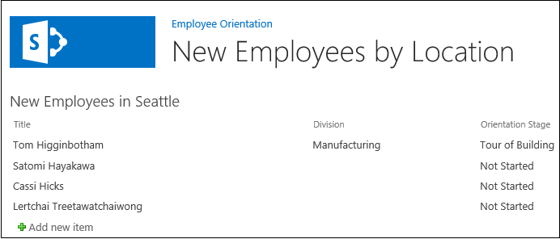

# Adicionar uma Web Part a uma página em um SharePoint hospedado SharePoint Add-in
Saiba como incluir Web Parts em uma página em um Suplementos do SharePoint.
Esse é o quinto em uma série de artigos sobre noções básicas do desenvolvimento hospedado no SharePoint Suplementos do SharePoint. Você primeiro deve estar familiarizado com  [Suplementos do SharePoint](sharepoint-add-ins.md) e os artigos anteriores desta série:
  
    
    


-  [Introdução à criação de Suplementos do SharePoint hospedados no SharePoint](get-started-creating-sharepoint-hosted-sharepoint-add-ins.md)
    
  
-  [Implantar e instalar um hospedado no SharePoint SharePoint Add-in](deploy-and-install-a-sharepoint-hosted-sharepoint-add-in.md)
    
  
-  [Adicionar colunas personalizadas para um suplemento do SharePoint-hostedSharePoint](add-custom-columns-to-a-sharepoint-hostedsharepoint-add-in.md)
    
  
-  [Adicionar um tipo de conteúdo personalizado a um suplemento do SharePoint-hostedSharePoint](add-a-custom-content-type-to-a-sharepoint-hostedsharepoint-add-in.md)
    
  

> **OBSERVAçãO**
> Se você tiver trabalhado através desta série sobre hospedado no SharePoint suplementos, então você possui uma solução de Visual Studio que você pode usar para continuar com este tópico. Você também pode baixar o repositório em  [SharePoint_SP-hosted_Add-Ins_Tutorials](https://github.com/OfficeDev/SharePoint_SP-hosted_Add-Ins_Tutorials) e abra o arquivo BeforeWebPart.sln.
  
    
    

Neste artigo, você adicionar uma Web Part à página padrão da orientação do funcionário Suplemento do SharePoint.
## Adicionar uma Web Part a uma página


  
    
    

1. No **Solution Explorer**, abra o arquivo default. aspx.
    
  
2. Serão adicionados uma Web Part de exibição de lista para a página que mostra a lista de Novos funcionários em Seattle , portanto não mais é necessário ter um link para a página de modo de exibição de lista na lista. Remova o elemento **<asp:HyperLink>** o elemento **<asp:Content>** cujo **ContentPlaceHolderId** é `PlaceHolderMain`.
    
  
3. Dentro do mesmo elemento **<asp:Content>**, adicione a seguinte **WebPartZone**.
    
  ```XML
  
<WebPartPages:WebPartZone runat="server" FrameType="TitleBarOnly"
      ID="HomePage1" Title="loc:full" />

  ```

4. Salve e feche o arquivo.
    
  
5. No **Solution Explorer**, abra o arquivo Elements XML para a página no nó de **páginas**.
    
  
6. Se o elemento **File** for fechamento automático, remova o caractere "/" ele e adicione a marca de fim `</File>`.
    
  
7. No elemento **File**, adicione um elemento de **AllUsersWebPart** filho e defina seu **WebPartZoneID** para a identificação da zona Web Part que você criou na página. O conteúdo do arquivo agora deve se parecer com o seguinte. Essa marcação informa ao SharePoint para inserir um **AllUsersWebPart** na zona Web Part chamado "HomePage1".
    
  ```
  
<Elements xmlns="http://schemas.microsoft.com/sharepoint/">
  <Module Name="Pages">
    <File Path="Pages\\Default.aspx" Url="Pages/Default.aspx" ReplaceContent="TRUE" >
      <AllUsersWebPart WebPartZoneID="HomePage1" WebPartOrder="1">

      </AllUsersWebPart>
    </File>
  </Module>
</Elements>

  ```

8. Adicionar um elemento de **CDATA** como um filho do **AllUsersWebPart**, adicione um elemento **webParts** como um filho do **CDATA**, conforme mostrado na seguinte marcação.
    
  ```
  
<AllUsersWebPart WebPartZoneID="HomePage1" WebPartOrder="1">
  <![CDATA[
    <webParts>

    </webParts>
  ]]>
</AllUsersWebPart>
  ```

9. Adicione a seguinte marcação de **webPart** como um filho do elemento **webParts**. Essa marcação adiciona um **XsltListViewWebPart** e informa a Web Part para mostrar a lista deNovos funcionários em Seattle . Observe que o valor da propriedade **ViewContentTypeId** é apenas "0x", não a identificação real do tipo de conteúdoNewEmployee .
    
  ```
  
  <webPart xmlns="http://schemas.microsoft.com/WebPart/v3">
    <metaData>
      <type name="Microsoft.SharePoint.WebPartPages.XsltListViewWebPart, 
                   Microsoft.SharePoint, Version=15.0.0.0, Culture=neutral, 
                   PublicKeyToken=71e9bce111e9429c" />
    </metaData>
    <data>
      <properties>
        <property name="ListUrl">Lists/NewEmployeesInSeattle</property>
        <property name="IsIncluded">True</property>
        <property name="NoDefaultStyle">True</property>
        <property name="Title">New Employees in Seattle</property>
        <property name="PageType">PAGE_NORMALVIEW</property>
        <property name="Default">False</property>
        <property name="ViewContentTypeId">0x</property>
      </properties>
    </data>
  </webPart>
  ```


## Executar e testar o suplemento


  
    
    

1. Use a tecla F5 para implantar e executar seu suplemento Visual Studio faz uma instalação temporária do add-in no seu site do SharePoint de teste e o executa imediatamente o add-in.
    
  
2. Quando página de padrão do add-in for aberto, Web Part de exibição de lista é nele e a lista é exibida.
    
   **Página de Web part do modo de exibição de lista padrão**

  

     
  

    
    
  
3. Tente adicionar novos itens à lista e edição de itens existentes.
    
  
4. Para encerrar a sessão de depuração, feche a janela do navegador ou interromper a depuração em Visual Studio. Cada vez que você pressionar F5, Visual Studio retração da versão anterior do add-in e instalar a versão mais recente.
    
  
5. Você irá trabalhar com essa solução de suplemento e Visual Studio em outros artigos e é uma boa prática para cancelar o suplemento uma última vez quando terminar de trabalhar com ele por algum tempo. Com o botão direito do projeto no **Solution Explorer** e escolha **Retract**.
    
  

## 
<a name="Nextsteps"> </a>

O próximo artigo desta série, você adicionará um fluxo de trabalho para o Suplemento do SharePoint:  [Adicionar um fluxo de trabalho para um hospedado no SharePoint SharePoint Add-in](add-a-workflow-to-a-sharepoint-hosted-sharepoint-add-in.md).
  
    
    

