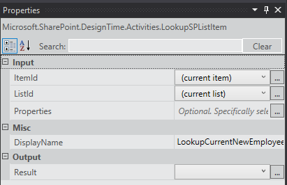
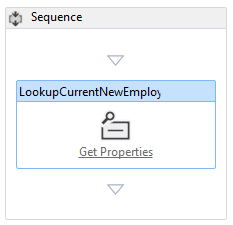
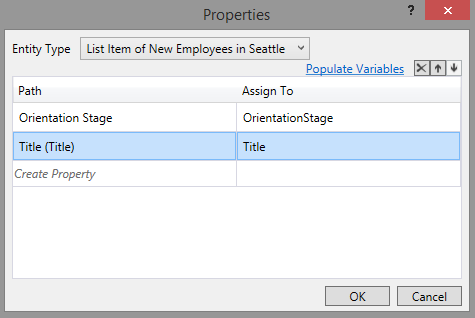
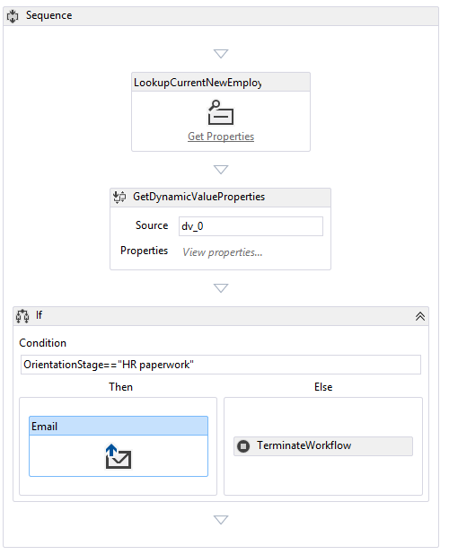
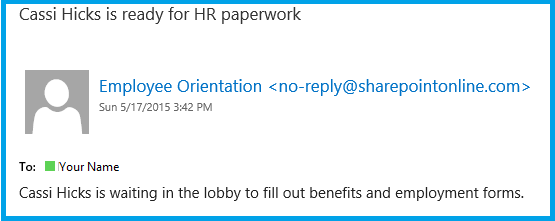

# Adicionar um fluxo de trabalho para um hospedado no SharePoint SharePoint Add-in
Saiba como incluir um fluxo de trabalho em um Suplemento do SharePoint.
Este é o sexto em uma série de artigos sobre noções básicas do desenvolvimento hospedado no SharePoint Suplementos do SharePoint. Você primeiro deve estar familiarizado com  [Suplementos do SharePoint](sharepoint-add-ins.md) e os artigos anteriores desta série:
  
    
    

-  [Introdução à criação de Suplementos do SharePoint hospedados no SharePoint](get-started-creating-sharepoint-hosted-sharepoint-add-ins.md)
    
  
-  [Implantar e instalar um hospedado no SharePoint SharePoint Add-in](deploy-and-install-a-sharepoint-hosted-sharepoint-add-in.md)
    
  
-  [Adicionar colunas personalizadas para um suplemento do SharePoint-hostedSharePoint](add-custom-columns-to-a-sharepoint-hostedsharepoint-add-in.md)
    
  
-  [Adicionar um tipo de conteúdo personalizado a um suplemento do SharePoint-hostedSharePoint](add-a-custom-content-type-to-a-sharepoint-hostedsharepoint-add-in.md)
    
  
-  [Adicionar uma Web Part a uma página em um SharePoint hospedado SharePoint Add-in](add-a-web-part-to-a-page-in-a-sharepoint-hosted-sharepoint-add-in.md)
    
  

> [!OBSERVAçãO]
> Se você tiver trabalhado através desta série sobre hospedado no SharePoint suplementos, então você possui uma solução de Visual Studio que você pode usar para continuar com este tópico. Você também pode baixar o repositório em  [SharePoint_SP-hosted_Add-Ins_Tutorials](https://github.com/OfficeDev/SharePoint_SP-hosted_Add-Ins_Tutorials) e abra o arquivo BeforeWorkflow.sln.
  
    
    

Neste artigo, você adicionar um fluxo de trabalho a orientação de funcionário Suplemento do SharePoint que notifica o departamento de recursos humanos (RH) que um novo funcionário está pronto para preencher a documentação de RH.
## Adicionar um fluxo de trabalho a um suplemento

  
    
    

1. No **Solution Explorer**, clique com botão direito do projeto e escolha **Adicionar** > **Nova pasta**. Nomeie a pasta fluxos de trabalho.
    
  
2. Clique com botão direito do mouse na nova pasta e escolha **Adicionar** > **Novo Item**. A caixa de diálogo **Adicionar Novo Item** é aberta no nó **Office/SharePoint**.
    
  
3. Escolha o **fluxo de trabalho** e dê a ela o nomeHR_Intake. Quando solicitado a escolher o tipo de fluxo de trabalho, selecione **Fluxo de trabalho de lista** e escolha **Avançar**.
    
  
4. Na próxima página do assistente, habilite o **Sim, associar …** opção e em seguida, defina a lista suspensa controles para os seguintes valores:
    
  - **A biblioteca ou lista para associar seu fluxo de trabalho**
    
    Novos funcionários em Seattle
    
  
  - **A lista de histórico …**
    
    < criar novo >
    
  
  - **Lista de tarefas …**
    
    < criar novo >
    
  

    Clique em **Avançar**.
    
  
5. Na última página do assistente, habilite  *apenas*  a opção para iniciar o fluxo de trabalho automaticamente quando um item for *alterado*  .
    
  
6. Escolha **Concluir**.
    
    O Office Developer Tools for Visual Studio e em seguida, execute o seguinte procedimento:
    
  - Crie um fluxo de trabalho HR_Intake na pasta do **fluxo de trabalho**, com um arquivo de Workflow.xaml filho que está aberto no designer de fluxo de trabalho.
    
  
  - Crie uma instância de lista de **WorkflowTaskList** onde as tarefas que fazem parte do fluxo de trabalho são criadas e atualizadas.
    
  
  - Crie uma instância de lista de **WorkflowHistoryList**, que é um log das várias etapas em cada execução do fluxo de trabalho que ocorrerem.
    
  
7. Arraste as duas novas instâncias de lista para a pasta de **lista**.
    
  

## Projetar o fluxo de trabalho

O fluxo de trabalho envia um email para notificar um membro da equipe de RH que o novo funcionário concluiu o estágio **Tour de construção** da orientação e está pronto para preencher a documentação de aberturas de entrada de RH. Qualquer alteração em um item existente nos disparadores da lista deNovos funcionários em Seattle o fluxo de trabalho, mas o fluxo de trabalho não faz nada, a menos que o campo doEstágio de orientação do item da lista é definido comoa documentação de RH. Se estiver, um email é enviado para um membro da equipe de RH, e uma tarefa para aquele funcionário será adicionada ao **WorkflowTaskList**.
  
    
    

> [!OBSERVAçãO]
> AT vários momentos durante a criação de seu fluxo de trabalho, um símbolo de losango azul com um ponto de exclamação nela, 
  
    
    

  
    
    
, será exibida em um ou mais itens no designer de fluxo de trabalho. Esses erros temporários do relatório. (Passe o cursor sobre o símbolo para ver uma mensagem breve ou procure na **Lista de erros** do Visual Studio para obter detalhes). Estes são os efeitos colaterais do incompleteness do fluxo de trabalho. Eles devem ser desapareceu ao concluir esse procedimento.
  
    
    

1. Abrir o painel de **Ferramentas** em Visual Studio, expanda o nó do **SP - lista** e arraste **LookupSPListItem** para a **sequência** no designer.
    
  
2. Selecione o **LookupSPListItem** para que suas propriedades sejam exibidas no painel **Propriedades** do Visual Studio. Defina as seguintes propriedades com estes valores:
    
  - **ItemID:** (item atual)
    
  
  - **ListID:** (lista atual)
    
  
  - **DisplayName:** LookupCurrentNewEmployee
    
  

    Painel **Propriedades** agora deve parecer com o seguinte:
    

   **Painel de propriedades do LookupSPListItem**

  

     
  

    Clique em qualquer lugar fora do painel para salvar as alterações e a superfície de designer agora deve se parecer com isso.
    

   **No designer de fluxo de trabalho de sequência**

  

     
  

    
    
  
3. Clique no link **Obter propriedades** dentro da atividadeLookupCurrentNewEmployee (recém renomeado) no designer. Isso adiciona uma atividade **GetDynamicValueProperties** a sequência.
    
  
4. Clique no texto **Definir …** na atividade **GetDynamicValueProperties**. Esse procedimento abrirá a caixa de diálogo de **Propriedades**.
    
  
5. Defina o **Tipo de entidade** para o **Item de lista de** _list_instance_name_, onde  _list_instance_name_ éNovos funcionários em Seattle.
    
  
6. Na coluna **caminho**, clique na célula superior e, em seguida, escolha O estágio de orientação do menu para baixo.
    
  
7. Clique na célula abaixo dele e, em seguida, escolha **título (título)** do menu suspenso.
    
  
8. Clique em **preencher variáveis**. Isso irá criar um variáveis denominados OrientationStage e **título** e atribuir cada do valor dos campos correspondentes no item atual da lista deNovos funcionários em Seattle . Caixa de diálogo **Propriedades** agora deve parecer com o seguinte:
    
   **Caixa de diálogo Propriedades da atividade de fluxo de trabalho**

  

     
  

  

  
9. Escolha **OK**. Superfície do designer agora deve parecer com o seguinte:
    
   **Workflow Designer**

  

     
  

    
    
  
10. Abrir o painel de **Ferramentas** em Visual Studio, expanda o nó de **Fluxo de controle** e arraste **se** para a parte inferior da **sequência** abaixo do **GetDynamicValueProperties**.
    
  
11. Na caixa **condição** de **Se**, insira OrientationStage = = "RH a documentação".
    
  
12. Abrir o painel de **Ferramentas** em Visual Studio, expanda o nó do **SP - utilitários** e, em seguida, arraste o **Email** na caixa **depois** da atividade **se**.
    
  
13. Selecione a atividade de **Email**. No painel **Propriedades**, defina os valores do corpo, assunto e às propriedades. Em cada caso, escolha o botão do texto explicativo **…**, para a propriedade e use o **Editor de expressões** que abre para definir o valor da propriedade como a tabela a seguir. Estas são as expressões de cadeia de caracteres do c#, portanto, use as aspas exatamente como mostrado. O `Title` aqui é uma variável que você atribuiu anteriormente no campo **título** do item de lista (que contém o nome do funcionário).
    
  - **Corpo:** `Title + " is waiting in the lobby to fill out benefits and employment forms."`
    
  
  - **Assunto:** `Title + " is ready for HR paperwork"`
    
  
  - **Para:** `new System.Collections.ObjectModel.Collection<string>() {"your_O365_email"}`
    
    Substituir espaço reservado,  *your_O365_email*  , com a identidade que você usa para fazer logon no seu Office 365 developer da conta, como o *alias*  @ *O365domain*  . sharepoint.com. Isso é uma cadeia de caracteres c# para que ele deve estar entre aspas.
    
  
14. Abrir o painel de **Ferramentas** em Visual Studio, expanda o nó de **tempo de execução** e arraste **TerminateWorkflow** para a caixa **Else** da atividade **se**.
    
  
15. Selecione a atividade de **TerminateWorkflow** e no painel **Propriedades**, defina o **motivo** para a seguir, *incluindo as aspas*  :"não no estágio de trabalhos em papel de RH.". O designer agora deve se parecer o seguinte:
    
   **Designer de fluxo de trabalho quando o fluxo de trabalho for concluído**

  

     
  

  

  

## Executar e testar o suplemento

  
    
    

1. Use a tecla F5 para implantar e executar seu suplemento Visual Studio faz uma instalação temporária do add-in no seu site do SharePoint de teste e o executa imediatamente o add-in. Console de **Host do serviço de teste** do gerente de fluxo de trabalho, também é aberta.
    
  
2. Quando página de padrão do add-in for aberto, abra um dos itens para edição e defina o valor do Estágio de orientação paraa documentação de RH.
    
    No console do **Host do serviço de teste**, será exibida uma indicação de que o fluxo de trabalho foi iniciado. Logo depois, há uma indicação de que o fluxo de trabalho for concluído. Este é um exemplo:
    

   **Console de Host de teste do serviço**

  

     
  

    
    
    
    > [!OBSERVAçãO]
      > Se não abrir o console do **Host do serviço de teste**, você pode precisar habilitar a depuração de fluxo de trabalho. Com o botão direito no nome do projeto no **Solution Explorer** e escolha **Propriedades**. Abra a guia do **SharePoint** no painel de **Propriedades** e a caixa de seleção para **Ativar o fluxo de trabalho de depuração**.
3. Navegue até a caixa de entrada do email (Outlook) da sua conta de desenvolvedor do Office 365. Há um email com o assunto *"funcionário*  está pronta para a documentação de RH." onde o *funcionário*  é o nome do funcionário cujo item que você editou. O corpo do email diz *"Funcionário*  está aguardando no lobby para preencher formulários de emprego e benefícios." Este é um exemplo:
    
   **Emails enviados pelo fluxo de trabalho**

  

     
  

    
    
    
    > [!DICA]
      > Se o fluxo de trabalho começa, mas nunca for concluído, e não será enviado um email, tente encerrar a sessão de depuração e tentar F5 novamente algumas vezes antes de concluir lá é algo errado em seu código. Em alguns casos, o problema está em SharePoint Online.> Se você ainda estiver tendo problemas, tente adicionar um tipo de conteúdo chamado **ListFieldsContentType**, se não houver um já, a seção **ContentTypes** do arquivo Schema. XML. O exemplo a seguir é um exemplo da marcação.>  `<ContentType ID="0x0100781dd48170b94fdc9706313c82b3d04c" Name="ListFieldsContentType" Hidden="TRUE">`
  
    
    
 `</ContentType>`> Copie o todo da seção do tipo de conteúdo **NewEmployee** **FieldRefs** para este novo tipo de conteúdo.> Salvar o projeto, cancelar e tente novamente o F5.
4. Para encerrar a sessão de depuração, feche a janela do navegador ou interrompa a depuração no Visual Studio. Sempre que você pressiona F5, o Visual Studio retira a versão anterior do suplemento e instala a última mais recente.
    
  
5. Você vai trabalhar com esse suplemento e com a solução do Visual Studio em outros artigos. Além disso, é uma prática recomendada retirar o suplemento uma última vez, quando deixar de trabalhar com ele por algum tempo. Clique com botão direito do mouse no projeto no **Gerenciador de Soluções** e escolha **Retirar**.
    
  

## 

O próximo artigo desta série, você adicionará uma página personalizada e um estilo para o Suplemento do SharePoint:  [Adicionar uma página personalizada e um estilo a um hospedado no SharePoint SharePoint Add-in](add-a-custom-page-and-style-to-a-sharepoint-hosted-sharepoint-add-in.md).
  
    
    

