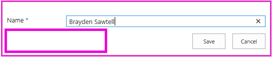
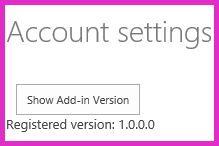

# Adicionar lógica de primeira execução para o suplemento
Saiba como incluir "da primeira execução" código em um provedor hospedado Suplemento do SharePoint.
Esse é o oitavo em uma série de artigos sobre noções básicas do desenvolvimento hospedado em provedor Suplementos do SharePoint. Você primeiro deve estar familiarizado com  [Suplementos do SharePoint](sharepoint-add-ins.md) e os artigos anteriores desta série:
  
    
    


-  [Introdução à criação de suplementos do SharePoint hospedados pelo provedor](get-started-creating-provider-hosted-sharepoint-add-ins.md)
    
  
-  [Dar seu suplemento a aparência do SharePoint](give-your-provider-hosted-add-in-the-sharepoint-look-and-feel.md)
    
  
-  [Incluir um botão personalizado do add-in](include-a-custom-button-in-the-provider-hosted-add-in.md)
    
  
-  [Obtenha uma visão geral do modelo de objeto do SharePoint](get-a-quick-overview-of-the-sharepoint-object-model.md)
    
  
-  [Adicionar operações de gravação do SharePoint para o suplemento](add-sharepoint-write-operations-to-the-provider-hosted-add-in.md)
    
  
-  [Include an add-in part in the provider-hosted add-in](include-an-add-in-part-in-the-provider-hosted-add-in.md)
    
  
-  [Lidar com eventos de suplemento do add-in](handle-add-in-events-in-the-provider-hosted-add-in.md)
    
  

> [!OBSERVAçãO]
> Se você tiver trabalhado através desta série sobre hospedado em provedor suplementos, então você possui uma solução de Visual Studio que você pode usar para continuar com este tópico. Você também pode baixar o repositório em  [SharePoint_Provider-hosted_Add-Ins_Tutorials](https://github.com/OfficeDev/SharePoint_Provider-hosted_Add-ins_Tutorials) e abra o arquivo BeforeFirstRunLogic.sln.
  
    
    

Neste artigo, você adicionar código para a página inicial do repositório de cadeia Suplemento do SharePoint que verifica se a instância atual do add-in está sendo executada pela primeira vez. Se ele for a primeira vez, seu código implantará a lista de **Funcionários Local** e no botão da faixa de opções personalizada.
## Criar a classe básica para implantar os componentes do SharePoint


  
    
    

> [!OBSERVAçãO]
> As configurações para projetos de inicialização no Visual Studio tendem a reverter para a configuração padrão sempre que a solução for reaberta. Sempre, siga estas etapas imediatamente após reabri-lo a solução de exemplo nesta série de artigos:> Com o botão direito no nó da solução na parte superior do **Gerenciador de soluções** e selecione **definir projetos de inicialização**.> Verifique se que todos os três projetos estão definidos para **Iniciar** na coluna **ação**.
  
    
    


1. No projeto **ChainStoreWeb** no **Solution Explorer**, clique com botão direito na pasta de **utilitários** e selecione **Adicionar | Item existente**.
    
  
2. No **Gerenciador de arquivos** que é aberta, navegue até a pasta de solução, na pasta **ChainStoreWeb** e então abra a pasta de **utilitários**.
    
  
3. Selecione SharePointComponentDeployer.cs e pressione **Add**.
    
  
4. Abra o arquivo SharePointComponentDeployer.cs. Ele tem uma classe estática e dois métodos estáticos que obtém e definem versão do add-in na tabela de **inquilinos** do banco de dados corporativo. Não abordaremos esses métodos porque esta série de artigos não se destina a ensinar programação ASP.NET ou SQL Server/Windows Azure.
    
  
5. Adicione as seguintes instruções **using** à parte superior do arquivo.
    
  ```
  
using System.Web;
using System.Linq;
using System.Collections.Generic;
using Microsoft.SharePoint.Client;
  ```

6. Na parte superior da classe  `SharePointComponentDeployer` , adicione os seguintes dois campos estáticos. Ambos esses serão inicializados no método **Page_Load** da página de início do suplemento. Você pode adicionar esse código em uma etapa posterior. O primeiro campo irá manter o objeto de **SharePointContext** que é necessário para tornar as operações CRUD no SharePoint. A segunda acomodará o número da versão do add-in instalado na web host. Esse valor estará inicialmente diferente do valor padrão ( **0000.0000.0000.0000** ) que é registrado na tabela de **inquilinos** corporativa quando o manipulador de instalação registra o inquilino. Por exemplo, a primeira versão do suplemento será **1.0.0.0**.
    
  ```cs
  
internal static SharePointContext sPContext;
internal static Version localVersion;
  ```

7. Crie a seguinte propriedade estática para reter a versão do suplemento que é registrada no momento na tabela de **inquilinos** corporativa. Ele usa os dois métodos que já foram no arquivo para obter e definir esse valor.
    
  ```cs
  
internal static Version RemoteTenantVersion
{
    get
    {
        return GetTenantVersion();
    }
    set
    {
        SetTenantVersion(value);
    }
}
  ```

8. Agora, crie a seguinte propriedade  `IsDeployed` . Observe o seguinte sobre este código:
    
  - O método **Page_Load** da página de início do suplemento usará o valor dessa propriedade para determinar se ou não o add-in está sendo executado pela primeira vez. Um valor **false** sinaliza que o suplemento não foi executado antes na web host atual, portanto seus componentes precisam ser implantados.
    
  
  - O critério é ou não o número da versão registrado na tabela de **inquilinos** é menor que a versão instalada realmente. Na primeira vez em que o suplemento é executado, ele será menor. Código que você pode escrever em uma etapa posterior define a versão na tabela de **inquilinos** com a mesma versão conforme é instalado na verdade, portanto, quando o suplemento é executado novamente, `IsDeployed` retornará **true** e a lógica de implantação não serão executado novamente.
    
  

  ```cs
  
public static bool IsDeployed
{
    get
    {
        if (RemoteTenantVersion < localVersion)
            return false; 
        else
            return true; 
    }
}
  ```

9. Adicione o seguinte método à classe  `SharePointComponentDeployer` . Observe que a última coisa que o método não é atualizar a versão de locatário registrados no banco de dados corporativo ( **0000.0000.0000.0000** ) correspondente à versão real do add-in na web host ( **1.0.0.0** ). Você concluirá esse método em uma etapa posterior.
    
  ```cs
  
internal static void DeployChainStoreComponentsToHostWeb(HttpRequest request)
{
    // TODO4: Deployment code goes here.

    RemoteTenantVersion = localVersion;
}
  ```


> [!OBSERVAçãO]
> Você pode imaginar agora por que o suplemento usa números de versão e um teste "menor que" para determinar a resposta para uma simples Sim/não pergunta: é o suplemento executando pela primeira vez? Tão bem poderíamos ter um campo de cadeia de caracteres simples na tabela de **inquilinos** que é definido como "ainda não executado" no manipulador de instalação e, em seguida, alterado para "já executada uma vez" pela lógica de primeira execução após os componentes do SharePoint são implantados.> Para o suplemento do repositório de cadeia, funcionaria um teste simples. No entanto, geralmente é uma boa prática usar números de versão. Isso ocorre porque um suplemento de produção é provável de ser atualizados in-loco no futuro; ou seja, atualizado depois que ele já está instalado. Quando essa hora chegar, sua lógica de suplemento precisará estar atento aos mais tempo do que as duas possibilidades de não-ainda-run ejá-execução única. Por exemplo, suponha que você deseja adicionar uma lista adicional na Web de host na atualização da versão 1.0.0.0 para 2.0.0.0. Você pode fazer isso em um manipulador de eventos de atualização ou em "da primeira execução após atualização" lógica. De qualquer forma, sua lógica de implantação será necessário implantar novos componentes, mas ele também precisará evitar tentando reimplantar componentes que foram implantados em uma versão anterior do add-in. Número de versão de 1.0.0.0 seria sinal que os componentes da versão 1.0.0.0 foram implantados, mas que a lógica de primeira execução após atualizar ainda não foi executada.
  
    
    


## Adicione a lógica de inicialização básica


  
    
    

1. A web de host do SharePoint precisa saber o aplicativo web remoto qual versão do suplemento que ele tenha instalado. Usaremos um parâmetro de consulta para fazer isso. Abra o arquivo de AppManifest.xml no projeto **ChainStore**. No designer, você verá um espaço reservado **{StandardTokens}** como o valor da caixa de **cadeia de caracteres de consulta**. Adicionar a cadeia de caracteres "&amp; SPAddInVersion = 1.0.0.0" até o final. Designer de manifesto deve ser semelhante ao seguinte.  *Aviso de que o número de versão você passar na seqüência de consulta tem que corresponder ao valor na caixa **versão** do designer.*  (Se você precisar atualizar o suplemento, uma de suas tarefas é disparar esses dois valores e mantê-los a mesma.)
    
     
  

  

  
2. Abra o arquivo CorporateDataViewer.aspx.cs e adicione o código a seguir ao método **Page_Load**, logo abaixo da linha que inicializa o objeto `spContext` . Observe o seguinte sobre este código:
    
  - Ele começa definindo os dois campos estáticos na classe estática  `SharePointComponentDeployer` . Ele passa o objeto **SharePointContext** porque o código no `SharePointComponentDeployer` será chamado para o SharePoint e, em seguida, usa o parâmetro de consulta que você adicionou para definir a propriedade `localVersion` .
    
  
  - Não faz nada se  `IsDeployed` for true; ou seja, se a lógica de "da primeira execução" já foi executado. Caso contrário, ele chama o método de implantação e o passa o objeto de solicitação do ASP.NET.
    
  

  ```cs
  
SharePointComponentDeployer.sPContext = spContext;
SharePointComponentDeployer.localVersion = new Version(Request.QueryString["SPAddInVersion"]);

if (!SharePointComponentDeployer.IsDeployed)
{
    SharePointComponentDeployer.DeployChainStoreComponentsToHostWeb(Request);
}
  ```


## Implantar programaticamente uma lista do SharePoint


  
    
    

1. No arquivo SharePointComponentDeployer.cs, substitua o  `TODO4` a linha a seguir. Você pode criar esse método na próxima etapa.
    
  ```cs
  
CreateLocalEmployeesList();
  ```

2. Adicione o seguinte método à classe  `SharePointComponentDeployer` . Observe o seguinte sobre este código:
    
  - Ele tem duas chamadas de **ExecuteQuery**. O primeiro é necessário para determinar se a lista já existe. A segunda faz o trabalho de criação da lista.
    
  
  - O método **ClientContext.LoadQuery** é semelhante do **ClientContext.Load**, exceto que, em vez de trazendo uma entidade, como uma lista, para baixo até o cliente, ele derruba enumeráveis resultados de uma consulta.
    
  

  ```cs
  private static void CreateLocalEmployeesList()
{
    using (var clientContext = sPContext.CreateUserClientContextForSPHost())
    {
        var query = from list in clientContext.Web.Lists
                    where list.Title == "Local Employees"
                    select list;
        IEnumerable<List> matchingLists = clientContext.LoadQuery(query);
        clientContext.ExecuteQuery();

        if (matchingLists.Count() == 0)
        {
           // TODO5: Create the list 

           // TODO6: Rename the Title field on the list 

           // TODO7: Add "Added to Corporate DB" field to the list 

           clientContext.ExecuteQuery();
        }
    }
}
  ```

3. Substitua  `TODO5` o código a seguir. Observe o seguinte sobre este código:
    
  - A classe **ListCreationInformation** é semelhante à classe **ListItemCreationInformation** que vimos em um artigo anterior desta série. É uma classe leve mais adequada para enviar informações do aplicativo web no SharePoint que a classe completa **List**.
    
  
  - Há muitos tipos de modelos de lista, como o tipo de tarefas para um "para" lista e o tipo de eventos de um calendário. A lista de **Funcionários Local** se baseia em mais simples: o tipo genérico.
    
  
  - A propriedade **ListCreationInformation.Url** contém a URL da lista *relativa*  na Web do host. Especificando "Listas/LocalEmployees", o código está definindo a URL completa da lista até https:// /hongkong/_layouts/15/start.aspx#/Lists/Local%20Employees *{SharePointDomain}*  .
    
  

  ```cs
  
ListCreationInformation listInfo = new ListCreationInformation();
listInfo.Title = "Local Employees";
listInfo.TemplateType = (int)ListTemplateType.GenericList;
listInfo.Url = "Lists/Local Employees";
List localEmployeesList = clientContext.Web.Lists.Add(listInfo);
  ```

4. Substitua  `TODO6` o seguinte código que altera o nome público do campo "Title" (coluna) da "Title" para "Nome". Esse é o que você fez na página **Definições de lista** quando você criou a lista manualmente.
    
  ```cs
  
Field field = localEmployeesList.Fields.GetByInternalNameOrTitle("Title");
field.Title = "Name";
field.Update();
  ```

5. Você também manualmente criado um campo denominado **foram adicionados ao banco de dados corporativos**. Fazer que programaticamente adicionar o código a seguir no lugar de  `TODO7`. Observe o seguinte sobre este código:
    
  - As propriedades do campo da chave são especificadas com um blob XML. Este é um legado da arquitetura do SharePoint: sites, listas, tipos de conteúdo, campos e a maioria dos outros tipos de componentes do SharePoint são definidos como XML. Nesse caso, podemos está especificando o nome para exibição, tipo de dados e o valor padrão do campo.
    
  
  - O segundo parâmetro determina se o campo está visível no modo de exibição padrão da lista. Estamos definindo-lo para **true**.
    
  
  - O terceiro parâmetro pode ser usado para determinar quais tipos de conteúdo que o campo é adicionado à. Passar **DefaultValue** significa que ela somente seja adicionada ao tipo de conteúdo da lista padrão.
    
  

  ```cs
  
localEmployeesList.Fields.AddFieldAsXml("<Field DisplayName='Added to Corporate DB'"
                                         +"Type='Boolean'>"
                                         + "<Default>FALSE</Default></Field>",
                                         true,
                                         AddFieldOptions.DefaultValue);
  ```

6. Lembre-se de que o **foram adicionados ao banco de dados corporativos** é **não** (ou seja, FALSO) por padrão, mas o botão da faixa de opções personalizada do add-in definirá como **Sim** após ele adiciona o funcionário no banco de dados corporativos. Este sistema só funciona melhor se os usuários não podem alterar manualmente o valor do campo. Para garantir que eles não, verifique o campo invisível nos formulários para criar e editar itens na lista de **Locais de funcionários**. Fazemos isso adicionando dois atributos mais para o primeiro parâmetro, conforme mostrado a seguir.
    
  ```cs
  
localEmployeesList.Fields.AddFieldAsXml("<Field DisplayName='Added to Corporate DB'"
                                         + " Type='Boolean'"  
                                         + " ShowInEditForm='FALSE' "
                                         + " ShowInNewForm='FALSE'>"
                                         + "<Default>FALSE</Default></Field>",
                                         true,
                                         AddFieldOptions.DefaultValue);
  ```


    O inteiro  `CreateLocalEmployeesList` agora deve se parecer com o seguinte.
    


  ```cs
  
private static void CreateLocalEmployeesList()
{
    using (var clientContext = sPContext.CreateUserClientContextForSPHost())
    {
        var query = from list in clientContext.Web.Lists
                    where list.Title == "Local Employees"
                    select list;
        IEnumerable<List> matchingLists = clientContext.LoadQuery(query);
        clientContext.ExecuteQuery();

        if (matchingLists.Count() == 0)
        {
            ListCreationInformation listInfo = new ListCreationInformation();
            listInfo.Title = "Local Employees";
            listInfo.TemplateType = (int)ListTemplateType.GenericList;
            listInfo.Url = "LocalEmployees";
            List localEmployeesList = clientContext.Web.Lists.Add(listInfo);

            Field field = localEmployeesList.Fields.GetByInternalNameOrTitle("Title");
            field.Title = "Name";
            field.Update();

            localEmployeesList.Fields.AddFieldAsXml("<Field DisplayName='Added to Corporate DB'" 
                                                    + " Type='Boolean'"  
                                                   + " ShowInEditForm='FALSE' "
                                                   + " ShowInNewForm='FALSE'>"
                                                   + "<Default>FALSE</Default></Field>",
                                                    true,
                                                    AddFieldOptions.DefaultValue);
            clientContext.ExecuteQuery();
        }
    }
}
  ```


## Remover temporariamente o botão personalizado do projeto

Por razões técnicas que abordaremos no próximo artigo, não pode ser instalado no botão personalizado que criamos sem modificação quando ele está sendo coloca na faixa de opções de uma lista que é implantada por meio de programação. Podemos vai removê-lo temporariamente do projeto, para que podemos testar a lógica de primeira execução. Podemos irá colocá-lo novamente no próximo artigo.
  
    
    
No **Solution Explorer**, no projeto **ChainStore**, com o botão direito no nó **AddEmployeeToCorpDB** e selecione **Excluir do projeto**.
  
    
    

## Solicitação de permissão para gerenciar listas na web host

Uma vez que o suplemento é agora a adição de uma lista na Web de host, e não apenas itens a uma lista existente, precisamos escalonar as permissões que o suplemento solicitações de gravação para gerenciar. Siga estas etapas.
  
    
    

1. No **Solution Explorer**, abra o arquivo de AppManifest.xml no projeto **ChainStore**.
    
  
2. Abra a guia **permissões** e deixe o valor de **escopo** no Web, mas no campo de **permissão**, selecione **Gerenciar** a projetada para baixo.
    
  
3. Salve o arquivo.
    
  

## Execute o add-in e testar a lógica de "da primeira execução"


  
    
    

1. Abra a página de **Conteúdo do Site** do site do repositório de Hong Kong *e remover a lista de **Funcionários Local** !* 
    
  
2. Use a tecla F5 para implantar e executar seu suplemento Visual Studio hospeda o aplicativo da web remoto no IIS Express e hospeda o banco de dados SQL em um SQL Express. Ele também faz uma instalação temporária do add-in no seu site do SharePoint de teste e executa imediatamente o add-in. Você será solicitado para conceder permissões para o suplemento antes de sua página de início é aberta.
    
  
3. Quando página de iniciar do add-in é aberto, selecione o link de **volta para o Site** no controle de cromo na parte superior.
    
  
4. Navegue até a página de **Conteúdo do Site**. A lista de **Funcionários Local** está presente, porque a lógica de primeira execução adicionou.
    
    > [!OBSERVAçãO]
      > Se a lista não estiver lá ou se tiver outras indicações que o código de primeira execução não está em execução, pode ser que a tabela de **inquilinos** não está sendo revertida para um estado vazio quando você pressiona F5. A causa mais comum disso é que o projeto **ChainCorporateDB** não mais é definido como um projeto de inicialização no Visual Studio. Consulte a observação na parte superior deste artigo sobre como corrigir esse problema. Além disso, certifique-se de que você configurou o banco de dados seja recompilado conforme descrito em [Configurar Visual Studio para reconstruir o banco de dados corporativo com cada sessão de depuração](give-your-provider-hosted-add-in-the-sharepoint-look-and-feel.md#Rebuild).
5. Abra a lista e adicionar um item. Observe que no formulário novo item, o campo **foi adicionado ao banco de dados corporativos** não está mais presente, portanto não pode ser definido manualmente. Isso acontece do formulário de item de edição.
    
     
  

  

  
6. Use o botão Voltar do navegador volte à página de início do suplemento.
    
  
7. Pressione o ícone de engrenagem no controle de cromo na parte superior e selecione **configurações de conta**.
    
  
8. Na página **contas**, pressione o botão de **versão Mostrar Add-in**. A versão mostra como **1.0.0.0** porque a lógica de primeira execução-la alterado.
    
     
  

  

  
9. Para encerrar a sessão de depuração, feche a janela do navegador ou interrompa a depuração no Visual Studio. Sempre que você pressiona F5, o Visual Studio retira a versão anterior do suplemento e instala a última mais recente.
    
  
10. Você vai trabalhar com esse suplemento e com a solução do Visual Studio em outros artigos. Além disso, é uma prática recomendada retirar o suplemento uma última vez, quando deixar de trabalhar com ele por algum tempo. Clique com botão direito do mouse no projeto no **Gerenciador de Soluções** e escolha **Retirar**.
    
  

## 
<a name="Nextsteps"> </a>

O próximo artigo, você verá como obter o botão personalizado para a faixa de opções do **Funcionário Local** volta para o add-in agora a lista está sendo implantada por meio de programação: [Implantar programaticamente um botão personalizado do add-in](programmatically-deploy-a-custom-button-in-the-provider-hosted-add-in.md)
  
    
    

