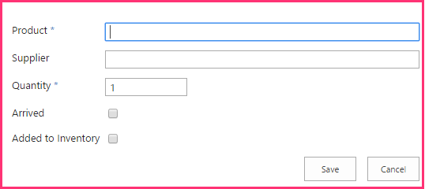
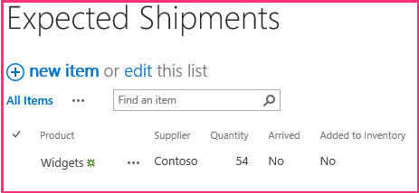

# Adicionar operações de gravação do SharePoint para o suplemento
Saiba como gravar dados para o SharePoint em um provedor hospedado Suplemento do SharePoint.
Esta é a uma série de artigos sobre noções básicas do desenvolvimento hospedado em provedor Suplementos do SharePoint fifthin. Você primeiro deve estar familiarizado com  [Suplementos do SharePoint](sharepoint-add-ins.md) e os artigos anteriores desta série:
  
    
    


-  [Introdução à criação de suplementos do SharePoint hospedados pelo provedor](get-started-creating-provider-hosted-sharepoint-add-ins.md)
    
  
-  [Dar seu suplemento a aparência do SharePoint](give-your-provider-hosted-add-in-the-sharepoint-look-and-feel.md)
    
  
-  [Incluir um botão personalizado do add-in](include-a-custom-button-in-the-provider-hosted-add-in.md)
    
  
-  [Obtenha uma visão geral do modelo de objeto do SharePoint](get-a-quick-overview-of-the-sharepoint-object-model.md)
    
  

> **OBSERVAçãO**
> Se você tiver trabalhado através desta série sobre hospedado em provedor suplementos, então você possui uma solução de Visual Studio que você pode usar para continuar com este tópico. Você também pode baixar o repositório em  [SharePoint_Provider-hosted_Add-Ins_Tutorials](https://github.com/OfficeDev/SharePoint_Provider-hosted_Add-ins_Tutorials) e abra o arquivo BeforeSharePointWriteOps.sln.
  
    
    

Neste artigo vamos voltar a codificação adicionando algumas funções que gravam dados para o repositório de cadeia Suplemento do SharePoint.
## Alterar um valor de coluna em um item de lista do SharePoint

Nosso suplemento tem um botão da faixa de opções personalizada que adiciona um funcionário da lista de **Funcionários Local** do repositório de Hong Kong no banco de dados corporativos. Mas o usuário tem que se lembrar de alterar manualmente o valor do campo **foram adicionados ao banco de dados corporativos** comoSim. Vamos adicionar código para fazer isso automaticamente.
  
    
    

> **OBSERVAçãO**
> As configurações para projetos de inicialização no Visual Studio tendem a reverter para a configuração padrão sempre que a solução for reaberta. Sempre, siga estas etapas imediatamente após reabri-lo a solução de exemplo nesta série de artigos:> Com o botão direito no nó da solução na parte superior do **Gerenciador de soluções** e selecione **definir projetos de inicialização**.> Verifique se que todos os três projetos estão definidos para **Iniciar** na coluna **ação**.
  
    
    


1. No **Solution Explorer**, abra o arquivo de EmployeeAdder.cs.
    
  
2. Adicione a seguinte linha para o **Page_Load** métodoentre a chamada de `AddLocalEmployeeToCorpDB` e a chamada de **Response.Redirect**. Você criará o método  `SetLocalEmployeeSyncStatus` na próxima etapa.
    
  ```cs
  
// Write to SharePoint
SetLocalEmployeeSyncStatus();
  ```

3. Adicione o seguinte método de novo para a classe  `EmployeeAdder` . Observe o seguinte sobre este código:
    
  - O nome interno para o campo **foi adicionado ao banco de dados corporativos** é estranha. Nomes de campo interno não podem conter espaços, portanto, quando um usuário cria um campo com espaços em seu nome de exibição, SharePoint substitui a cadeia de caracteres "_x0020_" para cada espaço quando ele define o nome interno. Isso transforma "Adicionados para funcionários DB" em "Added_x0020_to_x0020_Corporate_x0020_DB". Nomes internos não podem ser mais de 32 caracteres, portanto, o nome será truncado para apenas "Added_x0020_to_x0020_Corporate_x".
    
  
  - Embora a coluna **adicionada para DB corporativo** é chamada de um campo de "Sim/não" da UI do SharePoint, é realmente um valor booleano, portanto, seu valor é definido como **true**, não "Yes".
    
  
  - O método **Update** da classe **ListItem** deve ser chamado para confirmar as alterações para o banco de dados de conteúdo do SharePoint. É uma regra geral, mas não é bastante universal, que, quando você altera um valor de propriedade de um objeto que é armazenado em bancos de dados do SharePoint, você deve chamar o método do objeto **Update**.
    
  

  ```cs
  
private void SetLocalEmployeeSyncStatus()
{
    using (var clientContext = spContext.CreateUserClientContextForSPHost())
    {
        List localEmployeesList = clientContext.Web.Lists.GetByTitle("Local Employees");
        ListItem selectedLocalEmployee = localEmployeesList.GetItemById(listItemID);
        selectedLocalEmployee["Added_x0020_to_x0020_Corporate_x"] = true;
        selectedLocalEmployee.Update();
        clientContext.ExecuteQuery();
    }
}
  ```


## Solicitação de permissão para gravar a lista de web de host

Como o suplemento é agora gravando à lista, bem como lê-lo, precisamos escalonar as permissões que o suplemento solicitações de leitura para gravação. Siga estas etapas.
  
    
    

1. No **Solution Explorer**, abra o arquivo de AppManifest.xml no projeto **ChainStore**.
    
  
2. Abra a guia **permissões** e no campo de **permissão**, selecione **gravar** a projetada para baixo.
    
  
3. Salve o arquivo.
    
  

## Execute o add-in e testar o botão


  
    
    

1. Use a tecla F5 para implantar e executar seu suplemento Visual Studio hospeda o aplicativo da web remoto no IIS Express e hospeda o banco de dados SQL em um SQL Express. Ele também faz uma instalação temporária do add-in no seu site do SharePoint de teste e executa imediatamente o add-in. Você será solicitado para conceder permissões para o suplemento antes que ela seja iniciar página é aberta.
    
  
2. No formulário permissão, escolha o **Local de funcionários** da lista e clique em **confiar nele**.
    
  
3. Quando a página de início do add-in for aberta, clique em **volta para o Site** no controle de cromo na parte superior.
    
  
4. Na página inicial do site navegue para **conteúdos do Site | Funcionários locais**. Abre a página de modo de exibição de lista.
    
  
5. Se não houver nenhum funcionário na lista com **não** na coluna **adicionada para DB corporativo**, adicionar um funcionário à lista, e  *não marque a caixa de seleção **foram adicionados ao banco de dados corporativo**.* 
    
  
6. Na faixa de opções, abra a guia de **itens**. Na seção **ações** da guia, é o botão personalizado **Adicionar ao banco de dados corporativos**.
    
  
7. Selecione um funcionário na lista que **não** tenha na coluna **foram adicionados ao banco de dados corporativos**.
    
  
8. Pressione o botão **Adicionar para o banco de dados corporativos**.  * **Um item deve ser selecionado primeiro!*** 
    
  
9. A página parecerá recarregar porque o método **Page_Load** da página EmployeeAdder os redirecionamentos de volta para ela. O valor do campo **foram adicionados ao banco de dados corporativos** do funcionário mudou como **Sim**.
    
    > **OBSERVAçãO**
      > O que impede que um usuário manualmente alterando o valor **foram adicionados ao banco de dados corporativo** na forma que possibilite a lista e o banco de dados corporativo inconsistente? Nothing não no momento. Você obterá a solução para esse problema em um artigo posterior desta série.
10. Para encerrar a sessão de depuração, feche a janela do navegador ou interrompa a depuração no Visual Studio. Sempre que você pressiona F5, o Visual Studio retira a versão anterior do suplemento e instala a última mais recente.
    
  
11. Com o botão direito do projeto no **Solution Explorer** e escolha **Retract**.
    
  

## Criar uma nova lista personalizada no site do host

O próximo aperfeiçoamento para o suplemento do repositório de cadeia é criar novos itens em uma lista, em vez de simplesmente alterando um campo em um item existente. Especificamente, quando um novo pedido é colocado no nível corporativo, um item é criado automaticamente em uma lista do SharePoint que funcionários locais para esperam uma remessa de alertas. A lista é chamada **Remessas esperado** e criá-lo com as etapas a seguir. Em um artigo posterior nesta série, você aprenderá como adicionar de maneira programática uma lista personalizada para um site de host, mas agora, você adicionará este manualmente.
  
    
    

1. Na home page do repositório Fabrikam Hong Kong, navegue até **conteúdos do Site | adicionar um suplemento | Lista personalizada**.
    
  
2. Na caixa de diálogo **Adicionar lista personalizada**, especifique As remessas esperado como o nome e pressione **criar**.
    
  
3. Na página **Conteúdo do Site**, abra a lista de **Remessas esperado**.
    
  
4. Abra a guia **lista** na faixa de opções e, em seguida, clique no botão **Configurações de lista**.
    
  
5. Na seção **colunas** da página **Configurações de lista**, clique na coluna de **título**.
    
  
6. No formulário **Editar coluna**, altere o **nome da coluna** de título para oproduto; e, em seguida, clique em **OK**.
    
  
7. Na página **configurações**, clique em **criar coluna**.
    
  
8. Um artigo anterior desta série, você aprendeu como criar colunas personalizadas para obter uma lista. Para a lista de **Remessas esperado**, adicione quatro colunas, usando os valores na tabela a seguir. Deixe todas as outras configurações com seus valores padrão.
    

|**Nome da coluna**|**Tipo**|**Obrigatório?**|**Valor padrão**|
|:-----|:-----|:-----|:-----|
|Fornecedor <br/> |**Texto com uma linha** <br/> |Não requerido <br/> |nenhum <br/> |
|Quantidade <br/> |**Número** <br/> |Necessário <br/> |1 <br/> |
|Chegou <br/> |**Sim/Não** <br/> |Não requerido <br/> |Não <br/> |
|Adicionado ao estoque <br/> |**Sim/Não** <br/> |Não requerido <br/> |Não <br/> |
   
9. Após ter criado as colunas, na página de configurações de lista, clique em **Conteúdo do Site** para abrir a página de **Conteúdo do Site**. Abra a lista de **Remessas esperado**.
    
  
10. Clique em **novo item**. O formulário de criação de item deve ser exatamente semelhantes a estas, incluindo os dois asteriscos que indicam campos obrigatórios.:
    
     
  

  

  
11. Não queremos criar manualmente os itens dessa lista, clique em **Cancelar**.
    
  

## Inserir um item em uma lista do SharePoint

Agora você deve adicionar uma função para o suplemento que cria um item na lista **Remessas esperado**, sempre que um pedido para o repositório de Hong Kong é colocado no nível corporativo.
  
    
    

1. No **Solution Explorer**, abra o arquivo de OrderForm.aspx.cs.
    
  
2. Adicione uma instrução de **using** para **Microsoft.SharePoint.Client** à parte superior do arquivo.
    
  
3. No método  `btnCreateOrder_Click` , adicione a seguinte linha logo abaixo da chamada para `CreateOrder`. Você criará o método CreateExpectedShipment na próxima etapa.
    
  ```cs
  
CreateExpectedShipment(txtBoxSupplier.Text, txtBoxItemName.Text, quantity);
  ```

4. Adicione o seguinte método à classe  `OrderForm` . Observe o seguinte sobre este código:
    
  - Um objeto **ListItem** não é criado com um construtor. Isso é por motivos de desempenho. Um objeto **ListItem** tem várias propriedades (com valores padrão). Se um construtor for usado, o objeto inteiro seria incluído na mensagem XML que o método **ExecuteQuery** envia ao servidor. O objeto **ListItemCreationInformation** é um objeto leve que contém apenas os valores mínimos de não-padrão que o servidor precisa para criar um objeto **ListItem**. Pode parecer que não há uma linha que cria um objeto **ListItem**, mas recall esta linha apenas adiciona algumas marcação XML a uma mensagem que será enviada para o servidor. O objeto **ListItem** é criado ainda nesse local no servidor.
    
  
  - Não há nenhuma necessidade para trazer o objeto **ListItem** novamente para baixo até o cliente, portanto, não há nenhuma chamada ao método **ClientContext.Load**.
    
  
  - O código não precisa definir explicitamente o **recebido** ou **adicionada para inventário** fields porque eles têm valores padrão de "Não", que é o que queremos.
    
  

  ```
  private void CreateExpectedShipment(string supplier, string product, UInt16 quantity)
{
    using (var clientContext = spContext.CreateUserClientContextForSPHost())
    {
        List expectedShipmentsList = clientContext.Web.Lists.GetByTitle("Expected Shipments");
        ListItemCreationInformation itemCreateInfo = new ListItemCreationInformation();
        ListItem newItem = expectedShipmentsList.AddItem(itemCreateInfo);
        newItem["Title"] = product;
        newItem["Supplier"] = supplier;
        newItem["Quantity"] = quantity;
        newItem.Update();
        clientContext.ExecuteQuery();
    }
}
  ```


## Verificação de componentes excluídos

Qualquer pessoa com privilégios de proprietário de lista para uma lista do SharePoint pode excluir a lista. E se a lista estiver implantada na Web host por um suplemento, o proprietário do site da web host possível excluí-lo. Que pode acontecer se o proprietário decide fazer sem a funcionalidade fornecida pela lista. (Ele pode ser restaurado a partir da Lixeira do SharePoint se o proprietário altera sua mente.)
  
    
    
O método  `CreateExpectedShipment` depende da existência da lista **Remessas esperado**. Suponha que um proprietário de site decidiu excluir a lista. Posteriormente, quando um pedido é adicionado com **Formulário de pedido do suplemento**, o  `CreateExpectedShipment` é chamado e gerará uma exceção cuja mensagem diz que não há nenhuma lista de **Remessas esperado** no site do SharePoint.
  
    
    
Talvez você queira que o método para verificar a  `expectedShipmentsList` para nullity antes de fazer qualquer coisa com ele. Quando você estiver trabalhando com CSOM, você pode *não*  fazer essa verificação com uma estrutura simple semelhante a esta:
  
    
    
 `if (expectedShipmentsList != null) { ... }`
  
    
    
Em vez disso, você precisará usar uma classe CSOM especial chamada **ConditionalScope**. Os motivos para isso conectados ao sistema de lotes do CSOM, que foi mencionado no artigo anterior desta série. (Consulte o  [Tempo de execução do cliente e o processamento em lotes](get-a-quick-overview-of-the-sharepoint-object-model.md#CSOMBatching)). **ConditionalScope** e o sistema de lote avançam tópicos que estão fora do escopo desta série Introdução Introdução, mas você deve ver a documentação do MSDN deles após concluir esta série de tutoriais.
  
    
    
Há uma maneira alternativa para verificar a existência de uma lista: em vez de usar o método **GetByTitle** para obter uma referência para a lista, você pode verificar se uma lista com o nome especificado está em "lista das listas" do site com o código semelhante ao seguinte.
  
    
    


```cs

var query = from list in clientContext.Web.Lists
             where list.Title == "Expected Shipments" 
             select list; 
IEnumerable<List> matchingLists = clientContext.LoadQuery(query); 
clientContext.ExecuteQuery(); 
if (matchingLists.Count() != 0) 
{ 
    List expectedShipmentsList = matchingLists.Single(); 
    // Do something with the list. 
}
clientContext.ExecuteQuery(); 
```

O código anterior tem a vantagem de permitir a evitar as complicações da classe **ConditionalScope** e usamos exatamente este código em outros lugares desta série de artigos. Mas há uma desvantagem muito: este código requer uma chamada extra de **ExecuteQuery** exclusivamente para obter o valor que você deseja fazer check-in a instrução **if**. Se usamos essa técnica no `CreateExpectedShipment` para verificar a existência da lista, em seguida, que o método terá duas chamadas de **ExecuteQuery** cada um deles faz uma solicitação HTTP do servidor web remoto no SharePoint. Essas solicitações são a parte mais demorada de qualquer método CSOM, portanto, geralmente é uma boa prática minimizá-los.
  
    
    
Podemos sairá do  `CreateExpectedShipment` conforme é, mas em um suplemento produção, você precisa pensar como seu código vai funcionar se um componente que faz referência a ele for excluído. Restaurar programaticamente a lista da Lixeira é uma opção, mas que seria incomodar os usuários que intencionalmente decidiram excluir a lista. Você também deve considerar o que fazer nada para evitar a exceção pode ser a melhor opção. Uma exceção do SharePoint seria alertar os usuários que a exclusão da lista violou parte do add-in, que é algo que a pessoa que tenha excluído não ter percebido. Um usuário pode decidir se restaurar a lista da Lixeira ou sem a parte da funcionalidade de suplemento que não funciona mais.
  
    
    

## Solicitação de permissão para gerenciar o site

Lembre-se de que quando um suplemento de solicitações de leitura ou gravação permissão com o escopo da lista, SharePoint solicita ao usuário para confiar o add-in e a caixa de diálogo contém uma lista suspensa lista onde o usuário seleciona a lista à qual o suplemento deve ter acesso. Apenas uma lista pode ser selecionada. Mas o suplemento do repositório de cadeia agora grava duas listas diferentes. Para obter acesso a várias listas, o suplemento deve solicitar permissão com o escopo da Web. Siga estas etapas:
  
    
    

1. No **Solution Explorer**, abra o arquivo de AppManifest.xml no projeto **ChainStore**.
    
  
2. Abra a guia **permissões** e no campo de **escopo**, selecione **Web** na lista para baixo.
    
  
3. No campo de **permissão**, selecione **gravar** a projetada para baixo.
    
  
4. Salve o arquivo.
    
  

## Execute o add-in e a criação de item de teste


  
    
    

1. Use a tecla F5 para implantar e executar seu suplemento Visual Studio hospeda o aplicativo da web remoto no IIS Express e hospeda o banco de dados SQL em um SQL Express. Ele também faz uma instalação temporária do add-in no seu site do SharePoint de teste e executa imediatamente o add-in. Você será solicitado para conceder permissões para o suplemento antes que ela seja iniciar página é aberta.
    
  
2. Quando a página de início do add-in for aberta, clique no link de **Formulário de pedido** na parte inferior da página.
    
  
3. Insira alguns valores no formulário e pressione **Fazer pedido**.
    
  
4. Use o botão Voltar do navegador volte à página inicial e clique em **volta para o Site** no controle de cromo na parte superior.
    
  
5. Na home page de Kong o Hong armazenar, navegue até o **Conteúdo do Site** e abrir a lista de **Remessas esperado**. Há agora um item na lista correspondente a ordem. A captura de tela a seguir está um exemplo.
    
     
  

  

  
6. Para encerrar a sessão de depuração, feche a janela do navegador ou interrompa a depuração no Visual Studio. Sempre que você pressiona F5, o Visual Studio retira a versão anterior do suplemento e instala a última mais recente.
    
  
7. Com o botão direito do projeto no **Solution Explorer** e escolha **Retract**.
    
  

## 
<a name="Nextsteps"> </a>

O próximo artigo, você saberá como desvendar o formulário de pedido remoto como uma Web Part em uma página do SharePoint:  [Include an add-in part in the provider-hosted add-in](include-an-add-in-part-in-the-provider-hosted-add-in.md)
  
    
    

