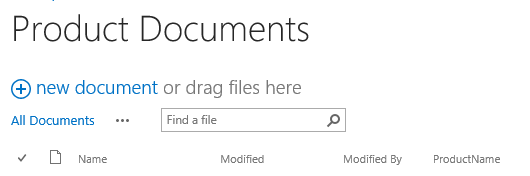
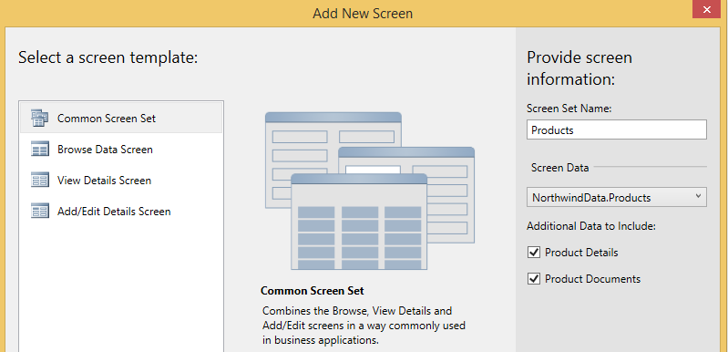
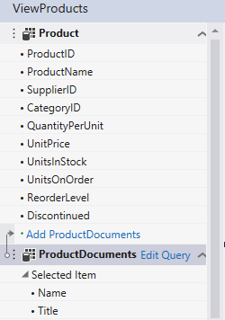

# Associar uma biblioteca de documentos uma entidade
Usando o recurso de biblioteca de documentos no SharePoint, você pode criar ou carregar documentos associados aos itens individuais em uma lista ou uma entidade. Por exemplo, você pode usar uma biblioteca de documentos para armazenar as especificações e manuais do produto para cada produto em uma lista. Em um Add-in de negócios de nuvem, você pode associar uma biblioteca de documentos com uma entidade Criando uma relação.
## A associação de uma biblioteca de documentos

O processo de associar uma biblioteca de documentos uma entidade envolve três etapas:
  
    
    

1. Adicione uma biblioteca de documentos do SharePoint ao seu projeto como uma fonte de dados.
    
    > [!IMPORTANTE]
      > Primeiro, você deve criar uma biblioteca de documentos no site do SharePoint. Ele deve conter uma coluna personalizada que mapeie para um campo exclusivo em sua entidade.
2. Crie um relacionamento entre a biblioteca de documentos e uma entidade.
    
  
3. Adicione a biblioteca de documentos a uma tela. O processo será diferente, dependendo se você estiver criando uma nova tela ou adicioná-lo a uma tela existente.
    
  

### Para adicionar uma biblioteca de documentos

1. No **Solution Explorer**, abra o menu de atalho para o nó de **Fontes de dados** e escolha **Adicionar fonte de dados**.
    
  
2. No **Assistente para anexar de fonte de dados**, escolha o ícone do **SharePoint** e, em seguida, escolha o botão **Avançar**.
    
  
3. Na página **Inserir informações da conexão**, na caixa de texto de **especificar o endereço do site do SharePoint**, insira a URL do site de desenvolvedor do SharePoint e, em seguida, escolha o botão **Avançar**.
    
  
4. Na página **Escolher seus itens do SharePoint**, no painel esquerdo, escolha o item de lista de **Bibliotecas de documentos** e no painel direito, marque a caixa de seleção para sua biblioteca de documentos, conforme mostrado na Figura 1.
    
   **Figura 1. Selecionar a biblioteca de documentos**

  

     
  

    A Figura 2 mostra a biblioteca de documentos no site do SharePoint.
    

   **Figura 2. Observe a coluna ProductName personalizada**

  

     
  

    
    > [!IMPORTANTE]
      > A biblioteca de documentos já deve existir e deve conter uma coluna personalizada que mapeie para um campo exclusivo em sua entidade.
5. Em **especificar o nome da fonte de dados**, insira um nome e escolha o botão **Concluir**.
    
  

### Para criar um relacionamento

1. No **Solution Explorer**, abra a entidade de biblioteca de documentos e, em seguida, na barra de ferramentas **perspectiva**, escolha a guia **servidor**.
    
  
2. Na barra de ferramentas, escolha **relacionamento**.
    
  
3. Na caixa de diálogo **Adicionar novo relacionamento**, na lista suspensa **para**, escolha a entidade que você deseja associar, conforme mostrado na Figura 3.
    
   **Figura 3. Criar um relacionamento.**

  

     
  

  

  
4. Na lista suspensa chave **externo**, escolha a coluna personalizada em sua biblioteca de documentos.
    
  
5. Na lista suspensa de chave **primária**, escolha o campo de sua entidade que mapeie para a coluna personalizada na biblioteca de documentos e escolha o botão **OK**. Por exemplo, para uma coluna de ProductName personalizada, escolha o campo ProductName, conforme mostrado na Figura 4.
    
   **Figura 4. Chaves externas e primárias relacionadas**

  

     
  

    
    > [!OBSERVAçãO]
      > O campo deve ser do mesmo tipo de dados do campo de chave **externo**.

### Para adicionar uma biblioteca de documentos a um novo conjunto de tela

1. No **Solution Explorer**, abra a entidade que está associada uma biblioteca de documentos e, na barra de **perspectiva**, escolha a guia **HTMLClient**.
    
  
2. Na barra de ferramentas, escolha a **tela**.
    
  
3. Na caixa de diálogo **Adicionar nova tela**, na caixa de texto **Nome do conjunto de tela**, insira um nome para o conjunto de tela.
    
  
4. Na lista de **Dados da tela**, escolha sua entidade.
    
  
5. Na lista de **Dados adicionais para incluir**, marque a caixa de seleção para sua biblioteca de documentos e escolha o botão **OK**.
    
    Figura 5 mostra uma tela estiver configurada para uma entidade de produto.
    

   **Figura 5. Conjunto de tela de produtos**

  

     
  

    A tela de **exibição** que é criada para a entidade contém uma guia de **documentos** com um botão **Adicionar documentos**. O botão exibe um pop-up para adição ou carregar documentos.
    
  

### Para adicionar uma biblioteca de documentos a uma tela existente

1. No **Solution Explorer**, abra o menu de atalho para a tela que você deseja associar a uma biblioteca de documentos e escolha **Abrir**.
    
  
2. No designer de tela, escolha o nó **guias**, conforme mostrado na Figura 6 e escolha o nó de **Adicionar guia**.
    
   **Figura 6. O nó guias**

  

     
  

  

  
3. Na janela **Propriedades**, escolha a propriedade de **Nome de exibição** e insira um nome significativo para a guia recém-adicionado. Por exemplo,documentos.
    
  
4. No painel esquerdo do Editor de tela, escolha o link de _DocumentLibraryName_ **Adicionar**, conforme mostrado na Figura 7, onde  _DocumentLibraryName_ é o nome de sua biblioteca de documentos.
    
   **Figura 7. O link Adicionar ProductDocuments**

  

     
  

  

  
5. No painel central, escolha o nó para a nova guia, expanda a lista de **Adicionar** e escolha _DocumentLibraryName_.
    
  
6. Expanda o nó de **Barra de comandos** para a nova guia, conforme mostrado na Figura 8 e escolha **Adicionar**.
    
   **Figura 8. O nó da barra de comandos**

  

     
  

  

  
7. Na caixa de diálogo **Adicionar botão**, aceite as opções padrão e escolha o botão **OK**.
    
    Figura 9 mostra a caixa de diálogo **Adicionar botão** com o método padrão, **createOrUploadDocument**.
    

   **Figura 9. A caixa de diálogo Adicionar botão**

  

     
  

  

  
8. Na janela **Propriedades**, escolha a propriedade de **Nome de exibição** e insira um nome significativo para o botão. Por exemplo,Adicionar documentos.
    
    A tela agora contém uma guia de **documentos** com um botão na barra de comandos. O botão exibe um pop-up para adição ou carregar documentos.
    
  

## Recursos adicionais

-  [Desenvolver suplementos de negócios de nuvem](develop-cloud-business-add-ins.md)
    
  
-  [Gerenciador de incidentes: um tutorial de suplemento do business cloud](incident-manager-a-cloud-business-add-in-tutorial.md)
    
  

