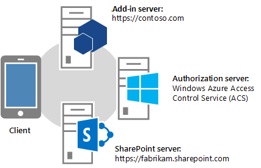
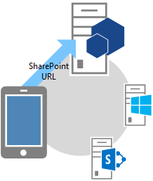

# Fluxo de OAuth do código de autenticação para o SharePoint Add-ins
Aprenda o fluxo de OAuth para suplementos que a permissão para acessar os recursos SharePoint dinamicamente e como usar a página OAuthAuthorize.aspx e o redirecionamento de SharePoint URI de solicitação.
## Obtenha uma visão geral de suplementos que solicitar permissão de acesso do SharePoint dinamicamente
<a name="Overview"> </a>


> **OBSERVAçãO**
> Este artigo pressupõe que você está familiarizado com  [Criando Add-ins do SharePoint que usam a autorização de baixa confiança](creating-sharepoint-add-ins-that-use-low-trust-authorization.md) e com os conceitos e princípios por trás do OAuth. Para obter mais informações sobre o OAuth, consulte [OAuth.net](http://oauth.net/) e [Protocolo de autorização de Web (oauth)](http://datatracker.ietf.org/doc/active/#oauth).
  
    
    

Em alguns cenários, um suplemento pode solicitar permissão para acessar os recursos SharePoint dinamicamente; que é, um **suplemento pode solicitar permissão para acessar os recursos de SharePoint dinamicamente em tempo de execução**, em vez de no momento da instalação do suplemento. Esse tipo de suplemento não precisa ser iniciados a partir ou até mesmo instalado, SharePoint. Por exemplo, é possível dispositivo nativo suplemento, um suplemento que é iniciado a partir de qualquer site ou um Suplemento do Office iniciados a partir de um aplicativo do Office que deseja acessar recursos em SharePoint dinamicamente.
  
    
    

> **OBSERVAçãO**
> Esse tipo de suplemento pode ser executado somente por usuários que têm permissões de gerenciar os recursos que o suplemento deseja acessar. Por exemplo, se um suplemento solicitar apenas permissão de leitura para um site, um usuário que tem de leitura, mas não gerenciar, direitos para o site não pode executar o suplemento.
  
    
    

Para poder ligar para SharePoint, esse tipo de **suplemento deve ser registrada primeiro** por meio do Painel do Vendedor ou a página appregnew.aspx. Para obter mais informações sobre como registrar suplementos via Painel do Vendedor ou appregnew.aspx, consulte [Registrar o SharePoint 2013 de suplementos](register-sharepoint-add-ins-2013.md).
  
    
    
Após ter registrado seu suplemento, ele é uma  *entidade de segurança*  e tem uma identidade, assim como os usuários e grupos do. Essa identidade é conhecida como umsuplemento principal. Assim como os usuários e grupos, um suplemento de entidade tem determinadas permissões. Para obter mais informações sobre o suplemento de entidades, consulte  [Registrar o SharePoint 2013 de suplementos](register-sharepoint-add-ins-2013.md).
  
    
    
Ao registrar o suplemento, você vai Obtenha uma id de cliente, o segredo do cliente, o domínio suplemento e redirecionar o URI para a entidade do suplemento. Essa informação é registrada com o servidor de autorização, Microsoft Azure Access Control Service (ACS).
  
    
    

## Entender o fluxo de OAuth para suplementos que solicitar permissões dinamicamente
<a name="Flow"> </a>

Esta seção resume o fluxo de autenticação e autorização do OAuth para um suplemento SharePoint solicitando permissões dinamicamente. O fluxo é chamado, **o fluxo de código de autenticação**. A sequência descreve como um suplemento que é iniciado em SharePoint não pode acessar recursos em SharePoint.
  
    
    

> **OBSERVAçãO**
> O fluxo **envolve uma série de interações entre o add-in, SharePoint, o servidor de autorização (que é o ACS) e o usuário final** em tempo de execução. Portanto, o fluxo requer SharePoint Online ou um farm de SharePoint que é conectado à Internet para que ele pode se comunicar com o ACS. farms de SharePoint que não estão conectados à Internet devem usar [o sistema de autorização de alta confiança](creating-sharepoint-add-ins-that-use-high-trust-authorization.md).
  
    
    

Deve ser um aplicativo web ou um serviço hospedado separadamente do SharePoint. Mesmo se o suplemento for um suplemento do dispositivo, ela tem deve ter um aplicativo web ou a URL que pode ser registrado com o ACS (veja acima), mesmo se o componente da web é usado para nada mais de serviço. Para manter a simplicidade, este artigo partirá do pressuposto de que o suplemento é um aplicativo web chamado Contoso.com. O aplicativo usa o modelo de objeto de cliente (CSOM) SharePoint ou SharePoint APIs REST para fazer chamadas para SharePoint. Quando o aplicativo primeiro tenta acessar SharePoint, SharePoint solicita um código de autorização do ACS que ele pode enviar para o aplicativo de Contoso.com. O aplicativo, em seguida, usa o código de autorização para solicitar um token de acesso do ACS. Depois que tiver sido o token de acesso, o aplicativo de Contoso.com inclui-la em todas as suas solicitações para SharePoint.
  
    
    

### Veja um exemplo detalhado do fluxo
<a name="Fly"> </a>

Suponha que a Contoso oferece um serviço de impressão de fotos online. Um usuário quiser imprimir algumas fotos. O usuário deseja dar consentimento para um serviço de impressão de fotos de Contoso para acessar e imprimir fotos a partir de um conjunto de bibliotecas de foto que o usuário mantém em um site SharePoint Online,  `fabrikam.sharepoint.com`.
  
    
    

  
    
    

  
    
    
O aplicativo de impressão de fotos está registrado, portanto, ela tem uma id de cliente, segredo do cliente, redirecionar URI. O URI que Contoso fornecida quando ele registrado o suplemento de redirecionamento é  `https://contoso.com/RedirectAccept.aspx`. A id do cliente e a informações secretas de cliente são armazenados incluídos no arquivo Web. config de impressão de fotos do aplicativo. O exemplo a seguir é um exemplo de como o id de cliente e o segredo de cliente são inseridos no arquivo Web. config XML.
  
    
    


```XML

<configuration>
  <appSettings>
    <add key="ClientId" value="c78d058c-7f82-44ca-a077-fba855e14d38 "/>
    <add key="ClientSecret" value="SbALAKghPXTjbBiLQZP+GnbmN+vrgeCMMvptbgk7T6w= "/>

  </appSettings>

</configuration>
```

A seguir estão as etapas no fluxo de código de autenticação.
  
    
    

    
> **DICA**
> Essas etapas se referir a métodos no arquivo TokenHelper.cs (ou. vb). Este código gerenciado não é compilado, portanto não há nenhum tópicos de referência para ele. No entanto, o arquivo em si é totalmente comentado com descrições de cada classe, o parâmetro de membro e o valor de retorno. Considere a ter uma cópia dela abertas para consultar à medida que você leia estas etapas.
  
    
    


||||
|:-----|:-----|:-----|
|**1** <br/> ||**Cliente abre um aplicativo e, em seguida, ele direciona a um site SharePoint para dados.** <br/> Um usuário navega até o site de impressão de fotos da Contoso, onde a interface do usuário indica que o usuário pode imprimir fotos que são mantidas no qualquer site SharePoint Online. Neste exemplo, a URL do scritpt é  `https://contoso.com/print/home.aspx`. <br/> O suplemento de impressão de fotos pergunta ao usuário inserir a URL do conjunto de foto. O usuário insere uma URL que aponta para o site SharePoint Online:  `https://fabrikam.sharepoint.com/`. <br/> |
|**2** <br/> ||**O suplemento redireciona para a URL de autorização do site SharePoint.** <br/> Quando o usuário clica no botão para obter as fotos, o suplemento de impressão de fotos Contoso redireciona o navegador para  `https://fabrikam.sharepoint.com/`. Esse redirecionamento é uma resposta de redirecionar HTTP 302. <br/> Se você estiver usando o Microsoft .NET, **Response.Redirect** é uma das várias maneiras que você pode fazer o redirecionamento do seu código. Usando o arquivo TokenHelper.cs (ou. vb) em seu projeto, seu código pode chamar o método sobrecarregado **GetAuthorizationUrl** (usando a sobrecarga com três argumentos). Esse método constrói a URL de redirecionamento OAuthAuthorize.aspx para você. Ou então, seu código pode construir manualmente a URL. <br/> Por exemplo, se você optar por chamar o método de **GetAuthorizationUrl** para construir a URL de redirecionamento OAuthAuthorize.aspx para você, usando o TokenHelper.cs (ou. vb) em seu projeto, o código é da seguinte maneira: <br/>  `Response.Redirect(TokenHelper.GetAuthorizationUrl(`           `sharePointSiteUrl.ToString(),`           `"Web.Read List.Write",`           `"https://contoso.com/RedirectAccept.aspx"));` <br/> Se você observar a sobrecarga de três parâmetros do método **GetAuthorizationUrl** em TokenHelper.cs (ou. vb), você vê que o segundo parâmetro é um parâmetro de escopo de permissão, que é uma lista delimitada por permissões as solicitações de suplemento em formato de forma abreviada. Para obter mais informações sobre escopos de permissão, consulte [Entender os aliases de escopo de permissão e o uso da página OAuthAuthorize.aspx](#Scope). O terceiro parâmetro deve ser o mesmo URI que é usado quando o suplemento é registrado de redirecionamento. Para obter mais informações sobre o registro, consulte  [Registrar o SharePoint 2013 de suplementos](register-sharepoint-add-ins-2013.md). Você verá que a cadeia de caracteres retornada é uma URL, incluindo os parâmetros de seqüência de consulta. <br/> Se você preferir, você pode construir manualmente a URL de redirecionamento de OAuthAuthorize.aspx. Por exemplo, a URL que o suplemento de impressão de fotos Contoso redireciona o usuário nesse caso é: <br/>  `https://fabrikam.sharepoint.com/_layouts/15/OAuthAuthorize.aspx?client_id=client_GUID&amp;scope=app_permissions_list&amp;response_type=code&amp;redirect_uri=redirect_uri` <br/> Como a apresentação de exemplo, o suplemento de impressão de fotos Contoso envia o cliente OAuth Id e o URI de redirecionamento para o site da Fabrikam como parâmetros de seqüência de consulta. O exemplo a seguir é um exemplo da solicitação GET com valores de cadeia de caracteres de consulta de exemplo. Quebras de linha foram adicionadas para manter a clareza. A URL de destino real é uma única linha. <br/>  `GET /authcode HTTP/1.1`           `Host: fabrikam.sharepoint.com`                     `/oauthauthorize.aspx`           `?client_id= c78d058c-7f82-44ca-a077-fba855e14d38`           `&amp;scope=list.read`           `&amp;response_type=code`           `&amp;redirect_uri= https%3A%2F%2Fcontoso%2Ecom%2Fredirectaccept.aspx`           <br/> Se você quiser uma caixa de diálogo pop-up de consentimento separado, você pode adicionar o parâmetro de consulta **IsDlg=1** para a construção de URL, conforme mostrado aqui: <br/>  `/oauthauthorize.aspx?IsDlg=1&amp;client_id= c78d058c-7f82-44ca-a077-fba855e14d38&amp;scope=list.read&amp;response_type=code&amp;redirect_uri= https%3A%2F%2Fcontoso%2Ecom%2Fredirectaccept.aspx` <br/> |
|**3** <br/> ||**SharePoint exibirá a página de consentimento para que o usuário pode conceder as permissões do suplemento.** <br/> Se o usuário já não tiver entrado para o site da Fabrikam SharePoint Online, o usuário é solicitado a entrar. Quando o usuário está conectado, SharePoint renderiza a uma página de consentimento HTML. <br/> A página de consentimento solicita ao usuário conceder (ou negar) o suplemento do Contoso impressão de fotos as permissões que o suplemento de solicitações. Nesse caso, o usuário seria conceder o acesso de leitura suplemento à biblioteca de imagens do usuário na Fabrikam. <br/> |
|**4** <br/> ||**SharePoint solicita um código de autorização de curta duração do ACS.** <br/> O site de SharePoint Online Fabrikam solicita o ACS para criar um código de autorização de curta duração (aproximadamente 5 minutos) exclusivo para esta combinação de usuário e o suplemento. <br/> ACS envia o código de autorização para o site da Fabrikam. <br/> |
|**5** <br/> ||**O site SharePoint Online redireciona para o URI, passando o código de autorização para o suplemento de redirecionamento registrados do aplicativo.** <br/> O site de SharePoint Online Fabrikam redireciona o navegador de volta para a Contoso via HTTP 302 resposta. A construção de URL para esse redirecionamento usa o redirecionamento de URI que foi especificado quando o suplemento de impressão de fotos foi registrated. Ele também inclui o código de autorização como uma cadeia de caracteres de consulta. A URL de redirecionamento é estruturada semelhante ao seguinte: <br/>  `https://contoso.com/RedirectAccept.aspx?code=<authcode>` <br/> |
|**6** <br/> ||**O suplemento usa o código de autorização para solicitar um token de acesso do ACS, que valida a solicitação, invalida o código de autorização e envia os tokens de acesso e atualizar para o suplemento.** <br/> Contoso recupera o código de autorização do parâmetro de consulta e, em seguida, inclui-la, juntamente com a ID de cliente e o segredo do cliente, em uma solicitação para o ACS para um token de acesso. <br/> Se você estiver usando código gerenciado e o arquivo de SharePoint CSOM, o TokenHelper.cs (ou. vb), o método que faz a solicitação à ACS é **GetClientContextWithAuthorizationCode**. Neste caso o código é semelhante ao seguinte (onde  `authCode` é uma variável à qual foi atribuído o código de autorização): <br/>  `TokenHelper.GetClientContextWithAuthorizationCode(`           `"https://fabrikam.sharepoint.com/",`           `"00000003-0000-0ff1-ce00-000000000000",`           `authCode,`           `"1ee82b34-7c1b-471b-b27e-ff272accd564",`           `new Uri(Request.Url.GetLeftPart(UriPartial.Path)));`           <br/> Se você observar o arquivo TokenHelper.cs (ou. vb), o segundo parâmetro do método **GetClientContextWithAuthorizationCode** é o `targetPrincipalName`. Esse valor é sempre a constante " `00000003-0000-0ff1-ce00-000000000000`" em um suplemento que está acessando SharePoint. Você também verá, se você rastrear a hierarquia de chamada de **GetClientContextWithAuthorizationCode**, que ele obtém o cliente ID e segredo do arquivo Web. config. <br/> O ACS recebe a solicitação da Contoso e valida o ID do cliente, segredo do cliente, o URI de redirecionamento e código de autorização. Se todos forem válidos, o ACS invalida o código de autorização (ele pode ser usado apenas uma vez) e cria um token de atualização e um token de acesso, ele retorna para Contoso. <br/> O aplicativo Contoso pode armazenar em cache esse token de acesso para reutilização em solicitações posteriores. Por padrão, os tokens de acesso são adequados para cerca de 12 horas. Cada token de acesso é específico para a conta de usuário que é especificada na solicitação original para autorização e concede acesso somente para os serviços que são especificados na solicitação. Seu suplemento armazene o token de acesso com segurança. <br/> O aplicativo Contoso também pode armazenar em cache o token de atualização. Por padrão, os tokens de atualização são adequados para seis meses. O token de atualização pode ser trocado por um novo token de acesso do ACS sempre que o token de acesso expira. Para obter mais informações sobre tokens, consulte  [Lidar com tokens de segurança no hospedado em provedor baixa confiança SharePoint suplementos](handle-security-tokens-in-provider-hosted-low-trust-sharepoint-add-ins.md). <br/> |
|**7** <br/> ||**O suplemento agora pode usar o token de acesso aos dados de solicitação do site SharePoint que ele pode ser exibido para o usuário.** <br/> Contoso inclui o token de acesso para fazer uma chamada de API REST ou a solicitação CSOM para SharePoint, passando o acesso OAuth token no cabeçalho HTTP **Authorization**. <br/> SharePoint retorna as informações desse Contoso solicitado. Para obter mais informações sobre como essa solicitação for feita, consulte  [Lidar com tokens de segurança no hospedado em provedor baixa confiança SharePoint suplementos](handle-security-tokens-in-provider-hosted-low-trust-sharepoint-add-ins.md). <br/> |
   

## Entender os aliases de escopo de permissão e o uso da página OAuthAuthorize.aspx
<a name="Scope"> </a>

Esta seção pressupõe que você está familiarizado com o artigo  [Suplemento permissões no SharePoint 2013](add-in-permissions-in-sharepoint-2013.md). A tabela 1 mostra o suplemento mesmo escopo de solicitação de permissão URIs mostrados nesse artigo, exceto que ele tem uma coluna adicional ( **Alias do escopo** ) e o controle total à direita não está disponível na coluna **Direitos disponíveis**, pois um suplemento que a solicitação de permissão para acessar os recursos SharePoint dinamicamente não pode solicitar o controle total à direita.
  
    
    
Os valores listados na coluna **Escopo Alias** são versões de forma abreviada de seus correspondentes na coluna **URI de escopo**. Os aliases podem ser usados somente pelo suplementos que a solicitação de permissão para acessar os recursos SharePoint dinamicamente. (Os valores URI de escopo são usados no manifesto add-in de suplementos que são iniciados de SharePoint. Esses suplementos solicitar permissões durante a instalação do suplemento.)
  
    
    
Os aliases de escopo são usados apenas no contexto do usando a página de redirecionamento de OAuthAuthorize.aspx. Conforme mostrado na etapa 2 do fluxo de OAuth descrita na seção anterior, quando o suplemento está usando código gerenciado, os aliases são usados quando você chama o método **GetAuthorizationUrl** de TokenHelper.cs (ou. vb) em seu projeto. Este é outro exemplo:
  
    
    


```cs

Response.Redirect(TokenHelper.GetAuthorizationUrl(
    sharePointSiteUrl.ToString(), 
    "Web.Read List.Write ", 
    "https://contoso.com/RedirectAccept.aspx "));
```

O valor do parâmetro  _scope_, `Web.Read List.Write`, é um exemplo de como você faria solicitar permissões usando os aliases de escopo. O parâmetro  _scope_ é um conjunto delimitado por espaço de escopo de permissão e solicitações de à direita.
  
    
    
Se você não estiver usando código gerenciado, os aliases de escopo são usados no campo de escopo da URL de redirecionamento. Por exemplo:
  
    
    
 `https://fabrikam.sharepoint.com/_layout/15/OAuthAuthorize.aspx?client_id=c78d058c-7f82-44ca-a077-fba855e14d38&amp;scope=list.write&amp;response_type=code&amp;redirect_uri=https%3A%2F%2Fcontoso%2Ecom%2Fredirectaccept.aspx`
  
    
    

> **OBSERVAçãO**
> Para obter uma descrição dos escopos, consulte  [Suplemento permissões no SharePoint 2013](add-in-permissions-in-sharepoint-2013.md).
  
    
    


**Tabela 1. escopo de solicitação de permissão do suplemento SharePoint URIs e seus aliases correspondentes**

||||
|:-----|:-----|:-----|
|**URI de escopo** <br/> |**Alias de escopo** <br/> |**Direitos disponíveis** <br/> |
|http://SharePoint/Content/sitecollection <br/> |Site <br/> |Leitura, gravação, gerenciar <br/> |
|http://sharepoint/content/sitecollection/web <br/> |Web <br/> |Leitura, gravação, gerenciar <br/> |
|http://sharepoint/content/sitecollection/web/list <br/> |List <br/> |Leitura, gravação, gerenciar <br/> |
|http://SharePoint/Content/tenant <br/> |AllSites <br/> |Leitura, gravação, gerenciar <br/> |
|http://SharePoint/BCS/Connection <br/> |None (não suportados atualmente) <br/> |Leitura <br/> |
|http://SharePoint/Search <br/> |Pesquisa <br/> |QueryAsUserIgnoreAppPrincipal <br/> |
|http://SharePoint/ProjectServer <br/> |ProjectAdmin <br/> |Gerenciar <br/> |
|http://SharePoint/ProjectServer/Projects <br/> |Projetos <br/> |Leitura, Gravação <br/> |
|http://SharePoint/ProjectServer/Projects/Project <br/> |Projeto <br/> |Leitura, Gravação <br/> |
|http://SharePoint/ProjectServer/enterpriseresources <br/> |ProjectResources <br/> |Leitura, Gravação <br/> |
|http://SharePoint/ProjectServer/statusing <br/> |ProjectStatusing <br/> |SubmitStatus <br/> |
|http://SharePoint/ProjectServer/Reporting <br/> |ProjectReporting <br/> |Leitura <br/> |
|http://SharePoint/ProjectServer/Workflow <br/> |ProjectWorkflow <br/> |Elevar <br/> |
|http://SharePoint/social/tenant <br/> |AllProfiles <br/> |Leitura, gravação, gerenciar <br/> |
|http://SharePoint/social/Core <br/> |Social <br/> |Leitura, gravação, gerenciar <br/> |
|http://SharePoint/social/microfeed <br/> |Microfeed no <br/> |Leitura, gravação, gerenciar <br/> |
|http://SharePoint/Taxonomy <br/> |TermStore <br/> |Leitura, Gravação <br/> |
   

## Saiba como usar um URI de redirecionamento e ver uma página de redirecionamento de amostra
<a name="RedirectURI"> </a>


  
    
    
O **URI de redirecionar** que é usada pelo suplementos que solicitar permissão dinamicamente **é o URI que SharePoint redireciona o navegador para depois de consentimento é concedido** (com o código de autorização incluído como um parâmetro de consulta). Etapa 2 da descrição do fluxo acima fornece um exemplo de onde o URI é codificada em uma chamada ao método **GetAuthorizationUrl**. Como alternativa, um suplemento do ASP.NET também pode armazenar o URI de redirecionamento no arquivo Web. config, conforme mostrado neste exemplo:
  
    
    


```XML

<configuration>
  <appSettings>
    <add key="RedirectUri" value="https://contoso.com/RedirectAccept.aspx" />
  </appSettings>
<configuration>
```

O valor pode ser recuperado com uma chamada para  `WebConfigurationManager.AppSettings.Get("RedirectUri")`.
  
    
    
O **ponto de extremidade no redirecionamento URI obtém o código de autorização do parâmetro de consulta e o utiliza para obter um token de acesso**, que podem ser usados para acessar SharePoint. Geralmente, o ponto de extremidade é a mesma página, ou o método de controlador ou o método de web que originalmente tentou acessar SharePoint. No entanto, pode ser uma página ou o método que recebe apenas o token de autorização e, em seguida, redireciona para outra página ou o método. O método ou páginas especiais poderia passar o token de autorização ou guardar em cache. (Ele tem um tempo de vida de cerca de 5 minutos). Como alternativa, ele poderia usar o token de autorização para obter um token de acesso que ele armazena em cache.
  
    
    
O exemplo a seguir é um exemplo de código por trás de tal uma página em um aplicativo ASP.NET. Observe o seguinte sobre este código:
  
    
    

- Ele usa o arquivo TokenHelper.cs que seja gerado pelo Office Developer Tools for Visual Studio.
    
  
- O código supõe que há um parâmetro de consulta de "código" que contém um código de autorização. Isso é seguro porque a página é chamada somente por SharePoint e somente quando ele está passando um código de autorização.
    
  
- Ele usa o objeto de contexto de cliente CSOM para acessar SharePoint, mas poderia também têm simplesmente cache desse objeto no servidor e redirecionado para outra página.
    
  
- O método **GetClientContextWithAuthorizationCode** usa o código de autorização para obter um código de acesso. Em seguida, ele cria um objeto de contexto de cliente SharePoint e modifica o manipulador do objeto para o evento **ExecutingWebRequest** para que o manipulador incluirá o token de acesso em todas as solicitações para SharePoint. O token de acesso é, na verdade, armazenados em cache dentro do objeto.
    
  
- O método **GetClientContextWithAuthorizationCode** envia a URL de redirecionamento de volta para o ACS no parâmetro `rUrl` , mas o ACS usa-o como uma forma de identificação caso tenha sido roubado o código de autorização. ACS não usá-lo para redirecionar novamente, portanto, esse código não entrará em loop indefinidamente redirecionando a mesma.
    
  
- O código não faz nenhuma provisão para lidar com um token de acesso expirados. Depois que o objeto de contexto de cliente é criado, ele mantém usando o mesmo token de acesso. Não usa o token de atualização. Esta é uma estratégia apropriada para suplementos que são usadas somente em sessões que duram menor do que o tempo de vida de um token de acesso.
    
  
Para obter um exemplo mais complexo que usa o token de atualização para obter um novo token de acesso, consulte a próxima seção.
  
    
    


```cs

public partial class RedirectAccept : System.Web.UI.Page
{
    protected void Page_Load(object sender, EventArgs e)
    {
        string authCode = Request.QueryString["code"];
        Uri rUri = new Uri("https://contoso.com/RedirectAccept.aspx");

        using (ClientContext context = TokenHelper.GetClientContextWithAuthorizationCode(
            "https://fabrikam.sharepoint.com/", 
            "00000003-0000-0ff1-ce00-000000000000",
            authCode,
            "1ee82b34-7c1b-471b-b27e-ff272accd564".
            rUri))
       {
           context.Load(context.Web);
           context.ExecuteQuery();

           Response.Write("<p>" + context.Web.Title + "</p>");
       }
    }
}

```


## Obter exemplos de código por trás de uma página que acessa SharePoint
<a name="Default"> </a>

Veja a seguir code-behind para uma página Default. aspx. Esta página supõe que um cenário no qual a página padrão é a página de início para o suplemento e também é o URL registrado redirecionar para a nota de suplemento a seguir sobre este código:
  
    
    

- O método **Page_Load** primeiramente verifica um código de autorização na seqüência de consulta. Haverá um se o navegador foi redirecionado à página pelos SharePoint. Se houver, o código usa-o para obter uma atualização de nova token, que armazena em cache em um cache durável que dura nas sessões.
    
  
- Em seguida, o método verifica um token de atualização no cache.
    
  - Se houver uma, ele obtém uma informando SharePoint as permissões necessárias (permissão de gravação no escopo da Web) e solicitando SharePoint de um código de autorização. O usuário é solicitado a conceder a permissão e se ele for concedido, SharePoint obtém o código de autorização do ACS e enviá-la de volta como um parâmetro de consulta em um redirecionamento para essa mesma página.
    
  
  - Se houver um token de atualização de cache, o método usa-lo para obter um token de acesso, diretamente do ACS. Assim como o exemplo no final da seção anterior deste artigo, o token de acesso é usado para criar um objeto de contexto de cliente SharePoint. Usando um token de atualização de cache para obter um acesso token diretamente do ACS, evita a chamada de rede adicionais para SharePoint na inicialização de sessão, para agilizar a inicialização de experiência de usuários reexecutando o suplemento dentro o tempo de vida do cache de token de atualização.
    
  
- Assim como o exemplo no final da seção anterior, esse código não faz nenhuma provisão para lidar com um token de acesso expirados. Depois que o objeto de contexto de cliente é criado, ele mantém usando o mesmo token de acesso. Uma maneira para proteger contra um token de acesso expirados é para armazenar em cache o token de acesso, além de token de atualização. Você poderia modificar o código a seguir para que ele chama o método **GetAccessToken** apenas se não houver um token de acesso ainda em vigor no cache. No entanto, embora seja aceitável ter o token de atualização de cache no cliente, em um cookie, por exemplo, o token de acesso deve apenas ser em um cache do servidor por motivos de segurança. O token de atualização é criptografado e só pode ser criptografado pelo ACS. Mas o token de acesso é meramente codificados (com codificação em Base 64) e pode ser facilmente decodificado por um ataque man-in-the-middle.
    
  
- A classe **TokenCache** que é denominada nesse código é definida abaixo.
    
  

```cs

using System;
using System.Collections.Generic;
using System.Linq;
using System.Web;
using System.Web.UI;
using System.Web.UI.WebControls;
using Microsoft.SharePoint.Samples;
using Microsoft.SharePoint.Client;

namespace DynamicAppPermissionRequest
{
    public partial class Default : System.Web.UI.Page
    {
        protected void Page_Load(object sender, EventArgs e)
        {
            Uri sharePointSiteUrl = new Uri("https://fabrikam.sharpoint.com/print/");

            if (Request.QueryString["code"] != null)
            {
                TokenCache.UpdateCacheWithCode(Request, Response, sharePointSiteUrl);
            }

            if (!TokenCache.IsTokenInCache(Request.Cookies))
            {
                Response.Redirect(TokenHelper.GetAuthorizationUrl(sharePointSiteUrl.ToString(), 
                                                                  "Web.Write"));
            }
            else
            {
                string refreshToken = TokenCache.GetCachedRefreshToken(Request.Cookies);
                string accessToken = 
                TokenHelper.GetAccessToken(
                           refreshToken, 
                           "00000003-0000-0ff1-ce00-000000000000", 
                           sharePointSiteUrl.Authority, 
                           TokenHelper.GetRealmFromTargetUrl(sharePointSiteUrl)).AccessToken;

                using (ClientContext context = 
                       TokenHelper.GetClientContextWithAccessToken(sharePointSiteUrl.ToString(), 
                                                                   accessToken))
                {
                    context.Load(context.Web);
                    context.ExecuteQuery();

                    Response.Write("<p>" + context.Web.Title + "</p>");
                }
            }
        }
    }
}
```

A seguir está um exemplo de código para um módulo de cache de token que chama o código de exemplo anterior. Ele usa os cookies como o cache. Existem outras opções de cache. Para obter mais informações, consulte  [Lidar com tokens de segurança no hospedado em provedor baixa confiança SharePoint suplementos](handle-security-tokens-in-provider-hosted-low-trust-sharepoint-add-ins.md).
  
    
    


```cs

using System;
using System.Collections.Generic;
using System.Linq;
using System.Web;
using Microsoft.SharePoint.Samples;

namespace DynamicAppPermissionRequest
{
    public static class TokenCache
    {
        private const string REFRESH_TOKEN_COOKIE_NAME = "RefreshToken";

        public static void UpdateCacheWithCode(HttpRequest request, 
                                               HttpResponse response, 
                                               Uri targetUri)
        {
            string refreshToken = 
                TokenHelper.GetAccessToken(
                    request.QueryString["code"], 
                    "00000003-0000-0ff1-ce00-000000000000", 
                    targetUri.Authority, 
                    TokenHelper.GetRealmFromTargetUrl(targetUri), 
                    new Uri(request.Url.GetLeftPart(UriPartial.Path)))
                   .RefreshToken;
            SetRefreshTokenCookie(response.Cookies, refreshToken);
            SetRefreshTokenCookie(request.Cookies, refreshToken);
        }

        internal static string GetCachedRefreshToken(HttpCookieCollection requestCookies)
        {
            return GetRefreshTokenFromCookie(requestCookies);
        }

        internal static bool IsTokenInCache(HttpCookieCollection requestCookies)
        {
            return requestCookies[REFRESH_TOKEN_COOKIE_NAME] != null;
        }

        private static string GetRefreshTokenFromCookie(HttpCookieCollection cookies)
        {
            if (cookies[REFRESH_TOKEN_COOKIE_NAME] != null)
            {
                return cookies[REFRESH_TOKEN_COOKIE_NAME].Value;
            }
            else
            {
                return null;
            }
        }

        private static void SetRefreshTokenCookie(HttpCookieCollection cookies, 
                                                  string refreshToken)
        {
            if (cookies[REFRESH_TOKEN_COOKIE_NAME] != null)
            {
                cookies[REFRESH_TOKEN_COOKIE_NAME].Value = refreshToken;
            }
            else
            {
                HttpCookie cookie = new HttpCookie(REFRESH_TOKEN_COOKIE_NAME, 
                                                   refreshToken);
                cookie.Expires = DateTime.Now.AddDays(30);
                cookies.Add(cookie);
            }
        }
    }
}

```


## Recursos adicionais
<a name="AR"> </a>


-  [Autorização e autenticação do SharePoint Add-ins](authorization-and-authentication-of-sharepoint-add-ins.md)
    
  
-  [Criando Add-ins do SharePoint que usam a autorização de baixa confiança](creating-sharepoint-add-ins-that-use-low-trust-authorization.md)
    
  
-  [Suplementos do SharePoint](sharepoint-add-ins.md)
    
  
-  [Configurar um ambiente de desenvolvimento local para suplementos do SharePoint](set-up-an-on-premises-development-environment-for-sharepoint-add-ins.md)
    
  
-  [Introdução à criação de suplementos do SharePoint hospedados pelo provedor](get-started-creating-provider-hosted-sharepoint-add-ins.md)
    
  
