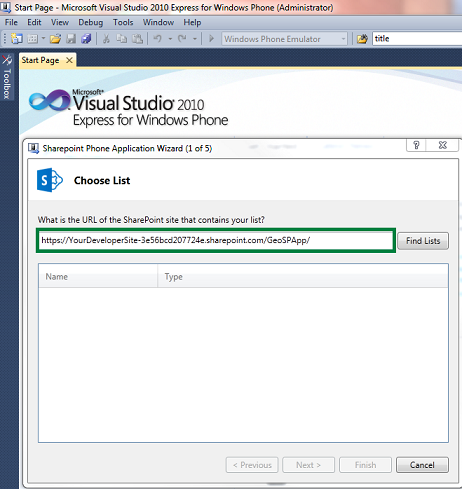

# Etapa 3: Criar um aplicativo móvel e registrar para notificações de push
Saiba como criar um aplicativo móvel do complementares para um Suplemento do SharePoint usando o modelo de aplicativo para Windows Phone SharePoint lista.
 * **Aplica-se a:*** 
  
    
    

 **Neste artigo**
  
    
    
 [Pré-requisitos para a criação de um aplicativo móvel do complementares](#Step3_CReateCompanionMobileApp_Prerequisites)
  
    
    
 [Criar um aplicativo móvel do complementares para um aplicativo para SharePoint](#Step3_CReateCompanionMobileApp_CReateCompanionMobileApp)
  
    
    
 [Adicionar as notificações por push para um aplicativo do Windows Phone complementares para SharePoint](#Step3_CReateCompanionMobileApp_AddPushNotificationToCompanionApp)
  
    
    
 [Recursos adicionais](#bk_addresources)
This is the third article in a three-part series that shows how to create a companion mobile app for SharePoint. For more information, see  [Como: criar um aplicativo móvel de complementar para um aplicativo do SharePoint](d124d2ea-f772-495c-941c-6507d6da2c17.md).
  
    
    

In this step, you create a companion Windows Phone app by using the Windows Phone SharePoint List Application template (for the Suplemento do SharePoint created in  [Etapa 1: Criar um aplicativo hospedado pelo provedor lista baseada no SharePoint 2013](e79ee2e7-0a80-4858-a311-c4f1f8d72a56.md)) and register your mobile app to receive push notifications.You create a Windows Phone app from the Windows Phone SharePoint List Application template, specifying the **appWebUrl** for your Suplemento do SharePoint. In this procedure, you have a single list in your Suplemento do SharePoint (created in [Etapa 1: Criar um aplicativo hospedado pelo provedor lista baseada no SharePoint 2013](e79ee2e7-0a80-4858-a311-c4f1f8d72a56.md)). If you have multiple lists in your app, see  [Como: usar SharePoint 2013 várias listas em um aplicativo do Windows Phone](http://msdn.microsoft.com/library/5251d35a-d659-49b3-8e0d-dfd4a7faee6b%28Office.15%29.aspx) for more information.Depois de criar o aplicativo móvel, você pode desenvolver uma classe **Notifications** para se inscrever para notificações de push, a implementação de manipuladores de eventos de notificação e armazenar informações relacionadas às notificações no telefone. Você também pode adicionar uma página XAML para seu aplicativo com controles para permitir que usuários registrar ou cancelar o registro para notificações de push.O **appWebUrl** é a URL do Suplemento do SharePoint. O formato desse URL é **https://<name of your developer site>.GUID.sharepoint.com/<SharePoint app name>**. Neste procedimento, é usado um provedor hospedado Suplemento do SharePoint e implantá-lo em Office 365.
## Pré-requisitos para a criação de um aplicativo móvel do complementares
<a name="Step3_CReateCompanionMobileApp_Prerequisites"> </a>

Para concluir essas etapas, você precisará dos seguintes itens:
  
    
    

- Visual Studio Express 2010 com os modelos do SharePoint Windows Phone do  [Microsoft SharePoint SDK para Windows Phone 7.1](http://www.microsoft.com/en-us/download/details.aspx?id=30476).
    
  
- An Suplemento do SharePoint deployed on Office 365. For more information, see  [Etapa 1: Criar um aplicativo hospedado pelo provedor lista baseada no SharePoint 2013](e79ee2e7-0a80-4858-a311-c4f1f8d72a56.md).
    
  

### Principais conceitos saber para a criação de um aplicativo móvel do complementares
<a name="Step3_CReateCompanionMobileApp_CoewConcepts"> </a>

Antes de concluir essas etapas, você deve ter uma compreensão básica dos conceitos na tabela 1.
  
    
    

**Tabela 1. Conceitos principais para aplicativos móveis**


|**Título do artigo**|**Descrição**|
|:-----|:-----|
| [Visão geral dos modelos de aplicativos do Windows Phone SharePoint 2013 no Visual Studio](http://msdn.microsoft.com/library/6ae27957-fa41-4e6f-92e3-db11dae1f6c2%28Office.15%29.aspx) <br/> |Saiba mais sobre os modelos do Visual Studio instalados pelo Windows Phone SharePoint Software Development Kit de desenvolvimento de aplicativos móveis. <br/> |
| [Como: configurar e usar as notificações por push nos aplicativos do SharePoint 2013 para Windows Phone](http://msdn.microsoft.com/library/68fa2138-86d9-4e35-9c7c-5cd292087b80%28Office.15%29.aspx#BKMK_NotificationPhoneApp) <br/> |Aprenda a desenvolver um aplicativo do Windows Phone para receber as notificações de push. <br/> |
   

## Criar um aplicativo móvel do complementares para um aplicativo para SharePoint
<a name="Step3_CReateCompanionMobileApp_CReateCompanionMobileApp"> </a>

In this section, you create a mobile companion Windows Phone app by using the Windows Phone SharePoint List Application template. The mobile companion app is used by technicians to view and edit the tasks that are assigned to them and to get push notifications when new tasks are assigned to them. This app uses the list created in  [Etapa 1: Criar um aplicativo hospedado pelo provedor lista baseada no SharePoint 2013](e79ee2e7-0a80-4858-a311-c4f1f8d72a56.md) as the target list. This procedure is similar to creating a Windows Phone SharePoint list app. For more information, see [Como: criar um aplicativo de lista do SharePoint 2013 do Windows Phone](http://msdn.microsoft.com/library/3e40c475-f4c1-4a4f-a3e5-1a55f814d272%28Office.15%29.aspx). The difference is the URL you provide in the **SharePoint Phone Application wizard** in Visual Studio. You need an **appWebUrl** to create your companion mobile app.
  
    
    

### Criar um aplicativo móvel


1. Inicie o Visual Studio usando a opção **Executar como administrador**.
    
  
2. Escolha **arquivo**, **novo** **projeto**.
    
    Será exibida a caixa de diálogo **Novo projeto**.
    
  
3. Na caixa de diálogo **Novo projeto**, expanda o nó do **Visual c#** e escolha o nó do **Silverlight para o telefone de janela**. (Certifique-se de que a versão do .NET Framework de destino está definida como **4**.)
    
    > [!OBSERVAçãO]
      > Os modelos instalados pelo SDK do Windows Phone SharePoint funcionam somente em projetos c#. Os modelos não estão disponíveis para projetos de Visual Basic.
4. No painel de **modelos**, escolha o modelo de **Aplicativo para Windows Phone SharePoint lista** e dê ao projeto um nome, comoSupportCenterCompanionPhoneApp.
    
  
5. Escolha o botão **OK**. O **Assistente de aplicativo de telefone do SharePoint** é exibida. Você pode usar este assistente para escolher uma lista do SharePoint em seu aplicativo do SharePoint e configurar as propriedades dessa lista para determinar como aparece em seu aplicativo do Windows Phone.
    
  
6. Specify the **appweburl** URL of your SharePoint app created in [Etapa 1: Criar um aplicativo hospedado pelo provedor lista baseada no SharePoint 2013](e79ee2e7-0a80-4858-a311-c4f1f8d72a56.md), as shown in Figure 1. The wizard prompts you to enter your SharePoint credentials for the target SharePoint site on your network (that is, an on-premises installation of SharePoint Server).
    
   **Figura 1. Assistente de aplicativo de telefone do SharePoint - etapa 1**

  

     
  

  

  
7. Escolha a **localização listas**. Se a conta sob a qual você está executando Visual Studio tem acesso ao site do desenvolvedor de destino especificado e o aplicativo do SharePoint, o **Assistente de aplicativo do SharePoint telefone** exibe as listas que estão disponíveis no que Suplemento do SharePoint.
    
  
8. Choose **Cases** from the list of available lists in the Suplemento do SharePoint created in [Etapa 1: Criar um aplicativo hospedado pelo provedor lista baseada no SharePoint 2013](e79ee2e7-0a80-4858-a311-c4f1f8d72a56.md).
    
  
9. Escolha **Avançar**. O assistente exibe os modos de exibição disponíveis associados à lista selecionada. Aqui, você pode escolher todas as exibições disponíveis na lista.
    
  
10. Marque a caixa de seleção ao lado de cada modo de exibição que você deseja incluir no seu aplicativo do Windows Phone.
    
  
11. Escolha **Avançar**. O assistente exibe as operações disponíveis para a lista selecionada no seu aplicativo do Windows Phone.
    
  
12. Escolha **Exibir** e **Editar** operações nesta etapa. Os técnicos estão usando o aplicativo do Windows Phone complementares móvel somente para exibir e editar as ocorrências atribuídas a eles.
    
  
13. Escolha **Avançar**. O assistente oferece a oportunidade para solicitar os campos que você selecionou na etapa anterior.
    
  
14. Ordem os campos de acordo com suas necessidades, selecionando campos individuais e movendo-los superior ou inferior na ordem escolhendo cima ou para baixo setas.
    
  
15. Escolha **Concluir**. Visual Studio cria os arquivos necessários para o projeto e abre o arquivo List.xaml para edição.
    
    > [!OBSERVAçãO]
      > O aplicativo do Windows Phone baseados em lista pode autenticar SharePoint Online pela primeira vez, mas pode falhar autenticar para a segunda vez e exibir um erro no servidor em tempo de execução. Para superar esse erro, habilite cookie cache ( `at.CookieCachingEnabled = true;`) antes de passar o objeto **Authenticator** para **clientContext.Credentials**, conforme mostrado no código a seguir, que aparece no arquivo ListDataProvider.cs gerado pelo Visual Studio.

  ```cs
  
public override ClientContext Context
    {
        get
        {
            if (m_Context != null)
                return m_Context;

            m_Context = new ClientContext(SiteUrl);

            Authenticator at = new Authenticator();
            // To avoid re-authentication error
            at.CookieCachingEnabled = true;
            // In case of Microsoft Online federated authentication, set ADFS authentication scheme preference for passive authentication
            // Example, to set client preference for SAML 2.0 username-password authentication scheme: 
            // at.FederationPassiveAuthUri = "urn:oasis:names:tc:SAML:2.0:ac:classes:Password"; 
            m_Context.Credentials = at;

            return m_Context;
        }
    }
  ```

The basic working version of your companion app is ready at this point. Visual Studio creates all the code that is needed to run the app. You can always enhance the app so that it can perform more complicated tasks. For more information, see  [Crie aplicativos do Windows Phone que acessam o SharePoint 2013](http://msdn.microsoft.com/library/36681335-f772-4499-8445-f94481bc18e7%28Office.15%29.aspx).
  
    
    

## Adicionar as notificações por push para um aplicativo do Windows Phone complementares para SharePoint
<a name="Step3_CReateCompanionMobileApp_AddPushNotificationToCompanionApp"> </a>

Nesta seção, você deve criar os arquivos. cs necessárias para habilitar as notificações por push em seu aplicativo móvel do complementares. Desenvolver uma classe **Notifications** para se inscrever para notificações de push, a implementação de manipuladores de eventos de notificação e armazenar informações relacionadas às notificações no telefone. Você também pode adicionar uma página XAML para seu aplicativo com controles para permitir que usuários registrar ou cancelar o registro para notificações de push.
  
    
    
Para seguir os procedimentos nesta seção, execute as etapas em  [Criar um aplicativo móvel do complementares para um aplicativo para SharePoint](#Step3_CReateCompanionMobileApp_CReateCompanionMobileApp) para criar um projeto de Visual Studio a partir do modelo de aplicativo para Windows Phone SharePoint lista, usando a lista de casos criada na seção anterior, como a lista do SharePoint de destino para o projeto. Os procedimentos nesta seção pressupõem que o nome do projeto éSupportCenterCompanionPhoneApp.
  
    
    

### Para criar a classe de gerenciamento de assinaturas e recebidas notificações


1. No **Solution Explorer**, escolha o nó que representa o projeto (chamado SupportCenterCompanionPhoneApp).
    
  
2. No menu **projeto**, escolha **Adicionar classe**. A caixa de diálogo **Adicionar Novo Item** aparece com o modelo de c# **classe** que já está selecionado.
    
  
3. Especifique Notifications.cs como o nome do arquivo e escolha **Adicionar**. O arquivo de classe é adicionado à solução e aberto para edição.
    
  
4. Substitua o conteúdo do arquivo com o código a seguir.
    
  ```
  
using System;
using System.Net;
using System.Windows;
using System.Windows.Controls;
using System.Windows.Documents;
using System.Windows.Ink;
using System.Windows.Input;
using System.Windows.Media;
using System.Windows.Media.Animation;
using System.Windows.Shapes;
using Microsoft.Phone.Notification;
using Microsoft.SharePoint.Client;
using System.Collections.Generic;
using Microsoft.Phone.Shell;
using System.IO;
using System.Diagnostics;
using System.IO.IsolatedStorage;

namespace SupportCenterCompanionPhoneApp
{
    public class Notification
    {
        #region Static properties and Fields

        private static HttpNotificationChannel HttpChannel
        {
            get;
            set;
        }

        private static ClientContext Context
        {
            get
            {
                return App.DataProvider.Context;
            }
        }

        private static string DeviceAppIdKey = "DeviceAppIDKey";

        private static string ChannelName = "SupportCenterNotificationChannel";

        #endregion

        public static void SubscribeDeviceForNotification()
        {
            //Get Existing Channel
            HttpChannel = HttpNotificationChannel.Find(ChannelName);

            // If Channel is Found and is connected
            if (HttpChannel != null &amp;&amp; HttpChannel.ConnectionStatus == ChannelConnectionStatus.Connected)
            {

                HttpChannel.ChannelUriUpdated += new EventHandler<NotificationChannelUriEventArgs>(OnChannelUriUpdated);
                HttpChannel.ErrorOccurred += new EventHandler<NotificationChannelErrorEventArgs>(OnHttpChannelExceptionOccurred);

                //Subscribe to SharePoint for receving Push Notification
                SubscribeToSharePointNotificationService();
            }
            else
            {
                //create a new channel
                HttpChannel = new HttpNotificationChannel(ChannelName);

                //Register for callback when Channel is opened
                HttpChannel.ChannelUriUpdated += new EventHandler<NotificationChannelUriEventArgs>(OnChannelUriUpdated);
                HttpChannel.ErrorOccurred += new EventHandler<NotificationChannelErrorEventArgs>(OnHttpChannelExceptionOccurred);

                try
                {
                    //Open HttpChannel for Notification Service
                    HttpChannel.Open();
                }
                catch (Exception) { }
            }
        }

        /// <summary>
        /// Subscribes device for Receiving Push Notifications from SharePoint.
        /// </summary>
        private static void SubscribeToSharePointNotificationService()
        {
            Context.Load(Context.Web, w => w.Title, w => w.Description);

            //Ensure device ID is created and saved to IS
            Notification.SaveDeviceAppIdToIS();
            //Get device-app unique ID
            Guid deviceAppInstanceId = GetSettingValue<Guid>(DeviceAppIdKey);

            PushNotificationSubscriber Regsubscriber = Context.Web.RegisterPushNotificationSubscriber(deviceAppInstanceId, HttpChannel.ChannelUri.AbsoluteUri);

            Context.ExecuteQueryAsync(
                    (object sender, ClientRequestSucceededEventArgs args) =>
                    {
                        ShowMessage("Subscriber successfully Registered for Notifications");
                    },
                    (object sender, ClientRequestFailedEventArgs args) =>
                    {
                        ShowMessage("Subscriber failed to register");
                    });
        }

        /// <summary>
        /// On Channel Uri updation, subscribes to SharePoint for receiving Push Notifications
        /// </summary>
        /// <param name="sender"></param>
        /// <param name="e"></param>
        private static void OnChannelUriUpdated(object sender, NotificationChannelUriEventArgs e)
        {
            try
            {
                if (!HttpChannel.IsShellToastBound)
                    HttpChannel.BindToShellToast();

                SubscribeToSharePointNotificationService();
            }
            catch (Exception)
            {
                //Catch exception here
            }
        }

        private static void OnHttpChannelExceptionOccurred(object sender, NotificationChannelErrorEventArgs e)
        {
            Debugger.Break();
        }


        #region Utility methods

        /// <summary>
        /// Save Device ID to Phone Isolated Storage
        /// </summary>
        private static void SaveDeviceAppIdToIS()
        {
            if (!IsolatedStorageSettings.ApplicationSettings.Contains(DeviceAppIdKey))
            {
                Guid DeviceAppId = Guid.NewGuid();
                SetSettingValue<Guid>(DeviceAppIdKey, DeviceAppId);
            }
        }

        /// <summary>
        /// Show Error message on UI thread.
        /// </summary>
        /// <param name="message"></param>
        private static void ShowMessage(string message)
        {
            Deployment.Current.Dispatcher.BeginInvoke(() =>
            {
                //MessageBox.Show(message);
            });
        }

        private static void SetSettingValue<T>(string key, T value)
        {
            if (IsolatedStorageSettings.ApplicationSettings.Contains(key))
                IsolatedStorageSettings.ApplicationSettings[key] = value;
            else
                IsolatedStorageSettings.ApplicationSettings.Add(key, value);

            IsolatedStorageSettings.ApplicationSettings.Save();
        }

        private static T GetSettingValue<T>(string key)
        {
            if (IsolatedStorageSettings.ApplicationSettings.Contains(key))
                return (T)IsolatedStorageSettings.ApplicationSettings[key];
            else
                return default(T);
        }

        #endregion
    }
}
  ```

5. Salve o arquivo.
    
  
Nesse código, o **OpenNotificationChannel** cria um canal de notificação para receber notificações de MPNS. Manipuladores de eventos estão anexados ao objeto canal para lidar com eventos de notificação e, em seguida, o canal for aberto. Neste exemplo, o evento **HttpNotificationReceived** (para receber notificações brutas) é implementado. Notificações brutas podem ser recebidas somente quando o aplicativo de telefone está sendo executado. O manipulador do evento **ShellToastNotificationReceived** (para receber notificações de proposta) também é implementado aqui para demonstrar o seu uso. Notificações de blocos podem ser recebidas somente quando o aplicativo de telefone inscritos não estiver funcionando, portanto não é necessário para implementar um manipulador de eventos do aplicativo para receber notificações de blocos em.
  
    
    
O método **SubscribeToService** executa o método **RegisterPushNotificationSubscriber** do objeto **SPWeb** de forma assíncrona (passando um valor para identificar o aplicativo de telefone e um valor URI associado com o canal de notificação) para registrar com o SharePoint server para receber notificações por push. Se o registro for bem-sucedida, o Windows Phone shell estiver definida como receber (e exibir) brindar e notificações sobre o canal de notificação específico registrado com o SharePoint server quando o próprio aplicativo de telefone não está sendo executado lado a lado.
  
    
    
O método **UnSubscribe** nesse código chama o método **UnregisterPushNotificationSubscriber** do objeto **SPWeb**. As diretrizes de desenvolvimento para aplicativos do Windows Phone recomendam que os usuários poderá optar se deseja inscrever-se para notificações de push ou não. Em um procedimento posterior, você adicionará um mecanismo para o usuário registrar ou cancelar o registro para notificações. Se o estado de registro é preservado entre sessões do aplicativo, tornando desnecessárias pedir ao usuário para registrar toda vez que o aplicativo é iniciado. O método **GetRegistrationStatus** é disponibilizado para que o aplicativo de telefone possa determinar se o usuário foi registrado (em uma sessão anterior) para receber notificações por push e o canal de notificação subsequentemente é aberto. O **SaveDeviceAppIdToStorage** salva o identificador (representado como um GUID) para a instância do aplicativo em um determinado Windows Phone para armazenamento isolado.
  
    
    
O método **ClearSubscriptionStore** está incluído aqui como uma demonstração de uma das maneiras de desmarcar os assinantes do repositório de inscrição no SharePoint Server. Os assinantes de notificações por push são armazenados em uma lista do SharePoint denominada "Repositório de inscrições de notificação de Push". Um botão para chamar esse método da classe **Notifications** é adicionado à página de configurações de notificações e é adicionado para o aplicativo em um procedimento posterior.
  
    
    
As operações que envolvem acessando o SharePoint server para definir as configurações ou preparar para notificações (por exemplo, o método **RegisterPushNotificationSubscriber** ) podem levar tempo para ser concluída, dependendo das condições da rede e a disponibilidade do servidor. Essas operações, portanto, são executadas de forma assíncrona (especificamente, usando o método **ExecuteQueryAsync** de um objeto **ClientContext** ) para permitir que o aplicativo para continuar a outros processos e manter a interface do usuário respondendo de forma ao usuário.
  
    
    
Para converter o campo de endereço do cliente para mapear no Bing Maps, adicione o seguinte código no final do código gerado automaticamente no arquivo DisplayForm.xaml.cs na pasta modos de exibição.
  
    
    


```

private void txtCustomerAddress_Click_1(object sender, RoutedEventArgs e)
        {
            BingMapsTask task = new BingMapsTask();
            task.SearchTerm = viewModel["CustomerAddress"].ToString();
            task.Show();
        }
```

Quando você adiciona um item à lista de casos na sua lista de Suplemento do SharePoint, o código no caso de receptor associada à lista tenta enviar notificações usando MPNS para telefones inscritos. Porém, dependendo das condições de rede e outros fatores, uma notificação de determinado não pode ser recebida por um telefone. Você pode consultar a lista de notificação no servidor, especialmente os valores nas colunas cabeçalhos e código de Status, para determinar o status e os resultados relacionados às notificações individuais.
  
    
    

## Recursos adicionais
<a name="bk_addresources"> </a>


-  [Desenvolver suplementos do SharePoint](71ddde4b-fac4-4d8c-aa2e-524f9c2c4c99.md)
    
  
-  [Como: criar um aplicativo móvel de complementar para um aplicativo do SharePoint](d124d2ea-f772-495c-941c-6507d6da2c17.md)
    
  
-  [Como: criar um aplicativo de lista do SharePoint 2013 do Windows Phone](http://msdn.microsoft.com/library/3e40c475-f4c1-4a4f-a3e5-1a55f814d272%28Office.15%29.aspx)
    
  
-  [Como: configurar e usar as notificações por push nos aplicativos do SharePoint 2013 para Windows Phone](http://msdn.microsoft.com/library/68fa2138-86d9-4e35-9c7c-5cd292087b80%28Office.15%29.aspx)
    
  
-  [Integrar a funcionalidade de local e o mapa no SharePoint 2013](http://msdn.microsoft.com/library/10d4a904-ed27-4513-8c20-d2098aebf22c%28Office.15%29.aspx)
    
  
