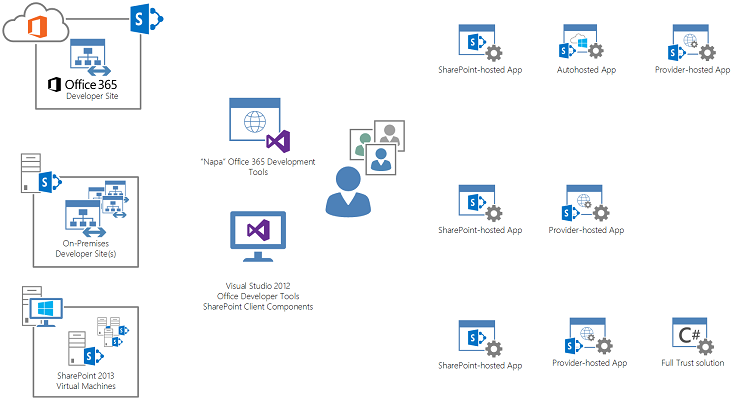
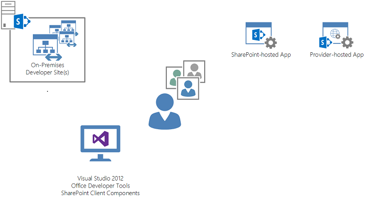
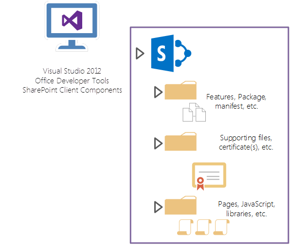
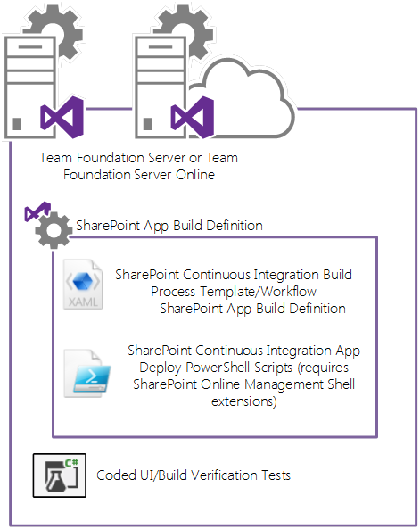
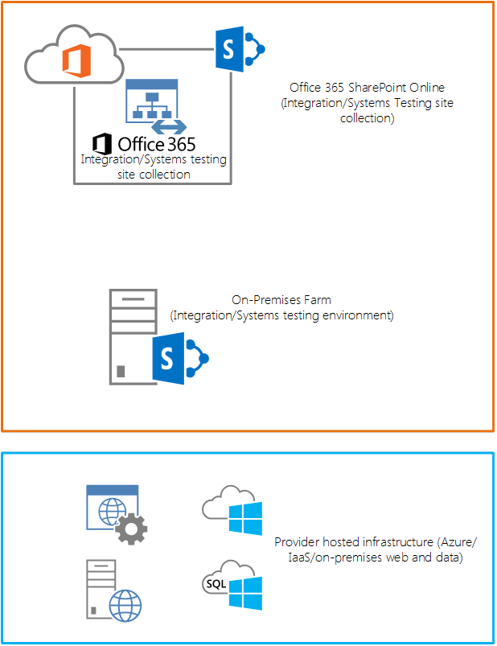
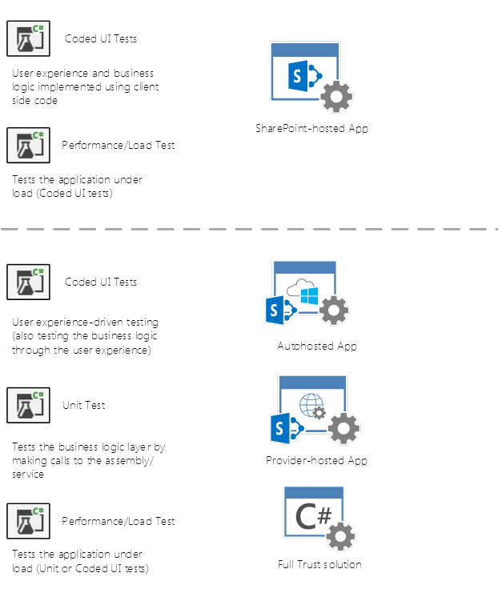
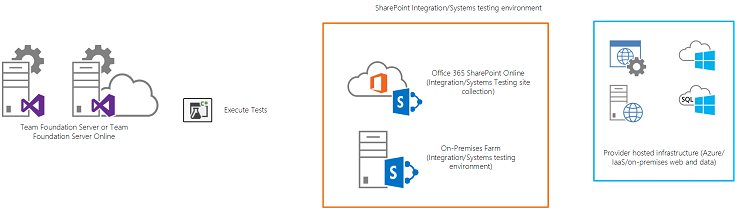

# SharePoint Server 2013 Application Lifecycle Management
Aplica práticas e conceitos ALM (gerenciamento) do ciclo de vida de aplicativo comuns ao desenvolvimento de aplicativos usando tecnologias de SharePoint Server 2013 .
 * **Aplica-se a:*** 
  
    
    

 * **Provided by:*** Eric Charran, Microsoft Corporation
 * **Colaboradores:*** VESA Juvonen, Microsoft Corporation | Steve Peschka, Microsoft Corporation
  
    
    

|||
|:-----|:-----|
|**Neste artigo**          [Visão geral do gerenciamento do ciclo de vida de aplicativos (ALM)](#Overview)           [Considerações sobre ambiente de desenvolvimento](#DevEnvironment)           [Considerações de design do ALM](#ALMDesign)           [Aplicação de patches e upgrades](#AppPatching)           [Recursos Adicionais](#bk_addresources)||
   

> [!IMPORTANTE]
> Este tópico refere-se a autohosted Suplementos do SharePoint. O programa de visualização para aplicativos de autohosted foi encerrada. Desconsidere todas as referências a autohosted Suplementos do SharePoint.
  
    
    

## Visão geral do gerenciamento do ciclo de vida de aplicativos (ALM)

Microsoft SharePoint Server 2013 permite que os desenvolvedores várias opções para criar e implantar aplicativos que são baseados nas tecnologias de SharePoint , para os dois locais e hospedados ou plataformas de nuvem pública. SharePoint Server 2013 oferece maior flexibilidade na forma de aplicativos podem levar, bem como as novas opções de usar tecnologias baseadas em padrões com aplicativos. Embora esses recursos de aplicativos e opções de implantação proporcionadas pelo novo modelo de aplicativo emSharePoint fornecem um meio eficaz dos desenvolvedores a criar aplicativos novos e de imersão, os desenvolvedores devem ser capazes de introduzir ALM considerações ao processo de desenvolvimento, teste e qualidade. Este artigo se aplica a conceitos ALM comuns e as práticas recomendadas para desenvolvimento de aplicativos usando tecnologias de SharePoint Server 2013 .
  
    
    

### Novidades

SharePoint Server 2013 estabelece um novo paradigma para a implementação de aplicativos. Devido a essa mudança no desenvolvimento de aplicativos com as tecnologias SharePoint , arquitetos e desenvolvedores devem ter um entendimento completo dos novos padrões de desenvolvimento de aplicativos, práticas recomendadas e modelos de implantação para SharePoint Server 2013. É importante observar que, embora o modelo de aplicativo para o desenvolvimento de soluções com SharePoint foi alterado, muitos dos padrões usados para desenvolvimento de soluções, incluindo opções de tecnologias, técnicas de implementação são compatíveis com tecnologias de desenvolvimento de aplicativo da web existente.
  
    
    
Os recursos a seguir descrevem os tipos de aplicativo que podem ser construídos usando tecnologias de SharePoint Server 2013 e contêm as considerações para ambas as instalações e aplicativos em nuvem. Para entender as opções de hospedagem para Suplementos do SharePoint, consulte  [Escolha os padrões para desenvolver e hospedar o Add-in do SharePoint](05ce5435-0a03-4ddc-976b-c33b08d03457.md).
  
    
    
Além disso, a Microsoft aconselha os clientes a avaliar as tecnologias usadas no desenvolvimento de aplicativos com SharePoint Server 2013 porque não há um conjunto mais amplo de opções de implementação da solução. Ao criar aplicativos, os clientes podem enfocar Aproveitando tecnologias baseadas em padrões, como HTML5 e JavaScript para a apresentação e o usuário tiver camadas, enquanto OData e OAuth podem ser utilizada para acesso, baseada em serviços fazer finalizar os serviços, inclusive o SharePoint. Os clientes devem considerar cuidadosamente se o código de confiança total (ou seja, assemblies compilados implantados em SharePoint) são necessárias. Apesar de continuar a usar esse paradigma de desenvolvimento, enquanto ainda válido e necessário em algumas situações, impõe uma sobrecarga significativa no processo de ALM.
  
    
    
Para obter mais informações sobre as novas tecnologias de desenvolvimento flexível para aplicativos SharePoint Server 2013, consulte  [Visão geral do desenvolvimento do SharePoint 2013](http://msdn.microsoft.com/library/f86e2695-4d7a-4fc5-bc23-689de96c4b06%28Office.15%29.aspx).
  
    
    

### Benefícios e alterações

Porque SharePoint-tecnologias de desenvolvimento de aplicativos com suporte agora oferecem uma variedade mais flexível de linguagens e arquiteturas de programação, os desenvolvedores precisam adaptar as práticas existentes de ALM em torno de técnicas de desenvolvimento para acomodar sua presença em SharePoint. Conceitos como testes, criar estabelecimento, implantação e controle de qualidade, pode ser expandido para incluir a implantação de SharePoint como um aplicativo de SharePoint . Isso pode significar que embora muitos desenvolvedores estão acostumados a gravar e implantar soluções de farm de servidor que ampliam os recursos principais do SharePoint, práticas comuns de ALM para o novo modelo flexível de desenvolvimento facilitado por aplicativos de SharePoint Server 2013 devem ser aplicados para o processo de implementação.
  
    
    
Como os clientes continuam a transição para implementações hospedados em nuvem de SharePoint Server 2013, os desenvolvedores precisam compreender como estender os conceitos ALM para incluir o desenvolvimento, testes e ambientes de destino de implantação que ficam fora dos limites físicos da organização. Isso inclui a avaliação da estratégia de tecnologia para a condução de desenvolvimento de aplicativos, testes e implantação.
  
    
    
Os desenvolvedores e arquitetos de TI podem se tornar habituados a soluções que consistem em vários componentes de aplicativo que abrangem ou combinam diferentes tipos de opções de hospedagem para resumir. Durante esse processo de adaptação, os procedimentos ALM devem ser aplicados unilateralmente a esses aplicativos. Por exemplo, os desenvolvedores talvez precise implantar um aplicativo que abranja a implantação de serviços no local (ou seja, IIS, ASP.NET, MVC, WebAPI e WCF), Microsoft Azure, SharePoint Server 2013e SQL Azure, ao mesmo tempo, além de ser capaz de testar os componentes do aplicativo para determinar a qualidade ou alguma regressão foram introduzido desde uma compilação anterior. Esses requisitos podem significar uma mudança significativa nas como desenvolvedores e equipes consideram o processo de compilação e implantação diário que é um procedimento bem conhecido para local ou soluções do lado do servidor.
  
    
    

### Considerações da equipe de desenvolvimento

Para empresas que têm mais de um desenvolvedor de aplicativo ou arquiteto, desenvolvimento de equipe para SharePoint Server 2013 deve ser cuidadosamente planejado para fornecer os aplicativos de mais alta qualidade, bem como suporte a produtividade do desenvolvedor suficientes. Como o método para a condução de desenvolvimento de aplicativos aumentou em flexibilidade, equipes precisará ser limpo e seguro não apenas em padrões e práticas ALM, mas também sobre como cada desenvolvedor irá escrever código e certifique-se de que o código de qualidade torna-se parte do aplicativo criar processo.
  
    
    
Essas considerações começam com selecionando o ambiente de desenvolvimento apropriadas. Tradicionalmente, o desenvolvimento foi relegado ao conduzir desenvolvimento separados em máquinas virtuais que estão conectados a um repositório comum de código que forneceu a compilação, implantação e capacidades de teste, como Visual Studio 2012 do TFS. TFS ainda é um forte componente fundamental de uma estratégia ALM e fundamental para o esforço de desenvolvimento, mas as equipes devem considerar como aproveitar o TFS entre os diferentes tipos de opções de ambiente de desenvolvimento.
  
    
    
Dependendo do ambiente de destino, o tipo de solução (isto é, quais componentes serão locais e que será hospedado na infraestrutura de nuvem ou serviços), os desenvolvedores agora podem selecionar de uma combinação de novas opções de ambiente de desenvolvimento. Essas opções consistem em novas opções como o modelo de site de desenvolvedor do SharePoint , um locatário de desenvolvedor de Office 365 , bem como opções herdadas, como de desenvolvimento baseado em máquina virtual usando o Hyper-V em Windows 8 ou Windows Server 2012.
  
    
    
A seção a seguir descreve as considerações de ambiente de desenvolvimento para desenvolvedores e equipes de desenvolvimento.
  
    
    

## Considerações sobre ambiente de desenvolvimento

A seleção de um ambiente de desenvolvimento deve ser feita com base em vários fatores. Essas considerações são muito influenciadas pelo tipo de aplicativo sendo desenvolvido, bem como a plataforma de destino para o aplicativo. Tradicionalmente, durante a criação de aplicativos para SharePoint Server 2010, os desenvolvedores seriam provisionamento de máquinas virtuais e conduzir desenvolvimento isoladamente. Isso era devido ao fato de que a implantação de soluções de confiança total exigem reinicializações de dependências de SharePoint de núcleo, como o IIS, o que impediria que vários desenvolvedores usando um ambiente único SharePoint . Como tecnologias de desenvolvimento foram alteradas e as opções para os desenvolvedores que criam aplicativos aumentaram, desenvolvedores e equipes devem entender a escolha dos ambientes de desenvolvimento disponíveis para eles. A Figura 1 mostra o ambiente de desenvolvimento e a combinação de ferramenta e inclui os tipos de soluções que podem ser implantados para os ambientes de destino.
  
    
    

**Figura 1. Ferramentas e componentes do ambiente de desenvolvimento**

  
    
    
 [
  
    
    
](http://go.microsoft.com/fwlink/?LinkId=391723) [Clique para ver a ampliação.](http://go.microsoft.com/fwlink/?LinkId=391723)
  
    
    

### Filosofia do ambiente de desenvolvimento

Devido aos investimentos feitos em como os aplicativos podem ser criados e implementados usando SharePoint Server 2013, os desenvolvedores devem determinar se é necessário para conduzir o desenvolvimento usando o código do lado do servidor. Quando os desenvolvedores criam aplicativos que usam o modelo hospedado na nuvem, o requisito para conduzir o desenvolvimento que se baseia em ambientes virtualizados, especificamente para SharePoint, diminui. Os desenvolvedores devem procurar criar soluções com o modelo de desenvolvimento remoto que usa existentes baseados em nuvem infra-estrutura (pública e privada). Se os ambientes de desenvolvimento podem ser provisionados de maneira rápida e fácil sem ter que criar e orquestrar a virtualização, os desenvolvedores podem investir tempo mais concentrando-se na produtividade de desenvolvimento e qualidade, em vez de gerenciamento de infra-estrutura.
  
    
    
A decisão de exigir uma instância virtualizada do SharePoint Server 2013 em comparação com o novo modelo de site de desenvolvimento SharePoint vai depender se o aplicativo requer código de confiança total para ser implantado no SharePoint e lá executados. Se nenhum código de confiança total é necessário, é recomendável usar o desenvolvedor do modelo de site, que pode ser encontrado em Office 365 inquilinos de desenvolvimento ou na implementação de uma organização de locais SharePoint. Modelos de site do desenvolvedor são projetados para desenvolvedores implantar aplicativos diretamente a SharePoint de Visual Studio. sites de desenvolvedores de Office 365 são pré-configuradas para o isolamento de aplicativos e OAuth para que os desenvolvedores podem começar imediatamente escritos e testes de aplicativos.
  
    
    
As seções a seguir descrevem em detalhes quando os desenvolvedores podem usar as opções de ambiente diferente para criar aplicativos.
  
    
    

### Sites de desenvolvimento O365 (nuvem pública)

A Figura 2 mostra como os desenvolvedores podem usar Office 365 como um ambiente de desenvolvimento e inclui os tipos de aplicativos de SharePoint de produzir ferramentas que podem ser hospedados em Office 365.
  
    
    

**Figura 2. Desenvolvimento de aplicativos do Office 365**

  
    
    
 [
  
    
    
](http://go.microsoft.com/fwlink/?LinkId=391724) [Clique para ver a ampliação.](http://go.microsoft.com/fwlink/?LinkId=391724)
  
    
    
Os desenvolvedores com as assinaturas do MSDN podem obter um locatário de desenvolvimento que contém umSharePointSite do Desenvolvedor. O SharePointSite do Desenvolvedor é pré-configurado para o desenvolvimento de aplicativos. Os usuários podem usar não apenas Visual Studio 2012 no desenvolvimento de aplicativos, mas com sites de desenvolvedores de Office 365 , Napa pode ser usado dentro do site para construir aplicativos. Para obter mais informações sobre como começar com umOffice 365 Developer Site, consulte  [Configurar um ambiente de desenvolvimento para suplementos do SharePoint no Office 365](b22ce52a-ae9e-4831-9b68-c9210af6dc54.md).
  
    
    
Os desenvolvedores podem iniciar a criação de aplicativos que serão hospedados em Office 365, no local ou em outra infra-estrutura em um modelo de provedor hospedado. O benefício desse ambiente é que a infra-estrutura, virtualização e outras considerações sobre a hospedagem de um ambiente de desenvolvimento do SharePoint é abstraídos por Office 365, permitindo que os desenvolvedores criem aplicativos instantaneamente. Uma consideração principal para esse tipo de ambiente de desenvolvimento é que os aplicativos que requerem código de confiança total para serem implantados nosSharePoint não podem ser acomodados. Microsoft recomenda usar o modelo de objeto do lado do cliente de SharePoint (CSOM) e as tecnologias do lado do cliente comoJavaScript tanto quanto possível. Que código de confiança total é necessário (mas não é necessária a implantação do código para ser executado em SharePoint ), é recomendável implantar o código do lado do servidor em um autohosted ou um modelo de provedor hospedado. Observe que essas soluções de código de confiança total são implantadas hospedado pelo provedor de infra-estrutura também usam o CSOM mas podem usar linguagens como C#. Também é importante observar que esses aplicativos implantados em um modelo de provedor hospedado podem usar outras pilhas de tecnologia e ainda usar o CSOM para interagir com SharePoint Server 2013.
  
    
    
Equipes de desenvolvimento de criação de recursos separados ou aplicativos que contêm uma solução melhor será necessário um destino de implantação centralizada para integração testar componentes. Como cada desenvolvedor está criando recursos ou aplicativos em seu próprio site de desenvolvedor do Office 365 , uma coleção de um local centralizado em um ambiente de Inquilino ou no local de destino deve ser configurada para que os componentes do aplicativo de cada desenvolvedor podem ser implantados lá. Essa abordagem permitirá um local centralizado para conduzir o teste entre os componentes da solução de integração. O  [teste deste documento](#Testing) analisa esse processo em mais detalhes.
  
    
    

#### Napaferramentas de desenvolvimento Office 365

As ferramentas de desenvolvimento de Napapodem ser usadas pelos desenvolvedores para a criação mais simples de aplicativos dentro de um site de desenvolvedores de Office 365 . A intenção das ferramentas Napa destina-se a desenvolvedores ou usuários avançados que são proficientes em tecnologias do lado do cliente, rapidamente desenvolver e implantar aplicativos em um cenário de solução rápida ou prova de conceito comercial protótipo. Essas ferramentas fornecem um meio de desenvolver a funcionalidade do aplicativo em SharePoint. No entanto, durante o ciclo de vida de um aplicativo, pode haver pontos em que o aplicativo deve ser importado para Visual Studio. Essas condições são descritas da seguinte maneira"
  
    
    

- Quando mais de um desenvolvedor tem que contribuem ou desenvolver parte da solução
    
  
- Quando um aplicativo atinge um nível de dependência por usuários quem exige a aplicação de práticas de gerenciamento de ciclo de vida
    
  
- Quando os requisitos funcionais para o aplicativo mudam com o tempo para exigir componentes da solução suplementares (como fontes de dados ou serviços compilados)
    
  
- Quando o aplicativo requer integração com outros aplicativos ou componentes da solução
    
  
- Quando os desenvolvedores precisam usar medidas de controle de qualidade, como compilações automatizadas e testes
    
  
Quando ocorrem essas ou outras condições semelhantes, os desenvolvedores devem exportar a solução em um ambiente controlado de origem como TFS e aplicar as considerações de design do ALM e procedimentos para desenvolvimento futuro do aplicativo.
  
    
    

### Sites de desenvolvimento (desenvolvimento remoto)

Para as organizações ou desenvolvedores que não queiram usar sites de desenvolvedores de Office 365 como o principal meio para o desenvolvimento de aplicativos SharePoint , sites de desenvolvedores de local podem ser usados para desenvolver aplicativos de SharePoint . Nesse modelo, os recursos dos sites de desenvolvedores Office 365 é substituído pelo desenvolvedor no local sites hospedados em um farm de SharePoint . Os clientes podem criar uma nuvem privada do desenvolvimento ao implantar um farm de SharePoint para instâncias de site de desenvolvedor de casa. Os clientes podem fornecer sua própria automação de controle para fornecer desenvolvedor a criação do modelo de site ou usar os recursos do produto SharePoint para configurar instâncias de site do desenvolvedor. A Figura 3 ilustra essa configuração.
  
    
    

**Figura 3. Desenvolvimento de aplicativo no local com o modelo de site do desenvolvedor**

  
    
    
 [
  
    
    
](http://go.microsoft.com/fwlink/?LinkId=391725) [Clique para ver a ampliação.](http://go.microsoft.com/fwlink/?LinkId=391725)
  
    
    
A Figura 3 descreve as ferramentas de desenvolvimento e os tipos de aplicativos que podem ser habilitados com sites de desenvolvedores ao usar um farm do SharePoint no local como um host. Observe que as ferramentas de desenvolvimento deOffice 365 de Napanão podem ser usadas nesse ambiente conforme eles são um recurso presente apenas em sites de desenvolvimento Office 365 .
  
    
    
O farm deSharePoint que hospeda Site do Desenvolvedor instâncias devem ser monitoradas e objetivos de recuperação e serviço de ponto e tempo de nível para que os desenvolvedores que dependem delas para criar aplicativos podem ser produtivos e não enfrentar paralisações. Os clientes podem aplicar os conceitos de nuvem privada, como elasticidade e unidades de escala e uma estrutura de gerenciamento para esse ambiente. Operações e gerenciamento precisam ser aplicada ao farm SharePoint que o desenvolvedor hospedam os sites também. Isso ajudará a controlar não monitorada proliferação de vários sites de desenvolvedores são obsoletas ou não usadas e fornecem uma maneira para entender quando o ambiente tem a escala.
  
    
    
Os clientes podem optar por usar a infra-estrutura como um recursos de serviço (IaaS), como Microsoft Azure para hospedar os farms deSharePoint que contêm e hospedar sites de desenvolvedores ou seus próprios ambientes locais físicos ou virtuais. Observe que a usando esse modelo não requer uma instalação de SharePoint para cada desenvolvedor. Desenvolvimento de aplicativo remoto necessitará de apenas Visual Studio e ferramentas de desenvolvimento do Office e SharePoint 2013 na estação de trabalho de desenvolvedor.
  
    
    
Os desenvolvedores devem estabelecer infra-estrutura hospedado pelo provedor para implantar os aplicativos hospedados pelo provedor. Embora hospedado pelo provedor de componentes de um aplicativo de SharePoint podem ser implementados em uma matriz de âmbito das tecnologias, os desenvolvedores devem fornecer uma infra-estrutura para hospedar os componentes do aplicativo que são executados fora de SharePoint. Por exemplo, se uma equipe está desenvolvendo um aplicativo SharePoint cuja experiência de usuário e outros componentes residem em um aplicativo deASP.NET , a equipe de desenvolvimento deve usar versões locais do IIS,SQL Server, e assim por diante prenda em padrões tradicionais de desenvolvimento de equipe ALM para ASP.NET.
  
    
    

### Farm autônomo ambientes (desenvolvimento virtualizado farm)

Para soluções que exigem a implantação de confiança total código para ser executado em um farm de SharePoint uma implementação (geralmente virtualizada) total de SharePoint Server 2013 será necessário. Para obter orientação sobre como criar um ambiente de desenvolvimento local para SharePoint, consulte  [Configurar um ambiente de desenvolvimento local para suplementos do SharePoint](b0878c12-27c9-4eea-ae3b-7e79e5a8838d.md).
  
    
    
A Figura 4 mostra os tipos de aplicativos que podem ser criados usando um ambiente virtualizado no local.
  
    
    

**Figura 4. Desenvolvimento local com um ambiente virtual**

  
    
    
 [
  
    
    
](http://go.microsoft.com/fwlink/?LinkId=391726) [Clique para ver a ampliação.](http://go.microsoft.com/fwlink/?LinkId=391726)
  
    
    
Os desenvolvedores podem conduzir desenvolvimento remoto para aplicativos hospedados em nuvem dentro de seus próprios farms de SharePoint e SharePoint , bem como o desenvolvimento de confiança total soluções de farm. Esses farms geralmente são hospedados em um servidor de virtualização em execução na estação de trabalho do desenvolvedor ou em uma nuvem privada de virtualização centralizado que pode ser facilmente acessível para os desenvolvedores. O ambiente de farm de SharePoint é geralmente separado do farms de outros desenvolvedores e fornece um nível de isolamento é necessário ao desenvolvimento de código de confiança total que pode exigir a reinicialização dos serviços essenciais (ou seja, IIS).
  
    
    
Desenvolvimento remoto pode ocorrer dentro do farm independente, bem como o desenvolvimento do total confiança código como cada farm de desenvolvimento é isolada e dedicada a um desenvolvedor única.
  
    
    
As organizações ou desenvolvedores terá que gerenciar e atualizar os farms SharePoint executados em máquinas virtuais. Para os desenvolvedores que estão contribuindo para um único aplicativo, paridade entre os farms de desenvolvimento em execução em computadores virtuais deve ser mantida. Essa prática garantirá que cada componente do código desenvolvido para o aplicativo terá consistência. Outras considerações comuns são uma configuração padrão para os farms incluindo acesso ao domínio e as credenciais, credenciais do aplicativo de serviço, teste identidades ou contas e outros elementos de configuração ambientais (como certificados).
  
    
    
Semelhante a um farm centralizado para sites de desenvolvimento, essas máquinas virtuais executando developerSharePoint farms podem ser hospedadas em plataformas de IaaS, como Microsoft Azuree ofertas de nuvem privada no local.
  
    
    
Observe que, embora máquinas virtuais oferecem uma grande quantidade de isolamento e independência de outras máquinas virtuais de desenvolvedor, equipes devem se esforçar para ter a uniformidade entre as configurações de máquina virtual. Isso inclui o domínio comum, conta e segurança, configurações de SharePoint e uma conexão com um repositório de controle de origem, como Visual Studio de Team Foundation Server (TFS).
  
    
    

## Considerações de design do ALM

Ao construir aplicativos de SharePoint , há várias considerações que precisam ser abordados para fornecer práticas comuns de desenvolvimento e controle de qualidade e consistência. Durante a aplicação de princípios ALM ao desenvolvimento de aplicativos SharePoint , os desenvolvedores devem enfocar considerações técnicas, bem como considerações orientadas a processos.
  
    
    
O suporte de uma plataforma ALM, como Visual Studio o Team Foundation Server 2012, é normalmente um requisito ao conduzir o desenvolvimento de aplicativos, especialmente com equipes de desenvolvedores que trabalham no mesmo conjunto de projetos. aplicativos de SharePoint , como outras soluções técnicas, necessitam de controle de versão e gerenciamento de repositório de código, criar serviços, teste de serviços e práticas de gerenciamento de versão. A seção a seguir descreve as considerações para ALM conforme aplicado aos modelos de aplicativo diferente para aplicativos SharePoint .
  
    
    

### Visão Geral

Para cada tipo de aplicativo de SharePoint , as considerações de ALM devem ser aplicadas sem variação no conceito. No entanto, práticas e procedimentos relacionados à criação, teste e gerenciamento de alterações devem ser ajustados.
  
    
    
Alguns aplicativos de SharePoint irá usar tecnologias do lado do cliente. A maioria dos desenvolvedores que têm experiência de desenvolvimento de aplicativo de SharePoint Server 2010 será preciso ajustar para o desenvolvimento e a aplicação dos princípios de ALM ao código não compilado. Esse ajuste inclui aplicar conceitos como "build" para uma solução que pode não ter código compilado. Plataformas ALM como Visual Studio 2012 têm recursos internos para validar se baseia, primeiro compilar o código e, em segundo lugar, executando compilação verificação testa (BVTs) contra a compilação.
  
    
    
Para aplicativos de SharePoint , o processo relacionadas para criar e testar deve permanecer consistente com os processos de desenvolvimento de aplicativos tradicionais. Isso inclui a criação de uma agenda de compilação pela plataforma ALM, que será compilar a solução e implantá-lo no ambiente de destino.
  
    
    

### Criar processos

Os processos de criação de aplicativos de SharePoint são facilitados pela plataforma ALM. Visual Studio Team Foundation Server 2012 fornece ambos criar e testar os serviços que podem ser acionados de solução check-in do Visual Studio 2012 (integração contínua) ou em intervalos programados especificados.
  
    
    

#### Componentes de construção do SharePoint

Ao planejar os processos de construção para o desenvolvimento de aplicativos SharePoint , os desenvolvedores precisam considerar as interações entre os componentes, como mostrado na Figura 5.
  
    
    

**Figura 5. Componentes de compilação do aplicativo hospedado do SharePoint**

  
    
    

  
    
    

  
    
    
A ilustração na Figura 5 é uma representação lógica de um aplicativo de SharePoint . Esta ilustração mostra um suplemento hospedado no SharePoint e destaca os objetos principais do aplicativo como parte de um projeto desuplemento hospedado no SharePoint de Visual Studio 2012. O projeto do aplicativo SharePoint contém recursos, pacote e manifesto será registrado com SharePoint. O projeto também contém páginas, bibliotecas de scripts e outros elementos da experiência do usuário que constituem o aplicativo SharePoint . Além disso, o projeto SharePoint possui os arquivos que incluem os certificados necessários para a implantação em um ambiente de destino SharePoint de suporte.
  
    
    

**A Figura 6. Hospedado pelo provedor e autohosted aplicativo criar componentes**

  
    
    

  
    
    

  
    
    
A Figura 6 mostra um aplicativo hospedado na nuvem SharePoint (isto é, autohosted ou hospedado pelo provedor). A principal diferença na estrutura do projeto é que a solução Visual Studio 2012 contém um projeto de aplicativo SharePoint além de um ou mais projetos que contêm os componentes do aplicativo hospedado na nuvem. Isso podem incluir aplicativos da web, projetos de banco de dados SQL ou aplicativos de serviço que serão implantados em Azure ou um provedor local hospedado infra-estrutura (como ASP.NET) e outros componentes da solução. Para obter orientação sobre empacotamento e implantação de aplicativos de alta confiança, consulte  [Embalar e publicar Add-ins do SharePoint de alta confiança](3c28aed8-c037-407c-9154-39a74073e170.md).
  
    
    

**Figura 7. ALM com o Visual Studio Team Foundation Server**

  
    
    

  
    
    

  
    
    
A Figura 7 mostra o TFS como a plataforma ALM. As equipes usam o TFS para armazenar código e conduzir o desenvolvimento em equipe usando o TFS implantado no local ou usando serviços TFS baseados em nuvem da Microsoft. TFS pode ser configurado para realizar a compilação e atividades de implantação com um aplicativo de SharePoint por meio de definições de compilação. TFS também pode ser usado para realizar testes de verificação da compilação (BVTs) que podem ser automatizados por meio da execução de testes de UI codificados que fazem parte da definição de compilação.
  
    
    

**A Figura 8. Destinos de compilação do TFS**

  
    
    

  
    
    

  
    
    
A Figura 8 mostra os ambientes de destino onde scripts executados por uma definição de compilação do TFS irá implantar os componentes do aplicativo SharePoint . Para aplicativos hospedados em SharePoint, isso inclui implantação tanto SharePoint Online ou catálogos de aplicativo SharePoint no local.
  
    
    
Para aplicativos hospedados em nuvem SharePoint , os componentes da solução que exigem uma infra-estrutura adicional de fora SharePoint são implantados em ambientes de destino. Para aplicativos de autohosted, isso será Microsoft Azure. Para aplicativos hospedados em provedor, essa infra-estrutura pode ser Microsoft Azure, ou outros locais ou ambientes hospedados IaaS.
  
    
    

#### Criando uma compilação para aplicativos SharePoint

TFS fornece serviços de compilação que podem compilar soluções check-in no controle de origem e coloque a saída em um local centralizado soltar para implantação em ambientes de destino de maneira automática. Cria o principal método de configuração do TFS para conduzir automatizadas, implantações, e teste de aplicativos SharePoint é criar uma definição de compilação em Visual Studio. A definição de compilação contém informações sobre qual código projetos para compilar, bem como quaisquer atividades de pós-compilação como implantação de teste e real para os ambientes de destino. Para obter mais informações sobre o Team Foundation Build Service, consulte  [Configurar o Team Foundation Build Service](http://msdn.microsoft.com/en-us/library/vstudio/ee259687.aspx).
  
    
    
Para obter a integração contínua, a definição de compilação pode ser acionada quando os desenvolvedores verificar no código. Além disso, a definição de compilação pode ser agendada para execução em intervalos definidos.
  
    
    
Para aplicativos deSharePoint , os desenvolvedores devem usar o projeto do  [Office para o SharePoint 2013 contínua integração com o TFS 2012](http://officesharepointci.codeplex.com/) build definições para conseguirem compilações programadas ou integração contínua. Este projeto fornece definições de compilação, scripts de Windows PowerShell e processo instruções sobre como configurar o Visual Studio on-line ou em uma versão local do TFS para criar e implantar aplicativos de SharePoint em um modelo de integração contínua. Os desenvolvedores devem baixar os componentes neste projeto e configurar sua instância do TFS adequadamente. Para obter instruções sobre como configurar o TFS com a definição de compilação fornecido para aplicativos de SharePoint e a definição de compilação para usar os scripts de Windows PowerShell para implantar o aplicativo SharePoint um ambiente de destino, consulte o [Office para o SharePoint 2013 contínua integração com documentação de 2012 do TFS](http://officesharepointci.codeplex.com/documentation).
  
    
    

#### Configurar procedimentos de compilação e implantação

A Figura 9 mostra um processo padrão para SharePoint aplicativo cria e implantações quando a definição de compilação foram criada, configurados e implantados a instância da equipe do TFS.
  
    
    

**A Figura 9. Processo de compilação e implantação com o TFS**

  
    
    
 [
  
    
    
](http://go.microsoft.com/fwlink/?LinkId=391727) [Clique para ver a ampliação.](http://go.microsoft.com/fwlink/?LinkId=391727)
  
    
    
O desenvolvedor faz check-in da solução de Visual Studio 2012 de aplicativo SharePoint . Dependendo da configuração desejada (isto é, a integração contínua ou programada de compilação), serviços de compilação do TFS executará as etapas definidas pela definição de compilação do aplicativo SharePoint . Esta definição, configurada pelos desenvolvedores, contém o modelo de processo de compilação de integração contínua, bem como instruções de Post-build para executar scripts de Windows PowerShell implantação de aplicativos. Observe que as extensões de Shell de gerenciamento do SharePoint Online serão necessária para implantar o aplicativo SharePoint Online. Para obter mais informações sobre extensões de Shell de gerenciamento do SharePoint Online , consulte a  [página do Shell de gerenciamento do SharePoint Online](http://www.microsoft.com/en-us/download/details.aspx?id=35588) no Centro de Download.
  
    
    
Depois que a compilação disparada, TFS compilar os projetos associados com o aplicativo SharePoint e executar scripts de Windows PowerShell para implantar a solução no ambiente de SharePoint do destino.
  
    
    

#### Confiar em aplicativo do SharePoint

Após a implantação dos componentes do aplicativo para os ambientes de destino, é importante observar que antes que qualquer pessoa acesse o aplicativo, incluindo testes automatizados que podem fazer parte da compilação, um locatário (ou conjunto de sites) administrador terá que confiar no aplicativo na página de informações do aplicativo em SharePoint. Esse requisito se aplica a autohosted e SharePoint- hospedados aplicativos. Esse processo manual representa uma alteração no processo de compilação como testes que normalmente seriam executado o seguinte que a implantação no ambiente de destino precisa ser suspenso até que o aplicativo é confiável.
  
    
    
Observe que para aplicativos (auto e provedor) hospedados em nuvem, os desenvolvedores podem implantar os componentes não -SharePoint à infra-estrutura de hospedado em nuvem separadamente do pacote de aplicativo é implantado em SharePoint.
  
    
    

**A Figura 10. Implantação de componentes do SharePoint**

  
    
    
 [
  
    
    
](http://go.microsoft.com/fwlink/?LinkId=391728) [Clique para ver a ampliação.](http://go.microsoft.com/fwlink/?LinkId=391728)
  
    
    
Como mostrado na Figura 10, quando os desenvolvedores fazer alterações na solução que representa o aplicativo SharePoint , pode haver circunstâncias onde as alterações são feitas para os projetos na solução que não se aplicam ao próprio projeto de aplicativoSharePoint . Nessa circunstância, o projeto de aplicativo SharePoint não tem a serem reimplantadas como ele não foi alterado. As alterações associadas aos projetos hospedados em nuvem devem ser redistribuídas.
  
    
    
Alterações para o aplicativo que será implantado em infra-estrutura fora de SharePoint podem ser feitas assim separadamente dos componentes de aplicativos que são implantados no conjunto de sites de destino ou inquilino. Para desenvolvedores, isso significa que é possível criar um processo de criação automatizado para implantar os componentes com freqüência (disparado) e separadamente do projeto SharePoint aplicativo hospedado na nuvem. Portanto, a etapa manual para aprovar a permissão do aplicativo na página de informações do aplicativo em SharePoint não é necessária, permitindo uma implantação mais contínua e processo para a definição de compilação de teste. O componente do aplicativo SharePoint da solução só precisa ser implantado em uma circunstância foram os itens deste projeto alterado e necessário reimplantação.
  
    
    

### Teste

Conforme descrito na  [seção processos de compilação](#ALMBuildProcess), testes de aplicativos são um método para determinar se a compilação e a implantação do aplicativo foi bem-sucedida. Usando o teste como um meio de verificar a criação e a implantação do aplicativo, a equipe é fornecida com um conhecimento de qualidade, bem como uma maneira de saber quando uma alteração recente no código do aplicativo foi comprometido o aplicativo SharePoint .
  
    
    
A Figura 11 mostra os tipos de abordagens são melhor usadas com modelos de SharePoint do aplicativo de teste.
  
    
    

**A Figura 11. Abordagens de teste**

  
    
    
 [
  
    
    
](http://go.microsoft.com/fwlink/?LinkId=391729) [Clique para ver a ampliação.](http://go.microsoft.com/fwlink/?LinkId=391729)
  
    
    
Figura 11 sugere o uso de diferentes tipos de testes para testar aplicativos de SharePoint por tipo. Testes de UI codificados devem ser usados contra SharePoint-onde a lógica de negócios e a experiência do usuário residem na mesma camada de aplicativos hospedados. Enquanto a lógica de negócios pode ser abstraída para bibliotecas de JavaScript , o principal meio de testar essa lógica será a experiência do usuário.
  
    
    
Aplicativos hospedados em nuvem (isto é, autohosted e hospedado pelo provedor) podem usar testes de UI codificados totalmente enquanto também usando testes de unidade para verificar os componentes de serviço da solução. Isso proporciona confiança de desenvolvedor na qualidade de implementação de infra-estrutura hospedada do aplicativo de uma perspectiva funcional.
  
    
    
As seções a seguir examinar as considerações para testes de UI codificados e outros tipos de teste em relação aos aplicativos de SharePoint .
  
    
    

#### Código do lado do cliente e testes de UI codificados

Para teste (BVT), bem como todo o sistema de teste de verificação de compilação, testes de UI codificados são recomendados. Esses testes dependem de ações gravadas para testar não apenas a lógica de negócios e a camada intermediária do aplicativo, mas a experiência do usuário. Para aplicativos de SharePoint que usam o código do lado do cliente, grande parte dos pontos de entrada e a execução da lógica de negócios pode existir no nível de experiência do usuário. Por esse motivo, testes de UI codificados não podem testar apenas a experiência do usuário, mas a lógica comercial do aplicativo também. Para obter mais informações sobre o teste da interface do usuário codificado, consulte  [Verificando Code de automação de interface do usuário usando](http://msdn.microsoft.com/en-us/library/dd286726.aspx).
  
    
    
Testes de UI codificados podem ser usados em suplemento hospedado no SharePoints onde muita a UX e a lógica de negócios pode ser combinada. Esses testes, como outros podem ser executados de uma definição de compilação no TFS para que que possam verificar a funcionalidade do aplicativo após a implantação (e o aplicativo é confiável por SharePoint).
  
    
    

#### Testes de UI codificados não

Em circunstâncias onde a lógica do aplicativo existe fora da camada UX do aplicativo, como em aplicativos hospedados em nuvem, uma combinação de testes de UI codificados e testes de UI codificados não deve ser utilizada. Testes, como testes de unidade tradicional podem ser usados para validar a aumentar a qualidade da lógica de serviço que é implementada em uma infra-estrutura de provedor hospedado. Isso dá ao desenvolvedor uma confiança holística nos componentes hospedado pelo provedor da função solução e são cobertas de um teste do ponto de vista.
  
    
    

#### Testes de carga e desempenho de Web

Testes de desempenho e carga da Web oferecem aos desenvolvedores com a confiança que o aplicativo funcione sob cargas de usuário esperado ou previstos. Esse teste inclui a determinação dos recursos do aplicativo para lidar simultaneamente com uma base de usuário previsível dimensionará razoavelmente ao longo do tempo. Ambos com o código de interface do usuário e testes de unidade podem ser a origem do desempenho da web e teste de carga. Usando uma plataforma ALM como TFS, esses testes podem ser usados para carregar o aplicativo de teste.
  
    
    
Observe que o teste da infra-estrutura não é o principal objetivo desses testes quando usá-las para testar aplicativos de SharePoint . A infra-estrutura, se SharePoint-hospedado ou hospedado pelo provedor, deve ter uma semelhante de carga e desempenho da linha de base estabelecida. Os testes de desempenho e carga de web para o aplicativo irá realçar desafios de infra-estrutura, mas devem ser considerados principalmente como um meio para testar o desempenho do aplicativo.
  
    
    
Para obter mais informações sobre testes de desempenho e carga da web, consulte  [executar testes de desempenho de um aplicativo antes de uma versão](http://msdn.microsoft.com/en-us/library/vstudio/dn250793.aspx).
  
    
    

#### Ambientes de testes e qualidade

Muitas organizações têm vários ambientes de testes que podem ser físico ou virtual e separadas umas das outras. Esses ambientes podem variar com base no processo ALM da equipe, requisitos normativos ou uma combinação de ambos. Para determinar o número e os tipos de ambientes de teste que equipes devem usar, as orientações a seguir baseiam-se nas práticas funcionais específicas para aplicativos SharePoint , mas também usa ALM práticas de desenvolvimento de software em geral.
  
    
    

#### Teste do desenvolvedor

Teste do desenvolvedor pode ocorrer no ambiente onde os desenvolvedores estão criando seus componentes da solução. Vários desenvolvedores, trabalhando em diferentes aspectos ou componentes de um aplicativo maior, cada um terá o código do aplicativo implantado em seu site de desenvolvimento de testes de unidade e testes de UI codificados.
  
    
    

**A Figura 12. Processo de teste do desenvolvedor**

  
    
    
 [
  
    
    
](http://go.microsoft.com/fwlink/?LinkId=391731) [Clique para ver a ampliação.](http://go.microsoft.com/fwlink/?LinkId=391731)
  
    
    
Os desenvolvedores executará testes de Visual Studio contra os componentes da solução implantada em seu próprio site do desenvolvedor Office 365 ou no local. Para aplicativos hospedados em nuvem, os testes serão executados em Visual Studio contra os componentes da solução que residem na infra-estrutura de provedor hospedado também. Esses componentes residirá na assinatura de Microsoft Azure do desenvolvedor.
  
    
    
Observe que essa abordagem pressupõe que os desenvolvedores têm sites de desenvolvedores individuais Office 365 e assinaturas de Microsoft Azure , que são fornecidas por meio das assinaturas do MSDN. Mesmo que os desenvolvedores estão criando aplicativos para implantação local, esses serviços para o desenvolvedor podem ser usados para desenvolvimento e teste.
  
    
    
Se os desenvolvedores não têm esses serviços ou são necessários para fazer desenvolvimento inteiramente no local, então executará testes para seus componentes com o conjunto de sites de desenvolvedores e infra-estrutura específicos do desenvolvedor e provedor hospedado um farm local. A infra-estrutura de provedor hospedado pode residir em dedicados ao desenvolvedor de máquinas virtuais. Para o desenvolvimento de soluções de confiança total, os desenvolvedores exigiria seu próprio virtual farm do SharePoint e hospedado pelo provedor de infra-estrutura.
  
    
    

#### Integração e teste dos sistemas

Para testar o aplicativo, todos os componentes de desenvolvimento devem ser montados e implantados em um ambiente centralizado. Esse ambiente de integração fornece um local onde os desenvolvedores podem implantar e observe os componentes da solução criaram interagindo com outros componentes de solução escritos por outros desenvolvedores.
  
    
    

**Figura 13. Ambiente de testes de integração**

  
    
    
 [
  
    
    
](http://go.microsoft.com/fwlink/?LinkId=391732) [Clique para ver a ampliação.](http://go.microsoft.com/fwlink/?LinkId=391732)
  
    
    
Para esse tipo de teste, a plataforma ALM irá criar e implantar o aplicativo SharePoint e todos os componentes necessários para os ambientes de destino. Para SharePoint-hosted applications, isso será um site Office 365 ou um conjunto de sites no local/IaaS SharePoint Server 2013 estabelecido especificamente para a integração e teste dos sistemas. Para aplicativos hospedados em nuvem do SharePoint, TFS também implantará os componentes em uma assinatura centralizado Microsoft Azure onde os serviços serão configurados especificamente para integração/sistemas de teste. TFS em seguida, executará testes codificados de interface do usuário ou unidade contra o aplicativo SharePoint , bem como os componentes que a solução requer infra-estrutura hospedado.
  
    
    

#### UAT e testes de controle de qualidade

Para o teste de aceitação do usuário, as organizações geralmente têm ambientes separados onde esta função é executada além de integração e teste dos sistemas. Separar esses ambientes de teste impede a cadência de lançamento contínuo automatizado e teste interfiram com atividades UAT onde os usuários podem executar testes em uma construção do aplicativo durante um longo período de tempo especificado.
  
    
    

**A Figura 14. Teste de UAT**

  
    
    
 [
  
    
    
](http://go.microsoft.com/fwlink/?LinkId=391733) [Clique para ver a ampliação.](http://go.microsoft.com/fwlink/?LinkId=391733)
  
    
    
Como mostrado na Figura 14, os usuários atribuídos para realizar testes de aceitação ou recursos organizacionais de testes conduzir scripts de teste em um ambiente estável que se concentra em uma compilação bem divulgada do aplicativo. Enquanto a implantação de código e o teste continua no ambiente de integração, os usuários conduzirá o teste manual para confirmar se o aplicativo atende aos uso obrigatório ou casos de teste. Qualquer infra-estrutura hospedado pelo provedor e o aplicativo serão implantados, geralmente por um gerente de liberação, em ambiente de teste. Uma implantação automatizada também é possível. Esse tipo de implantação usa uma definição de compilação UAT dedicada no TFS que espelha aquele que conduz a implantação para a integração e o ambiente de testes de sistemas.
  
    
    
Infra-estrutura hospedado na nuvem, de implantação em uma assinatura de Microsoft Azure que é compartilhada com os ambientes de teste de integração e sistemas é possível se os serviços estão nomeados e configurados para serem implantados lado a lado como diferentes serviços ou bancos de dados. Essa abordagem fornece um conjunto de serviços e bancos de dados em testes Microsoft Azure assinatura para integração e teste dos sistemas, bem como UAT e testes de controle de qualidade, como mostrado na Figura 15.
  
    
    

**A Figura 15. Integração e testes de UAT**

  
    
    
 [
  
    
    
](http://go.microsoft.com/fwlink/?LinkId=391734) [Clique para ver a ampliação.](http://go.microsoft.com/fwlink/?LinkId=391734)
  
    
    

#### Práticas de promoção de código

O processo de promoção de código entre o desenvolvimento e ambientes de teste, bem como o ambiente de produção deve ser feito usando um processo de gerenciamento de liberação bem definido. Na Figura 16, os desenvolvedores conduzir a implantação dos seus componentes de solução para ambientes de desenvolvimento para testes de unidade.
  
    
    

**A Figura 16. Processo de gerenciamento de versão**

  
    
    
 [
  
    
    
](http://go.microsoft.com/fwlink/?LinkId=391735) [Clique para ver a ampliação.](http://go.microsoft.com/fwlink/?LinkId=391735)
  
    
    
Após um check-in no TFS, um procedimento de compilação automatizada será compilar e implantar a solução para a integração de destino e o sistema onde os testes de verificação de compilação serão executados como parte da definição de compilação no TFS do ambiente de teste. Essa abordagem inclui a implantação dos componentes hospedado pelo provedor da solução no ambiente de destino (ambientesMicrosoft Azure ou no local). Observe que para a infra-estrutura de Microsoft Azure , a inscrição de Microsoft Azure pode ser o mesmo usado para integração e testes de sistema, bem como UAT e CQ supondo que são implantados para diferentes espaços para nome e bancos de dados SQL separados.
  
    
    
Um gerente de lançamento ou uma definição de compilação TFS separada, chamado manualmente na maioria dos casos, pode implantar no ambiente UA ou TQA. Essa abordagem ajuda a controlar a versão de compilação estará testando os usuários contra. Gerentes de lançamento podem retirar as compilações de um compartilhamento do TFS e executar o processo de implantação propriamente ditos. Seja promovido para a produção, de gerenciamento de liberação será envolvido para implantar o aplicativo no ambiente de produção e monitorar sua instalação e criar verificação por meio de testes.
  
    
    

## Aplicação de patches e upgrades

A Microsoft tem orientação específica sobre como os desenvolvedores de aplicativos podem atualizar aplicativos. A plataforma de SharePoint Server 2013 oferece suporte a notificação de novas versões do aplicativo aos usuários.
  
    
    
Para considerações sobre o estabelecimento de uma estratégia em torno de upgrades de aplicativos do SharePoint e aplicação de patches, consulte  [Suplementos de atualização para o SharePoint](3edcb33c-fa9e-4e9e-82d6-5519fd981324.md).
  
    
    
Para alterações nos aplicativos, siga o padrão recomendado é consistente com o desenvolvimento de código existente e padrões de engenharia sustentadas. Isso inclui disciplinado de ramificação e mesclagem para correções de bugs e desenvolvimento do recurso, bem como implantações incrementais aos catálogos de aplicativo de destino. As orientações acima podem ser usada para concluir a alteração nos aplicativos para SharePoint e implantar a catálogos de aplicativo de destino ou o armazenamento.
  
    
    
As informações em  [Processo de atualização de suplementos do SharePoint](3dba209d-cb98-4e5d-b4b2-fad31e667ca1.md) fornecem orientação tática adicional sobre as técnicas para a atualização de aplicativos do SharePoint. Isso inclui a acelerar a implantação de teste diminuindo o ciclo pelo qual aplicativo atualizações são refletidas no farm em ambientes de teste. Além disso, este artigo possui orientações sobre como atender de estado em diferentes modelos de implantação do aplicativo.
  
    
    

## Recursos Adicionais

-  [Escolha os padrões para desenvolver e hospedar o Add-in do SharePoint](05ce5435-0a03-4ddc-976b-c33b08d03457.md)
    
  
-  [Configurar o Team Foundation Build Service](http://msdn.microsoft.com/en-us/library/vstudio/ee259687.aspx)
    
  
-  [Usar um site do SharePoint do Office 365 para autorizar hospedado no provedor suplementos em um site do SharePoint local](2f65ba3f-b246-4064-b4fb-ad18399d387a.md)
    
  
-  [Visão geral do desenvolvimento do SharePoint 2013](http://msdn.microsoft.com/library/f86e2695-4d7a-4fc5-bc23-689de96c4b06%28Office.15%29.aspx)
    
  
-  [O que é o Protocol? de dados abertos](http://www.odata.org/)
    
  
-  [O OAuth 2.0 framework de autorização](http://oauth.net/)
    
  

  
    
    
