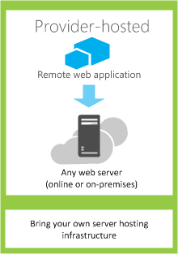

# Escolha os padrões para desenvolver e hospedar o Add-in do SharePoint
Saiba mais sobre as diferentes maneiras que você pode hospedar os componentes de Suplementos do SharePoint.
O modelo de suplemento SharePoint 2013 apresenta uma ampla gama de padrões de hospedagem e desenvolvimento. Alguns desses padrões podem ser usado em combinação com umas às outras. Por exemplo, seus suplementos podem misturar componentes hospedado no SharePoint e hospedados remotamente. O modo mais útil para determinar quais padrões que você vai querer usar deve começar com seus próprios requisitos, tecnologias e as metas e compare-os com as opções e possibilidades que estão habilitadas por Suplementos do SharePoint.
  
    
    

## O que deve ser levados ao escolher o padrão de desenvolvimento

Suplementos do SharePoint ampliar o intervalo de linguagens de programação possíveis e pilhas de tecnologia que podem ser usados quando você trabalha com serviços e recursos do SharePoint. O intervalo preciso das opções depende tanto o tipo de suplemento como o padrão de hospedagem que você escolher. Também é possível misturar padrões.
  
    
    

### Hospedado no SharePoint suplementos

Comece com a opção mais simples: hospedado no SharePoint suplementos ou suplementos onde a todos os componentes estiverem hospedados em um localmente ou Office 365 o farm do SharePoint. Hospedado no SharePoint suplementos são instalados em um site SharePoint 2013, denominado web host. Eles têm seus recursos hospedados em um subsite isolado de um web host, chamado o suplemento de web. É importante saber  [a diferença entre webs de host e o suplemento webs](host-webs-add-in-webs-and-sharepoint-components-in-sharepoint-2013.md). A Figura 1 ilustra a arquitetura básica de um suplemento hospedado no SharePoint.
  
    
    

**Figura 1. Hospedado no SharePoint suplemento arquitetura**

  
    
    

  
    
    

  
    
    
Você pode combinar um suplemento de hospedado no SharePoint com suplementos que têm hospedados remotamente o componentes, mas qualquer suplemento ou parte de um suplemento que é executado em um suplemento de web tem o seguinte conjunto de requisitos para três componentes principais: onde o suplemento está hospedado, como o suplemento obtém autorização e quais idiomas que pode ser usado.
  
    
    

|**Componente**|**Hospedado no SharePoint suplemento requisito**|
|:-----|:-----|
|Onde os componentes do suplemento são hospedados   |O domínio isolado suplemento do seu farm do SharePoint   |
|Como o suplemento obtém autorizado   |Os privilégios do usuário conectado   |
|Quais idiomas o suplemento podem usar   |JavaScript (com a biblioteca JSOM SharePoint 2013 ) + HTML   |
   
Esse padrão é o mais fácil de implantar e você pode usar o  [Criar um básico hospedado no SharePoint suplemento usando ferramentas de desenvolvimento do Napa Office 365](create-a-basic-sharepoint-hosted-add-in-by-using-napa-office-365-development-too.md). Você vai querer considerar o seguinte antes de decidir criar um suplemento hospedado no SharePoint.
  
    
    

|**Obter esses benefícios**|**Mas considere esse**|
|:-----|:-----|
|Reutilize os itens comuns do SharePoint, como listas e Web Parts.   |Você pode usar JavaScript no suplemento — não é possível usar qualquer código do lado do servidor.   |
|Relativamente fácil criar e implantar, portanto são bons para equipes pequenas automação, com regras de negócios mais baixos complexidade de processos de negócios e suplementos de produtividade.   |O add-in tem apenas os privilégios de autorização do usuário conectado.   |
   
 [Introdução à criação de Suplementos do SharePoint hospedados no SharePoint](get-started-creating-sharepoint-hosted-sharepoint-add-ins.md)
  
    
    

### Hospedado em provedor suplementos

Hospedado em provedor Suplementos do SharePoint incluem os componentes que são implantados e hospedados fora do farm do SharePoint. Eles são instalados na Web de host, mas seus componentes remotos estiverem hospedados em outro servidor  *que não deve ser um servidor no farm do SharePoint*  . A Figura 2 ilustra a arquitetura básica de um suplemento hospedado pelo provedor.
  
    
    

**Figura 2. Hospedado em provedor suplemento arquitetura**

  
    
    

  
    
    

  
    
    
A tabela a seguir mostra como os requisitos para o local de hospedagem, autorização de suplemento e idiomas muito menos corrigidos hospedado em provedor para suplementos do que eles são para hospedado no SharePoint suplementos.
  
    
    

|**Componente**|**Hospedado em provedor requisito de suplemento**|
|:-----|:-----|
|Onde os componentes do suplemento são hospedados   |Qualquer servidor web ou o serviço de hospedagem   |
|Como o suplemento obtém autorizado   |OAuth ou a biblioteca do JavaScript entre domínios   |
|Quais idiomas o suplemento podem usar   |Qualquer idioma suportado pelo seu servidor web ou o serviço de hospedagem   |
   
Um suplemento hospedado em provedor interage com um site do SharePoint, mas também usa recursos e serviços que estão localizados no site remoto. Você vai querer considerar o seguinte antes de decidir criar um suplemento hospedado pelo provedor.
  
    
    

|**Obter esses benefícios**|**Mas considere esse**|
|:-----|:-----|
|Hospede o suplemento em Microsoft Azure ou qualquer plataforma web remoto, incluindo as plataformas de não-Microsoft.   |Você é responsável por criar a lógica de instalação, atualização e desinstalação dos componentes remotos.   |
|Use um dos modelos de objeto do cliente do SharePoint, a biblioteca de domínio cruzado JavaScript ou SharePoint 2013 [serviço da web baseado em REST/OData](http://msdn.microsoft.com/magazine/dn198245.aspx) interagir com o SharePoint.   |Cada forma de interação com o SharePoint tem  [opções correspondentes para abordagens para acesso a dados](secure-data-access-and-client-object-models-for-sharepoint-add-ins.md).   |
|Ganho autorização aos dados do SharePoint usando um dos  [três autorização sistemas](three-authorization-systems-for-sharepoint-add-ins.md).   |Você precisará decidir entre o OAuth e a biblioteca de domínio cruzado para autorizar o access do suplemento no SharePoint.   |
   

## Corresponde ao seu padrão de hospedagem com seus objetivos de desenvolvimento

Além das considerando as vantagens técnicas e restrições de cada opção, você também precisará pensar seus objetivos de desenvolvimento ao decidir em um padrão de hospedagem. Você pode usar a tabela a seguir para ajudar a classificar qual padrão de hospedagem melhor atenda às suas necessidades.
  
    
    

|**Seus requisitos**|**Padrão de hospedagem recomendado**|**Exemplo**|
|:-----|:-----|:-----|
|Trabalhar com e provisionar novas entidades SharePoint exclusivamente   |SharePoint-hosted   |Um suplemento que inclui um controle de selecionador de pessoas e que armazena informações sobre os usuários do SharePoint em uma lista do SharePoint   |
|Use as entidades do SharePoint existentes e interagir com externo (não SharePoint) serviços da web   |Hospedado pelo provedor   |Um suplemento que obtém os endereços dos clientes de uma lista do SharePoint existente na web host e usa um serviço de mapeamento de um aplicativo web para exibir seus locais   |
|Provisionar novas entidades do SharePoint e interagir com os serviços web externos   |Hospedado no SharePoint e hospedado em provedor combinados   |Um suplemento do mapeamento provisiona um SharePoint lista no appweb para que ele possa armazenar as coordenadas de latitude e longitude para endereços que são fornecidos pelo usuário ou extraídas de uma lista existente do SharePoint   |
   

## O que deve ser levados ao escolher seus padrões de hospedagem para hospedado em provedor suplementos

Suplementos hospedado no SharePoint tem um padrão de hospedagem fixo, desde que eles sejam hospedados na web add-in. Hospedado em provedor suplementos oferecem mais flexibilidade para hospedar os diversos componentes de seu suplemento, portanto, se você optar por criar um, você precisará corresponder seus objetivos e requisitos para o padrão de hospedagem apropriado.
  
    
    

### OAuth ou a biblioteca de entre domínios

Uma das perguntas mais importantes que você precise solicitar ao considerar hospedado em provedor add-ins e como irá criá-los é como o suplemento obterá autorização para interagir com o SharePoint. Hospedado em provedor suplementos lhe oferece duas opções: a biblioteca do JavaScript entre domínios e OAuth.
  
    
    
A  [biblioteca entre domínios](access-sharepoint-2013-data-from-add-ins-using-the-cross-domain-library.md) permite interagir com mais de um domínio, os componentes remotos do seu suplemento através de um proxy. Se o código do lado do cliente e as permissões de um usuário que está conectado ao SharePoint são suficientes, a biblioteca de domínio cruzado é uma boa opção. Biblioteca do domínio cruzado também é conveniente sempre que você está fazendo chamadas remotas por meio do firewall.
  
    
    
OAuth é um protocolo aberto para autorização que permite a autorização de segurança de aplicativos de cliente (área de trabalho, web e aplicativos móveis) de uma forma facilmente gerenciável. Se você planeja criar um Add-in do SharePoint que é executado em um aplicativo web remoto e comunica novamente ao SharePoint 2013, geralmente você precisará usar OAuth. OAuth é necessário sempre que você está chamando em SharePoint de um aplicativo web remotamente hospedado que não é possível usar o código do lado do cliente (HTML + JavaScript ) exclusivamente.  [Saiba mais sobre como o OAuth funciona no SharePoint Add-ins.](creating-sharepoint-add-ins-that-use-low-trust-authorization.md)
  
    
    
 [Seguro cliente e o acesso a dados modelos de objeto para o SharePoint Add-ins](secure-data-access-and-client-object-models-for-sharepoint-add-ins.md) e [Três sistemas de autorização para o SharePoint Add-ins](three-authorization-systems-for-sharepoint-add-ins.md) explicam a escolha entre OAuth e a biblioteca de domínio cruzado mais detalhadamente.
  
    
    

### OAuth com farms do SharePoint local

Se você estiver usando uma implantação local do SharePoint 2013, você pode usar OAuth, mas você terá que escolher entre a criação de suplementos de alta confiança e usando um inquilino Office 365. Office 365 usa Microsoft Azure serviço de controle de acesso (ACS) como o agente de confiança e se você não tem acesso para um inquilino Office 365, você precisará usar  [Criar o SharePoint de alta confiança Add-ins](create-high-trust-sharepoint-add-ins.md), que utiliza certificados para estabelecer confiança entre o suplemento e o SharePoint. Você pode adicionar os suplementos de alta confiança para o catálogo de suplemento do seu farm do SharePoint, mas não pode vendê-los no Office Store. Se você tiver acesso a um inquilino Office 365, você pode vinculá-lo à sua instalação local do SharePoint 2013 e  [usar o ACS como o agente de confiabilidade para suplementos que são instalados para o SharePoint local](use-an-office-365-sharepoint-site-to-authorize-provider-hosted-add-ins-on-an-on.md).
  
    
    
A tabela a seguir lista todos os padrões de possíveis para hospedar os componentes do SharePoint e os componentes remotos do seu suplemento, juntamente com os agentes de confiança que estão disponíveis para você, se você estiver usando OAuth. Observe que você precisará ter acesso a um locatário Office 365 para usar o ACS para estabelecer confiança entre o SharePoint e Suplemento do SharePoint que está instalado em uma instalação local do SharePoint 2013.
  
    
    

|**Local do componente do SharePoint**|**Local do componente remoto**|**Confiar broker**|
|:-----|:-----|:-----|
|No local   |Na nuvem   |ACS, o certificado   |
|No local   |No local   |ACS, o certificado   |
|Office 365 Site do SharePoint   |Na nuvem   |ACS   |
|Office 365 Site do SharePoint   |No local   |ACS   |
   

## Combinar o provedor de hospedagem e hospedagem do SharePoint

Você também pode criar suplementos que incluem componentes hospedado no SharePoint tanto hospedado em nuvem. Por exemplo, você pode criar um  [hospedado em nuvem suplemento que inclui uma lista personalizada do SharePoint e o tipo de conteúdo](create-a-provider-hosted-add-in-that-includes-a-custom-sharepoint-list-and-conte.md). Se você optar por usar essa arquitetura, o design e a abordagem devem considerar as limitações de segurança que são embutidas no modelo. Você pode usar JavaScript nos componentes de código que estão hospedados pelo SharePoint e os componentes remotamente hospedados devem usar OAuth ou a biblioteca entre domínios para interagir com o site do SharePoint. Ao considerar essa abordagem, certifique-se de que entendeu como  [suplemento autorização funciona no SharePoint 2013](authorization-and-authentication-of-sharepoint-add-ins.md). Figura 4 mostra como essa arquitetura funciona se você usar Microsoft Azure para hospedar os componentes remotos do seu suplemento, e você usar OAuth.
  
    
    

**Figura 4. Suplemento de servidor-para-servidor comunicação com o SharePoint quando você usa OAuth e Windows Azure**

  
    
    

  
    
    

  
    
    
 [Saiba como criar um suplemento que combina a hospedagem em nuvem e hospedagem do SharePoint.](create-a-provider-hosted-add-in-that-includes-a-custom-sharepoint-list-and-conte.md)
  
    
    
Aqui estão algumas coisas a considerar quando você está considerando uma combinação do provedor de hospedagem e hospedagem do SharePoint.
  
    
    

|**Obter esses benefícios**|**Mas considere esse**|
|:-----|:-----|
|Todos os benefícios das duas abordagens.   |A arquitetura mais complexa requer um planejamento cuidadoso em torno de comunicação de servidor-para-servidor e restrições de scripts entre sites.   |
   

## Hospedado em provedor suplementos nas funções de Web do Windows Azure

Você pode hospedar um hospedado em provedor Suplemento do SharePoint em uma função de web Microsoft Azure em vez de um aplicativo web (se o aplicativo web é local ou um Azure Web Site ). Uma função da web Azure é, basicamente, um site que tem com base em serviços de informações da Internet (IIS) e hospedados em Azure. Você pode tirar vantagem dos serviços de hospedagem e da escalabilidade dos Azure funções da web. Você também pode aprimorar o desempenho e a usabilidade do seu Suplemento do SharePoint, especialmente se o add-in está sendo intensamente usado ou demanda para ele altera ao longo do tempo. Se o Suplemento do SharePoint nunca exige mais recursos de servidor, Azure dinamicamente pode alocá-los para o suplemento.
  
    
    
Consulte os seguintes links para obter mais informações sobre as funções de Azure web.
  
    
    

-  [o que é um serviço em nuvem?](http://www.windowsazure.com/en-us/manage/services/cloud-services/what-is-a-cloud-service/)
    
  
-  [Apresentando o Microsoft Azure](http://www.windowsazure.com/en-us/develop/net/fundamentals/intro-to-windows-azure/)
    
  
-  [AutoScaling e Microsoft Azure](http://msdn.microsoft.com/en-us/library/hh680945%28v=pandp.50%29.aspx)
    
  
Como um pré-requisito, você precisará do Microsoft Azure SDK para .NET (VS 2012) 1.8.1, que pode ser instalado usando o  [Web Platform Installer](http://www.microsoft.com/web/downloads/platform.aspx).
  
    
    
A maneira que você usa criar o projeto no vsnv depende se você iniciar com um projeto do SharePoint Add-in e, em seguida, adicione o projeto de função do Azure web ou inicie com o Azure projeto e, em seguida, adicione o projeto do SharePoint.
  
    
    

### Adicionar um serviço de nuvem para um suplemento existente

Se você já tiver um provedor hospedado Suplemento do SharePoint que você deseja hospedar em Azure, escolha o projeto de aplicativo web na solução para o SharePoint Add-in. Na barra de menus, escolha o **projeto**, **Adicione a projeto de serviço do Microsoft Azure nuvem**. Um projeto Azure, chamado  _NameOfTheWebAppProject_. Azure, é adicionado à solução para sua Suplemento do SharePoint. Uma função da web para o projeto da web também é adicionada ao projeto para o serviço de nuvem Azure. O Office Developer Tools para Visual Studio 2012 define as propriedades de projeto necessárias para que a função web pode trabalhar com o Suplemento do SharePoint.
  
    
    

### Adicionar um suplemento a uma função web existente

Se você já tiver uma função web em um serviço de nuvem Azure que você deseja usar como um host para um provedor hospedado Suplemento do SharePoint, abrir o projeto de nuvem Azure no Visual Studio e, no **Solution Explorer**, escolha o projeto de função web. Na barra de menus, escolha **Project**, **o suplemento Add para o projeto do SharePoint**. Um projeto para um provedor hospedado Suplemento do SharePoint é criado, chamado  _NameOfTheWebAppProject_. Windows Azure e adicionado à solução. Visual Studio referencia a função de web Azure como o host do project web para o Suplemento do SharePoint.
  
    
    

## Recursos adicionais

Para obter mais informações, consulte os seguintes recursos:
  
    
    

-  [Aspectos importantes do Add-in SharePoint arquitetura e desenvolvimento cenário](important-aspects-of-the-sharepoint-add-in-architecture-and-development-landscap.md)
    
  
-  [Suplementos do SharePoint](sharepoint-add-ins.md)
    
  
-  [Host webs, suplemento webs e componentes do SharePoint no SharePoint 2013](host-webs-add-in-webs-and-sharepoint-components-in-sharepoint-2013.md)
    
  
-  [Autorização e autenticação do SharePoint Add-ins](authorization-and-authentication-of-sharepoint-add-ins.md)
    
  
-  [Fluxo do OAuth Token de contexto para o SharePoint Add-ins](context-token-oauth-flow-for-sharepoint-add-ins.md)
    
  
-  [Usar um site do SharePoint do Office 365 para autorizar hospedado no provedor suplementos em um site do SharePoint local](use-an-office-365-sharepoint-site-to-authorize-provider-hosted-add-ins-on-an-on.md)
    
  
-  [Suplementos do SharePoint em comparação com soluções do SharePoint](http://msdn.microsoft.com/library/0e9efadb-aaf2-4c0d-afd5-d6cf25c4e7a8%28Office.15%29.aspx)
    
  
-  [Introdução à criação de suplementos do SharePoint hospedados pelo provedor](get-started-creating-provider-hosted-sharepoint-add-ins.md)
    
  
-  [Introdução à criação de Suplementos do SharePoint hospedados no SharePoint](get-started-creating-sharepoint-hosted-sharepoint-add-ins.md)
    
  
-  [Criar um provedor hospedado suplemento que inclui uma lista personalizada do SharePoint e o tipo de conteúdo](create-a-provider-hosted-add-in-that-includes-a-custom-sharepoint-list-and-conte.md)
    
  

