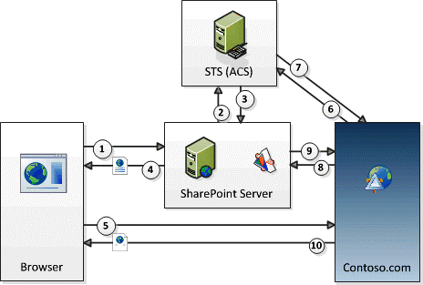

# Fluxo do OAuth Token de contexto para o SharePoint Add-ins
Saiba mais sobre o fluxo de autenticação e autorização do OAuth para baixa confiança, hospedado em provedor suplementos no SharePoint.
## Obtenha uma visão geral do OAuth e SharePoint hospedado em provedor Suplementos do SharePoint

Em SharePoint, **a autorização e autenticação OAuth fluem para uma provedor hospedado, baixa confiança, suplemento envolve uma série de interações entre o add-in, SharePoint, o servidor de autorização e o navegador** em tempo de execução. Neste cenário, o servidor de autorização é Microsoft Azure Access Control Service (ACS).
  
    
    
Com um provedor hospedado suplemento, você tem um aplicativo da web remoto ou o serviço que é separada da SharePoint e não fazem parte do aluguel SharePoint farm ou SharePoint Online. Podem ser hospedado na nuvem ou em um servidor no local. Neste artigo, o componente remoto é chamado Contoso.com.
  
    
    

> **OBSERVAçãO**
> O componente remoto também pode hospedar os receptores de evento que respondam a eventos que ocorrem para itens de SharePoint, listas ou itens de lista. Exemplos de eventos remotos que Contoso.com talvez queira responder são eventos de lista, adicionar ou remover um item de lista; ou eventos, como a adição ou exclusão de um site da web. Para obter mais informações sobre como criar os receptores de evento remoto, consulte  [Criar um receptor de evento remoto no SharePoint Add-ins](create-a-remote-event-receiver-in-sharepoint-add-ins.md).
  
    
    

Contoso.com usa o modelo de objeto de cliente (CSOM) SharePoint ou SharePoint APIs REST para fazer chamadas para SharePoint. O aplicativo de Contoso.com usa um fluxo de passagem de token OAuth para autenticar com SharePoint. **SharePoint e Contoso.com não confiem uns nos outros; mas ambos confiam no ACS** e aceitará tokens emitidos pelo ACS. Há três tokens envolvidos: SharePoint tem ACS criar um token de contexto que SharePoint encaminha para Constoso.com. Contoso.com valida se o token de contexto foi emitido por ACS, de modo que ele confie. Em seguida, contoso.com extrai um token de atualização do token de contexto e o utiliza para obter um acesso token diretamente do ACS. Ele inclui o token de acesso em todas as suas solicitações para SharePoint. SharePoint valida se o token de acesso foi emitido pelo ACS, portanto, ela responde a solicitações de Contoso.com.
  
    
    
 **Você forneça o código de tratamento de token** no componente remoto. (Mas, se o componente remoto é hospedado em .NET, o Microsoft Office Developer Tools for Visual Studio fornecem exemplos de código que faz a maioria do trabalho por você.) Para obter detalhes sobre o código de tratamento de token, consulte [Lidar com tokens de segurança no hospedado em provedor baixa confiança SharePoint suplementos](handle-security-tokens-in-provider-hosted-low-trust-sharepoint-add-ins.md).
  
    
    

## Concluir os pré-requisitos para usar o fluxo

Há algumas etapas preliminares que devem ser feitas antes de um Suplemento do SharePoint pode usar o fluxo de Token de contexto.
  
    
    

- Se o Suplemento do SharePoint deve ser instalado em um farm no local SharePoint, existem requisitos de configuração que não se aplicam se ele é instalado apenas para SharePoint Online:
    
  - O **farm deve ser configurado** para dar suporte a suplementos (Isso é realmente um requisito para instalação de qualquer Suplementos do SharePoint ao farm, mesmo que eles não usam o fluxo de Token de contexto.) Para obter mais informações, consulte [Configurar um ambiente SharePoint Add-ins](http://technet.microsoft.com/en-us/library/fp161236%28v=office.15%29.aspx).
    
  
  - O **cliente** que estiver instalando o suplemento **deve ter uma conta de Office 365**. Isso é necessário para obter acesso ao ACS. O cliente não precisará usar sua conta para qualquer outro fim.
    
  
  - O farm deve ser configurado para compartilhar a relação de confiança que Office 365 tem com o ACS. Isso é feito facilmente com scripts de Windows PowerShell. Para obter detalhes, consulte  [Usar um site do SharePoint do Office 365 para autorizar hospedado no provedor suplementos em um site do SharePoint local](use-an-office-365-sharepoint-site-to-authorize-provider-hosted-add-ins-on-an-on.md).
    
  
- Independentemente de se o suplemento está instalado para SharePoint Online ou a um farm no local SharePoint, o **Suplemento do SharePoint devem ser registrados com o ACS**. Para obter detalhes sobre como isso pode ser feito, consulte [Registrar o SharePoint 2013 de suplementos](register-sharepoint-add-ins-2013.md). Entre outras coisas, o suplemento fornece ACS com sua ID de cliente e segredo do cliente como parte do registro.
    
  

## Consulte as etapas no fluxo de Token de contexto

O fluxo de autenticação e autorização do OAuth para um SharePoint hospedado em provedor suplemento é mostrado na figura a seguir.
  
    
    

**Fluxo de Token de contexto do OAuth**

  
    
    

  
    
    

  
    
    
Estas são as etapas que correspondem aos números na Figura:
  
    
    

  
    
    

1. Um usuário inicia o Suplemento do SharePoint do SharePoint. O projeto de suplemento determina como isso é feito:
    
  - Se o suplemento é projetado para representar o aplicativo web remoto (em Contoso.com) em uma parte do suplemento (que é essencialmente um wrapper em torno de um **IFRAME**), em seguida, lançar o suplemento simplesmente significa navegando para uma página de SharePoint que contém a parte do suplemento. (Se o usuário não está conectado já, SharePoint solicita ao usuário fazer logon.) SharePoint processa a página e detecta que não há um componente do aplicativo na página de Contoso.com. (Para obter detalhes sobre o suplemento partes, consulte  [Criar partes do suplemento para instalar com o SharePoint Add-in](create-add-in-parts-to-install-with-your-sharepoint-add-in.md).)
    
  
  - Se o suplemento foi desenvolvido para usar como uma página completa no navegador, em seguida, o usuário inicia-la clicando no seu suplemento blocos na página de **Site Contents**SharePoint do site. (Uma variação disso é quando o suplemento inclui um item de menu ou da faixa de opções personalizado que inicia o componente remoto.)
    
  
2. Independentemente de como o suplemento é iniciado, SharePoint deve obter um token de contexto que podem enviar para o aplicativo de Contoso.com, para que ele solicita o ACS para criar um token de contexto que contém informações sobre o contexto de SharePoint, incluindo o usuário atual, a URL do aplicativo remoto e outras informações. O token de contexto também contém um token criptografado refresh.
    
  
3. ACS desconecta o token de contexto, com um algoritmo que usa o segredo do suplemento do Contoso.com e retorna para SharePoint. Apenas ACS e o suplemento Contoso.com sabem o segredo.
    
  
4. Se o aplicativo de Contoso.com é exibido na parte suplemento, SharePoint renderiza a página parte hosts o suplemento e adiciona o token de contexto para a URL que o **IFRAME** na parte suplemento chama obter seu conteúdo. Se o aplicativo de Contoso.com página inteira, SharePoint redireciona o navegador para Constoso.com e inclui o token de contexto como parte da resposta redirecionar.
    
  
5. O token de contexto está incluído na solicitação do navegador que será enviada para o servidor de Contoso.com.
    
  
6. O servidor de Contoso.com obtém o token de contexto e valida a assinatura que pode ser feito porque ele conhece o segredo do cliente. Isso garante Contoso.com que o token foi emitido pelo ACS e não um impostor simulando a ser SharePoint. Extrai o token de atualização do token de contexto de contoso.com e enviá-la, junto com outras informações incluindo o seu ID de cliente e o segredo do cliente, para o ACS em uma solicitação para um token de acesso que permitirá que ele acesse SharePoint,
    
  
7. ACS valida o token de atualização para que ele é certeza de que ele emitiu o token e, em seguida, ele retorna um token de acesso para Contoso.com. Opcionalmente, Contoso.com pode armazenar em cache este token de acesso para que ele não tenha perguntar ACS para um token de acesso toda vez que ele acessa SharePoint. Por padrão, o tokens de acesso são adequados para algumas horas por vez. (Quando este artigo foi escrito, a expiração de padrão para os tokens de acesso do ACS emitidos para SharePoint foi 12 horas, mas que podem ser alteradas.) Cada token de acesso é específico para a conta de usuário que é especificada na solicitação original para autorização e concede acesso somente ao serviço (no caso, SharePoint ) que é especificado na solicitação. Tokens de atualização são mais longas têm vida (seis meses quando este artigo foi escrito) e também podem ser armazenados em cache. Portanto, o mesmo token de atualização pode ser trocado por um novo token de acesso do ACS até que o token de atualização propriamente dito expire. (Para obter mais informações sobre tokens de cache, consulte  [Lidar com tokens de segurança no hospedado em provedor baixa confiança SharePoint suplementos](handle-security-tokens-in-provider-hosted-low-trust-sharepoint-add-ins.md).) Quando o token de atualização expira, o Contoso.com pode obter um novo obtendo um novo token de contexto. Para obter detalhes sobre como fazer isso, consulte  [Obter um novo token de contexto](handle-security-tokens-in-provider-hosted-low-trust-sharepoint-add-ins.md#GetNewContextToken).
    
  
8. Contoso.com usa o token de acesso para fazer uma chamada de API REST de SharePoint ou uma solicitação CSOM para spnv. Ele faz isso passando o token de acesso OAuth no cabeçalho HTTP **Authorization**. (Código de exemplo para criar o cabeçalho é fornecido o Office Developer Tools for Visual Studio se o componente remoto estiver hospedado em uma plataforma do .NET.
    
  
9. SharePoint valida o token de acesso para que ele é garantido que o token foi emitido pelo ACS. Em seguida, envia os dados desse Contoso.com solicitado para Contoso.com ou executa a criar, ler, atualizar ou excluir operação (CRUD) que solicitou Contoso.com.
    
  
10. A página de aplicativo de Contoso.com processa no navegador (ou o **IFRAME** da parte suplemento).
    
  

## Recursos adicionais

-  [Autorização e autenticação do SharePoint Add-ins](authorization-and-authentication-of-sharepoint-add-ins.md)
    
  
-  [Suplemento permissões no SharePoint 2013](add-in-permissions-in-sharepoint-2013.md)
    
  
-  [Aspectos importantes do Add-in SharePoint arquitetura e desenvolvimento cenário](important-aspects-of-the-sharepoint-add-in-architecture-and-development-landscap.md)
    
  
-  [Introdução à criação de Suplementos do SharePoint hospedados no SharePoint](get-started-creating-sharepoint-hosted-sharepoint-add-ins.md)
    
  

