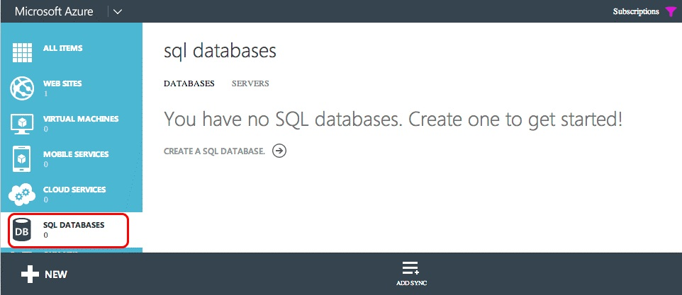
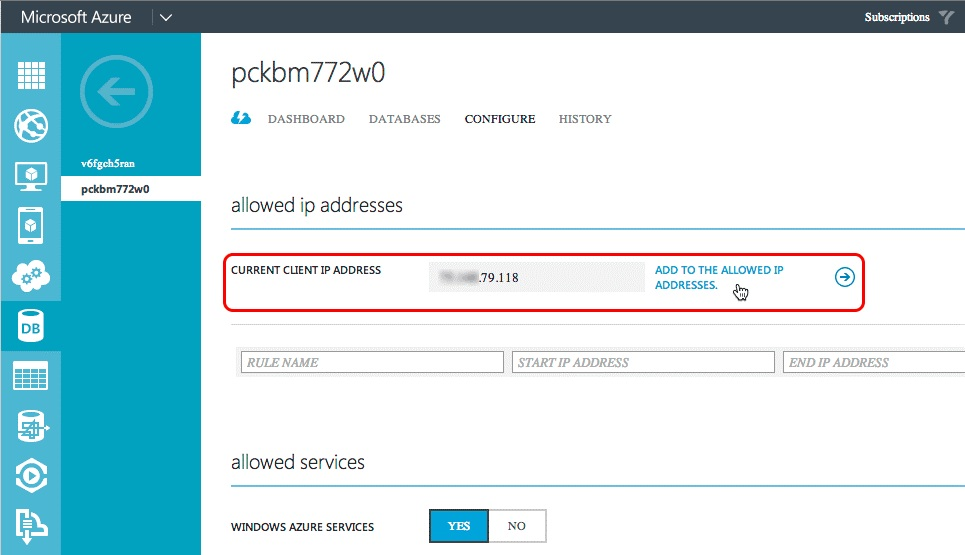
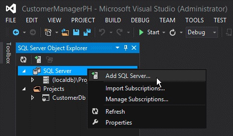
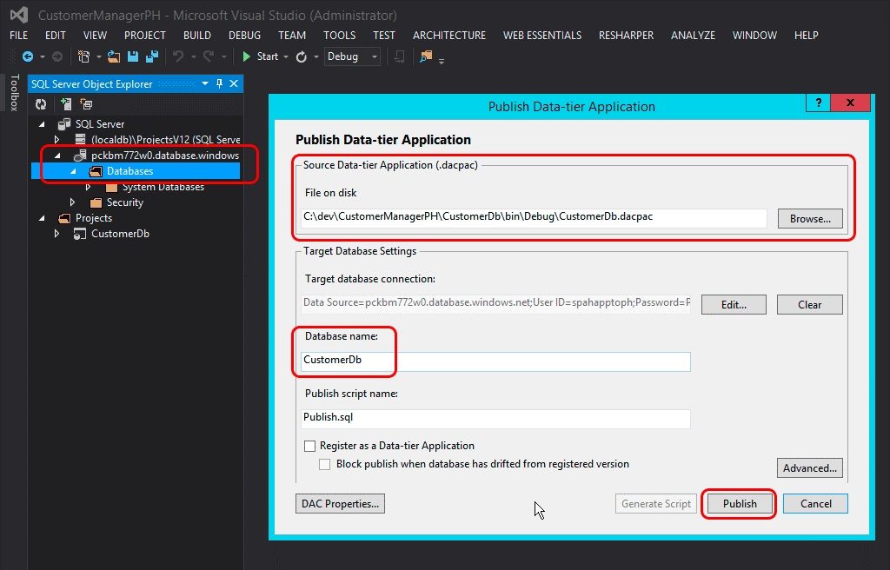
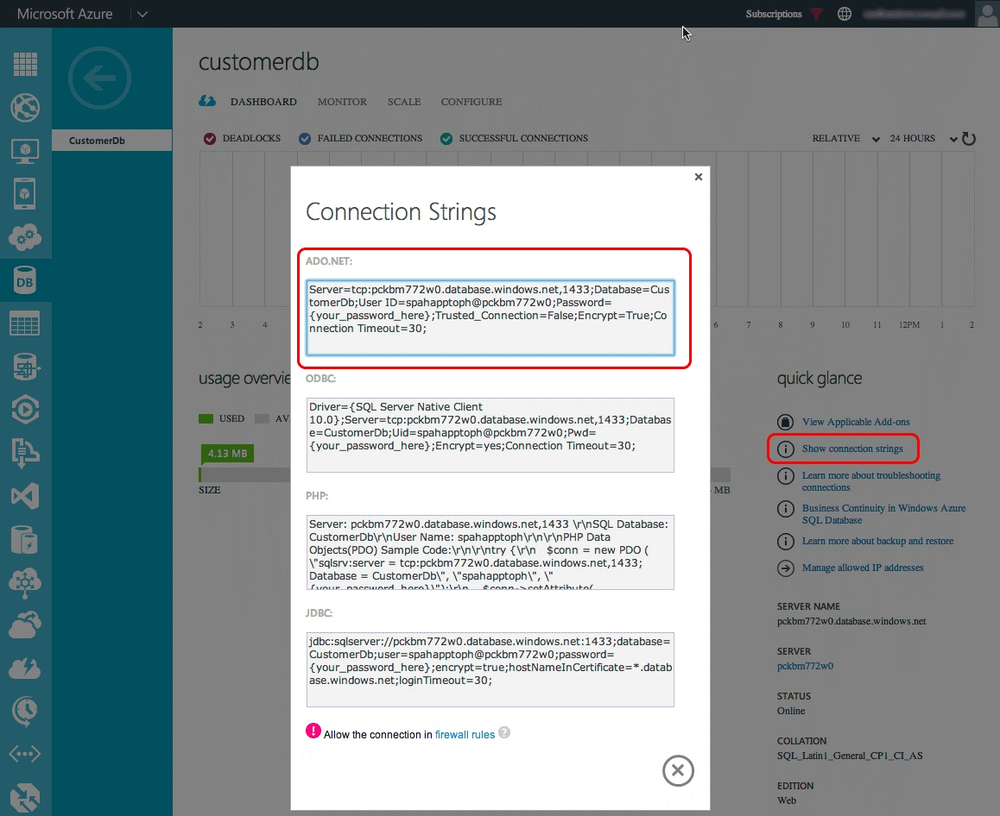
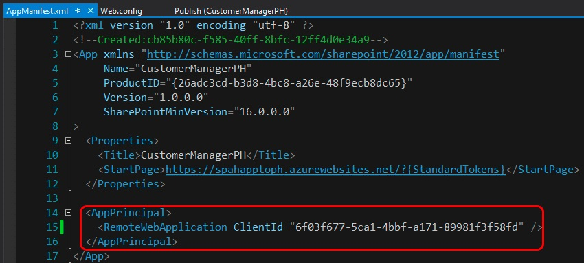

# Converter um auto-hospedados Add-in do SharePoint em um suplemento hospedado em provedor
Saiba como converter um auto-hospedados Suplemento do SharePoint em um suplemento hospedado pelo provedor.
Microsoft SharePoint 2013 introduzida uma nova abordagem estendendo além a abordagem anterior do uso de personalizações baseadas na solução de sites do SharePoint. Esse novo modelo de extensibilidade para o SharePoint, chamado o modelo de suplemento, permite que os desenvolvedores criem implementações personalizadas que podem ser implantadas em ambientes do SharePoint independentemente se estão sendo executados em um local, SharePoint Online ou implantação híbrida.
  
    
    

Os desenvolvedores podem criar dois tipos diferentes de SharePoint suplementos. O primeiro tipo, um hospedado no SharePoint suplemento, principalmente executa no navegador. e todos os ativos que ofereça suporte a ele, como HTML, CSS, imagens e JavaScript são armazenados e atendidos pelo SharePoint. Os outros tipos de suplementos encaixam o modelo do suplemento do nuvem (CÂMERA) e principalmente execute externos para o SharePoint em outro servidor e se comunicar com o SharePoint usando o modelo de objeto do cliente (CSOM) e a API REST. Eles estabelecem uma identidade usando o protocolo de OAuth 2.0 popular suportado pelo SharePoint 2013.
Os desenvolvedores poderia implementar suplementos usando o modelo de suplemento de uma das duas maneiras, como um suplemento de hospedado em provedor ou um auto-hospedados suplemento auto-hospedados suplementos foram lançados como um programa de visualização quando lançadas do SharePoint 2013, mas em maio de 2014 Microsoft anunciou que eles seriam possível fechar o programa de visualização e não são mais seriam compatíveis criando auto-hospedados suplementos. Para o comunicado, consulte  [Update em suplementos auto-hospedados Preview Program](http://blogs.office.com/2014/05/16/update-on-autohosted-apps-preview-program/).
  
    
    

Este artigo explica como converter e migrar um suplemento auto-hospedado para um suplemento hospedado pelo provedor. No entanto, é importante que os desenvolvedores compreender algumas diferenças específicas entre as duas abordagens porque esse conhecimento simplifica bastante o processo de conversão.
## Pré-requisitos para converter um suplemento auto-hospedados em um suplemento hospedado em provedor

- Todos os  [pré-requisitos para desenvolver hospedado em provedor suplementos](get-started-creating-provider-hosted-sharepoint-add-ins.md#SP15createselfhostapp_bk_prereq).
    
  
- V 2.3 do SDK do Windows Azure. Instalá-lo a partir de aqui  [nesta página do Centro de Download](http://azure.microsoft.com/downloads).
    
  

### Principais conceitos saber

Antes de converter um suplemento auto-hospedados em um suplemento hospedado em provedor, você deve ter uma compreensão básica de Suplementos do SharePoint e as diferenças entre hospedado no SharePoint, hospedado em provedor e auto-hospedados Suplementos do SharePoint. Os artigos listados na tabela 1 devem fornecer esse entendimento.
  
    
    

**Tabela 1. Principais conceitos para converter um suplemento auto-hospedados em um suplemento hospedado em provedor**

|**Título do artigo**|**Descrição**|
|:-----|:-----|
| [Suplementos do SharePoint](sharepoint-add-ins.md)   |Saiba mais sobre o novo modelo suplemento em SharePoint 2013 que permite que você crie suplementos, que são pequenas e fácil de usar soluções para usuários finais.   |
| [Aspectos importantes do Add-in SharePoint arquitetura e desenvolvimento cenário](important-aspects-of-the-sharepoint-add-in-architecture-and-development-landscap.md)   |Saiba mais sobre os aspectos da arquitetura da Suplementos do SharePoint e o modelo de Suplementos do SharePoint, incluindo as opções de hospedagem suplemento opções (UI) da interface do usuário, sistema de implantação, sistema de segurança e ciclo de vida.   |
| [Escolha os padrões para desenvolver e hospedar o Add-in do SharePoint](choose-patterns-for-developing-and-hosting-your-sharepoint-add-in.md)   |Saiba mais sobre as várias maneiras que você pode hospedar Suplementos do SharePoint.   |
| [Host webs, suplemento webs e componentes do SharePoint no SharePoint 2013](host-webs-add-in-webs-and-sharepoint-components-in-sharepoint-2013.md)   |Saiba mais sobre a distinção entre webs de host e o suplemento webs. Também Descubra quais componentes do SharePoint 2013 podem ser incluídos em um SharePoint Add-in, que são implantados na Web de host, que são implantados na Web de suplemento e como o suplemento web é implantada em um domínio isolado.   |
   

## Convertendo o suplemento

Convertendo um auto-hospedados Suplemento do SharePoint para um suplemento hospedado em provedor envolve a modificação de dois ou três componentes.
  
    
    

- O suplemento do SharePoint em si
    
  
- O aplicativo da web remoto ou os serviços
    
  
- O Banco de Dados SQL do Microsoft Azure, se houver, do add-in
    
  
Um suplemento de auto-hospedados SharePoint implantado ao Azure Web Site e Banco de Dados SQL do Microsoft Azure automaticamente quando ele foi instalado, no entanto, hospedado em provedor suplementos podem ter seus aplicativos web remoto e outros serviços existirem em qualquer plataforma da web. Este artigo pressupõe que os componentes de remota suplemento auto-hospedados vai ser permaneçam como após a conversão para um suplemento hospedado em provedor de serviços do Azure.
  
    
    
As seções a seguir orientam durante o processo de conversão de um suplemento auto-hospedado para um suplemento hospedado pelo provedor. O exemplo auto-hospedados suplemento usado - gerente de atendimento ao cliente - é simples, para enfatizar as etapas de conversão e não o real suplemento. Ele consiste em três projetos:
  
    
    

- CustomersDb: Um projeto de banco de dados SQL que irá gerar o *.dacpac necessárias. Observação lá é sem esquema definida neste projeto. Ele simplesmente é usado para criar um banco de dados, como o esquema é criado pelo aplicativo web do ASP.NET.
    
  
- CustomerManagerAH: Um SharePoint auto-hospedados suplemento que está configurado para incluir o projeto de aplicativo de web do ASP.NET e o aplicativo de camada de dados do SQL Azure no SharePoint suplemento pacote resultante.
    
  
- CustomerManagerAHWeb: Um aplicativo de web ASP.NET MVC que usa a entidade Framework Code First com abordagem migrações para criar o esquema de banco de dados como leitura e gravação para o banco de dados.
    
  
O suplemento é um aplicativo web ASP.NET MVC que ambos pode mostrar os clientes de uma tabela em um Banco de Dados SQL do Microsoft Azure bem como adicionar novos clientes. Este é um aplicativo web anônimo que permitirá que qualquer pessoa exibir ou adicionar os clientes. A solução do Visual Studio para o suplemento auto-hospedados e projetos associados pode ser baixada do repositório público seguinte:  [Auto-hospedados-migração de códigos de exemplo](https://github.com/OfficeDev/Auto-Hosted-Migration-Code-Samples).
  
    
    
Convertendo um suplemento de auto-hospedados SharePoint 2013 para um suplemento hospedado em provedor envolve diversas etapas. Cada uma é descrita nas seções a seguir.
  
    
    

1. Implantar o Banco de Dados SQL do Microsoft Azure
    
  
2. Criar a Azure Web Site para hospedar o aplicativo web remoto
    
  
3. Registrar o suplemento com o seu site do SharePoint
    
  
4. Atualizar e implantar o Azure Web Site para o aplicativo web remoto
    
  
5. Atualizar e implantar o SharePoint hospedado em provedor suplemento
    
  

### Implantar o banco de dados do SQL Azure

A primeira etapa na conversão o suplemento auto-hospedados em um suplemento hospedado em provedor é implantar o aplicativo web ASP.NET dependerão Banco de Dados SQL do Microsoft Azure. Há muitas maneiras diferentes para criar um Banco de Dados SQL do Microsoft Azure, alguns dos quais estão documentados no site de documentação do Microsoft Azure:  [como implantar um banco de dados no Azure](http://azure.microsoft.com/documentation/articles/sql-database-deploy/).
  
    
    
A abordagem descrita nas etapas a seguir usa o modelo de implantação de aplicativos de camada de dados, pois é como o banco de dados é implantado em um suplemento de auto-hospedados SharePoint. Isso envolve gerando um pacote de aplicativos de camada de dados (*.dacpac) e usá-lo para criar o banco de dados.
  
    
    

#### Criando e implantando o banco de dados do SQL Azure

Primeiro, abra a solução auto-hospedado no Visual Studio. O projeto de banco de dados **CustomerDb** do mouse em e selecione **Build**. Isso irá gerar o arquivo CustomerDb.dacpac na pasta  `[..]\\bin\\[debug | release]` .
  
    
    
A próxima etapa é criar um novo Banco de Dados SQL do Microsoft Azure. Carrega de logon para o **Portal de gerenciamento do Windows Azure** (https://manage.windowsazure.com) e, uma vez, o painel, selecione o link de bancos de dados SQL na margem:
  
    
    

**Painel de banco de dados do SQL Azure no Portal de gerenciamento do Windows Azure**

  
    
    

  
    
    

  
    
    
Clique no link de **servidores**, no painel de navegação superior e, em seguida, clique no botão **Adicionar** no rodapé, conforme mostrado na figura a seguir:
  
    
    

**Painel de banco de dados do SQL Azure no Portal de gerenciamento do Windows Azure**

  
    
    

  
    
    

  
    
    
Na caixa de diálogo **Criar servidor** que aparece, selecione a **assinatura** do Azure, o **Nome de LOGIN** e a **senha** para o usuário que terá direitos para o servidor e selecione a mesma **região** usado ao criar o Azure Web Site anteriormente. Anote o nome de login e a senha como aqueles serão necessárias em uma etapa posterior.
  
    
    

**Criando um banco de dados do SQL Azure no Portal de gerenciamento do Windows Azure**

  
    
    

  
    
    

  
    
    
Depois que o formulário for preenchido, clique no **ícone de seleção** no canto inferior direito para criar o banco de dados. Enquanto o servidor agora é criado, o único recurso que pode acessá-lo são outros serviços do Azure. Anote o nome do Banco de Dados SQL do Microsoft Azure porque isso será necessário em uma etapa posterior.
  
    
    
Para se conectar à Banco de Dados SQL do Microsoft Azure e implante o banco de dados, uma regra de firewall deve ser criada que permite o tráfego do computador que irá implantar o banco de dados. Caso contrário, conexões com o Banco de Dados SQL do Microsoft Azure serão recusadas com erros similares na figura a seguir:
  
    
    

**Erro na conexão com um banco de dados do SQL Azure**

  
    
    

  
    
    

  
    
    
Para criar uma regra de firewall, dentro do **Portal de gerenciamento do Windows Azure**, selecione Banco de Dados SQL do Microsoft Azure criado anteriormente e clique no link **Configurar** no painel de navegação superior. Na seção **Endereços de IP permitidos**, seu endereço de IP no momento é mostrado, conforme mostrado na figura a seguir. Clique em **Adicionar para o permitido endereços IP** para adicionar uma regra de firewall. Isso permite conexões com a Banco de Dados SQL do Microsoft Azure e a implantação do banco de dados. Certifique-se de clicar no botão **Salvar** no rodapé.
  
    
    

**Criar uma regra de firewall para um banco de dados do SQL Azure no Portal de gerenciamento do Windows Azure**

  
    
    

  
    
    

  
    
    
A próxima etapa é implantar o banco de dados. Isso pode ser feito do Visual Studio usando o v 2.3 SDK do Windows Azure. Instalá-lo a partir  [página do Centro de Download](http://azure.microsoft.com/downloads). Dentro do Visual Studio, abra a janela de ferramenta do **Gerenciador de objetos do SQL Server**, com o botão direito no nó do **SQL Server** e selecione **Adicionar SQL Server**:
  
    
    

**Adicionando um banco de dados do SQL Azure no Gerenciador de servidores**

  
    
    

  
    
    

  
    
    
Na caixa de diálogo **conectar ao servidor**, digite o **Nome do servidor**, definir a **autenticação** para a **Autenticação do SQL Server** e o mesmo **logon** e **senha** definida ao criar o Banco de Dados SQL do Microsoft Azure. O nome do servidor deve ser o nome totalmente qualificado do servidor que é `[server-name].database.windows.net`, conforme mostrado na figura a seguir:
  
    
    

**Conectando a um banco de dados do SQL Azure no Visual Studio**

  
    
    

  
    
    

  
    
    
Após conectar-se para o Banco de Dados SQL do Microsoft Azure, expanda o nó de servidor recém-adicionado, clique com botão direito no nó **bancos de dados** e selecione **Publicar Data-tier Application** para abrir o Assistente de publicação.
  
    
    
Na seção **aplicativo da camada de dados de origem (.dacpac)**, use o botão **Procurar** para localizar o arquivo *.dacpac gerado a partir de quando o projeto de banco de dados tenha sido criado em uma etapa anterior e certifique-se de que o **Nome do banco de dados** estiver definido comoCustomerDbe clique em **Publicar** para publicar o CustomerDb no Banco de Dados SQL do Microsoft Azure.
  
    
    

**Publicar um aplicativo de camada de dados em um banco de dados de SQL Azure usando o Visual Studio**

  
    
    

  
    
    

  
    
    
Atualize a janela da ferramenta do Visual Studio **Explorador de objetos do SQL Server** para ver que o CustomerDb listado no nó **bancos de dados**.
  
    
    

    
> **OBSERVAçãO**
> Dependendo de como o banco de dados foi criado para o suplemento auto-hospedados, algum trabalho extra talvez seja necessário implantá-lo no Azure. Consulte os seguintes artigos no MSDN para obter orientação adicional:
>  [Converting between Data-tier Application Projects and Database Projects](http://msdn.microsoft.com/library/40b51f5a-d52c-44ac-8f84-037a0917af33.aspx)
>  [Creating &amp; Managing Data-Tier Application](http://msdn.microsoft.com/library/18907b6c-7678-4182-9304-fe56fdb9f0bd.aspx)
  
    
    

#### Ações de pós-implantação

Depois que o Banco de Dados SQL do Microsoft Azure tiver sido criado, faça uma cópia da cadeia de conexão usada para estabelecer uma conexão com o banco de dados. Isso pode ser obtido de duas maneiras. Uma maneira é fazer logon no **Portal de gerenciamento do Windows Azure** (https://manage.windowsazure.com) e navegue até o Banco de Dados SQL do Microsoft Azure criado na última etapa: CustomerDb. Na página de **painel** para o banco de dados, clique no link **Mostrar cadeias de conexão** para ver uma lista de cadeias de caracteres de conexão. Faça com que uma cópia da cadeia de conexão **ADO.NET** para usar posteriormente.
  
    
    

**Obtendo cadeias de conexão de banco de dados do SQL Azure do Portal de gerenciamento do Windows Azure**

  
    
    

  
    
    

  
    
    
Outra maneira de obter a cadeia de caracteres de conexão é de dentro do Visual Studio, fornecida que a v 2.3 SDK do Windows Azure é instalado. Dentro da janela de ferramenta do **Gerenciador de objetos do SQL Server** no Visual Studio, selecione o banco de dados **CustomerDb**. Depois que o banco de dados for selecionado, examine a janela **Propriedades** da ferramenta para ver a cadeia de caracteres de conexão. Este é o mesmo valor encontrado no **Portal de gerenciamento do Windows Azure** acima.
  
    
    

**Obtendo cadeias de conexão de banco de dados do SQL Azure do Visual Studio via SDK do Windows Azure**

  
    
    

  
    
    

  
    
    

  
    
    

  
    
    

### Criar um Azure Web Site

A próxima etapa é criar um novo Azure Web Site onde residirá o aplicativo web remoto para o suplemento hospedado pelo provedor. Isso deve ser feito pela primeira vez, porque a URL do aplicativo web remoto é necessária antes de registrar o suplemento. No entanto, o registro do add-in no SharePoint deve preceder a implantação dos arquivos para o aplicativo da web ASP.NET porque há duas saídas do processo de registro (o ID de cliente e o segredo do cliente) que são necessárias antes da implantação dos arquivos do aplicativo ASP.NET web.
  
    
    
Para criar um novo Azure Web Site, primeiro login no **Portal de gerenciamento do Windows Azure** (https://manage.windowsazure.com). Quando o painel é carregado, clique no link de navegação de **SITES da WEB** na margem esquerda e no botão **novo** no rodapé conforme mostrado na figura a seguir:
  
    
    

**Painel Azure do Site da Web no Portal de gerenciamento do Windows Azure**

  
    
    

  
    
    

  
    
    
Em seguida, no Assistente de novo site da web, selecione **COMPUTE**, o **SITE da WEB**, a **Criação rápida** e especifique uma **URL** e **WEB HOSPEDANDO planejar**. Finalmente, especifique a **região** onde o site deve ser criado. Certifique-se de lembrar a região selecionada porque a mesma área deve ser usada para Banco de Dados SQL do Microsoft Azure criada posteriormente. Além disso, se um plano de hospedagem na web ainda não existir, ou um novo for desejado, selecione a opção **Criar novo web hospedando plano**. A figura a seguir mostra um exemplo:
  
    
    

**Criando um Site do Windows Azure no Portal de gerenciamento do Windows Azure**

  
    
    

  
    
    

  
    
    
Depois de criar o Azure Web Site, anote a URL usada para o site. Nas figuras acima, o site criado é  `http://spahapptoph.azurewebsites.net`.
  
    
    

### Registrar um novo suplemento

Todos os Suplementos do SharePoint criado usando o modelo de suplemento deve ser registrada com o farm do SharePoint de hospedagem ou locação para estabelecer uma relação de confiança entre o SharePoint e o aplicativo da web remoto. Isso envolve registrando uma nova entidade de suplemento com o SharePoint especificando os seguintes valores:
  
    
    

- **ID de cliente** - a ID de suplemento
    
  
- **Cliente segredo** - a senha de suplemento
    
  
- **Título** - o nome do add-in
    
  
- **Domínio suplemento** - o domínio de nível superior do aplicativo web remoto
    
  
Quando um suplemento auto-hospedados é instalado em SharePoint Online, o Office 365 cria automaticamente a entidade de segurança. Ele conhece a URL do aplicativo web remoto porque ele cria o site automaticamente. Ele também usa o ID de cliente e o segredo do cliente e os adiciona à config do aplicativo da web remoto. Web. config é onde uma classe fornecida pela Microsoft (no arquivo TokenHelper.cs ou. vb) vai procurá-los quando Validando solicita e de autenticação com o SharePoint.
  
    
    
No entanto, em um provedor hospedado add-in, o desenvolvedor deve registrar manualmente o suplemento e atualizar manualmente o Web. config no projeto da web do ASP.NET.
  
    
    
Para registrar um novo suplemento, navegue até a página de registro do suplemento do SharePoint do site onde o suplemento será instalado. Esta página é encontrada no  `http://[SharePoint-site-url]/_layouts/15/appregnew.aspx`. Na página Registro do suplemento, defina o **tipo de suplemento** como **um suplemento em execução em um servidor web** e clique nos botões de **Gerar** dois para criar uma nova **Id de cliente** e **Segredo do cliente**. Insira o nome do add-in no campo **título** e a URL do destino Azure Web Site criada a etapa anterior no campo **domínio do suplemento**. Finalmente, clique no botão **criar**.
  
    
    
Depois que o suplemento foi registrado, SharePoint exibirá um resumo das informações que foi usados para criar o registro do formulário. É muito importante que essa informação será copiada para fins de proteção, especificamente a Id de cliente e o segredo do cliente, pois elas são necessárias em uma etapa posterior.
  
    
    

### Aplicativo da web remoto / alterações na configuração de Azure Web Site

A próxima etapa é reconfigurar o aplicativo web remoto, de modo que ele pode ser implantado como um provedor hospedado suplemento em vez de um suplemento auto-hospedados. Há várias maneiras de implantar um site do ASP.NET para um Azure Web Site incluindo implantá-lo normais do Visual Studio, automaticamente a partir de controle de origem, como o Visual Studio Online, ou de GitHub ou até mesmo usando a opção de FTP testadas e aprovada. Neste artigo é usado o Visual Studio. No entanto, antes da web application pode ser implantado, ele primeiro precisa algumas atualizações para trabalhar com o suplemento hospedado pelo provedor.
  
    
    

#### Atualizar o projeto de aplicativo da web remoto

A alteração grande que precise ocorrer no aplicativo da web do ASP.NET MVC é dentro do arquivo Web. config. Dentro desse arquivo, existem três configurações encontradas dentro do nó do **<appSettings>**. Essas são as **ClientId**, **ClientSecret**e **SqlAzureConnectionString**. As duas primeiras são usadas pela classe fornecida pela Microsoft, em TokenHelper.cs ou. vb, a fim de facilitar autenticar e se comunicar com o SharePoint do aplicativo web remoto. O último,  `SqlAzureConnectionString`, é usada pelo suplemento para se conectar ao Banco de Dados SQL do Microsoft Azure.
  
    
    
Em um SharePoint auto-hospedados add-in, Office 365 preenche os valores para essas configurações quando o Azure Web Site e Banco de Dados SQL do Microsoft Azure são criados quando o suplemento está instalado. No entanto em um add-in hospedado em provedor essas devem ser definidas manualmente antes que o suplemento seja implantado.
  
    
    
Uma opção é colar no valores para as configurações de três das etapas acima, mas a desvantagem com essa abordagem é que se eles nunca devem ser alteradas, Web. config precisará ser atualizado manualmente e reimplantados para o Azure Web Site.
  
    
    
Outra opção é simplesmente limpar essas configurações (deixe as chaves de configurações no lugar, o conjunto apenas o atributo **value=""** como uma sequência vazia) e defini-las nas configurações do Azure Web Site através do **Portal de gerenciamento do Windows Azure**. Essa abordagem significa que as configurações podem ser alteradas sem atualizar o codebase.
  
    
    
Para fazer isso, o logon no **Portal de gerenciamento do Windows Azure** (https://manage.windowsazure.com) e navegue até o Azure Web Site criada nas etapas anteriores. Na página do painel Azure Web Site, clique em **Configurar** no menu de navegação superior e role até a seção **configurações de suplementos**. Adicione três novas configurações de suplementos usando os mesmos nomes de configuração a mesma do arquivo Web. config. Use os valores obtidos nas etapas anteriores para ClientId, ClientSecret e SqlAzureConnectionString.
  
    
    
Verifique se que a sequência de conexão do Banco de Dados SQL do Microsoft Azure está correto e válido porque, quando a cadeia de caracteres de conexão é exposta através do **Portal de gerenciamento do Windows Azure** e o Visual Studio, o atributo password é substituído por uma máscara. A senha mascarada na sequência de conexão deve ser alterada para usar a senha correta definida ao criar o logon para o Banco de Dados SQL do Microsoft Azure.
  
    
    

#### Implantando o aplicativo web remoto para o Azure Web Site

Agora, os arquivos do aplicativo web ASP.NET MVC precisam ser implantado para o Azure Web Site como o aplicativo da web remoto. Dentro do Visual Studio, clique com botão direito do projeto da web e selecione **Publicar**. Isso iniciará a caixa de diálogo do Assistente para **Publicar o site**. Nessa caixa de diálogo, selecione a opção **Sites do Windows Azure** e clique em **Publicar**.
  
    
    

**Caixa de diálogo Web de publicar do Visual Studio**

  
    
    

  
    
    

  
    
    
Na próxima etapa, selecione o nome do Azure Web Site que foi criado em uma etapa anterior, conforme mostrado na figura a seguir, clique em **OK** e verifique se que a URL do site é HTTPS.
  
    
    

**Publicando o aplicativo web do ASP.NET para um Site já existente do Azure**

  
    
    

  
    
    

  
    
    
Na última etapa, clique no botão **Validar conexão** para garantir as configurações e conexão está em bom estado de funcionamento e finalmente clique em **Publicar**. Isso irá disparar o Visual Studio para implantar o aplicativo de web do ASP.NET para o Azure Web Site.
  
    
    
Depois de implantar o site, Visual Studio iniciará o padrão de depuração do navegador e navegue até o Azure Web Site. No entanto, o site será renderizado com um erro. Isso ocorre porque os controladores de ASP.NET MVC são decorados com um atributo (especificamente o  `SharePointContextFilter`) esperado pelo SharePoint para enviar certos valores para o controlador no cabeçalho de uma solicitação HTTP POST, mas, por padrão o navegador iniciado uma solicitação HTTP GET, portanto, espera-se que esse erro.
  
    
    

    
> **OBSERVAçãO**
> Consulte a documentação do Windows Azure para obter outras opções para implantar aplicativos de web do ASP.NET em um Azure Web Site:  [como implantar um Site do Microsoft Azure](http://azure.microsoft.com/documentation/articles/web-sites-deploy).
  
    
    

#### Ações de pós-implantação

A próxima etapa é copiar a URL do site.
  
    
    

#### Domínios personalizados e certificados SSL para Azure Web Sites

Todos os Azure Web Sites use a seguinte convenção de nomenclatura:  `http[s]://[site-name].azurewebsites.net`. Microsoft já tiver adicionado um certificado SSL curinga a todos os sites sob o domínio  `*.azurewebsites.net` , mas os clientes são livres para associar um domínio personalizado ao seu Azure Web Site, bem como a usar seus próprios certificados SSL para esses domínios personalizados.
  
    
    
Para obter informações sobre como usar domínios personalizados, consulte a documentação do Azure:  [Configure um nome de domínio personalizado para um Site do Microsoft Azure](http://azure.microsoft.com/documentation/articles/web-sites-custom-domain-name). Para obter informações sobre como adicionar um certificado SSL personalizado para seu nome de domínio personalizado, consulte a documentação do Azure:  [Habilitar o HTTPS para um Site do Microsoft Azure](http://azure.microsoft.com/documentation/articles/web-sites-configure-ssl-certificate).
  
    
    

### Reconfigurar o projeto de suplemento do SharePoint

A última etapa é reconfigurar o projeto de suplemento do SharePoint. O projeto do Visual Studio para o suplemento do SharePoint tem o tipo de suplemento configurado para auto-hospedados. Primeiro mudar isso, da auto-hospedados para hospedado em provedor, abrindo o arquivo AppManifest.xml no projeto de suplemento do SharePoint e altere a opção **Tipo de hospedagem** de **auto-hospedados** para **hospedados pelo provedor**.
  
    
    
Além disso, defina a **Página inicial** do add-in para apontar para a URL da página de início do aplicativo da web remoto que é a URL do Azure Web Site. Certifique-se de incluir o valor de cadeia de caracteres de consulta{StandardTokens}, se ainda não estiver lá. Isso garante que o SharePoint adiciona os tokens de cadeia de caracteres de consulta de núcleo à URL quando abrir o aplicativo web remoto.
  
    
    
Em seguida, remover a referência do SharePoint suplemento projeto ao aplicativo web ASP.NET MVC selecionando o projeto de suplemento do SharePoint no Visual Studio **Solution Explorer** e dentro da ferramenta de **Propriedades de** janela, defina a propriedade de **Projeto da Web** como **(nenhum)**, conforme mostrado na Figura 20:
  
    
    

**Remover o aplicativo da web remoto do pacote de suplemento do SharePoint**

  
    
    

  
    
    

  
    
    
A última etapa exige uma atualização manual no arquivo AppManifest.xml porque algumas configurações não estão expostas dentro do designer. Fazer isso, salvando qualquer alteração existente para o arquivo AppManifest.xml e o mesmo arquivo no **Solution Explorer** do mouse em e selecione **Exibir código**.
  
    
    

**Abrir o arquivo de AppManifest.xml no modo de exibição de código**

  
    
    

  
    
    

  
    
    
O modo de exibição de código do arquivo AppManifest.xml, remova as duas referências para o projeto de aplicativo web ASP.NET MVC e o projeto de aplicativo de camada de dados do SQL, conforme eles não são necessários em um SharePoint hospedado em provedor suplemento.
  
    
    
Em seguida, crie um novo GUID e substitua o GUID existente no atributo **ProductId**. Isso informará SharePoint que este é um novo suplemento, não uma atualização para um suplemento existente.
  
    
    

    
> **IMPORTANTE**
> Se o ProductId existente foi usado SharePoint retornaria o erro "o suplemento fornecido difere do outro suplemento com a mesma ID de produto e versão" quando o suplemento convertido está instalado.
  
    
    

Em seguida, encontre o elemento **<RemoteWebApplication>** e atualizar o atributo **ClientId** para ser o mesmo GUID que foi obtido quando registrar o suplemento com o SharePoint e que foi usado nas configurações Web. config do suplemento do Azure Web Site.
  
    
    

**Definindo o ClientId para um SharePoint hospedado em provedor suplemento**

  
    
    

  
    
    

  
    
    
Depois de salvar todas as alterações no arquivo AppManifest.xml, o suplemento está pronto para testar a uma implantação de suplemento hospedado em provedor SharePoint o suplemento a um farm do SharePoint ou o site do SharePoint Online para verificar as etapas de conversão foram realizados corretamente.
  
    
    

## Outros recursos

Para obter mais informações sobre o modelo de suplemento do SharePoint, add-ins hospedado no SharePoint ou o modelo de suplemento, siga o  [Blog do Office Developer](http://blogs.office.com/dev/) para notícias e atualizações em ferramentas de desenvolvimento, scripts e utilitários para ajudar na criação de suplementos do SharePoint e migrando do auto-hospedados suplementos para suplementos hospedados pelo provedor.
  
    
    

