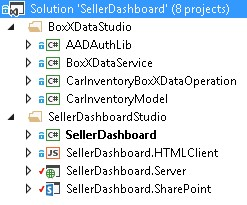
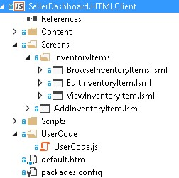
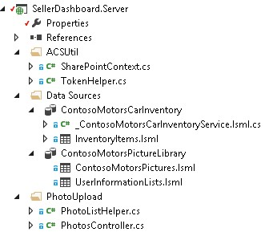
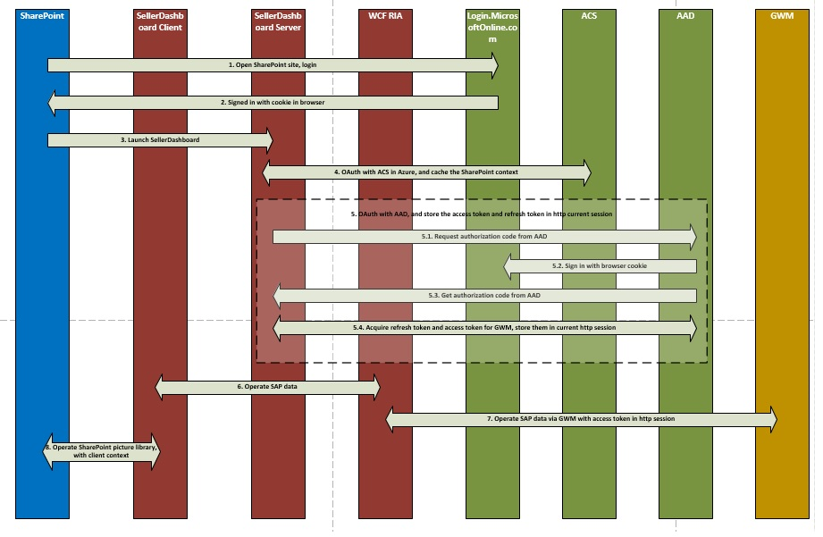

# Crie um nuvem comercial suplemento que usa o Gateway do SAP
Aprenda como criar o LightSwitch SharePoint hospedado em provedor suplemento para acessar dados do SAP por meio de Gateway do SAP para o Microsoft.
Este artigo destaca as principais etapas que a equipe de desenvolvimento da Microsoft usada para criar um LightSwitch SharePoint hospedado em provedor suplemento que pode acessar dados SAP por meio de Gateway do SAP para o Microsoft. Este suplemento suporta operações CRUD nos dados do SAP e pode ser usado para exibir imagens de e para carregar imagens em uma biblioteca de imagens do SharePoint.
  
    
    

A finalidade deste artigo é mostrar os principais pontos do add-in que podem ajudá-lo a criar suplementos semelhantes. O exemplo de código é fornecido e vinculado ao artigo para que você possa ver como a solução de trabalho tiver sido criada, a fim de reforçar o seu aprendizado.
 **Download de exemplo:** [Amostra: desenvolvendo um suplemento de negócios de nuvem para acessar o Gateway do SAP para o Microsoft ](https://code.msdn.microsoft.com/Sample-Developing-a-Cloud-25d6d1ea)
  
    
    


## Antes de começar

A seguir são pré-requisitos para os procedimentos neste artigo:
  
    
    

- **Um Site de desenvolvedor do Office 365** em um domínio do Office 365 que está associado um locatário Microsoft Azure Active Directory (AD Azure). Consulte [inscrever-se para um Site do Office 365 para desenvolvedores, configurar ferramentas e ambiente e iniciar a implantação de suplementos](http://msdn.microsoft.com/en-us/library/office/fp179924%28v=office.15%29.aspx) ou [como: criar um Site de desenvolvedor dentro de sua assinatura do Office 365 existente.](http://msdn.microsoft.com/en-us/library/office/jj692554%28v=office.15%29.aspx)
    
  
- **Visual Studio 2013 atualização 4** ou posterior, que pode ser obtido [Bem-vindo ao Visual Studio 2013](http://msdn.microsoft.com/en-us/library/dd831853.aspx).
    
  
- **Microsoft Office Developer Tools para o Visual Studio.** A versão que está incluído na atualização 4 do Visual Studio 2013 ou posterior.
    
  
- **Gateway do SAP para o Microsoft** é implantada e configurada in Microsoft Azure. Para obter detalhes, consulte a documentação do [Gateway do SAP para o Microsoft](http://go.microsoft.com/fwlink/?LinkId=507635).
    
  
- **Uma conta organizacional in Microsoft Azure.** Consulte [criar uma conta de usuário organizacionais no Azure AD](http://go.microsoft.com/fwlink/?LinkID=512580).
    
    > [!OBSERVAçãO]
      > Faça logon em sua conta do Office 365 (login.microsoftonline.com) para alterar a senha temporária depois que a conta é criada.
- **Ponto de extremidade OData an do SAP** com dados de amostra nela. Consulte a documentação do [Gateway do SAP para o Microsoft](http://go.microsoft.com/fwlink/?LinkId=507635).
    
  
- **Conhecimentos básicos AD. do Windows Azure** Consulte o [guia de Introdução do Azure AD](http://msdn.microsoft.com/en-us/library/azure/dn655157.aspx).
    
  
- **Conhecimentos básicos criando SharePoint Add-ins.** Consulte [como: criar um básico hospedado em provedor SharePoint Add-in](http://msdn.microsoft.com/en-us/library/office/fp142381%28v=office.15%29.aspx).
    
  
- **Conhecimentos básicos OAuth 2.0 no Windows Azure AD.** Consulte [OAuth 2.0 e no Windows Azure AD](http://msdn.microsoft.com/en-us/library/azure/dn645545.aspx) e tópicos de seu filho.
    
  

## Visão geral da solução

Motors Contoso é uma empresa de vendas de auto fictício que representa uma empresa de vida real no qual um revendedor automóvel compartilha informações sobre seu inventário dos automóveis com representantes de vendas e outros revendedores que são afiliado. Usando este suplemento, o pessoal de vendas pode verificar o status atual do seu inventário de automóveis, o suplemento acessa diretamente do SAP por meio de Gateway do SAP para o Microsoft. Todos os dados são armazenados no SAP, e uma imagem de cada carro está armazenada em uma biblioteca de imagens no SharePoint Online. Ambos os dados do SAP e a biblioteca de imagens do SharePoint são colocados juntos e exibidos por este suplemento. Dentro do add-in, administradores e gerentes podem fazer as operações CRUD padrão nos dados detalhados sobre cada carro no SAP.
  
    
    
O exemplo neste artigo, o suplemento SellerDashboard manipula dados de inventário de automóveis entre SAP e sua imagem na biblioteca de imagens do SharePoint. Dentro CRUD este suplemento, standard (criar, ler, atualizar e excluir) operações são compatíveis com as informações detalhadas sobre cada carro no SAP.
  
    
    

> [!DICA]
> Para uma demonstração em vídeo deste suplemento, assista ao vídeo de  [Webinar técnica - Gateway do SAP para o modelo de desenvolvimento do Microsoft Azure &amp; Microsoft](http://go.microsoft.com/fwlink/?LinkId=517378) em BrightTalk. A versão de demonstração da funcionalidade do aplicativo começa em 48:00 minutos na linha do tempo.
  
    
    

 **Arquitetura de código**
  
    
    
A solução de SellerDashboard inclui oito projetos e como a imagem a seguir mostra, ele é dividido em duas categorias: BoxXDataStudio e SellerDashboardStudio.
  
    
    

  
    
    

  
    
    

### BoxXDataStudio

Este studio inclui todos os componentes necessários para interagir com o Gateway do SAP para o Microsoft.
  
    
    

- **AADAuthLib**
    
    Esse componente é usado para realizar o  [fluxo de código de autorização do Azure AD](https://msdn.microsoft.com/en-us/library/azure/dn645542.aspx), que usa um padrão de único.
    
    O trecho de código a seguir mostra a função principal, o que fornece o componente AADAuthLib. Para obter mais detalhes, consulte a classe auxiliar de código de amostra de AADAuthLib/AuthUtil.cs.
    


  ```cs
  
// Use the auth code, acquire the refresh token and access token, and store them in the current session
        public bool AcquireTokenFromAuthCode(string authCode, string redirectUrl = "redirectUrl")
        {
            if (!IsAuthorized &amp;&amp; !string.IsNullOrEmpty(authCode))
            {
                AuthenticationResult authResult = _authContext.AcquireTokenByAuthorizationCode(authCode,
                    new Uri(ConfigurationManager.AppSettings["ida:" + redirectUrl]),
                    _clientCredential,
                    ConfigurationManager.AppSettings["ida:ResourceUrl"]);

                HttpContext.Current.Session["RefreshToken"] = authResult.RefreshToken;
                HttpContext.Current.Session["AccessToken-" + ConfigurationManager.AppSettings["ida:ResourceUrl"]] = new Tuple<string, DateTimeOffset>(authResult.AccessToken, authResult.ExpiresOn);

                return true;
            }

            return false;
  }

 // Provide the access token, which is stored in the current session, if the access token expired, use the refresh token get a new one.
 public string AccessToken
        {
            get
            {
                if (!IsAuthorized) throw new UnauthorizedAccessException();

                var accessToken = HttpContext.Current.Session["AccessToken-" + ConfigurationManager.AppSettings["ida:ResourceUrl"]] as Tuple<string, DateTimeOffset>;

                if (IsAccessTokenValid(accessToken))
                {
                    return accessToken.Item1;
                }

                accessToken = RenewAccessToken();
                HttpContext.Current.Session["AccessToken-" + ConfigurationManager.AppSettings["ida:ResourceUrl"]] = accessToken;

                return accessToken.Item1;
            }
  }
  ```

- **BoxXDataService**
    
    Este é um serviço WCF RIA, que é a interface usada pelo componente do servidor SellerDashboard hospedado no Windows Azure, e que consome a fonte de dados do SAP do Gateway do SAP para o Microsoft..
    
    O trecho de código a seguir é o método Web CRUD, que suporta o serviço WCF RIA. Para obter mais detalhes, consulte BoxXDataService/BoxXDataService.cs.
    


  ```cs
  
[Query(IsDefault = true)]
        public IQueryable<InventoryItem> GetAllCarInventory()
        {
            BoxXDataReader dataReader = BoxXDataReader.Instance;
            IInventoryCollection dataCollection = ModelFactory.CreateInventoryCollection(dataReader.SchemaPropertyNames);
            IInventoryQuery query = QueryFactory.CreateQuery();
            dataReader.GetData(dataCollection, query);

            return dataCollection.Items.Cast<InventoryItem>().AsQueryable();
        }

        [Update]
        public void UpdateCarInventoryItem(InventoryItem carInventoryItem)
        {
            BoxXDataUpdater dataUpdater = BoxXDataUpdater.Instance;
            dataUpdater.UpdateInventoryItem(carInventoryItem);
        }

        [Insert]
        public void InsertCarInventoryItem(InventoryItem carInventoryItem)
        {
            BoxXDataCreater dataCreater = BoxXDataCreater.Instance;
            dataCreater.CreateInventoryItem(carInventoryItem);
        }

        [Delete]
        public void DeleteCarInventoryItem(InventoryItem carInventoryItem)
        {
            BoxXDataDeleter.DeleteInventoryItem(carInventoryItem.ID);
 }
  ```

- **CarInventoryBoxXDataOperation**
    
    Esta é a implementação de CRUD real para BoxXDataService. A imagem a seguir mostra a arquitetura de código principal do CarInventoryBoxXDataOperation. O namespace CRUD é usado para implementar as operações CRUD e o namespace de utilização é o código para o namespace CRUD auxiliar.
    
     
  

  

  
- **CarInventoryModel**
    
    Esse é um projeto de biblioteca que é usado para implementar o modelo de dados e os utilitários. A definição do modelo de dados deve coincidir com os metadados do ponto de extremidade OData que é usado pelo Gateway do SAP para o Microsoft, que é baseado no esquema de dados do SAP. BoxXDataService e CarInventoryBoxXDataOperation usá-lo para converter o item de banco de dados do SAP em uma instância de inventário de carro.
    
    A imagem a seguir mostra os componentes principais.
    
  

  
    
    

  
    
    

  
    
    

  
    
    

### SellerDashboardStudio

SellerDashboardStudio inclui LightSwitch SharePoint suplemento componentes padrão.
  
    
    

- **SellerDashboard**
    
    SellerDashboard é o projeto de inicialização e é usado para publicar o suplemento SellerDashboard para o site do Windows Azure e seu suplemento do SharePoint no site do desenvolvedor do SharePoint.
    
  
- **SellerDashboard.HTMLClient**
    
    Esse componente inclui as telas, um controle personalizado e um controle de carregamento de foto. A imagem a seguir mostra seus componentes principais.
    
  
- 
     
  

    SellerDashboard.HTML.Client inclui estes quatro telas:
    
  - BrowseInventoryItems é a tela inicial, usada para procurar informações básicas para todos os itens de inventário.
    
  
  - ViewInventoryItem é a tela de detalhes, usada para exibir uma exibição detalhada para cada item de estoque.
    
  
  - EditInventoryItem é uma tela pop-up de edição, usada para editar um item de inventário.
    
  
  - AddInventoryItem é uma tela pop-up de adicionar, usada para adicionar um novo item de inventário.
    
  

    O arquivo de UserCode.js inclui o código de controle personalizado eu.
    
    O photohelper.js e sharepointauthhelper.js, arquivos, incluído na pasta Scripts, se baseiam as diretrizes fornecidas no artigo  [passo a passo: Criando um suplemento para o SharePoint pelo LightSwitch usando](http://msdn.microsoft.com/en-us/library/jj969621.aspx).
    
  
- **SellerDashboard.Server**
    
    Esse componente inclui a fonte de dados do WCF RIA, a fonte de dados do SharePoint e a API da Web de carregamento de foto. A imagem a seguir mostra seus componentes principais.
    
     
  

    O SharePointContext.cs e TokenHelper.cs são as classes de auxiliar que fornecem o contexto de cliente para autenticar no SharePoint. Isso permite que o carregamento de foto API da Web a ser usado para carregar fotos dos carros para a biblioteca de imagens. Os arquivos PhotoListHelper.cs e PhotosController.cs implementam a API da Web de carregamento de foto. Para obter mais informações sobre como a API da Web de carregamento de foto é usada pelo LightSwitch, consulte o artigo  [passo a passo: Criando um suplemento para o SharePoint pelo LightSwitch usando](http://msdn.microsoft.com/en-us/library/jj969621.aspx).
    
  
- **SellerDashboard.SharePoint**
    
    Esse componente é incluído após a solução LightSwitch para permitir que o projeto do SharePoint. Para configurar o site do SharePoint usada na biblioteca de imagens e para definir as permissões necessárias para o suplemento, você pode usar esse componente. SellerDashboard precisa ter o nível de permissão Controle total no site do SharePoint que hospeda a biblioteca de imagens.
    
  

## Implementação


  
    
    

### Overview

A imagem a seguir mostram os componentes que compõem a SellerDashboard. A linha sólida mostra o fluxo de dados e da linha pontilhada mostra o fluxo de OAuth. Os componentes verdes estão relacionados às operações de dados do SAP, os componentes azuis estão relacionados a operação de biblioteca de imagens do SharePoint, e os componentes laranjas representam as operações do aplicativo SellerDashboard todo.
  
    
    
 **Solução SellerDashboard**
  
    
    

  
    
    

  
    
    

  
    
    

  
    
    

### Mashup de dados

LightSwitch suporta o mashup de dados adicionando uma relação entre as duas fontes de dados no designer.
  
    
    
 **Fonte de dados do SAP**
  
    
    

-  *Esquema de dados no banco de dados do SAP* 
    
    O trecho a seguir mostra um exemplo de um esquema de dados de Gateway do SAP para o Microsoft.
    


  ```XML
  
<?xml version="1.0" encoding="UTF-8"?> 
- <edmx:Edmx xmlns:sap="http://www.sap.com/Protocols/SAPData" xmlns:m="http://schemas.microsoft.com/ado/2007/08/dataservices/metadata" 
xmlns:edmx:"http://schemas.microsoft.com/ado/2007/06/edmx" Version="1.0">
   - <edmx:DataServices m:DataServiceVersion="2.0">
      - <Schema xml:lang="en" xmlns="http://schemas.microsoft.com/ado/2008/09/edm" Namespace="ZCAR_POC_SRV">
         - <EntityType sap:content-version="1" Name="ContosoMotors">
              - <Key>
                     <PropertyRef Name="ID"/>
               </Key>
               <Property Name="ContactPhone" Type="Edm.String"/>
               <Property Name="ContactEmail" Type="Edm.String"/>
               <Property Name="ID" Type="Edm.Int32" Nullable="false"/>
               <Property Name="BuyerEmail" Type="Edm.String" MaxLength="255"/>
               <Property Name="MaxPower" Type="Edm.Int32" Nullable="false"/>
               <Property Name="Engine" Type="Edm.String" Nullable="false" MaxLength="255"/>
               <Property Name="BodyStyle" Type="Edm.String" Nullable="false" MaxLength="255"/>
               <Property Name="Transmission" Type="Edm.String" Nullable="false" MaxLength="255"/>
               <Property Name="Year" Type="Edm.Int32" Nullable="false"/>
               <Property Name="Model" Type="Edm.String" Nullable="false" MaxLength="255"/>
               <Property Name="Brand" Type="Edm.String" Nullable="false" MaxLength="255"/>
               <Property Name="ExtColor" Type="Edm.String" Nullable="false" MaxLength="255"/>
              <Property Name="IntColor" Type="Edm.String" Nullable="false" MaxLength="255"/>
              <Property Name="ContactName" Type="Edm.String" Nullable="false" MaxLength="255"/>
              <Property Name="Price" Type="Edm.String" Nullable="false"/>
              <Property Name="StockNo" Type="Edm.String" Nullable="false"/>
              <Property Name="Arrived_Date" Type="Edm.DateTime" Nullable="false" Precision="0"/>
              <Property Name="Status" Type="Edm.String" Nullable="false" MaxLength="255"/>
      </EntityType>
   - <EntityContainer Name="ZCAR_POC_SRV_Entities" m:IsDefaultEntityContainer="true">
          <EntitySet sap:content-version="1" Name="ContosoMotorsCollection" sap:searchable="true" EntityType="ZCAR_POC_SRV.ContosoMotors"/>
     </EntityContainer>
     <atom:link xmlns:atom="http://www.w3.org/2005/Atom" href="http://contoso.cloudapp.net:8080/perf/sap/opu/odata/sap/ZCAR_POC_SRV/$metadata" rel="self"/>
     <atom:link xmlns:atom="http://www.w3.org/2005/Atom" href="http://contoso.cloudapp.net:8080/perf/sap/opu/odata/sap/ZCAR_POC_SRV/$metadata" rel="latest-version"/>
</Schema>
</edmx:DataServices>
</edms:Edmx>               

  ```


    Esta é nossa base de dados de teste e o valor de tipo de propriedade e Nullable baseia-se no cenário. A ID é a PropertyRef e a operação de OData CRUD baseia-se em ID. A propriedade StockNo é usada para combinar os dados com a imagem de carro que é armazenado na biblioteca de imagens do SharePoint.
    
  
-  *Modelo de dados definido para o serviço RIA* 
    
  ```cs
  
public interface IInventoryItem
    	{
        IEnumerable<InventoryPropertyName> ValidPropertyNames { get; }
        bool IsValid { get; }

        int ID { get; set; }
        DateTime ArrivedDate { get; set; }
        string BodyStyle { get; set; }
        string Brand { get; set; }
        string BuyerEmail { get; set; }
        string ContactEmail { get; set; }
        string ContactName { get; set; }
        string ContactPhone { get; set; }
        string Engine { get; set; }
        string ExtColor { get; set; }
        IEnumerable<Uri> Images { get; }
        string IntColor { get; set; }
        int MaxPower { get; set; }
        string Model { get; set; }
        decimal Price { get; set; }
        bool Removed { get; }
        string Status { get; set; }
        string StockNo { get; set; }
        string Transmission { get; set; }
        int Year { get; set; }

        void AddImageUrl(Uri url);
        bool CopyFrom(IInventoryItem other);
        object GetPropertyValue(InventoryPropertyName property);
        void MarkAsRemoved();
        void SetPropertyValue(InventoryPropertyName property, object value);
       }

    	public interface IInventoryCollection
       {
        IEnumerable<InventoryPropertyName> QueriedPropertyNames { get; }
        IEnumerable<IInventoryItem> Items { get; }
        bool Valid { get; }

        IInventoryItem this[int id] { get; }
        bool Contains(int id);
        void AddItem(IInventoryItem inventoryItem);
        IInventoryCollection Filter(Predicate<IInventoryItem> match);
        bool CopyFrom(IInventoryCollection other);
}

  ```


    Qualquer propriedade que não está incluída no esquema de banco de dados do SAP pode ser ignorada. Por exemplo, a propriedade **imagens** foi adicionada aqui para obter considerações sobre escalabilidade. Este modelo de dados é uma camada intermediária entre o banco de dados real do SAP e a fonte de dados SellerDashboard.Server. O projeto LightSwitch tem dois componentes: modo de exibição e o servidor. Quando você adiciona uma fonte de dados externos no lado do servidor, LightSwitch ajuda você a criar uma camada de dados abstrato que é adicionada à fonte de dados no lado do servidor.
    
    A maioria das propriedades têm o mesmo tipo como as propriedades no esquema de banco de dados do SAP, exceto StockNo, cujo tipo foi alterado de **int** para **string**. Isso ocorre porque StockNo é usado como uma maneira de definir a relação entre os dados do SAP e a biblioteca de imagens do SharePoint.
    
    > [!DICA]
      > StockNo deve ter o tipo de **cadeia de caracteres**, como o valor armazenado na biblioteca de imagens do SharePoint é o **texto**. Esses dois tipos devem corresponder para realizar o mashup de dados.

    A implementação das duas interfaces é em CarInventoryModel/InventoryItem.cs e CarInventoryModel/InventoryCollection.cs.
    
  
-  *Fonte de dados consumida por lado do servidor LightSwitch* 
    
     
  

    No servidor SellerDashboard, quando você adiciona um serviço WCF RIA (BoxXDataService), o modelo de dados que é definido em CarInventoryModel for incluído, e você obtém a tabela de dados relevantes. Você pode alterar o tipo de algumas das propriedades. Por exemplo, você pode alterar o tipo de **BuyerEmail** de **cadeia de caracteres** para o **Endereço de Email** e LightSwitch dará suporte a verificação de formato de email no lado do cliente.
    
  
 **Biblioteca de Imagens do SharePoint**
  
    
    
A biblioteca de imagens no site do host do SharePoint é chamada ContosoMotorsPictureLibrary e contém três novas colunas denominadas StockNo, ThumbnailUrl e FullImageUrl. Todos eles são configurados como campos de **texto**.
  
    
    

> [!DICA]
> Os nomes de coluna diferenciam maiúsculas de minúsculas.
  
    
    

A coluna StockNo é usada para criar um relacionamento com os dados do SAP. As colunas ThumbnailUrl e FullImageUrl são usadas para obter a URL da imagem relevante em uma forma conveniente.
  
    
    
 *Fonte de dados consumida por lado do servidor LightSwitch* 
  
    
    
ContosoMotorsPicture é um modelo de fonte de dados do LightSwitch, que mapeia para a biblioteca de imagens de sites de host do SharePoint no lado do servidor LightSwitch.
  
    
    

  
    
    

  
    
    
 **Relacionamento de dados**
  
    
    
Adicione uma relação um-para-zero ou um relacionamento individual entre o InventoryItem e ContosoMotorsPicture. A imagem a seguir mostra a esta aparência gosta, usando o LightSwitch no Visual Studio
  
    
    

  
    
    

  
    
    

  
    
    

  
    
    

### OAuth com o Azure AD &amp; ACS

Esta seção fornece uma visão geral de como o suplemento implementa OAuth no Azure AD e acessar os serviços de controle (ACS).
  
    
    
 **Overview**
  
    
    
SellerDashboard é um SharePoint provedor host suplemento com para operar em ambas as fontes de dados: SharePoint imagem biblioteca e os dados do SAP por meio de Gateway do SAP para o Microsoft.
  
    
    
Para acessar a biblioteca de imagens do SharePoint, SellerDashboard precisa autentiquem no ACS e obter um acesso token dele. Para acessar os dados do SAP, no entanto, o SellerDashboard precisa obter um token de acesso diferente do Azure AD, pois usa o Gateway do SAP para o Microsoft Azure AD para autenticação e autorização.
  
    
    

  
    
    

  
    
    
 **Implementação**
  
    
    
SellerDashboard é um SharePoint hospedado em provedor suplemento que ofereça suporte a operação de carregamento de imagens usando o modelo de objeto do cliente do SharePoint. O contexto do SharePoint, que é usado para criar o contexto de cliente para o host do SharePoint, é armazenado em cache e o contexto de cliente é usado pelo carregamento de API da Web.
  
    
    
Quando o OAuth com o processo do ACS for concluída, a solicitação de autenticação é enviada para o Windows Azure AD. Para realizar isso, o suplemento usa um cookie para entrar no Login.MicrosoftOnline.com e conclua o fluxo de código de autorização do Azure AD, que retorna um token de atualização que o suplemento armazena em cache para solicitações de autenticação futuras durante a sessão. Aqui está o código que é usado para esse processo.
  
    
    


```cs

protected override void Page_Load(object sender, EventArgs e)
{
    if (!IsPostBack)
    {
 SharePointContext spContext = SharePointContextProvider.Current.GetSharePointContext(Context);
        if (spContext != null)
        {
     // Cache the SharePoint Context, which will be used to create Client Context for SharePoint host
            _spContext = spContext;
        }

		
        // Acquire refresh token and access token, and store them in the current session, which will be used do the OAuth with AAD for operating the SAP data
        AuthUtil.Instance.AcquireTokenFromAuthCode(Request.QueryString["code"]);

        if (!AuthUtil.Instance.IsAuthorized)
        {
             Response.Redirect(AuthUtil.Instance.AuthCodeUrl);
        }
     }

     base.Page_Load(sender, e);
 }
```

Para obter mais detalhes, consulte SellerDashBoard.Server/SharePointLaunch.aspx.cs e AADAuthLib/AuthUtil.cs na amostra de código.
  
    
    
SellerDashboard.Server inclui os arquivos SharePointContext.cs e TokenHelper.cs, que são usados para obter o contexto de cliente app somente para o host do SharePoint. . Esses dois arquivos são adicionados ao projeto do SharePoint automaticamente pelo Visual Studio. (Visual Studio nomeia o projeto < *yourprojectname*  > Web; por exemplo, SharePointAppWeb.) Você pode, em seguida, copie esses dois arquivos para o seu código-fonte suplemento SellerDashboard e incluí-los em seu projeto.
  
    
    

### Operações CRUD nos dados do SAP do Gateway do SAP para o Microsoft

Os trechos de código a seguir mostram a lógica de código principal das operações CRUD. Para obter mais detalhes, consulte a implementação do CarInventoryBoxXDataOperation na amostra de código.
  
    
    
 **BoxXDataCreater**
  
    
    


```cs

        public void CreateInventoryItem(IInventoryItem inventoryItem)
        {
            if (_model == null)
            {
                _model = BoxXDataCRUDHelpers.GetMetadata(BoxXDataCRUDHelpers.MetadataUrl);
            }

            // Create new entry request generate
            var requestMessage = new ODataClientRequestMessage(new Uri(BoxXDataCRUDHelpers.DataCollectionUrl),
                                                                ODataConstants.MethodPost);
            BoxXDataCRUDHelpers.CreateEntryRequestHeaderSetter(requestMessage, AuthUtil.Instance.AccessToken);
            BoxXDataCRUDHelpers.SetODataRequestContent(requestMessage, _model, inventoryItem);

            // Create new entry request execute
            IODataResponseMessage responseMessage = requestMessage.GetResponse();

        }
BoxXDataReader
 public void GetData(IInventoryCollection dataCollection, IInventoryQuery query)
        {
            GetValueWithoutLocallyFiltering(dataCollection, query);

            if (query.Filters.Any())
            {
                var filteredCollection = dataCollection.Filter(inventoryItem =>
                    query.Filters.Any(filter => filter.Match(inventoryItem)));

                dataCollection.CopyFrom(filteredCollection);
            }
        }
```

 **BoxXDataUpdater**
  
    
    


```cs

public void UpdateInventoryItem(IInventoryItem inventoryItem)
        {
            if (_model == null)
            {
                _model = BoxXDataCRUDHelpers.GetMetadata(BoxXDataCRUDHelpers.MetadataUrl);
            }

            // Update existing entry request generate
            var requestMessage = new ODataClientRequestMessage(new Uri(BoxXDataCRUDHelpers.DataCollectionUrl + '(' + inventoryItem.ID + ')'),
                                                                ODataConstants.MethodPut);
            BoxXDataCRUDHelpers.UpdateEntryRequestHeaderSetter(requestMessage, AuthUtil.Instance.AccessToken);
            BoxXDataCRUDHelpers.SetODataRequestContent(requestMessage, _model, inventoryItem);

            // Update existing entry request execute
            IODataResponseMessage responseMessage = requestMessage.GetResponse();
        }
BoxXDataDeleter
 public static void DeleteInventoryItem(int ID)
        {
            // Delete existing entry request generate
            var requestMessage = new ODataClientRequestMessage(new Uri(BoxXDataCRUDHelpers.DataCollectionUrl + '(' + ID + ')'),
                                                                ODataConstants.MethodDelete);
            BoxXDataCRUDHelpers.DeleteEntryRequestHeaderSetter(requestMessage, AuthUtil.Instance.AccessToken);

            // Delete existing entry request execute
            IODataResponseMessage responseMessage = requestMessage.GetResponse();
        }
```


### Carregar fotos para a biblioteca de imagens do SharePoint

O controle de carregamento de foto e a implementação de API da Web de carregamento de foto são usados para carregar fotos para a biblioteca de imagens do SharePoint, usando o código a seguir, que é baseado nas diretrizes do artigo  [passo a passo: Criando um suplemento para o SharePoint pelo LightSwitch usando](http://msdn.microsoft.com/en-us/library/jj969621.aspx).
  
    
    
 **Para que as alterações de photohelper.js:**
  
    
    
Um novo campo será adicionado para o uploadForm, que é usada para passar o StockNo para a API de Web de carregamento de foto.
  
    
    


```

uploadForm = $(
             '<form id="uploadForm" method="POST" enctype="multipart/form-data" action="' + API_URL + '"  data-ajax="false" target="uploadTargetIFrame">' +
             '   <input name="fileInput" id="fileInput" type="file" size="30" data-theme="c" accept="image/*" multiple="true"/>' +
             '   <input type="hidden" name=' + screen.InventoryItem.StockNo + '>' +
             '</form>');

```

Adicione a lógica para armazenar em cache a URL da imagem e imagem definido de volta lógica.
  
    
    


```

function completeUpload(uploadedFiles) {
            var fullImageUrl = uploadedFiles[0];
            var photoNameWithExt = fullImageUrl.substr(fullImageUrl.lastIndexOf('/') + 1);
            var photoNameWithoutExt = photoNameWithExt.substr(0, photoNameWithExt.lastIndexOf("."));
            var photoPathUri = fullImageUrl.substr(0, fullImageUrl.lastIndexOf('/'));
            var photoExt = photoNameWithExt.substr(photoNameWithExt.lastIndexOf(".") + 1, photoNameWithExt.length);
            var thumbnailUrl = photoPathUri + "/_t/" + photoNameWithoutExt + "_" + photoExt + ".jpg";
            setCacheUrl(screen.InventoryItem.StockNo, fullImageUrl + "*#00#" + thumbnailUrl);
            setDetailsCarPicture(fullImageUrl);
            screen.closePopup();
        }
```

 **Para que as alterações de PhotosController.cs:**
  
    
    
Use o contexto de cliente app somente para o host do SharePoint, que é criado pelo contexto do SharePoint em cache.
  
    
    
Fazer isso porque o ContosoMotorsPictureLibrary não pertence ao suplemento SellerDashboard; em vez disso, ele pertence ao site de host do SharePoint. Além disso, remova o código relevante de excluir foto.
  
    
    


```cs

private ClientContext AppWebContext
    {
        get
        {
            if (appWebContext == null)
            {
                appWebContext = SharePointLaunch.getAppWebContext();
            }
            return appWebContext;
        }
    }

```

 **Para que as alterações de PhotoListHelper.cs:**
  
    
    
Adicione a lógica de atualização de imagem, que excluirá o item de imagem antigo se houver uma e, em seguida, adicionar um novo item de imagem. Atribua o StockNo do novo item de imagem e ao mesmo tempo, defina os valores de FullImageUrl e ThumbnailUrl para o novo item de imagem.
  
    
    


```cs

            // Delete the old picture item
            foreach (ListItem item in items)
            {
                if (!string.IsNullOrEmpty((string)(item["StockNo"])))
                {
                    string tempStockNo = item["StockNo"].ToString();
                    if (tempStockNo.Equals(stockNo))
                    {
                        item.DeleteObject();
                        siteContext.ExecuteQuery();
                        break;
                    }
                }
            }

            // Update the new picture item
            foreach (ListItem item in items)
            {
                string fullImageName = item["FileLeafRef"].ToString();
                string thumbnailName = fullImageName.Replace('.', '_') + ".jpg";

                if (photoUri.Contains(fullImageName))
                {
                    item["StockNo"] = stockNo;
                    item["FullImageUrl"] = photoUri;
                    item["ThumbnailUrl"] = photoUri.Replace(fullImageName, "_t/" + thumbnailName);
                    item.Update();
                    siteContext.ExecuteQuery();
                    break;
                }
            }


```


### Experiência do usuário

Para a solicitação de cenário especiais, muitos controles personalizados são implementados para dar suporte a solicitação. Você pode encontrar o código relevante no arquivo UserCode.js. Você pode criar rapidamente uma interface de usuário simples usando o designer de LightSwitch. O conjunto de tela comuns pode atender sua solicitação de teste. Porque a experiência do usuário não tiver o foco principal deste documento, detalhes não são fornecidas aqui.
  
    
    

## Implantação do app

Conclua as etapas desta seção para implantar o suplemento. Antes de implantar este suplemento, certifique-se de que o Gateway do SAP para o Microsoft tenha sido implantado e configurado em seu locatário do Azure.
  
    
    

### Crie seu site Azure


1. Faça logon no  [Portal do Microsoft Azure](http://go.microsoft.com/fwlink/?LinkID=512959) como um administrador global.
    
  
2. No menu à esquerda, clique em **sites**.
    
    > [!OBSERVAçãO]
      > Você usará este site da web para hospedar o SharePoint hospedado em provedor suplemento para o SellerDashboard.
3. Na barra de comandos na parte inferior da página, clique em **novo**.
    
  
4. Selecione **Compute > site > rápido criar**.
    
  
5. Na caixa **URL**, insira a primeira parte da URL que você deseja usar, selecione uma Web hospedando planejar e, em seguida, clique em **Criar site**. Copie esta URL, pois você precisará ao registrar o suplemento posteriormente em uma seção posterior deste artigo. Por exemplo, use Constoso.azurewebsites.net.
    
  

### Registrar o aplicativo do SharePoint

Um suplemento do SharePoint vazio é usado para conceder o suplemento do SharePoint, as permissões de leitura que ela precisa recuperar imagens de carros da biblioteca de imagens no SharePoint Online. Conclua as etapas a seguintes para registrar o suplemento do SharePoint com o site do SharePoint que contém essa biblioteca de imagens e conceder o acesso de leitura suplemento para o site.
  
    
    

### Para registrar o suplemento do SharePoint


1. Abra a solução no Solution Explorer.
    
  
2. Nas propriedades do suplemento do SharePoint, insira a **URL do Site** do site do SharePoint que contém a biblioteca de imagens. No prompt de logon que aparece, faça logon como um proprietário de Site.
    
  
3. Defina a permissão de leitura no manifesto do aplicativo.
    
     
  

  

  
4. Definir o suplemento como um projeto de inicialização e executar o projeto. Você pode encontrar os valores ClientID e ClientSecret no arquivo ContosoMotorsCarInventoryWeb/Web.config. O código deve se parecer com o seguinte:
    
  ```XML
  
<add key="ClientId" value="06af1059-8916-4851-a271-2705e8cf53c6"/>
<add key="ClientSecret" value="LypZu2yVajlHfPLRn5J2hBrwCk5aBOHxE4PtKCjIQkk="/>
  ```

5. Substitua os valores de ClientID e ClientSecret em hospedado add-in "configuração" em ContosoMotorsCarInventoryWeb/TokenHelper.cs com acima valores. O código deve se parecer com o seguinte:
    
  ```cs
  
private static readonly string ClientId = "06af1059-8916-4851-a271-2705e8cf53c6";
private static readonly string ClientSecret = "LypZu2yVajlHfPLRn5J2hBrwCk5aBOHxE4PtKCjIQkk=";

  ```


### Registrar seu aplicativo web com o Azure AD.

As etapas desta seção descrevem como registrar o suplemento de amostra do portal de gerenciamento do Windows Azure.
  
    
    

1. Login para o  [Portal de gerenciamento do Windows Azure](http://go.microsoft.com/fwlink/?LinkID=512959) com sua conta de administrador de colegas ou de serviço do Windows Azure.
    
  
2. No painel de navegação à esquerda, clique em **Active Directory**.
    
  
3. Na página do active directory, clique no diretório que foi configurado para o Gateway do SAP para o Microsoft.
    
    > [!DICA]
      > Se não tiver certeza de qual deles foi usado, pergunte ao seu Gateway do SAP para o administrador do Microsoft. Dica: é o diretório que contém os usuários e grupos de Gateway do SAP para o Microsoft.
4. Na barra de navegação superior, escolha **aplicativos**.
    
  
5. Na parte inferior da página, clique em **Adicionar**.
    
  
6. Na caixa de diálogo exibida, clique em **Adicionar um aplicativo está desenvolvendo a minha organização**.
    
  
7. Na caixa de diálogo **Adicionar aplicativo**, nomeie o aplicativo. Por exemplo, nomeie-o "SellerDashboard".
    
  
8. Escolha o **aplicativo Web e/ou a API da web** como o tipo de aplicativo e, em seguida, clique na seta à direita.
    
  
9. Na caixa de diálogo **Adicionar propriedades**, use a URL do site que você criou anteriormente (na sua seção de site Azure criar) como a URL de SIGN-ON. Por exemplo, use *https://Constoso.azurewebsites.net*  .
    
  
10. Para o **URI de ID de aplicativo**, dar ao aplicativo um URI exclusivo, como o nome do aplicativo adicionado no final da **URL de SIGN-ON**; Por exemplo, use  *https://Constoso.azurewebsites.net/SellerDashboard*  , onde Constoso.azurewebsites.net é o site que você criou anteriormente neste artigo.
    
  
11. Clique na marca de seleção para criar o aplicativo.
    
    O painel Azure para o aplicativo abre e exibe uma mensagem de êxito.
    
  

> [!OBSERVAçãO]
> Você deve registrar o suplemento com o Azure AD duas vezes: uma vez para fins de depuração, e, em seguida, novamente, implantá-lo para produção, como descrito na etapa 10.> Para registrar o suplemento para fins de depuração, use a **URL de SIGN-ON** e o **URI de ID de aplicativo** com a URL de depuração do projeto SellerDashboard.Server para que você possa executar depurador do Visual Studio (F5). Essa URL será de https://localhost o formulário. *nnnn*  , onde *nnnn*  é um número de porta. Você pode encontrar essa URL no painel Propriedades no Visual Studio.> Em seguida, quando estiver pronto para implantar para produção, edite o registro para usar a URL correta de produção.
  
    
    


### Definir configurações do aplicativo

Defina as configurações para o novo aplicativo que você criou no procedimento anterior.
  
    
    

1. Na parte superior da página do aplicativo, clique em **Configurar**.
    
  
2. Definir parâmetros onde for necessário e tome nota das definições de configuração, conforme descrito na tabela a seguir.
    

|**Parâmetro**|**Remover um ou mais valores de uma propriedade com valores múltiplos**|
|:-----|:-----|
|ID do cliente <br/> |Copie o valor que aparece no campo ID do cliente. <br/> |
|Segredo do cliente <br/> |Gere uma nova chave de aplicativo: <br/> Na seção de chaves, selecione a duração de chave de 1 ou 2 anos. <br/> Na barra de comandos na parte inferior da página, clique em **Salvar**. <br/> O valor da chave agora é exibido. <br/> Copie e salve o valor da chave para uso futuro; não é possível recuperá-lo depois de sair da página. <br/> |
|URI de ID de aplicativo <br/> |Copie o valor que aparece no campo **URI de ID do suplemento**. <br/> |
   

    Lembre-se de manter essas informações úteis, pois você precisará delas em um procedimento posterior.
    
  
3. Na seção **permissões para outros aplicativos**, faça o seguinte:
    
1. Selecione seu Gateway do SAP para o aplicativo Microsoft.
    
  
2. Na coluna **Permissões delegadas**, habilite as caixas para as permissões para o Gateway do SAP para o Microsoft SharePoint hospedado em provedor suplemento para o SellerDashboard será necessário.
    
  
4. Na barra de comandos na parte inferior da página, clique em **Salvar**.
    
  

### Substituir a configuração necessária para implantação


1. Localize SellerDashboardHTMLClient/UserCode.js e encontre espaço reservado seguinte código:
    
  ```cs
  
sharePointUrl: "Replace with your SharePoint host site",
// https://fake_domain.sharepoint.com/sites/Developer
SharePointRootUrl: "Replace with your SharePoint root site"
 // https://fake_domain.sharepoint.com/ 

  ```


1. Substitua o valor sharePointUrl seu site do SharePoint, um para o qual o suplemento será instalado e que também contém a biblioteca de imagens.
    
  
2. Substitua o valor de sharePointRootUrl com o site de raiz do SharePoint relevante.
    
  
2. Localize SellerDashboard.Server/Web.config na solução SellerDashboard e encontre espaço reservado seguinte configuração:
    
  ```XML
  
<add key="ClientSecret" value="MwMp1yxOyy8BGhfD5d9VvuqlRbhaqWESxVNLzgpYNHU=" />
<add key="ClientId" value="ed138b32-c89d-4f22-b74d-7d9d5044b260" />
<add key="Ida:ClientId" value="Replace with Azure register add-in client id" />
<add key="Ida:ClientSecret" value="Replace with Azure register add-in client secret" />
<add key="Ida:TenantId" value="Replace with the SAP Gateway for Microsoft tenant domain, for example <yourDomain>.onmicrosoft.com" />
<add key="Ida:RedirectUrl" value="Replace with the Azure host site, for example https://contoso.azurewebsites.net/SharePointLaunch.aspx" />
<add key="Ida:ResourceUrl" value="Replace with the SAP Gateway for Microsoft instance, for example http://contoso.cloudapp.net/" />
<add key="Ida:ODataServiceBaseUrl" value="Replace with the SAP OData endpoint url, for example https://contoso.cloudapp.net:8081/perf/sap/opu/odata/sap/ZCAR_POC_SRV/" />
<add key="Ida:ODataServiceMetadataUrl" value="Replace with the SAP OData endpoint metadata url, for example https://contoso.cloudapp.net:8081/perf/sap/opu/odata/sap/ZCAR_POC_SRV/$metadata" />
<add key="Ida:DataCollection" value="Replace with OData EntitySet name, for example ContosoMotorsCollection" />
<add key="Ida:ODataFeedOrEntryFormat" value="application/atom+xml" />
<add key="Ida:ODataMetadataFormat" value="application/xml" />
<add key="Ida:ODataContentType" value="application/xml" />
<add key="Ida:ODataVersion" value="2.0" />
<add key="Ida:ODataMaxVersion" value="3.0" />
<add key="Ida:ODataWriterTypeName" value="Replace with the OData EntityType, for example ZCAR_POC_SRV.ContosoMotors" />
<add key="Ida:DefaultID" value="1024" />
<add key="Ida:DefaultStockNo" value="2048" />
<add key="Ida:SPPicLib" value="Replace with you picture library name, for example ContosoMotorsPictureLibrary" />
  ```


1. Substitua os valores ClientId e ClientSecret com os valores que você obteve no procedimento anterior.
    
  
2. Substitua os valores do Azure AD app o Ida: ClientId e valores de Ida: ClientSectet.
    
  
3. Substitua o valor de Ida: TenantId < *SeuDomínio*  >. onmicrosoft.com.
    
    Por exemplo, se a sua conta organizacional é alguém @< *SeuDomínio*  >. onmicrosoft.com, < *SeuDomínio*  >. onmicrosoft.com é o que você precisa.
    
  
4. Substitua o valor de Ida: RedirectUrl o site de teste que você criou no Azure, que hospeda esse suplemento.
    
  
5. Substitua o valor de Ida: ResourceUrl com o Gateway do SAP para a instância do Microsoft que tenha sido implantada e configurada no Windows Azure.
    
  
6. Substitua o valor de Ida: ODataServiceBaseUrl com o Gateway do SAP para a URL de ponto de extremidade OData do Microsoft instância.
    
  
7. Substituir o valor de Ida: ODataServiceMetadataUrl com o Gateway do SAP para a URL de metadados de ponto de extremidade do Microsoft instância OData
    
  
8. Substitua o valor de Ida: DataCollection. Você pode obter esse valor dos metadados. Por exemplo, use o ContosoMotorsCollection.
    
  
9. Substitua o valor de Ida: ODataWriterTypeName. Você pode obter o valor correto dos metadados.
    
    Por exemplo, use o seguinte:
    


  ```XML
  
ZCAR_POC_SRV.ContosoMotors

<EntityContainer Name="ZCAR_POC_SRV_Entities" m:IsDefaultEntityContainer="true">
     <EntitySet sap:content-version="1" Name="ContosoMotorsCollection" sap:searchable="true" EntityType="ZCAR_POC_SRV.ContosoMotors"/>
</EntityContainer>
<atom:link xmlns:atom="http://www.w3.org/2005/Atom" href="http://contoso.cloudapp.net:8080/perf/sap/opu/odata/sap/ZCAR_POC_SRV.ContosoMotors"/>
  ```

10. Substitua o valor de Ida: SPPicLib com o nome da biblioteca de imagens, que você criou no site de host do SharePoint.
    
  

### Publicar o projeto


1. Localize o projeto SellerDashboard na solução SellerDashboard.
    
  
2. Clique com botão direito do SellerDashboard para publicar o projeto.
    
  
3. Escolha **hospedados pelo provedor**.
    
  
4. Escolha **do Windows Azure**.
    
  
5. Entrar como um administrador global.
    
  
6. Escolha o site que você criou no Windows Azure.
    
  
7. Indica que você deseja usar o HTTPS.
    
  
8. Use a cadeia de caracteres de conexões de dados padrão.
    
  
9. Inserir o site que você criou no Azure como o site do host; Inserir os valores dos ClientId e ClientSecret, que acessa no procedimento anterior.
    
  
10. Publicar
    
    Você receberá um pacote publicado.
    
  

### Instalar o aplicativo


1. Faça logon em seu site de implantação do SharePoint, como um administrador de site.
    
  
2. Na home page do site, clique em **novo suplemento para implantar**.
    
  
3. Escolha o pacote que você obteve do processo de publicação.
    
  
4. Implante e confiar nele.
    
  

## Lista de código externo


  
    
    


|**Origem da Web**|**Coleta**|**Local de código**|**Licença**|
|:-----|:-----|:-----|:-----|
| [Pesquisar suplemento Tutorial: desenvolver um aplicativo do SharePoint usando o LightSwitch](http://code.msdn.microsoft.com/Survey-App-Tutorial-a70d0afd) <br/>  [Passo a passo: Criando um suplemento para SharePoint usando o LightSwitch](http://msdn.microsoft.com/en-us/library/jj969621.aspx) <br/> |**Ferramenta de upload de foto:** <br/> PhotoListHelper.cs <br/> PhotosController.cs <br/> Global.asax.cs <br/> | [Pesquisar suplemento Tutorial: desenvolver um aplicativo do SharePoint usando o LightSwitch (c#)](http://www.getcodesamples.com/src/2571E87E/) <br/> |Licença Apache, versão 2.0 <br/> |
|null <br/> |**Autenticação do ACS:** <br/> SharePointContext.cs <br/> TokenHelper.cs <br/> |**Modelos de VERSUS internos:** <br/> Visual c#/Office/SharePoint/Apps/AppforSharePoint <br/> ||
   
